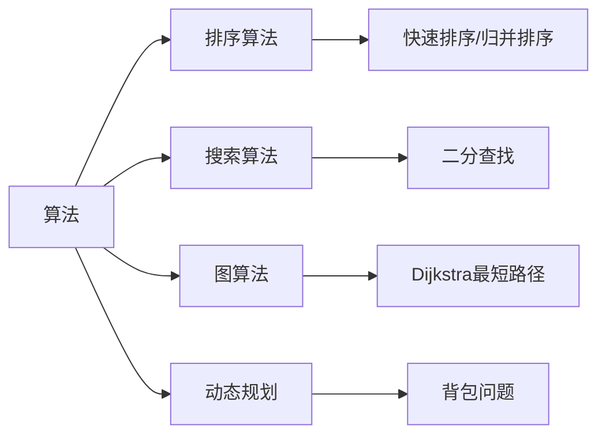

# 算法 - 算法和数据结构

[[toc]]

> 说在前面的话，本文为个人学习[B站免费的左程云算法结构基础课](https://www.bilibili.com/video/BV1Ef4y1T7Qi/?spm_id_from=333.788.recommend_more_video.1&vd_source=65c7f6924d2d8ba5fa0d4c448818e08a)后进行总结的文章，主要是以`Java`来运行算法.

> <b>算法</b>和<b>数据结构</b>是计算机科学的两大核心基石，它们共同构建了高效程序的骨架。

## 【1】算法（Algorithm）

### 【1.1】算法定义

> **定义**‌：解决特定问题的‌**步骤序列**‌，类似烹饪食谱。

### 【1.2】算法核心特性

> - **输入**‌ → 接收数据
> - **输出**‌ → 产生结果
> - **明确性**‌ → 每个步骤无歧义
> - **有限性**‌ → 在有限步骤内结束
> - **可行性**‌ → 能用基本操作实现

### 【1.3】算法关键衡量指标

> - **时间复杂度**‌：执行时间随输入规模的增长趋势（如 `O(n)`、`O(log n)`）
> - **空间复杂度**‌：内存占用随输入规模的增长趋势
> - **正确性**‌ → 能否解决问题
> - **可读性与健壮性**‌ → 代码是否易理解、能处理异常

### 【1.4】常见算法类型

## 【2】数据结构（Data Structure）

### 【2.1】数据结构定义

> **定义**‌：存储和组织数据的‌**特定方式**‌，类似收纳箱的设计。

### 【2.2】数据结构核心目的

> - **高效访问**‌ → 快速查找/修改数据
> - **优化内存**‌ → 减少空间浪费
> - **适配操作**‌ → 针对场景选择最佳结构

### 【2.3】常见数据结构对比

| 结构              | 特点                      | 典型应用            |
| ----------------- | ------------------------- | ------------------- |
| 数组(Array)       | 连续内存，随机访问快      | 按索引快速读取      |
| 链表(Linked List) | 非连续内存，插入删除快    | 动态大小集合        |
| 栈(Stack)         | 后进先出（LIFO）          | 函数调用栈/撤销操作 |
| 队列(Queue)       | 先进先出（FIFO）          | 任务调度/消息缓冲   |
| 哈希表(Hash Map)  | 键值对，平均O(1)查找      | 字典/缓存系统       |
| 树(Tree)          | 分层结构（如二叉树、B树） | 数据库索引/文件系统 |
| 图(Graph)         | 节点与边的关系网络        | 社交网络/路径规划   |

## 【3】**算法 + 数据结构 = 程序**‌

> 二者的关系如同 ‌<b>“灵魂与骨架”</b>：
>
> - ‌**数据结构决定数据如何存储**‌
>    → 选择链表还是数组存储100万条数据？
> - ‌**算法决定如何处理数据**‌
>    → 用冒泡排序(O(n²))还是快速排序(O(n log n))？
>
> ‌**经典案例**‌：
>
> - ‌**字典查询**‌：
>   - 用‌**哈希表**‌存储单词 → O(1)时间查词
>   - 若用无序数组 → 最坏O(n)时间遍历所有词
> - ‌**导航路径**‌：
>   - 用‌<b>图(Graph)</b> 存储道路节点
>   - 用‌**Dijkstra算法**‌计算最短路径

## 【4】为什么重要?

> 1. **性能差距**‌：
>     二分查找(`O(log n)`)比遍历查找(`O(n)`)快100万倍（当n=100万时）
> 2. ‌**资源优化**‌：
>     堆(`Heap`)管理内存的效率远高于无序列表
> 3. **问题建模能力**‌：
>     社交网络用图(`Graph`)建模好友关系 → 实现“好友推荐”

## 【5】参考资料

- [B站免费的左程云算法结构基础课](https://www.bilibili.com/video/BV1Ef4y1T7Qi/?spm_id_from=333.788.recommend_more_video.1&vd_source=65c7f6924d2d8ba5fa0d4c448818e08a)
