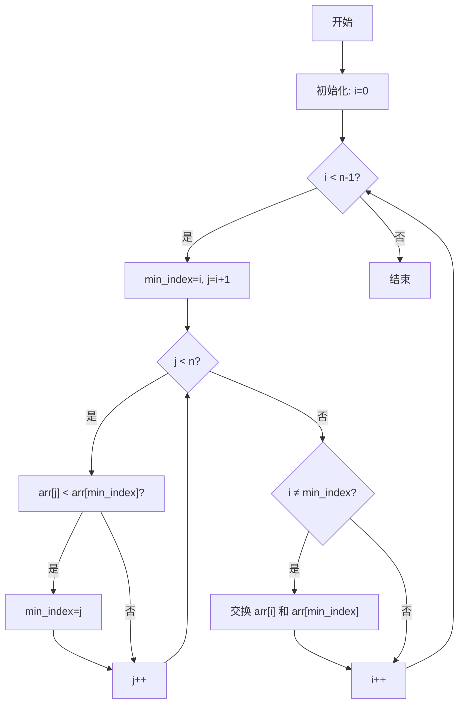

# 算法 - 选择排序

[[toc]]

> 说在前面的话，本文为个人学习[B站免费的左程云算法结构基础课](https://www.bilibili.com/video/BV1Ef4y1T7Qi/?spm_id_from=333.788.recommend_more_video.1&vd_source=65c7f6924d2d8ba5fa0d4c448818e08a)后进行总结的文章，主要是以`Java`来运行算法.

## 【1】定义

> - <b>选择排序（`Selection Sort`）</b>
>
> ::: info 定义
>
> <b>选择排序（`Selection Sort`）</b> 即 在随机数组中选择最小元素按照从小到大的顺序进行排序的过程。
>
> :::
>
> - <b>核心思想</b>
>   - 将数组分为‌**已排序区间**‌和‌**未排序区间**‌
>   - 每轮从未排序区间中选出‌**最小元素**‌
>   - 将该元素与未排序区间的‌**第一个元素**‌交换
>   - 重复上述过程直到数组完全有序

## 【2】算法流程图




## 【3】算法步骤说明

> - **初始化**‌
>    设置外层循环索引 `i=0`，表示当前待填充位置。
> - **遍历未排序序列**‌
>    内层循环从 `i+1` 到 `n-1`，寻找最小元素的索引 `min_index`。
>    `if arr[j] < arr[min_index]` 则更新 `min_index = j`。
> - ‌**交换元素**‌
>    若 `min_index ≠ i`，交换 `arr[i]` 和 `arr[min_index]`。
> - ‌**移动边界**‌
>    `i++` 后重复上述过程，直到 `i = n-2`（共执行 `n-1` 趟）。

## 【4】核心计算步骤

> - 具体步骤如下：
>   - **外层循环**‌：
>      从 `i = 0` 到 `i = n-2`（共 `n-1` 次），时间复杂度为 `O(n)`。
>   - **内层循环**‌：
>      每次外层循环中，内层循环从 `j = i+1` 到 `j = n-1`，比较次数依次为：
>     - 第1次外层：`n-1` 次比较
>     - 第2次外层：`n-2` 次比较
>     - ...
>     - 第`n-1`次外层：`1` 次比较
>        总比较次数 = `(n-1) + (n-2) + ... + 1 = n(n-1)/2`，即 `O(n²)`。
>   - **交换操作**‌：
>      每次外层循环最多交换1次（找到最小元素后与当前位置交换），交换次数为 `O(n)`，不影响整体时间复杂度。

> - **最终结果‌**
>   - **时间复杂度**‌：`O(n²)`（无论输入数据是否有序，均需执行相同次数的比较）。
>   - ‌**空间复杂度**‌：`O(1)`（原地排序，仅需常数级额外空间）。

## 【5】核心特性

> - ‌**时间复杂度**‌：固定为 `O(n²)`，无论数据是否有序。
> - ‌**空间复杂度**‌：`O(1)`（原地排序）。
> - ‌**不稳定性**‌：交换可能改变相等元素的原始顺序。

##  【6】代码示例

> ```java
> package com.learn.algorithm.business;
> 
> /**
>  * 选择排序算法
>  *
>  * @author qianpengzhan
>  * @since 2025/8/14 15:05
>  */
> public class SelectionSort {
>     public static void main(String[] args) {
> 
>     }
> 
>     // 选择排序 即  选择最小元素按照从小到大排序的算法过程
> 
>     public static void selectionSort(int[] arr) {
>         if (arr == null || arr.length < 2) {
>             // 数组为空 或者 元素数量 不足2个  排序无意义
>             return;
>         }
> 
>         // 第一轮: 1. 0 ~ N-1 进行遍历  2. (看+找)遍历的过程中每次都比较前后的数值 找出最小值  3.(换)替换当前值和最小值的下标
>         // 第二轮：1. 1 ~ N-1 进行遍历  2.同上 3.同上
>         // 第三轮: 1. 2 ~ N-1 进行遍历  2.同上 3.同上
>         // ...
>         // 第N轮:  1. N-1 ~ N-1 进行遍历  2.同上 3.同上
>         for (int i = 0; i < arr.length - 1; i++) {  // i ~ N-1
>             // 设定最小值下标
>             int minIndex = i;
>             for (int j = i + 1; j < arr.length; j++) {
>                 // 比较2数谁最小 找出最小的数的下标
>                 minIndex = arr[j] < arr[minIndex] ? j : minIndex;
>             }
>             // 替换当前值和最小值的下标
>             swap(arr, i, minIndex);
>         }
>     }
> 
>     /**
>      * 替换当前值和最小值的下标  即 交换2个数的位置
>      *
>      * @param arr       数组
>      * @param currIndex 当前值的下标
>      * @param minIndex  最小值的下表
>      */
>     public static void swap(int[] arr, int currIndex, int minIndex) {
>         int temp = arr[currIndex];
>         arr[currIndex] = arr[minIndex];
>         arr[minIndex] = temp;
>     }
>     
>         /**
>      * 异或交换原理
>      * <p>
>      * ‌第一次异或‌：arr[currIndex] ^ arr[minIndex]
>      * 将两数差异位保存到 arr[currIndex]（此时 arr[currIndex] 变为临时值）
>      * <p>
>      * ‌第二次异或‌：arr[currIndex] ^ arr[minIndex]
>      * 用临时值与 arr[minIndex] 异或，得到原始 arr[currIndex] 并存入 arr[minIndex]
>      * <p>
>      * ‌第三次异或‌：arr[currIndex] ^ arr[minIndex]
>      * 用临时值与新 arr[minIndex] 异或，得到原始 arr[minIndex] 并存入 arr[currIndex]
>      * <p>arr = [3,5], currIndex=0, minIndex=1：
>      * arr[0] = 3 ^ 5 = 6  // [6,5]
>      * arr[1] = 6 ^ 5 = 3  // [6,3]
>      * arr[0] = 6 ^ 3 = 5  // [5,3] 完成交换
>      *
>      * @param arr
>      * @param currIndex
>      * @param minIndex
>      */
>     private static void optSwap(int[] arr, int currIndex, int minIndex) {
>         arr[currIndex] = arr[currIndex] ^ arr[minIndex];
>         arr[minIndex] = arr[currIndex] ^ arr[minIndex];
>         arr[currIndex] = arr[currIndex] ^ arr[minIndex];
>     }
> }
> 
> ```

## 【7】对数器

> 以下是选择排序的对数器实现示例，用于验证选择排序算法的正确性

> ```java
> package com.learn.algorithm.business;
> 
> import java.util.Arrays;
> import java.util.Random;
> 
> /**
>  * 选择排序算法
>  *
>  * @author qianpengzhan
>  * @since 2025/8/14 15:05
>  */
> public class SelectionSort {
>     // 对数器主测试方法
>     public static void main(String[] args) {
>         int testTime = 500000;
>         int maxSize = 100;
>         int maxValue = 100;
>         boolean succeed = true;
> 
>         for (int i = 0; i < testTime; i++) {
>             int[] arr1 = generateRandomArray(maxSize, maxValue);
>             int[] arr2 = copyArray(arr1);
>             selectionSort(arr1);
>             comparator(arr2);
>             if (!isEqual(arr1, arr2)) {
>                 succeed = false;
>                 System.out.println("测试失败！");
>                 System.out.println("原数组：" + Arrays.toString(arr2));
>                 System.out.println("选择排序结果：" + Arrays.toString(arr1));
>                 break;
>             }
>         }
>         System.out.println(succeed ? "所有测试通过！" : "测试失败！");
>     }
> 
>     // 选择排序 即  选择最小元素按照从小到大排序的算法过程
>     // 待测试的选择排序实现
>     public static void selectionSort(int[] arr) {
>         if (arr == null || arr.length < 2) {
>             // 数组为空 或者 元素数量 不足2个  排序无意义
>             return;
>         }
> 
>         // 第一轮: 1. 0 ~ N-1 进行遍历  2. (看+找)遍历的过程中每次都比较前后的数值 找出最小值  3.(换)替换当前值和最小值的下标
>         // 第二轮：1. 1 ~ N-1 进行遍历  2.同上 3.同上
>         // 第三轮: 1. 2 ~ N-1 进行遍历  2.同上 3.同上
>         // ...
>         // 第N轮:  1. N-1 ~ N-1 进行遍历  2.同上 3.同上
>         for (int i = 0; i < arr.length - 1; i++) {  // i ~ N-1
>             // 设定最小值下标
>             int minIndex = i;
>             for (int j = i + 1; j < arr.length; j++) {
>                 // 比较2数谁最小 找出最小的数的下标
>                 minIndex = arr[j] < arr[minIndex] ? j : minIndex;
>             }
>             // 替换当前值和最小值的下标
>             swap(arr, i, minIndex);
>         }
>     }
> 
>     /**
>      * 替换当前值和最小值的下标  即 交换2个数的位置
>      *
>      * @param arr       数组
>      * @param currIndex 当前值的下标
>      * @param minIndex  最小值的下表
>      */
>     private static void swap(int[] arr, int currIndex, int minIndex) {
>         int temp = arr[currIndex];
>         arr[currIndex] = arr[minIndex];
>         arr[minIndex] = temp;
>     }
> 
>     /**
>      * 异或交换原理
>      * <p>
>      * ‌第一次异或‌：arr[currIndex] ^ arr[minIndex]
>      * 将两数差异位保存到 arr[currIndex]（此时 arr[currIndex] 变为临时值）
>      * <p>
>      * ‌第二次异或‌：arr[currIndex] ^ arr[minIndex]
>      * 用临时值与 arr[minIndex] 异或，得到原始 arr[currIndex] 并存入 arr[minIndex]
>      * <p>
>      * ‌第三次异或‌：arr[currIndex] ^ arr[minIndex]
>      * 用临时值与新 arr[minIndex] 异或，得到原始 arr[minIndex] 并存入 arr[currIndex]
>      * <p>arr = [3,5], currIndex=0, minIndex=1：
>      * arr[0] = 3 ^ 5 = 6  // [6,5]
>      * arr[1] = 6 ^ 5 = 3  // [6,3]
>      * arr[0] = 6 ^ 3 = 5  // [5,3] 完成交换
>      *
>      * @param arr
>      * @param currIndex
>      * @param minIndex
>      */
>     private static void optSwap(int[] arr, int currIndex, int minIndex) {
>         arr[currIndex] = arr[currIndex] ^ arr[minIndex];
>         arr[minIndex] = arr[currIndex] ^ arr[minIndex];
>         arr[currIndex] = arr[currIndex] ^ arr[minIndex];
>     }
> 
>     // 正确的排序方法（对数器基准）
>     public static void comparator(int[] arr) {
>         Arrays.sort(arr);
>     }
> 
>     // 随机数组生成器
>     public static int[] generateRandomArray(int maxSize, int maxValue) {
>         Random r = new Random();
>         int[] arr = new int[r.nextInt(maxSize + 1)];
>         for (int i = 0; i < arr.length; i++) {
>             arr[i] = r.nextInt(maxValue + 1) - r.nextInt(maxValue);
>         }
>         return arr;
>     }
> 
>     // 数组复制方法
>     public static int[] copyArray(int[] arr) {
>         if (arr == null) return null;
>         int[] res = new int[arr.length];
>         System.arraycopy(arr, 0, res, 0, arr.length);
>         return res;
>     }
> 
>     // 验证两个数组是否相同
>     public static boolean isEqual(int[] arr1, int[] arr2) {
>         if ((arr1 == null && arr2 != null) || (arr1 != null && arr2 == null)) {
>             return false;
>         }
>         if (arr1 == null) return true;
>         if (arr1.length != arr2.length) return false;
>         for (int i = 0; i < arr1.length; i++) {
>             if (arr1[i] != arr2[i]) {
>                 return false;
>             }
>         }
>         return true;
>     }
> }
> 
> 
> ```

> 1. **对数器组成**‌：包含随机数组生成、正确排序方法（基准）、待测排序方法和结果验证四部分
> 2. ‌**测试流程**‌：通过大量随机测试用例验证选择排序结果与系统排序结果的一致性
> 3. ‌**异常检测**‌：当发现不一致结果时立即停止并输出错误案例
> 4. ‌**扩展性**‌：可调整`testTime`、`maxSize`等参数控制测试强度
>
> - 该对数器可有效验证选择排序的正确性，并帮助发现边界条件错误。对于其他排序算法，只需替换`selectionSort`方法即可复用该测试框架

## 【8】参考资料

- [B站免费的左程云算法结构基础课](https://www.bilibili.com/video/BV1Ef4y1T7Qi/?spm_id_from=333.788.recommend_more_video.1&vd_source=65c7f6924d2d8ba5fa0d4c448818e08a)