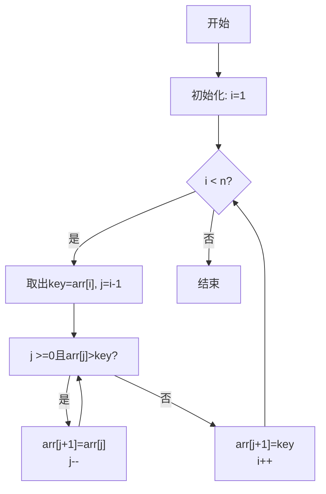

# 算法 - 插入排序

[[toc]]

> 说在前面的话，本文为个人学习[B站免费的左程云算法结构基础课](https://www.bilibili.com/video/BV1Ef4y1T7Qi/?spm_id_from=333.788.recommend_more_video.1&vd_source=65c7f6924d2d8ba5fa0d4c448818e08a)后进行总结的文章，主要是以`Java`来运行算法.

## 【1】定义

> - <b>插入排序 （Insertion Sort）</b>
>
> ::: info 定义
>
> <b>插入排序 （Insertion Sort）</b>‌ 是一种简单的排序算法，通过构建有序序列，对未排序数据从后向前扫描，将每个元素插入到已排序序列中的适当位置。
>
> :::
>
> - <b>核心思想</b>
>
> ::: info 核心思想
>
> <b>插入排序 （Insertion Sort）</b>的核心思想是 ‌**“分治有序”**‌，通过 ‌**逐步构建有序子序列**‌ 的方式完成排序。
>
> :::

## 【2】算法流程图

> 以下是<b>插入排序 （Insertion Sort）</b>‌ 算法的 `Mermaid` 流程图代码，可直接在支持 Mermaid 的编辑器（如 `Markdown`、`Obsidian `等）中渲染：



> **流程图说明**‌：
>
> 1. ‌**初始化**‌：从第二个元素开始遍历（i=1）
> 2. ‌**循环条件**‌：检查是否处理完所有元素
> 3. ‌**插入操作**‌：将当前元素(key)与有序区元素从后向前比较，移动比key大的元素
> 4. ‌**终止条件**‌：当找到合适位置或到达有序区起点时插入key
> 5. ‌**循环递增**‌：i++处理下一个元素
>
> 该流程图完整展示了插入排序的 ‌**比较-移动-插入**‌ 核心过程

## 【3】算法步骤说明

> 以下是<b>插入排序 （Insertion Sort）</b>‌ 的详细算法步骤说明
>
> - **初始化有序区**
>   - ‌将数组的第一个元素视为已排序的子序列（长度为1），其余部分为待排序区
>
> - **遍历未排序元素**
>   - 从第二个元素开始（索引 `i=1`），依次将每个元素作为待插入的 `key`。
>   - ‌**循环条件**‌：直到处理完所有未排序元素（`i < n`，`n` 为数组长度）。‌
>
> - **插入操作**
>   - 对当前 `key` 执行以下步骤：
>     1. ‌从后向前比较：从有序区的最后一个元素（索引 `j=i-1`）开始向前遍历：
>        - 若 `arr[j] > key`，则将 `arr[j]` 后移一位。
>        - 否则终止比较（找到 `key` 的正确插入位置）。
>     2. ‌**插入 `key`**‌：将 `key` 放入 `arr[j+1]` 的位置
> - ‌**动态扩展有序区**‌
>   - 每轮插入后，有序区长度 `+1`，未排序区 `-1`。
>   - 重复步骤2-3，直到所有元素有序。

## 【4】复杂度计算

> <b>插入排序 （Insertion Sort）</b>‌的时间复杂度计算过程如下，分不同情况讨论：

### 【4.1】最好情况（已有序数组）

> - ‌**操作次数**‌：只需遍历数组一次，每次比较仅需1次（无需移动元素）。
> - ‌**公式**‌：比较次数 = n-1 次。
> - ‌**结果**‌：时间复杂度为 ‌**O(n)**‌。
>
> ------

### 【4.2】最坏情况（完全逆序数组）

> - ‌**操作次数**‌：每个元素需比较并移动所有已排序元素。
> - ‌**公式**‌：比较次数 = `1 + 2 + ... + (n-1) = n(n-1)/2` 次。
> - ‌推导‌：
>   - 等差数列求和公式：`S = (首项 + 末项) × 项数 / 2 = (1 + n-1) × (n-1) / 2`。
>   - 最高次项为 `n²/2`，忽略低阶项后为 ‌**O(n²)**‌。
>
> ------

### 【4.3】平均情况（随机排列数组）

> - ‌**操作次数**‌：每个元素平均需比较约有序区的一半长度（n/2 次）。
> - ‌**公式**‌：总比较次数 ≈ n × n/2 = n²/2 次。
> - ‌**结果**‌：时间复杂度仍为 ‌**O(n²)**‌。
>
> ------

### 【4.4】空间复杂度

> - ‌**额外空间**‌：仅需常数级临时变量（如 `key`、`j`）。
> - ‌**结果**‌：空间复杂度为 ‌**O(1)**‌（原地排序）。
>
> ------

### 【4.5】**关键结论**‌

> - ‌**稳定性**‌：插入排序是稳定的，相同元素相对位置不变。
> - ‌**适用场景**‌：小规模数据或基本有序数据效率较高。

## 【5】核心思想分解

### 【5.1】分治策略：有序区 vs. 无序区

> - ‌**有序区**‌：初始时，数组的第一个元素被视为已排序的子序列（长度为1）。
> - ‌**无序区**‌：剩余部分为待排序元素，逐步插入到有序区中。
> - ‌**动态扩展**‌：每轮将一个无序区的元素插入到有序区的正确位置，有序区长度递增。
>
> ------

### 【5.2】核心操作：比较与插入

> 对于当前无序区的元素（`key`），执行以下步骤：
>
> 1. ‌**从后向前比较**‌：从有序区的最后一个元素开始，向前逐个比较。
> 2. ‌**移动元素**‌：若 `key` 小于当前比较元素，则将比较元素后移一位（腾出插入位置）。
> 3. ‌**插入终止**‌：当找到 `key` 应插入的位置（或到达有序区起点），将 `key` 放入该位置。
>
> ‌**关键点**‌：通过 ‌**“先移动再插入”**‌ 的方式逐步扩展有序区。
>
> ------

### 【5.3】直观类比

> 想象整理一副扑克牌：
>
> 1. ‌**初始状态**‌：左手持牌（已排序），右手拿新牌（待插入）。
> 2. ‌**插入过程**‌：从左到右比较新牌，找到合适位置插入，确保左手牌始终有序。

## 【6】算法特性

> - **优点**‌：
>
>   - 简单直观，适合小规模数据或部分有序数组。
>
>   - 原地排序（空间复杂度 `O(1)`）。
>
>   - 稳定排序（相等元素不交换）。
>
> -  ‌**缺点**‌：
>   - 最坏时间复杂度 `O(n²)`（逆序数组），但实际应用中若数据接近有序，性能接近 `O(n)`。

## 【7】适用场景

> - **小规模数据**‌（如 `n < 100`）。
> - **部分有序数据**‌（如日志时间戳排序、数据流中的实时排序）。
> - **作为更复杂算法（如快速排序）的子过程**‌，处理小分段数据。

## 【8】代码示例

> ```java
>     // 标准插入排序实现
>     public static void insertionSort(int[] arr) {
>         if (arr == null || arr.length < 2) return;
>         // 遍历所有元素
>         for (int i = 1; i < arr.length; i++) {
>             int key = arr[i];
>             // 从最后开始比较
>             int j = i - 1;
>             while (j >= 0 && arr[j] > key) {
>                 arr[j + 1] = arr[j];
>                 j--;
>             }
>             arr[j + 1] = key;
>         }
>     }
> ```

## 【9】对数器

> 以下是插入排序的对数器（验证器）Java代码示例，包含随机数组生成、排序验证和性能测试功能：

> ```java
> package com.learn.algorithm.business;
> 
> import java.util.Arrays;
> import java.util.Random;
> 
> /**
>  * 插入排序
>  *
>  * @author qianpengzhan
>  * @since 2025/8/15 16:39
>  */
> public class InsertionSort {
>     // 标准插入排序实现
>     public static void insertionSort(int[] arr) {
>         if (arr == null || arr.length < 2) return;
>         // 遍历所有元素
>         for (int i = 1; i < arr.length; i++) {
>             int key = arr[i];
>             // 从最后开始比较
>             int j = i - 1;
>             while (j >= 0 && arr[j] > key) {
>                 arr[j + 1] = arr[j];
>                 j--;
>             }
>             arr[j + 1] = key;
>         }
>     }
> 
>     // 对数器：生成随机测试数组
>     public static int[] generateRandomArray(int maxSize, int maxValue) {
>         Random random = new Random();
>         int[] arr = new int[random.nextInt(maxSize + 1)];
>         for (int i = 0; i < arr.length; i++) {
>             arr[i] = random.nextInt(maxValue + 1) - random.nextInt(maxValue);
>         }
>         return arr;
>     }
> 
>     // 验证排序是否正确
>     public static boolean isSorted(int[] arr) {
>         if (arr.length < 2) return true;
>         for (int i = 1; i < arr.length; i++) {
>             if (arr[i - 1] > arr[i]) return false;
>         }
>         return true;
>     }
> 
>     // 对数器主测试方法
>     public static void main(String[] args) {
>         int testTimes = 50000;
>         int maxSize = 100;
>         int maxValue = 1000;
>         boolean succeed = true;
> 
>         for (int i = 0; i < testTimes; i++) {
>             int[] arr1 = generateRandomArray(maxSize, maxValue);
>             int[] arr2 = Arrays.copyOf(arr1, arr1.length);
> 
>             insertionSort(arr1); // 测试排序
>             Arrays.sort(arr2);   // 对照排序
> 
>             if (!Arrays.equals(arr1, arr2)) {
>                 succeed = false;
>                 System.out.println("测试失败：");
>                 System.out.println("原始数组：" + Arrays.toString(arr1));
>                 System.out.println("对照数组：" + Arrays.toString(arr2));
>                 break;
>             }
>         }
> 
>         System.out.println(succeed ? "所有测试通过！" : "存在错误案例！");
>     }
> }
> 
> ```
>
> 代码功能说明：
>
> 1. 核心方法`insertionSort`实现标准插入排序算法
> 2. `generateRandomArray`生成随机长度和随机值的测试数组
> 3. `isSorted`方法验证数组是否有序
> 4. 主方法通过50000次随机测试验证排序正确性
> 5. 使用`Arrays.sort`作为对照标准验证自定义排序结果
>
> 特点：
>
> - 自动化批量测试验证排序正确性
> - 支持自定义测试规模和数值范围
> - 错误案例自动打印便于调试
> - 可作为其他排序算法的验证模板

## 【10】总结

> <b>插入排序 （Insertion Sort）</b>的核心思想是 ‌**“逐步构建有序序列”**‌，通过 ‌**分治有序区与无序区**‌，并 ‌**动态插入**‌ 完成排序。虽然效率不如高级算法（如快速排序、归并排序），但其简单性和稳定性使其在特定场景下仍具实用价值。

## 【11】参考资料

- [B站免费的左程云算法结构基础课](https://www.bilibili.com/video/BV1Ef4y1T7Qi/?spm_id_from=333.788.recommend_more_video.1&vd_source=65c7f6924d2d8ba5fa0d4c448818e08a)

