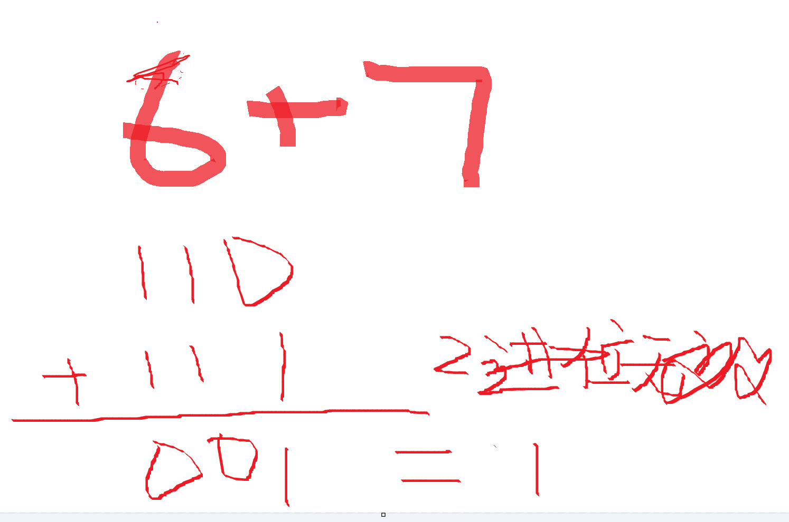

# 算法 - 异或运算

[[toc]]

> 说在前面的话，本文为个人学习[B站免费的左程云算法结构基础课](https://www.bilibili.com/video/BV1Ef4y1T7Qi/?spm_id_from=333.788.recommend_more_video.1&vd_source=65c7f6924d2d8ba5fa0d4c448818e08a)后进行总结的文章，主要是以`Java`来运行算法.

## 【1】定义

> <b>异或运算（XOR）</b>是一种<b>二进制位运算</b>，符号通常表示为`^`

## 【2】运算规则

> - 相同为0：`0 ^ 0 = 0, 1 ^ 1 = 1`
> - 相异为1：`0 ^ 1 = 1, 1 ^ 0 = 1`

>  总结： 不要记上面的公式，直接对数值进行2进制转换后，进行列竖式计算，2进制加法，无进位加法计算即可。例如：
>
> 

## 【3】主要特性

> 1. 交换律：`a ^ b = b ^ a`
> 2. 结合律：`a ^  ( b ^ c)  =  (a ^ b ) ^ c`
> 3. 自反性：`a ^ a = 0`
> 4. 恒等性：`a ^ 0 = a`
> 5. 可逆性：`a ^ b ^ b = a`

## 【4】常用场景

> - 交换两个变量的值（无需临时变量）
> - 数据加密/解密
> - 校验数据完整性
> - 寻找出现奇数次的数字
> - 位操作算法

## 【5】代码示例

```java
package com.learn.algorithm.business;

/**
 * 异或运算测试
 *
 * @author qianpengzhan
 * @since 2025/8/19 14:20
 */
public class XORTest {
    public static void main(String[] args) {
        // 基本运算
        System.out.println(5 ^ 3); // (0101 ^ 0011 = 0110 = 6)  输出6

        // 交换变量 这个就是算法这块需要的
        int a = 6;
        int b = 7;
        // 注意： 这里交换的时候 a b 2个值指向的内存不能是同一块内存
        a = a ^ b;   // 赋值a的操作 b的值不变为7  a = 6 ^ 7, b = 7
        b = a ^ b;   // 赋值b的操作 a的指不变为 6 ^ 7  a= 6 ^ 7, b = 6 ^ 7 ^ 7 = 6 ^ 0 = 6  自反性  恒等性
        a = a ^ b;   // 赋值a的操作 b的值不变为6  a = 6 ^ 7 ^ 6 = 0 ^ 7 = 7, b = 6
        System.out.println(a);
        System.out.println(b);

        // 找出数组中唯一出现奇数次的数字
        int[] nums = {1, 2, 3, 2, 1};
        int result = 0;
        for (int i = 0; i < nums.length; i++) {
            result ^= nums[i];  // 利用自反性 + 恒等性 = 可逆性
        }
        System.out.println("唯一出现奇数次的数字为：" + result); // 3

        // 简单加密
        String message = "Hello World";
        char key = 'X';
        System.out.println("加密前： " + message);
        char[] encrypted = new char[message.length()];
        for (int i = 0; i < message.length(); i++) {
            encrypted[i] = (char) (message.charAt(i) ^ key);
        }
        System.out.println("加密后：" + new String(encrypted));

        // 简单解密
        char[] decrypted = new char[encrypted.length];
        for (int i = 0; i < encrypted.length; i++) {
            decrypted[i] = (char) (encrypted[i] ^ key);
        }
        System.out.println("解密后的值： " + new String(decrypted));
    }
}
```

> 运行后的结果：
>
> 6
> 7
> 6
> 唯一出现奇数次的数字为：3
> 加密前： Hello World
> 加密后：=447x7*4<
> 解密后的值： Hello World

> 解析：
>
> 1. 演示了异或运算的基本用法和特性
> 2. 包含变量交换、查找奇数次数字等经典应用
> 3. 实现了简单的加密解密功能
> 4. 所有示例都有清晰的输出结果
> 5. 代码可直接运行测试不同场景下的异或运算效果

## 【6】参考资料

- [B站免费的左程云算法结构基础课](https://www.bilibili.com/video/BV1Ef4y1T7Qi/?spm_id_from=333.788.recommend_more_video.1&vd_source=65c7f6924d2d8ba5fa0d4c448818e08a)

