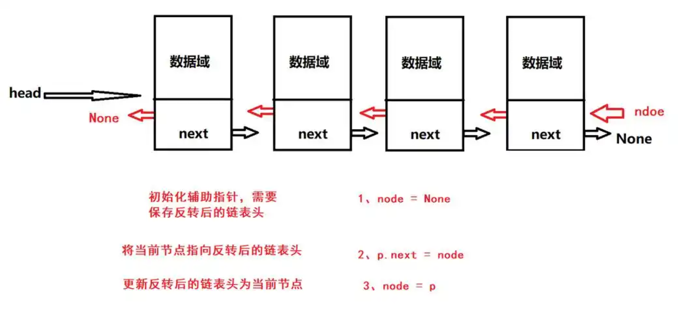
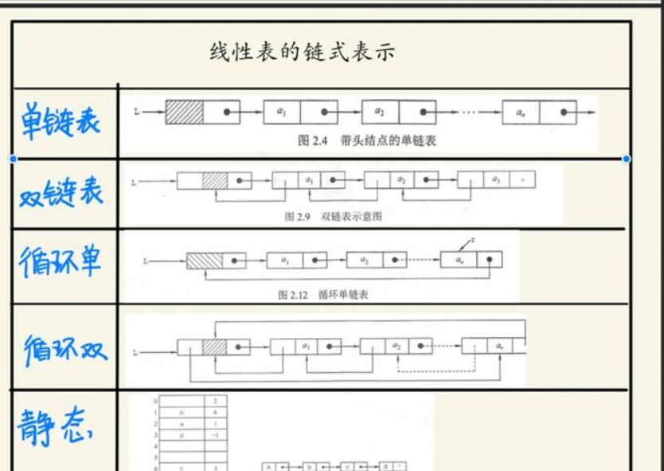

# 算法 - 链表结构

[[toc]]

> 说在前面的话，本文为个人学习[B站免费的左程云算法结构基础课](https://www.bilibili.com/video/BV1Ef4y1T7Qi/?spm_id_from=333.788.recommend_more_video.1&vd_source=65c7f6924d2d8ba5fa0d4c448818e08a)后进行总结的文章，主要是以`Java`来运行算法.

## 【1】链表结构

> <b>链表</b>是一种物理存储结构上非连续、非顺序的存储结构，数据元素的逻辑顺序是通过链表中的指针链接次序实现的‌

## 【2】核心组成和定义

> - <b>节点结构</b>：每个节点包含两个部分：
>   - <b>数据域</b>：存储具体数据元素
>   - <b>指针域</b>：存储指向下一个节点的地址（单链表）或同时存储前驱和后继地址（双向链表）‌
> - <b>逻辑结构</b>
>   - 通过指针形成链式连接，逻辑上连续
>   - 物理存储位置可以离散分布‌



## 【3】主要特性

> 1. <b>动态扩展性</b>：无需预分配内存，按需创建节点‌
> 2. <b>高效增删</b>：插入/删除操作时间复杂度为`O(1)`（已知位置时）‌
> 3. <b>随机访问劣势</b>：需从头遍历，时间复杂度`O(n)‌`
> 4. ‌<b>内存开销</b>：每个节点需额外存储指针信息‌

## 【4】分类和变体

> - <b>单链表</b>：每个节点仅含指向下一个节点的指针‌
> - <b>双向链表</b>：节点包含指向前驱和后继的两个指针‌
> - <b>循环链表</b>：尾节点指针指向头节点形成环状结构‌
> - <b>带头链表</b>：额外设置不存储数据的头节点简化操作‌



## 【5】代码实现

### 【5.1】单链表

> - <b>代码示例</b>
>
> ```java
> package com.learn.algorithm.datastructure;
> 
> /**
>  * 链表结构 - 单链表
>  *
>  * @author qianpengzhan
>  * @since 2025/8/21 13:19
>  */
> public class SingleLinkedListStructureTest {
> 
>     // 单链的头节点
>     private Node head;
>     // 单链的大小
>     private int size;
> 
>     public static void main(String[] args) {
>         SingleLinkedListStructureTest test = new SingleLinkedListStructureTest();
>         test.append(1);
>         test.append(2);
>         test.append(3);
>         test.append(4);
>         test.printList();  // 1 -> 2 -> 3 -> 4 -> null
>         test.prepend(0);
>         test.prepend(-1);
>         test.printList(); // -1 -> 0 -> 1 -> 2 -> 3 -> 4 -> null
>         test.delete(3);
>         test.printList(); // -1 -> 0 -> 1 -> 2 -> 4 -> null
>     }
> 
>     // 添加新的元素节点到尾部
>     public void append(int val) {
>         // 新元素的节点
>         Node newNode = new Node(val);
>         if (head == null) {
>             // 若头节点为null 那么刚添加的则是头节点
>             head = newNode;
>         } else {
>             // 若已经存在了头节点 列出来
>             Node current = head;
>             // 遍历所有已经存在的节点 得到最后1个节点
>             while (current.next != null) {
>                 current = current.next;
>             }
>             // 最后1个节点的next为新节点 则添加到末尾了
>             current.next = newNode;
>         }
>         // 节点数自增
>         size++;
>     }
> 
>     // 头部插入节点
>     public void prepend(int val) {
>         Node newNode = new Node(val);
>         // 直接在头部节点之间插入1个节点  则新界点的next为原头部节点 头部节点=head
>         newNode.next = head;
>         // 直接替换掉了节点即可
>         head = newNode;
>         size++;
>     }
> 
>     // 删除节点
>     public boolean delete(int val) {
>         if (head == null) {
>             return false;
>         }
>         if (head.data == val) {
>             head = head.next;
>             size--;
>             return true;
>         }
>         Node current = head;
>         while (current.next != null) {
>             if (current.next.data == val) {
>                 current.next = current.next.next;
>                 size--;
>                 return true;
>             }
>             current = current.next;
>         }
>         return false;
>     }
> 
>     // 打印链表
>     public void printList() {
>         Node current = head;
>         while (current != null) {
>             System.out.print(current.data + " -> ");
>             current = current.next;
>         }
>         System.out.println("null");
>     }
> 
>     // 节点
>     public static class Node {
> 
>         // 数据域
>         private int data;
>         // 指针域
>         private Node next;
> 
>         public Node(int data) {
>             this.data = data;
>             this.next = null;
>         }
>     }
> }
> ```
>
> - <b>图解</b>
>
> ```text
> [Head] → [0|•] → [1|•] → [3|•] → null
> ```
>
> 1. 每个方框表示节点，包含数据域和指针域
> 2. 箭头表示指针引用关系
> 3. null表示链表结束
>
> - <b>核心特性</b>
>
> 1. 动态内存分配：节点在内存中非连续存储
> 2. 高效增删：已知位置时操作时间复杂度O(1)
> 3. 顺序访问：必须从头节点开始遍历
> 4. 空间开销：每个节点需额外存储指针
>
> - <b>实现功能</b>
>
> 1. 支持头部/尾部插入节点
> 2. 实现节点删除功能
> 3. 包含链表遍历打印方法
> 4. 维护链表长度计数器
> 5. 提供完整可运行的测试案例
>
> - <b>与数组相比，它的优势</b>
>
> | 特性         | 单链表       | 数组             |
> | ------------ | ------------ | ---------------- |
> | 插入删除效率 | O(1)         | O(n)             |
> | 内存利用率   | 动态分配     | 需预分配连续空间 |
> | 随机访问效率 | O(n)         | O(1)             |
> | 空间复杂度   | 额外指针开销 | 无额外开销       |

### 【5.2】双向链表

> - 

## 【X】参考资料

- [B站免费的左程云算法结构基础课](https://www.bilibili.com/video/BV1Ef4y1T7Qi/?spm_id_from=333.788.recommend_more_video.1&vd_source=65c7f6924d2d8ba5fa0d4c448818e08a)