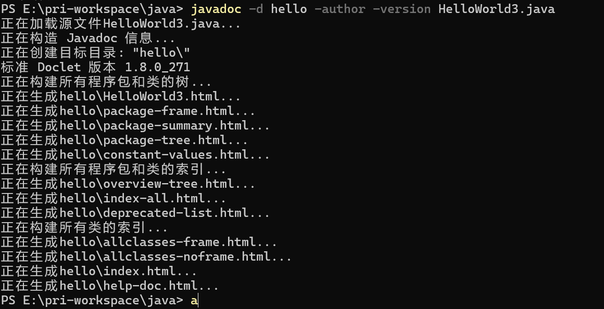
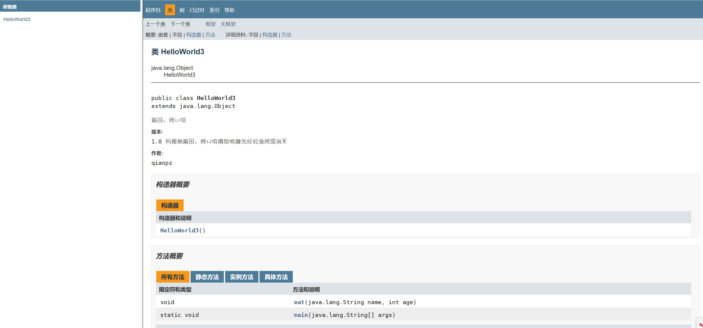

## JAVA基础知识 \- 学习注释

[[TOC]]

> 说在前面的话，本文为个人学习各类视频、他人文章等多渠道后进行总结、摘抄的文章，本文主要用于<b>JAVA基础知识</b>。

### 【1】多行注释

> 语法：
>
> 多行注释写法：
>
> /*  您输入的内容 */
>
> /*
>
> 您输入的内容
>
> */

下面这边给出一段nodePad++编写的含注释的代码讲解下：

``` java
//下面是一段标准代码
//这是代码的“框子”，当前阶段你可以当做一个模板
//其实这就是一个类，类的名字是HelloWorld，这个名字可以随便起，但是一般首字母大写，驼峰命名，见名知意
public class HelloWorld{
        //下面是一个main方法，方法的格式是固定的
        public static void main(String[] args){
                //下面这句话的作用：将双引号中的内容进行原样输出
                /*
                这是多行注释
                每行都可以写
                单行注释和多行注释，按照你自己的需求去使用即可
                */
                System.out.println("hi....java");
        }
}
```

### 【2】 文档注释

> 语法：
>
> 多行注释写法：
>
> /** 您输入的内容 */
>
> /**
>
> 您输入的内容
>
> */

下面这边给出一段nodePad++编写的含注释的代码讲解下：

``` java
/**
文档注释
@author qianpz
@version 1.0
这是文档注释的代码，比较重要
*/
public class HelloWorld3{
	public static void main(String[] args){	
			System.out.println("hi....java1");	
	}
	/**
	@param name 姓名
	@param age 年龄
	*/
	public void eat(String name,int age){
			System.out.println("hello");	
	}
}
```

一般文档注释可以配合：jdk提供的工具javadoc.exe来一起使用，通过javadoc.exe可以对文档注释进行解析，生成一套以网页文件形式体现的该程序的说明文档。（自定义类对应的API）

``` shell
javadoc -d hello -author -date HelloWorld3.java
```





存在编码问题，这个忽略。基本实现了文档注释生成API了

### 【3】单行注释

> 语法：
>
> // 

``` java
public class HelloWorld2{
        public static void main(String[] args){	
                System.out.println("hi....java1");
                //System.out.println("hi....java2")
                System.out.println("hi....java3");
        }
}
```

### 【4】注释的作用

1. 注释不会参与编译，编译后产生的字节码文件中不会有注释的内容
2. 注释的作用：
   1. 注释就起到了标注解释的作用，提高代码的可读性，方便自己，方便他人
   2. 是一个非常良好，非常专业的习惯！！！
   3. 方便代码的调试

