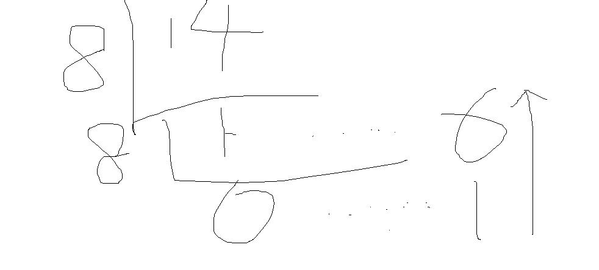
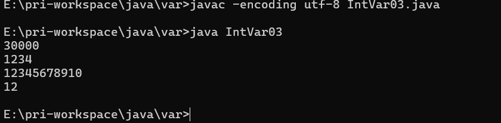
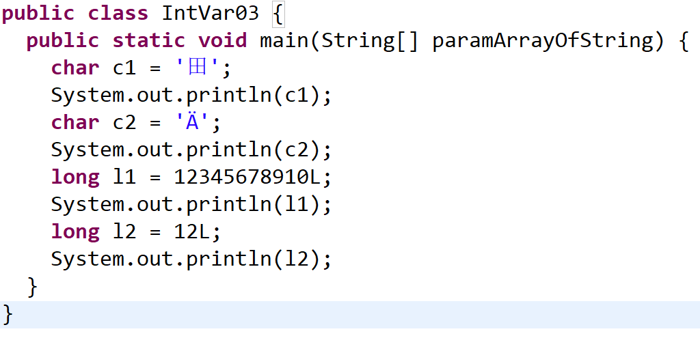

## JAVA基础知识 \- 基本数据类型

[[TOC]]

> 说在前面的话，本文为个人学习各类视频、他人文章等多渠道后进行总结的文章，本文主要用于<b>JAVA基础知识</b>。

### 【1】本文重点

Java是一种**强类型语言** ，每个变量都必须声明其数据类型。 

Java的数据类型可分为两大类：**基本数据类型（primitive data type）** 和**引用数据类型（reference data type）** 。


巧妙记忆：除了基本数据类型以外的所有类型都属于引用数据类型，本文重点：**基本数据类型（primitive data type）**

### 【2】整数类型

#### 【2.1】整数类型的常量

- 首先，我们需要了解下进制？

**十进制** 整数，如：99, -500, 0

**八进制** 整数，要求以 0 开头，如：015

**十六进制** 数，要求 0x 或 0X 开头，如：0x15

**二进制** ：要求0b或者0B开头，如：0b11

几进制：就是逢几进1的问题

平时实际生活中用的最多的是：**十进制** 

计算机用**二进制** 最多

以下这张图则是不同进制下的常量


- 进制之间的转换

  - 二进制转换为十进制

    二进制数： 1101

    ``` java
        1*2^3  +   1*2^2   +  0*2^1  +     1*2^0
    =    8         +      4       +     0       +      1
    =  13
    ```

  - 十进制转换为二进制

    十进制数 13

    若要转为二进制，则对2求余数，一直到为0为止，然后余数倒排，则为二进制数

    

    所以，十进制数13转为二进制数为1101.

  - 八进制转换十进制

    八进制： 16

    ``` java
    1 * 8^1 +   6 * 8^0
    =   8     +  6
    =14
    ```

  - 十进制转为八进制

    若要转为八进制，则对8求余数，一直到为0为止，然后余数倒排，则为二进制数

    

    所以十进制数14转为八进制数为16.

  - 八进制转换为十六进制

    把十进制当做一个中转站：

    先把八进制转为十进制,再把十进制数转为十六进制即可。

  

#### 【2.2】整数类型的变量

首先，我们先了解下Java中有哪些整数类型：

| 类型  | 占用存储空间 |                         数值范围                          |
| :---: | :----------: | :-------------------------------------------------------: |
| byte  |   1个字节    |               $-2^7$ ~ $2^7$ -1  (-128~127)               |
| short |   2个字节    |         - $2^{15}$ ~ $2^{16}$ -1 (-32768 ~ 32767)         |
|  int  |   4个字节    | - $2^{31}$ ~ $2^{32}$ -1 (-2147483648~ 2147483647) 约21亿 |
| long  |   8个字节    |                 - $2^{63}$ ~ $2^{63}$ -1                  |

然后通过几段代码，演示下如何声明并赋值整数类型的变量：

::: important  演示整数类型的变量的声明和赋值

```java
// 演示整数类型的变量的声明和赋值
public class IntVar01 {
	public static void main(String[] args) {
		// 定义整数类型的变量 通过赋值不同进制的值进行演示
		// 通常为十进制
		int num1 = 12;
		System.out.println(num1);
		// 十进制的值前面加个0  就是8进制
		int num2 = 012;
		System.out.println(num2);
		// 十进制的值前面加个0x或者0X  就是十六进制
		int num3 = 0x12;
		System.out.println(num3);
		// 十进制的值前面加个0b或者0B  就是二进制
		int num4 = 0b10;
		System.out.println(num4);
	}
}
```

:::

然后编译下， `javac -encoding utf-8 IntVar01.java`

执行下编译后的代码： `java IntVar01`


 可以发现，输出的都是十进制，但是定义都是按照不同的进制进行定义的。

再打开看下编译后的代码：


我们可以发现，我们定义是int, 但是实际上编译为 byte了。值都被转完成了，这就解释了为什么执行后都是十进制了。

::: important 演示整数类型的变量的声明和赋值  byte类型

``` java
// 演示整数类型的变量的声明和赋值 byte
public class IntVar02 {
	public static void main(String[] args) {
		// 定义byte整数类型的变量 通过赋值不同进制的值进行演示
		//定义byte类型的变量：
		byte b = 126;//定义了一个byte类型的变量，名字叫b，赋值为126
		System.out.println(b);
		//注意：超范围的赋值会报错。
		//byte b1 = 128;//定义了一个byte类型的变量，名字叫b，赋值为128
		//System.out.println(b1);
	}
}
```

:::

可以看到上述代码,先不开放注释，我们编译执行如下：

`javac -encoding utf-8 IntVar02.java`

`java IntVar02`


编译后的代码如下：


正常输出。

然后开放超出范围的代码注释，编译下：

`javac -encoding utf-8 IntVar02.java`


可以看到在编译阶段就直接报错了，故我们定义变量不可以超出它的数值范围。

那么我们直接通过代码介绍下其他的变量声明

::: important 演示整数类型的变量的声明和赋值  short  long 类型

``` java
// 演示整数类型的变量的声明和赋值 short  long 类型
public class IntVar03 {
	public static void main(String[] args) {
		// 定义short  long 类型整数类型的变量 通过赋值不同进制的值进行演示
		//定义short  long 类型的变量：
		short s = 30000;  // ASCII码中的‘田’
		System.out.println(s); //ASCII码中的'A'
        // short或int变量编译后转为char时，实际上是将其转为对应的Unicode字符  涉及基本数据类型之间的转换，后续再说
		int i = 1234;
		System.out.println(i);
		//整数类型默认就是int类型的，所以12345678910是一个int类型的数，对于int类型来说，它超出范围了
		//要想把一个数给long类型变量，那么后面加上L(推荐)或者l就可以了
		long num1 = 12345678910L;
		System.out.println(num1);
		//注意：只有这个数超出int类型的范围了后面才需要加上L，否则无需加L也可以赋值给long类型：
		long num2 = 12;
		System.out.println(num2);
	}
}
```

:::

编译执行下：

`javac -encoding utf-8 IntVar03.java`

`java IntVar03`





这里可以看到，有些比较特殊。

- short怎么转为char了?
- int 编译后为char了？

注释上已经进行了说明，但是还是比较重要的，涉及基本数据类型之间的转换，后续再说。

### 【3】浮点数类型

#### 【3.1】 浮点数类型常量

::: info 浮点数类型的常量

- （1）十进制数形式，例如:   3.14 , 314.0, 0.31
- （2）科学记数法形式，如
  - $314e2$ ，   $314E2$  (E的大小写没有区分)  ， $314E{-2}$    
  - $double  f = 314e2$    $//314*10^2-->31400.0$
  - $double  f2 = 314e-2;$      $//314*10^{-2}-->3.14$    

::: 

#### 【3.2】浮点数类型变量

::: info 浮点数类型的变量  

- **float** 
  - float类型又被称作单精度类型，尾数可以精确到7位**有效数字** 
  - float类型的数值有一个后缀F或者f ，没有后缀F/f的浮点数值默认为double类型
- **double** 
  - 在很多情况下，float类型的精度很难满足需求, double表示这种类型的数值精度约是float类型的两倍，又被称作双精度类型，绝大部分应用程序都采用double类型。
  - 也可以在浮点数值后添加后缀D或者d， 以明确其为double类型。
- **有效数字** 
  - **有效数字** 指的是从左开始第一个不为0的数到最后一个数

:::

|  类型  | 占用存储空间 |                       数值范围                        |
| :----: | :----------: | :---------------------------------------------------: |
| float  |    4字节     |    大约 $±3.402 823 47E±38 F$  （有效位数为6~7位）    |
| double |    8字节     | 大约 $±1.79769313486231570 E+308$ (有效位数为15~16位) |

下面就通过1段代码进行演示下：

::: info  浮点数类型的变量的代码演示

``` java

```

::: 

