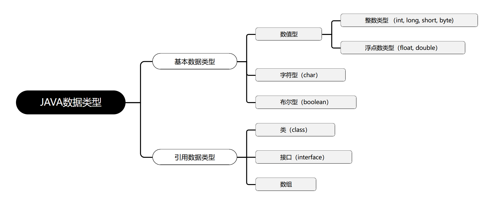

## JAVA基础知识 \- 基本数据类型

[[TOC]]

> 说在前面的话，本文为个人学习各类视频、他人文章等多渠道后进行总结的文章，本文主要用于<b>JAVA基础知识</b>。

### 【1】本文重点

Java是一种**强类型语言** ，每个变量都必须声明其数据类型。 

Java的数据类型可分为两大类：**基本数据类型（primitive data type）** 和**引用数据类型（reference data type）** 。



巧妙记忆：除了基本数据类型以外的所有类型都属于引用数据类型，本文重点：**基本数据类型（primitive data type）**

### 【2】整数类型

#### 【2.1】整数类型的常量

- 首先，我们需要了解下进制？

**十进制** 整数，如：99, -500, 0

**八进制** 整数，要求以 0 开头，如：015

**十六进制** 数，要求 0x 或 0X 开头，如：0x15

**二进制** ：要求0b或者0B开头，如：0b11

几进制：就是逢几进1的问题

平时实际生活中用的最多的是：**十进制** 

计算机用**二进制** 最多

以下这张图则是不同进制下的常量


- 进制之间的转换

  - 二进制转换为十进制

    二进制数： 1101

    ``` java
        1*2^3  +   1*2^2   +  0*2^1  +     1*2^0
    =    8         +      4       +     0       +      1
    =  13
    ```

  - 十进制转换为二进制

    十进制数 13

    若要转为二进制，则对2求余数，一直到为0为止，然后余数倒排，则为二进制数

    

    所以，十进制数13转为二进制数为1101.

  - 八进制转换十进制

    八进制： 16

    ``` java
    1 * 8^1 +   6 * 8^0
    =   8     +  6
    =14
    ```

  - 十进制转为八进制

    若要转为八进制，则对8求余数，一直到为0为止，然后余数倒排，则为二进制数

    

    所以十进制数14转为八进制数为16.

  - 八进制转换为十六进制

    把十进制当做一个中转站：

    先把八进制转为十进制,再把十进制数转为十六进制即可。

  

#### 【2.2】整数类型的变量

首先，我们先了解下Java中有哪些整数类型：

| 类型  | 占用存储空间 |                         数值范围                          |
| :---: | :----------: | :-------------------------------------------------------: |
| byte  |   1个字节    |               $-2^7$ ~ $2^7$ -1  (-128~127)               |
| short |   2个字节    |         - $2^{15}$ ~ $2^{16}$ -1 (-32768 ~ 32767)         |
|  int  |   4个字节    | - $2^{31}$ ~ $2^{32}$ -1 (-2147483648~ 2147483647) 约21亿 |
| long  |   8个字节    |                 - $2^{63}$ ~ $2^{63}$ -1                  |

然后通过几段代码，演示下如何声明并赋值整数类型的变量：

``` java

```
