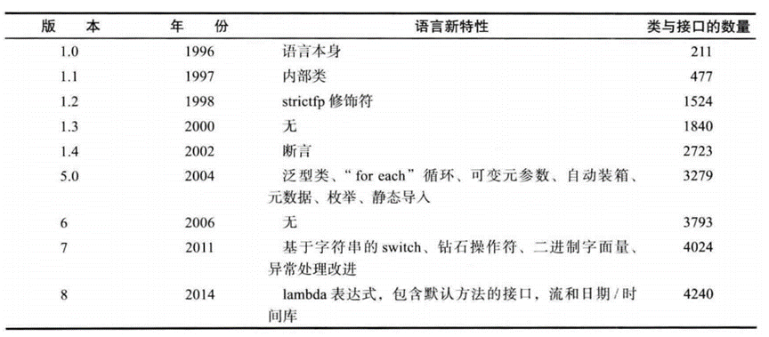

## 初识JAVA - Java简史

[[TOC]]

> 说在前面的话，本文为个人学习各类视频、他人文章等多渠道后进行总结的文章，本文主要用于<b>初步了解JAVA</b>。

### 【1】SUN 公司
- <b>美国SUN(Stanford University Network)公司</b>
- <b>在中国大陆的正式中文名为“太阳计算机系统（中国）有限公司”</b>
- <b>在台湾中文名为“升 阳电脑公司”。</b>

### 【2】Java为什么被发明

- <b>Green项目</b>
- <b>应用环境：像电视盒这样的消费类电子产品</b>
- <b>要求： 语言本身是中立的，也就是跨平台</b>

- 1996年Java第一次发布就引起了人们的极大兴趣。关注Java的人士不仅限于计算机出版界, 还有诸如《纽约时报》《华盛顿邮报》《商业周刊》这样的主流媒体。Java 是第一种也是唯一种在National Public Radio上占用了10分钟时间来进行介绍的程序设计语言，并且还得到了$100000000的风险投资基金。这些基金全部用来支持用这种特别的计算机语言开发的产品。重温那些令人兴奋的日子是很有意思的。我们将简要地介绍一下Java语言的发展历史.
- Java的历史要追溯到1991年，由Patrick Naughton 及其伙伴James Gosling (一个全能的计算机奇才)带领的Sun公同的工程师小组想要设计一种小型的计算机语言，主要用于像有线电视转换盒这类的消费设备。由于这些消费设备的处理能力和内存都很有限，所以语言必须非常小且能够生成非常紧凑的代码。另外，由于不同的厂商会选择不同的中央处理器(CPU)，因此这种语言的关键是不能与任何特定的体系结构捆绑在一起。这个项目被命名为**"Green"**。
- 所有就要求有这样的一种代码： 代码短小、紧凑且与平台无关。但是，Sun公司的人都有UNIX的应用背景。因此，所开发的语言以C++为基础。 是Gosling率先创造了这个语言，把这种语言称为“Oak"(这么起名的原因大概是因为他非常喜欢自己办公室外的橡树)。Sun 公司的人后来发现Oak是一种已有的计算机语言的名字，于是，将其改名为Java。

### 【3】Java的发明人
> James  Gosling

### 【4】Java成长历程

1991年，James Gosling在SUN公司的工程师小组想要设计这样一种小型计算机语言。该语言主要用于像电视盒这样的消费类电子产品。另外，由于不同的厂商选择不同的CPU和操作系统，因此，要求该语言不能和特定的体系结构绑在一起，要求语言本身是中立的，也就是跨平台的。所以，将这个语言命名为“Green”，类似于绿色软件的意思。后来，改名为Oak，橡树的意思。改名后发现已经有一种语言叫这个名字了，再改名叫Java。Java语言发展到今天经历了一系列的过程：

- 1991年，SUN公司的Green项目，Oak
- 1995年，推出Java测试版
- 1996年，JDK1.0
- 1997年，JDK1.1
- 1998年，JDK1.2，大大改进了早期版本缺陷，是一个革命性的版本，更名为Java2。
- 2004年，J2SE 5.0 (1.5.0)  Tiger老虎 成为Java语言发展史上的又一里程碑。为了表示该版本的重要性，J2SE1.5更名为Java SE 5.0
- 2005年，Java的各种版本已经更名，以取消其中的数字"2"： J2ME更名为Java ME， J2SE更名为Java SE， J2EE更名为Java EE；
- 2006年，J2SE 6.0 (1.6.0)  Mustang野马
- 2009年，**甲骨文(oracle)收购SUN**，交易高达价格74亿  [java官网](https://blogs.oracle.com/java/)
- 2011年，JavaSE7.0   Dolphin海豚
- 2014年，JavaSE8.0
- 2017年，JAVA 9.0
- 2018年3月，JAVA 10
- 2018年9月，JAVA 11 ，持续迭代
- 2019年3月，JAVA 12
- 2019年9月，JAVA 13
- 2020年3月，JAVA 14
- 2020年9月，JAVA 15
- 2021年3月，JAVA 16
- 2021年9月，JAVA 17，持续迭代
- 后续的JAVA 18,19,20,21 待续….

### 【5】不同JAVA的版本的特性说明

- JAVASE 1.0 
  -  于1997-02-19发行。
  - 引入的新特性包括：
    -    引入JDBC（Java Database Connectivity）；
    -   支持内部类；
    -    引入Java Bean；
    -    引入RMI（Remote Method Invocation）；
    -    引入反射（仅用于内省）。
- JAVASE 1.2
  - 开发代号为Playground（操场），于1998-12-08发行。
  - 引入的新特性包括：
    -    引入集合（Collection）框架；
    -    对字符串常量做内存映射；
    -    引入JIT（Just In Time）编译器；
    -    引入对打包的Java文件进行数字签名；
    -    引入控制授权访问系统资源的策略工具；
    -    引入JFC（Java Foundation Classes），包括Swing 1.0、拖放和Java 2D类库；
    -    引入Java 插件；
    -    在JDBC中引入可滚动结果集、BLOB、CLOB、批量更新和用户自定义类型；
    -    在Applet中添加声音支持。
- JAVASE 1.3 
  -   开发代号为Kestrel（红隼），于2000-05-08发行。
  - 引入的新特性包括：
    -    引入Java Sound API；
    -    jar文件索引；
    -    对Java的各个方面都做了大量优化和增强。
- JAVASE 1.4 
  - 开发代号为Merlin（隼），于2004-02-06发行（首次在JCP下发行）。
  - 引入的新特性包括:
    -    XML处理；
    -    Java打印服务；
    -    引入Logging API；
    -    引入Java Web Start；
    -    引入JDBC 3.0 API；
    -    引入断言；
    -    引入Preferences API；
    -    引入链式异常处理；
    -    支持IPv6；
    -    支持正则表达式；
    -    引入Image I/O slot machine API。
- JAVASE 5
  - 开发代号为Tiger（老虎），于2004-09-30发行。
  - 引入的新特性包括:
    -    引入泛型；
    -    增强循环，可以使用迭代方式；
    -    自动装箱与自动拆箱；
    -    类型安全的枚举；
    -    可变参数；
    -    静态引入；
    -    元数据（注解）；
    -    引入Instrumentation。
- JAVASE 6
  - 开发代号为Mustang（野马），于2006-12-11发行。

  - 引入的新特性包括：
    -    支持脚本语言；
    -    引入JDBC 4.0 API；
    -    引入Java Compiler API；
    -    可插拔注解；
    -    增加对Native PKI(Public Key Infrastructure)、Java GSS(Generic Security Service)、Kerberos和LDAP(Lightweight Directory Access   Protocol)的支持；
    -    继承Web Services；
    -    做了很多优化。
- JAVASE 7
  - 开发代号是Dolphin（海豚），于2011-07-28发行。
  - 引入的新特性包括：
    -    switch语句块中允许以字符串作为分支条件；
    -    在创建泛型对象时应用类型推断；
    -    在一个语句块中捕获多种异常；
    -    支持动态语言；
    -    支持try-with-resources；
    -    引入Java NIO.2开发包；
    -    数值类型可以用2进制字符串表示，并且可以在字符串表示中添加下划线；
    -    钻石型语法；
    -    null值的自动处理。
- JAVASE 8
  - 开发代号是Spider（蜘蛛），于2014-03-18发行。
  - 引入的新特性包括：
    -   支持 lambda支持；
    - 增强日期与时间API的功能；
    -    对垃圾回收的性能也进行了改进；
    -    并且移除了permgen区。
    -    Lambdas表达式与Functional接口
    -    接口的默认与静态方法
    -    方法引用
    -    重复注解
    -    更好的类型推测机制
    -    扩展注解的支持
- 待续…