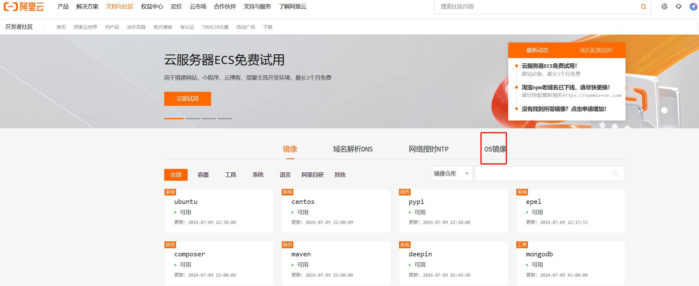
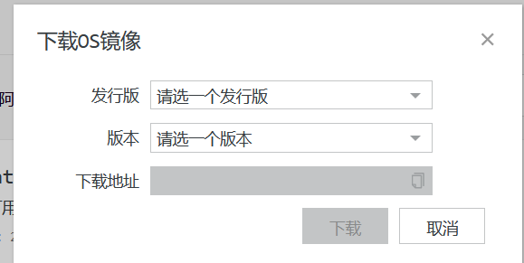
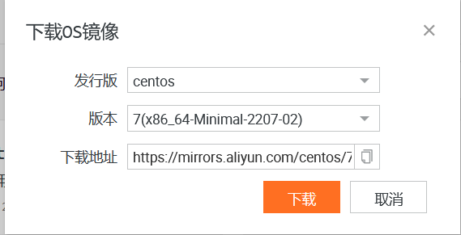
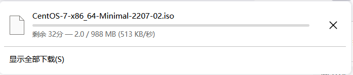
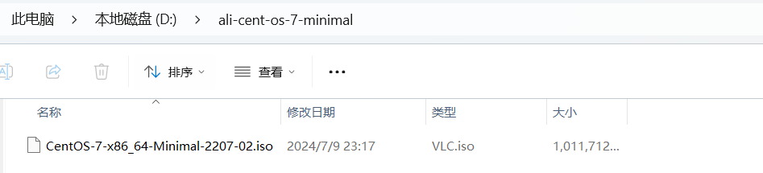

# Ali CentOS 7 Minimal的镜像下载

[[toc]]

## 第一步：进入阿里云镜像官网

> 官网地址：https://developer.aliyun.com/mirror

## 第二步：选择OS镜像

## 第三步：选择发行版和版本

> 这里我们选择 CentOS发行版 和 7(x86_64-Minimal-2207-02) 版本，
>
> 然后点击下载按钮进行下载到本地

## 第四步： 等待下载完毕

## 第五步：存储iso

> 我这边将其放在D盘专用虚拟机盘中，备用

## 第六步： 存入网盘，方便下次下载

> 链接：https://pan.baidu.com/s/1QgpOtxlpAmldc6-w35Xg7g?pwd=9ik6 
> 		提取码：9ik6 