# Ali CentOS 7 Minimal 新手教程引导

[[toc]]

## 一、Ali CentOS7-Linux下yum换源为阿里yum源

>  CentOS通过yum进行软件安装，但是默认软件库的地址为境外地址，如果不使用魔法的话，更新和下载可能会非常缓慢，因此我们需要对其进行换源。

### 1.1 查看yum源信息

> yum repolist

```
[root@localhost02 network-scripts]# yum repolist
Loaded plugins: fastestmirror
Loading mirror speeds from cached hostfile
 * base: mirrors.163.com
 * extras: mirrors.163.com
 * updates: mirrors.163.com
repo id                                                                               repo name                                                                               status
!base/7/x86_64                                                                        CentOS-7 - Base                                                                         10,072
!extras/7/x86_64                                                                      CentOS-7 - Extras                                                                          515
!updates/7/x86_64                                                                     CentOS-7 - Updates                                                                       4,691
repolist: 15,278
[root@localhost02 network-scripts]# 
```

### 1.2 找到base reop源文件目录位置

> cd /etc/yum.repos.d

```
[root@localhost02 network-scripts]# cd /etc/yum.repos.d
[root@localhost02 yum.repos.d]# ll
total 40
-rw-r--r--. 1 root root 1664 Nov 23  2020 CentOS-Base.repo
-rw-r--r--. 1 root root 1309 Nov 23  2020 CentOS-CR.repo
-rw-r--r--. 1 root root  649 Nov 23  2020 CentOS-Debuginfo.repo
-rw-r--r--. 1 root root  314 Nov 23  2020 CentOS-fasttrack.repo
-rw-r--r--. 1 root root  630 Nov 23  2020 CentOS-Media.repo
-rw-r--r--. 1 root root 1331 Nov 23  2020 CentOS-Sources.repo
-rw-r--r--. 1 root root 8515 Nov 23  2020 CentOS-Vault.repo
-rw-r--r--. 1 root root  616 Nov 23  2020 CentOS-x86_64-kernel.repo
[root@localhost02 yum.repos.d]# 
```

### 1.3 备份旧的配置文件

> sudo mv CentOS-Base.repo CentOS-Base.repo.bak

```
[root@localhost02 yum.repos.d]# sudo mv CentOS-Base.repo CentOS-Base.repo.bak
[root@localhost02 yum.repos.d]# ll
total 40
-rw-r--r--. 1 root root 1664 Nov 23  2020 CentOS-Base.repo.bak
-rw-r--r--. 1 root root 1309 Nov 23  2020 CentOS-CR.repo
-rw-r--r--. 1 root root  649 Nov 23  2020 CentOS-Debuginfo.repo
-rw-r--r--. 1 root root  314 Nov 23  2020 CentOS-fasttrack.repo
-rw-r--r--. 1 root root  630 Nov 23  2020 CentOS-Media.repo
-rw-r--r--. 1 root root 1331 Nov 23  2020 CentOS-Sources.repo
-rw-r--r--. 1 root root 8515 Nov 23  2020 CentOS-Vault.repo
-rw-r--r--. 1 root root  616 Nov 23  2020 CentOS-x86_64-kernel.repo
[root@localhost02 yum.repos.d]# 
```

### 1.4 下载阿里源的文件

> sudo wget -O /etc/yum.repos.d/CentOS-Base.repo http://mirrors.aliyun.com/repo/Centos-7.repo

若没有wget的时候，使用以下命令

``` shell
echo '# CentOS-Base.repo'                                                                 >> /etc/yum.repos.d/CentOS-Base.repo &&
echo '#'                                                                                  >> /etc/yum.repos.d/CentOS-Base.repo &&
echo '# The mirror system uses the connecting IP address of the client and the'           >> /etc/yum.repos.d/CentOS-Base.repo &&
echo '# update status of each mirror to pick mirrors that are updated to and'             >> /etc/yum.repos.d/CentOS-Base.repo &&
echo '# geographically close to the client.  You should use this for CentOS updates'      >> /etc/yum.repos.d/CentOS-Base.repo &&
echo '# unless you are manually picking other mirrors.'                                   >> /etc/yum.repos.d/CentOS-Base.repo &&
echo '#'                                                                                  >> /etc/yum.repos.d/CentOS-Base.repo &&
echo '# If the mirrorlist= does not work for you, as a fall back you can try the'         >> /etc/yum.repos.d/CentOS-Base.repo &&
echo '# remarked out baseurl= line instead.'                                              >> /etc/yum.repos.d/CentOS-Base.repo &&
echo '#'                                                                                  >> /etc/yum.repos.d/CentOS-Base.repo &&
echo '#'                                                                                  >> /etc/yum.repos.d/CentOS-Base.repo &&
echo ''                                                                                   >> /etc/yum.repos.d/CentOS-Base.repo &&
echo '[base]'                                                                             >> /etc/yum.repos.d/CentOS-Base.repo &&
echo 'name=CentOS-$releasever - Base - mirrors.aliyun.com'                                >> /etc/yum.repos.d/CentOS-Base.repo &&
echo 'failovermethod=priority'                                                            >> /etc/yum.repos.d/CentOS-Base.repo &&
echo 'baseurl=http://mirrors.aliyun.com/centos/$releasever/os/$basearch/'                 >> /etc/yum.repos.d/CentOS-Base.repo &&
echo '        http://mirrors.aliyuncs.com/centos/$releasever/os/$basearch/'               >> /etc/yum.repos.d/CentOS-Base.repo &&
echo '        http://mirrors.cloud.aliyuncs.com/centos/$releasever/os/$basearch/'         >> /etc/yum.repos.d/CentOS-Base.repo &&
echo 'gpgcheck=1'                                                                         >> /etc/yum.repos.d/CentOS-Base.repo &&
echo 'gpgkey=http://mirrors.aliyun.com/centos/RPM-GPG-KEY-CentOS-7'                       >> /etc/yum.repos.d/CentOS-Base.repo &&
echo ''                                                                                   >> /etc/yum.repos.d/CentOS-Base.repo &&
echo '#released updates'                                                                  >> /etc/yum.repos.d/CentOS-Base.repo &&
echo '[updates]'                                                                          >> /etc/yum.repos.d/CentOS-Base.repo &&
echo 'name=CentOS-$releasever - Updates - mirrors.aliyun.com'                             >> /etc/yum.repos.d/CentOS-Base.repo &&
echo 'failovermethod=priority'                                                            >> /etc/yum.repos.d/CentOS-Base.repo &&
echo 'baseurl=http://mirrors.aliyun.com/centos/$releasever/updates/$basearch/'            >> /etc/yum.repos.d/CentOS-Base.repo &&
echo '        http://mirrors.aliyuncs.com/centos/$releasever/updates/$basearch/'          >> /etc/yum.repos.d/CentOS-Base.repo &&
echo '        http://mirrors.cloud.aliyuncs.com/centos/$releasever/updates/$basearch/'    >> /etc/yum.repos.d/CentOS-Base.repo &&
echo 'gpgcheck=1'                                                                         >> /etc/yum.repos.d/CentOS-Base.repo &&
echo 'gpgkey=http://mirrors.aliyun.com/centos/RPM-GPG-KEY-CentOS-7'                       >> /etc/yum.repos.d/CentOS-Base.repo &&
echo ''                                                                                   >> /etc/yum.repos.d/CentOS-Base.repo &&
echo '#additional packages that may be useful'                                            >> /etc/yum.repos.d/CentOS-Base.repo &&
echo '[extras]'                                                                           >> /etc/yum.repos.d/CentOS-Base.repo &&
echo 'name=CentOS-$releasever - Extras - mirrors.aliyun.com'                              >> /etc/yum.repos.d/CentOS-Base.repo &&
echo 'failovermethod=priority'                                                            >> /etc/yum.repos.d/CentOS-Base.repo &&
echo 'baseurl=http://mirrors.aliyun.com/centos/$releasever/extras/$basearch/'             >> /etc/yum.repos.d/CentOS-Base.repo &&
echo '        http://mirrors.aliyuncs.com/centos/$releasever/extras/$basearch/'           >> /etc/yum.repos.d/CentOS-Base.repo &&
echo '        http://mirrors.cloud.aliyuncs.com/centos/$releasever/extras/$basearch/'     >> /etc/yum.repos.d/CentOS-Base.repo &&
echo 'gpgcheck=1'                                                                         >> /etc/yum.repos.d/CentOS-Base.repo &&
echo 'gpgkey=http://mirrors.aliyun.com/centos/RPM-GPG-KEY-CentOS-7'                       >> /etc/yum.repos.d/CentOS-Base.repo &&
echo ''                                                                                   >> /etc/yum.repos.d/CentOS-Base.repo &&
echo '#additional packages that extend functionality of existing packages'                >> /etc/yum.repos.d/CentOS-Base.repo &&
echo '[centosplus]'                                                                       >> /etc/yum.repos.d/CentOS-Base.repo &&
echo 'name=CentOS-$releasever - Plus - mirrors.aliyun.com'                                >> /etc/yum.repos.d/CentOS-Base.repo &&
echo 'failovermethod=priority'                                                            >> /etc/yum.repos.d/CentOS-Base.repo &&
echo 'baseurl=http://mirrors.aliyun.com/centos/$releasever/centosplus/$basearch/'         >> /etc/yum.repos.d/CentOS-Base.repo &&
echo '        http://mirrors.aliyuncs.com/centos/$releasever/centosplus/$basearch/'       >> /etc/yum.repos.d/CentOS-Base.repo &&
echo '        http://mirrors.cloud.aliyuncs.com/centos/$releasever/centosplus/$basearch/' >> /etc/yum.repos.d/CentOS-Base.repo &&
echo 'gpgcheck=1'                                                                         >> /etc/yum.repos.d/CentOS-Base.repo &&
echo 'enabled=0'                                                                          >> /etc/yum.repos.d/CentOS-Base.repo &&
echo 'gpgkey=http://mirrors.aliyun.com/centos/RPM-GPG-KEY-CentOS-7'                       >> /etc/yum.repos.d/CentOS-Base.repo &&
echo ''                                                                                   >> /etc/yum.repos.d/CentOS-Base.repo &&
echo '#contrib - packages by Centos Users'                                                >> /etc/yum.repos.d/CentOS-Base.repo &&
echo '[contrib]'                                                                          >> /etc/yum.repos.d/CentOS-Base.repo &&
echo 'name=CentOS-$releasever - Contrib - mirrors.aliyun.com'                             >> /etc/yum.repos.d/CentOS-Base.repo &&
echo 'failovermethod=priority'                                                            >> /etc/yum.repos.d/CentOS-Base.repo &&
echo 'baseurl=http://mirrors.aliyun.com/centos/$releasever/contrib/$basearch/'            >> /etc/yum.repos.d/CentOS-Base.repo &&
echo '        http://mirrors.aliyuncs.com/centos/$releasever/contrib/$basearch/'          >> /etc/yum.repos.d/CentOS-Base.repo &&
echo '        http://mirrors.cloud.aliyuncs.com/centos/$releasever/contrib/$basearch/'    >> /etc/yum.repos.d/CentOS-Base.repo &&
echo 'gpgcheck=1'                                                                         >> /etc/yum.repos.d/CentOS-Base.repo &&
echo 'enabled=0'                                                                          >> /etc/yum.repos.d/CentOS-Base.repo &&
echo 'gpgkey=http://mirrors.aliyun.com/centos/RPM-GPG-KEY-CentOS-7'                       >> /etc/yum.repos.d/CentOS-Base.repo
```

### 1.5 清理缓存

> yum clean all

### 1.6 重新生成缓存

> yum makecache

### 1.7 再次查看yum源信息

> yum repolist

```
[root@localhost02 yum.repos.d]# yum repolist
Loaded plugins: fastestmirror
Loading mirror speeds from cached hostfile
 * base: mirrors.aliyun.com
 * extras: mirrors.aliyun.com
 * updates: mirrors.aliyun.com
repo id                                                                    repo name                                                                                          status
base/7/x86_64                                                              CentOS-7 - Base - mirrors.aliyun.com                                                               10,072
extras/7/x86_64                                                            CentOS-7 - Extras - mirrors.aliyun.com                                                                515
updates/7/x86_64                                                           CentOS-7 - Updates - mirrors.aliyun.com                                                             4,691
repolist: 15,278
[root@localhost02 yum.repos.d]# 

```

### 1.8 更新安装yum

> yum -y update
>
> 等待更新完成即可

### 1.9 命令集合

``` shell
yum repolist &&
cd /etc/yum.repos.d && 
sudo mv -f CentOS-Base.repo CentOS-Base.repo.bak && 
echo '# CentOS-Base.repo'                                                                 >> /etc/yum.repos.d/CentOS-Base.repo &&
echo '#'                                                                                  >> /etc/yum.repos.d/CentOS-Base.repo &&
echo '# The mirror system uses the connecting IP address of the client and the'           >> /etc/yum.repos.d/CentOS-Base.repo &&
echo '# update status of each mirror to pick mirrors that are updated to and'             >> /etc/yum.repos.d/CentOS-Base.repo &&
echo '# geographically close to the client.  You should use this for CentOS updates'      >> /etc/yum.repos.d/CentOS-Base.repo &&
echo '# unless you are manually picking other mirrors.'                                   >> /etc/yum.repos.d/CentOS-Base.repo &&
echo '#'                                                                                  >> /etc/yum.repos.d/CentOS-Base.repo &&
echo '# If the mirrorlist= does not work for you, as a fall back you can try the'         >> /etc/yum.repos.d/CentOS-Base.repo &&
echo '# remarked out baseurl= line instead.'                                              >> /etc/yum.repos.d/CentOS-Base.repo &&
echo '#'                                                                                  >> /etc/yum.repos.d/CentOS-Base.repo &&
echo '#'                                                                                  >> /etc/yum.repos.d/CentOS-Base.repo &&
echo ''                                                                                   >> /etc/yum.repos.d/CentOS-Base.repo &&
echo '[base]'                                                                             >> /etc/yum.repos.d/CentOS-Base.repo &&
echo 'name=CentOS-$releasever - Base - mirrors.aliyun.com'                                >> /etc/yum.repos.d/CentOS-Base.repo &&
echo 'failovermethod=priority'                                                            >> /etc/yum.repos.d/CentOS-Base.repo &&
echo 'baseurl=http://mirrors.aliyun.com/centos/$releasever/os/$basearch/'                 >> /etc/yum.repos.d/CentOS-Base.repo &&
echo '        http://mirrors.aliyuncs.com/centos/$releasever/os/$basearch/'               >> /etc/yum.repos.d/CentOS-Base.repo &&
echo '        http://mirrors.cloud.aliyuncs.com/centos/$releasever/os/$basearch/'         >> /etc/yum.repos.d/CentOS-Base.repo &&
echo 'gpgcheck=1'                                                                         >> /etc/yum.repos.d/CentOS-Base.repo &&
echo 'gpgkey=http://mirrors.aliyun.com/centos/RPM-GPG-KEY-CentOS-7'                       >> /etc/yum.repos.d/CentOS-Base.repo &&
echo ''                                                                                   >> /etc/yum.repos.d/CentOS-Base.repo &&
echo '#released updates'                                                                  >> /etc/yum.repos.d/CentOS-Base.repo &&
echo '[updates]'                                                                          >> /etc/yum.repos.d/CentOS-Base.repo &&
echo 'name=CentOS-$releasever - Updates - mirrors.aliyun.com'                             >> /etc/yum.repos.d/CentOS-Base.repo &&
echo 'failovermethod=priority'                                                            >> /etc/yum.repos.d/CentOS-Base.repo &&
echo 'baseurl=http://mirrors.aliyun.com/centos/$releasever/updates/$basearch/'            >> /etc/yum.repos.d/CentOS-Base.repo &&
echo '        http://mirrors.aliyuncs.com/centos/$releasever/updates/$basearch/'          >> /etc/yum.repos.d/CentOS-Base.repo &&
echo '        http://mirrors.cloud.aliyuncs.com/centos/$releasever/updates/$basearch/'    >> /etc/yum.repos.d/CentOS-Base.repo &&
echo 'gpgcheck=1'                                                                         >> /etc/yum.repos.d/CentOS-Base.repo &&
echo 'gpgkey=http://mirrors.aliyun.com/centos/RPM-GPG-KEY-CentOS-7'                       >> /etc/yum.repos.d/CentOS-Base.repo &&
echo ''                                                                                   >> /etc/yum.repos.d/CentOS-Base.repo &&
echo '#additional packages that may be useful'                                            >> /etc/yum.repos.d/CentOS-Base.repo &&
echo '[extras]'                                                                           >> /etc/yum.repos.d/CentOS-Base.repo &&
echo 'name=CentOS-$releasever - Extras - mirrors.aliyun.com'                              >> /etc/yum.repos.d/CentOS-Base.repo &&
echo 'failovermethod=priority'                                                            >> /etc/yum.repos.d/CentOS-Base.repo &&
echo 'baseurl=http://mirrors.aliyun.com/centos/$releasever/extras/$basearch/'             >> /etc/yum.repos.d/CentOS-Base.repo &&
echo '        http://mirrors.aliyuncs.com/centos/$releasever/extras/$basearch/'           >> /etc/yum.repos.d/CentOS-Base.repo &&
echo '        http://mirrors.cloud.aliyuncs.com/centos/$releasever/extras/$basearch/'     >> /etc/yum.repos.d/CentOS-Base.repo &&
echo 'gpgcheck=1'                                                                         >> /etc/yum.repos.d/CentOS-Base.repo &&
echo 'gpgkey=http://mirrors.aliyun.com/centos/RPM-GPG-KEY-CentOS-7'                       >> /etc/yum.repos.d/CentOS-Base.repo &&
echo ''                                                                                   >> /etc/yum.repos.d/CentOS-Base.repo &&
echo '#additional packages that extend functionality of existing packages'                >> /etc/yum.repos.d/CentOS-Base.repo &&
echo '[centosplus]'                                                                       >> /etc/yum.repos.d/CentOS-Base.repo &&
echo 'name=CentOS-$releasever - Plus - mirrors.aliyun.com'                                >> /etc/yum.repos.d/CentOS-Base.repo &&
echo 'failovermethod=priority'                                                            >> /etc/yum.repos.d/CentOS-Base.repo &&
echo 'baseurl=http://mirrors.aliyun.com/centos/$releasever/centosplus/$basearch/'         >> /etc/yum.repos.d/CentOS-Base.repo &&
echo '        http://mirrors.aliyuncs.com/centos/$releasever/centosplus/$basearch/'       >> /etc/yum.repos.d/CentOS-Base.repo &&
echo '        http://mirrors.cloud.aliyuncs.com/centos/$releasever/centosplus/$basearch/' >> /etc/yum.repos.d/CentOS-Base.repo &&
echo 'gpgcheck=1'                                                                         >> /etc/yum.repos.d/CentOS-Base.repo &&
echo 'enabled=0'                                                                          >> /etc/yum.repos.d/CentOS-Base.repo &&
echo 'gpgkey=http://mirrors.aliyun.com/centos/RPM-GPG-KEY-CentOS-7'                       >> /etc/yum.repos.d/CentOS-Base.repo &&
echo ''                                                                                   >> /etc/yum.repos.d/CentOS-Base.repo &&
echo '#contrib - packages by Centos Users'                                                >> /etc/yum.repos.d/CentOS-Base.repo &&
echo '[contrib]'                                                                          >> /etc/yum.repos.d/CentOS-Base.repo &&
echo 'name=CentOS-$releasever - Contrib - mirrors.aliyun.com'                             >> /etc/yum.repos.d/CentOS-Base.repo &&
echo 'failovermethod=priority'                                                            >> /etc/yum.repos.d/CentOS-Base.repo &&
echo 'baseurl=http://mirrors.aliyun.com/centos/$releasever/contrib/$basearch/'            >> /etc/yum.repos.d/CentOS-Base.repo &&
echo '        http://mirrors.aliyuncs.com/centos/$releasever/contrib/$basearch/'          >> /etc/yum.repos.d/CentOS-Base.repo &&
echo '        http://mirrors.cloud.aliyuncs.com/centos/$releasever/contrib/$basearch/'    >> /etc/yum.repos.d/CentOS-Base.repo &&
echo 'gpgcheck=1'                                                                         >> /etc/yum.repos.d/CentOS-Base.repo &&
echo 'enabled=0'                                                                          >> /etc/yum.repos.d/CentOS-Base.repo &&
echo 'gpgkey=http://mirrors.aliyun.com/centos/RPM-GPG-KEY-CentOS-7'                       >> /etc/yum.repos.d/CentOS-Base.repo && 
yum clean all && yum makecache && yum repolist && yum -y update
```

## 二、Ali CentOS7-Linux下基础依赖部署

``` shell
yum -y install vim wget lrzsz curl telnet net-tools tree openssh-server gcc gcc-c++ make autoconf libjpeg libjpeg-devel libpng libpng-devel freetype freetype-devel libxml2 libxml2-devel zlib zlib-devel glibc glibc-devel glib2 glib2-devel bzip2 bzip2-devel ncurses ncurses-devel curl curl-devel e2fsprogs e2fsprogs-devel krb5-devel libidn libidn-devel openssl openssl-devel libxslt-devel libevent-devel libtool libtool-ltdl bison gd gd-devel vim-enhanced pcre-devel zip unzip ntpdate sysstat patch bc expect rsync
```

## 三、Ali CentOS7-Linux下常用设置安装

### 3.1 开放端口

#### 3.1.1 开启防火墙

> systemctl start firewalld

#### 3.1.2 开放指定端口号

> firewall-cmd --zone=public --add-port=1935/tcp  --permanent
>
> firewall-cmd --zone=public --add-port=8080/tcp  --permanent
>
> firewall-cmd --zone=public --add-port=8081/tcp  --permanent
>
> firewall-cmd --zone=public --add-port=8082/tcp  --permanent
>
> firewall-cmd --zone=public --add-port=8083/tcp  --permanent
>
> 命令含义：
>
> --zone #作用域
>
> --add-port=1935/tcp  #添加端口，格式为：端口/通讯协议
>
> --permanent  #永久生效，没有此参数重启后失效

#### 3.1.3 重启防火墙

> firewall-cmd --reload

``` shell
[root@localhost02 /]# systemctl start firewalld
[root@localhost02 /]# firewall-cmd --zone=public --add-port=1935/tcp  --permanent
success
[root@localhost02 /]# 
[root@localhost02 /]# firewall-cmd --zone=public --add-port=8080/tcp  --permanent
success
[root@localhost02 /]# 
[root@localhost02 /]# firewall-cmd --zone=public --add-port=8081/tcp  --permanent
success
[root@localhost02 /]# 
[root@localhost02 /]# firewall-cmd --zone=public --add-port=8082/tcp  --permanent
success
[root@localhost02 /]# 
[root@localhost02 /]# firewall-cmd --zone=public --add-port=8083/tcp  --permanent
success
[root@localhost02 /]# firewall-cmd --reload
success
[root@localhost02 /]# 

```

#### 3.1.4 查看端口号

> netstat -ntlp  #查看当前所有tcp端口·	
>
> netstat -ntulp |grep 1935  #查看所有1935端口使用情况·
>
> netstat -ntulp |grep 8080  #查看所有8080端口使用情况·
>
> netstat -ntulp |grep 8081  #查看所有8081端口使用情况·
>
> netstat -ntulp |grep 8082  #查看所有8082端口使用情况·
>
> netstat -ntulp |grep 8083  #查看所有8083端口使用情况·

#### 3.1.5 命令集合
``` shell
systemctl start firewalld &&
firewall-cmd --zone=public --add-port=1935/tcp --permanent &&
firewall-cmd --zone=public --add-port=8000/tcp --permanent &&
firewall-cmd --zone=public --add-port=8080/tcp --permanent &&
firewall-cmd --zone=public --add-port=8081/tcp --permanent &&
firewall-cmd --zone=public --add-port=8082/tcp --permanent &&
firewall-cmd --zone=public --add-port=8083/tcp --permanent &&
firewall-cmd --zone=public --add-port=8084/tcp --permanent &&
firewall-cmd --reload 
```

## 3.2 设置时区

>  若需要变更，则使用`rm -rf /etc/localtime`和`ln -s /usr/share/zoneinfo/Asia/Shanghai /etc/localtime`命令进行修改，`date -s`修改具体时间,`clock -w`,`hwclock -w` 复位时间

``` shell
[root@localhost02 Asia]# rm -rf /etc/localtime 
[root@localhost02 Asia]# ln -s /usr/share/zoneinfo/Asia/Shanghai /etc/localtime
[root@localhost02 Asia]# ll /etc/localtime
lrwxrwxrwx 1 root root 33 Jan 28 14:38 /etc/localtime -> /usr/share/zoneinfo/Asia/Shanghai
[root@localhost02 Asia]# date -R
Sat, 28 Jan 2023 14:39:38 +0800
[root@localhost02 Asia]# date -s 14:58:00
Sat Jan 28 14:58:00 CST 2023
[root@localhost02 Asia]# clock -w
[root@localhost02 Asia]# hwclock -w
[root@localhost02 Asia]# 
```

``` shell
ll /etc/localtime && 
rm -rf /etc/localtime &&
ln -s /usr/share/zoneinfo/Asia/Shanghai /etc/localtime &&
ll /etc/localtime
```

### 3.3 关闭SELinux

#### 3.3.1 SELinux背景

> seLinux是linux的一些强制安全策略，会限制一些软件的目录、端口和用户等，在日常操作中，常常会遇到不少莫名其妙的权限问题是由seLinux产生的。很多架构实现都会关闭selinux

#### 3.3.2 检查selinux是否开启

> 在关闭selinux之前，可以通过以下命令来查看seLinux是否开启。  
>
> `sestatus`

``` shell
[root@localhost02 usr]# sestatus
SELinux status:                 enabled
SELinuxfs mount:                /sys/fs/selinux
SELinux root directory:         /etc/selinux
Loaded policy name:             targeted
Current mode:                   enforcing
Mode from config file:          enforcing
Policy MLS status:              enabled
Policy deny_unknown status:     allowed
Max kernel policy version:      31
[root@localhost02 usr]# 
```

> 看到 SELinux status:                 enabled说明是开启的。

#### 3.3.3 临时关闭SELinux

> 要暂时禁用 SELinux，您必须修改 /selinux/enforce 文件。
>
> 请注意，重新启动系统后，此设置将消失。

> 使用命令：
>
> **echo 0 > /selinux/enforce**
>
> or
>
> **setenforce 0**

#### 3.3.4 永久关闭SELinux

> 要永久禁用 SELinux，请修改 /etc/selinux/config 并将 SELINUX=disabled

``` shell
[root@localhost02 ~]# cat /etc/selinux/config

# This file controls the state of SELinux on the system.
# SELINUX= can take one of these three values:
#     enforcing - SELinux security policy is enforced.
#     permissive - SELinux prints warnings instead of enforcing.
#     disabled - No SELinux policy is loaded.
SELINUX=enforcing
# SELINUXTYPE= can take one of three values:
#     targeted - Targeted processes are protected,
#     minimum - Modification of targeted policy. Only selected processes are protected. 
#     mls - Multi Level Security protection.
SELINUXTYPE=targeted 


[root@localhost02 ~]# 
```

``` shell
[root@localhost02 ~]# vim /etc/selinux/config
```


> 修改**SELINUX=disabled**

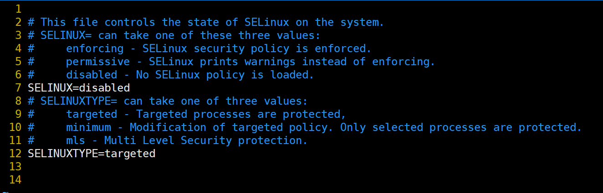

``` shell
[root@localhost02 ~]# cat /etc/selinux/config

# This file controls the state of SELinux on the system.
# SELINUX= can take one of these three values:
#     enforcing - SELinux security policy is enforced.
#     permissive - SELinux prints warnings instead of enforcing.
#     disabled - No SELinux policy is loaded.
SELINUX=disabled
# SELINUXTYPE= can take one of three values:
#     targeted - Targeted processes are protected,
#     minimum - Modification of targeted policy. Only selected processes are protected. 
#     mls - Multi Level Security protection.
SELINUXTYPE=targeted 


[root@localhost02 ~]# 
```

> 最后重启服务器即可：  **`shutdown -r now`**

``` shell
[root@localhost02 ~]# sestatus
SELinux status:                 disabled
[root@localhost02 ~]# 
```

> 此时说明： 已经关闭了SELinux

#### 3.3.5 命令集合

``` shell
sestatus && 
cat /etc/selinux/config &&
sed -i 's/SELINUX=enforcing/SELINUX=disabled/g' /etc/selinux/config &&
cat /etc/selinux/config
```

### 3.4 配置Linux历史命令大小

> 即修改history的存储大小
>
> vim /etc/profile
>
> HISTORY=1000
>
> :wq
>
> source /etc/profile


``` shell
sed -i '/unset i/i\\n' /etc/profile &&
sed -i '/unset i/iHISTORY=1000' /etc/profile &&
source /etc/profile && 
cat /etc/profile
```


### 3.5 绑定静态IP（只适用于虚拟机）

> 这里需要注意： 静态IP和网关IP需要对照虚拟网络编辑器里面的配置是否一致

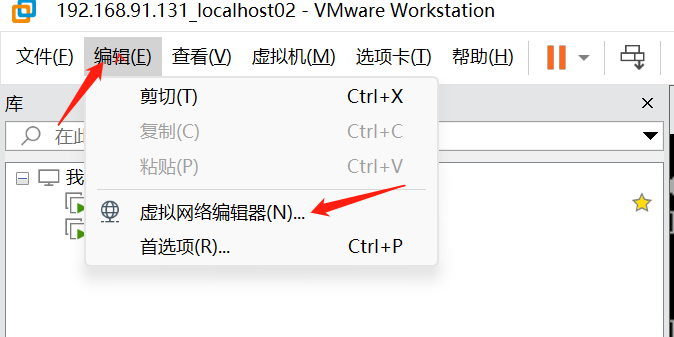

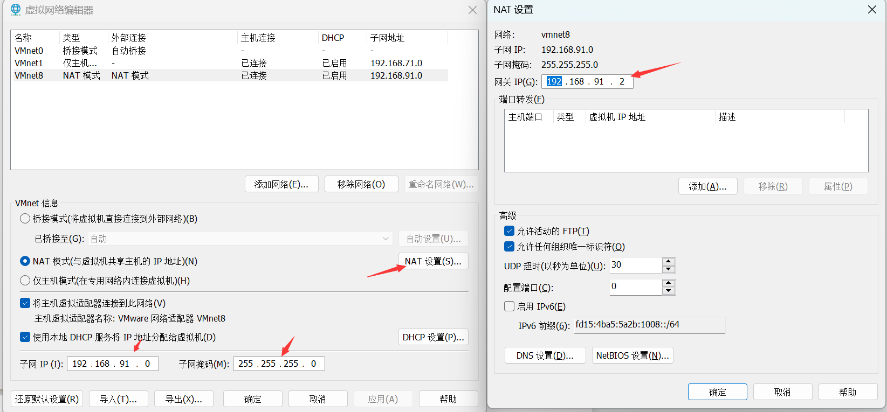

> 查看当前服务器的ifcfg-ens名称: 

``` shell
[root@localhost02 /]# cd /etc/sysconfig/network-scripts
[root@localhost02 network-scripts]# ll
total 232
-rw-r--r--. 1 root root   310 Dec 30 16:07 ifcfg-ens33
```

> \# 查看当前服务器的ifcfg-ens名称，我的是: ifcfg-ens33
>
> \# 然后编辑配置如下：
>
> vim /etc/sysconfig/network-scripts/ifcfg-ens33
>
> 输入：
>
> ONBOOT="yes"
>
> IPADDR="192.168.244.129"
>
> \#这里默认网关通过ip route查看
>
> GATEWAY=192.168.244.2
>
> DNS1="114.114.114.114"
>
> DNS2="8.8.8.8"
>
> \# 子网掩码的长度为24  相当于 NETMASK=255.255.255.0
>
> PREFIX=24 
>
> \# dhcp表示动态获得ip地址，通过dhcp服务器的分配。none或者static 表示静态配置ip
>
> \# 修改参数
>
> BOOTPROTO="none" #从dhcp改为none或者static
>
> 然后输入esc + : + wq! 退出并保存

``` shell
[root@localhost02 network-scripts]# cat ifcfg-ens33 
TYPE="Ethernet"
PROXY_METHOD="none"
BROWSER_ONLY="no"
BOOTPROTO="dhcp"
DEFROUTE="yes"
IPV4_FAILURE_FATAL="no"
IPV6INIT="yes"
IPV6_AUTOCONF="yes"
IPV6_DEFROUTE="yes"
IPV6_FAILURE_FATAL="no"
IPV6_ADDR_GEN_MODE="stable-privacy"
NAME="ens33"
UUID="b7db0422-2681-4d11-b055-01c17f86f4d3"
DEVICE="ens33"
ONBOOT="yes"
[root@localhost02 network-scripts]# vim ifcfg-ens33  // 然后输入 i 进入输入模式
```

> 修改如下：
>
> 1 TYPE="Ethernet"
> 2 PROXY_METHOD="none"
> 3 BROWSER_ONLY="no"
> 4 BOOTPROTO="none"   //修改从dhcp改为none
> 5 DEFROUTE="yes"
> 6 IPV4_FAILURE_FATAL="no"
> 7 IPV6INIT="yes"
> 8 IPV6_AUTOCONF="yes"
> 9 IPV6_DEFROUTE="yes"
> 10 IPV6_FAILURE_FATAL="no"
> 11 IPV6_ADDR_GEN_MODE="stable-privacy"
> 12 NAME="ens33"
> 13 UUID="b7db0422-2681-4d11-b055-01c17f86f4d3"
> 14 DEVICE="ens33"
> 15 ONBOOT="yes"
> 16 IPADDR="192.168.91.131" //新增
> 17 GATEWAY="192.168.91.2"  //新增
> 18 DNS1="114.114.114.114"  //新增
> 19 DNS2="8.8.8.8"  //新增
> 20 PREFIX=24  //新增

> 然后重启网卡
>
> **`service network restart`**

``` shell
[root@localhost02 network-scripts]# service network restart
Restarting network (via systemctl):                        [  OK  ]
[root@localhost02 network-scripts]# 
```

#### 3.5.1 命令整合 

> 注意这里的 192.168.198.128 需要替换为你的当前虚拟机的IP

``` shell
cd /etc/sysconfig/network-scripts &&
sed -i 's/BOOTPROTO="dhcp"/BOOTPROTO="none"/g' /etc/sysconfig/network-scripts/ifcfg-ens33 &&
echo 'IPADDR="192.168.198.128"' >> /etc/sysconfig/network-scripts/ifcfg-ens33 &&
echo 'GATEWAY="192.168.198.2"' >> /etc/sysconfig/network-scripts/ifcfg-ens33 &&
echo 'DNS1="114.114.114.114"' >> /etc/sysconfig/network-scripts/ifcfg-ens33 &&
echo 'DNS2="8.8.8.8"' >> /etc/sysconfig/network-scripts/ifcfg-ens33  &&
echo 'PREFIX=24' >> /etc/sysconfig/network-scripts/ifcfg-ens33 &&
cat /etc/sysconfig/network-scripts/ifcfg-ens33 &&
service network restart
```

### 3.6 重启虚拟机

> shutdown -r now 

## 四、Ali CentOS7-Linux下安装软件

### 4.1 Ali CentOS7-Linux下安装OpenJDK8

#### 4.1.1 查找Linux下的JDK版本列表

> 使用 yum 查找 jdk:             yum search java |grep jdk

```shell
[root@localhost02 qianpz]# yum search java|grep jdk
ldapjdk-javadoc.noarch : Javadoc for ldapjdk
java-1.6.0-openjdk.x86_64 : OpenJDK Runtime Environment
java-1.6.0-openjdk-demo.x86_64 : OpenJDK Demos
java-1.6.0-openjdk-devel.x86_64 : OpenJDK Development Environment
java-1.6.0-openjdk-javadoc.x86_64 : OpenJDK API Documentation
java-1.6.0-openjdk-src.x86_64 : OpenJDK Source Bundle
java-1.7.0-openjdk.x86_64 : OpenJDK Runtime Environment
java-1.7.0-openjdk-accessibility.x86_64 : OpenJDK accessibility connector
java-1.7.0-openjdk-demo.x86_64 : OpenJDK Demos
java-1.7.0-openjdk-devel.x86_64 : OpenJDK Development Environment
java-1.7.0-openjdk-headless.x86_64 : The OpenJDK runtime environment without
java-1.7.0-openjdk-javadoc.noarch : OpenJDK API Documentation
java-1.7.0-openjdk-src.x86_64 : OpenJDK Source Bundle
java-1.8.0-openjdk.i686 : OpenJDK Runtime Environment 8
java-1.8.0-openjdk.x86_64 : OpenJDK 8 Runtime Environment
java-1.8.0-openjdk-accessibility.i686 : OpenJDK accessibility connector
java-1.8.0-openjdk-accessibility.x86_64 : OpenJDK accessibility connector
java-1.8.0-openjdk-demo.i686 : OpenJDK Demos 8
java-1.8.0-openjdk-demo.x86_64 : OpenJDK 8 Demos
java-1.8.0-openjdk-devel.i686 : OpenJDK Development Environment 8
java-1.8.0-openjdk-devel.x86_64 : OpenJDK 8 Development Environment
java-1.8.0-openjdk-headless.i686 : OpenJDK Headless Runtime Environment 8
java-1.8.0-openjdk-headless.x86_64 : OpenJDK 8 Headless Runtime Environment
java-1.8.0-openjdk-javadoc.noarch : OpenJDK 8 API documentation
java-1.8.0-openjdk-javadoc-zip.noarch : OpenJDK 8 API documentation compressed
java-1.8.0-openjdk-src.i686 : OpenJDK Source Bundle 8
java-1.8.0-openjdk-src.x86_64 : OpenJDK 8 Source Bundle
java-11-openjdk.i686 : OpenJDK Runtime Environment 11
java-11-openjdk.x86_64 : OpenJDK 11 Runtime Environment
java-11-openjdk-demo.i686 : OpenJDK Demos 11
java-11-openjdk-demo.x86_64 : OpenJDK 11 Demos
java-11-openjdk-devel.i686 : OpenJDK Development Environment 11
java-11-openjdk-devel.x86_64 : OpenJDK 11 Development Environment
java-11-openjdk-headless.i686 : OpenJDK Headless Runtime Environment 11
java-11-openjdk-headless.x86_64 : OpenJDK 11 Headless Runtime Environment
java-11-openjdk-javadoc.i686 : OpenJDK 11 API documentation
java-11-openjdk-javadoc.x86_64 : OpenJDK 11 API documentation
java-11-openjdk-javadoc-zip.i686 : OpenJDK 11 API documentation compressed in a
java-11-openjdk-javadoc-zip.x86_64 : OpenJDK 11 API documentation compressed in
java-11-openjdk-jmods.i686 : JMods for OpenJDK 11
java-11-openjdk-jmods.x86_64 : JMods for OpenJDK 11
java-11-openjdk-src.i686 : OpenJDK Source Bundle 11
java-11-openjdk-src.x86_64 : OpenJDK 11 Source Bundle
java-11-openjdk-static-libs.i686 : OpenJDK libraries for static linking 11
java-11-openjdk-static-libs.x86_64 : OpenJDK 11 libraries for static linking
ldapjdk.noarch : The Mozilla LDAP Java SDK
[root@localhost02 qianpz]#
```

> 可以发现，CentOs下的JDK版本又1.6，1.7，1.8，以及JDK11版本的OpenJDK，可以根据需要安装需要的版本，这里我们选择JDK8来进行安装。

#### 4.1.2 下载openjdk

> 执行安装命令：
>
> yum -y install java-1.8.0-openjdk
>
> 安装成功后，默认安装路径在`/usr/lib/jvm/`下边，
>
> 如`/usr/lib/jvm/java-1.8.0-openjdk-1xxxxxxxx`
>
> 每个人的可能不同，下面配置环境会用到这个路径

#### 4.1.3 查看openjdk8安装路径

> 使用以下命令：
>
> which java 
>
> ls -lrt /usr/bin/java
>
> ls -lrt /etc/alternatives/java
>
> cd /usr/lib/jvm
>
> ll

> 查看如下：

``` shell
[root@localhost02 qianpz]# which java
/usr/bin/java
[root@localhost02 qianpz]# ls -lrt /usr/bin/java 
lrwxrwxrwx 1 root root 22 Jan 29 03:44 /usr/bin/java -> /etc/alternatives/java
[root@localhost02 qianpz]# ls -lrt /etc/alternatives/java
lrwxrwxrwx 1 root root 73 Jan 29 03:44 /etc/alternatives/java -> /usr/lib/jvm/java-1.8.0-openjdk-1.8.0.362.b08-1.el7_9.x86_64/jre/bin/java
[root@localhost02 qianpz]# cd /usr/lib/jvm
[root@localhost02 jvm]# ll
total 0
drwxr-xr-x 3 root root 17 Jan 29 03:43 java-1.8.0-openjdk-1.8.0.362.b08-1.el7_9.x86_64
lrwxrwxrwx 1 root root 21 Jan 29 03:44 jre -> /etc/alternatives/jre
lrwxrwxrwx 1 root root 27 Jan 29 03:44 jre-1.8.0 -> /etc/alternatives/jre_1.8.0
lrwxrwxrwx 1 root root 35 Jan 29 03:44 jre-1.8.0-openjdk -> /etc/alternatives/jre_1.8.0_openjdk
lrwxrwxrwx 1 root root 51 Jan 29 03:44 jre-1.8.0-openjdk-1.8.0.362.b08-1.el7_9.x86_64 -> java-1.8.0-openjdk-1.8.0.362.b08-1.el7_9.x86_64/jre
lrwxrwxrwx 1 root root 29 Jan 29 03:44 jre-openjdk -> /etc/alternatives/jre_openjdk
[root@localhost02 jvm]# 
```

> 这样就发现了，yum 源安装的 openjdk 的地址了。

#### 4.1.4 验证Java是否安装成功

> 执行命令： 
>
> java -version

```shell
[root@localhost02 jvm]# java -version
openjdk version "1.8.0_362"
OpenJDK Runtime Environment (build 1.8.0_362-b08)
OpenJDK 64-Bit Server VM (build 25.362-b08, mixed mode)
[root@localhost02 jvm]#
```

#### 4.1.5 查看Java是否可用

> 执行命令： 
>
> java c

``` powershell
[root@localhost02 ~]# javac
-bash: javac: command not found
[root@localhost02 ~]# 
```

> 错误原因：
>
> - 默认安装完只有运行环境，java 安装目录下只有 jre 文件夹
>
> 解决方案：
>
> - 安装Java的开发环境

#### 4.1.6 安装Java的开发环境

> 使用以下命令： 
>
> yum -y install java-1.8.0-openjdk-devel.x86_64

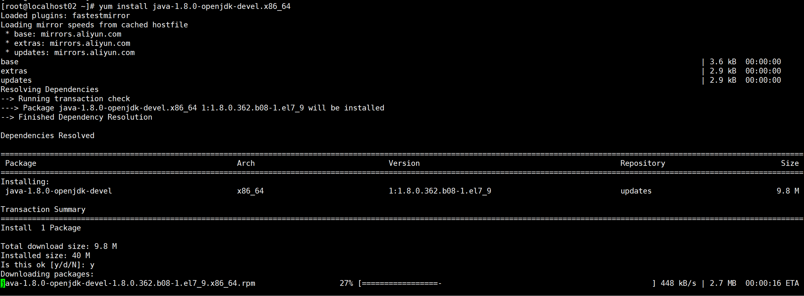

> 等待安装完毕，再次执行： `javac`

``` shell
[root@localhost02 ~]# javac
Usage: javac <options> <source files>
where possible options include:
  -g                         Generate all debugging info
  -g:none                    Generate no debugging info
  -g:{lines,vars,source}     Generate only some debugging info
  -nowarn                    Generate no warnings
  -verbose                   Output messages about what the compiler is doing
  -deprecation               Output source locations where deprecated APIs are used
  -classpath <path>          Specify where to find user class files and annotation processors
  -cp <path>                 Specify where to find user class files and annotation processors
  -sourcepath <path>         Specify where to find input source files
  -bootclasspath <path>      Override location of bootstrap class files
  -extdirs <dirs>            Override location of installed extensions
  -endorseddirs <dirs>       Override location of endorsed standards path
  -proc:{none,only}          Control whether annotation processing and/or compilation is done.
  -processor <class1>[,<class2>,<class3>...] Names of the annotation processors to run; bypasses default discovery process
  -processorpath <path>      Specify where to find annotation processors
  -parameters                Generate metadata for reflection on method parameters
  -d <directory>             Specify where to place generated class files
  -s <directory>             Specify where to place generated source files
  -h <directory>             Specify where to place generated native header files
  -implicit:{none,class}     Specify whether or not to generate class files for implicitly referenced files
  -encoding <encoding>       Specify character encoding used by source files
  -source <release>          Provide source compatibility with specified release
  -target <release>          Generate class files for specific VM version
  -profile <profile>         Check that API used is available in the specified profile
  -version                   Version information
  -help                      Print a synopsis of standard options
  -Akey[=value]              Options to pass to annotation processors
  -X                         Print a synopsis of nonstandard options
  -J<flag>                   Pass <flag> directly to the runtime system
  -Werror                    Terminate compilation if warnings occur
  @<filename>                Read options and filenames from file

[root@localhost02 ~]# 
```

> 此时，说明java已经可用了，说明开发环境已经 OK。

#### 4.1.7 设置环境变量

> 修改/etc/profile 文件：vi /etc/profile
>
> 在 profile 文件末尾新增如下内容：
>
> **JAVA_HOME=/usr/lib/jvm/java-1.8.0-openjdk-1.8.0.362.b08-1.el7_9.x86_64**
>
> **JRE_HOME=$JAVA_HOME/jre**
>
> **CLASS_PATH=.:$JAVA_HOME/lib/dt.jar:$JAVA_HOME/lib/tools.jar:$JRE_HOME/lib**
>
> **PATH=$PATH:$JAVA_HOME/bin:$JRE_HOME/bin**
>
> **export JAVA_HOME JRE_HOME CLASS_PATH PATH**

``` shell
[root@localhost02 ~]# vim /etc/profile
输入i 进入输入模式
```

>  粘贴环境变量内容如下图：

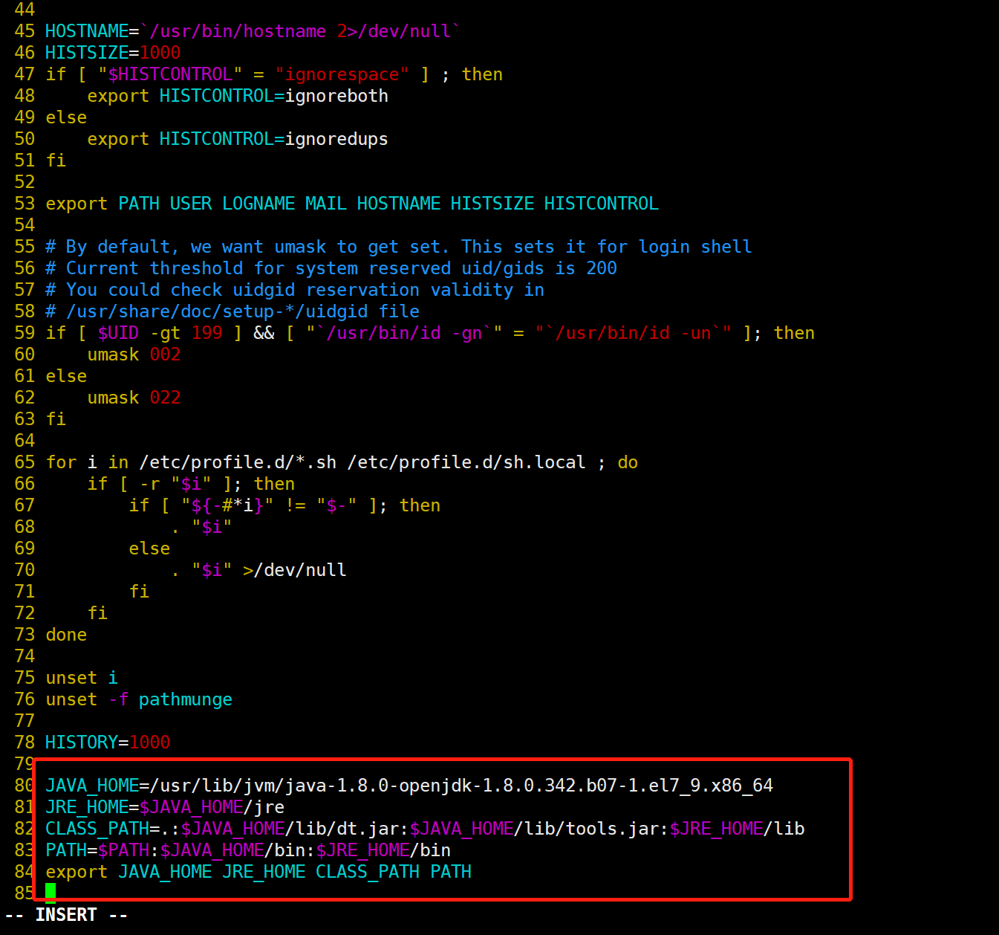

> Esc + wq! 保存即可

> 再次查看配置：

``` shell
[root@localhost02 ~]# cat /etc/profile
...
HISTORY=1000

JAVA_HOME=/usr/lib/jvm/java-1.8.0-openjdk-1.8.0.342.b07-1.el7_9.x86_64
JRE_HOME=$JAVA_HOME/jre
CLASS_PATH=.:$JAVA_HOME/lib/dt.jar:$JAVA_HOME/lib/tools.jar:$JRE_HOME/lib
PATH=$PATH:$JAVA_HOME/bin:$JRE_HOME/bin
export JAVA_HOME JRE_HOME CLASS_PATH PATH

[root@localhost02 ~]# ^C
[root@localhost02 ~]# 
```

> 最后，激活配置。  使用命令：  `source /etc/profile`

#### 4.1.8 验证环境变量

> 使用命令： 
>
> java -version 
>
> echo $JAVA_HOME
>
> echo $JRE_HOME
>
> echo $CLASSPATH
>
> echo $PATH
>
> 进行验证

``` shell
[root@localhost02 ~]# java -version
openjdk version "1.8.0_362"
OpenJDK Runtime Environment (build 1.8.0_362-b08)
OpenJDK 64-Bit Server VM (build 25.362-b08, mixed mode)
[root@localhost02 ~]# echo $JAVA_HOME
/usr/lib/jvm/java-1.8.0-openjdk-1.8.0.342.b07-1.el7_9.x86_64
[root@localhost02 ~]# echo $JRE_HOME
/usr/lib/jvm/java-1.8.0-openjdk-1.8.0.342.b07-1.el7_9.x86_64/jre
[root@localhost02 ~]# echo $PATH
/usr/local/sbin:/usr/local/bin:/usr/sbin:/usr/bin:/root/bin:/usr/lib/jvm/java-1.8.0-openjdk-1.8.0.342.b07-1.el7_9.x86_64/bin:/usr/lib/jvm/java-1.8.0-openjdk-1.8.0.342.b07-1.el7_9.x86_64/jre/bin
[root@localhost02 ~]# echo $CLASSPATH

[root@localhost02 ~]# echo $CLASS_PATH
.:/usr/lib/jvm/java-1.8.0-openjdk-1.8.0.342.b07-1.el7_9.x86_64/lib/dt.jar:/usr/lib/jvm/java-1.8.0-openjdk-1.8.0.342.b07-1.el7_9.x86_64/lib/tools.jar:/usr/lib/jvm/java-1.8.0-openjdk-1.8.0.342.b07-1.el7_9.x86_64/jre/lib
[root@localhost02 ~]# 
```

> 至此，Linux下CentOS系统安装OpenJDK8 完毕。

#### 4.1.9 命令整合

```shell
yum search java|grep jdk &&
yum -y install java-1.8.0-openjdk &&
which java &&
ls -lrt /usr/bin/java &&
ls -lrt /etc/alternatives/java &&
ls -lrt /etc/alternatives/java &&
cd /usr/lib/jvm &&
ll &&
java -version &&
yum -y install java-1.8.0-openjdk-devel.x86_64 &&
sed -i '/unset i/i\\n' /etc/profile &&
sed -i '/unset i/iJAVA_HOME=/usr/lib/jvm/java-1.8.0-openjdk-1.8.0.362.b08-1.el7_9.x86_64' /etc/profile &&
sed -i '/unset i/i\\n' /etc/profile && 
sed -i '/unset i/iJRE_HOME=$JAVA_HOME/jre' /etc/profile &&
sed -i '/unset i/i\\n' /etc/profile && 
sed -i '/unset i/iCLASS_PATH=.:$JAVA_HOME/lib/dt.jar:$JAVA_HOME/lib/tools.jar:$JRE_HOME/lib' /etc/profile &&
sed -i '/unset i/i\\n' /etc/profile &&
sed -i '/unset i/iPATH=$PATH:$JAVA_HOME/bin:$JRE_HOME/bin' /etc/profile &&
sed -i '/unset i/i\\n' /etc/profile &&
sed -i '/unset i/iexport JAVA_HOME JRE_HOME CLASS_PATH PATH' /etc/profile &&
sed -i '/unset i/i\\n' /etc/profile &&
source /etc/profile && 
java -version
```

### 4.2 Ali CentOS7-Linux下安装部署Nexus(下载、安装、使用)

#### 4.2.1 准备工作

> - 由于Nexus 是基于 Java 语言的，因此安装 Nexus 必须先安装好JAVA(JDK)
>
> - Nexus需要服务器的配置校验，需要4核16G以上
>
> - 服务器需要开放端口号：8081/或者自定义的端口号

``` shell
# 查看所有开放的端口号
sudo firewall-cmd --zone=public --list-ports
# 添加8081/或者自定义的端口号为开放的端口号
sudo firewall-cmd --zone=public --add-port=8081/tcp
# 重启防火墙
sudo firewall-cmd --reload
# 查看所有开放的端口号
sudo firewall-cmd --zone=public --list-ports
# 查看服务器配置

```

``` shell
[root@localhost1 jvm]# sudo firewall-cmd --zone=public --list-ports
1935/tcp 8080/tcp 8081/tcp 8082/tcp 8083/tcp
```

#### 4.2.2  下载Nexus的Linux环境安装包

> 因为官网下载需要VPN并且下载贼慢，所以建议百度云盘下载，下面提供一个永久的链接
>
> 链接：https://pan.baidu.com/s/1GyS34RxJKiNhVGl3NoRifQ?pwd=khfp 
>
> 提取码：khfp

#### 4.2.3 上传安装包

> 下载完毕需要将该文件上传到服务器中，执行命令如下：

``` shell
[root@localhost1 /]# cd /home/
[root@localhost1 home]# ll
total 0
[root@localhost1 home]# mkdir qianpz
[root@localhost1 home]# cd qianpz/
[root@localhost1 qianpz]# mkdir nexus
[root@localhost1 qianpz]# ls
nexus
[root@localhost1 qianpz]# cd nexus/
[root@localhost1 nexus]# ll
total 0
[root@localhost1 nexus]# pwd
/home/qianpz/nexus
[root@localhost1 nexus]# 
[root@localhost1 nexus]# rz

[root@localhost1 nexus]# ll
total 156264
-rw-r--r-- 1 root root 160013693 Sep  7 15:15 nexus-3.25.1-04-unix.tar.gz
[root@localhost1 nexus]# 

```

#### 4.2.4 解压安装包

> tar -zxvf nexus-3.25.1-04-unix.tar.gz

``` shell
[root@localhost1 nexus]# tar -zxvf nexus-3.25.1-04-unix.tar.gz
[root@localhost1 nexus]# ...
[root@localhost1 nexus]# ll
total 156264
drwxr-xr-x 9 root root       163 Feb  8 20:29 nexus-3.25.1-04
-rw-r--r-- 1 root root 160013693 Sep  7 15:15 nexus-3.25.1-04-unix.tar.gz
drwxr-xr-x 3 root root        20 Feb  8 20:29 sonatype-work
[root@localhost1 nexus]#
```

> 这里可以看到2个文件夹:
>
> nexus-3.25.1-04    用于实现nexus的功能
>
> sonatype-work     用于存储数据

#### 4.2.5 启动Nexus

##### 4.2.5.1 启动命令

> 首先，进入该安装包的bin目录下,可以看到nexus的脚本文件，可以进入查看如下：

``` shell
[root@localhost1 nexus]# cd nexus-3.25.1-04
[root@localhost1 nexus-3.25.1-04]# ll
total 76
drwxr-xr-x  3 root root    73 Feb  8 20:29 bin
drwxr-xr-x  2 root root    26 Feb  8 20:29 deploy
drwxr-xr-x  7 root root   104 Feb  8 20:29 etc
drwxr-xr-x  5 root root   206 Feb  8 20:29 lib
-rw-r--r--  1 root root   395 Jul 30  2020 NOTICE.txt
-rw-r--r--  1 root root 17321 Jul 30  2020 OSS-LICENSE.txt
-rw-r--r--  1 root root 41954 Jul 30  2020 PRO-LICENSE.txt
drwxr-xr-x  3 root root  4096 Feb  8 20:29 public
drwxr-xr-x 21 root root  4096 Feb  8 20:29 system
[root@localhost1 nexus-3.25.1-04]# cd bin/
[root@localhost1 bin]# ll
total 32
drwxr-xr-x 2 root root  4096 Feb  8 20:29 contrib
-rwxr-xr-x 1 root root 18544 Jul 30  2020 nexus
-rw-r--r-- 1 root root    15 Jul 30  2020 nexus.rc
-rw-r--r-- 1 root root  1504 Jul 30  2020 nexus.vmoptions
[root@localhost1 bin]
```

> cat nexus
>
> 可以看到最后有一串： 如下图：
>
> ```shell
> *)
>  echo "Usage: $0 {start|stop|run|run-redirect|status|restart|force-reload}"
>  exit 1
> ;;
> ```

> 通过观察该文件文本内容，可以看到 start 和 run 命令都可以用来启动 Nexus 服务；区别在于：
>
> start 是后台启动，日志以文件形式保存；
>
> run 是当前进程启动，直接打印在控制台；
>
> stop 是停止进程
>
> restart 重启服务
>
> status 查看服务状态
>
> so 启动命令为：
>
> ./nexus restart

##### 4.2.5.2 服务的端口号配置

> Nexus的默认端口号为8081，可以通过下面的配置查看和修改:
>
> cat  ../etc/nexus-default.properties 
>
> ``` shell
> [root@localhost1 etc]# cat nexus-default.properties 
> # DO NOT EDIT - CUSTOMIZATIONS BELONG IN $data-dir/etc/nexus.properties
> #
> # Jetty section
> application-port=8081
> application-host=0.0.0.0
> nexus-args=${jetty.etc}/jetty.xml,${jetty.etc}/jetty-http.xml,${jetty.etc}/jetty-requestlog.xml
> nexus-context-path=/
> 
> # Nexus section
> nexus-edition=nexus-pro-edition
> nexus-features=\
> nexus-pro-feature
> 
> nexus.hazelcast.discovery.isEnabled=true
> [root@localhost1 etc]# 
> ```
>
> 可以查看nexus.properties中存在 application-port=8081，若需要变更，自行修改即可。这里默认8081.

##### 4.2.5.3 启动服务

> 使用命令：
>
> cd /home/qianpz/nexus
>
> cd /nexus-3.25.1-04/bin
>
> ./nexus start

##### 4.2.5.4 验证是否启动成功

> 等待1分钟后，nexus启动较慢；
>
> 然后进入浏览器，输入 http://ip:8081/nexus 查看即可，ip为你的服务器IP
>
> 出现下图：
>
> 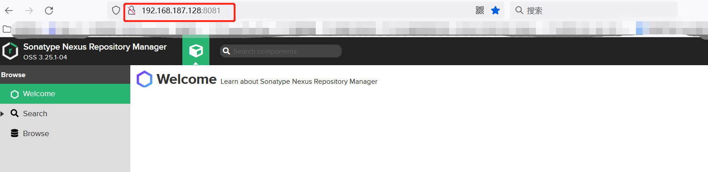
>
> 此时： 说明已经启动成功了。

#### 4.2.6 CentOS启动立即启动Nexus设置

##### 4.2.6.1 新建Nexus启动脚本

> 进入`/etc/init.d`目录，新建脚本文件nexus进入`/etc/init.d`目录，新建脚本文件nexus

``` powershell
[root@localhost1 ~]# cd /etc/init.d/
[root@localhost1 init.d]# ll
total 40
-rw-r--r--. 1 root root 18281 May 22  2020 functions
-rwxr-xr-x. 1 root root  4569 May 22  2020 netconsole
-rwxr-xr-x. 1 root root  7928 May 22  2020 network
-rw-r--r--  1 root root  1160 Sep  1 22:57 README
[root@localhost1 init.d]# vim nexus
```

> i 进入输入模式：

``` shell
#!/bin/bash
#chkconfig:2345 20 90
#description:nexus
#processname:nexus

export JAVA_HOME=/usr/lib/jvm/java-1.8.0-openjdk-1.8.0.362.b07-1.el7_9.x86_64

case $1 in
        start) su root /home/qianpz/nexus/nexus-3.25.1-04/bin/nexus  start;;
        stop) su root /home/qianpz/nexus/nexus-3.25.1-04/bin/nexus  stop;;
        status) su root /home/qianpz/nexus/nexus-3.25.1-04/bin/nexus  status;;
        restart) su root /home/qianpz/nexus/nexus-3.25.1-04/bin/nexus  restart;;
        dunp) su root /home/qianpz/nexus/nexus-3.25.1-04/bin/nexus  dump;;
        console) su root /home/qianpz/nexus/nexus-3.25.1-04/bin/nexus  console;;
        *) echo "Usage: nexus {start|stop|restart|status|run|run-redirect|force-reload}"
esac
```

> wq! 保存

##### 4.2.6.2 脚本赋权限

> chmod 777 nexus

``` shell
[root@localhost1 init.d]# ll
total 44
-rw-r--r--. 1 root root 18281 May 22  2020 functions
-rwxr-xr-x. 1 root root  4569 May 22  2020 netconsole
-rwxr-xr-x. 1 root root  7928 May 22  2020 network
-rw-r--r--  1 root root   676 Feb  9 00:31 nexus
-rw-r--r--  1 root root  1160 Sep  1 22:57 README
[root@localhost1 init.d]# chmod 777 nexus 
[root@localhost1 init.d]# ll
total 44
-rw-r--r--. 1 root root 18281 May 22  2020 functions
-rwxr-xr-x. 1 root root  4569 May 22  2020 netconsole
-rwxr-xr-x. 1 root root  7928 May 22  2020 network
-rwxrwxrwx  1 root root   676 Feb  9 00:31 nexus
-rw-r--r--  1 root root  1160 Sep  1 22:57 README
[root@localhost1 init.d]#
```

##### 4.2.6.3 配置开机自启动

``` shell
[root@localhost1 init.d]# chkconfig --add nexus
[root@localhost1 init.d]# chkconfig --list nexus

Note: This output shows SysV services only and does not include native
      systemd services. SysV configuration data might be overridden by native
      systemd configuration.

      If you want to list systemd services use 'systemctl list-unit-files'.
      To see services enabled on particular target use
      'systemctl list-dependencies [target]'.

nexus          	0:off	1:off	2:on	3:on	4:on	5:on	6:off
[root@localhost1 init.d]# 
```

##### 4.2.6.4 验证开机是否自启动

```shell
[root@localhost1 init.d]# servic nexus status
-bash: servic: command not found
[root@localhost1 init.d]# service nexus status
WARNING: ************************************************************
WARNING: Detected execution as "root" user.  This is NOT recommended!
WARNING: ************************************************************
nexus is stopped.
[root@localhost1 init.d]# 
```

> 重启服务器
>
> shutdown -r now

``` shell
[root@localhost1 init.d]# shutdown -r now
Connection closing...Socket close.

Connection closed by foreign host.

Disconnected from remote host(虚拟机-192.168.187.128) at 00:40:48.

Type `help' to learn how to use Xshell prompt.
[C:\~]$ 
```

> 重新连接：查看

``` shell
[root@localhost1 ~]# cd /etc/init.d/
[root@localhost1 init.d]# ll
total 44
-rw-r--r--. 1 root root 18281 May 22  2020 functions
-rwxr-xr-x. 1 root root  4569 May 22  2020 netconsole
-rwxr-xr-x. 1 root root  7928 May 22  2020 network
-rwxrwxrwx  1 root root   676 Feb  9 00:31 nexus
-rw-r--r--  1 root root  1160 Sep  1 22:57 README
[root@localhost1 init.d]# service nexus status
WARNING: ************************************************************
WARNING: Detected execution as "root" user.  This is NOT recommended!
WARNING: ************************************************************
nexus is running.
[root@localhost1 init.d]#
```

> 可以看到 nexus is running 了 ！ 说明 nexus 随服务器的启动自启动成功了。

#### 4.2.7 Nexus的使用

##### 4.2.7.1 登录和查看nexus的控制台的账号和密码

> 进入目录: sonatype-work/nexus3下，如图：使用cat进行查看密码: 
>
> cat admin.password

```shell
    [root@localhost1 init.d]# cd /home/qianpz/nexus/sonatype-work/
[root@localhost1 sonatype-work]# ll
total 0
drwxr-xr-x 14 root root 259 Feb  9 00:41 nexus3
[root@localhost1 sonatype-work]# cd nexus3/
[root@localhost1 nexus3]# ll
total 28
-rw-r--r--   1 root root   36 Feb  8 20:40 admin.password
drwxr-xr-x   3 root root   21 Feb  8 20:40 blobs
drwxr-xr-x 316 root root 8192 Feb  9 00:42 cache
drwxr-xr-x   6 root root  113 Feb  8 20:40 db
drwxr-xr-x   3 root root   19 Feb  8 20:40 elasticsearch
drwxr-xr-x   3 root root   45 Feb  8 20:39 etc
drwxr-xr-x   2 root root    6 Feb  8 20:39 generated-bundles
drwxr-xr-x   2 root root   33 Feb  8 20:39 instances
-rw-r--r--   1 root root    4 Feb  9 00:41 karaf.pid
drwxr-xr-x   3 root root   18 Feb  8 20:40 keystores
-rw-r--r--   1 root root   15 Feb  9 00:41 lock
drwxr-xr-x   4 root root  209 Feb  9 00:43 log
drwxr-xr-x   3 root root   21 Feb  8 20:29 orient
-rw-r--r--   1 root root    5 Feb  9 00:41 port
drwxr-xr-x   2 root root    6 Feb  8 20:40 restore-from-backup
drwxr-xr-x   8 root root  228 Feb  9 00:42 tmp
[root@localhost1 nexus3]# pwd
/home/qianpz/nexus/sonatype-work/nexus3
[root@localhost1 nexus3]# cat admin.password
f59595fd-e073-4f5c-8946-b8228218dd62[root@localhost1 nexus3]#
```

> 这里说明：f59595fd-e073-4f5c-8946-b8228218dd62  就是初始密码

##### 4.2.7.2 登录Nexus控制台

- 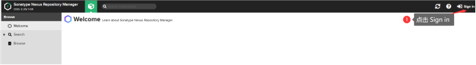


- 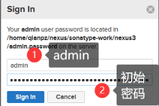

- ****

- 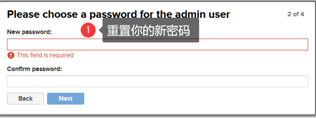


> 这里为了方便，密码为: admin

- 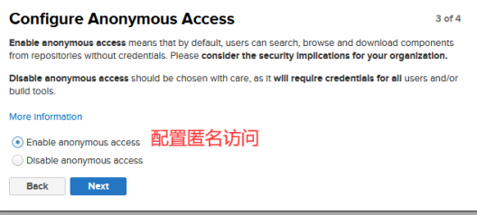

- 

##### 4.2.7.3 Nexus System Status 处理

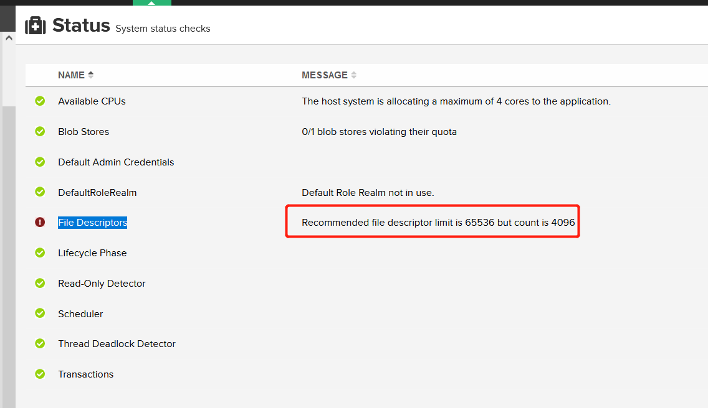

> 这个是因为服务器中的配置导致。
>
> 原因是 Nexus 3 将很有可能要消耗比 Linux 或 OSX 操作系统允许每个用户的默认文件句柄数（4096）更多的数量。
>
> **解决方法**:
>
> 在多数 Linux 系统上，可以通过编辑 `/etc/security/limits.conf` 文件为特定用户设置持久限制。若要将 Nexus 用户的软限制和硬限制的最大打开文件数设置为 65536，请在 `/etc/security/limits.conf` 文件中添加以下行，其中 “nexus” 应该替换为用于运行 `Nexus` 的用户登录名（如 `root`）：
>
> ```javascript
> 1nexus - nofile 65536
> ```
>
> 保存此配置文件后重启 Nexus

``` shell
[root@localhost1 nexus3]# cd /etc/security/
[root@localhost1 security]# pwd
/etc/security
[root@localhost1 security]# ls
access.conf  console.apps      console.perms    group.conf   limits.d        namespace.d     opasswd       pwquality.conf  time.conf
chroot.conf  console.handlers  console.perms.d  limits.conf  namespace.conf  namespace.init  pam_env.conf  sepermit.conf
[root@localhost1 security]# vim limits.conf 
[root@localhost1 security]# 

```


> 重启服务器 重启Nexux

``` shell
[root@localhost1 security]# cd /home/qianpz/nexus/nexus-3.25.1-04/bin/
[root@localhost1 bin]# ./nexus restart
WARNING: ************************************************************
WARNING: Detected execution as "root" user.  This is NOT recommended!
WARNING: ************************************************************
Shutting down nexus
Stopped.
Restarting nexus
[root@localhost1 bin]# shutdown -r now
```

> 再次登录查看System Status：

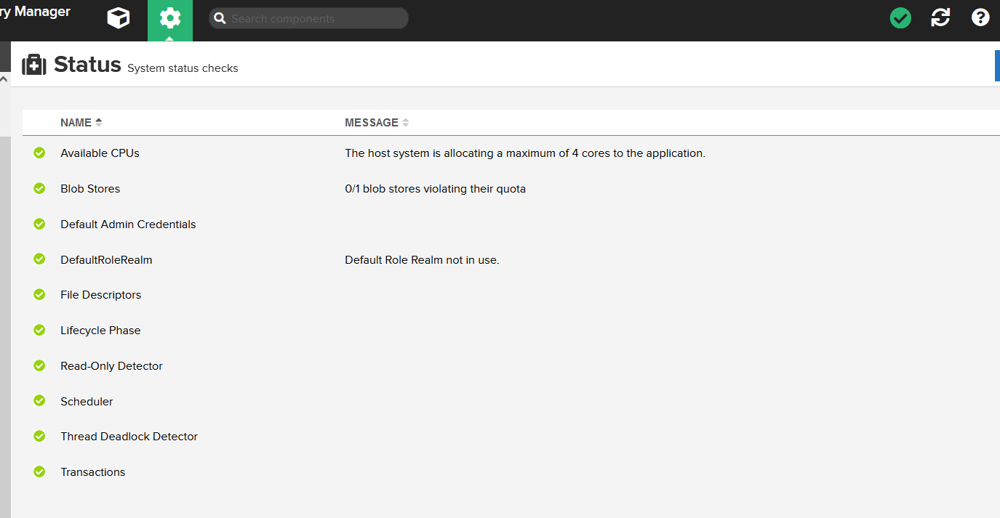

##### 4.2.7.4 创建阿里云的代理仓库maven-aliyun

Nexus中可以创建三种仓库类型，分别为proxy、group、hosted，其中proxy就是仓库代理，我们可以代理其他的Maven仓库

- 首先点击Create repository按钮

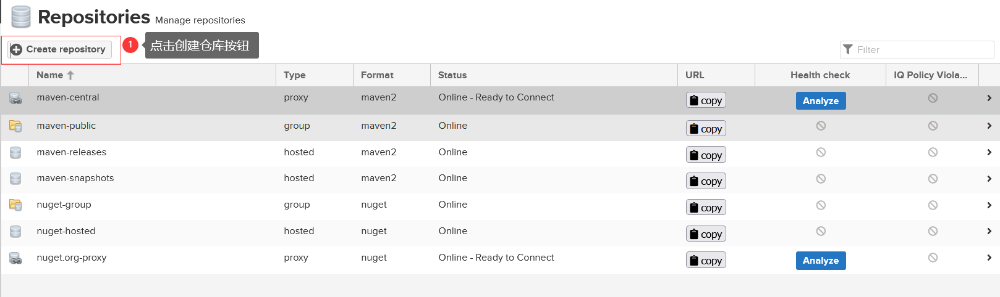

- 选择Maven2(proxy)

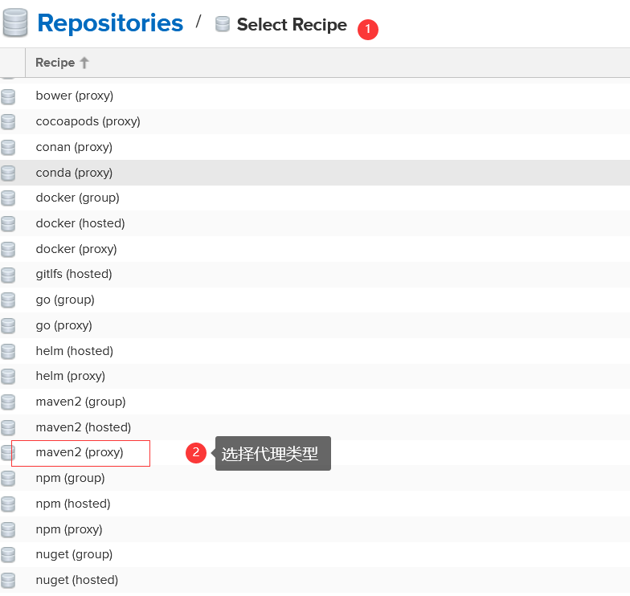

- 输入Name，Url，其他的保持默认值

> https://IP/repository/maven-aliyun/

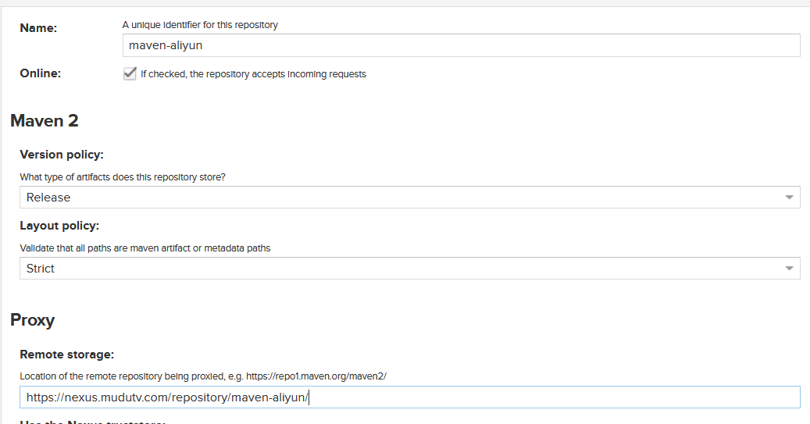

- 创建成功

  

##### 4.2.7.5 创建阿里云的代理仓库nexus-aliyun

- 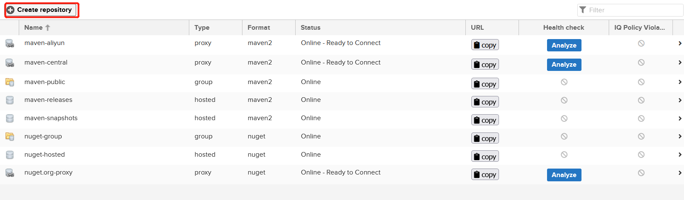
- 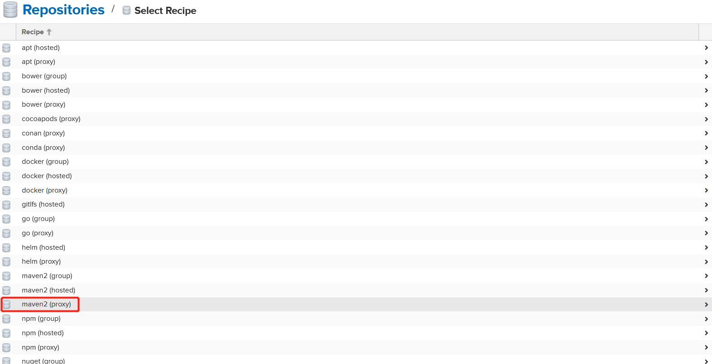

- 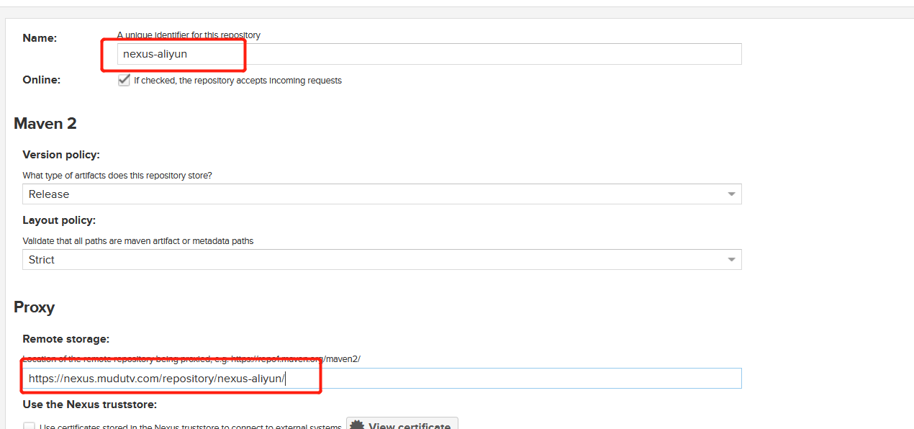

>   https://IP/repository/nexus-aliyun/

#### 4.2.8 maven中的Setting.xml 配置

``` xml
		<server>
			<id>virtual-nexus</id>
			<username>admin</username>
			<password>admin</password>
		</server>

		<mirror>
			<!--This sends everything else to /public -->
			<id>nexus</id>
			<url>https://192.168.187.128:8081/repository/maven-public/</url>
			<mirrorOf>*</mirrorOf> 
		</mirror>

		<profile>
			<id>virtual-nexus-profile</id>
			<repositories>
				<repository>
					<id>virtual-nexus</id>
					<url>https://192.168.187.128:8081/repository/maven-public/</url>
					<layout>default</layout>
					<releases>  
						<enabled>true</enabled>  
					</releases>
					<snapshots>  
						<enabled>true</enabled>  
					</snapshots>
				</repository>
			</repositories>
			<pluginRepositories>  
				<pluginRepository>  
					<id>virtual-nexus</id>  
					<url>https://192.168.187.128:8081/repository/maven-public/</url>
					<layout>default</layout>
					<releases>  
						<enabled>true</enabled>  
					</releases>  
					<snapshots>  
						<enabled>true</enabled>  
					</snapshots>      
				</pluginRepository>  
			</pluginRepositories> 
		</profile>

		<activeProfile>virtual-nexus-profile</activeProfile>
```

#### 4.2.9 遇到的问题和解决方案

##### 4.2.9.1 deploy 报 400

> 现象：maven return code is:400,ReasonPhrase:Repository does not allow updating assets

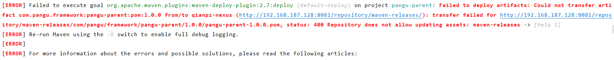

> 原因： 发布版本不允许重复发布

> 解决方案：去nexus配置，如下图

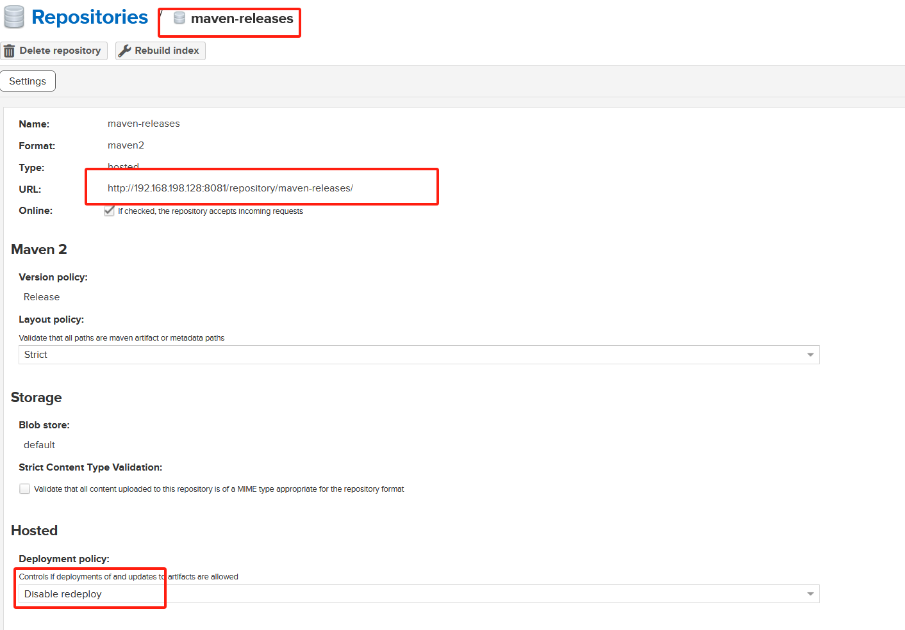

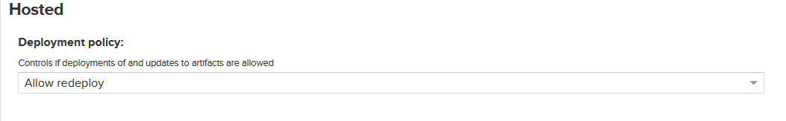


