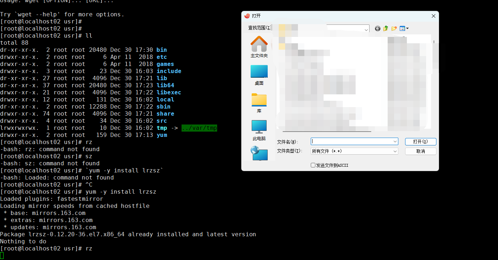
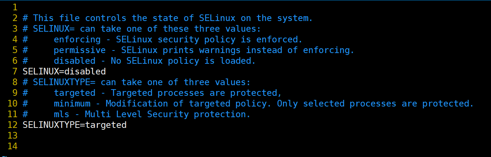
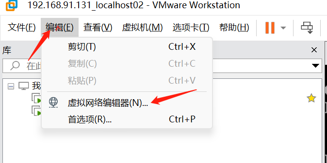
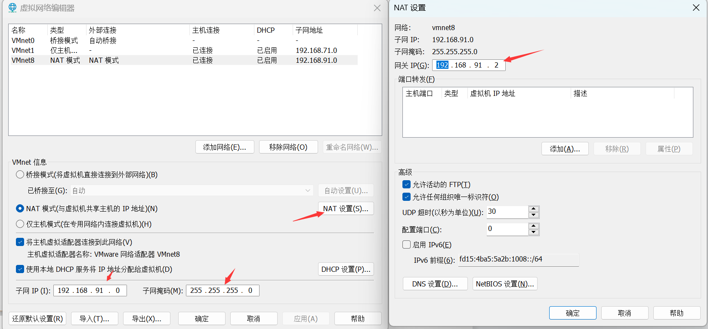

# 随笔 - Linux命令

[[toc]]

## 一、CentOS7中常用命令安装和使用

### 1.1 此时最小化安装的环境存在了以下命令：

#### 1.1.1 rpm

>  Red-Hat Package Mananger
>
>  1. 由Red Hat公司提出，被众多Linux发往行版所采用
>  2. 建立统一的文件数据库
>  3. 详细记录软件包安装、卸载、升级等变化信息
>  4. 自动分析软件包依赖关系
>
>  rpm命令功能: 
>
>  - 查询、验证RPM软件包的相关信息
>  - 安装、升级、卸载RPM软件包
>  - 维护重建RPM数据库信息等综合管理操作 


#### 1.1.2 yum


#### 1.1.3 CentOS7的安装包下载地址

http://mirror.centos.org/centos/7/os/x86_64/Packages/

#### 1.1.4 ping

```shell
[root@localhost02 ~]# ping www.baidu.com
PING www.a.shifen.com (182.61.200.7) 56(84) bytes of data.
64 bytes from 182.61.200.7 (182.61.200.7): icmp_seq=1 ttl=128 time=33.2 ms
64 bytes from 182.61.200.7 (182.61.200.7): icmp_seq=2 ttl=128 time=30.7 ms
64 bytes from 182.61.200.7 (182.61.200.7): icmp_seq=3 ttl=128 time=30.0 ms
^C
--- www.a.shifen.com ping statistics ---
3 packets transmitted, 3 received, 0% packet loss, time 2003ms
rtt min/avg/max/mdev = 30.085/31.343/33.245/1.382 ms
[root@localhost02 ~]# 
```

#### 1.1.5 vi

``` shell
[root@localhost02 ~]# vi --help
VIM - Vi IMproved 7.4 (2013 Aug 10, compiled Dec 15 2020 16:43:23)

usage: vim [arguments] [file ..]       edit specified file(s)
   or: vim [arguments] -               read text from stdin
   or: vim [arguments] -t tag          edit file where tag is defined
```

### 1.2 yum命令安装更新

#### 1.2.1 查看是否存在YUM命令

``` shell
[root@localhost02 ~]# rpm -qa yum
yum-3.4.3-168.el7.centos.noarch
[root@localhost02 ~]# 
```

> 上述说明yum存在，但是需要升级更新下

#### 1.2.2 升级yum命令

```shell
[root@localhost02 yum]# yum -y update
```


```shell
[root@localhost02 yum]# rpm -qa | grep yum
yum-metadata-parser-1.1.4-10.el7.x86_64
yum-3.4.3-168.el7.centos.noarch
yum-plugin-fastestmirror-1.1.31-54.el7_8.noarch
[root@localhost02 yum]# 
```

> 出现上述版本号和插件镜像则说明升级完毕

#### 1.2.3 卸载yum

```shell
[root@localhost02 yum]# rpm -qa | grep yum
yum-metadata-parser-1.1.4-10.el7.x86_64
yum-3.4.3-168.el7.centos.noarch
yum-plugin-fastestmirror-1.1.31-54.el7_8.noarch
[root@localhost02 yum]# 
[root@localhost02 yum]# rpm -qa | grep yum | xargs rpm -e --nodeps     //这步就是卸载和yum有关的所有组件
[root@localhost02 yum]# rpm -qa | grep yum
[root@localhost02 yum]# 
```

#### 1.2.4 重新安装yum

> 从centos官网上下载和yum有关的rpm包  
>
> http://mirror.centos.org/centos/7/os/x86_64/Packages/ 
>
> 下载的包如下：
>
> - [http://mirror.centos.org/centos/7/os/x86_64/Packages/ yum-3.4.3-168.el7.centos.noarch.rpm](http://mirror.centos.org/centos/7/os/x86_64/Packages/yum-3.4.3-168.el7.centos.noarch.rpm)
> - [http://mirror.centos.org/centos/7/os/x86_64/Packages/yum-metadata-parser-1.1.4-10.el7.x86_64.rpm](http://mirror.centos.org/centos/7/os/x86_64/Packages/yum-metadata-parser-1.1.4-10.el7.x86_64.rpm)
> - [http://mirror.centos.org/centos/7/os/x86_64/Packages/yum-plugin-fastestmirror-1.1.31-54.el7_8.noarch.rpm](http://mirror.centos.org/centos/7/os/x86_64/Packages/yum-plugin-fastestmirror-1.1.31-54.el7_8.noarch.rpm)

``` shell
[root@localhost02 ~]# cd /usr/
[root@localhost02 usr]# mkdir yum
[root@localhost02 usr]# cd yum
[root@localhost02 ~]# rz //此时上传已经下载好的3个文件  若没有rz命令可以通过sftp进行上传
[root@localhost02 ~]#
```

> 上传3个文件之后如下：

``` shell
[root@localhost02 yum]# ll
total 1336
-rw-r--r--. 1 root root 1298856 Dec 30 17:13 yum-3.4.3-168.el7.centos.noarch.rpm
-rw-r--r--. 1 root root   28348 Dec 30 17:13 yum-metadata-parser-1.1.4-10.el7.x86_64.rpm
-rw-r--r--. 1 root root   35216 Dec 30 17:13 yum-plugin-fastestmirror-1.1.31-54.el7_8.noarch.rpm
[root@localhost02 yum]# 
```

> 然后执行如下命令进行安装：  因为依赖问题，严格按照下列顺序执行
>
> - rpm -ivh --nodeps --force yum-plugin-fastestmirror-1.1.31-54.el7_8.noarch.rpm 
> - rpm -ivh --nodeps --force yum-metadata-parser-1.1.4-10.el7.x86_64.rpm
> - rpm -ivh yum-3.4.3-168.el7.centos.noarch.rpm

``` shell
[root@localhost02 yum]# rpm -ivh --nodeps --force yum-plugin-fastestmirror-1.1.31-54.el7_8.noarch.rpm 
warning: yum-plugin-fastestmirror-1.1.31-54.el7_8.noarch.rpm: Header V3 RSA/SHA256 Signature, key ID f4a80eb5: NOKEY
Preparing...                          ################# [100%]
Updating / installing...
   1:yum-plugin-fastestmirror-1.1.31-5################# [100%]
[root@localhost02 yum]# 
[root@localhost02 yum]# rpm -ivh --nodeps --force yum-metadata-parser-1.1.4-10.el7.x86_64.rpm 
warning: yum-metadata-parser-1.1.4-10.el7.x86_64.rpm: Header V3 RSA/SHA256 Signature, key ID f4a80eb5: NOKEY
Preparing...                          ################# [100%]
Updating / installing...
   1:yum-metadata-parser-1.1.4-10.el7 ################# [100%]
[root@localhost02 yum]# rpm -ivh yum-3.4.3-168.el7.centos.noarch.rpm 
warning: yum-3.4.3-168.el7.centos.noarch.rpm: Header V3 RSA/SHA256 Signature, key ID f4a80eb5: NOKEY
Preparing...                          ################# [100%]
Updating / installing...
   1:yum-3.4.3-168.el7.centos         ################# [100%]
[root@localhost02 yum]# 
```

> 最终如下：

``` shell
[root@localhost02 yum]# rpm -qa | grep yum
yum-metadata-parser-1.1.4-10.el7.x86_64
yum-plugin-fastestmirror-1.1.31-54.el7_8.noarch
yum-3.4.3-168.el7.centos.noarch
[root@localhost02 yum]# 
```

### 1.3 使用yum命令安装wget命令

#### 1.3.1 查看是否存在wget命令

``` shell
[root@localhost02 usr]# wget
-bash: wget: command not found
[root@localhost02 usr]# 
# 说明不存在wget命令

[root@localhost02 usr]# wget
wget: missing URL
Usage: wget [OPTION]... [URL]...

Try `wget --help' for more options.
[root@localhost02 usr]# 
# 说明存在wget命令
```

#### 1.3.2 安装wget命令

> 使用命令： `yum -y install wget`

``` shell
[root@localhost02 usr]# yum -y install wget
Loaded plugins: fastestmirror
Loading mirror speeds from cached hostfile
 * base: mirrors.163.com
 * extras: mirrors.163.com
 * updates: mirrors.163.com
Resolving Dependencies
--> Running transaction check
---> Package wget.x86_64 0:1.14-18.el7_6.1 will be installed
--> Finished Dependency Resolution

Dependencies Resolved

=============================================================================================================================================================================================
 Package                                   Arch                                        Version                                               Repository                                 Size
=============================================================================================================================================================================================
Installing:
 wget                                      x86_64                                      1.14-18.el7_6.1                                       base                                      547 k

Transaction Summary
=============================================================================================================================================================================================
Install  1 Package

Total download size: 547 k
Installed size: 2.0 M
Downloading packages:
wget-1.14-18.el7_6.1.x86_64.rpm                                                                                                                                       | 547 kB  00:00:00     
Running transaction check
Running transaction test
Transaction test succeeded
Running transaction
  Installing : wget-1.14-18.el7_6.1.x86_64                                                                                                                                               1/1 
  Verifying  : wget-1.14-18.el7_6.1.x86_64                                                                                                                                               1/1 

Installed:
  wget.x86_64 0:1.14-18.el7_6.1                                                                                                                                                              

Complete!
[root@localhost02 usr]#
```

### 1.4 使用yum命令安装lrzsz命令

#### 1.4.1 查看是否存在lrzsz命令

``` shell
[root@localhost02 usr]# rz
-bash: rz: command not found
[root@localhost02 usr]# sz
-bash: sz: command not found
[root@localhost02 usr]#
# 说明不存在lrzsz命令
```



上图说明存在lrzsz命令

#### 1.4.2 安装lrzsz命令

> 使用命令：`yum -y install lrzsz`

``` shell
[root@localhost02 usr]# yum -y install lrzsz
Loaded plugins: fastestmirror
Loading mirror speeds from cached hostfile
 * base: mirrors.163.com
 * extras: mirrors.163.com
 * updates: mirrors.163.com
Package lrzsz-0.12.20-36.el7.x86_64 already installed and latest version
Nothing to do
[root@localhost02 usr]#
```

### 1.5 使用yum命令安装vim命令

#### 1.5.1 查看是否存在vim命令

``` shell
[root@localhost02 ~]# vim
-bash: vim: command not found
[root@localhost02 ~]# 
# 说明找不到vim命令
```

#### 1.5.2 安装vim命令

> 使用命令:  `yum -y install vim`

``` shell
[root@localhost02 ~]# yum -y install vim
...
Installed:
  vim-enhanced.x86_64 2:7.4.629-8.el7_9                                                                                                                                             

Dependency Installed:
  gpm-libs.x86_64 0:1.20.7-6.el7           perl.x86_64 4:5.16.3-299.el7_9             perl-Carp.noarch 0:1.26-244.el7             perl-Encode.x86_64 0:2.51-7.el7                
  perl-Exporter.noarch 0:5.68-3.el7        perl-File-Path.noarch 0:2.09-2.el7         perl-File-Temp.noarch 0:0.23.01-3.el7       perl-Filter.x86_64 0:1.49-3.el7                
  perl-Getopt-Long.noarch 0:2.40-3.el7     perl-HTTP-Tiny.noarch 0:0.033-3.el7        perl-PathTools.x86_64 0:3.40-5.el7          perl-Pod-Escapes.noarch 1:1.04-299.el7_9       
  perl-Pod-Perldoc.noarch 0:3.20-4.el7     perl-Pod-Simple.noarch 1:3.28-4.el7        perl-Pod-Usage.noarch 0:1.63-3.el7          perl-Scalar-List-Utils.x86_64 0:1.27-248.el7   
  perl-Socket.x86_64 0:2.010-5.el7         perl-Storable.x86_64 0:2.45-3.el7          perl-Text-ParseWords.noarch 0:3.29-4.el7    perl-Time-HiRes.x86_64 4:1.9725-3.el7          
  perl-Time-Local.noarch 0:1.2300-2.el7    perl-constant.noarch 0:1.27-2.el7          perl-libs.x86_64 4:5.16.3-299.el7_9         perl-macros.x86_64 4:5.16.3-299.el7_9          
  perl-parent.noarch 1:0.225-244.el7       perl-podlators.noarch 0:2.5.1-3.el7        perl-threads.x86_64 0:1.87-4.el7            perl-threads-shared.x86_64 0:1.43-6.el7        
  vim-common.x86_64 2:7.4.629-8.el7_9      vim-filesystem.x86_64 2:7.4.629-8.el7_9   

Complete!
[root@localhost02 ~]# 
# 此时已经安装完毕
```

#### 1.5.3 修改VIM配置

```shell
vim ~/.vimrc
输入i进入编辑模式
录入：
set encoding=utf-8 " 文件编码
set number " 显示行号
set tabstop=4 " tab宽度为4
set softtabstop=4 " 设置一次可以删除4个空格
set expandtab " tab转换为空格
set nowrap " 不自动换行
set showmatch " 显示括号配对情况
syntax on " 开启语法高亮
然后输入 esc + :wq 进入退出界面
```


### 1.6 使用rpm命令安装curl命令

#### 1.6.1 查看是否存在curl命令

``` shell
^C[root@localhost02 ~]# rpm -qa | grep curl
curl-7.29.0-59.el7_9.1.x86_64
libcurl-7.29.0-59.el7_9.1.x86_64
python-pycurl-7.19.0-19.el7.x86_64
[root@localhost02 ~]#
```


说明已经成功安装了curl

#### 1.6.2 卸载curl命令

``` shell
[root@localhost02 ~]# rpm -qa | grep curl
curl-7.29.0-59.el7_9.1.x86_64
libcurl-7.29.0-59.el7_9.1.x86_64
python-pycurl-7.19.0-19.el7.x86_64
[root@localhost02 ~]# rpm -qa | grep curl | xargs rpm -e --nodeps  //这一步就是卸载CURL
[root@localhost02 ~]# rpm -qa | grep curl
[root@localhost02 ~]#
```

#### 1.6.3 使用rpm命令重新安装curl命令

> 从centos官网上下载和yum有关的rpm包  
>
> http://mirror.centos.org/centos/7/os/x86_64/Packages/ 
>
> 下载的包如下：
>
> 1、[http://mirror.centos.org/centos/7/os/x86_64/Packages/python-pycurl-7.19.0-19.el7.x86_64.rpm](http://mirror.centos.org/centos/7/os/x86_64/Packages/python-pycurl-7.19.0-19.el7.x86_64.rpm)
>
> 2、[http://mirror.centos.org/centos/7/os/x86_64/Packages/libcurl-7.29.0-59.el7.x86_64.rpm](http://mirror.centos.org/centos/7/os/x86_64/Packages/libcurl-7.29.0-59.el7.x86_64.rpm)
>
> 3、[http://mirror.centos.org/centos/7/os/x86_64/Packages/curl-7.29.0-59.el7.x86_64.rpm](http://mirror.centos.org/centos/7/os/x86_64/Packages/curl-7.29.0-59.el7.x86_64.rpm)

下载好后，上传到`/usr/curl/`目录下,如下：

```shell
[root@localhost02 curl]# ll
total 580
-rw-r--r--. 1 root root 277112 Jan 28 10:15 curl-7.29.0-59.el7.x86_64.rpm
-rw-r--r--. 1 root root 228500 Jan 28 10:14 libcurl-7.29.0-59.el7.x86_64.rpm
-rw-r--r--. 1 root root  82396 Jan 28 10:13 python-pycurl-7.19.0-19.el7.x86_64.rpm
[root@localhost02 curl]# 
```

> 然后执行如下命令进行安装：  因为依赖问题，严格按照下列顺序执行
>
> **rpm -ivh --nodeps python-pycurl-7.19.0-19.el7.x86_64.rpm** 
>
> **rpm -ivh --nodeps libcurl-7.29.0-59.el7.x86_64.rpm** 
>
> **rpm -ivh --nodeps curl-7.29.0-59.el7.x86_64.rpm** 
>
> 最后使用`rpm -qa | grep curl`查看

``` shell
[root@localhost02 curl]# rpm -ivh --nodeps python-pycurl-7.19.0-19.el7.x86_64.rpm 
Preparing...                          ################# [100%]
Updating / installing...
   1:python-pycurl-7.19.0-19.el7      ################# [100%]
[root@localhost02 curl]# rpm -ivh --nodeps libcurl-7.29.0-59.el7.x86_64.rpm 
Preparing...                          ################# [100%]
Updating / installing...
   1:libcurl-7.29.0-59.el7            ################# [100%]
[root@localhost02 curl]# 
[root@localhost02 curl]# rpm -ivh --nodeps curl-7.29.0-59.el7.x86_64.rpm 
Preparing...                          ################# [100%]
Updating / installing...
   1:curl-7.29.0-59.el7               ################# [100%]
[root@localhost02 curl]# rpm -qa | grep curl
python-pycurl-7.19.0-19.el7.x86_64
curl-7.29.0-59.el7.x86_64
libcurl-7.29.0-59.el7.x86_64
[root@localhost02 curl]# 
```

至此，curl命令则安装完毕。

### 1.7 使用yum命令安装telnet命令

#### 1.7.1 查看是否存在telnet命令

``` shell
[root@localhost02 curl]# telnet
-bash: telnet: command not found
[root@localhost02 curl]#
```

说明telnet命令不存在

#### 1.7.2 安装telnet命令

> 使用命令如下： **yum -y install telnet**


``` shell
[root@localhost02 /]# telnet 192.168.91.129
Trying 192.168.91.129...
telnet: connect to address 192.168.91.129: No route to host
[root@localhost02 /]# 
```

### 1.8 使用 yum命令安装tree命令

#### 1.8.1 查看是否存在tree命令

``` shell
[root@localhost02 /]# tree
-bash: tree: command not found
[root@localhost02 /]# 
```

说明不存在tree命令

#### 1.8.2 使用yum命令安装tree

> 使用命令： `yum -y install tree`


``` shell
[root@localhost02 yum]# tree
.
├── yum-3.4.3-168.el7.centos.noarch.rpm
├── yum-metadata-parser-1.1.4-10.el7.x86_64.rpm
└── yum-plugin-fastestmirror-1.1.31-54.el7_8.noarch.rpm

0 directories, 3 files
[root@localhost02 yum]# 
```

### 1.9 使用yum命令安装ifconfig命令

#### 1.9.1 查看ifconfig命令是否存在

``` shell
[root@localhost02 usr]# ifconfig
-bash: ifconfig: command not found
[root@localhost02 usr]# 
```

说明不存在

#### 1.9.2 安装命令

> 使用命名：  `yum -y install net-tools`

``` shell
[root@localhost02 usr]# yum -y install net-tools
```


#### 1.9.3 查看IP

> 可以使用 `ip addr`  或者 `ifconfig` 2个命令进行查看


### 1.10 使用yum命令安装其他的依赖关系

> 使用如下命令：
>
> **`yum -y install gcc gcc-c++ make autoconf libjpeg libjpeg-devel libpng libpng-devel freetype freetype-devel libxml2 libxml2-devel zlib zlib-devel glibc glibc-devel glib2 glib2-devel bzip2 bzip2-devel ncurses ncurses-devel curl curl-devel e2fsprogs e2fsprogs-devel krb5-devel libidn libidn-devel openssl openssl-devel libxslt-devel libevent-devel libtool libtool-ltdl bison gd gd-devel vim-enhanced pcre-devel zip unzip ntpdate sysstat patch bc expect rsync`**

### 1.11 查看磁盘的大小

> **`df -h`**

``` shell
[root@localhost02 /]# df -h
Filesystem               Size  Used Avail Use% Mounted on
devtmpfs                 7.8G     0  7.8G   0% /dev
tmpfs                    7.8G     0  7.8G   0% /dev/shm
tmpfs                    7.8G   12M  7.8G   1% /run
tmpfs                    7.8G     0  7.8G   0% /sys/fs/cgroup
/dev/mapper/centos-root   10G  2.1G  8.0G  21% /
/dev/sda1                197M  173M   24M  88% /boot
tmpfs                    1.6G     0  1.6G   0% /run/user/0
[root@localhost02 /]# 

```

### 1.12 在远程Linux主机上安装ssh服务器

> \# 安装
>
> sudo yum install -y openssh-server
>
> \#检查服务是否启动成功
>
> ps -e|grep ssh

``` shell
[root@localhost02 /]# sudo yum install -y openssh-server
Loaded plugins: fastestmirror
Loading mirror speeds from cached hostfile
 * base: mirrors.aliyun.com
 * extras: mirrors.aliyun.com
 * updates: mirrors.aliyun.com
Package openssh-server-7.4p1-22.el7_9.x86_64 already installed and latest version
Nothing to do
[root@localhost02 /]# ps -ef | grep ssh
root       1035      1  0 14:24 ?        00:00:00 /usr/sbin/sshd -D
root       1623   1035  0 14:35 ?        00:00:00 sshd: root@pts/1
root       2461   1625  0 18:21 pts/1    00:00:00 grep --color=auto ssh
[root@localhost02 /]# 
```

### 1.13 忽略1~12进行一次性安装脚本

``` powershell
# 安装相关基础依赖
yum -y install vim wget lrzsz curl telnet net-tools tree openssh-server gcc gcc-c++ make autoconf libjpeg libjpeg-devel libpng libpng-devel freetype freetype-devel libxml2 libxml2-devel zlib zlib-devel glibc glibc-devel glib2 glib2-devel bzip2 bzip2-devel ncurses ncurses-devel curl curl-devel e2fsprogs e2fsprogs-devel krb5-devel libidn libidn-devel openssl openssl-devel libxslt-devel libevent-devel libtool libtool-ltdl bison gd gd-devel vim-enhanced pcre-devel zip unzip ntpdate sysstat patch bc expect rsync
```

### 1.14 查看磁盘空间大小

> du -h /root --max-depth=1
>
> 可以查看磁盘深度为1，即 第一层目录就可以看到整个空间磁盘大小
>
> 一层层的深入，找到log或者不需要的目录占用，进行删除

``` shell
[root@test data]# du -h /home --max-depth=1
79M	/home/nacos
165M	/home/apollo
39M	/home/zookeeper
70M	/home/seata
421M	/home/rocketmq
112M	/home/xxl-job
0	/home/test3-xxl-job
112K	/home/rustdesk
308M	/home/jmeter
1.2G	/home
[root@test data]# 
```

### 1.15 升级make

#### 1.15.1下载make最新安装包

>  #到 http://ftp.gnu.org/pub/gnu/make/ 查找最新安装包
>
>  wget http://ftp.gnu.org/pub/gnu/make/make-4.4.tar.gz
>
>  

``` shell
[root@localhost1 qianpz]# mkdir make-tar
[root@localhost1 qianpz]# cd make-tar/
[root@localhost1 make-tar]# wget http://ftp.gnu.org/pub/gnu/make/make-4.4.tar.gz
--2023-02-23 17:58:23--  http://ftp.gnu.org/pub/gnu/make/make-4.4.tar.gz
Resolving ftp.gnu.org (ftp.gnu.org)... 209.51.188.20, 2001:470:142:3::b
Connecting to ftp.gnu.org (ftp.gnu.org)|209.51.188.20|:80... connected.
HTTP request sent, awaiting response... 200 OK
Length: 2307891 (2.2M) [application/x-gzip]
Saving to: ‘make-4.4.tar.gz’

100%[===============================================================================================================================================================================>] 2,307,891   1.27MB/s   in 1.7s   

2023-02-23 17:58:26 (1.27 MB/s) - ‘make-4.4.tar.gz’ saved [2307891/2307891]

[root@localhost1 make-tar]# ll
total 2256
-rw-r--r-- 1 root root 2307891 Oct 31 14:49 make-4.4.tar.gz
```

#### 1.15.2 解压配置

> tar -zxvf make-4.3.tar.gz
>     cd make-4.3
>     ./configure --prefix=/usr

#### 1.15.3 编译安装

> type make
> 		make check
> 		make install

#### 1.15.4 验证安装

``` shell
[root@localhost1 make-4.4]# make -v
GNU Make 4.4
Built for x86_64-pc-linux-gnu
Copyright (C) 1988-2022 Free Software Foundation, Inc.
License GPLv3+: GNU GPL version 3 or later <https://gnu.org/licenses/gpl.html>
This is free software: you are free to change and redistribute it.
There is NO WARRANTY, to the extent permitted by law.
[root@localhost1 make-4.4]# 
```

### 1.16 持续更新中...

## 二、CentOS7中常用设置

### 2.1 关闭SELinux

#### 2.1.1 SELinux背景

> seLinux是linux的一些强制安全策略，会限制一些软件的目录、端口和用户等，在日常操作中，常常会遇到不少莫名其妙的权限问题是由seLinux产生的。很多架构实现都会关闭selinux

#### 2.1.2 检查selinux是否开启

> 在关闭selinux之前，可以通过以下命令来查看seLinux是否开启。  
>
> `sestatus`

``` shell
[root@localhost02 usr]# sestatus
SELinux status:                 enabled
SELinuxfs mount:                /sys/fs/selinux
SELinux root directory:         /etc/selinux
Loaded policy name:             targeted
Current mode:                   enforcing
Mode from config file:          enforcing
Policy MLS status:              enabled
Policy deny_unknown status:     allowed
Max kernel policy version:      31
[root@localhost02 usr]# 
```

> 看到 SELinux status:                 enabled说明是开启的。

#### 2.1.3 临时关闭SELinux

> 要暂时禁用 SELinux，您必须修改 /selinux/enforce 文件。
>
> 请注意，重新启动系统后，此设置将消失。

> 使用命令：
>
> **echo 0 > /selinux/enforce**
>
> or
>
> **setenforce 0**

#### 2.1.4 永久关闭SELinux

> 要永久禁用 SELinux，请修改 /etc/selinux/config 并将 SELINUX=disabled

``` shell
[root@localhost02 ~]# cat /etc/selinux/config

# This file controls the state of SELinux on the system.
# SELINUX= can take one of these three values:
#     enforcing - SELinux security policy is enforced.
#     permissive - SELinux prints warnings instead of enforcing.
#     disabled - No SELinux policy is loaded.
SELINUX=enforcing
# SELINUXTYPE= can take one of three values:
#     targeted - Targeted processes are protected,
#     minimum - Modification of targeted policy. Only selected processes are protected. 
#     mls - Multi Level Security protection.
SELINUXTYPE=targeted 


[root@localhost02 ~]# 
```

``` shell
[root@localhost02 ~]# vim /etc/selinux/config
```


> 修改**SELINUX=disabled**



``` shell
[root@localhost02 ~]# cat /etc/selinux/config

# This file controls the state of SELinux on the system.
# SELINUX= can take one of these three values:
#     enforcing - SELinux security policy is enforced.
#     permissive - SELinux prints warnings instead of enforcing.
#     disabled - No SELinux policy is loaded.
SELINUX=disabled
# SELINUXTYPE= can take one of three values:
#     targeted - Targeted processes are protected,
#     minimum - Modification of targeted policy. Only selected processes are protected. 
#     mls - Multi Level Security protection.
SELINUXTYPE=targeted 


[root@localhost02 ~]# 
```

> 最后重启服务器即可：  **`shutdown -r now`**

``` shell
[root@localhost02 ~]# sestatus
SELinux status:                 disabled
[root@localhost02 ~]# 
```

> 此时说明： 已经关闭了SELinux

### 2.2 设置时区为上海时区

#### 2.2.1 查询服务器的当前时区

> 使用命令： `ll /etc/localtime`  进行时区查询

``` shell
[root@localhost02 ~]# ll /etc/localtime
lrwxrwxrwx. 1 root root 36 Dec 30 16:07 /etc/localtime -> ../usr/share/zoneinfo/Asia/Hong_Kong
[root@localhost02 ~]# 
```

> 说明，使用的是香港时区

#### 2.2.2 配置上海时区

>  若需要变更，则使用`rm -rf /etc/localtime`和`ln -s /usr/share/zoneinfo/Asia/Shanghai /etc/localtime`命令进行修改，`date -s`修改具体时间,`clock -w`,`hwclock -w` 复位时间

``` shell
[root@localhost02 Asia]# rm -rf /etc/localtime 
[root@localhost02 Asia]# ln -s /usr/share/zoneinfo/Asia/Shanghai /etc/localtime
[root@localhost02 Asia]# ll /etc/localtime
lrwxrwxrwx 1 root root 33 Jan 28 14:38 /etc/localtime -> /usr/share/zoneinfo/Asia/Shanghai
[root@localhost02 Asia]# date -R
Sat, 28 Jan 2023 14:39:38 +0800
[root@localhost02 Asia]# date -s 14:58:00
Sat Jan 28 14:58:00 CST 2023
[root@localhost02 Asia]# clock -w
[root@localhost02 Asia]# hwclock -w
[root@localhost02 Asia]# 
```

### 2.3 配置Linux历史命令大小

> 即修改history的存储大小
>
> vim /etc/profile
>
> HISTORY=1000
>
> :wq
>
> source /etc/profile


### 2.4 绑定静态IP（只适用于虚拟机）

> 这里需要注意： 静态IP和网关IP需要对照虚拟网络编辑器里面的配置是否一致





> 查看当前服务器的ifcfg-ens名称: 

``` shell
[root@localhost02 /]# cd /etc/sysconfig/network-scripts
[root@localhost02 network-scripts]# ll
total 232
-rw-r--r--. 1 root root   310 Dec 30 16:07 ifcfg-ens33
```

> \# 查看当前服务器的ifcfg-ens名称，我的是: ifcfg-ens33
>
> \# 然后编辑配置如下：
>
> vim /etc/sysconfig/network-scripts/ifcfg-ens33
>
> 输入：
>
> ONBOOT="yes"
>
> IPADDR="192.168.244.129"
>
> \#这里默认网关通过ip route查看
>
> GATEWAY=192.168.244.2
>
> DNS1="114.114.114.114"
>
> DNS2="8.8.8.8"
>
> \# 子网掩码的长度为24  相当于 NETMASK=255.255.255.0
>
> PREFIX=24 
>
> \# dhcp表示动态获得ip地址，通过dhcp服务器的分配。none或者static 表示静态配置ip
>
> \# 修改参数
>
> BOOTPROTO="none" #从dhcp改为none或者static
>
> 然后输入esc + : + wq! 退出并保存

``` shell
[root@localhost02 network-scripts]# cat ifcfg-ens33 
TYPE="Ethernet"
PROXY_METHOD="none"
BROWSER_ONLY="no"
BOOTPROTO="dhcp"
DEFROUTE="yes"
IPV4_FAILURE_FATAL="no"
IPV6INIT="yes"
IPV6_AUTOCONF="yes"
IPV6_DEFROUTE="yes"
IPV6_FAILURE_FATAL="no"
IPV6_ADDR_GEN_MODE="stable-privacy"
NAME="ens33"
UUID="b7db0422-2681-4d11-b055-01c17f86f4d3"
DEVICE="ens33"
ONBOOT="yes"
[root@localhost02 network-scripts]# vim ifcfg-ens33  // 然后输入 i 进入输入模式
```

> 修改如下：
>
> 1 TYPE="Ethernet"
> 2 PROXY_METHOD="none"
> 3 BROWSER_ONLY="no"
> 4 BOOTPROTO="none"   //修改从dhcp改为none
> 5 DEFROUTE="yes"
> 6 IPV4_FAILURE_FATAL="no"
> 7 IPV6INIT="yes"
> 8 IPV6_AUTOCONF="yes"
> 9 IPV6_DEFROUTE="yes"
> 10 IPV6_FAILURE_FATAL="no"
> 11 IPV6_ADDR_GEN_MODE="stable-privacy"
> 12 NAME="ens33"
> 13 UUID="b7db0422-2681-4d11-b055-01c17f86f4d3"
> 14 DEVICE="ens33"
> 15 ONBOOT="yes"
> 16 IPADDR="192.168.91.131" //新增
> 17 GATEWAY="192.168.91.2"  //新增
> 18 DNS1="114.114.114.114"  //新增
> 19 DNS2="8.8.8.8"  //新增
> 20 PREFIX=24  //新增

> 然后重启网卡
>
> **`service network restart`**

``` shell
[root@localhost02 network-scripts]# service network restart
Restarting network (via systemctl):                        [  OK  ]
[root@localhost02 network-scripts]# 
```

### 2.5 修改yum源为阿里yum源

#### 2.5.1 查看yum源信息

> yum repolist

``` shell
[root@localhost02 network-scripts]# yum repolist
Loaded plugins: fastestmirror
Loading mirror speeds from cached hostfile
 * base: mirrors.163.com
 * extras: mirrors.163.com
 * updates: mirrors.163.com
repo id                                                                               repo name                                                                               status
!base/7/x86_64                                                                        CentOS-7 - Base                                                                         10,072
!extras/7/x86_64                                                                      CentOS-7 - Extras                                                                          515
!updates/7/x86_64                                                                     CentOS-7 - Updates                                                                       4,691
repolist: 15,278
[root@localhost02 network-scripts]# 
```

#### 2.5.2 找到base reop源文件目录位置

> cd /etc/yum.repos.d

``` shell
[root@localhost02 network-scripts]# cd /etc/yum.repos.d
[root@localhost02 yum.repos.d]# ll
total 40
-rw-r--r--. 1 root root 1664 Nov 23  2020 CentOS-Base.repo
-rw-r--r--. 1 root root 1309 Nov 23  2020 CentOS-CR.repo
-rw-r--r--. 1 root root  649 Nov 23  2020 CentOS-Debuginfo.repo
-rw-r--r--. 1 root root  314 Nov 23  2020 CentOS-fasttrack.repo
-rw-r--r--. 1 root root  630 Nov 23  2020 CentOS-Media.repo
-rw-r--r--. 1 root root 1331 Nov 23  2020 CentOS-Sources.repo
-rw-r--r--. 1 root root 8515 Nov 23  2020 CentOS-Vault.repo
-rw-r--r--. 1 root root  616 Nov 23  2020 CentOS-x86_64-kernel.repo
[root@localhost02 yum.repos.d]# 
```

#### 2.5.3 备份旧的配置文件

> sudo mv CentOS-Base.repo CentOS-Base.repo.bak

``` shell
[root@localhost02 yum.repos.d]# sudo mv CentOS-Base.repo CentOS-Base.repo.bak
[root@localhost02 yum.repos.d]# ll
total 40
-rw-r--r--. 1 root root 1664 Nov 23  2020 CentOS-Base.repo.bak
-rw-r--r--. 1 root root 1309 Nov 23  2020 CentOS-CR.repo
-rw-r--r--. 1 root root  649 Nov 23  2020 CentOS-Debuginfo.repo
-rw-r--r--. 1 root root  314 Nov 23  2020 CentOS-fasttrack.repo
-rw-r--r--. 1 root root  630 Nov 23  2020 CentOS-Media.repo
-rw-r--r--. 1 root root 1331 Nov 23  2020 CentOS-Sources.repo
-rw-r--r--. 1 root root 8515 Nov 23  2020 CentOS-Vault.repo
-rw-r--r--. 1 root root  616 Nov 23  2020 CentOS-x86_64-kernel.repo
[root@localhost02 yum.repos.d]# 
```

#### 2.5.4 下载阿里源的文件

> sudo wget -O /etc/yum.repos.d/CentOS-Base.repo http://mirrors.aliyun.com/repo/Centos-7.repo

#### 2.5.5 清理缓存

> yum clean all

#### 2.5.6 重新生成缓存

> yum makecache

#### 2.5.7 再次查看yum源信息

> yum repolist

``` shell
[root@localhost02 yum.repos.d]# yum repolist
Loaded plugins: fastestmirror
Loading mirror speeds from cached hostfile
 * base: mirrors.aliyun.com
 * extras: mirrors.aliyun.com
 * updates: mirrors.aliyun.com
repo id                                                                    repo name                                                                                          status
base/7/x86_64                                                              CentOS-7 - Base - mirrors.aliyun.com                                                               10,072
extras/7/x86_64                                                            CentOS-7 - Extras - mirrors.aliyun.com                                                                515
updates/7/x86_64                                                           CentOS-7 - Updates - mirrors.aliyun.com                                                             4,691
repolist: 15,278
[root@localhost02 yum.repos.d]# 

```

#### 2.5.8 更新安装yum

> yum -y update
>
> 等待更新完成即可

### 2.6 开放端口号设置

#### 2.6.1 开启防火墙

> systemctl start firewalld

#### 2.6.2 开放指定端口号

> firewall-cmd --zone=public --add-port=1935/tcp  --permanent
>
> firewall-cmd --zone=public --add-port=8080/tcp  --permanent
>
> firewall-cmd --zone=public --add-port=8081/tcp  --permanent
>
> firewall-cmd --zone=public --add-port=8082/tcp  --permanent
>
> firewall-cmd --zone=public --add-port=8083/tcp  --permanent
>
> 命令含义：
>
> --zone #作用域
>
> --add-port=1935/tcp  #添加端口，格式为：端口/通讯协议
>
> --permanent  #永久生效，没有此参数重启后失效

#### 2.6.3 重启防火墙

> firewall-cmd --reload

``` shell
[root@localhost02 /]# systemctl start firewalld
[root@localhost02 /]# firewall-cmd --zone=public --add-port=1935/tcp  --permanent
success
[root@localhost02 /]# 
[root@localhost02 /]# firewall-cmd --zone=public --add-port=8080/tcp  --permanent
success
[root@localhost02 /]# 
[root@localhost02 /]# firewall-cmd --zone=public --add-port=8081/tcp  --permanent
success
[root@localhost02 /]# 
[root@localhost02 /]# firewall-cmd --zone=public --add-port=8082/tcp  --permanent
success
[root@localhost02 /]# 
[root@localhost02 /]# firewall-cmd --zone=public --add-port=8083/tcp  --permanent
success
[root@localhost02 /]# firewall-cmd --reload
success
[root@localhost02 /]# 

```

#### 2.6.4 查看端口号

> netstat -ntlp  #查看当前所有tcp端口·	
>
> netstat -ntulp |grep 1935  #查看所有1935端口使用情况·
>
> netstat -ntulp |grep 8080  #查看所有8080端口使用情况·
>
> netstat -ntulp |grep 8081  #查看所有8081端口使用情况·
>
> netstat -ntulp |grep 8082  #查看所有8082端口使用情况·
>
> netstat -ntulp |grep 8083  #查看所有8083端口使用情况·

### 2.7 合并一和二的所有命令 以及安装JDK8 git 

``` shell
# 安装相关基础依赖
yum -y install vim wget lrzsz curl telnet net-tools tree openssh-server gcc gcc-c++ make autoconf libjpeg libjpeg-devel libpng libpng-devel freetype freetype-devel libxml2 libxml2-devel zlib zlib-devel glibc glibc-devel glib2 glib2-devel bzip2 bzip2-devel ncurses ncurses-devel curl curl-devel e2fsprogs e2fsprogs-devel krb5-devel libidn libidn-devel openssl openssl-devel libxslt-devel libevent-devel libtool libtool-ltdl bison gd gd-devel vim-enhanced pcre-devel zip unzip ntpdate sysstat patch bc expect rsync && systemctl start firewalld && firewall-cmd --zone=public --add-port=1935/tcp --permanent && firewall-cmd --zone=public --add-port=8000/tcp --permanent && firewall-cmd --zone=public --add-port=8080/tcp --permanent && firewall-cmd --zone=public --add-port=8081/tcp --permanent && firewall-cmd --zone=public --add-port=8082/tcp --permanent && firewall-cmd --zone=public --add-port=8083/tcp --permanent && firewall-cmd --zone=public --add-port=8084/tcp --permanent && firewall-cmd --reload && ll /etc/localtime && rm -rf /etc/localtime && ln -s /usr/share/zoneinfo/Asia/Shanghai /etc/localtime && ll /etc/localtime && sestatus && cat /etc/selinux/config && sed -i 's/SELINUX=enforcing/SELINUX=disabled/g' /etc/selinux/config && yum repolist && cd /etc/yum.repos.d && sudo mv CentOS-Base.repo CentOS-Base.repo.bak && sudo wget -O /etc/yum.repos.d/CentOS-Base.repo http://mirrors.aliyun.com/repo/Centos-7.repo && yum clean all && yum makecache && yum repolist && yum -y update && cd /etc/sysconfig/network-scripts && sed -i 's/BOOTPROTO="dhcp"/BOOTPROTO="none"/g' /etc/sysconfig/network-scripts/ifcfg-ens33 && echo 'IPADDR="192.168.198.128"' >> /etc/sysconfig/network-scripts/ifcfg-ens33 && echo 'GATEWAY="192.168.198.2"' >> /etc/sysconfig/network-scripts/ifcfg-ens33 && echo 'DNS1="114.114.114.114"' >> /etc/sysconfig/network-scripts/ifcfg-ens33 && echo 'DNS2="8.8.8.8"' >> /etc/sysconfig/network-scripts/ifcfg-ens33  && echo 'PREFIX=24' >> /etc/sysconfig/network-scripts/ifcfg-ens33 && cat /etc/sysconfig/network-scripts/ifcfg-ens33 && service network restart && sed -i '/unset i/i\\n' /etc/profile && sed -i '/unset i/iHISTORY=1000' /etc/profile && source /etc/profile && yum search java|grep jdk && yum -y install java-1.8.0-openjdk && which java && ls -lrt /usr/bin/java && ls -lrt /etc/alternatives/java && ls -lrt /etc/alternatives/java && cd /usr/lib/jvm && ll && java -version && yum -y install java-1.8.0-openjdk-devel.x86_64 && sed -i '/unset i/i\\n' /etc/profile && sed -i '/unset i/iJAVA_HOME=/usr/lib/jvm/java-1.8.0-openjdk-1.8.0.362.b08-1.el7_9.x86_64' /etc/profile && sed -i '/unset i/i\\n' /etc/profile && sed -i '/unset i/iJRE_HOME=$JAVA_HOME/jre' /etc/profile && sed -i '/unset i/i\\n' /etc/profile && sed -i '/unset i/iCLASS_PATH=.:$JAVA_HOME/lib/dt.jar:$JAVA_HOME/lib/tools.jar:$JRE_HOME/lib' /etc/profile && sed -i '/unset i/i\\n' /etc/profile && sed -i '/unset i/iPATH=$PATH:$JAVA_HOME/bin:$JRE_HOME/bin' /etc/profile && sed -i '/unset i/i\\n' /etc/profile && sed -i '/unset i/iexport JAVA_HOME JRE_HOME CLASS_PATH PATH' /etc/profile && sed -i '/unset i/i\\n' /etc/profile && source /etc/profile && cd /home  && mkdir qianpz && cd qianpz && mkdir git && cd git && wget -O git-2.21.0.tar.gz https://mirrors.edge.kernel.org/pub/software/scm/git/git-2.21.0.tar.gz && yum install -y curl-devel expat-devel gettext-devel openssl-devel zlib-devel gcc perl-ExtUtils-MakeMaker && cd /home/qianpz/git && tar -zvxf git-2.21.0.tar.gz && rm -rf git-2.21.0.tar.gz && mv git-2.21.0/* /home/qianpz/git/ && ./configure --prefix=/home/qianpz/git/install && ./configure --prefix=/usr/local/git && make && make install && sed -i '/unset i/iGIT_HOME=/home/qianpz/git/install' /etc/profile && sed -i '/unset i/iexport PATH=$GIT_HOME/bin:$PATH' /etc/profile && sed -i '/unset i/iexport PATH=$GIT_HOME/libexec/git-core/:$PATH' /etc/profile && sed -i '/unset i/i\\n' /etc/profile && source /etc/profile && git --version && git config --global user.email '873373549@qq.com' && git config --global user.name 'qianpengzhan' && git config --list && shutdown -r now 


# 为了安装nodejs 的18以上版本 需要升级 gcc 和 glibc 库 
# 升级 make(默认为3 升级为4)
cd /home/qianpz/ &&
mkdir make_dir &&
cd make_dir/  &&
wget http://ftp.gnu.org/gnu/make/make-4.3.tar.gz &&
tar -xzvf make-4.3.tar.gz && cd make-4.3/ &&
./configure  --prefix=/usr/local/make &&
make && make install && 
cd /usr/bin/ && mv make make.bak  &&
ln -sv /usr/local/make/bin/make /usr/bin/make
# 查看支持最大版本
strings /lib64/libc.so.6 |grep GLIBC_
ldd --version
# 安装 devtoolset 8：Devtoolset 8 包括更新的 GCC 和 GLIBC，可以满足 Node.js 18 的要求。使用以下命令安装 Devtoolset 8:
yum install -y centos-release-scl 
yum install -y devtoolset-8 
#激活 devtoolset 8：安装完成 Devtoolset 8 后，需要激活 Devtoolset 8 才能使用更新的 GCC 和 GLIBC。使用以下命令激活 Devtoolset 8：
scl enable devtoolset-8 bash
# 更新 GCC 和 GLIBC：使用 Devtoolset 8 提供的更新版本替换系统自带的 GCC 和 GLIBC。使用以下命令更新：
yum install -y devtoolset-8-toolchain
scl enable devtoolset-8 bash
#验证更新版本：使用以下命令验证 GCC 和 GLIBC 版本：
gcc --version
ldd --version
# 执行ldd --version后发现glibc还是2.17版本，所以需要手动升级了
# 去清华镜像下载 2.28的包 https://mirrors.tuna.tsinghua.edu.cn/gnu/glibc/
cd /home/qianpz
mkdir glibc
cd glibc
wget https://mirrors.tuna.tsinghua.edu.cn/gnu/glibc/glibc-2.28.tar.gz
# 解压并删除gz 
tar -xvzf glibc-2.28.tar.gz
rm -rf glibc-2.28.tar.gz && mv /home/qianpz/glibc/glibc-2.28/*  /home/qianpz/glibc/
# 编译和安装：切换到源码目录并使用 configure 和 make 命令编译和安装 GLIBC,这里需要半小时左右
cd /home/qianpz/glibc/ && mkdir build && cd build && ../configure --prefix=/usr --disable-profile --enable-add-ons --with-headers=/usr/include --with-binutils=/usr/bin && make && make install  
# 验证s
ldd --version
```
