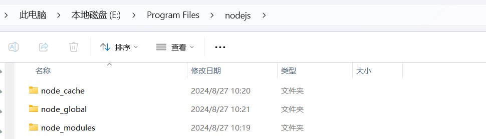
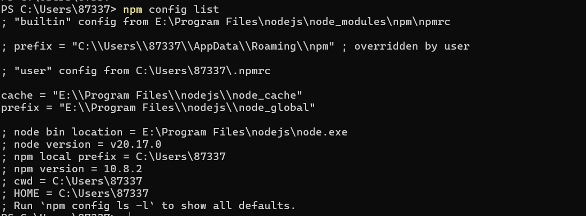
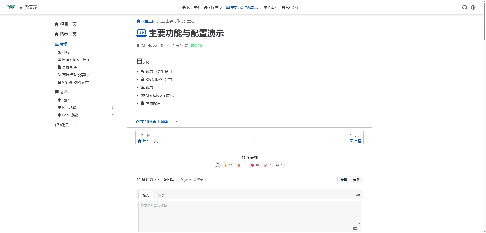

# 随笔 - vuepress2.x

[[toc]]

## 一、Node.js 配置 (windows系统)

### 1. Node.js环境配置

Node.js安装包自带了npm，但安装时不会自动给npm配置全局安装包路径的环境变量（不配的话运行js程序时可能会报找不到包的错误）。

1. 打开Node.js的安装目录

   ``` shell
   PS C:\Users\87337> node -v
   v20.17.0
   PS C:\Users\87337>
   ```

2. 在该目录中新增 **node_global 和 node_cache **文件夹




### 2. npm配置

> 文件夹创建完成之后，打开cmd窗口，输入以下命令。

>  注意把下面命令中的{Node.js安装目录}替换成你的真实安装目录。

``` shell
npm config set prefix "{Node.js安装目录}\node_global"
npm config set cache "{Node.js安装目录}\node_cache"

npm config set prefix "E:\Program Files\nodejs\node_global"
npm config set cache "E:\Program Files\nodejs\node_cache"
```



### 3. 配置环境变量

> 鼠标点击右键选择`属性`，在弹出的界面中依次选择`高级系统设置`、`高级`、`环境变量`打开环境变量设置界面。

### 4. 相关配置

输入以下配置之后，点击`确定`按钮进行保存。

**用户变量 path ：E:\Program Files\nodejs\node_global
 	   系统变量 NODE_PATH ：E:\Program Files\nodejs\node_global\node_modules**

### 5.配置镜像

```shell
npm config set registry https://registry.npmmirror.com
```

## 二、彻底卸载nodejs

1. **打开控制面板**：点击开始菜单，找到“控制面板”并点击打开。
2. **选择程序和功能**：在控制面板中，选择“程序”或“程序和功能”。
3. **卸载Node.js**：在程序列表中找到Node.js，并选择“卸载”。
4. **手动删除相关文件夹**：卸载后，您还需要手动删除以下文件夹及其内容，以确保彻底清除：
   - C:\Program Files (x86)\Nodejs
   - C:\Program Files\Nodejs
   - C:\Users{User}\AppData\Roaming\pm (或%appdata%\pm)
   - C:\Users{User}\AppData\Roaming\pm-cache (或%appdata%\pm-cache)
5. **检查环境变量**：打开系统环境变量设置，检查并确保没有引用Nodejs或npm。
6. **重新启动计算机**：完成上述步骤后，建议重新启动计算机以确保所有更改生效。

## 三、使用npm安装pnpm以及配置

### 3.1 命令安装

> 通过全局安装 pnpm
>
> npm install -g pnpm

### 3.2 仓库位置

| 文件夹名称                                       | 作用                                                         |
| ------------------------------------------------ | ------------------------------------------------------------ |
| <span style="color: red;">`.pnpm-bin-dir`</span> | 存放全局安装的可执行文件路径，方便在命令行中直接调用这些工具。 |
| <span style="color: red;">`.pnpm-cache` </span>  | 用于存储下载的包的缓存，加速后续的安装过程，避免重复下载。   |
| <span style="color: red;">`.pnpm-global`</span>  | 存放全局安装的 npm 包，便于管理和查找全局依赖。              |
| <span style="color: red;">`.pnpm-state`</span>   | 存储 pnpm 的状态信息，包括安装状态和元数据，帮助管理包的状态。 |
| <span style="color: red;">`.pnpm-store`</span>   | 作为 pnpm 的包存储目录，保存已下载的包及其版本，以支持不同项目之间的复用。 |

创建以上5个目录，然后执行以下命令：

``` shell
rem 配置 pnpm 路径
pnpm config set global-bin-dir "E:\Program Files\pnpm_repo\.pnpm-bin-dir"
pnpm config set cache-dir "E:\Program Files\pnpm_repo\.pnpm-cache"
pnpm config set global-dir "E:\Program Files\pnpm_repo\.pnpm-global"
pnpm config set state-dir "E:\Program Files\pnpm_repo\.pnpm-state"
pnpm config set store-dir "E:\Program Files\pnpm_repo\.pnpm-store“
```

### 3.3 配置镜像

```shell
pnpm config set registry https://registry.npmmirror.com
```

### 3.4 系统变量配置

方便通过pnpm安装的bin文件可以全局运行，记得在path中添加下环境变量，位置指到`.pnpm-bin-dir`。

## 四、搭建vuepress 2.0 项目

### 4.1 初始化

``` shell
pnpm init
```

### 4.2 将 VuePress 安装为本地依赖

``` shell
pnpm add -D vuepress@next @vuepress/client@next vue
# 安装打包工具和主题
pnpm add -D @vuepress/bundler-vite@next @vuepress/theme-default@next
pnpm add -D sass-embedded
```

### 4.3 **在 package.json 中添加一些 scripts** 

在 package.json 中添加一些 scripts

``` shell
{
  "scripts": {
    "docs:dev": "vuepress dev docs",
    "docs:build": "vuepress build docs"
  }
}
```

### 4.4 **将默认的临时目录和缓存目录添加到 .gitignore 文件中** 

``` shell
echo node_modules >> .gitignore
echo .temp >> .gitignore
echo .cache >> .gitignore
```

以上命令会自动在文件夹下添加.gitignore文件，并往文件中写入以下内容：

```bash
node_modules
.temp
.cache
```

这样，项目上传到github的时候就会忽略文件夹中的node_modules目录和.temp、.cache文件。

### 4.5 **创建你的第一篇文档** 

```bash
mkdir docs
echo '# Hello VuePress' > docs/README.md
# docs/.vuepress 目录
cd docs
mkdir .vuepress
```

以上命令会创建docs文件夹，并自动在文件夹下添加README.md文件，并往文件中写入以下内容：

```bash
# Hello VuePress
```

docs/README.md 文件中的内容就是网站首页的内容。

创建 VuePress 配置文件 `docs/.vuepress/config.js`

```shell
cd docs/.vuepress
```

``` shell
import { viteBundler } from '@vuepress/bundler-vite'
import { defaultTheme } from '@vuepress/theme-default'
import { defineUserConfig } from 'vuepress'

export default defineUserConfig({
  bundler: viteBundler(),
  theme: defaultTheme(),
})
```


### 4.6 **在本地启动服务器来开发你的文档网站** 

```bash
pnpm docs:dev
```

### 4.7 补充优化 

#### 4.7.1 全局查找

https://v2.vuepress.vuejs.org/zh/reference/plugin/docsearch.html

使用方法

```shell
# 安装插件
pnpm i -D @vuepress/plugin-docsearch@next
```

``` css
// 使用方法
import { docsearchPlugin } from '@vuepress/plugin-docsearch'

export default {
  plugins: [
    docsearchPlugin({
      // 配置项
    }),
  ],
}
```

```shell
# 安装sitemap插件
pnpm i -D @vuepress/plugin-sitemap@next
```

``` shell
// 使用方法
import { sitemapPlugin } from '@vuepress/plugin-sitemap'

export default {
  plugins: [
    sitemapPlugin({
      // 选项
    }),
  ],
}
```

``` shell
# 安装toc插件
pnpm i -D @vuepress/plugin-catalog@next
```

``` shell
# 安装copyright插件  
# 此插件可以在访问者从你的站点复制内容时，自动追加版权信息，也可以禁止站点的复制或者选择。
pnpm i -D @vuepress/plugin-copyright@next
```

``` shell
// 使用方法
import { copyrightPlugin } from '@vuepress/plugin-copyright'

export default {
  plugins: [
    copyrightPlugin({
      // options
    }),
  ],
}
```

``` shell
# 安装右侧目录插件  右侧主题
pnpm i -D vuepress-theme-sidebar
```

```shell
pnpm i -D @vuepress/plugin-nprogress@next
pnpm i -D @vuepress/plugin-photo-swipe@next
pnpm i -D @vuepress/plugin-watermark@next
pnpm i -D @vuepress/plugin-medium-zoom@next
pnpm i -D @vuepress/plugin-cache@next
pnpm i -D @vuepress/plugin-register-components@next
pnpm i -D @vuepress/plugin-git@next
pnpm i -D @vuepress/plugin-markdown-math@next
pnpm i -D mathjax-full
pnpm i -D katex
pnpm i -D @vuepress/plugin-markdown-hint@next
pnpm add -D @vuepress/plugin-markdown-chart@next
pnpm add -D chart.js
pnpm add -D echarts
pnpm add -D flowchart.ts
pnpm add -D markmap-lib markmap-toolbar markmap-view
pnpm add -D mermaid
pnpm i -D @vuepress/plugin-markdown-tab@next
pnpm i -D @vuepress/plugin-prismjs@next
```

### 4.8 重新部署

删除 node_modules lock.yaml 然后执行以下命令

``` shell
# 1) 安装打包工具和主题
pnpm add -D vuepress@next @vuepress/client@next vue @vuepress/bundler-vite@next     @vuepress/theme-default@next sass-embedded @vuepress/plugin-markdown-chart@next chart.js echarts flowchart.ts markmap-lib markmap-toolbar markmap-view mermaid

# 2) 安装相关插件
pnpm i -D @vuepress/plugin-sitemap@next @vuepress/plugin-catalog@next  @vuepress/plugin-nprogress@next @vuepress/plugin-photo-swipe@next @vuepress/plugin-watermark@next @vuepress/plugin-medium-zoom@next @vuepress/plugin-cache@next @vuepress/plugin-register-components@next @vuepress/plugin-markdown-math@next mathjax-full katex @vuepress/plugin-markdown-hint@next @vuepress/plugin-markdown-tab@next @vuepress/plugin-prismjs@next
```

## 五、构建hope主题

``` shell
mkdir blog
pnpm create vuepress-theme-hope blog
然后选择如下:
✔ Select a language to display / 选择显示语言 简体中文
✔ 选择包管理器 pnpm
✔ 你想要使用哪个打包器？ vite
生成 package.json...
✔ 设置应用名称 blog
✔ 设置应用描述 blog
✔ 设置应用版本号 2.0.0
✔ 设置协议 MIT
生成 tsconfig.json...
✔ 你想要创建什么类型的项目？ docs
✔ 项目需要用到多语言么? No
生成模板...
✔ 是否初始化 Git 仓库? No
安装依赖...
这可能需要数分钟，请耐心等待.
我们无法正确输出子进程的进度条，所以进程可能会看似未响应
Packages: +384
++++++++++++++++++++++++++++++++++++++++++++++++++++++++++++++++++++++++++++++++++++++++++++++++++++++++++++++++++++++++++++++++++++++++++++++++++++++++++
Progress: resolved 443, reused 384, downloaded 0, added 384, done

devDependencies:
+ @vuepress/bundler-vite 2.0.0-rc.23
+ sass-embedded 1.89.2
+ vue 3.5.17
+ vuepress 2.0.0-rc.23
+ vuepress-theme-hope 2.0.0-rc.93

Done in 3.6s
模板已成功生成!
✔ 是否想要现在启动 Demo 查看? Yes
启动开发服务器...
启动成功后，请在浏览器输入给出的开发服务器地址(默认为 'localhost:8080')
```

然后去浏览器界面查看：



然后修改下导航栏和侧边栏

添加插件 

```shell
pnpm add -D @vuepress/plugin-pwa@2.0.0-rc.109
pnpm add -D chart.js
pnpm add -D echarts
pnpm add -D flowchart.ts
pnpm add -D markmap-lib markmap-toolbar markmap-view
pnpm add -D mermaid
pnpm add -D mathjax-full
pnpm add -D katex
pnpm add -D markdown-it-attrs
pnpm add -D artplayer@latest
pnpm add -D @vuepress/plugin-watermark@2.0.0-rc.109
```

