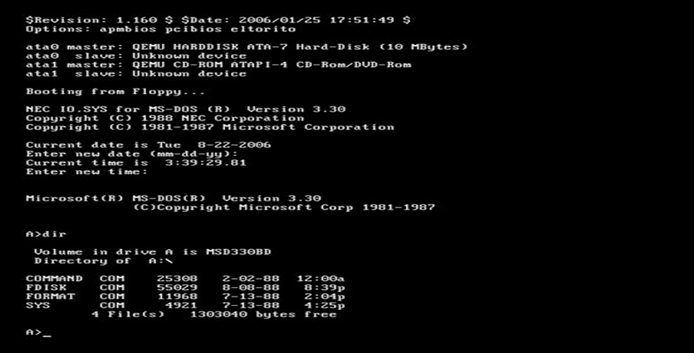
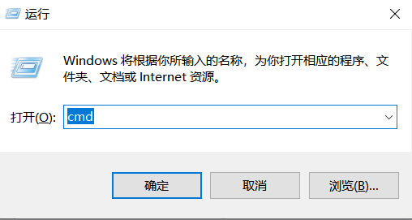
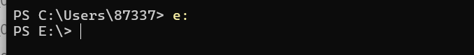
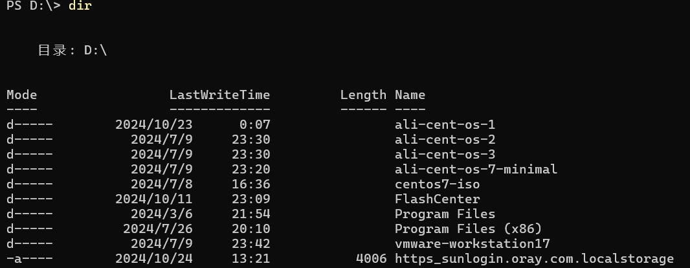
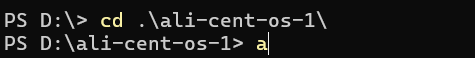
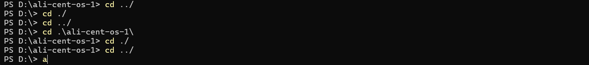

# 随笔 - 常用DOS命令

[[toc]]

> 说在前面的话，本文为个人学习[B站免费的马士兵java初级教程](https://www.bilibili.com/video/BV1RK4y1g7A5/?spm_id_from=333.337.search-card.all.click&vd_source=65c7f6924d2d8ba5fa0d4c448818e08a)后进行总结的文章，本文主要用于<b>随笔</b>记录。

## 【1】DOS操作系统
- Microsoft公司推出的操作系统。（在windows之前的操作系统）

- DOS是英文"Disk Operating System"的缩写,其中文含意是"磁盘操作系统".

- DOS是单用户、单任务的操作系统.（只能执行一个任务）

  

## 【2】DOS命令

- 在windows中，我们通过鼠标菜单等来操作系统，而在dos操作系统中，要通过dos命令来操作系统。
- 是DOS操作系统的命令，是一种面向磁盘的操作命令，不区分大小写。

## 【3】命令学习

> windows给我们保留了类似dos系统的操作界面，可以直接操作磁盘！
> dos 也是一种操作系统，是在windows出现以前用的，后来windows出来后基本没人用了，但是当windows崩溃的时候，还是要的dos方式解决，它是一种纯命令方式，cmd其实就是在windows状态下进入dos方式。

`控制命令台：win+r--->cmd`



## 【4】具体dos命令

### （1）切换盘符

``` dos
 c:  d:  e:   大小写没有区分
```



### （2）显示详细信息：dir

``` dos
dir
```



### （3） 改变当前目录

``` dos
cd
```



### （4）目录

> . 当前目录
>         ..  代表上一层目录



### （5）清屏

``` DOS
cls
```

### （6）切换历史命令

``` dos
上下箭头
```

### （7）补全命令

``` dos
tab按键
```

### （8）创建目录

``` dos
md
```

### （9）复制文件命令

``` dos
copy
```

### （10）删除目录

``` dos
rd
```

### （11）删除文件

``` dos
del + 文件名
# del后面如果接的是文件夹/目录：那么删除的就是这个文件夹下的文件，而不是文件夹
```

