# 随笔 - windows下安装NodePad++

[[toc]]

> 说在前面的话，本文为个人学习[B站免费的马士兵java初级教程](https://www.bilibili.com/video/BV1RK4y1g7A5/?spm_id_from=333.337.search-card.all.click&vd_source=65c7f6924d2d8ba5fa0d4c448818e08a)后进行总结的文章，本文主要用于<b>随笔</b>记录。

## 【1】下载NodePad++

本次下载的NodePad++ | 版本号: 8.1.9  | 免费版本

**网盘地址**：

- 链接: https://pan.baidu.com/s/16AK_N0exa9buY16ThQEblQ?pwd=fuga 
- 提取码: fuga 
- 

## 【2】NodePad++介绍

**Notepad++**  是一款功能强大的代码编辑器，专为程序员和开发人员设计。无论是编写代码、处理文本文件，还是进行快速编辑，**Notepad++**  都能提供卓越的性能和便利的功能，极大提升您的工作效率。

- **多语言支持** ：支持多种编程语言，包括 C、C++、Java、Python、JavaScript、HTML、CSS、PHP 等，让您轻松编写和编辑各种代码。
- **语法高亮** ：提供语法高亮功能，自动识别和高亮显示代码中的关键字、变量和语法结构，增强代码可读性。
- **代码折叠** ：支持代码折叠功能，方便您隐藏不需要关注的代码段，简化代码查看和编辑过程。
- **多文档和多视图** ：支持多标签页编辑，您可以同时打开和编辑多个文件，并且支持拆分视图，方便对比和编辑不同文件。
- **自动完成** ：提供智能代码补全功能，自动提示变量名、函数名和关键字，提升编码效率。
- **查找和替换** ：强大的查找和替换功能，支持正则表达式和批量替换，帮助您快速定位和修改代码。
- **插件扩展** ：支持丰富的插件，您可以根据需要安装和使用各种插件，扩展编辑器的功能。
- **宏录制和回放** ：支持宏录制和回放功能，您可以录制常用操作并重复执行，提高工作效率。
- **轻量高效** ：**Notepad++**  运行轻巧，占用系统资源少，启动和运行速度快，适合长时间使用。

## 【3】 NodePad ++ 安装

- 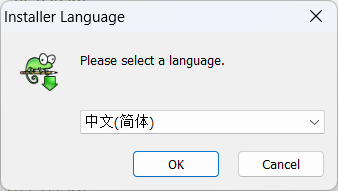
- 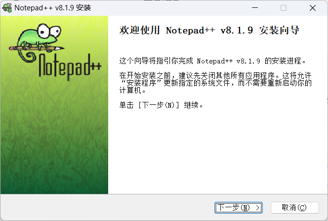
- 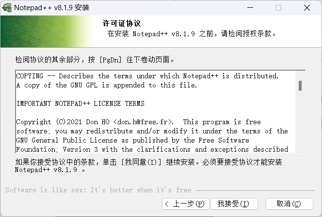
- 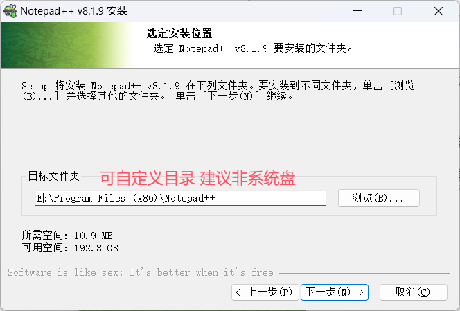
- 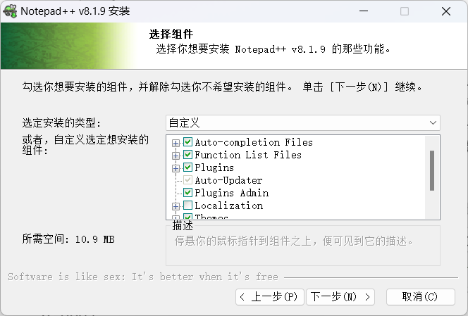
- 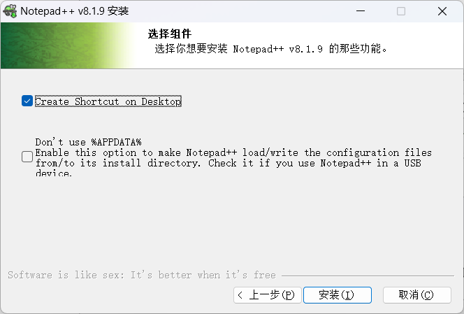
- 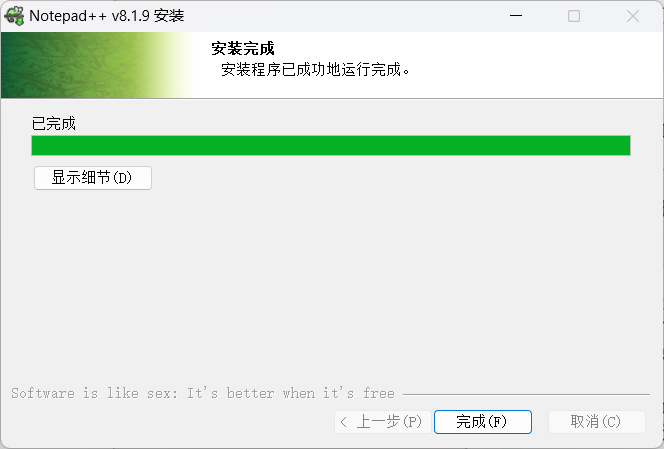

## 【4】 NodePadd ++ 卸载

- 找到控制面板，打开，找到程序->卸载程序，打开

  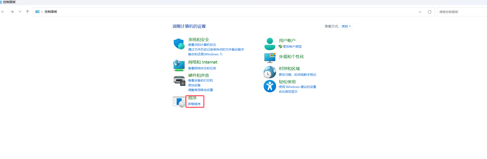

- 找到nodePad++,右键点击选择卸载

  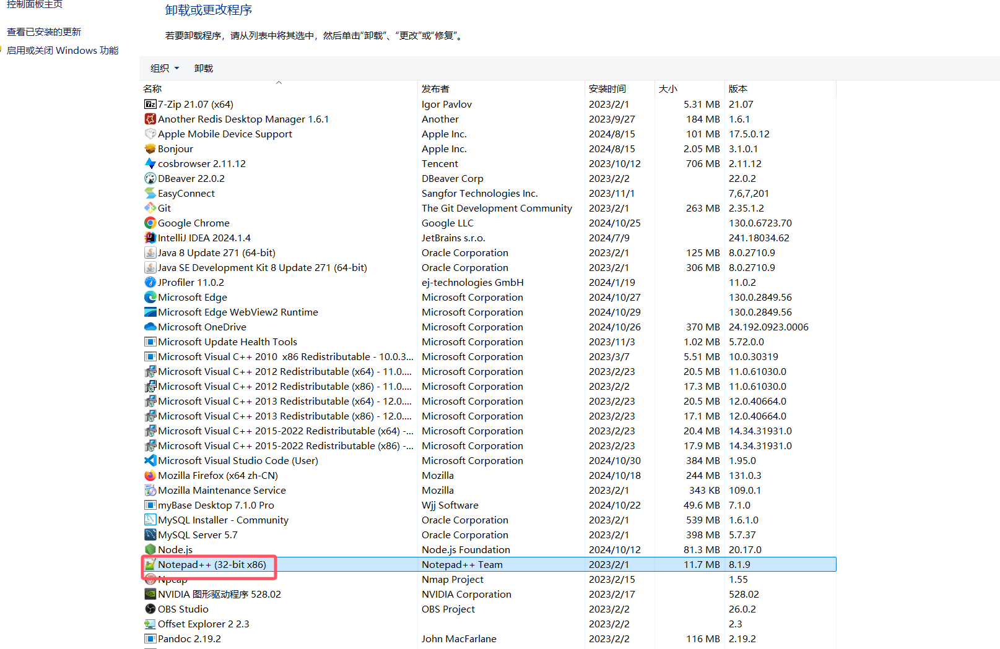

- 按照步骤一步步卸载即可

  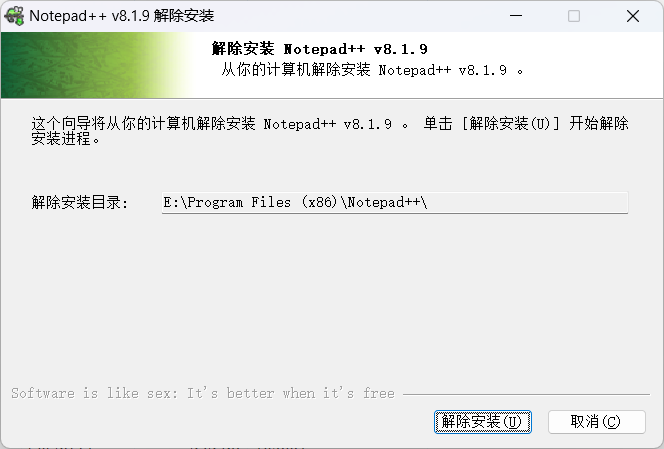

  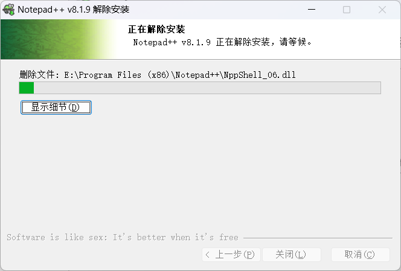

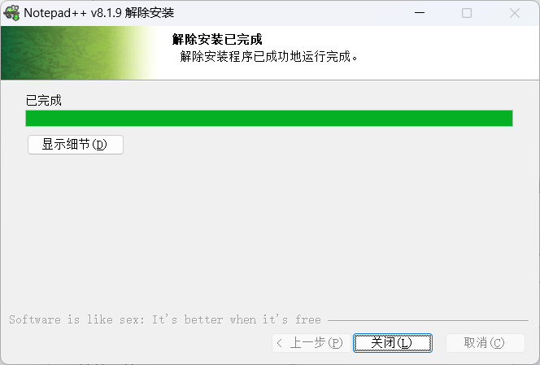