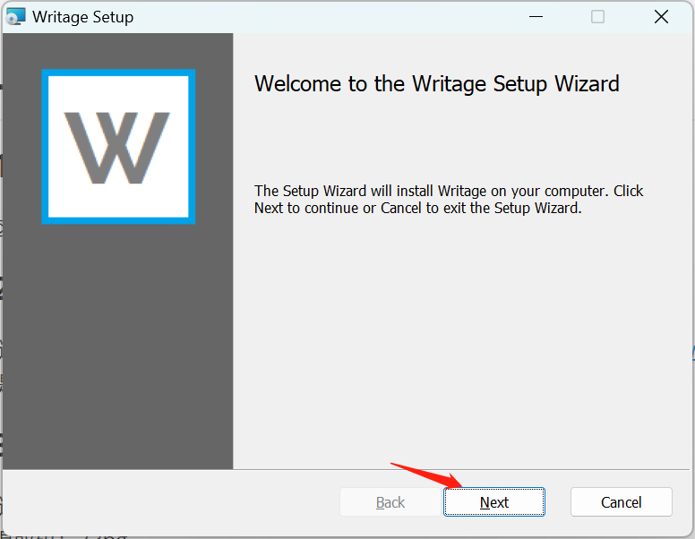
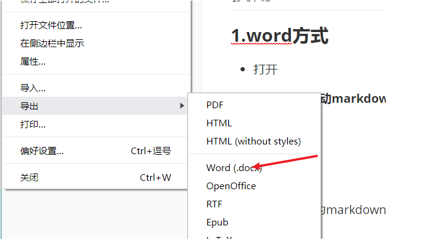

# 《实操系列 - Window OS系统下Markdown转word的设置》

[[toc]]

## 一、软件安装

### 1、Microsoft Word 安装

这里大家买电脑自行安装，忽略

### 2、writage下载（word插件）

链接：https://pan.baidu.com/s/1g4ht8icuhFW7Zbfeyg_qdQ?pwd=kbvw 
提取码：kbvw 

### 3、Pandoc下载

链接：https://pan.baidu.com/s/14xrM15CloBrhZkclo-lyQQ?pwd=73ng 
提取码：73ng 

## 二、writage安装

等待安装完毕即可。

## 三、Pandoc安装和配置

### 3.1 安装

等待安装完毕。

### 3.2 配置

添加环境变量 `Path`中追加`C:\Program Files\Pandoc` 即可

## 四、重启Typora

## 五、导出md文件为word文件

