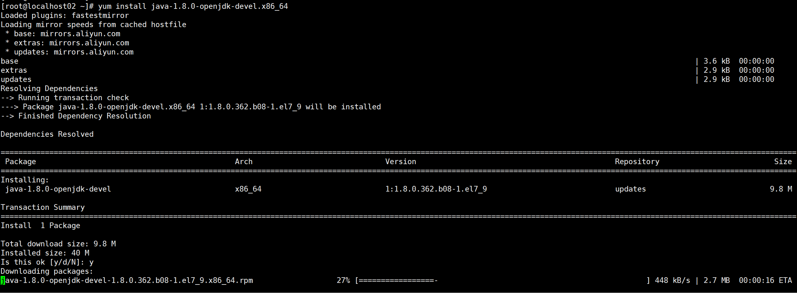
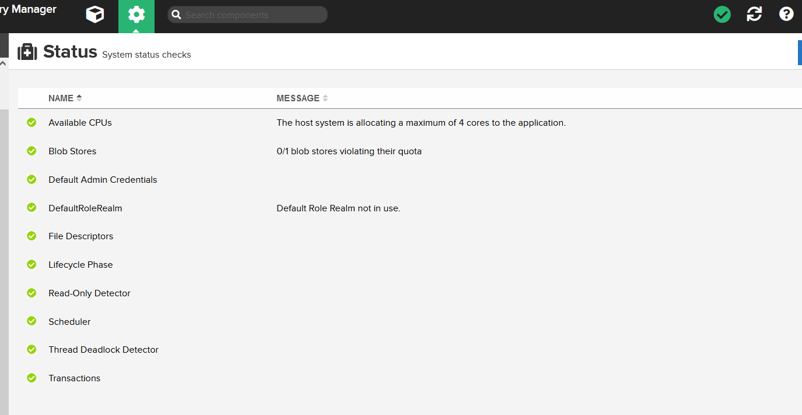
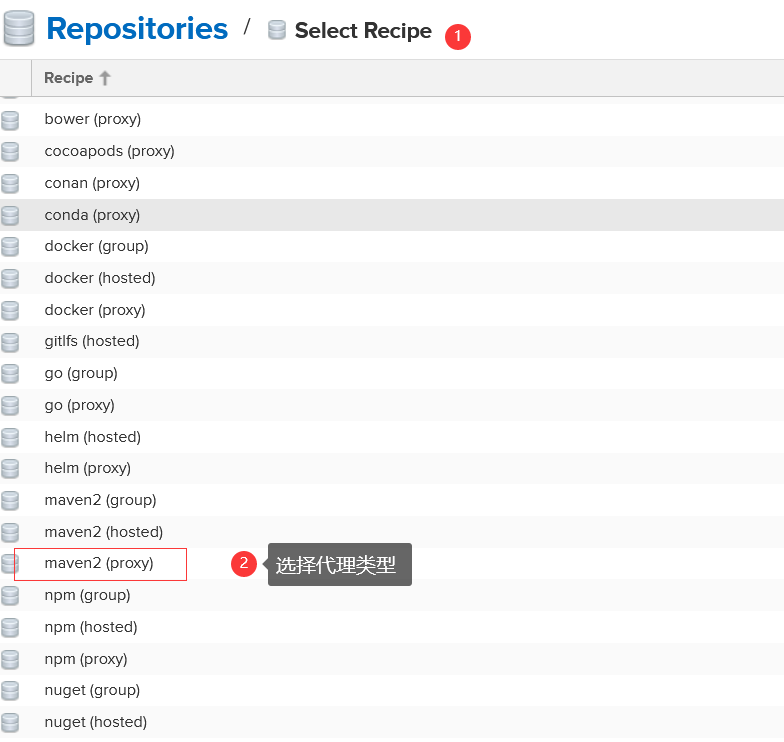
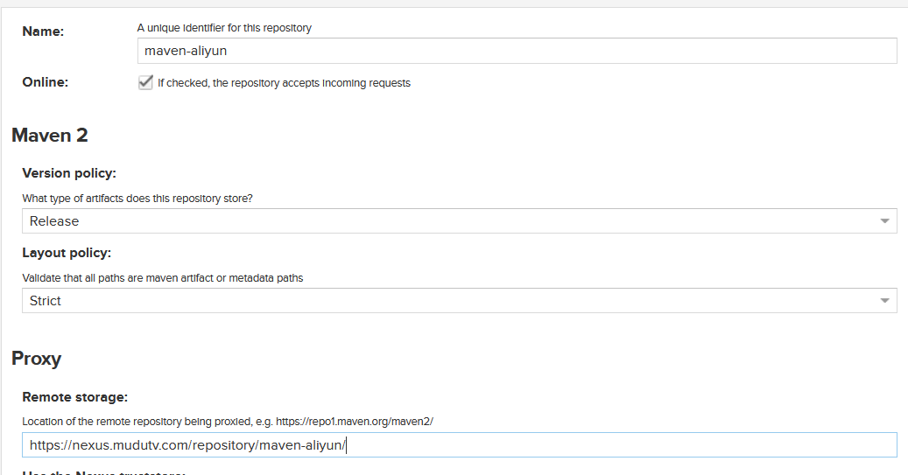
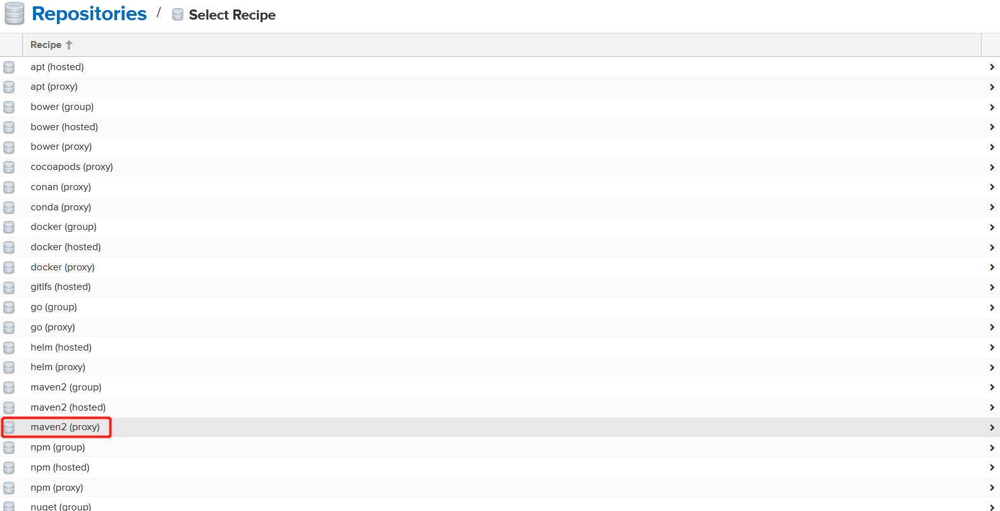
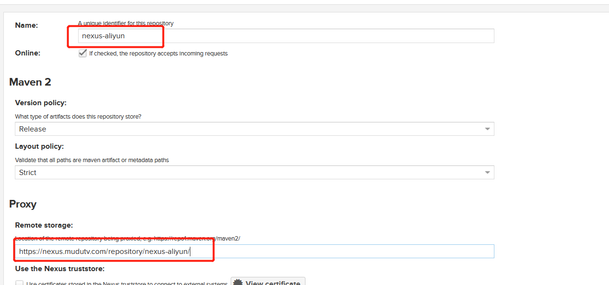
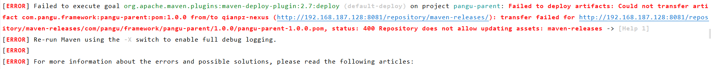
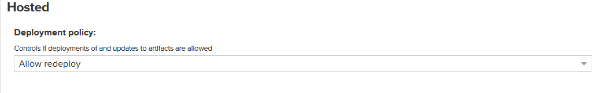

# 《实操系列 - Windows系统下Vmware Workstation中安装及使用CentOS7系统超详细图文教程》

[[toc]]

## 一、下载CentOS7 镜像

### 1、百度网盘下载

链接：https://pan.baidu.com/s/1a_wHSp7xc6L5H5eevf7rkg?pwd=aq02

提取码：aq02 

### 2、移动目录

将该镜像放到Vmware Workstation Pro 15相对应的目录下

我是放在E(PS：按照个人喜好自定义)盘的，如下图：


## 二、使用Vmware Workstation Pro 15 软件安装CentOS7

### 第一步： 打开虚拟机


### 第二步：新建虚拟机

文件-->新建虚拟机


### 第三步：进入虚拟机安装向导，选择"典型",然后点击下一步


### 第四步：安装客户机操作系统


### 第五步：选择客户机操作系统


### 第六步：命令虚拟机和指定位置


### 第七步：指定磁盘容量


### 第八步：自定义硬件


### 第九步：进入自定义硬件界面


### 第十步：设置CentOS7的内存大小


### 第十一步：设置CentOS7的CPU核数


### 第十二步：设置CentOS7的ISO安装镜像


### 第十三步：设置CentOS7的网络适配器


### 第十四步：设置CentOS7的USB控制器


### 第十五步：默认设置CentOS7的声卡、打印机、显示器


### 第十六步： 至此，自定义硬件设置完成，点击关闭，推出，回到原界面


### 第十七步：点击“完成”，至此，虚拟机的配置阶段结束


### 第十八步： 开启虚拟机


>  系统会自动Automatci Boot，等待中....

### 第十九步：选择系统的语言


### 第二十步：配置时间


然后done

### 第二十一步：进入磁盘界面


### 第二十二步：配置磁盘


> 然后点击“done” 进入分区界面如下：


#### 22.1  boot设置


#### 22.2 设置


#### 22.3 swap设置


#### 22.4 配置展示


> 点击”done“

### 第二十三步：完成分配


### 第二十四步：设置主机名和网卡信息


> 设置主机名为： localhost02  记住IP： 192.168.91.130，配置好了之后点击“done”


### 第二十四步： 配置完毕，系统开始Begin Install


### 第二十五步： 在安装过程中，可以设置下Root账户和密码以及其他用户


> 等待安装完成

### 第二十六步：Reboot系统，等待系统安装完毕即可


> 点击Reboot


等待进度完成即可。

### 第二十七步：登录虚拟机中的CentOS系统，输入root账号和密码


### 第二十八步：修改虚拟机名称

> 找到第二十四步中的网卡信息，将虚拟机名称设置为<网卡_IP>方便记忆


### 第二十九步：挂机虚拟机，后台运行


### 第三十步：使用Xshell进行登录


 56(84) bytes of data.
64 bytes from 182.61.200.7 (182.61.200.7): icmp_seq=1 ttl=128 time=33.2 ms
64 bytes from 182.61.200.7 (182.61.200.7): icmp_seq=2 ttl=128 time=30.7 ms
64 bytes from 182.61.200.7 (182.61.200.7): icmp_seq=3 ttl=128 time=30.0 ms
^C
--- www.a.shifen.com ping statistics ---
3 packets transmitted, 3 received, 0% packet loss, time 2003ms
rtt min/avg/max/mdev = 30.085/31.343/33.245/1.382 ms
[root@localhost02 ~]# 
```

#### 3.1.5 vi

``` shell
[root@localhost02 ~]# vi --help
VIM - Vi IMproved 7.4 (2013 Aug 10, compiled Dec 15 2020 16:43:23)

usage: vim [arguments] [file ..]       edit specified file(s)
   or: vim [arguments] -               read text from stdin
   or: vim [arguments] -t tag          edit file where tag is defined
```

### 3.2 yum命令安装更新

#### 3.2.1 查看是否存在YUM命令

``` shell
[root@localhost02 ~]# rpm -qa yum
yum-3.4.3-168.el7.centos.noarch
[root@localhost02 ~]# 
```

> 上述说明yum存在，但是需要升级更新下

#### 3.2.2 升级yum命令

```shell
[root@localhost02 yum]# yum -y update
```


```shell
[root@localhost02 yum]# rpm -qa | grep yum
yum-metadata-parser-1.1.4-10.el7.x86_64
yum-3.4.3-168.el7.centos.noarch
yum-plugin-fastestmirror-1.1.31-54.el7_8.noarch
[root@localhost02 yum]# 
```

> 出现上述版本号和插件镜像则说明升级完毕

#### 3.2.3 卸载yum

```shell
[root@localhost02 yum]# rpm -qa | grep yum
yum-metadata-parser-1.1.4-10.el7.x86_64
yum-3.4.3-168.el7.centos.noarch
yum-plugin-fastestmirror-1.1.31-54.el7_8.noarch
[root@localhost02 yum]# 
[root@localhost02 yum]# rpm -qa | grep yum | xargs rpm -e --nodeps     //这步就是卸载和yum有关的所有组件
[root@localhost02 yum]# rpm -qa | grep yum
[root@localhost02 yum]# 
```

#### 3.2.4 重新安装yum

> 从centos官网上下载和yum有关的rpm包  
>
> http://mirror.centos.org/centos/7/os/x86_64/Packages/ 
>
> 下载的包如下：
>
> - [http://mirror.centos.org/centos/7/os/x86_64/Packages/ yum-3.4.3-168.el7.centos.noarch.rpm](http://mirror.centos.org/centos/7/os/x86_64/Packages/yum-3.4.3-168.el7.centos.noarch.rpm)
> - [http://mirror.centos.org/centos/7/os/x86_64/Packages/yum-metadata-parser-1.1.4-10.el7.x86_64.rpm](http://mirror.centos.org/centos/7/os/x86_64/Packages/yum-metadata-parser-1.1.4-10.el7.x86_64.rpm)
> - [http://mirror.centos.org/centos/7/os/x86_64/Packages/yum-plugin-fastestmirror-1.1.31-54.el7_8.noarch.rpm](http://mirror.centos.org/centos/7/os/x86_64/Packages/yum-plugin-fastestmirror-1.1.31-54.el7_8.noarch.rpm)

``` shell
[root@localhost02 ~]# cd /usr/
[root@localhost02 usr]# mkdir yum
[root@localhost02 usr]# cd yum
[root@localhost02 ~]# rz //此时上传已经下载好的3个文件  若没有rz命令可以通过sftp进行上传
[root@localhost02 ~]#
```

> 上传3个文件之后如下：

``` shell
[root@localhost02 yum]# ll
total 1336
-rw-r--r--. 1 root root 1298856 Dec 30 17:13 yum-3.4.3-168.el7.centos.noarch.rpm
-rw-r--r--. 1 root root   28348 Dec 30 17:13 yum-metadata-parser-1.1.4-10.el7.x86_64.rpm
-rw-r--r--. 1 root root   35216 Dec 30 17:13 yum-plugin-fastestmirror-1.1.31-54.el7_8.noarch.rpm
[root@localhost02 yum]# 
```

> 然后执行如下命令进行安装：  因为依赖问题，严格按照下列顺序执行
>
> - rpm -ivh --nodeps --force yum-plugin-fastestmirror-1.1.31-54.el7_8.noarch.rpm 
> - rpm -ivh --nodeps --force yum-metadata-parser-1.1.4-10.el7.x86_64.rpm
> - rpm -ivh yum-3.4.3-168.el7.centos.noarch.rpm

``` shell
[root@localhost02 yum]# rpm -ivh --nodeps --force yum-plugin-fastestmirror-1.1.31-54.el7_8.noarch.rpm 
warning: yum-plugin-fastestmirror-1.1.31-54.el7_8.noarch.rpm: Header V3 RSA/SHA256 Signature, key ID f4a80eb5: NOKEY
Preparing...                          ################# [100%]
Updating / installing...
   1:yum-plugin-fastestmirror-1.1.31-5################# [100%]
[root@localhost02 yum]# 
[root@localhost02 yum]# rpm -ivh --nodeps --force yum-metadata-parser-1.1.4-10.el7.x86_64.rpm 
warning: yum-metadata-parser-1.1.4-10.el7.x86_64.rpm: Header V3 RSA/SHA256 Signature, key ID f4a80eb5: NOKEY
Preparing...                          ################# [100%]
Updating / installing...
   1:yum-metadata-parser-1.1.4-10.el7 ################# [100%]
[root@localhost02 yum]# rpm -ivh yum-3.4.3-168.el7.centos.noarch.rpm 
warning: yum-3.4.3-168.el7.centos.noarch.rpm: Header V3 RSA/SHA256 Signature, key ID f4a80eb5: NOKEY
Preparing...                          ################# [100%]
Updating / installing...
   1:yum-3.4.3-168.el7.centos         ################# [100%]
[root@localhost02 yum]# 
```

> 最终如下：

``` shell
[root@localhost02 yum]# rpm -qa | grep yum
yum-metadata-parser-1.1.4-10.el7.x86_64
yum-plugin-fastestmirror-1.1.31-54.el7_8.noarch
yum-3.4.3-168.el7.centos.noarch
[root@localhost02 yum]# 
```

### 3.3 使用yum命令安装wget命令

#### 3.3.1 查看是否存在wget命令

``` shell
[root@localhost02 usr]# wget
-bash: wget: command not found
[root@localhost02 usr]# 
# 说明不存在wget命令

[root@localhost02 usr]# wget
wget: missing URL
Usage: wget [OPTION]... [URL]...

Try `wget --help' for more options.
[root@localhost02 usr]# 
# 说明存在wget命令
```

#### 3.3.2 安装wget命令

> 使用命令： `yum -y install wget`

``` shell
[root@localhost02 usr]# yum -y install wget
Loaded plugins: fastestmirror
Loading mirror speeds from cached hostfile
 * base: mirrors.163.com
 * extras: mirrors.163.com
 * updates: mirrors.163.com
Resolving Dependencies
--> Running transaction check
---> Package wget.x86_64 0:1.14-18.el7_6.1 will be installed
--> Finished Dependency Resolution

Dependencies Resolved

=============================================================================================================================================================================================
 Package                                   Arch                                        Version                                               Repository                                 Size
=============================================================================================================================================================================================
Installing:
 wget                                      x86_64                                      1.14-18.el7_6.1                                       base                                      547 k

Transaction Summary
=============================================================================================================================================================================================
Install  1 Package

Total download size: 547 k
Installed size: 2.0 M
Downloading packages:
wget-1.14-18.el7_6.1.x86_64.rpm                                                                                                                                       | 547 kB  00:00:00     
Running transaction check
Running transaction test
Transaction test succeeded
Running transaction
  Installing : wget-1.14-18.el7_6.1.x86_64                                                                                                                                               1/1 
  Verifying  : wget-1.14-18.el7_6.1.x86_64                                                                                                                                               1/1 

Installed:
  wget.x86_64 0:1.14-18.el7_6.1                                                                                                                                                              

Complete!
[root@localhost02 usr]#
```

### 3.4 使用yum命令安装lrzsz命令

#### 3.4.1 查看是否存在lrzsz命令

``` shell
[root@localhost02 usr]# rz
-bash: rz: command not found
[root@localhost02 usr]# sz
-bash: sz: command not found
[root@localhost02 usr]#
# 说明不存在lrzsz命令
```


上图说明存在lrzsz命令

#### 3.4.2 安装lrzsz命令

> 使用命令：`yum -y install lrzsz`

``` shell
[root@localhost02 usr]# yum -y install lrzsz
Loaded plugins: fastestmirror
Loading mirror speeds from cached hostfile
 * base: mirrors.163.com
 * extras: mirrors.163.com
 * updates: mirrors.163.com
Package lrzsz-0.12.20-36.el7.x86_64 already installed and latest version
Nothing to do
[root@localhost02 usr]#
```

### 3.5 使用yum命令安装vim命令

#### 3.5.1 查看是否存在vim命令

``` shell
[root@localhost02 ~]# vim
-bash: vim: command not found
[root@localhost02 ~]# 
# 说明找不到vim命令
```

#### 3.5.2 安装vim命令

> 使用命令:  `yum -y install vim`

``` shell
[root@localhost02 ~]# yum -y install vim
...
Installed:
  vim-enhanced.x86_64 2:7.4.629-8.el7_9                                                                                                                                             

Dependency Installed:
  gpm-libs.x86_64 0:1.20.7-6.el7           perl.x86_64 4:5.16.3-299.el7_9             perl-Carp.noarch 0:1.26-244.el7             perl-Encode.x86_64 0:2.51-7.el7                
  perl-Exporter.noarch 0:5.68-3.el7        perl-File-Path.noarch 0:2.09-2.el7         perl-File-Temp.noarch 0:0.23.01-3.el7       perl-Filter.x86_64 0:1.49-3.el7                
  perl-Getopt-Long.noarch 0:2.40-3.el7     perl-HTTP-Tiny.noarch 0:0.033-3.el7        perl-PathTools.x86_64 0:3.40-5.el7          perl-Pod-Escapes.noarch 1:1.04-299.el7_9       
  perl-Pod-Perldoc.noarch 0:3.20-4.el7     perl-Pod-Simple.noarch 1:3.28-4.el7        perl-Pod-Usage.noarch 0:1.63-3.el7          perl-Scalar-List-Utils.x86_64 0:1.27-248.el7   
  perl-Socket.x86_64 0:2.010-5.el7         perl-Storable.x86_64 0:2.45-3.el7          perl-Text-ParseWords.noarch 0:3.29-4.el7    perl-Time-HiRes.x86_64 4:1.9725-3.el7          
  perl-Time-Local.noarch 0:1.2300-2.el7    perl-constant.noarch 0:1.27-2.el7          perl-libs.x86_64 4:5.16.3-299.el7_9         perl-macros.x86_64 4:5.16.3-299.el7_9          
  perl-parent.noarch 1:0.225-244.el7       perl-podlators.noarch 0:2.5.1-3.el7        perl-threads.x86_64 0:1.87-4.el7            perl-threads-shared.x86_64 0:1.43-6.el7        
  vim-common.x86_64 2:7.4.629-8.el7_9      vim-filesystem.x86_64 2:7.4.629-8.el7_9   

Complete!
[root@localhost02 ~]# 
# 此时已经安装完毕
```

#### 3.5.3 修改VIM配置

```shell
vim ~/.vimrc
输入i进入编辑模式
录入：
set encoding=utf-8 " 文件编码
set number " 显示行号
set tabstop=4 " tab宽度为4
set softtabstop=4 " 设置一次可以删除4个空格
set expandtab " tab转换为空格
set nowrap " 不自动换行
set showmatch " 显示括号配对情况
syntax on " 开启语法高亮
然后输入 esc + :wq 进入退出界面
```


### 3.6 使用rpm命令安装curl命令

#### 3.6.1 查看是否存在curl命令

``` shell
^C[root@localhost02 ~]# rpm -qa | grep curl
curl-7.29.0-59.el7_9.1.x86_64
libcurl-7.29.0-59.el7_9.1.x86_64
python-pycurl-7.19.0-19.el7.x86_64
[root@localhost02 ~]#
```


说明已经成功安装了curl

#### 3.6.2 卸载curl命令

``` shell
[root@localhost02 ~]# rpm -qa | grep curl
curl-7.29.0-59.el7_9.1.x86_64
libcurl-7.29.0-59.el7_9.1.x86_64
python-pycurl-7.19.0-19.el7.x86_64
[root@localhost02 ~]# rpm -qa | grep curl | xargs rpm -e --nodeps  //这一步就是卸载CURL
[root@localhost02 ~]# rpm -qa | grep curl
[root@localhost02 ~]#
```

#### 3.6.3 使用rpm命令重新安装curl命令

> 从centos官网上下载和yum有关的rpm包  
>
> http://mirror.centos.org/centos/7/os/x86_64/Packages/ 
>
> 下载的包如下：
>
> 1、[http://mirror.centos.org/centos/7/os/x86_64/Packages/python-pycurl-7.19.0-19.el7.x86_64.rpm](http://mirror.centos.org/centos/7/os/x86_64/Packages/python-pycurl-7.19.0-19.el7.x86_64.rpm)
>
> 2、[http://mirror.centos.org/centos/7/os/x86_64/Packages/libcurl-7.29.0-59.el7.x86_64.rpm](http://mirror.centos.org/centos/7/os/x86_64/Packages/libcurl-7.29.0-59.el7.x86_64.rpm)
>
> 3、[http://mirror.centos.org/centos/7/os/x86_64/Packages/curl-7.29.0-59.el7.x86_64.rpm](http://mirror.centos.org/centos/7/os/x86_64/Packages/curl-7.29.0-59.el7.x86_64.rpm)

下载好后，上传到`/usr/curl/`目录下,如下：

```shell
[root@localhost02 curl]# ll
total 580
-rw-r--r--. 1 root root 277112 Jan 28 10:15 curl-7.29.0-59.el7.x86_64.rpm
-rw-r--r--. 1 root root 228500 Jan 28 10:14 libcurl-7.29.0-59.el7.x86_64.rpm
-rw-r--r--. 1 root root  82396 Jan 28 10:13 python-pycurl-7.19.0-19.el7.x86_64.rpm
[root@localhost02 curl]# 
```

> 然后执行如下命令进行安装：  因为依赖问题，严格按照下列顺序执行
>
> **rpm -ivh --nodeps python-pycurl-7.19.0-19.el7.x86_64.rpm** 
>
> **rpm -ivh --nodeps libcurl-7.29.0-59.el7.x86_64.rpm** 
>
> **rpm -ivh --nodeps curl-7.29.0-59.el7.x86_64.rpm** 
>
> 最后使用`rpm -qa | grep curl`查看

``` shell
[root@localhost02 curl]# rpm -ivh --nodeps python-pycurl-7.19.0-19.el7.x86_64.rpm 
Preparing...                          ################# [100%]
Updating / installing...
   1:python-pycurl-7.19.0-19.el7      ################# [100%]
[root@localhost02 curl]# rpm -ivh --nodeps libcurl-7.29.0-59.el7.x86_64.rpm 
Preparing...                          ################# [100%]
Updating / installing...
   1:libcurl-7.29.0-59.el7            ################# [100%]
[root@localhost02 curl]# 
[root@localhost02 curl]# rpm -ivh --nodeps curl-7.29.0-59.el7.x86_64.rpm 
Preparing...                          ################# [100%]
Updating / installing...
   1:curl-7.29.0-59.el7               ################# [100%]
[root@localhost02 curl]# rpm -qa | grep curl
python-pycurl-7.19.0-19.el7.x86_64
curl-7.29.0-59.el7.x86_64
libcurl-7.29.0-59.el7.x86_64
[root@localhost02 curl]# 
```

至此，curl命令则安装完毕。

### 3.7 使用yum命令安装telnet命令

#### 3.7.1 查看是否存在telnet命令

``` shell
[root@localhost02 curl]# telnet
-bash: telnet: command not found
[root@localhost02 curl]#
```

说明telnet命令不存在

#### 3.7.2 安装telnet命令

> 使用命令如下： **yum -y install telnet**


``` shell
[root@localhost02 /]# telnet 192.168.91.129
Trying 192.168.91.129...
telnet: connect to address 192.168.91.129: No route to host
[root@localhost02 /]# 
```

### 3.8 使用 yum命令安装tree命令

#### 3.8.1 查看是否存在tree命令

``` shell
[root@localhost02 /]# tree
-bash: tree: command not found
[root@localhost02 /]# 
```

说明不存在tree命令

#### 3.8.2 使用yum命令安装tree

> 使用命令： `yum -y install tree`


``` shell
[root@localhost02 yum]# tree
.
├── yum-3.4.3-168.el7.centos.noarch.rpm
├── yum-metadata-parser-1.1.4-10.el7.x86_64.rpm
└── yum-plugin-fastestmirror-1.1.31-54.el7_8.noarch.rpm

0 directories, 3 files
[root@localhost02 yum]# 
```

### 3.9 使用yum命令安装ifconfig命令

#### 3.9.1 查看ifconfig命令是否存在

``` shell
[root@localhost02 usr]# ifconfig
-bash: ifconfig: command not found
[root@localhost02 usr]# 
```

说明不存在

#### 3.9.2 安装命令

> 使用命名：  `yum -y install net-tools`

``` shell
[root@localhost02 usr]# yum -y install net-tools
```


#### 3.9.3 查看IP

> 可以使用 `ip addr`  或者 `ifconfig` 2个命令进行查看


### 3.10 使用yum命令安装其他的依赖关系

> 使用如下命令：
>
> **`yum -y install gcc gcc-c++ make autoconf libjpeg libjpeg-devel libpng libpng-devel freetype freetype-devel libxml2 libxml2-devel zlib zlib-devel glibc glibc-devel glib2 glib2-devel bzip2 bzip2-devel ncurses ncurses-devel curl curl-devel e2fsprogs e2fsprogs-devel krb5-devel libidn libidn-devel openssl openssl-devel libxslt-devel libevent-devel libtool libtool-ltdl bison gd gd-devel vim-enhanced pcre-devel zip unzip ntpdate sysstat patch bc expect rsync`**

### 3.11 查看磁盘的大小

> **`df -h`**

``` shell
[root@localhost02 /]# df -h
Filesystem               Size  Used Avail Use% Mounted on
devtmpfs                 7.8G     0  7.8G   0% /dev
tmpfs                    7.8G     0  7.8G   0% /dev/shm
tmpfs                    7.8G   12M  7.8G   1% /run
tmpfs                    7.8G     0  7.8G   0% /sys/fs/cgroup
/dev/mapper/centos-root   10G  2.1G  8.0G  21% /
/dev/sda1                197M  173M   24M  88% /boot
tmpfs                    1.6G     0  1.6G   0% /run/user/0
[root@localhost02 /]# 

```

### 3.12 在远程Linux主机上安装ssh服务器

> \# 安装
>
> sudo yum install -y openssh-server
>
> \#检查服务是否启动成功
>
> ps -e|grep ssh

``` shell
[root@localhost02 /]# sudo yum install -y openssh-server
Loaded plugins: fastestmirror
Loading mirror speeds from cached hostfile
 * base: mirrors.aliyun.com
 * extras: mirrors.aliyun.com
 * updates: mirrors.aliyun.com
Package openssh-server-7.4p1-22.el7_9.x86_64 already installed and latest version
Nothing to do
[root@localhost02 /]# ps -ef | grep ssh
root       1035      1  0 14:24 ?        00:00:00 /usr/sbin/sshd -D
root       1623   1035  0 14:35 ?        00:00:00 sshd: root@pts/1
root       2461   1625  0 18:21 pts/1    00:00:00 grep --color=auto ssh
[root@localhost02 /]# 
```

### 3.13 忽略1~12进行一次性安装脚本

``` powershell
# 安装相关基础依赖
yum -y install vim wget lrzsz curl telnet net-tools tree openssh-server gcc gcc-c++ make autoconf libjpeg libjpeg-devel libpng libpng-devel freetype freetype-devel libxml2 libxml2-devel zlib zlib-devel glibc glibc-devel glib2 glib2-devel bzip2 bzip2-devel ncurses ncurses-devel curl curl-devel e2fsprogs e2fsprogs-devel krb5-devel libidn libidn-devel openssl openssl-devel libxslt-devel libevent-devel libtool libtool-ltdl bison gd gd-devel vim-enhanced pcre-devel zip unzip ntpdate sysstat patch bc expect rsync
```

### 3.14 查看磁盘空间大小

> du -h /root --max-depth=1
>
> 可以查看磁盘深度为1，即 第一层目录就可以看到整个空间磁盘大小
>
> 一层层的深入，找到log或者不需要的目录占用，进行删除

``` shell
[root@test data]# du -h /home --max-depth=1
79M	/home/nacos
165M	/home/apollo
39M	/home/zookeeper
70M	/home/seata
421M	/home/rocketmq
112M	/home/xxl-job
0	/home/test3-xxl-job
112K	/home/rustdesk
308M	/home/jmeter
1.2G	/home
[root@test data]# 
```

### 3.15 升级make

#### 3.15.1下载make最新安装包

>  #到 http://ftp.gnu.org/pub/gnu/make/ 查找最新安装包
>
> wget http://ftp.gnu.org/pub/gnu/make/make-4.4.tar.gz
>
> 

``` shell
[root@localhost1 qianpz]# mkdir make-tar
[root@localhost1 qianpz]# cd make-tar/
[root@localhost1 make-tar]# wget http://ftp.gnu.org/pub/gnu/make/make-4.4.tar.gz
--2023-02-23 17:58:23--  http://ftp.gnu.org/pub/gnu/make/make-4.4.tar.gz
Resolving ftp.gnu.org (ftp.gnu.org)... 209.51.188.20, 2001:470:142:3::b
Connecting to ftp.gnu.org (ftp.gnu.org)|209.51.188.20|:80... connected.
HTTP request sent, awaiting response... 200 OK
Length: 2307891 (2.2M) [application/x-gzip]
Saving to: ‘make-4.4.tar.gz’

100%[===============================================================================================================================================================================>] 2,307,891   1.27MB/s   in 1.7s   

2023-02-23 17:58:26 (1.27 MB/s) - ‘make-4.4.tar.gz’ saved [2307891/2307891]

[root@localhost1 make-tar]# ll
total 2256
-rw-r--r-- 1 root root 2307891 Oct 31 14:49 make-4.4.tar.gz
```

#### 3.15.2 解压配置

> tar -zxvf make-4.3.tar.gz
>        cd make-4.3
>        ./configure --prefix=/usr

#### 3.15.3 编译安装

> type make
> 		make check
> 		make install

#### 3.15.4 验证安装

``` shell
[root@localhost1 make-4.4]# make -v
GNU Make 4.4
Built for x86_64-pc-linux-gnu
Copyright (C) 1988-2022 Free Software Foundation, Inc.
License GPLv3+: GNU GPL version 3 or later <https://gnu.org/licenses/gpl.html>
This is free software: you are free to change and redistribute it.
There is NO WARRANTY, to the extent permitted by law.
[root@localhost1 make-4.4]# 
```

### 3.16 持续更新中...

## 四、CentOS7中常用设置

### 4.1 关闭SELinux

#### 4.1.1 SELinux背景

> seLinux是linux的一些强制安全策略，会限制一些软件的目录、端口和用户等，在日常操作中，常常会遇到不少莫名其妙的权限问题是由seLinux产生的。很多架构实现都会关闭selinux

#### 4.1.2 检查selinux是否开启

> 在关闭selinux之前，可以通过以下命令来查看seLinux是否开启。  
>
> `sestatus`

``` shell
[root@localhost02 usr]# sestatus
SELinux status:                 enabled
SELinuxfs mount:                /sys/fs/selinux
SELinux root directory:         /etc/selinux
Loaded policy name:             targeted
Current mode:                   enforcing
Mode from config file:          enforcing
Policy MLS status:              enabled
Policy deny_unknown status:     allowed
Max kernel policy version:      31
[root@localhost02 usr]# 
```

> 看到 SELinux status:                 enabled说明是开启的。

#### 4.1.3 临时关闭SELinux

> 要暂时禁用 SELinux，您必须修改 /selinux/enforce 文件。
>
> 请注意，重新启动系统后，此设置将消失。

> 使用命令：
>
> **echo 0 > /selinux/enforce**
>
> or
>
> **setenforce 0**

#### 4.1.4 永久关闭SELinux

> 要永久禁用 SELinux，请修改 /etc/selinux/config 并将 SELINUX=disabled

``` shell
[root@localhost02 ~]# cat /etc/selinux/config

# This file controls the state of SELinux on the system.
# SELINUX= can take one of these three values:
#     enforcing - SELinux security policy is enforced.
#     permissive - SELinux prints warnings instead of enforcing.
#     disabled - No SELinux policy is loaded.
SELINUX=enforcing
# SELINUXTYPE= can take one of three values:
#     targeted - Targeted processes are protected,
#     minimum - Modification of targeted policy. Only selected processes are protected. 
#     mls - Multi Level Security protection.
SELINUXTYPE=targeted 


[root@localhost02 ~]# 
```

``` shell
[root@localhost02 ~]# vim /etc/selinux/config
```


> 修改**SELINUX=disabled**


``` shell
[root@localhost02 ~]# cat /etc/selinux/config

# This file controls the state of SELinux on the system.
# SELINUX= can take one of these three values:
#     enforcing - SELinux security policy is enforced.
#     permissive - SELinux prints warnings instead of enforcing.
#     disabled - No SELinux policy is loaded.
SELINUX=disabled
# SELINUXTYPE= can take one of three values:
#     targeted - Targeted processes are protected,
#     minimum - Modification of targeted policy. Only selected processes are protected. 
#     mls - Multi Level Security protection.
SELINUXTYPE=targeted 


[root@localhost02 ~]# 
```

> 最后重启服务器即可：  **`shutdown -r now`**

``` shell
[root@localhost02 ~]# sestatus
SELinux status:                 disabled
[root@localhost02 ~]# 
```

> 此时说明： 已经关闭了SELinux

### 4.2 设置时区为上海时区

#### 4.2.1 查询服务器的当前时区

> 使用命令： `ll /etc/localtime`  进行时区查询

``` shell
[root@localhost02 ~]# ll /etc/localtime
lrwxrwxrwx. 1 root root 36 Dec 30 16:07 /etc/localtime -> ../usr/share/zoneinfo/Asia/Hong_Kong
[root@localhost02 ~]# 
```

> 说明，使用的是香港时区

#### 4.2.2 配置上海时区

>  若需要变更，则使用`rm -rf /etc/localtime`和`ln -s /usr/share/zoneinfo/Asia/Shanghai /etc/localtime`命令进行修改，`date -s`修改具体时间,`clock -w`,`hwclock -w` 复位时间

``` shell
[root@localhost02 Asia]# rm -rf /etc/localtime 
[root@localhost02 Asia]# ln -s /usr/share/zoneinfo/Asia/Shanghai /etc/localtime
[root@localhost02 Asia]# ll /etc/localtime
lrwxrwxrwx 1 root root 33 Jan 28 14:38 /etc/localtime -> /usr/share/zoneinfo/Asia/Shanghai
[root@localhost02 Asia]# date -R
Sat, 28 Jan 2023 14:39:38 +0800
[root@localhost02 Asia]# date -s 14:58:00
Sat Jan 28 14:58:00 CST 2023
[root@localhost02 Asia]# clock -w
[root@localhost02 Asia]# hwclock -w
[root@localhost02 Asia]# 
```

### 4.3 配置Linux历史命令大小

> 即修改history的存储大小
>
> vim /etc/profile
>
> HISTORY=1000
>
> :wq
>
> source /etc/profile


### 4.4 绑定静态IP（只适用于虚拟机）

> 这里需要注意： 静态IP和网关IP需要对照虚拟网络编辑器里面的配置是否一致


> 查看当前服务器的ifcfg-ens名称: 

``` shell
[root@localhost02 /]# cd /etc/sysconfig/network-scripts
[root@localhost02 network-scripts]# ll
total 232
-rw-r--r--. 1 root root   310 Dec 30 16:07 ifcfg-ens33
```

> \# 查看当前服务器的ifcfg-ens名称，我的是: ifcfg-ens33
>
> \# 然后编辑配置如下：
>
> vim /etc/sysconfig/network-scripts/ifcfg-ens33
>
> 输入：
>
> ONBOOT="yes"
>
> IPADDR="192.168.244.129"
>
> \#这里默认网关通过ip route查看
>
> GATEWAY=192.168.244.2
>
> DNS1="114.114.114.114"
>
> DNS2="8.8.8.8"
>
> \# 子网掩码的长度为24  相当于 NETMASK=255.255.255.0
>
> PREFIX=24 
>
> \# dhcp表示动态获得ip地址，通过dhcp服务器的分配。none或者static 表示静态配置ip
>
> \# 修改参数
>
> BOOTPROTO="none" #从dhcp改为none或者static
>
> 然后输入esc + : + wq! 退出并保存

``` shell
[root@localhost02 network-scripts]# cat ifcfg-ens33 
TYPE="Ethernet"
PROXY_METHOD="none"
BROWSER_ONLY="no"
BOOTPROTO="dhcp"
DEFROUTE="yes"
IPV4_FAILURE_FATAL="no"
IPV6INIT="yes"
IPV6_AUTOCONF="yes"
IPV6_DEFROUTE="yes"
IPV6_FAILURE_FATAL="no"
IPV6_ADDR_GEN_MODE="stable-privacy"
NAME="ens33"
UUID="b7db0422-2681-4d11-b055-01c17f86f4d3"
DEVICE="ens33"
ONBOOT="yes"
[root@localhost02 network-scripts]# vim ifcfg-ens33  // 然后输入 i 进入输入模式
```

> 修改如下：
>
>   1 TYPE="Ethernet"
>   2 PROXY_METHOD="none"
>   3 BROWSER_ONLY="no"
>   4 BOOTPROTO="none"   //修改从dhcp改为none
>   5 DEFROUTE="yes"
>   6 IPV4_FAILURE_FATAL="no"
>   7 IPV6INIT="yes"
>   8 IPV6_AUTOCONF="yes"
>   9 IPV6_DEFROUTE="yes"
>  10 IPV6_FAILURE_FATAL="no"
>  11 IPV6_ADDR_GEN_MODE="stable-privacy"
>  12 NAME="ens33"
>  13 UUID="b7db0422-2681-4d11-b055-01c17f86f4d3"
>  14 DEVICE="ens33"
>  15 ONBOOT="yes"
>  16 IPADDR="192.168.91.131" //新增
>  17 GATEWAY="192.168.91.2"  //新增
>  18 DNS1="114.114.114.114"  //新增
>  19 DNS2="8.8.8.8"  //新增
>  20 PREFIX=24  //新增

> 然后重启网卡
>
> **`service network restart`**

``` shell
[root@localhost02 network-scripts]# service network restart
Restarting network (via systemctl):                        [  OK  ]
[root@localhost02 network-scripts]# 
```

### 4.5 修改yum源为阿里yum源

#### 4.5.1 查看yum源信息

> yum repolist

``` shell
[root@localhost02 network-scripts]# yum repolist
Loaded plugins: fastestmirror
Loading mirror speeds from cached hostfile
 * base: mirrors.163.com
 * extras: mirrors.163.com
 * updates: mirrors.163.com
repo id                                                                               repo name                                                                               status
!base/7/x86_64                                                                        CentOS-7 - Base                                                                         10,072
!extras/7/x86_64                                                                      CentOS-7 - Extras                                                                          515
!updates/7/x86_64                                                                     CentOS-7 - Updates                                                                       4,691
repolist: 15,278
[root@localhost02 network-scripts]# 
```

#### 4.5.2 找到base reop源文件目录位置

> cd /etc/yum.repos.d

``` shell
[root@localhost02 network-scripts]# cd /etc/yum.repos.d
[root@localhost02 yum.repos.d]# ll
total 40
-rw-r--r--. 1 root root 1664 Nov 23  2020 CentOS-Base.repo
-rw-r--r--. 1 root root 1309 Nov 23  2020 CentOS-CR.repo
-rw-r--r--. 1 root root  649 Nov 23  2020 CentOS-Debuginfo.repo
-rw-r--r--. 1 root root  314 Nov 23  2020 CentOS-fasttrack.repo
-rw-r--r--. 1 root root  630 Nov 23  2020 CentOS-Media.repo
-rw-r--r--. 1 root root 1331 Nov 23  2020 CentOS-Sources.repo
-rw-r--r--. 1 root root 8515 Nov 23  2020 CentOS-Vault.repo
-rw-r--r--. 1 root root  616 Nov 23  2020 CentOS-x86_64-kernel.repo
[root@localhost02 yum.repos.d]# 
```

#### 4.5.3 备份旧的配置文件

> sudo mv CentOS-Base.repo CentOS-Base.repo.bak

``` shell
[root@localhost02 yum.repos.d]# sudo mv CentOS-Base.repo CentOS-Base.repo.bak
[root@localhost02 yum.repos.d]# ll
total 40
-rw-r--r--. 1 root root 1664 Nov 23  2020 CentOS-Base.repo.bak
-rw-r--r--. 1 root root 1309 Nov 23  2020 CentOS-CR.repo
-rw-r--r--. 1 root root  649 Nov 23  2020 CentOS-Debuginfo.repo
-rw-r--r--. 1 root root  314 Nov 23  2020 CentOS-fasttrack.repo
-rw-r--r--. 1 root root  630 Nov 23  2020 CentOS-Media.repo
-rw-r--r--. 1 root root 1331 Nov 23  2020 CentOS-Sources.repo
-rw-r--r--. 1 root root 8515 Nov 23  2020 CentOS-Vault.repo
-rw-r--r--. 1 root root  616 Nov 23  2020 CentOS-x86_64-kernel.repo
[root@localhost02 yum.repos.d]# 
```

#### 4.5.4 下载阿里源的文件

> sudo wget -O /etc/yum.repos.d/CentOS-Base.repo http://mirrors.aliyun.com/repo/Centos-7.repo

#### 4.5.5 清理缓存

> yum clean all

#### 4.5.6 重新生成缓存

> yum makecache

#### 4.5.7 再次查看yum源信息

> yum repolist

``` shell
[root@localhost02 yum.repos.d]# yum repolist
Loaded plugins: fastestmirror
Loading mirror speeds from cached hostfile
 * base: mirrors.aliyun.com
 * extras: mirrors.aliyun.com
 * updates: mirrors.aliyun.com
repo id                                                                    repo name                                                                                          status
base/7/x86_64                                                              CentOS-7 - Base - mirrors.aliyun.com                                                               10,072
extras/7/x86_64                                                            CentOS-7 - Extras - mirrors.aliyun.com                                                                515
updates/7/x86_64                                                           CentOS-7 - Updates - mirrors.aliyun.com                                                             4,691
repolist: 15,278
[root@localhost02 yum.repos.d]# 

```

#### 4.5.8 更新安装yum

> yum -y update
>
> 等待更新完成即可

### 4.6 开放端口号设置

#### 4.6.1 开启防火墙

> systemctl start firewalld

#### 4.6.2 开放指定端口号

> firewall-cmd --zone=public --add-port=1935/tcp  --permanent
>
> firewall-cmd --zone=public --add-port=8080/tcp  --permanent
>
> firewall-cmd --zone=public --add-port=8081/tcp  --permanent
>
> firewall-cmd --zone=public --add-port=8082/tcp  --permanent
>
> firewall-cmd --zone=public --add-port=8083/tcp  --permanent
>
> 命令含义：
>
> --zone #作用域
>
> --add-port=1935/tcp  #添加端口，格式为：端口/通讯协议
>
> --permanent  #永久生效，没有此参数重启后失效

#### 4.6.3 重启防火墙

> firewall-cmd --reload

``` shell
[root@localhost02 /]# systemctl start firewalld
[root@localhost02 /]# firewall-cmd --zone=public --add-port=1935/tcp  --permanent
success
[root@localhost02 /]# 
[root@localhost02 /]# firewall-cmd --zone=public --add-port=8080/tcp  --permanent
success
[root@localhost02 /]# 
[root@localhost02 /]# firewall-cmd --zone=public --add-port=8081/tcp  --permanent
success
[root@localhost02 /]# 
[root@localhost02 /]# firewall-cmd --zone=public --add-port=8082/tcp  --permanent
success
[root@localhost02 /]# 
[root@localhost02 /]# firewall-cmd --zone=public --add-port=8083/tcp  --permanent
success
[root@localhost02 /]# firewall-cmd --reload
success
[root@localhost02 /]# 

```

#### 4.6.4 查看端口号

> netstat -ntlp  #查看当前所有tcp端口·	
>
> netstat -ntulp |grep 1935  #查看所有1935端口使用情况·
>
> netstat -ntulp |grep 8080  #查看所有8080端口使用情况·
>
> netstat -ntulp |grep 8081  #查看所有8081端口使用情况·
>
> netstat -ntulp |grep 8082  #查看所有8082端口使用情况·
>
> netstat -ntulp |grep 8083  #查看所有8083端口使用情况·

### 4.7 合并3和4的所有命令 以及安装JDK8 git 

``` shell
# 安装相关基础依赖
yum -y install vim wget lrzsz curl telnet net-tools tree openssh-server gcc gcc-c++ make autoconf libjpeg libjpeg-devel libpng libpng-devel freetype freetype-devel libxml2 libxml2-devel zlib zlib-devel glibc glibc-devel glib2 glib2-devel bzip2 bzip2-devel ncurses ncurses-devel curl curl-devel e2fsprogs e2fsprogs-devel krb5-devel libidn libidn-devel openssl openssl-devel libxslt-devel libevent-devel libtool libtool-ltdl bison gd gd-devel vim-enhanced pcre-devel zip unzip ntpdate sysstat patch bc expect rsync && systemctl start firewalld && firewall-cmd --zone=public --add-port=1935/tcp --permanent && firewall-cmd --zone=public --add-port=8000/tcp --permanent && firewall-cmd --zone=public --add-port=8080/tcp --permanent && firewall-cmd --zone=public --add-port=8081/tcp --permanent && firewall-cmd --zone=public --add-port=8082/tcp --permanent && firewall-cmd --zone=public --add-port=8083/tcp --permanent && firewall-cmd --zone=public --add-port=8084/tcp --permanent && firewall-cmd --reload && ll /etc/localtime && rm -rf /etc/localtime && ln -s /usr/share/zoneinfo/Asia/Shanghai /etc/localtime && ll /etc/localtime && sestatus && cat /etc/selinux/config && sed -i 's/SELINUX=enforcing/SELINUX=disabled/g' /etc/selinux/config && yum repolist && cd /etc/yum.repos.d && sudo mv CentOS-Base.repo CentOS-Base.repo.bak && sudo wget -O /etc/yum.repos.d/CentOS-Base.repo http://mirrors.aliyun.com/repo/Centos-7.repo && yum clean all && yum makecache && yum repolist && yum -y update && cd /etc/sysconfig/network-scripts && sed -i 's/BOOTPROTO="dhcp"/BOOTPROTO="none"/g' /etc/sysconfig/network-scripts/ifcfg-ens33 && echo 'IPADDR="192.168.198.128"' >> /etc/sysconfig/network-scripts/ifcfg-ens33 && echo 'GATEWAY="192.168.198.2"' >> /etc/sysconfig/network-scripts/ifcfg-ens33 && echo 'DNS1="114.114.114.114"' >> /etc/sysconfig/network-scripts/ifcfg-ens33 && echo 'DNS2="8.8.8.8"' >> /etc/sysconfig/network-scripts/ifcfg-ens33  && echo 'PREFIX=24' >> /etc/sysconfig/network-scripts/ifcfg-ens33 && cat /etc/sysconfig/network-scripts/ifcfg-ens33 && service network restart && sed -i '/unset i/i\\n' /etc/profile && sed -i '/unset i/iHISTORY=1000' /etc/profile && source /etc/profile && yum search java|grep jdk && yum -y install java-1.8.0-openjdk && which java && ls -lrt /usr/bin/java && ls -lrt /etc/alternatives/java && ls -lrt /etc/alternatives/java && cd /usr/lib/jvm && ll && java -version && yum -y install java-1.8.0-openjdk-devel.x86_64 && sed -i '/unset i/i\\n' /etc/profile && sed -i '/unset i/iJAVA_HOME=/usr/lib/jvm/java-1.8.0-openjdk-1.8.0.362.b08-1.el7_9.x86_64' /etc/profile && sed -i '/unset i/i\\n' /etc/profile && sed -i '/unset i/iJRE_HOME=$JAVA_HOME/jre' /etc/profile && sed -i '/unset i/i\\n' /etc/profile && sed -i '/unset i/iCLASS_PATH=.:$JAVA_HOME/lib/dt.jar:$JAVA_HOME/lib/tools.jar:$JRE_HOME/lib' /etc/profile && sed -i '/unset i/i\\n' /etc/profile && sed -i '/unset i/iPATH=$PATH:$JAVA_HOME/bin:$JRE_HOME/bin' /etc/profile && sed -i '/unset i/i\\n' /etc/profile && sed -i '/unset i/iexport JAVA_HOME JRE_HOME CLASS_PATH PATH' /etc/profile && sed -i '/unset i/i\\n' /etc/profile && source /etc/profile && cd /home  && mkdir qianpz && cd qianpz && mkdir git && cd git && wget -O git-2.21.0.tar.gz https://mirrors.edge.kernel.org/pub/software/scm/git/git-2.21.0.tar.gz && yum install -y curl-devel expat-devel gettext-devel openssl-devel zlib-devel gcc perl-ExtUtils-MakeMaker && cd /home/qianpz/git && tar -zvxf git-2.21.0.tar.gz && rm -rf git-2.21.0.tar.gz && mv git-2.21.0/* /home/qianpz/git/ && ./configure --prefix=/home/qianpz/git/install && ./configure --prefix=/usr/local/git && make && make install && sed -i '/unset i/iGIT_HOME=/home/qianpz/git/install' /etc/profile && sed -i '/unset i/iexport PATH=$GIT_HOME/bin:$PATH' /etc/profile && sed -i '/unset i/iexport PATH=$GIT_HOME/libexec/git-core/:$PATH' /etc/profile && sed -i '/unset i/i\\n' /etc/profile && source /etc/profile && git --version && git config --global user.email '873373549@qq.com' && git config --global user.name 'qianpengzhan' && git config --list && shutdown -r now 


# 为了安装nodejs 的18以上版本 需要升级 gcc 和 glibc 库 
# 升级 make(默认为3 升级为4)
cd /home/qianpz/ &&
mkdir make_dir &&
cd make_dir/  &&
wget http://ftp.gnu.org/gnu/make/make-4.3.tar.gz &&
tar -xzvf make-4.3.tar.gz && cd make-4.3/ &&
./configure  --prefix=/usr/local/make &&
make && make install && 
cd /usr/bin/ && mv make make.bak  &&
ln -sv /usr/local/make/bin/make /usr/bin/make
# 查看支持最大版本
strings /lib64/libc.so.6 |grep GLIBC_
ldd --version
# 安装 devtoolset 8：Devtoolset 8 包括更新的 GCC 和 GLIBC，可以满足 Node.js 18 的要求。使用以下命令安装 Devtoolset 8:
yum install -y centos-release-scl 
yum install -y devtoolset-8 
#激活 devtoolset 8：安装完成 Devtoolset 8 后，需要激活 Devtoolset 8 才能使用更新的 GCC 和 GLIBC。使用以下命令激活 Devtoolset 8：
scl enable devtoolset-8 bash
# 更新 GCC 和 GLIBC：使用 Devtoolset 8 提供的更新版本替换系统自带的 GCC 和 GLIBC。使用以下命令更新：
yum install -y devtoolset-8-toolchain
scl enable devtoolset-8 bash
#验证更新版本：使用以下命令验证 GCC 和 GLIBC 版本：
gcc --version
ldd --version
# 执行ldd --version后发现glibc还是2.17版本，所以需要手动升级了
# 去清华镜像下载 2.28的包 https://mirrors.tuna.tsinghua.edu.cn/gnu/glibc/
cd /home/qianpz
mkdir glibc
cd glibc
wget https://mirrors.tuna.tsinghua.edu.cn/gnu/glibc/glibc-2.28.tar.gz
# 解压并删除gz 
tar -xvzf glibc-2.28.tar.gz
rm -rf glibc-2.28.tar.gz && mv /home/qianpz/glibc/glibc-2.28/*  /home/qianpz/glibc/
# 编译和安装：切换到源码目录并使用 configure 和 make 命令编译和安装 GLIBC,这里需要半小时左右
cd /home/qianpz/glibc/ && mkdir build && cd build && ../configure --prefix=/usr --disable-profile --enable-add-ons --with-headers=/usr/include --with-binutils=/usr/bin && make && make install  
# 验证s
ldd --version
```

## 五、CentOS7-Linux下安装软件

### 5.1 CentOS7-Linux下安装OpenJDK8

#### 5.1.1 查找Linux下的JDK版本列表

> 使用 yum 查找 jdk:             yum search java |grep jdk

```shell
[root@localhost02 qianpz]# yum search java|grep jdk
ldapjdk-javadoc.noarch : Javadoc for ldapjdk
java-1.6.0-openjdk.x86_64 : OpenJDK Runtime Environment
java-1.6.0-openjdk-demo.x86_64 : OpenJDK Demos
java-1.6.0-openjdk-devel.x86_64 : OpenJDK Development Environment
java-1.6.0-openjdk-javadoc.x86_64 : OpenJDK API Documentation
java-1.6.0-openjdk-src.x86_64 : OpenJDK Source Bundle
java-1.7.0-openjdk.x86_64 : OpenJDK Runtime Environment
java-1.7.0-openjdk-accessibility.x86_64 : OpenJDK accessibility connector
java-1.7.0-openjdk-demo.x86_64 : OpenJDK Demos
java-1.7.0-openjdk-devel.x86_64 : OpenJDK Development Environment
java-1.7.0-openjdk-headless.x86_64 : The OpenJDK runtime environment without
java-1.7.0-openjdk-javadoc.noarch : OpenJDK API Documentation
java-1.7.0-openjdk-src.x86_64 : OpenJDK Source Bundle
java-1.8.0-openjdk.i686 : OpenJDK Runtime Environment 8
java-1.8.0-openjdk.x86_64 : OpenJDK 8 Runtime Environment
java-1.8.0-openjdk-accessibility.i686 : OpenJDK accessibility connector
java-1.8.0-openjdk-accessibility.x86_64 : OpenJDK accessibility connector
java-1.8.0-openjdk-demo.i686 : OpenJDK Demos 8
java-1.8.0-openjdk-demo.x86_64 : OpenJDK 8 Demos
java-1.8.0-openjdk-devel.i686 : OpenJDK Development Environment 8
java-1.8.0-openjdk-devel.x86_64 : OpenJDK 8 Development Environment
java-1.8.0-openjdk-headless.i686 : OpenJDK Headless Runtime Environment 8
java-1.8.0-openjdk-headless.x86_64 : OpenJDK 8 Headless Runtime Environment
java-1.8.0-openjdk-javadoc.noarch : OpenJDK 8 API documentation
java-1.8.0-openjdk-javadoc-zip.noarch : OpenJDK 8 API documentation compressed
java-1.8.0-openjdk-src.i686 : OpenJDK Source Bundle 8
java-1.8.0-openjdk-src.x86_64 : OpenJDK 8 Source Bundle
java-11-openjdk.i686 : OpenJDK Runtime Environment 11
java-11-openjdk.x86_64 : OpenJDK 11 Runtime Environment
java-11-openjdk-demo.i686 : OpenJDK Demos 11
java-11-openjdk-demo.x86_64 : OpenJDK 11 Demos
java-11-openjdk-devel.i686 : OpenJDK Development Environment 11
java-11-openjdk-devel.x86_64 : OpenJDK 11 Development Environment
java-11-openjdk-headless.i686 : OpenJDK Headless Runtime Environment 11
java-11-openjdk-headless.x86_64 : OpenJDK 11 Headless Runtime Environment
java-11-openjdk-javadoc.i686 : OpenJDK 11 API documentation
java-11-openjdk-javadoc.x86_64 : OpenJDK 11 API documentation
java-11-openjdk-javadoc-zip.i686 : OpenJDK 11 API documentation compressed in a
java-11-openjdk-javadoc-zip.x86_64 : OpenJDK 11 API documentation compressed in
java-11-openjdk-jmods.i686 : JMods for OpenJDK 11
java-11-openjdk-jmods.x86_64 : JMods for OpenJDK 11
java-11-openjdk-src.i686 : OpenJDK Source Bundle 11
java-11-openjdk-src.x86_64 : OpenJDK 11 Source Bundle
java-11-openjdk-static-libs.i686 : OpenJDK libraries for static linking 11
java-11-openjdk-static-libs.x86_64 : OpenJDK 11 libraries for static linking
ldapjdk.noarch : The Mozilla LDAP Java SDK
[root@localhost02 qianpz]#
```

> 可以发现，CentOs下的JDK版本又1.6，1.7，1.8，以及JDK11版本的OpenJDK，可以根据需要安装需要的版本，这里我们选择JDK8来进行安装。

#### 5.1.2 下载openjdk

> 执行安装命令：
>
> yum -y install java-1.8.0-openjdk
>
> 安装成功后，默认安装路径在`/usr/lib/jvm/`下边，
>
> 如`/usr/lib/jvm/java-1.8.0-openjdk-1xxxxxxxx`
>
> 每个人的可能不同，下面配置环境会用到这个路径

#### 5.1.3 查看openjdk8安装路径

> 使用以下命令：
>
> which java 
>
> ls -lrt /usr/bin/java
>
> ls -lrt /etc/alternatives/java
>
> cd /usr/lib/jvm
>
> ll

> 查看如下：

``` shell
[root@localhost02 qianpz]# which java
/usr/bin/java
[root@localhost02 qianpz]# ls -lrt /usr/bin/java 
lrwxrwxrwx 1 root root 22 Jan 29 03:44 /usr/bin/java -> /etc/alternatives/java
[root@localhost02 qianpz]# ls -lrt /etc/alternatives/java
lrwxrwxrwx 1 root root 73 Jan 29 03:44 /etc/alternatives/java -> /usr/lib/jvm/java-1.8.0-openjdk-1.8.0.362.b08-1.el7_9.x86_64/jre/bin/java
[root@localhost02 qianpz]# cd /usr/lib/jvm
[root@localhost02 jvm]# ll
total 0
drwxr-xr-x 3 root root 17 Jan 29 03:43 java-1.8.0-openjdk-1.8.0.362.b08-1.el7_9.x86_64
lrwxrwxrwx 1 root root 21 Jan 29 03:44 jre -> /etc/alternatives/jre
lrwxrwxrwx 1 root root 27 Jan 29 03:44 jre-1.8.0 -> /etc/alternatives/jre_1.8.0
lrwxrwxrwx 1 root root 35 Jan 29 03:44 jre-1.8.0-openjdk -> /etc/alternatives/jre_1.8.0_openjdk
lrwxrwxrwx 1 root root 51 Jan 29 03:44 jre-1.8.0-openjdk-1.8.0.362.b08-1.el7_9.x86_64 -> java-1.8.0-openjdk-1.8.0.362.b08-1.el7_9.x86_64/jre
lrwxrwxrwx 1 root root 29 Jan 29 03:44 jre-openjdk -> /etc/alternatives/jre_openjdk
[root@localhost02 jvm]# 
```

> 这样就发现了，yum 源安装的 openjdk 的地址了。

#### 5.1.4 验证Java是否安装成功

> 执行命令： 
>
> java -version

```shell
[root@localhost02 jvm]# java -version
openjdk version "1.8.0_362"
OpenJDK Runtime Environment (build 1.8.0_362-b08)
OpenJDK 64-Bit Server VM (build 25.362-b08, mixed mode)
[root@localhost02 jvm]#
```

#### 5.1.5 查看Java是否可用

> 执行命令： 
>
> java c

``` powershell
[root@localhost02 ~]# javac
-bash: javac: command not found
[root@localhost02 ~]# 
```

> 错误原因：
>
> - 默认安装完只有运行环境，java 安装目录下只有 jre 文件夹
>
> 解决方案：
>
> - 安装Java的开发环境

#### 5.1.6 安装Java的开发环境

> 使用以下命令： 
>
> yum -y install java-1.8.0-openjdk-devel.x86_64



> 等待安装完毕，再次执行： `javac`

``` shell
[root@localhost02 ~]# javac
Usage: javac <options> <source files>
where possible options include:
  -g                         Generate all debugging info
  -g:none                    Generate no debugging info
  -g:{lines,vars,source}     Generate only some debugging info
  -nowarn                    Generate no warnings
  -verbose                   Output messages about what the compiler is doing
  -deprecation               Output source locations where deprecated APIs are used
  -classpath <path>          Specify where to find user class files and annotation processors
  -cp <path>                 Specify where to find user class files and annotation processors
  -sourcepath <path>         Specify where to find input source files
  -bootclasspath <path>      Override location of bootstrap class files
  -extdirs <dirs>            Override location of installed extensions
  -endorseddirs <dirs>       Override location of endorsed standards path
  -proc:{none,only}          Control whether annotation processing and/or compilation is done.
  -processor <class1>[,<class2>,<class3>...] Names of the annotation processors to run; bypasses default discovery process
  -processorpath <path>      Specify where to find annotation processors
  -parameters                Generate metadata for reflection on method parameters
  -d <directory>             Specify where to place generated class files
  -s <directory>             Specify where to place generated source files
  -h <directory>             Specify where to place generated native header files
  -implicit:{none,class}     Specify whether or not to generate class files for implicitly referenced files
  -encoding <encoding>       Specify character encoding used by source files
  -source <release>          Provide source compatibility with specified release
  -target <release>          Generate class files for specific VM version
  -profile <profile>         Check that API used is available in the specified profile
  -version                   Version information
  -help                      Print a synopsis of standard options
  -Akey[=value]              Options to pass to annotation processors
  -X                         Print a synopsis of nonstandard options
  -J<flag>                   Pass <flag> directly to the runtime system
  -Werror                    Terminate compilation if warnings occur
  @<filename>                Read options and filenames from file

[root@localhost02 ~]# 
```

> 此时，说明java已经可用了，说明开发环境已经 OK。

#### 5.1.7 设置环境变量

> 修改/etc/profile 文件：vi /etc/profile
>
> 在 profile 文件末尾新增如下内容：
>
> **JAVA_HOME=/usr/lib/jvm/java-1.8.0-openjdk-1.8.0.362.b08-1.el7_9.x86_64**
>
> **JRE_HOME=$JAVA_HOME/jre**
>
> **CLASS_PATH=.:$JAVA_HOME/lib/dt.jar:$JAVA_HOME/lib/tools.jar:$JRE_HOME/lib**
>
> **PATH=$PATH:$JAVA_HOME/bin:$JRE_HOME/bin**
>
> **export JAVA_HOME JRE_HOME CLASS_PATH PATH**

``` shell
[root@localhost02 ~]# vim /etc/profile
输入i 进入输入模式
```

>  粘贴环境变量内容如下图：


> Esc + wq! 保存即可

> 再次查看配置：

``` shell
[root@localhost02 ~]# cat /etc/profile
...
HISTORY=1000

JAVA_HOME=/usr/lib/jvm/java-1.8.0-openjdk-1.8.0.342.b07-1.el7_9.x86_64
JRE_HOME=$JAVA_HOME/jre
CLASS_PATH=.:$JAVA_HOME/lib/dt.jar:$JAVA_HOME/lib/tools.jar:$JRE_HOME/lib
PATH=$PATH:$JAVA_HOME/bin:$JRE_HOME/bin
export JAVA_HOME JRE_HOME CLASS_PATH PATH

[root@localhost02 ~]# ^C
[root@localhost02 ~]# 
```

> 最后，激活配置。  使用命令：  `source /etc/profile`

#### 5.1.8 验证环境变量

> 使用命令： 
>
> java -version 
>
> echo $JAVA_HOME
>
> echo $JRE_HOME
>
> echo $CLASSPATH
>
> echo $PATH
>
> 进行验证

``` shell
[root@localhost02 ~]# java -version
openjdk version "1.8.0_362"
OpenJDK Runtime Environment (build 1.8.0_362-b08)
OpenJDK 64-Bit Server VM (build 25.362-b08, mixed mode)
[root@localhost02 ~]# echo $JAVA_HOME
/usr/lib/jvm/java-1.8.0-openjdk-1.8.0.342.b07-1.el7_9.x86_64
[root@localhost02 ~]# echo $JRE_HOME
/usr/lib/jvm/java-1.8.0-openjdk-1.8.0.342.b07-1.el7_9.x86_64/jre
[root@localhost02 ~]# echo $PATH
/usr/local/sbin:/usr/local/bin:/usr/sbin:/usr/bin:/root/bin:/usr/lib/jvm/java-1.8.0-openjdk-1.8.0.342.b07-1.el7_9.x86_64/bin:/usr/lib/jvm/java-1.8.0-openjdk-1.8.0.342.b07-1.el7_9.x86_64/jre/bin
[root@localhost02 ~]# echo $CLASSPATH

[root@localhost02 ~]# echo $CLASS_PATH
.:/usr/lib/jvm/java-1.8.0-openjdk-1.8.0.342.b07-1.el7_9.x86_64/lib/dt.jar:/usr/lib/jvm/java-1.8.0-openjdk-1.8.0.342.b07-1.el7_9.x86_64/lib/tools.jar:/usr/lib/jvm/java-1.8.0-openjdk-1.8.0.342.b07-1.el7_9.x86_64/jre/lib
[root@localhost02 ~]# 
```

> 至此，Linux下CentOS系统安装OpenJDK8 完毕。

### 5.2 CentOS7-Linux下安装部署Nexus(下载、安装、使用)

#### 5.2.1 准备工作

> - 由于Nexus 是基于 Java 语言的，因此安装 Nexus 必须先安装好JAVA(JDK)
>
> - Nexus需要服务器的配置校验，需要4核16G以上
>
> - 服务器需要开放端口号：8081/或者自定义的端口号

``` shell
# 查看所有开放的端口号
sudo firewall-cmd --zone=public --list-ports
# 添加8081/或者自定义的端口号为开放的端口号
sudo firewall-cmd --zone=public --add-port=8081/tcp
# 重启防火墙
sudo firewall-cmd --reload
# 查看所有开放的端口号
sudo firewall-cmd --zone=public --list-ports
```

``` shell
[root@localhost1 jvm]# sudo firewall-cmd --zone=public --list-ports
1935/tcp 8080/tcp 8081/tcp 8082/tcp 8083/tcp
```

#### 5.2.2  下载Nexus的Linux环境安装包

> 因为官网下载需要VPN并且下载贼慢，所以建议百度云盘下载，下面提供一个永久的链接
>
> 链接：https://pan.baidu.com/s/1GyS34RxJKiNhVGl3NoRifQ?pwd=khfp 
>
> 提取码：khfp

#### 5.2.3 上传安装包

> 下载完毕需要将该文件上传到服务器中，执行命令如下：
>

``` shell
[root@localhost1 /]# cd /home/
[root@localhost1 home]# ll
total 0
[root@localhost1 home]# mkdir qianpz
[root@localhost1 home]# cd qianpz/
[root@localhost1 qianpz]# mkdir nexus
[root@localhost1 qianpz]# ls
nexus
[root@localhost1 qianpz]# cd nexus/
[root@localhost1 nexus]# ll
total 0
[root@localhost1 nexus]# pwd
/home/qianpz/nexus
[root@localhost1 nexus]# 
[root@localhost1 nexus]# rz

[root@localhost1 nexus]# ll
total 156264
-rw-r--r-- 1 root root 160013693 Sep  7 15:15 nexus-3.25.1-04-unix.tar.gz
[root@localhost1 nexus]# 

```

#### 5.2.4 解压安装包

> tar -zxvf nexus-3.25.1-04-unix.tar.gz

``` shell
[root@localhost1 nexus]# tar -zxvf nexus-3.25.1-04-unix.tar.gz
[root@localhost1 nexus]# ...
[root@localhost1 nexus]# ll
total 156264
drwxr-xr-x 9 root root       163 Feb  8 20:29 nexus-3.25.1-04
-rw-r--r-- 1 root root 160013693 Sep  7 15:15 nexus-3.25.1-04-unix.tar.gz
drwxr-xr-x 3 root root        20 Feb  8 20:29 sonatype-work
[root@localhost1 nexus]#
```

> 这里可以看到2个文件夹:
>
> nexus-3.25.1-04    用于实现nexus的功能
>
> sonatype-work     用于存储数据

#### 5.2.5 启动Nexus

##### 5.2.5.1 启动命令

> 首先，进入该安装包的bin目录下,可以看到nexus的脚本文件，可以进入查看如下：

``` shell
[root@localhost1 nexus]# cd nexus-3.25.1-04
[root@localhost1 nexus-3.25.1-04]# ll
total 76
drwxr-xr-x  3 root root    73 Feb  8 20:29 bin
drwxr-xr-x  2 root root    26 Feb  8 20:29 deploy
drwxr-xr-x  7 root root   104 Feb  8 20:29 etc
drwxr-xr-x  5 root root   206 Feb  8 20:29 lib
-rw-r--r--  1 root root   395 Jul 30  2020 NOTICE.txt
-rw-r--r--  1 root root 17321 Jul 30  2020 OSS-LICENSE.txt
-rw-r--r--  1 root root 41954 Jul 30  2020 PRO-LICENSE.txt
drwxr-xr-x  3 root root  4096 Feb  8 20:29 public
drwxr-xr-x 21 root root  4096 Feb  8 20:29 system
[root@localhost1 nexus-3.25.1-04]# cd bin/
[root@localhost1 bin]# ll
total 32
drwxr-xr-x 2 root root  4096 Feb  8 20:29 contrib
-rwxr-xr-x 1 root root 18544 Jul 30  2020 nexus
-rw-r--r-- 1 root root    15 Jul 30  2020 nexus.rc
-rw-r--r-- 1 root root  1504 Jul 30  2020 nexus.vmoptions
[root@localhost1 bin]
```

> cat nexus
>
> 可以看到最后有一串： 如下图：
>
> ```shell
> *)
>     echo "Usage: $0 {start|stop|run|run-redirect|status|restart|force-reload}"
>     exit 1
> ;;
> ```

> 通过观察该文件文本内容，可以看到 start 和 run 命令都可以用来启动 Nexus 服务；区别在于：
>
> start 是后台启动，日志以文件形式保存；
>
> run 是当前进程启动，直接打印在控制台；
>
> stop 是停止进程
>
> restart 重启服务
>
> status 查看服务状态
>
> so 启动命令为：
>
> ./nexus restart

##### 5.2.5.2 服务的端口号配置

> Nexus的默认端口号为8081，可以通过下面的配置查看和修改:
>
> cat  ../etc/nexus-default.properties 
>
>   ``` shell
> [root@localhost1 etc]# cat nexus-default.properties 
> # DO NOT EDIT - CUSTOMIZATIONS BELONG IN $data-dir/etc/nexus.properties
> #
> # Jetty section
> application-port=8081
> application-host=0.0.0.0
> nexus-args=${jetty.etc}/jetty.xml,${jetty.etc}/jetty-http.xml,${jetty.etc}/jetty-requestlog.xml
> nexus-context-path=/
> 
> # Nexus section
> nexus-edition=nexus-pro-edition
> nexus-features=\
>  nexus-pro-feature
> 
> nexus.hazelcast.discovery.isEnabled=true
> [root@localhost1 etc]# 
>   ```
>
> 可以查看nexus.properties中存在 application-port=8081，若需要变更，自行修改即可。这里默认8081.

##### 5.2.5.3 启动服务

> 使用命令：
>
> cd /home/qianpz/nexus
>
> cd /nexus-3.25.1-04/bin
>
> ./nexus start

##### 5.2.5.4 验证是否启动成功

> 等待1分钟后，nexus启动较慢；
>
> 然后进入浏览器，输入 http://ip:8081/nexus 查看即可，ip为你的服务器IP
>
> 出现下图：
>
> 
>
> 此时： 说明已经启动成功了。

#### 5.2.6 CentOS启动立即启动Nexus设置

##### 5.2.6.1 新建Nexus启动脚本

> 进入`/etc/init.d`目录，新建脚本文件nexus进入`/etc/init.d`目录，新建脚本文件nexus

``` powershell
[root@localhost1 ~]# cd /etc/init.d/
[root@localhost1 init.d]# ll
total 40
-rw-r--r--. 1 root root 18281 May 22  2020 functions
-rwxr-xr-x. 1 root root  4569 May 22  2020 netconsole
-rwxr-xr-x. 1 root root  7928 May 22  2020 network
-rw-r--r--  1 root root  1160 Sep  1 22:57 README
[root@localhost1 init.d]# vim nexus
```

> i 进入输入模式：

``` shell
#!/bin/bash
#chkconfig:2345 20 90
#description:nexus
#processname:nexus

export JAVA_HOME=/usr/lib/jvm/java-1.8.0-openjdk-1.8.0.362.b07-1.el7_9.x86_64

case $1 in
        start) su root /home/qianpz/nexus/nexus-3.25.1-04/bin/nexus  start;;
        stop) su root /home/qianpz/nexus/nexus-3.25.1-04/bin/nexus  stop;;
        status) su root /home/qianpz/nexus/nexus-3.25.1-04/bin/nexus  status;;
        restart) su root /home/qianpz/nexus/nexus-3.25.1-04/bin/nexus  restart;;
        dunp) su root /home/qianpz/nexus/nexus-3.25.1-04/bin/nexus  dump;;
        console) su root /home/qianpz/nexus/nexus-3.25.1-04/bin/nexus  console;;
        *) echo "Usage: nexus {start|stop|restart|status|run|run-redirect|force-reload}"
esac
```

> wq! 保存

##### 5.2.6.2 脚本赋权限

> chmod 777 nexus

``` shell
[root@localhost1 init.d]# ll
total 44
-rw-r--r--. 1 root root 18281 May 22  2020 functions
-rwxr-xr-x. 1 root root  4569 May 22  2020 netconsole
-rwxr-xr-x. 1 root root  7928 May 22  2020 network
-rw-r--r--  1 root root   676 Feb  9 00:31 nexus
-rw-r--r--  1 root root  1160 Sep  1 22:57 README
[root@localhost1 init.d]# chmod 777 nexus 
[root@localhost1 init.d]# ll
total 44
-rw-r--r--. 1 root root 18281 May 22  2020 functions
-rwxr-xr-x. 1 root root  4569 May 22  2020 netconsole
-rwxr-xr-x. 1 root root  7928 May 22  2020 network
-rwxrwxrwx  1 root root   676 Feb  9 00:31 nexus
-rw-r--r--  1 root root  1160 Sep  1 22:57 README
[root@localhost1 init.d]#
```

##### 5.2.6.3 配置开机自启动

``` shell
[root@localhost1 init.d]# chkconfig --add nexus
[root@localhost1 init.d]# chkconfig --list nexus

Note: This output shows SysV services only and does not include native
      systemd services. SysV configuration data might be overridden by native
      systemd configuration.

      If you want to list systemd services use 'systemctl list-unit-files'.
      To see services enabled on particular target use
      'systemctl list-dependencies [target]'.

nexus          	0:off	1:off	2:on	3:on	4:on	5:on	6:off
[root@localhost1 init.d]# 
```

##### 5.2.6.4 验证开机是否自启动

```shell
[root@localhost1 init.d]# servic nexus status
-bash: servic: command not found
[root@localhost1 init.d]# service nexus status
WARNING: ************************************************************
WARNING: Detected execution as "root" user.  This is NOT recommended!
WARNING: ************************************************************
nexus is stopped.
[root@localhost1 init.d]# 
```

> 重启服务器
>
> shutdown -r now

``` shell
[root@localhost1 init.d]# shutdown -r now
Connection closing...Socket close.

Connection closed by foreign host.

Disconnected from remote host(虚拟机-192.168.187.128) at 00:40:48.

Type `help' to learn how to use Xshell prompt.
[C:\~]$ 
```

> 重新连接：查看

``` shell
[root@localhost1 ~]# cd /etc/init.d/
[root@localhost1 init.d]# ll
total 44
-rw-r--r--. 1 root root 18281 May 22  2020 functions
-rwxr-xr-x. 1 root root  4569 May 22  2020 netconsole
-rwxr-xr-x. 1 root root  7928 May 22  2020 network
-rwxrwxrwx  1 root root   676 Feb  9 00:31 nexus
-rw-r--r--  1 root root  1160 Sep  1 22:57 README
[root@localhost1 init.d]# service nexus status
WARNING: ************************************************************
WARNING: Detected execution as "root" user.  This is NOT recommended!
WARNING: ************************************************************
nexus is running.
[root@localhost1 init.d]#
```

> 可以看到 nexus is running 了 ！ 说明 nexus 随服务器的启动自启动成功了。

#### 5.2.7 Nexus的使用

##### 5.2.7.1 登录和查看nexus的控制台的账号和密码

> 进入目录: sonatype-work/nexus3下，如图：使用cat进行查看密码: 
>
> cat admin.password

```shell
[root@localhost1 init.d]# cd /home/qianpz/nexus/sonatype-work/
[root@localhost1 sonatype-work]# ll
total 0
drwxr-xr-x 14 root root 259 Feb  9 00:41 nexus3
[root@localhost1 sonatype-work]# cd nexus3/
[root@localhost1 nexus3]# ll
total 28
-rw-r--r--   1 root root   36 Feb  8 20:40 admin.password
drwxr-xr-x   3 root root   21 Feb  8 20:40 blobs
drwxr-xr-x 316 root root 8192 Feb  9 00:42 cache
drwxr-xr-x   6 root root  113 Feb  8 20:40 db
drwxr-xr-x   3 root root   19 Feb  8 20:40 elasticsearch
drwxr-xr-x   3 root root   45 Feb  8 20:39 etc
drwxr-xr-x   2 root root    6 Feb  8 20:39 generated-bundles
drwxr-xr-x   2 root root   33 Feb  8 20:39 instances
-rw-r--r--   1 root root    4 Feb  9 00:41 karaf.pid
drwxr-xr-x   3 root root   18 Feb  8 20:40 keystores
-rw-r--r--   1 root root   15 Feb  9 00:41 lock
drwxr-xr-x   4 root root  209 Feb  9 00:43 log
drwxr-xr-x   3 root root   21 Feb  8 20:29 orient
-rw-r--r--   1 root root    5 Feb  9 00:41 port
drwxr-xr-x   2 root root    6 Feb  8 20:40 restore-from-backup
drwxr-xr-x   8 root root  228 Feb  9 00:42 tmp
[root@localhost1 nexus3]# pwd
/home/qianpz/nexus/sonatype-work/nexus3
[root@localhost1 nexus3]# cat admin.password
f59595fd-e073-4f5c-8946-b8228218dd62[root@localhost1 nexus3]#
```

> 这里说明：f59595fd-e073-4f5c-8946-b8228218dd62  就是初始密码

##### 5.2.7.2 登录Nexus控制台

- 


- 

- ****

- 


> 这里为了方便，密码为: admin

- 

- 

##### 5.2.7.3 Nexus System Status 处理


> 这个是因为服务器中的配置导致。
>
> 原因是 Nexus 3 将很有可能要消耗比 Linux 或 OSX 操作系统允许每个用户的默认文件句柄数（4096）更多的数量。
>
> **解决方法**:
>
> 在多数 Linux 系统上，可以通过编辑 `/etc/security/limits.conf` 文件为特定用户设置持久限制。若要将 Nexus 用户的软限制和硬限制的最大打开文件数设置为 65536，请在 `/etc/security/limits.conf` 文件中添加以下行，其中 “nexus” 应该替换为用于运行 `Nexus` 的用户登录名（如 `root`）：
>
> ```javascript
> 1nexus - nofile 65536
> ```
>
> 保存此配置文件后重启 Nexus

``` shell
[root@localhost1 nexus3]# cd /etc/security/
[root@localhost1 security]# pwd
/etc/security
[root@localhost1 security]# ls
access.conf  console.apps      console.perms    group.conf   limits.d        namespace.d     opasswd       pwquality.conf  time.conf
chroot.conf  console.handlers  console.perms.d  limits.conf  namespace.conf  namespace.init  pam_env.conf  sepermit.conf
[root@localhost1 security]# vim limits.conf 
[root@localhost1 security]# 

```


> 重启服务器 重启Nexux

``` shell
[root@localhost1 security]# cd /home/qianpz/nexus/nexus-3.25.1-04/bin/
[root@localhost1 bin]# ./nexus restart
WARNING: ************************************************************
WARNING: Detected execution as "root" user.  This is NOT recommended!
WARNING: ************************************************************
Shutting down nexus
Stopped.
Restarting nexus
[root@localhost1 bin]# shutdown -r now
```

> 再次登录查看System Status：



##### 5.2.7.4 创建阿里云的代理仓库maven-aliyun

Nexus中可以创建三种仓库类型，分别为proxy、group、hosted，其中proxy就是仓库代理，我们可以代理其他的Maven仓库

- 首先点击Create repository按钮


- 选择Maven2(proxy)



- 输入Name，Url，其他的保持默认值

> https://IP/repository/maven-aliyun/



- 创建成功

  

##### 5.2.7.5 创建阿里云的代理仓库nexus-aliyun

- 
- 

- 

>   https://IP/repository/nexus-aliyun/

#### 5.2.8 maven中的Setting.xml 配置

``` xml
		<server>
			<id>virtual-nexus</id>
			<username>admin</username>
			<password>admin</password>
		</server>

		<mirror>
			<!--This sends everything else to /public -->
			<id>nexus</id>
			<url>https://192.168.187.128:8081/repository/maven-public/</url>
			<mirrorOf>*</mirrorOf> 
		</mirror>

		<profile>
			<id>virtual-nexus-profile</id>
			<repositories>
				<repository>
					<id>virtual-nexus</id>
					<url>https://192.168.187.128:8081/repository/maven-public/</url>
					<layout>default</layout>
					<releases>  
						<enabled>true</enabled>  
					</releases>
					<snapshots>  
						<enabled>true</enabled>  
					</snapshots>
				</repository>
			</repositories>
			<pluginRepositories>  
				<pluginRepository>  
					<id>virtual-nexus</id>  
					<url>https://192.168.187.128:8081/repository/maven-public/</url>
					<layout>default</layout>
					<releases>  
						<enabled>true</enabled>  
					</releases>  
					<snapshots>  
						<enabled>true</enabled>  
					</snapshots>      
				</pluginRepository>  
			</pluginRepositories> 
		</profile>

		<activeProfile>virtual-nexus-profile</activeProfile>
```

#### 5.2.9 遇到的问题和解决方案

##### 5.2.9.1 deploy 报 400

> 现象：maven return code is:400,ReasonPhrase:Repository does not allow updating assets



> 原因： 发布版本不允许重复发布

> 解决方案：去nexus配置，如下图



### 5.3 CentOS7-Linux下安装部署maven

#### 5.3.1. 下载Maven

##### 5.3.1.1 官网下载最新版

> Maven官网： https://maven.apache.org/download.cgi

选择 tar.gz 文件进行下载到本地：


##### 5.3.1.2 百度网盘下载3.9.0版本Maven

> 链接：https://pan.baidu.com/s/1VTayP9GjAVMBiiHpTwETZw?pwd=lz8v 
> 		提取码：lz8v 

#### 5.3.2 上传到linux服务器上

> 使用rz命令或者通过FTP，SFTP上传到/home/qianpz/maven目录下

``` shell
[root@localhost1 ~]# cd /home/qianpz/maven/
[root@localhost1 maven]# pwd
/home/qianpz/maven
[root@localhost1 maven]# rz
[root@localhost1 maven]# ll
total 0
[root@localhost1 maven]# rz

[root@localhost1 maven]# ll
total 8816
-rw-r--r-- 1 root root 9024147 Feb 22 10:13 apache-maven-3.9.0-bin.tar.gz
[root@localhost1 maven]# 

```

#### 5.3.3 解压文件夹

``` shell
[root@localhost1 maven]# tar -zvxf apache-maven-3.9.0-bin.tar.gz 
[root@localhost1 maven]# ll
drwxr-xr-x 6 root root      99 Feb 22 10:23 apache-maven-3.9.0
-rw-r--r-- 1 root root 9024147 Feb 22 10:13 apache-maven-3.9.0-bin.tar.gz
[root@localhost1 maven]# 

```

#### 5.3.4 新建一个仓库文件夹 maven_repo

``` shell
[root@localhost1 maven]# cd ../
[root@localhost1 qianpz]# ll
total 0
drwxr-xr-x 3 root root 69 Feb 22 10:23 maven
drwxr-xr-x 4 root root 85 Feb 21 20:06 nexus
[root@localhost1 qianpz]# mkdir maven_repo
[root@localhost1 qianpz]# ll
total 0
drwxr-xr-x 3 root root 69 Feb 22 10:23 maven
drwxr-xr-x 2 root root  6 Feb 22 10:25 maven_repo
drwxr-xr-x 4 root root 85 Feb 21 20:06 nexus
[root@localhost1 qianpz]# 
```

#### 5.3.5 配置Maven环境变量

> 执行如下命令即可：
>
> sed -i '/unset i/i\\n' /etc/profile && sed -i '/unset i/iexport MAVEN_HOME=/home/qianpz/maven/apache-maven-3.9.0' /etc/profile && sed -i '/unset i/i\\n' /etc/profile && sed -i '/unset i/iexport PATH=$PATH:$MAVEN_HOME/bin' /etc/profile && sed -i '/unset i/i\\n' /etc/profile && source /etc/profile

``` shell
[root@localhost1 qianpz]# sed -i '/unset i/i\\n' /etc/profile && sed -i '/unset i/iexport MAVEN_HOME=/home/qianpz/maven/apache-maven-3.9.0' /etc/profile && sed -i '/unset i/i\\n' /etc/profile && sed -i '/unset i/iexport PATH=$PATH:$MAVEN_HOME/bin' /etc/profile && sed -i '/unset i/i\\n' /etc/profile && source /etc/profile
[root@localhost1 qianpz]# cat /etc/profile
...
export MAVEN_HOME=/home/qianpz/maven/apache-maven-3.9.0


export PATH=$PATH:$MAVEN_HOME/bin


unset i
unset -f pathmunge
```

#### 5.3.6 验证Maven环境配置

``` shell
[root@localhost1 qianpz]# mvn -version
Apache Maven 3.9.0 (9b58d2bad23a66be161c4664ef21ce219c2c8584)
Maven home: /home/qianpz/maven/apache-maven-3.9.0
Java version: 1.8.0_362, vendor: Red Hat, Inc., runtime: /usr/lib/jvm/java-1.8.0-openjdk-1.8.0.362.b08-1.el7_9.x86_64/jre
Default locale: en_US, platform encoding: UTF-8
OS name: "linux", version: "3.10.0-1160.83.1.el7.x86_64", arch: "amd64", family: "unix"
[root@localhost1 qianpz]# 
```

#### 5.3.7 配置Maven的Setting.xml

- 配置仓库地址

<localRepository>/home/qianpz/maven_repo</localRepository>


- 添加阿里镜像加速

``` xml
  <mirrors>
    <!-- mirror
     | Specifies a repository mirror site to use instead of a given repository. The repository that
     | this mirror serves has an ID that matches the mirrorOf element of this mirror. IDs are used
     | for inheritance and direct lookup purposes, and must be unique across the set of mirrors.
     |
    <mirror>
      <id>mirrorId</id>
      <mirrorOf>repositoryId</mirrorOf>
      <name>Human Readable Name for this Mirror.</name>
      <url>http://my.repository.com/repo/path</url>
    </mirror>
     -->
   <!-- <mirror>
      <id>maven-default-http-blocker</id>
      <mirrorOf>external:http:*</mirrorOf>
      <name>Pseudo repository to mirror external repositories initially using HTTP.</name>
      <url>http://0.0.0.0/</url>
      <blocked>true</blocked>
    </mirror>-->
    <mirror>
        <id>alimaven</id>
        <name>aliyun maven</name>
        <url>http://maven.aliyun.com/nexus/content/groups/public/</url>
        <mirrorOf>central</mirrorOf>
    </mirror>
  </mirrors>
```


#### 5.3.8 至此，maven的部署就OK了，后续的使用按照各司所需进行配置了。

### 5.4 CentOS7-Linux下安装部署Git

#### 5.4.1 查询Linux下的Git原版本

> git --version

``` shell
[root@localhost1 ~]# git --version
-bash: git: command not found
[root@localhost1 ~]#
or
[root@test git]# git --version
git version 1.8.3.1
[root@test git]# 
```

可以看到可能会没有git命令，也可能是一个初始的低版本的git

#### 5.4.2 删除已有Git

``` shell
# 删除已有的 git  已经不存在 则 忽略
yum remove -y git

 #查看git的安装目录
 
 which -a git
 
 #进入显示出来的git安装路径
 
 cd /git安装路径
 
 #在git的安装路径下，执行卸载命令
 
 sudo rm -rf git*
```

#### 5.4.3 下载最新版本的git

> 登录官网： https://mirrors.edge.kernel.org/pub/software/scm/git/  
>
> 可以看到目前最新的是Git-2.9.5.tar.xz
>
> 所以找到地址，wget进行下载

``` shell
[root@localhost1 ~]# cd /home/qianpz/
[root@localhost1 qianpz]# mkdir git
[root@localhost1 qianpz]# ll
total 0
drwxr-xr-x 2 root root  6 Feb 22 11:40 git
drwxr-xr-x 3 root root 69 Feb 22 10:23 maven
drwxr-xr-x 2 root root  6 Feb 22 10:25 maven_repo
drwxr-xr-x 4 root root 85 Feb 21 20:06 nexus
[root@localhost1 qianpz]# cd git/
[root@localhost1 git]# ll
total 0
[root@localhost1 git]# wget -O git-2.21.0.tar.gz https://mirrors.edge.kernel.org/pub/software/scm/git/git-2.21.0.tar.gz
--2023-02-22 11:41:05--  https://mirrors.edge.kernel.org/pub/software/scm/git/git-2.21.0.tar.gz
Resolving mirrors.edge.kernel.org (mirrors.edge.kernel.org)... 147.75.48.161, 2604:1380:40f1:3f00::1
Connecting to mirrors.edge.kernel.org (mirrors.edge.kernel.org)|147.75.48.161|:443... connected.
HTTP request sent, awaiting response... 200 OK
Length: 8289375 (7.9M) [application/x-gzip]
Saving to: ‘git-2.21.0.tar.gz’

100%[===============================================================================================================================================================================>] 8,289,375    338KB/s   in 17s    

2023-02-22 11:41:23 (490 KB/s) - ‘git-2.21.0.tar.gz’ saved [8289375/8289375]

[root@localhost1 git]# ll
total 8096
-rw-r--r-- 1 root root 8289375 Feb 25  2019 git-2.21.0.tar.gz
[root@localhost1 git]# 


```

#### 5.4.4 安装编译依赖

``` shell
# 安装编译依赖
yum install -y curl-devel expat-devel gettext-devel openssl-devel zlib-devel gcc perl-ExtUtils-MakeMaker
```

#### 5.4.5 解压Git

```shell
[root@localhost1 git]# tar -zvxf git-2.21.0.tar.gz
...
[root@localhost1 git]# ll
total 8116
drwxrwxr-x 26 root root   16384 Feb 25  2019 git-2.21.0
-rw-r--r--  1 root root 8289375 Feb 25  2019 git-2.21.0.tar.gz
[root@localhost1 git]# 

```

####  5.4.6 检验相关依赖，设置安装路径

```shell
./configure --prefix=/home/qianpz/git/install
./configure --prefix=/usr/local/git
```

#### 5.4.7 编译安装

``` shell
# 编译安装
make && make install
```

#### 5.4.8 环境配置

``` shell
sed -i '/unset i/iGIT_HOME=/home/qianpz/git/install' /etc/profile && sed -i '/unset i/iexport PATH=$GIT_HOME/bin:$PATH' /etc/profile && sed -i '/unset i/iexport PATH=$GIT_HOME/libexec/git-core/:$PATH' /etc/profile && sed -i '/unset i/i\\n' /etc/profile && source /etc/profile
```

#### 5.4.9 验证Git

``` shell
[root@localhost1 git-2.21.0]# git --version
git version 2.21.0
[root@localhost1 git-2.21.0]# 
```

#### 5.4.10 Git账号处理

``` she
git config --global user.email [email]   //邮箱
git config --global user.name [username] //密码
git config --list
git config --global credential.helper store  //保存密码
```

#### 5.4.11 初始化项目为git

``` shell
git init
```

#### 5.4.12 git 常用命令

``` shell
git checkout [branchName] // 拉取某个分支代码
git clone [projectAddr] //拉取代码
git branch //查看当前本地分支
git branch -r//查看远程分支和本地分支信息
git pull //拉取最新的更新
```

#### 5.4.13 git ssh 生成密钥

> ssh-keygen -t rsa -C "邮箱"
>
> 进入ssh目录，可以看到目录生成了id_rsa 和id_rsa.pub两个文件
>
> 复制id_rsa.pub中的内容到github中的sshkey即可

#### 5.4.14Git提交代码步骤

> 1) 同步远程仓库代码   git pull
>
> 2) 查看当前代码状态   git status
>
> 3) 提交代码到本地缓存区  git add .  /  git add xxx
>
> 4) 推送代码到本地git库  git commit -m ““
>
> 5) 推送代码到远程git库  git push
>
> 6) 输入用户名、personal token
>
> 7) 输入git config credential.helper store  做缓存，后续不需要再输入密码

#### 5.4.15 配置Linux下提交代码到github上的验证，不能使用用户密码，而是使用 Personal access tokens

### 5.5 CentOS7-Linux下安装部署NodeJs

#### 5.5.1 创建NodeJs文件夹

``` shell
[root@localhost1 ~]# cd /home/qianpz/
[root@localhost1 qianpz]# ls
nexus
[root@localhost1 qianpz]# mkdir nodejs
[root@localhost1 qianpz]# cd nodejs/
[root@localhost1 nodejs]# pwd
/home/qianpz/nodejs
[root@localhost1 nodejs]# 

wget https://npmmirror.com/mirrors/node/v18.18.0/node-v18.18.0-linux-x64.tar.xz
xz -d node-v18.18.0-linux-x64.tar.xz
tar xf node-v18.18.0-linux-x64.tar
rm -rf node-v18.18.0-linux-x64.tar && mv /home/qianpz/nodejs/node-v18.18.0-linux-x64/* /home/qianpz/nodejs/
ln -s /home/qianpz/nodejs/bin/node /usr/local/bin/ &&
ln -s /home/qianpz/nodejs/bin/npm /usr/local/bin/
wget https://cdn.frostbelt.cn/software/libstdc%2B%2B.so.6.0.26
mv /home/qianpz/nodejs/libstdc++.so.6.0.26 /usr/lib64/
cd /usr/lib64
ln -snf ./libstdc++.so.6.0.26 libstdc++.so.6
```

#### 5.5.2 下载NodeJs

> 去官网：https://nodejs.org/en/
>
> 然后找下Linux下的下载地址，如下图：


> CentOs 7 下不要下载过高版本 Node17 以上会需要Gcc g++更高的版本 升级很麻烦
>
> 下载地址为： https://nodejs.org/dist/v16.9.1/node-v16.9.1-linux-x64.tar.xz

> 然后使用：
>
> wget  -O https://nodejs.org/dist/v16.9.1/node-v16.9.1-linux-x64.tar.xz  进行下载
>
> wget -O https://nodejs.org/dist/latest-v16.x/node-v16.20.2-linux-x64.tar.gz  
>
> wget https://npmmirror.com/mirrors/node/v18.18.0/node-v18.18.0-linux-x64.tar.xz

``` shell
[root@localhost1 nodejs]# wget  https://nodejs.org/dist/v16.9.1/node-v16.9.1-linux-x64.tar.xz
--2023-02-24 14:40:03--  https://nodejs.org/dist/v16.9.1/node-v16.9.1-linux-x64.tar.xz
Resolving nodejs.org (nodejs.org)... 104.20.23.46, 104.20.22.46, 2606:4700:10::6814:162e, ...
Connecting to nodejs.org (nodejs.org)|104.20.23.46|:443... connected.
HTTP request sent, awaiting response... 200 OK
Length: 22098868 (21M) [application/x-xz]
Saving to: ‘node-v16.9.1-linux-x64.tar.xz’

100%[===============================================================================================================================================================================>] 22,098,868  7.21MB/s   in 2.9s   

2023-02-24 14:40:07 (7.21 MB/s) - ‘node-v16.9.1-linux-x64.tar.xz’ saved [22098868/22098868]

[root@localhost1 nodejs]# 

```

#### 5.5.3 解压文件

> 可以看到该文件后缀为.tar.xz
>
> 先用
>
> xz -d node-v16.9.1-linux-x64.tar.xz
>
> 再用
>
> tar xf node-v16.9.1-linux-x64.tar
>
> 进行解压

``` shell
[root@localhost1 nodejs]# xz -d node-v16.9.1-linux-x64.tar.xz
[root@localhost1 nodejs]# tar -zvxf node-v16.9.1-linux-x64.tar 

gzip: stdin: not in gzip format
tar: Child returned status 1
tar: Error is not recoverable: exiting now
[root@localhost1 nodejs]# tar -xf node-v16.9.1-linux-x64.tar 
[root@localhost1 nodejs]# ll
total 96552
drwxr-xr-x 6 1001 1001      108 Sep 11  2021 node-v16.9.1-linux-x64
-rw-r--r-- 1 root root 98867200 Sep 11  2021 node-v16.9.1-linux-x64.tar
[root@localhost1 nodejs]# rm -rf node-v16.9.1-linux-x64.tar 
[root@localhost1 nodejs]# ll
total 0
drwxr-xr-x 6 1001 1001 108 Sep 11  2021 node-v16.9.1-linux-x64
[root@localhost1 nodejs]# 
```

#### 5.5.4 删除多余的安装包

> rm -rf node-v16.9.1-linux-x64.tar 

``` shell
[root@localhost1 nodejs]# rm -rf node-v16.9.1-linux-x64.tar 
[root@localhost1 nodejs]# ll
total 0
drwxr-xr-x 6 1000 1000 108 Feb  2 06:28 node-v16.9.1-linux-x64
[root@localhost1 nodejs]#
```

#### 5.5.5 迁移包内容到nodeJs文件夹下

> mv node-v16.9.1-linux-x64/*  /home/qianpz/nodejs

``` shell
[root@localhost1 nodejs]# mv node-v16.9.1-linux-x64/*  /home/qianpz/nodejs
[root@localhost1 nodejs]# ll
total 348
drwxr-xr-x 2 1001 1001     56 Sep 11  2021 bin
-rw-r--r-- 1 1001 1001 234537 Sep 11  2021 CHANGELOG.md
drwxr-xr-x 3 1001 1001     18 Sep 11  2021 include
drwxr-xr-x 3 1001 1001     26 Sep 11  2021 lib
-rw-r--r-- 1 1001 1001  82528 Sep 11  2021 LICENSE
drwxr-xr-x 2 1001 1001      6 Feb 24 14:42 node-v16.9.1-linux-x64
-rw-r--r-- 1 1001 1001  31912 Sep 11  2021 README.md
drwxr-xr-x 5 1001 1001     45 Sep 11  2021 share
[root@localhost1 nodejs]# 
```

#### 5.5.6 建立npm和node的软链接

> 此时的bin文件夹中已经存在node以及npm，如果你进入到对应文件的中执行命令行一点问题都没有，不过不是全局的，所以通过建立软链接的方式将这个设置为全局。
>
> 进入nodejs的bin目录下：

> ln -s /home/qianpz/nodejs/bin/node /usr/local/bin/
>
> ln -s /home/qianpz/nodejs/bin/npm /usr/local/bin/

``` shell
[root@localhost1 nodejs]# ln -s /home/qianpz/nodejs/bin/node /usr/local/bin/
[root@localhost1 nodejs]# ln -s /home/qianpz/nodejs/bin/npm /usr/local/bin/
[root@localhost1 nodejs]# cd /usr/local/bin/
[root@localhost1 bin]# ll
total 0
lrwxrwxrwx 1 root root 28 Feb 23 17:15 node -> /home/qianpz/nodejs/bin/node
lrwxrwxrwx 1 root root 27 Feb 23 17:15 npm -> /home/qianpz/nodejs/bin/npm
ln -s /home/qianpz/nodejs/bin/node /usr/local/bin/ &&
ln -s /home/qianpz/nodejs/bin/npm /usr/local/bin/
```

#### 5.5.7 验证

> node -v
>
> npm -v

```shell
[root@localhost1 bin]# node -v
v16.9.1
[root@localhost1 bin]# npm -v
7.21.1
[root@localhost1 bin]# 
```

#### 5.5.8 使用npm命令安装yarn

> npm install yarn -g

``` shell
[root@localhost1 bin]# npm install yarn -g

added 1 package, and audited 2 packages in 49s

found 0 vulnerabilities
npm notice 
npm notice New major version of npm available! 7.21.1 -> 9.5.1
npm notice Changelog: https://github.com/npm/cli/releases/tag/v9.5.1
npm notice Run npm install -g npm@9.5.1 to update!
npm notice 
[root@localhost1 bin]# 

```

#### 5.5.9 建立yarn的软链接

> 进入nodejs的bin目录下：
>
> ln -s /home/qianpz/nodejs/bin/yarn /usr/local/bin/

``` shell
[root@localhost1 bin]# ln -s /home/qianpz/nodejs/bin/yarn /usr/local/bin/
[root@localhost1 bin]# cd /usr/local/bin/
[root@localhost1 bin]# ll
total 0
lrwxrwxrwx 1 root root 28 Feb 24 14:43 node -> /home/qianpz/nodejs/bin/node
lrwxrwxrwx 1 root root 27 Feb 24 14:43 npm -> /home/qianpz/nodejs/bin/npm
lrwxrwxrwx 1 root root 28 Feb 24 15:11 yarn -> /home/qianpz/nodejs/bin/yarn
[root@localhost1 bin]# 
```

#### 5.5.10 验证

``` shell
[root@localhost1 bin]# yarn -v
1.22.19
[root@localhost1 bin]# 
```

#### 5.5.11 查看和设置node、yarn镜像源

> \#查看
>
> npm config get registry
>
> \#设置淘宝镜像源
>
> npm config set registry https://registry.npmmirror.com --location=global
>
> 
>
> \#查看
>
> yarn config get registry
>
> \#设置淘宝镜像源
>
> yarn config set registry https://registry.npmmirror.com --location=global

``` shell
[root@localhost1 bin]# npm config get registry
https://registry.npmjs.org/
[root@localhost1 bin]# npm config set registry https://registry.npmmirror.com --location=global
[root@localhost1 bin]# npm config get registry
https://registry.npmmirror.com/
[root@localhost1 bin]# yarn config get registry
https://registry.yarnpkg.com
[root@localhost1 bin]# yarn config set registry https://registry.npmmirror.com --location=global
yarn config v1.22.19
success Set "registry" to "https://registry.npmmirror.com".
Done in 0.05s.
[root@localhost1 bin]# yarn config get registry
https://registry.npmmirror.com
[root@localhost1 bin]# 
```

