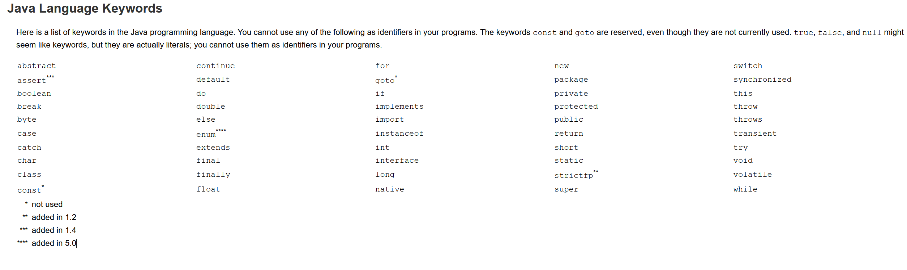
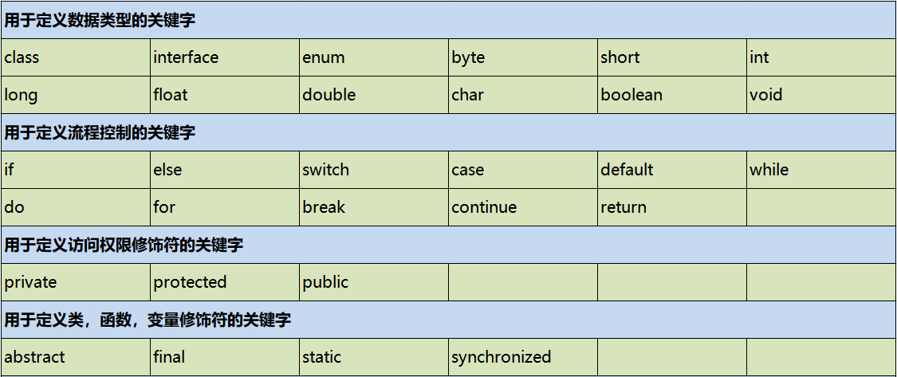
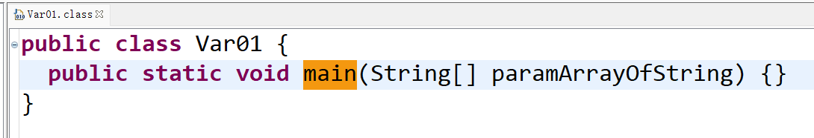
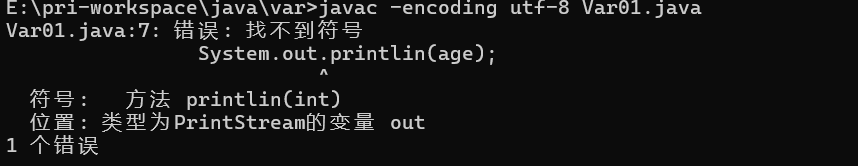
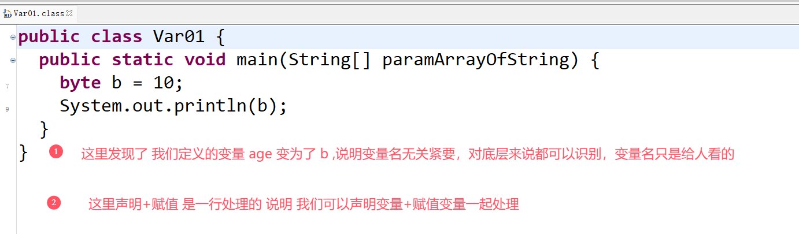
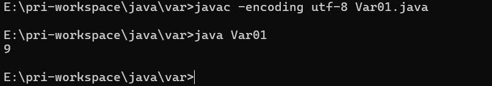
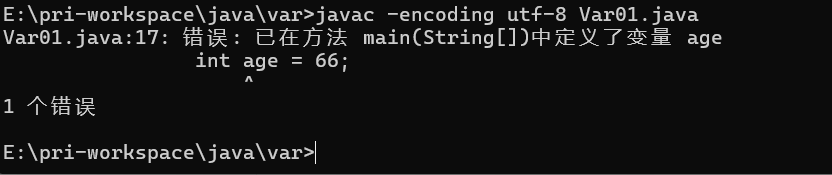
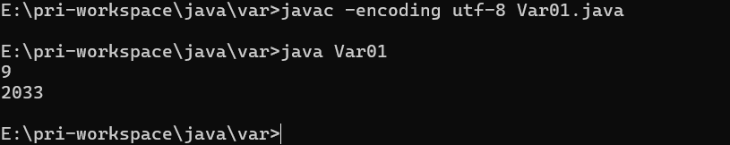
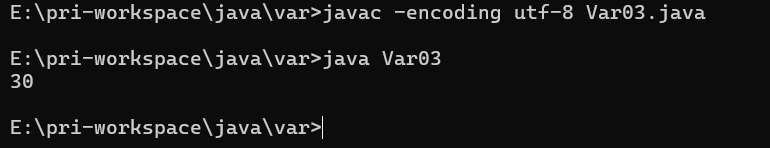

# JAVA基础知识 \- 基础概念

[[toc]]

> 说在前面的话，本文为个人学习[B站免费的马士兵java初级教程](https://www.bilibili.com/video/BV1RK4y1g7A5/?spm_id_from=333.337.search-card.all.click&vd_source=65c7f6924d2d8ba5fa0d4c448818e08a)后进行总结的文章，本文主要用于<b>JAVA基础知识</b>。

## 【1】标识符

### 1.1 什么是标识符？

**标识符** 读： biao <b><font color="red">zhi</font></b> fu。

包，类，变量，方法.....等等,只要是起名字的地方,那个 **<font color="red">名字</font>** 就是**标识符** 

### 1.2 标识符的定义规则

- 标识符由以下4个部分组成：
  - 数字
  - 字母
  - 下划线_
  - 美元符号$

> <font color="red">注意</font>：
>
> 这里的<font color="red">字母</font> 是广义的字母，包含了英文字母、汉字、日语、俄语等，但是一般我们都是使用的英文字母

-  标识符不可以由以下2个部分组成:
  - 不可以以数字作为首位
  - 不可以使用Java语言的关键字 (这个下面会说到有哪些，这里先知道即可)
- 标识符需要<font color="red">见名知意</font>
- 标识符大小写敏感
- 标识符遵循驼峰规则
  - 类名：首字母大写，其他遵循驼峰规则
  - 方法名：首字母小写，其他遵循驼峰规则
  - 变量名：首字母小写，其他遵循驼峰规则
  - 包名：全部小写，不需要遵循驼峰规则
- 标识符的长度限制
  - 一般建议6个单词以内，不建议太长

## 【2】关键字

### 2.1 什么是关键字?

被JAVA语言赋予了特殊含义，用作专门用途的单词

### 2.2 Java关键字的特点

JAVA中所有关键字都为小写

### 2.3 Java关键字详情

大家可以从官网中找到： https://docs.oracle.com/javase/tutorial/java/nutsandbolts/_keywords.html





### 2.4 关键字不要作为标识符

**<font color="red">注意</font>**： 关键字不要作为标识符去使用，我们在日常开发中，不要使用关键字对包名、类名、方法名、变量名进行命名。

## 【3】常量和变量

### 3.1 常量

常量通常指的是一个固定的值，例如：1、2、3、’a’、’b’、true、false、”hello Java”等。为了更好的区分和表述，我们把常量分为两种：

- **字面常量** 

  一般将1、2、3、’a’、’b’、true、false、”hello Java”等称为字面常量

  字面常量我们又细分为如下：

  - 整型常量  
    - 比如，123，23 这些数字类型的
  - 实型常量
    - 比如： 3.1415926
  - 字符常量
    - 比如：'a','c'
  - 逻辑常量
    - true, false
  - 字符串常量
    - "Hello Java"

- **字符常量** 

  使用final修饰的PI(圆周率Π)等称为符号常量

  ``` java
  final double PI = 3.14;
  ```

<font color="red">注意：</font>逻辑常量就两个值，一个是true，一个是false 。

### 3.2 变量

#### 3.2.1 定义

> **变量** :    变量本质上就是代表一个”可操作的存储空间”，空间位置是确定的，但是里面放置什么值不确定。我们可通过变量名来访问“对应的存储空间”，从而操纵这个“存储空间”存储的值。

#### 3.2.2 Java中的变量

Java是一种**强类型语言** ，每个变量都必须声明其数据类型。变量的数据类型决定了变量占据存储空间的大小。 比如，int a=3; 表示a变量的空间大小为4个字节。变量作为程序中最基本的存储单元，其要素包括变量名，变量类型和作用域。变量在使用前必须对其声明, 只有在变量声明以后，才能为其分配相应长度的存储空间。

#### 3.2.3 变量的声明格式

**type  varName [ =value ] [,varName[=value]...];**  //[ ]中的内容为可选项，即可有可无
		数据类型  变量名  [ =初始值 ] [,变量名  [=初始值]…];

#### 3.2.4  变量的声明

- 如果你定义一个变量名，但是没有给这个变量赋值，那么其实你这个变量相当于没有定义

  ``` java
  public class Var01 {
  	public static void main(String[] args) {
  		// 变量的声明(定义变量) 以年龄为例子
  		// 定义一个整数类型的变量，变量名为 age
  		int age;
  	}
  }
  ```

  编译一下 `javac -encoding utf-8 Var01.java`   

  <font color="red">注意：</font> 这里指定字符集是因为我们nodePad++使用utf-8,而windows默认是gbk,会出现字符集的问题，故指定了字符集

  反编译打开 

  

​      没有看到变量被编译。

- 变量如果没有进行赋值的话，那么使用的时候会出错，告诉你：尚未初始化变量

  ``` java
  public class Var01 {
  	public static void main(String[] args) {
  		// 变量的声明(定义变量) 以年龄为例子
  		// 定义一个整数类型的变量，变量名为 age
  		int age;
  		// 若没有赋值就直接输出  会报错
  		System.out.println(age);
  	}
  }
  ```

  编译一下 `javac -encoding utf-8 Var01.java`

  

- 变量的赋值

  ``` java
  public class Var01 {
  	public static void main(String[] args) {
  		// 变量的声明(定义变量) 以年龄为例子
  		// 定义一个整数类型的变量，变量名为 age
  		int age;
  		// 对变量进行赋值 10
  		age  = 10;
  		// 输出
  		System.out.println(age);
  	}
  }
  ```

  编译一下 `javac -encoding utf-8 Var01.java`

  反编译打开 

  

  ``` java
  public class Var01 {
  	public static void main(String[] args) {
  		// 变量的声明(定义变量) 以年龄为例子
  		// 定义一个整数类型的变量，变量名为 age
  		//int age;
  		// 对变量进行赋值 10
  		//age = 10;
  		// 我们自己定义的时候直接就可以用一句话定义：
  		int age = 10;
  		// 输出
  		System.out.println(age);
  	}
  }
  ```

- 变量的赋值变更

  ``` java
  public class Var01 {
  	public static void main(String[] args) {
  		// 变量的声明(定义变量) 以年龄为例子
  		// 定义一个整数类型的变量，变量名为 age
  		//int age;
  		// 对变量进行赋值 10
  		//age = 10;
  		// 我们自己定义的时候直接就可以用一句话定义：
  		int age = 10;
  		// 对变量的赋值进行变更
  		age = 12;
  		age = 20;
  		age = age + 4;
  		age = 9;
  		age = 9;
  		// 输出
  		System.out.println(age);
  	}
  }
  ```

  编译一下 `javac -encoding utf-8 Var01.java`

  执行下程序 `java Var01`

  

  结果是最后变更的值： 9

- 变量不可以重复定义

  ``` java
  public class Var01 {
  	public static void main(String[] args) {
  		// 变量的声明(定义变量) 以年龄为例子
  		// 定义一个整数类型的变量，变量名为 age
  		//int age;
  		// 对变量进行赋值 10
  		//age = 10;
  		// 我们自己定义的时候直接就可以用一句话定义：
  		int age = 10;
  		// 对变量的赋值进行变更
  		age = 12;
  		age = 20;
  		age = age + 4;
  		age = 9;
  		age = 9;
  		// 重复定义一个相同的变量
  		int age = 66;
  		// 输出
  		System.out.println(age);
  	}
  }
  ```

  编译一下 `javac -encoding utf-8 Var01.java`

  

- 变量的使用

  ``` java
  public class Var01 {
  	public static void main(String[] args) {
  		// 变量的声明(定义变量) 以年龄为例子
  		// 定义一个整数类型的变量，变量名为 age
  		//int age;
  		// 对变量进行赋值 10
  		//age = 10;
  		// 我们自己定义的时候直接就可以用一句话定义：
  		int age = 10;
  		// 对变量的赋值进行变更
  		age = 12;
  		age = 20;
  		age = age + 4;
  		age = 9;
  		age = 9; 
  		// 重复定义一个相同的变量  会报错
  		// int age = 66;
  		// 输出
  		System.out.println(age);
  		int num = age + 2024;
  		System.out.println(num);
  	}
  }
  ```

  编译一下 `javac -encoding utf-8 Var01.java`

  执行下程序 `java Var01`

  

- 变量的使用扩展

  ``` java
  public class Var02 {
  	public static void main(String[] args) {
  		int a = 10;
  		int b = 20;
  		int c = a + b;
  		System.out.println(c);
  	}	
  }
  ```

  编译一下 `javac -encoding utf-8 Var02.java`

  然后进行反汇编： `javap -v` 得到字节码文件，然后打开

  ``` java
  E:\pri-workspace\java\var>javap -v Var02
  Classfile /E:/pri-workspace/java/var/Var02.class
    Last modified 2024-11-11; size 402 bytes
    MD5 checksum 72e534623440f47fd639631271560284
    Compiled from "Var02.java"
  public class Var02
    minor version: 0
    major version: 52
    flags: ACC_PUBLIC, ACC_SUPER
  Constant pool:
     #1 = Methodref          #5.#14         // java/lang/Object."<init>":()V
     #2 = Fieldref           #15.#16        // java/lang/System.out:Ljava/io/PrintStream;
     #3 = Methodref          #17.#18        // java/io/PrintStream.println:(I)V
     #4 = Class              #19            // Var02
     #5 = Class              #20            // java/lang/Object
     #6 = Utf8               <init>
     #7 = Utf8               ()V
     #8 = Utf8               Code
     #9 = Utf8               LineNumberTable
    #10 = Utf8               main
    #11 = Utf8               ([Ljava/lang/String;)V
    #12 = Utf8               SourceFile
    #13 = Utf8               Var02.java
    #14 = NameAndType        #6:#7          // "<init>":()V
    #15 = Class              #21            // java/lang/System
    #16 = NameAndType        #22:#23        // out:Ljava/io/PrintStream;
    #17 = Class              #24            // java/io/PrintStream
    #18 = NameAndType        #25:#26        // println:(I)V
    #19 = Utf8               Var02
    #20 = Utf8               java/lang/Object
    #21 = Utf8               java/lang/System
    #22 = Utf8               out
    #23 = Utf8               Ljava/io/PrintStream;
    #24 = Utf8               java/io/PrintStream
    #25 = Utf8               println
    #26 = Utf8               (I)V
  {
    public Var02();
      descriptor: ()V
      flags: ACC_PUBLIC
      Code:
        stack=1, locals=1, args_size=1
           0: aload_0
           1: invokespecial #1                  // Method java/lang/Object."<init>":()V
           4: return
        LineNumberTable:
          line 1: 0
  
    public static void main(java.lang.String[]);
      descriptor: ([Ljava/lang/String;)V
      flags: ACC_PUBLIC, ACC_STATIC
      Code:
        stack=2, locals=4, args_size=1
           0: bipush        10
           2: istore_1
           3: bipush        20
           5: istore_2
           6: iload_1
           7: iload_2
           8: iadd
           9: istore_3
          10: getstatic     #2                  // Field java/lang/System.out:Ljava/io/PrintStream;
          13: iload_3
          14: invokevirtual #3                  // Method java/io/PrintStream.println:(I)V
          17: return
        LineNumberTable:
          line 3: 0
          line 4: 3
          line 5: 6
          line 6: 10
          line 7: 17
  }
  SourceFile: "Var02.java"
  ```

  可以看到 `bipush` `istore` 等字节码的指令，这些就是对内存的操作。

- 变量的内存

  - 每一个变量，底层系统就会分配一小块内存给他，存储它的名字和值。后续JVM再细讨论。

- 变量的作用域

  >  作用域指的就是作用范围，变量在什么范围中有效。作用范围就是离它最近的{}

  我们根据这个作用域把变量分为了

  - 局部变量
    - 作用于方法内部
  - 成员变量
    - 作用于类内部

  ``` java
  public class Var03 {
  	// 成员变量
  	static int a  = 10;
  	public static void main(String[] args) {
  		// 局部变量
  		int b  = 20;
  		int c = a + b;
  		System.out.println(c);
  	}
  }
  ```

  编译一下 `javac -encoding utf-8 Var03.java`

  执行下程序 `java Var03`

  

- 至此，变量就暂时学习完毕。

## 【4】参考资料

- [B站免费的马士兵java初级教程](https://www.bilibili.com/video/BV1RK4y1g7A5/?spm_id_from=333.337.search-card.all.click&vd_source=65c7f6924d2d8ba5fa0d4c448818e08a)