# JAVA基础知识 \- 基本数据类型

[[toc]]

> 说在前面的话，本文为个人学习[B站免费的马士兵java初级教程](https://www.bilibili.com/video/BV1RK4y1g7A5/?spm_id_from=333.337.search-card.all.click&vd_source=65c7f6924d2d8ba5fa0d4c448818e08a)后进行总结的文章，本文主要用于<b>JAVA基础知识</b>。

## 【1】本文重点

Java是一种**强类型语言** ，每个变量都必须声明其数据类型。 

Java的数据类型可分为两大类：**基本数据类型（primitive data type）** 和**引用数据类型（reference data type）** 。

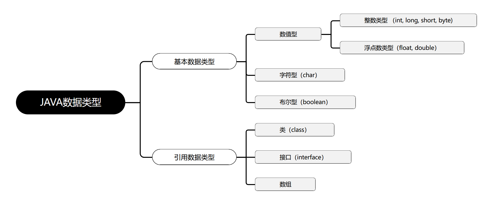

巧妙记忆：除了基本数据类型以外的所有类型都属于引用数据类型，本文重点：**基本数据类型（primitive data type）**

## 【2】整数类型

### 【2.1】整数类型的常量

- 首先，我们需要了解下进制？

**十进制** 整数，如：99, -500, 0

**八进制** 整数，要求以 0 开头，如：015

**十六进制** 数，要求 0x 或 0X 开头，如：0x15

**二进制** ：要求0b或者0B开头，如：0b11

几进制：就是逢几进1的问题

平时实际生活中用的最多的是：**十进制** 

计算机用**二进制** 最多

以下这张图则是不同进制下的常量

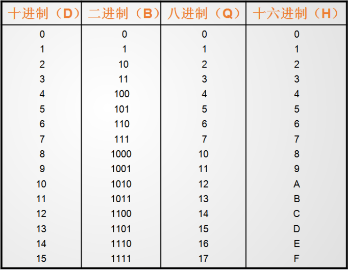

- 进制之间的转换

  - 二进制转换为十进制

    二进制数： 1101

    ``` java
        1*2^3  +   1*2^2   +  0*2^1  +     1*2^0
    =    8         +      4       +     0       +      1
    =  13
    ```

  - 十进制转换为二进制

    十进制数 13

    若要转为二进制，则对2求余数，一直到为0为止，然后余数倒排，则为二进制数

    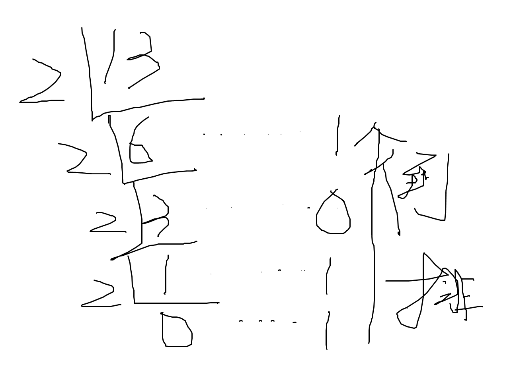

    所以，十进制数13转为二进制数为1101.

  - 八进制转换十进制

    八进制： 16

    ``` java
    1 * 8^1 +   6 * 8^0
    =   8     +  6
    =14
    ```

  - 十进制转为八进制

    若要转为八进制，则对8求余数，一直到为0为止，然后余数倒排，则为二进制数

    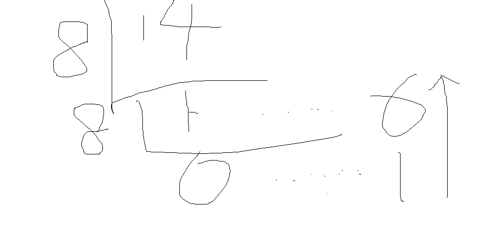

    所以十进制数14转为八进制数为16.

  - 八进制转换为十六进制

    把十进制当做一个中转站：

    先把八进制转为十进制,再把十进制数转为十六进制即可。

### 【2.2】整数类型的变量

首先，我们先了解下Java中有哪些整数类型：

| 类型  | 占用存储空间 |                         数值范围                          |
| :---: | :----------: | :-------------------------------------------------------: |
| byte  |   1个字节    |              $-2^7$ ~ $2^7$  -1  (-128~127)               |
| short |   2个字节    |         - $2^{15}$ ~ $2^{16}$ -1 (-32768 ~ 32767)         |
|  int  |   4个字节    | - $2^{31}$ ~ $2^{32}$ -1 (-2147483648~ 2147483647) 约21亿 |
| long  |   8个字节    |                 - $2^{63}$ ~ $2^{63}$ -1                  |

然后通过几段代码，演示下如何声明并赋值整数类型的变量：

::: important  演示整数类型的变量的声明和赋值

```java
// 演示整数类型的变量的声明和赋值
public class IntVar01 {
	public static void main(String[] args) {
		// 定义整数类型的变量 通过赋值不同进制的值进行演示
		// 通常为十进制
		int num1 = 12;
		System.out.println(num1);
		// 十进制的值前面加个0  就是8进制
		int num2 = 012;
		System.out.println(num2);
		// 十进制的值前面加个0x或者0X  就是十六进制
		int num3 = 0x12;
		System.out.println(num3);
		// 十进制的值前面加个0b或者0B  就是二进制
		int num4 = 0b10;
		System.out.println(num4);
	}
}
```

:::

然后编译下， `javac -encoding utf-8 IntVar01.java`

执行下编译后的代码： `java IntVar01`

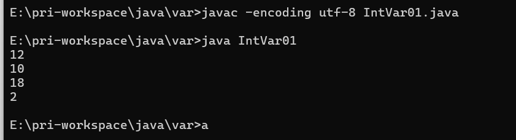

 可以发现，输出的都是十进制，但是定义都是按照不同的进制进行定义的。

再打开看下编译后的代码：

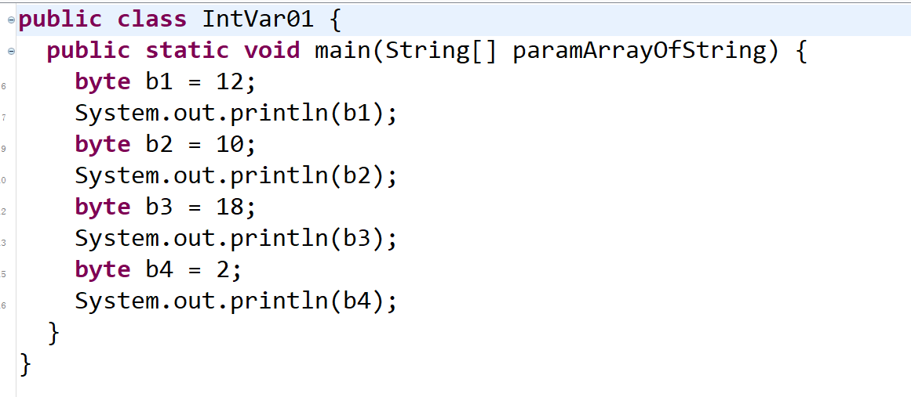

我们可以发现，我们定义是int, 但是实际上编译为 byte了。值都被转完成了，这就解释了为什么执行后都是十进制了。

::: important 演示整数类型的变量的声明和赋值  byte类型

``` java
// 演示整数类型的变量的声明和赋值 byte
public class IntVar02 {
	public static void main(String[] args) {
		// 定义byte整数类型的变量 通过赋值不同进制的值进行演示
		//定义byte类型的变量：
		byte b = 126;//定义了一个byte类型的变量，名字叫b，赋值为126
		System.out.println(b);
		//注意：超范围的赋值会报错。
		//byte b1 = 128;//定义了一个byte类型的变量，名字叫b，赋值为128
		//System.out.println(b1);
	}
}
```

:::

可以看到上述代码,先不开放注释，我们编译执行如下：

`javac -encoding utf-8 IntVar02.java`

`java IntVar02`

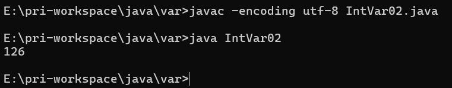

编译后的代码如下：

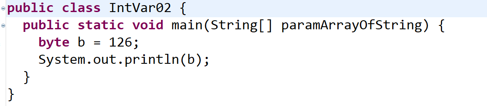

正常输出。

然后开放超出范围的代码注释，编译下：

`javac -encoding utf-8 IntVar02.java`

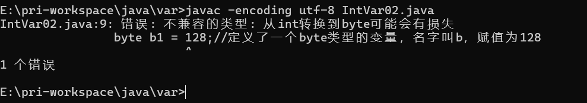

可以看到在编译阶段就直接报错了，故我们定义变量不可以超出它的数值范围。

那么我们直接通过代码介绍下其他的变量声明

::: important 演示整数类型的变量的声明和赋值  short  long 类型

``` java
// 演示整数类型的变量的声明和赋值 short  long 类型
public class IntVar03 {
	public static void main(String[] args) {
		// 定义short  long 类型整数类型的变量 通过赋值不同进制的值进行演示
		//定义short  long 类型的变量：
		short s = 30000;  // ASCII码中的‘田’
		System.out.println(s); //ASCII码中的'A'
        // short或int变量编译后转为char时，实际上是将其转为对应的Unicode字符  涉及基本数据类型之间的转换，后续再说
		int i = 1234;
		System.out.println(i);
		//整数类型默认就是int类型的，所以12345678910是一个int类型的数，对于int类型来说，它超出范围了
		//要想把一个数给long类型变量，那么后面加上L(推荐)或者l就可以了
		long num1 = 12345678910L;
		System.out.println(num1);
		//注意：只有这个数超出int类型的范围了后面才需要加上L，否则无需加L也可以赋值给long类型：
		long num2 = 12;
		System.out.println(num2);
	}
}
```

:::

编译执行下：

`javac -encoding utf-8 IntVar03.java`

`java IntVar03`

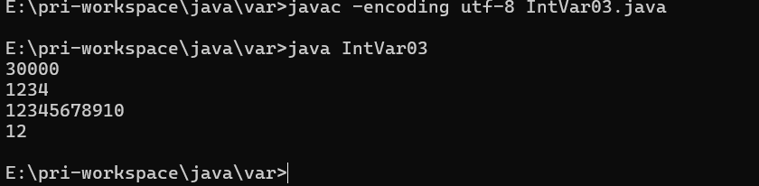

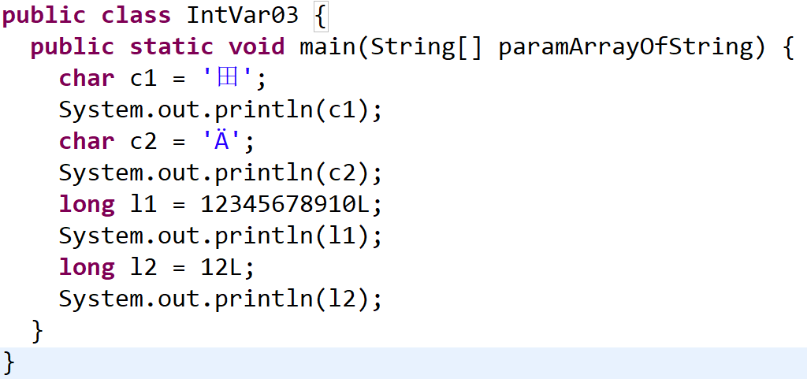

这里可以看到，有些比较特殊。

- short怎么转为char了?
- int 编译后为char了？

注释上已经进行了说明，但是还是比较重要的，涉及基本数据类型之间的转换，后续再说。

## 【3】浮点数类型

### 【3.1】 浮点数类型常量

::: info 浮点数类型的常量

- （1）十进制数形式，例如:   3.14 , 314.0, 0.31
- （2）科学记数法形式，如
  - $314e2$ ，   $314E2$  (E的大小写没有区分)  ， $314E{-2}$    
  - $double  f = 314e2$    $//314*10^2-->31400.0$
  - $double  f2 = 314e-2;$      $//314*10^{-2}-->3.14$    

::: 

### 【3.2】浮点数类型变量

::: info 浮点数类型的变量  

- **float** 
  - float类型又被称作单精度类型，尾数可以精确到7位**有效数字** 
  - float类型的数值有一个后缀F或者f ，没有后缀F/f的浮点数值默认为double类型
- **double** 
  - 在很多情况下，float类型的精度很难满足需求, double表示这种类型的数值精度约是float类型的两倍，又被称作双精度类型，绝大部分应用程序都采用double类型。
  - 也可以在浮点数值后添加后缀D或者d， 以明确其为double类型。
- **有效数字** 
  - **有效数字** 指的是从左开始第一个不为0的数到最后一个数

:::

|  类型  | 占用存储空间 |                       数值范围                        |
| :----: | :----------: | :---------------------------------------------------: |
| float  |    4字节     |    大约 $±3.402 823 47E±38 F$  （有效位数为6~7位）    |
| double |    8字节     | 大约 $±1.79769313486231570 E+308$ (有效位数为15~16位) |

下面就通过1段代码进行演示下：

::: info  浮点数类型的变量的代码演示

``` java
// 演示浮点型类型的变量的声明和赋值 floatdouble
public class FloatVar01 {
	public static void main(String[] args) {
		//浮点类型的常量有两种形式：
		//十进制形式：
		double num1 = 3.14;
		System.out.println(num1);
		//科学计数法形式：
		double num2 = 314E-2;
		System.out.println(num2);
		
		//浮点类型的变量：
		//注意：浮点型默认是double类型的，要想将一个double类型的数赋给float类型，必须后面加上F或者f
		float f1 = 3.14234567898623F;
		System.out.println(f1);
		//注意：double类型后面可以加D或者d，但是一般我们都省略不写
		double d1 = 3.14234567898623D;
		System.out.println(d1);
		
		//注意：我们最好不要进行浮点类型的比较：
		float f2 = 0.3F;
		double d2 = 0.3;
		System.out.println(f2==d2);
		/*
		区别：
		= 赋值运算：  将等号右侧的值赋给等号左侧
		== 判断==左右两侧的值是否相等  ：结果要么相等 要么不相等
		==运算符的结果就是要么是true，要么是false
		*/
        
	}	
}
```

编译，执行

`javac -encoding utf-8  FloatVar01.java`

`java FloatVar01`

结果如下: 

``` powershell
E:\pri-workspace\java\var>javac -encoding utf-8  FloatVar01.java

E:\pri-workspace\java\var>java FloatVar01
3.14
3.14
3.1423457
3.14234567898623
false

E:\pri-workspace\java\var>
```

::: 

## 【4】字符类型

### 【4.1】 什么是编码？

::: info 编码

FROM [百度百科](https://upimg.baike.so.com/doc/2161876-32333087.html)

**编码**（Encoding）是一种计算机编程语言的代码，是信息从一种形式或格式转换为另一种形式的过程。通常是用预先规定的方法将文字、数字或其他对象编成数码，或将信息、数据转换成规定的电脉冲信号。编码在电子计算机、电视、遥控和通讯等方面广泛使用。

- 中文名

  编码

- 外文名

  Encoding

- 逆过程 

  **解码** 

- 字符编码机制

  ASCII 码、非ASCII 码、Unicode

:::

### 【4.2】生活例子

::: info 例子

我们都看过谍战片，片中传递情报的方式就是用到了编码和解码。

特工通过摩斯密码或者其他方式对情报信息进行编码，组织得到编码，然后通过特定的约定的字符集进行解码得到想要的消息。  

这个过程就是编码和解码。约定好的则字符集

:::

### 【4.3】字符集

::: info 字符集

- 定义： 由权威机构形成的编码表才可以称之为：字符集
- 字符集分类
  - ASCII : 一个英文字符集，用1个字节的7位表示
    - 美国使用
    - 就包含26个小写字母+26个大写字母+一些英文标点符号和特殊符号，总共不会超过 $2^7$ 个, 故1个字节的7位就足够了。
  - IOS8859-1: 西欧字符集，用1个字节的8位表示
    - 德法使用
  - GB2312: 简体中文字符集，最多使用2个字节表示
    - 中国
    - 汉字太多了，8位不够用，故使用2个字节，$2^{16}$   65536个，足够了。
  - GBK：GB2312的升级版本，包含了繁体字，最多使用2个字节表示
    - 中国使用
  - Unicode: 国际通用字符集，融合了目前人类使用的所有字符。为每个字符分配唯一的字符码。
    - 国际通用
    - 至少1个字节表示
    - 因为无法形成统一，没有落地，直到UTF标准的出现
- 推出了 **UTF** 标准
  - UTF-8
  - UTF-16
  - UTF-32
- UTF-8标准是Unicode符号的落地方案
  - 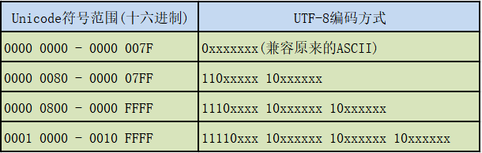
  - UTF-8标准最多6个字节
    - 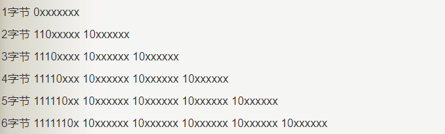
  - 无需背诵，需要的时候使用程序员计算机去转换即可。

:::

:::  warning 注意

- 计算机只认识1/0, 1个存储位置简称位1位，**计算机规定8位为1个字节**，其中首位为符号位，0正1负

- 中文使用2个字节表示
- 以后我们用的最多的就是 **UTF-8** 

:::

### 【4.4】字符类型

::: info 字符类型

- Java中使用单引号来表示字符常量，字符型在内存中占2个字节。
- java中char类型用来表示在Unicode编码表中的字符。Unicode编码被设计用来处理各种语言的文字，它占2个字节，可允许有65536个字符。
- java中char类型是无符号的，因此没有正负的概念

:::

- 转义字符:

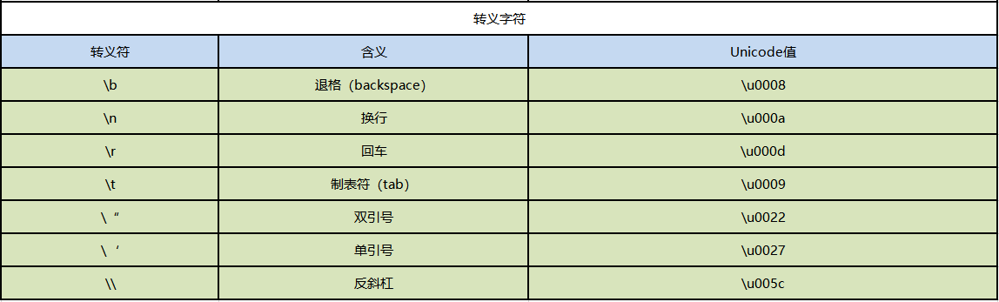

- ASCII表

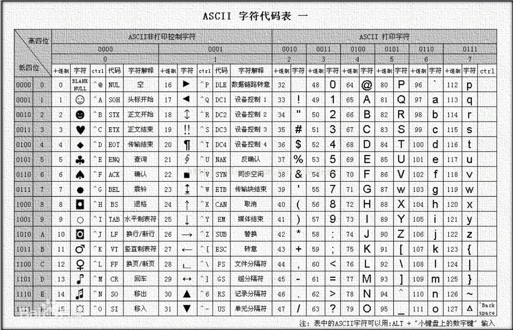

- [Unicode编码表](https://www.cnblogs.com/csguo/p/7401874.html)
  - 网上找的，若过期了，请自己百度
- 代码演示

::: info 演示字符型类型的变量的声明和赋值 char

``` java
// 演示字符型类型的变量的声明和赋值 char
public class CharVar01 {
	public static void main(String[] args) {
		//定义字符类型的变量：
		char ch1 = 'a';
		System.out.println(ch1);
		char ch2 = 'A';
		System.out.println(ch2);
		char ch3 = '4';
		System.out.println(ch3);
		char ch4 = '中';
		System.out.println(ch4);
		char ch5 = '?';
		System.out.println(ch5);
		//java中无论：字母，数字，符号，中文都是字符类型的常量，都占用2个字节。
		char ch6 = ' ';
		System.out.println(ch6);
		//字符类型：单引号引起来的单个字符
		System.out.println("--------------------------------");
		/*
		转义字符：
		\将后面的普通字符转换为特殊含义
		*/
		char ch7 = '\n';
		System.out.println("aaa"+ch7+"bbb");
		
		System.out.println("aaa\nbbb");// \n  换行
		
		System.out.println("aaaaaaa\tbbb");  //  \t  制表符
		
		System.out.println("aaa\bbbb");//aabbb  \b  向前退一格
		System.out.println("aaa\rbbb");//bbb   \r 将光标到本行开头 ：回车
		
		System.out.println("\"java\""); // \" 将双引号原样输出  \' 将单引号原样输出 \\ 将\原样输出
	}
}
```

编译执行下: `javac -encoding utf-8 CharVar01.java`  `java CharVar01`

结果如下:

``` powershell
E:\pri-workspace\java\var>javac -encoding utf-8 CharVar01.java

E:\pri-workspace\java\var>java CharVar01
a
A
4
中
?

--------------------------------
aaa
bbb
aaa
bbb
aaaaaaa bbb
aabbb
bbb
"java"

E:\pri-workspace\java\var>
```

.class 文件如下：

``` java
public class CharVar01 {
  public static void main(String[] paramArrayOfString) {
    byte b1 = 97;
    System.out.println(b1);
    byte b2 = 65;
    System.out.println(b2);
    byte b3 = 52;
    System.out.println(b3);
    char c = '中';
    System.out.println(c);
    byte b4 = 63;
    System.out.println(b4);
    byte b5 = 32;
    System.out.println(b5);
    System.out.println("--------------------------------");
    byte b6 = 10;
    System.out.println("aaa" + b6 + "bbb");
    System.out.println("aaa\nbbb");
    System.out.println("aaaaaaa\tbbb");
    System.out.println("aaa\bbbb");
    System.out.println("aaa\rbbb");
    System.out.println("\"java\"");
  }
}
```

可以看到，大部分都进行了转换，由char转为了byte，这是利用了JVM的缺省编码，现在暂时不用了解，主要是我们定义的值范围处于哪个数据类型的范围内，然后基本数据类型之间进行了转换，后续会说到。

下面我们再写一段代码,强调下，char类型实际底层在计算的时候是按照ASCII码进行计算的。

``` java
// 演示字符型类型的变量的声明和赋值 char  2
public class CharVar02 {
	public static void main(String[] args) {
		char ch1 = 'A';
		System.out.println(ch1);//A
		System.out.println(ch1+90);//155
		System.out.println(155-ch1);//90
		//char类型我们看到的样子就是它本身的字面常量,但是底层在进行计算的时候，实际上是按照一个码进行计算的。
		//这个码就是ASCII
		//之前说char类型是按照Unicode码表进行存储的 (Unicode兼容了ASCII码，Unicode的前128位置ASCII)
		
		char ch2 = '中';
		System.out.println(ch2);// 中
		System.out.println(ch2+90);// 20103
		System.out.println(20103-ch2);// 90
		
		//转换：
		int num1 = (int)ch2;
		System.out.println(num1);//20013
		
		char ch = (char)20013;
		System.out.println(ch);
		
		int num2 = '中';
		char ch5 = 20013;
		System.out.println(ch5);
		
		// 计算 这里主要是比较特殊  正好编码4 就是 ‘4’ 实际是需要找'2'的编码+2得到的‘4’
		char ch6 = '2'+2;
		System.out.println(ch6);//'4'--->4
	
	}
}
```

编译执行下: `javac -encoding utf-8 CharVar02.java`  `java CharVar02`

结果如下:

``` powershell
E:\pri-workspace\java\var>javac -encoding utf-8 CharVar02.java

E:\pri-workspace\java\var>java CharVar02
A
155
90
中
20103
90
20013
中
中
4

E:\pri-workspace\java\var>
```

.class文件如下:

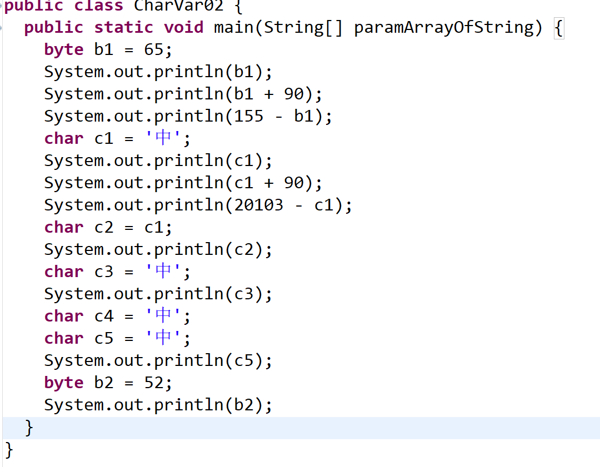

可以看到这是(byte b2 = 52 )编码52 表示'4' 那么 '2'的编码就是50 

:::

## 【5】布尔类型

::: info 布尔类型

- 介绍： boolean类型有两个常量值，true和false
- 注意： boolean类型在内存中占一位(不是一个字节)，不可以使用 0 或非 0 的整数替代 true 和 false ，这点和C语言不同。
- 使用： boolean 类型用来判断逻辑条件，一般用于程序流程控制 。
- 代码演示

``` java 
// 演示布尔型类型的变量的声明和赋值 boolean
public class BooleanVar {
	public static void main(String[] args) {
		//创建一个布尔类型的变量：
		boolean flag1 = true;
		System.out.println(flag1);
		boolean flag2 = false;
		System.out.println(flag2);
		boolean flag3 = 1==2;
		System.out.println(flag3);
		boolean flag4 = 1<2;
		System.out.println(flag4);
	}
}
```

编译执行下 `javac -encoding utf-8 BooleanVar.java`  `java BooleanVar`

结果如下:

``` powershell
E:\pri-workspace\java\var>javac -encoding utf-8 BooleanVar.java

E:\pri-workspace\java\var>java BooleanVar
true
false
false
true

E:\pri-workspace\java\var>
```

:::

## 【6】基本数据类型的转换

前面，我们都看过编译后的文件，里面都多多少少涉及到了基本数据类型的转换。

### 【6.1】什么是数据类型转换?

在赋值运算或者算数运算的时候，要求数据类型一致，就要进行类型的转换。

### 【6.2】类型转换的种类

- 自动转换
- 强制转换

### 【6.3】内存演示

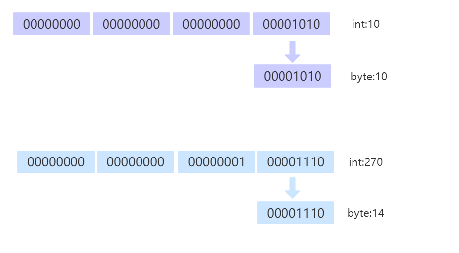

### 【6.4】代码演示

``` java
// 演示基本数据类型的转换
public class Convert {
	public static void main(String[] args) {
		//类型转换的两种形式：
		double d = 6;//int-->double  自动类型转换
		System.out.println(d);
		int i = (int)6.5;//double--->int  强制类型转换 （强转）
		System.out.println(i);
		
		//在同一个表达式中，有多个数据类型的时候，应该如何处理：
		//多种数据类型参与运算的时候，整数类型，浮点类型，字符类型都可以参与运算，唯独布尔类型不可以参与运算。
		//double d2 = 12+1294L+8.5F+3.81+'a'+true;
		double d2 = 12+1294L+8.5F+3.81+'a';
		System.out.println(d2);
		/*
		类型级别：(从低到高的)
		byte,short,char-->int--->long--->float--->double
		级别用来做什么？当一个表达式中有多种数据类型的时候，要找出当前表达式中级别最高的那个类型，然后
		其余的类型都转换为当前表达式中级别最高的类型进行计算。
		double d2 = 12+1294L+8.5F+3.81+'a';
				  = 12.0+1294.0+8.5+3.81+97.0
		*/
		int i2 = (int)(12+1294L+8.5F+3.81+'a');
		System.out.println(i2);
		/*
		在进行运算的时候：
		左=右  : 直接赋值
		左<右  ：强转
		左>右  ：直接自动转换
		*/
		
		//以下情况属于特殊情形：对于byte，short，char类型来说，只要在他们的表数范围中，赋值的时候就不需要进行
		//强转了直接赋值即可。
		byte b = 12;
		System.out.println(b);
		byte b2 = (byte)270;
		System.out.println(b2);
	}
}
```

编译执行:  `javac -encoding utf-8 Convert.java`  `java Convert`

结果如下:

``` powershell
E:\pri-workspace\java\var>javac -encoding utf-8 Convert.java

E:\pri-workspace\java\var>java Convert
6.0
6
1415.31
1415
12
14

E:\pri-workspace\java\var>
```

.class文件如下:

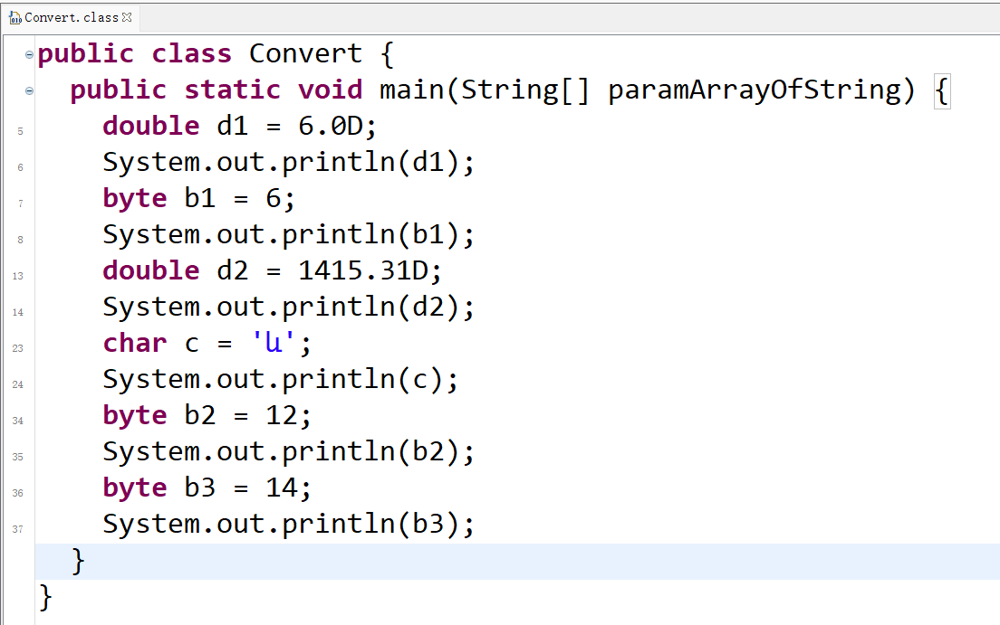

至此，所有的基本数据类型就介绍完毕了。

## 【7】参考资料

- [B站免费的马士兵java初级教程](https://www.bilibili.com/video/BV1RK4y1g7A5/?spm_id_from=333.337.search-card.all.click&vd_source=65c7f6924d2d8ba5fa0d4c448818e08a)