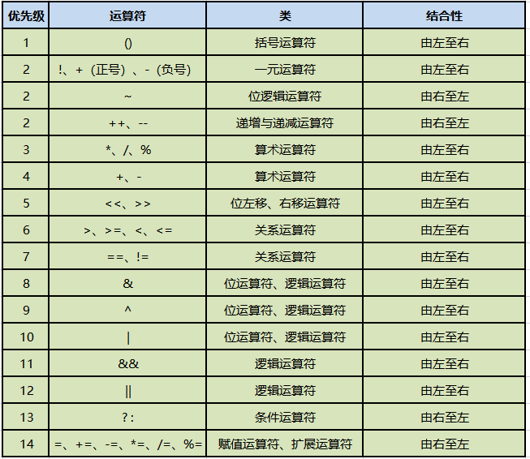

# JAVA基础知识 \- 运算符

[[toc]]

> 说在前面的话，本文为个人学习[B站免费的马士兵java初级教程](https://www.bilibili.com/video/BV1RK4y1g7A5/?spm_id_from=333.337.search-card.all.click&vd_source=65c7f6924d2d8ba5fa0d4c448818e08a)后进行总结的文章，本文主要用于<b>JAVA基础知识</b>。

## 【1】运算符概述

::: info Java支持的所有的运算符

1. 算数运算符
   1. 加法运算符  `+` 
   2. 减法运算符  `-`
   3. 乘法运算符  `*`
   4. 除法运算符  `/`
   5. 求余运算符  `%`
   6. 自增运算符 `++`
   7. 自减运算符 `–`
2. 赋值运算符
   1. 赋值运算符 `=` 
   2. 先加法后赋值运算符 `+=`
   3. 先减法后赋值运算符 `-=`
   4. 先乘法后赋值运算符 `*=`
   5. 先除法后赋值运算符 `/=`
3. 关系运算符
   1. 大于 `>`
   2. 小于 `<`
   3. 大于等于 `>=`
   4. 小于等于 `<=`
   5. 等等于 `==`
   6. 不等于 `!=` 
4. 逻辑运算符
   1. 逻辑与 `&`
   2. 短路与 `&&`
   3. 逻辑或 `|`
   4. 短路或 `||`
   5. 逻辑非 `!`
   6. 逻辑异或 `^`
5. 条件运算符
   1. 三元运算符  若条件为true/false 则 A 或 B  `condition ? A : B` 
6. 位运算符
   1. `&` 
   2. `|`
   3. `^`
   4. `~`
   5. `>>`
   6. `<<`
   7. `>>>`

:::

::: info 相关单词释义

- 运算符/操作符：    operator
- 表达式： expression
- 操作数： operand
- 语句： sentence

:::

## 【2】算数运算符

### 【2.1】加法运算符 +

1. 加法运算符 + 在Java中的作用有哪些?
   1. 表示1个正数 ， 比如 +5 即 正数 5
   2. 表示数学中的2个操作数相加，加法操作， 比如  2 + 3 = 5 即： 数字 2 和 数字 3 相加 等于 5
   3. 表示字符串之间的拼接， 比如 "I" +  " can" + " speak"  + " English"  = "I can speak English"
2. 使用代码进行演示

::: important 代码演示加法运算符

``` java
// 代码演示加法运算符 +
public class OperAdd {
        p;,	 NJM,blic static void main(String[] args) {
		// 1) 表示正数
		System.out.println(+3); // 结果为 3
		// 2) 表示相加
		System.out.println(2 + 4); // 结果为 6
		// 3) 表示字符串的拼接
		// 规则：+号左右两侧的任意一侧有字符串，那么这个加号就是字符串拼接的作用，结果一定是字符串
		// 出现字符数据类型 和 数字 则需要计算Unicode码
		System.out.println("I" + " can" + " speak" + " English");// I can speak English
		System.out.println("num=" + 6);// num=6
		System.out.println(1 + "6");// 16  不是 7 
		int num = 56;
		System.out.println("num="+num);//"num=56" ---> num=56
		System.out.println(5+6+"7");//11+"7"--->"117"  --->117
		System.out.println(5+'6'+"7");//59 +"7"--->"597" --->597
		System.out.println("5"+6+"7");//"56"+"7"  --->"567"--->567
		System.out.println("5"+'6'+"7");//"56"+"7"--->"567"--->567
		System.out.println("5"+'6'+'7');//"56"+'7'--->"567"---567
	}
}
```

编译执行下, 看结果是否和我们注释后的答案一致 `javac -encoding utf-8  OperAdd.java` `java OperAdd`

``` powershell
E:\pri-workspace\java\operators>javac -encoding utf-8 OperAdd.java

E:\pri-workspace\java\operators>java OperAdd
3
6
I can speak English
num=6
16
num=56
117
597
567
567
567

E:\pri-workspace\java\operators>
```

源码大家参考下，稍微看下即可，就不过多解释了


:::

### 【2.2】减法运算符 -

1. 减法运算符在Java中的作用有哪些？
   1.  表示负数，比如 -3 
   2. 表示数学中的2个操作数相减，减法操作， 比如 18 - 6 = 12 即操作数18 减去 操作6 等于 12
2. 使用代码进行演示

::: important  代码演示减法运算符

``` java
// 代码演示减法运算符 -
public class OperSub {
	public static void main(String[] args) {
		// 1) 表示负数
		System.out.println(-2); // 结果为 -3
		// 2) 表示相减
		System.out.println(22 - 12); // 结果为 10
		System.out.println(100 - '6');//100 - 54 --->46
	}
}
```

编译执行下, 看结果是否和我们注释后的答案一致 `javac -encoding utf-8  OperSub.java` `java OperSub`

``` powershell
E:\pri-workspace\java\operators>java OperSub
-2
10
46

E:\pri-workspace\java\operators>
```

源码大家参考下，稍微看下即可，就不过多解释了


:::

### 【2.3】乘法运算符 *

1. 乘法运算符 `*` 在Java中的作用?
   1.  表示2个数值类型的操作数进行数学上的相乘
2. 使用代码进行演示

::: important  代码演示乘法运算符

``` java
// 代码演示乘法运算符  * 
public class OperMultiply {
	public static void main(String[] args) {
		// 1) 表示2个数值类型的数相乘
		System.out.println(7 * 8); // 结果为 56
		System.out.println(-10 * 2); // 结果为 -20
		System.out.println(2 * '6'); // 结果为 2*54 = 108
	}
}
```

编译执行下, 看结果是否和我们注释后的答案一致 `javac -encoding utf-8  OperMultiply.java` `java OperMultiply`

``` powershell
E:\pri-workspace\java\operators>javac -encoding utf-8 OperMultiply.java

E:\pri-workspace\java\operators>java OperMultiply
56
-20
108

E:\pri-workspace\java\operators>
```

源码大家参考下，稍微看下即可，就不过多解释了


:::

### 【2.4】除法运算符 /

1. 除法运算符 `/` 在Java中的作用?

   1.  表示2个数值类型的操作数进行数学上的相除

   ::: warning 注意

   28 / 7 = 4   这里的28叫做被除数 / 为除以 7为除数 = 等于,赋值  4为商 

   :::

2. 使用代码进行演示

::: important  代码演示除法运算符

``` java
// 代码演示除法运算符  * 
public class OperDivise {
	public static void main(String[] args) {
		// 1) 表示2个数值类型的操作数进行数学上的相除
		System.out.println(56 / 8); // 结果为 7
		System.out.println(-100 / 10); // 结果为 -10
		System.out.println(108 / '6'); // 结果为 108 / 54 = 2
	}
}
```

编译执行下, 看结果是否和我们注释后的答案一致 `javac -encoding utf-8  OperDivise.java` `java OperDivise`

``` powershell
E:\pri-workspace\java\operators>javac -encoding utf-8 OperDivise.java

E:\pri-workspace\java\operators>java OperDivise
7
-10
2

E:\pri-workspace\java\operators>
```

源码大家参考下，稍微看下即可，就不过多解释了

 	

:::

### 【2.5】取余运算符 %

1. 取余运算符 `%` 在Java中的作用?

   1.  表示2个数值类型的操作数进行数学上的相除之后得到的余数

   ::: warning 注意

   29 / 7 = 4 ……1   这里的29叫做被除数 / 为除以 7为除数 = 等于,赋值  4为商  这里多出来的1 就是余数

   :::

2. 使用代码进行演示

::: important  代码演示取余运算符

``` java
// 代码演示取余运算符  % 
public class OperRemainder {
	public static void main(String[] args) {
		// 1) 表示2个数值类型的操作数进行数学上的相除得到的余数
		System.out.println(57 % 8); // 结果为 1
		System.out.println(56 % 8); // 结果为 0
		System.out.println(57 % 8.0); // 结果为 1.0
	}
}
```

编译执行下, 看结果是否和我们注释后的答案一致 `javac -encoding utf-8  OperRemainder.java` `java OperRemainder`

``` powershell
E:\pri-workspace\java\operators>javac -encoding utf-8 OperRemainder.java

E:\pri-workspace\java\operators>java OperRemainder
1
0
1.0

E:\pri-workspace\java\operators>
```

源码大家参考下，稍微看下即可，就不过多解释了


:::

### 【2.6】自增运算符 ++

1. 什么是自增运算符？

::: info 自增运算符

​	顾名思义，就是使用了该运算符，原变量自己增加1的操作

:::

2. 自增运算符的特点 
   1. 前提： 设a为变量， `++` 为自增运算符
   2. 无论是 a`++` 还是 `++`a，只要是自增运算符单独使用的时候， 都可以简单的理解为 a = a + 1，都是加1操作
   3. 将`++`参与到运算中, 则看`++`在前还是在后，如果++在后：先运算，后加1   如果`++`在前，先加1，后运算
3. 代码演示

::: important 直接代码演示自增运算符 `++`

``` java
// 代码演示自增运算符  ++ 
public class OperDoubleAdd {
	public static void main(String[] args) {
		int a = 5;
		a++;//理解为：相当于  a=a+1 操作  
		System.out.println(a);//6
		
		a = 5;
		++a;//理解为：相当于  a=a+1 操作  
		System.out.println(a); //6
		
		//总结：++单独使用的时候，无论放在前还是后，都是加1操作
		
		//将++参与到运算中：
		//规则：看++在前还是在后，如果++在后：先运算，后加1   如果++在前，先加1，后运算
		a = 5;
		int m = a++ + 7;//先运算  m=a+7  再加1：  a = a+1 
		System.out.println(m);//12
		System.out.println(a);//6
		
		a = 5;
		int n = ++a + 7;//先加1  a=a+1  再运算：  n = a+7 
		System.out.println(n);//13
		System.out.println(a);//6
	}
}
```

编译执行下, 看结果是否和我们注释后的答案一致 `javac -encoding utf-8  OperDoubleAdd.java` `java OperDoubleAdd`

``` powershell
E:\pri-workspace\java\operators>javac -encoding utf-8 OperDoubleAdd.java

E:\pri-workspace\java\operators>java OperDoubleAdd
6
6
12
6
13
6

E:\pri-workspace\java\operators>
```

源码大家参考下，稍微看下即可，就不过多解释了


:::

### 【2.7】自减运算符`--`

1. 什么是自减运算符？

::: info 自减运算符

​	顾名思义，就是使用了该运算符，原变量自己减少1的操作

:::

2. 自减运算符的特点 
   1. 前提： 设a为变量， `--` 为自减运算符
   2. 无论是 a`--` 还是 `--`a，只要是自减运算符单独使用的时候， 都可以简单的理解为 a = a - 1，都是减1操作
   3. 将`--`参与到运算中, 则看`--`在前还是在后，如果`--`在后：先运算，后减1   如果`--`在前，先减1，后运算
3. 代码演示

::: important 直接代码演示自减运算符 `--`

``` java
// 代码演示自减运算符  --
public class OperDoubleSub {
	public static void main(String[] args) {
		int a = 5;
		a--;//理解为：相当于  a=a-1 操作  
		System.out.println(a);//4
		
		a = 5;
		--a;//理解为：相当于  a=a-1 操作  
		System.out.println(a); //4
		
		//总结：--单独使用的时候，无论放在前还是后，都是减1操作
		
		//将--参与到运算中：
		//规则：看--在前还是在后，如果--在后：先运算，后减1   如果--在前，先减1，后运算
		a = 5;
		int m = a-- - 7;//先运算  m=a-7  再减1：  a = a-1 
		System.out.println(m);//-2
		System.out.println(a);//4
		
		a = 5;
		int n = --a - 7;//先减1  a=a-1  再运算：  n = a - 7 
		System.out.println(n);//-3
		System.out.println(a);//4
	}
}
```

编译执行下, 看结果是否和我们注释后的答案一致 `javac -encoding utf-8  OperDoubleSub.java` `java OperDoubleSub`

``` powershell
E:\pri-workspace\java\operators>javac -encoding utf-8 OperDoubleSub.java

E:\pri-workspace\java\operators>java OperDoubleSub
4
4
-2
4
-3
4

E:\pri-workspace\java\operators>
```

源码大家参考下，稍微看下即可，就不过多解释了


:::

## 【3】赋值运算符

### 【3.1】赋值运算符 `=`

1. 赋值运算符 `=` 的作用

    ::: info 赋值运算符 `=`

   ​	将等号右侧的值赋给等号左侧

   ​	比如： int age = 10; 就是把10这个值赋给age这个变量

   :::

2. 代码演示

   ::: important 直接代码演示赋值运算符 `=` 

   ``` java
   // 代码演示赋值运算符 =
   public class OperEqual {
	public static void main(String[] args) {
   		// = 号的作用: 将等号右侧的值赋给等号左侧
		int age = 10;
   		System.out.println(age);
   		
   		// 这里学一个2个变量交换的题目 
   		// 任意给出两个数，交换两个数并输出:
   		//1.给出两个数：
   		int num1 = 10;
		int num2 = 20;
   		
   		//2.输出交换前的两个数：
   		System.out.println("交换前："+num1+"\t"+num2);
   		
   		//3.交换
   		/*
   		错误代码：
   		num1 = num2;
   		num2 = num1;	
   		*/		
   		//解决办法：
   		//引入一个中间变量:
   		int t;
   		t = num1;
   		num1 = num2;
   		num2 = t;
   		/*
   		int t;
   		t = num2;
   		num2 = num1;
   		num1 = t;
   		*/
   		
   		//4.输出交换后的两个数：
   		System.out.println("交换后："+num1+"\t"+num2);
   	}
   }
   ```
   
   
   
   编译执行下, 看结果是否和我们注释后的答案一致 `javac -encoding utf-8  OperEqual.java`  `java OperEqual`
   
   ``` powershell
   E:\pri-workspace\java\operators>javac -encoding utf-8 OperEqual.java
   
   E:\pri-workspace\java\operators>java OperEqual
   10
   交换前：10      20
   交换后：20      10
   
   E:\pri-workspace\java\operators>
   ```
   
   源码大家参考下，稍微看下即可，就不过多解释了
   
   
   
   :::

### 【3.2】扩展赋值运算符 `+=`

1. 代码演示

::: important 扩展赋值运算符 `+=` 的代码演示

``` java
// 代码演示扩展赋值运算符 +=
public class OperAddEqual {
	public static void main(String[] args) {
		//实现功能：给出三个数，求和：
		//1.给出三个数：
		int num1 = 10;
		int num2 = 20;
		int num3 = 30;
		//2.求和
		//int sum = num1+num2+num3;
		//定义一个变量，用来接收和：
		int sum = 0;
		sum = sum + num1;//等效：  sum += num1;
		sum = sum + num2;// sum += num2;
		sum = sum + num3;//sum += num3;
		//3.将和输出：
		System.out.println("和："+sum);
	}
}
```

内存分析:


`sum` 内存值每次都是被替换掉，而原`num1` . `num2` , `num3` 内存值不变。

编译执行下, 看结果是否和我们注释后的答案一致 `javac -encoding utf-8  OperAddEqual.java`  `java OperAddEqual`

``` powershell
E:\pri-workspace\java\operators>javac -encoding utf-8 OperAddEqual.java

E:\pri-workspace\java\operators>java OperAddEqual
和：60

E:\pri-workspace\java\operators>
```

源码大家参考下，稍微看下即可，就不过多解释了


:::

2. a+=b  和  a=a+b  区别

   1. a+=b    可读性稍差 编译效率高   底层自动进行类型转换
   2. a=a+b     可读性好  编译效率低   手动进行类型转换

3. 思考问题

   >  请问a+=b相当于a=a+b,那么也相当于  a=b+a吗？
   >
   > 只有+多了个拼接作用，其他的都是数学的作用

   

### 【3.3】扩展赋值运算符 `-=` 

同【3.2】

### 【3.4】扩展赋值运算符 `/=` 

同【3.2】

### 【3.5】扩展赋值运算符 `*=` 

同【3.2】

## 【4】关系运算符

1. 关系运算符

   :::  info 关系运算符

   说白了，就是数学中的比较大小，左右2边的操作数进行比较，结果是 **true/false(布尔值)** 

   `>` 大于号

   `<` 小于

   `==` 等于

   `>=` 大于等于

   `<=` 小于等于

   `!=` 不等于

   :::

2. 代码演示

   ::: important 代码演示关系运算符

   ``` java
   // 代码演示关系运算符 > < >= <= == !=
   public class OperComparable {
   	public static void main(String[] args) {
   		//>，<，>=，<=，==，!=
   		//关系运算符最终结果：要么是true要么是false
   		System.out.println(4>9);//false
   		System.out.println(4<9);//true
   		System.out.println(4>=9);//false
   		System.out.println(4<=9);//true
   		System.out.println(4==9);//false
   		System.out.println(4!=9);//true
   		System.out.println((5<9)!=(6==8));//true
   	}
   }
   ```

   编译执行下, 看结果是否和我们注释后的答案一致 `javac -encoding utf-8  OperComparable.java`  `java OperComparable`

   ``` powershell
   E:\pri-workspace\java\operators>javac -encoding utf-8 OperComparable.java
   
   E:\pri-workspace\java\operators>java OperComparable
   false
   true
   false
   true
   false
   true
   true
   
   E:\pri-workspace\java\operators>
   ```

   源码大家参考下，稍微看下即可，就不过多解释了

   

   :::

## 【5】逻辑运算符

1. 逻辑运算符

   ::: info  逻辑运算符

   逻辑运算符：进行逻辑运算的，运算符左右连接的都是 布尔类型的操作数，最终表达式的结果是布尔值：要么是true，要么false

   由2个操作数 + 1个逻辑运算符 组成1个计算式

   ::: 

2. 分类

   ::: info `&` 逻辑与

   规律：只要有一个操作数是false，那么结果一定是false

   :::

   ::: info `&&` 短路与 

   规律：效率高一些，只要第一个表达式是false，那么第二个表达式就不用计算了，结果一定是false

   :::

   ::: info `|` 逻辑或 

   规律：只要有一个操作数是true，那么结果一定是true

   :::

   ::: info `||` 短路或 

   规律：效率高一些，只要第一个表达式是true，那么第二个表达式就不用计算了，结果一定是true

   :::

   ::: info `!` 逻辑非 

   规律：相反结果

   :::

   ::: info `^` 逻辑异或  

   规律：两个操作数相同，结果为false，不相同，结果为true

   :::

3. 代码演示

   ::: important 

   ``` java
   // 代码演示逻辑运算符 & |  &&  || ! ^
   public class OperLogic {
   	public static void main(String[] args) {
   		// 逻辑与 ：& 规律：只要有一个操作数是false，那么结果一定是false
   		System.out.println(true&true);
   		System.out.println(true&false);
   		System.out.println(false&false);
   		System.out.println(false&true);
   		
   		// 短路与：&& 规律：效率高一些，只要第一个表达式是false，那么第二个表达式就不用计算了，结果一定是false
   		System.out.println(true&&true);
   		System.out.println(true&&false);
   		System.out.println(false&&false);
   		System.out.println(false&&true);
   		
   		// 逻辑或：| 规律：只要有一个操作数是true，那么结果一定是true
   		System.out.println(true|true);
   		System.out.println(true|false);
   		System.out.println(false|false);
   		System.out.println(false|true);
   		
   		// 短路或：|| 规律：效率高一些，只要第一个表达式是true，那么第二个表达式就不用计算了，结果一定是true
   		System.out.println(true||true);
   		System.out.println(true||false);
   		System.out.println(false||false);
   		System.out.println(false||true);
   		
   		//逻辑非：   !  规律：相反结果
   		System.out.println(!true);//false
   		System.out.println(!false);//true
   		
   		//逻辑异或： ^  规律：两个操作数相同，结果为false，不相同，结果为true
   		System.out.println(true^true);
   		System.out.println(true^false);
   		System.out.println(false^false);
   		System.out.println(false^true);
   	}
   }
   ```

   编译执行下, 看结果是否和我们注释后的答案一致 `javac -encoding utf-8  OperLogic.java`  `java OperLogic`

   ``` powershell
   E:\pri-workspace\java\operators>javac -encoding utf-8 OperLogic.java
   
   E:\pri-workspace\java\operators>java OperLogic
   true
   false
   false
   false
   true
   false
   false
   false
   true
   true
   false
   true
   true
   true
   false
   true
   false
   true
   false
   true
   false
   true
   
   E:\pri-workspace\java\operators>
   ```

   源码大家参考下，稍微看下即可，就不过多解释了

   

   :::

4. 代码加深学习

   ::: important  代码加深学习逻辑运算符

   ``` java
   // 代码演示逻辑运算符 & |  &&  || ! ^
   public class OperLogic1 {
   	public static void main(String[] args) {
   		int i=8;
   		System.out.println((5>7)&&(i++==2)); //false
   		System.out.println(i);  //8 
   		
   		
   		int a=8;
   		System.out.println((5>7)&(a++==2)); //false
   		System.out.println(a); //9
   		
   		
   		int m=8;
   		System.out.println((5<7)&&(m++==2)); //false
   		System.out.println(m); //9
   		
   		int b=2;
   		System.out.println((5<7)&(b++==2)); //true
   		System.out.println(b);  //3
   		
   		int c=2;
   		System.out.println((5<7)&(++c==2)); //false
   		System.out.println(c);  //3
   	}
   }
   ```

   编译执行下, 看结果是否和我们注释后的答案一致 `javac -encoding utf-8  OperLogic1.java`  `java OperLogic1`

   ``` powershell
   E:\pri-workspace\java\operators>javac -encoding utf-8 OperLogic1.java
   
   E:\pri-workspace\java\operators>java OperLogic1
   false
   8
   false
   9
   false
   9
   true
   3
   false
   3
   
   E:\pri-workspace\java\operators>
   ```

   源码大家参考下，稍微看下即可，就不过多解释了

   

   :::

## 【6】条件运算符

1. 概念学习

   ::: info 条件运算符

   ​	条件运算符：又称：  三元运算符/三目运算符

   :::

   ::: info 条件运算符的格式

   - 格式： a ? b : c
   - 其中a是一个布尔类型的表达式，返回结果要么是true要么false
   - 通过a的结果决定最终表达式的结果:
     - ​	如果a的结果是true，那么表达式最终结果为b
     - ​	如果a的结果是false，那么表达式最终结果为c

   :::

2. 代码演示

   ::: important 代码演示条件运算符

   ``` java
   // 代码演示条件运算符 a ? b : c
   public class OperCondition {
   	public static void main(String[] args) {
   		int num = (5>7)?6:9 ;
   		System.out.println(num);
   		
   		String str = (4==4)?"你好":"你不好" ;
   		System.out.println(str);
   		
   		System.out.println((4==4)?"你好":"你不好");
   	}
   }
   ```

   编译执行下, 看结果是否和我们注释后的答案一致 `javac -encoding utf-8  OperCondition.java`  `java OperCondition`

   ``` powershell
   E:\pri-workspace\java\operators>java OperCondition
   9
   你好
   你好
   
   E:\pri-workspace\java\operators>
   ```

   :::

## 【7】位运算符

::: info 什么叫位运算符?

- 位运算符： 左右2边均是数字，操作2进制的位置来运算的运算符

:::

::: important  如何区分逻辑运算符和位运算符？

- 逻辑运算符：左右连接的是布尔类型的操作数
- 位运算符：左右连接的是具体的数值

:::

### 【7.1】 位运算符  `<<` 左移

::: info 位运算符  `<<` 左移

比如： 3 `<<` 2  它的2进制内部运算如图所示：


可以发现就是  3 * $2^2$ = 3 * 4 = 12

故我们举一反三，要计算4 * 8 的最快方式则是:  4 << 3  =  4 *  $2^3$  = 32

 :::

### 【7.2】 位运算符 `>>` 有符号右移

::: info 位运算符   `>>`  有符号右移

比如 6 `>>` 2 它的2进制内部运算如图所示：


6 `>>`  2 = 1 .正数的有符号右移实际上就是 6 / ( $2^2$ ) = 1 

但是对于负数

比如 -6 `>>` 2  它的2进制内部运算如图所示：


- 首先，我们先算出-6的2进制，需要用到 先对6取反然后加1的操作之后得到-6的2进制
- 然后对-6的2进制，我们看不懂，则需要先减1再取反最后加一个符号的方式，得到最终的值
- 故总结： 
  - 对操作数的正值的2进制数先 <font color="red">取反</font>  然后 <font color="red">加1</font> 得到操作数的2进制
  - 对上述得到的操作数的2进制先 <font color="red">减1</font> 然后 <font color="red">取反</font> 最后 <font color="red">加负号</font>  

:::

### 【7.3】位运算符 `>>>` 无符号右移

::: info 位运算符 `>>>` 无符号右移

比如 6 `>>>` 2 


因为是无符号的，则就是  6 `>>>` 2  = 6 / $2^2$ = 1

:::

### 【7.4】位运算符 `&` 逻辑与

::: info 位运算符 `&` 逻辑与

比如： 6 `&` 3  = 2


实际上就是2个操作数的2进制数的每一位进行逻辑与运算，1为true, 0为false, 只有上下均为1才是1，其他均等于0，故得到的2进制数为2 

:::

### 【7.5】位运算符 `|` 逻辑或

::: info 位运算符 `|` 逻辑或

比如： 6 `|` 3 = 7


实际上就是2个操作数的2进制数的每一位进行逻辑或运算，1为true, 0为false, 只要存在1 则等于1，都是0才是0，故得到的2进制数为7 

:::

### 【7.6】位运算符 `^` 逻辑异或

::: info 位运算符 `^` 逻辑异或

比如： 6 `^` 3 =  5


实际上就是2个操作数的2进制数的每一位进行逻辑异或运算，1为true, 0为false, 两个操作数相同，结果为0，不相同，结果为1，故得到的2进制数为5

:::

### 【7.7】位运算符 `~` 逻辑取反

::: info 位运算符 `~` 逻辑取反

比如： `~` 6 = 7


- 对操作数的正值的2进制数先 <font color="red">取反</font> 得到操作数的2进制
- 对上述得到的操作数的2进制先 <font color="red">减1</font> 然后 <font color="red">取反</font> 最后 <font color="red">加负号</font>  

:::

## 【8】运算符的优先级别



::: info 理解运算符的优先级

- 不需要去刻意的记优先级关系
- 赋值<三目<逻辑<关系<算术<单目
- 理解运算符的结合性

:::

::: warning 注意

实际开发中我们不会写特别复杂的表达式，你要想先算谁就用()

::: 

## 【9】运算符总结


## 【10】参考资料

- [B站免费的马士兵java初级教程](https://www.bilibili.com/video/BV1RK4y1g7A5/?spm_id_from=333.337.search-card.all.click&vd_source=65c7f6924d2d8ba5fa0d4c448818e08a)