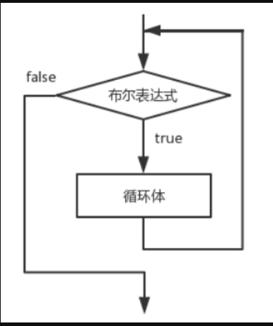

# JAVA基础知识 \- 流程控制

[[toc]]

> 说在前面的话，本文为个人学习[B站免费的马士兵java初级教程](https://www.bilibili.com/video/BV1RK4y1g7A5/?spm_id_from=333.337.search-card.all.click&vd_source=65c7f6924d2d8ba5fa0d4c448818e08a)后进行总结的文章，本文主要用于<b>JAVA基础知识</b>。

## 【1】概念和引入

### 1.1 流程控制语句

> ::: info 什么是流程控制语句?
>
> **流程控制语句** 是用来控制程序中各语句执行顺序的语句，可以把语句组合成能完成一定功能的小逻辑模块。
>
> :::

### 1.2 流程控制语句的分类

> **流程控制语句** 分为三类: 
>
> - **顺序**
> - **选择**
> - **循环**

#### 1.2.1 顺序

> **顺序** 结构代表 **"先执行A，再执行B"** 的顺序逻辑


#### 1.2.2 选择

> **选择** 结构 又叫做 **"条件判断"**  结构，也叫做 **分支** 结构， 代表 **"如果.......就........"** 的选择逻辑


#### 1.2.3 循环

> **循环** 结构，代表**"如果...., 则再继续....."** 的遍历的逻辑。

 

### 1.3 流程控制语句简单总结

> ::: important 小结
>
> 三种流程控制语句就能表示所有的事情！不信，你可以试试拆分你遇到的各种事情。这三种基本逻辑结构是相互支撑的，它们共同构成了算法的基本结构，无论怎样复杂的逻辑结构，都可以通过它们来表达。所以任何一种高级语言都具备上述两种结构。
>
> ::: 

## 【2】顺序结构

> 所有的代码逻辑，按照自上而下的写法，然后编译、执行都是按照某个类、某个方法的代码执行顺序来执行的。所以顺序结构再代码中是最简单、最自然、最多的语句，也比较简单，就是按照代码编写的先后顺序及逆行执行即可。

## 【3】选择结构

> **选择结构**，又叫**条件判断结构** 、**分支结构**

> 在`JAVA` 中，有2种分支结构:
>
> - `if` 语句
> - `switch` 语句

### 3.1 `if`

#### 3.1.1 `if` 结构分类

> `if`语句分为3类
>
> - 单分支
> - 双分支
> - 多分支

##### 3.1.1.1 单分支

> - 语法结构：
>
>   ```java
>   if(布尔表达式){
>       语句块
>   }
>   ```
>
> - 解析
>
>   -  if语句对布尔表达式进行一次判定，若判定为真，则执行{}中的语句块，否则跳过该语句块。
>
>   ```java
>   if(条件表达式，这个表达式的结果是布尔值：要么是false，要么是true){
>           //如果上面()中的表达式返回结果是true，那么执行{}中代码
>           //如果上面()中的表达式返回结果是false ，那么不执行{}中代码
>           //PS:{}中的代码是否执行，取决于()中表达式的返回结果
>   }
>   ```
>
> - 流程图
>
> 
>
> - 代码示例:
>
> ```java
> public class TestIfSingle {
>     public static void main(String[] args) {
>         //实现一个功能：给出三个数（1-6），对三个数求和计算，根据和的大小来分配不同的奖品
>         //1.给出三个数：
>         int num1 = 6;
>         int num2 = 2;
>         int num3 = 3;
>         //2.求和
>         int sum = 0;
>         sum += num1;
>         sum += num2;
>         sum += num3;
>         System.out.println("和为：" + sum);
> 
>         //3.根据和判断奖品：
>         //如果和大于等于14，那么就是一等奖
>         if (sum >= 14) {
>             System.out.println("一等奖");
>             System.out.println("恭喜你很幸运，中了一等奖");
>         }
> 
>         if (sum >= 10 && sum < 14) {
>             System.out.println("二等奖");
>         }
> 
>         if (sum >= 6 && sum < 10) {
>             System.out.println("三等奖");
>         }
> 
>         if (sum < 6) {
>             System.out.println("四等奖");
>         }
> 
>         /*
>         if-单分支：
>         （1）结构：
>                 if(条件表达式，这个表达式的结果是布尔值：要么是false，要么是true){
>                         //如果上面()中的表达式返回结果是true，那么执行{}中代码
>                         //如果上面()中的表达式返回结果是false ，那么不执行{}中代码
>                         //PS:{}中的代码是否执行，取决于()中表达式的返回结果
>                 }
>         （2）上面的代码中，我用四个单分支拼凑出四个选择，每个选择是独立的，依次判断执行的
>         （3）if后面的()中的条件，要按照自己需求尽量完善
>         （4）{}可以省略不写,但是一旦省略，这个if就只负责后面的一句话，所以我们不建议初学者省略
>         */
>     }
> }
> ```

> 编译，运行如下:
>
> `javac -encoding utf-8 TestIfSingle.java` 得到 `.class`文件
>
> `java TestIfSingle`
>
> 
>
> 

##### 3.1.1.2 双分支

> - 语法结构
>
> ```java
> if(布尔表达式){
> 语句块1
> }else{
>       语句块2
> }
> ```
>
> - 解析
>
> > 当布尔表达式为真时，执行语句块1，否则，执行语句块2。也就是else部分
>
> - 流程图
>
> 

##### 3.1.1.3 多分支

> - 语法结构
>
> ```java
> if(布尔表达式1) {
>         语句块1;
> } else if(布尔表达式2) {
>         语句块2;
> }……
> else if(布尔表达式n){
>         语句块n;
> } else {
>         语句块n+1;
> }
> ```
>
> - 解析
>
> > 当布尔表达式1为真时，执行语句块1；否则，判断布尔表达式2，当布尔表达式2为真时，执行语句块2；否则，继续判断布尔表达式3······；如果1~n个布尔表达式均判定为假时，则执行语句块n+1，也就是else部分
>
> - 流程图
>
> 
>
> - 例子
>
> ```java
> public class TestIfMore {
>     public static void main(String[] args) {
>         //实现一个功能：给出三个数（1-6），对三个数求和计算，根据和的大小来分配不同的奖品
>         //1.给出三个数：
>         int num1 = 6;
>         int num2 = 4;
>         int num3 = 2;
>         //2.求和
>         int sum = 0;
>         sum += num1;
>         sum += num2;
>         sum += num3;
>         System.out.println("和为：" + sum);
> 
>         //3.根据和判断奖品：
>         /*
>         利用一个多分支
>         【1】结构：
>         if(){
> 
>         }else if(){
> 
>         }else if(){
> 
>         }...
>         else{
> 
>         }
>         【2】else:隐藏了一个条件，跟上面分支条件表达式相反的功能 (详见数轴分析)
>         【3】多分支：好处：只要满足一个 分支以后，后面的分支就不需要判断了 --》效率高
>         【4】我们写代码的时候，尽量保证else的存在--》else分支相当于“兜底”“备胎”的作用，别的分支都不走，就会走这个分支了
>         */
>         if (sum >= 14) {
>             System.out.println("一等奖");
>         } else if (sum >= 10) {//隐藏了sum<14
>             System.out.println("二等奖");
>         } else if (sum >= 6) {//隐藏了sum<10
>             System.out.println("三等奖");
>         } else {//隐藏了sum<6
>             System.out.println("四等奖");
>         }
>     }
> }
> ```
>
> > 编译运行如下：
> >
> > `javac -encoding utf-8 TestIfMore.java`
> >
> > `java TestIfMore`
> >
> > 
> >
> > 
> >
> > 

#### 3.1.2 `if`的分支结构嵌套

##### 3.1.2.1 练习题1

> 会员购物时，不同积分享受的折扣不同，规则如下：
>
> 
>
> 计算会员购物时获得的折扣，效果如下：
>
> 

```java
import java.util.Scanner;

public class TestIfLianxi01 {
    public static void main(String[] args) {
        //1.给出积分：
        Scanner sc = new Scanner(System.in);
        System.out.print("请输入会员积分：");

        //先判断键盘录入的数据是不是int类型的
        if (sc.hasNextInt() == true) {//是int类型数据：
            //将这个int类型的数据接收：
            int score = sc.nextInt();
            //判断这个积分是否是正数：
            if (score >= 0) {
                String discount = "";
                //2.根据积分判断折扣：
                if (score >= 8000) {
                    discount = "0.6";
                } else if (score >= 4000) {
                    discount = "0.7";
                } else if (score >= 2000) {
                    discount = "0.8";
                } else {
                    discount = "0.9";
                }
                System.out.println("该会员享受的折扣为：" + discount);

            } else {//score<0
                System.out.println("对不起，你录入的积分是负数！不符合需求！");
            }
        } else {//不是int类型的数据
            System.out.println("你录入的积分不是整数！");
        }
    }
}
```

> 编译 运行，然后输入会员积分 6590
>
> `javac -encoding utf-8 TestIfLianxi01.java`
>
> `java TestLianxi01`
>
> 
>
> 

##### 3.1.2.2 练习题2

> 小朋友搬桌子：
> 年龄大于7岁，可以搬桌子；
> 如果年龄大于5岁，性别是男，可以搬桌子；
> 否则不可以搬动桌子，提示：你还太小了

- 性别用 0 和 1 代替输入

```java
import java.util.Scanner;

public class TestIfLianxi02_1 {
    public static void main(String[] args) {
        //1.录入小朋友的年龄：
        Scanner sc = new Scanner(System.in);
        System.out.println("请录入小朋友的年龄：");
        int age = sc.nextInt();

        //2.根据年龄判断：
        if (age >= 7) {
            System.out.println("yes");
        } else if (age >= 5) {
            //录入小朋友的性别；
            System.out.println("请录入小朋友的性别：男：1  女 ：0");
            int sex = sc.nextInt();
            if (sex == 1) {//男生
                System.out.println("yes");
            } else {//女孩
                System.out.println("no");
            }
        } else {//age<5
            System.out.println("no");
        }
    }
}
```

> 编译+运行后:
>
> `javac -encoding utf-8 TestIfLianxi02_1.java`
>
> `java TestIfLianxi02_1`
>
> 输入 5,1
>
> 
>
> 

- 性别用 "男" 和 "女" 来输入

```java
import java.util.Scanner;

public class TestIfLianxi02_2 {
    public static void main(String[] args) {
        //1.录入小朋友的年龄：
        Scanner sc = new Scanner(System.in);
        System.out.println("请录入小朋友的年龄：");
        int age = sc.nextInt();

        //2.根据年龄判断：
        if (age >= 7) {
            System.out.println("yes");
        } else if (age >= 5) {
            //录入小朋友的性别；
            System.out.println("请录入小朋友的性别：");
            String str = sc.next();
            char sex = str.charAt(0);
            if (sex == '男') {
                System.out.println("yes");
            } else {
                System.out.println("no");
            }
        } else {//age<5
            System.out.println("no");
        }
    }
}
```

> 编译+运行后:
>
> `javac -encoding utf-8 TestIfLianxi02_2.java`
>
> `java TestIfLianxi02_2`
>
> 输入5，男
>
> 
>
> 

### 3.2 `switch`

#### 3.2.1 `switch`的语法结构

> `switch`语句本身就包含了单、双、多分支的情形，其语句结构如下:
>
> ```java
> switch (表达式) {
>     case 值1:
>          语句序列1;
>          [break];
>     case 值2:
>          语句序列2;
>          [break];
>         … … …      … …
>     [default:默认语句;]
> }
> ```
>
> ::: important  描述
>
> `switch`语句会根据表达式的值从相匹配的`case`标签处开始执行，一直执行到break语句处或者是`switch`语句的末尾。如果表达式的值与任一case值不匹配，则进入`default`语句（如果存在`default`语句的情况）。根据表达式值的不同可以执行许多不同的操作。`switch`语句中`case`标签在`JDK1.5`之前必须是整数（long类型除外）或者枚举，不能是字符串，在`JDK1.7`之后允许使用字符串(String)。大家要注意，当布尔表达式是等值判断的情况，可以使用`if-else if-else`多分支结构或者`switch`结构，如果布尔表达式区间判断的情况，则只能使用`if-else if-else`多分支结构
>
> :::

#### 3.2.2 `switch`的使用

> switch多分支结构的流程图如图所示：
>
> 

> 下面我们做个最简单的例子。根据给出的学生的分数，判断学生的等级。

```java
package process_control;

public class TestSwitch {
    public static void main(String[] args) {
        /*
        实现一个功能：
        根据给出的学生分数，判断学生的等级：
        >=90  -----A
        >=80  -----B
        >=70  -----C
        >=60  -----D
        <60   -----E

        用if分支：
        if(score>=90){

        }else if(score>=80){

        }
        */

        //1.给出学生的成绩：
        int score = 167;
        //2.根据成绩判断学生的等级：
        switch (score / 10) {
            case 10:
            case 9:
                System.out.println("A级");
                break;
            case 8:
                System.out.println("B级");
                break;
            case 7:
                System.out.println("C级");
                break;
            case 6:
                System.out.println("D级");
                break;
            default:
                System.out.println("成绩错误");
                break;
            case 5:
            case 4:
            case 3:
            case 2:
            case 1:
            case 0:
                System.out.println("E级");
                break;

        }
        /*
        【1】语法结构：
        switch(){
                case * :
                case * :
                .......
        }
        【2】switch后面是一个()，()中表达式返回的结果是一个等值，这个等值的类型可以为：
        int,byte,short,char,String,枚举类型
        【3】这个()中的等值会依次跟case后面的值进行比较，如果匹配成功，就执行:后面的代码
        【4】为了防止代码的“穿透”效果：在每个分支后面加上一个关键词break，遇到break这个分支就结束了
        【5】类似else的“兜底”“备胎”的分支：default分支
        【6】default分支可以写在任意的位置上，但是如果没有在最后一行，后面必须加上break关键字，
        如果在最后一行的话，break可以省略
        【7】相邻分支逻辑是一样的，那么就可以只保留最后一个分支，上面的都可以省去不写了
        【8】switch分支和if分支区别：
        表达式是等值判断的话--> if ，switch都可以
        如果表达式是区间判断的情况---> if最好
        【9】switch应用场合：就是等值判断，等值的情况比较少的情况下
        */
    }
}
```

> 使用命令行: `javac -encoding utf-8 TestSwitch.java` 进行编译后， 然后使用`java TestSwithc` 运行下：
>
> 
>
> 编译后的代码如下:
>
> 

#### 3.2.3 JDK9之后的`switch`

##### 3.2.3.1 语法结构变化

> ::: warning `JDK9 `之后的 `switch`语句
>
> 在`JDK 9`之后（特别是`JDK 12、13、14、17`中逐步完善），`switch`语法经历了‌**重大改进**‌，主要目的是简化代码、减少错误，并支持作为表达式使用将`switch`从‌**语句**‌升级为‌**表达式**‌，可直接返回值。语法结构如下：
>
> ```java
> int numLetters = switch (day) {
>     case MONDAY, FRIDAY, SUNDAY -> 6;    // 多标签逗号分隔
>     case TUESDAY                -> 7;
>     default                     -> -1;   // 不再需要break
> };
> ```
>
> **语法**‌：使用箭头`->`代替冒号`:`，无需`break`。
>
> - **避免穿透(Fall-through)**  ：使用`->`后，执行完当前分支自动跳出，无需`break`。
>
> - **支持代码块**‌：右侧可以是单行表达式或`{}`代码块。
>
> ```java
> int numLetters = switch (day) {
>     case MONDAY, FRIDAY, SUNDAY -> {
>         System.out.println("Even"); // 多行代码
>         yield 6; // 使用yield返回值
>     }
>     case TUESDAY -> 7;
>     default      -> -1;
> };
> ```
>
> :::

##### 3.2.3.2 `yield` 关键字

- ‌**作用**‌：在`switch`代码块中返回值（替代`return`）。

- ‌使用场景：当分支需要多行逻辑时，用`yield`显式返回结果。

  ```java
  int result = switch (mode) {
      case "A" -> 1;
      case "B" -> {
          int temp = compute();
          yield temp * 2; // 通过yield返回
      }
      default  -> 0;
  };
  ```

##### 3.2.3.3 ‌**多常量匹配**‌

- ‌简化语法：同一分支支持多个常量，用逗号分隔。

  ```java
  switch (digit) {
      case 0, 1, 2 -> System.out.println("Low");
      case 3, 4, 5 -> System.out.println("Medium");
      default      -> System.out.println("High");
  }
  ```

##### 3.2.3.4 ‌模式匹配（预览特性，JDK 17+）

- ‌**类型匹配**‌：直接检查类型并绑定变量。

  ```java
  Object obj = "Hello";
  String result = switch (obj) {
      case Integer i -> "Integer: " + i;
      case String s  -> "String: " + s; // s自动绑定为String
      default        -> "Unknown";
  };
  ```

- ‌**null值处理** : 可显式处理`null`分支（JDK 17预览，JDK 19正式）：

  ```java
  switch (str) {
      case null     -> System.out.println("Null!");
      case "Hello"  -> System.out.println("Hi");
      default       -> System.out.println("Bye");
  }
  ```

##### 3.2.3.5 ‌作用域隔离

- 每个分支的变量作用域独立，避免命名冲突：

  ```java
  switch (x) {
      case "a" -> {
          String s = "A"; // 仅在此分支有效
          System.out.println(s);
      }
      case "b" -> {
          String s = "B"; // 与前一个s互不影响
          System.out.println(s);
      }
  }
  ```

##### 3.2.3.5 ‌兼容性规则

- ‌**必须穷举**‌：作为表达式时，需覆盖所有可能值（或提供`default`）。
- ‌**类型兼容**‌：所有分支返回值类型需一致。

#### 3.2.4 总结 JDK 9+ 的 `switch` 优势

| 特性           | 传统`switch`           | JDK 9+ `switch`         |
| -------------- | ---------------------- | ----------------------- |
| ‌**返回值**‌     | 不能直接返回值         | 可作为表达式返回值      |
| ‌**穿透**‌       | 需手动`break`          | 箭头语法自动跳出        |
| ‌**多分支合并**‌ | 需堆叠`case`           | 逗号分隔（`case A, B`） |
| ‌**代码简洁性**‌ | 冗长                   | 简洁，减少模板代码      |
| ‌**作用域**‌     | 整个`switch`共享作用域 | 分支隔离作用域          |

## 【4】循环结构

### 4.1 `while`循环

#### 4.1.1 语法结构

```java
while (布尔表达式) {
    循环体;
}
```

#### 4.1.2 解析

> 在循环刚开始时，会计算一次“布尔表达式”的值，若条件为真，执行循环体。而对于后来每一次额外的循环，都会在开始前重新计算一次。
> 语句中应有使循环趋向于结束的语句，否则会出现无限循环–––"死"循环。

#### 4.1.3 流程图

> while循环结构流程图如图所示:
>
> 

#### 4.1.4 示例

> 练习：1+2+3+4+5
>
> ```java
> public class TestWhile {
>     public static void main(String[] args) {
>         //功能：1+2+3+4+5
>         //1.定义变量：
>         int num = 1;//[1]条件初始化
>         //2.定义一个求和变量，用来接收和：
>         int sum = 0;
>         while (num <= 5) {//[2]条件判断
>             sum += num;//[3]循环体
>             num++;//[4]迭代
>         }
>         //3.输出和
>         System.out.println(sum);
>     }
> }
> 
> ```
>
> 编译 运行:
>
> `javac -encoding utf-8 TestWhile.java`
>
> `java TestWhile`
>
> 

#### 4.1.5 总结

1. 循环作用：将部分代码重复执行。

   1. 循环只是提高了程序员编写代码的效率，但是底层执行的时候依然是重复执行。

2. 循环四要素

   1. 条件初始化

   2. 条件判断

   3. 循环体

   4. 迭代

      

3. 循环的执行过程

   

#### 4.1.6 死循环

```java
while(true) {};
```

### 4.2 `do...while`循环

#### 4.2.1 语法结构

```java
do {
    循环体;
} while(布尔表达式) ;
```

#### 4.2.2 解析

> do-while循环结构会先执行循环体，然后再判断布尔表达式的值，若条件为真，执行循环体，当条件为假时结束循环。do-while循环的循环体至少执行一次。

#### 4.2.3 流程图

> do-while循环结构流程图如图所示：


#### 4.2.4 示例

```java
public class TestDoWhile {
    public static void main(String[] args) {
        //1+2+3+4+...100
        //while方式:
            /*
            int i = 101;
            int sum = 0;
            while(i<=100){
                    sum += i;
                    i++;
            }
            System.out.println(i);//101
            System.out.println(sum);//0
            */
        //do-while方式：
        int i = 101;
        int sum = 0;
        do {
            sum += i;
            i++;
        } while (i <= 100);//一定要注意写这个分号，否则编译出错
        System.out.println(i);//102
        System.out.println(sum);//101
        /*
        【1】while和do-while的区别:
                while:先判断，再执行
                do-while:先执行，再判断---》至少被执行一次，从第二次开始才进行判断
        【2】什么场合使用do-while:

        while(考试是否通过){
                考试；
        }
        ---》不合适
        do{
                考试；
        }while(考试是否通过);
        ---》合适
        */
    }
}
```

#### 4.2.5 `while` 和 `do...while` 的区别

> `while` : 先判断，再执行
>  `do-while`: 先执行，再判断--->至少被执行一次，从第二次开始才进行判断

#### 4.2.6 死循环

```java
        do{

        }while(true);
```

### 4.3 `for`循环

#### 4.3.1 语法结构

```java
for (初始表达式; 布尔表达式; 迭代因子) {
          循环体;
}
```

#### 4.3.2 解析

> `for`循环语句是支持迭代的一种通用结构，是最有效、最灵活的循环结构。
>
> - `for`循环在第一次反复之前要进行初始化，即执行初始表达式；
> - 随后，对布尔表达式进行判定，若判定结果为`true`，则执行循环体，否则，终止循环；
> - 最后在每一次反复的时候，进行某种形式的“步进”，即执行迭代因子。

> 1. 初始化部分设置循环变量的初值
> 2. 条件判断部分为任意布尔表达式
> 3. 迭代因子控制循环变量的增减

#### 4.3.3 流程图

> for循环在执行条件判定后，先执行的循环体部分，再执行步进。
> for循环结构的流程图如图所示：
>
> 

#### 4.3.4 示例

```java
public class TestFor {
    public static void main(String[] args) {
        //1+2+3+..+100
        //while:
                /*int i = 1;
                int sum = 0;
                while(i<=100){
                        sum += i;
                        i++;
                }
                System.out.println(sum);
                */

        //for:
        int sum = 0;
        int i;
        for (i = 1; i <= 100; i++) {
            sum += i;
        }
        System.out.println(sum);
        System.out.println(i);

        /*
        【1】for的结构：
        for(条件初始化;条件判断;迭代){
                循环体；
        }

        【2】i的作用域：作用范围：离变量最近{}  --->可以自己去控制
        【3】for循环格式特别灵活：格式虽然很灵活，但是我们自己写代码的时候不建议灵活着写。
        for(;;){}  -->死循环

        int i = 1;
        for(;i<=100;){
                sum += i;
                i++;
        }

        【4】死循环：
        for(;;){}

        while(true){}

        do{

        }while(true);

        【5】循环分为两大类：
        第一类：当型   while(){}   for(;;){}
        第二类：直到型  do{}while();

        【6】以后常用：for循环
        【7】do-while,while,for循环谁的效率高？  一样高
        */
    }
}
```

> 编译，运行下：
>
> 
>
> 

#### 4.3.5 死循环

```java
for(;;){}
```

### 4.4 循环结构中的关键字

> 在任何循环语句的主体部分，均可用<font style="color: orange">break</font>控制循环的流程。<font style="color: orange">break</font>用于强行退出循环，不执行循环中剩余的语句。
> <font style="color: orange">continue</font> 语句用在循环语句体中，用于终止某次循环过程，即跳过循环体中尚未执行的语句，接着进行下一次是否执行循环的判定。
> <font style="color: orange">return</font>的作用,结束当前所在方法的执行.

#### 4.4.1 `break`

> `break` ： 用于<font style="color: red;">强行退出当前循环，不执行当前循环中的剩余的语句</font>。
>
> - 退出的是当前的循环
> - 停止的是最近的循环

> 例子如下:

```java
//功能：求1-100的和，当和第一次超过300的时候，停止程序
int sum = 0;
for(int i=1;i<=100;i++){	
        sum += i;	
        if(sum>300){//当和第一次超过300的时候
                //停止循环 --> 对应就是for循环
                break;//停止循环
        }
        System.out.println(sum);
}
```

> 加深理解，再看下如下例子:

```java
//break的作用：停止最近的循环
/*
for(int i=1;i<=100;i++){
        System.out.println(i);
        if(i==36){
                break;//1-36   // 这个退出的是当前for循环
        }
}
*/
for(int i=1;i<=100;i++){
        System.out.println(i);
        while(i==36){
                break; //1-100  ---》break停止的是while循环，而不是外面的for循环
        }
}
```

#### 4.4.2 `break` + 标签

>  `break` 可以带标签，然后去定义循环结束的地方

```java
outer:     ----》定义标签结束的位置
for(int i=1;i<=100;i++){
        System.out.println(i);
        while(i==36){
                break outer;    ----》根据标签来结束循环 
        }
}
```

> 多层循环也可以使用标签，按照自己的需求去设定即可：
>
> 

#### 4.4.3 `continue`

> `continue` ： 用于<font style="color: red;">结束本次的循环，继续下一次循环</font>
>
> - 结束当前当次循环，后面语句不执行了
> - 下次以及剩下的很多次的循环还是要执行的

> 例子：

```java
//功能：输出1-100中被6整除的数：
//方式1：
/*
for(int i=1;i<=100;i++){	
        if(i%6==0){//被6整除
                System.out.println(i);
        }
}
*/

//方式2：
for(int i=1;i<=100;i++){	
        if(i%6!=0){//不被6整除
                continue;//停止本次循环，继续下一次循环
        }
        System.out.println(i);
}
```

> 加深理解：

```java
//continue:结束本次离它近的循环，继续下一次循环
/*
for(int i=1;i<=100;i++){	
        if(i==36){
                continue;//1-100中间没有36
        }
        System.out.println(i);
}
*/

for(int i=1;i<=100;i++){	
        while(i==36){
                System.out.println("------");
                continue; //1-35+死循环
        }
        System.out.println(i);
}
```

>  `continue` + 标签就不多做赘述了，和`break` + 标签是一样的。

#### 4.4.4 `return `

> `return`的作用：跟循环无关，就是程序中遇到`return`那么`return`所在的那个方法就停止执行了.
>
> 例子：

```java
//return:遇到return结束当前正在执行的方法
for(int i=1;i<=100;i++){	
        while(i==36){ 
                return;  
        }
        System.out.println(i);
}

System.out.println("-----");
```

### 4.5 循环嵌套

> <font style="color:">循环嵌套</font> : 就是多种循环的写法在各自的循环体中添加循环结构，这样互相叠加而成，叫做`循环嵌套`

#### 4.5.1 双重循环基础练习 - 99乘法表

> 比如，我们从小学的乘法口诀表。如下：
>
> 1*1=1
> 1*2=2   2*2=4
> 1*3=3   2*3=6   3*3=9
> 1*4=4   2*4=8   3*4=12  4*4=16
> 1*5=5   2*5=10  3*5=15  4*5=20  5*5=25
> 1*6=6   2*6=12  3*6=18  4*6=24  5*6=30  6*6=36
> 1*7=7   2*7=14  3*7=21  4*7=28  5*7=35  6*7=42  7*7=49
> 1*8=8   2*8=16  3*8=24  4*8=32  5*8=40  6*8=48  7*8=56  8*8=64
> 1*9=9   2*9=18  3*9=27  4*9=36  5*9=45  6*9=54  7*9=63  8*9=72  9*9=81
>
> 这样，让代码将这样的样式弄出来

```java
public class TestMultiplication {
    public static void main(String[] args) {
        //1*6=6   2*6=12  3*6=18  4*6=24  5*6=30  6*6=36
        /*
        System.out.print("1*6=6"+"\t");
        System.out.print("2*6=12"+"\t");
        System.out.print("3*6=18"+"\t");
        System.out.print("4*6=24"+"\t");
        System.out.print("5*6=30"+"\t");
        System.out.print("6*6=36"+"\t");

        for(int i=1;i<=6;i++){
                System.out.print(i+"*6="+i*6+"\t");
        }
        //换行
        System.out.println();

        //1*7=7   2*7=14  3*7=21  4*7=28  5*7=35  6*7=42  7*7=49
        for(int i=1;i<=7;i++){
                System.out.print(i+"*7="+i*7+"\t");
        }
        //换行
        System.out.println();

        //1*8=8   2*8=16  3*8=24  4*8=32  5*8=40  6*8=48  7*8=56  8*8=64
        for(int i=1;i<=8;i++){
                System.out.print(i+"*8="+i*8+"\t");
        }
        //换行
        System.out.println();
        */

        for (int j = 1; j <= 9; j++) {
            for (int i = 1; i <= j; i++) {
                System.out.print(i + "*" + j + "=" + i * j + "\t");
            }
            //换行
            System.out.println();
        }
    }
}
```

> 编译运行下:
>
> 

#### 4.5.2 双重循环嵌套进阶练习 - 打印各种平面图形

##### 4.5.2.1 长方形

```java
public class TestRectangle {
    public static void main(String[] args) {
        // 打印1个 长9个*  宽度为4行 的 长方形
        for (int j = 1; j <= 4; j++) {//j:控制行数
            //*********
            for (int i = 1; i <= 9; i++) {//i:控制*的个数
                System.out.print("*");
            }
            //换行:
            System.out.println();
        }
    }
}
```

> 编译运行后如下:
>
> 

> 若要正方形，则将行数 和  `*` 数量保持一致即可。

##### 4.5.2.2 平行四边形

```java
public class TestParallelogram {
    public static void main(String[] args) {
        for (int j = 1; j <= 4; j++) {//j:控制行数
            //加入空格：
            for (int i = 1; i <= (9 - j); i++) {//i:控制空格的个数
                System.out.print(" ");
            }
            //*********
            for (int i = 1; i <= 9; i++) {//i:控制*的个数
                System.out.print("*");
            }
            //换行：
            System.out.println();
        }
    }
}
```

> 平行四边形的精髓则 前空格 后空格 递进
>
> 编译运行下如下：
>
> 

##### 4.5.2.3 三角形

```java
public class TestTriangle {
    public static void main(String[] args) {
        // 三角形
        for (int j = 1; j <= 4; j++) {//j:控制行数
            //加入空格：
            for (int i = 1; i <= (9 - j); i++) {//i:控制空格的个数
                System.out.print(" ");
            }
            //*********
            for (int i = 1; i <= (2 * j - 1); i++) {//i:控制*的个数
                System.out.print("*");
            }
            //换行：
            System.out.println();
        }
    }
}
```

> 编译运行下如下：
>
> 

##### 4.5.2.4 菱形

```java
public class TestLozenge {
    public static void main(String[] args) {
        //上面三角形：
        for (int j = 1; j <= 4; j++) {//j:控制行数
            //加入空格：
            for (int i = 1; i <= (9 - j); i++) {//i:控制空格的个数
                System.out.print(" ");
            }
            //*********
            for (int i = 1; i <= (2 * j - 1); i++) {//i:控制*的个数
                System.out.print("*");
            }
            //换行：
            System.out.println();
        }

        //下面三角形：
        for (int j = 1; j <= 3; j++) {//j:控制行数
            //加入空格：
            for (int i = 1; i <= (j + 5); i++) {//i:控制空格的个数
                System.out.print(" ");
            }
            //*********
            for (int i = 1; i <= (7 - 2 * j); i++) {//i:控制*的个数
                System.out.print("*");
            }
            //换行：
            System.out.println();
        }
    }
}
```

> 编译运行下如下：
>
> 

##### 4.5.2.5 空心菱形

```java
public class TestHallowLozenge {
    public static void main(String[] args) {
        //上面三角形：
        for (int j = 1; j <= 4; j++) {//j:控制行数
            //加入空格：
            for (int i = 1; i <= (9 - j); i++) {//i:控制空格的个数
                System.out.print(" ");
            }
            //*********
            for (int i = 1; i <= (2 * j - 1); i++) {//i:控制*的个数
                if (i == 1 || i == (2 * j - 1)) {
                    System.out.print("*");
                } else {
                    System.out.print(" ");
                }
            }
            //换行：
            System.out.println();
        }

        //下面三角形：
        for (int j = 1; j <= 3; j++) {//j:控制行数
            //加入空格：
            for (int i = 1; i <= (j + 5); i++) {//i:控制空格的个数
                System.out.print(" ");
            }
            //*********
            for (int i = 1; i <= (7 - 2 * j); i++) {//i:控制*的个数
                if (i == 1 || i == (7 - 2 * j)) {
                    System.out.print("*");
                } else {
                    System.out.print(" ");
                }
            }
            //换行：
            System.out.println();
        }
    }
}
```

> 编译后运行如下:
>
> 

#### 4.5.3 三重循环

> 【1】二重循环可以帮我们解决：二元一次方程组的问题：

```java
for(int a=1;a<=5;a++){
    for(int b=3;b<=6;b++){
        if(a+b==7){
                System.out.println(a+"----"+b);
        }
    }
}
```

> 【2】三重循环可以帮我们解决：三元一次方程组的问题：
>
> 例子:    **百钱买百鸡**：
> 公鸡5文钱一只，母鸡3文钱一只，小鸡3只一文钱，
> 用100文钱买一百只鸡,其中公鸡，母鸡，小鸡都必须要有，问公鸡，母鸡，小鸡要买多少只刚好凑足100文钱。

```java
public class TestForThree {
    public static void main(String[] args) {
        /*
        百钱买百鸡：
        公鸡5文钱一只，母鸡3文钱一只，小鸡3只一文钱，
        用100文钱买一百只鸡,其中公鸡，母鸡，小鸡都必须要有，问公鸡，母鸡，小鸡要买多少只刚好凑足100文钱。
        数学：
        设未知数：
        公鸡：x只
        母鸡：y只
        小鸡：z只
        x+y+z=100只
        5x+3y+z/3=100钱
        麻烦方式：
        for(int x=1;x<=100;x++){
                for(int y=1;y<=100;y++){
                        for(int z=1;z<=100;z++){
                                if((x+y+z==100)&&(5*x+3*y+z/3==100)&&(z%3==0)){
                                        System.out.println(x+"\t"+y+"\t"+z);
                                }
                        }
                }
        }
        */
        //优化：
        for (int x = 1; x <= 19; x++) {
            for (int y = 1; y <= 31; y++) {
                int z = 100 - x - y;
                if ((5 * x + 3 * y + z / 3 == 100) && (z % 3 == 0)) {
                    System.out.println(x + "\t" + y + "\t" + z);
                }
            }
        }
    }
}
```

> 编译运行下:
>
> 

## 【5】参考资料

- [B站免费的马士兵java初级教程](https://www.bilibili.com/video/BV1RK4y1g7A5/?spm_id_from=333.337.search-card.all.click&vd_source=65c7f6924d2d8ba5fa0d4c448818e08a)