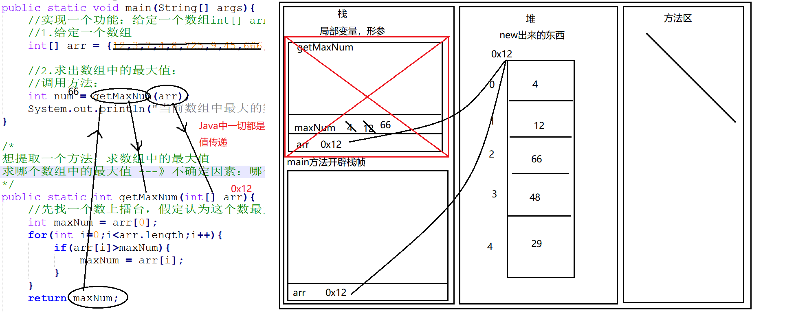

# JAVA基础知识 \- 数组

[[toc]]

> 说在前面的话，本文为个人学习[B站免费的马士兵java初级教程](https://www.bilibili.com/video/BV1RK4y1g7A5/?spm_id_from=333.337.search-card.all.click&vd_source=65c7f6924d2d8ba5fa0d4c448818e08a)后进行总结的文章，本文主要用于<b>JAVA基础知识</b>。

## 【1】数组的引入

> 首先，我们通过1段代码的测试和调用，来慢慢引入<b>数组</b>

```java
public class ArraysImport {
    public static void main(String[] args) {
        //功能：键盘录入十个学生的成绩，求和，求平均数：
        //定义一个求和的变量：
        int sum = 0;
        Scanner sc = new Scanner(System.in);
        for (int i = 1; i <= 10; i++) {//i:控制循环次数
            System.out.print("请录入第" + i + "个学生的成绩：");
            int score = sc.nextInt();
            sum += score;
        }

        System.out.println("十个学生的成绩之和为：" + sum);
        System.out.println("十个学生的成绩平均数为：" + sum / 10);

    }
}
```

> 编译，运行：
>
> `javac -encoding utf-8 .\ArraysImport.java`
>
> `java ArraysImport`
>
> 请录入第1个学生的成绩：96
> 请录入第2个学生的成绩：98
> 请录入第3个学生的成绩：86
> 请录入第4个学生的成绩：84
> 请录入第5个学生的成绩：75
> 请录入第6个学生的成绩：100
> 请录入第7个学生的成绩：95
> 请录入第8个学生的成绩：85
> 请录入第9个学生的成绩：86
> 请录入第10个学生的成绩：84
> 十个学生的成绩之和为：889
> 十个学生的成绩平均数为：88

> ::: warning 这段代码的缺点
>
> 不能得到每个学生的成绩打印，因为没有存储每个人的成绩。
>
> :::
>
> ::: important 解决方案
>
> 将成绩都存储起来---->  引入 <b>数组</b>
>
> :::
>
> 这里，我们感受到<b>数组</b>的作用:
>
> <b>数组</b>用来存储数据的，在程序设计中，为了处理方便，<b>数组</b>用来将相同类型的若干数据组织起来。这个若干数据的集合我们称之为<b>数组</b>。

## 【2】数组的定义

> ::: info 什么是<b>数组</b>?
>
> <b>数组</b>是相同类型数据的有序集合。
>
> <b>数组</b>描述的是相同类型的若干个数据，按照一定的先后次序排列组合而成。其中，每一个数据称作一个元素，每个元素可以通过一个索引（下标）来访问它们。
>
> :::

## 【3】数组的基本特点

> <b>数组</b> 有如下特点：
>
> - <b>数组的长度是固定的。</b> 数组一旦被创建了，他的大小就是不可以改变的，一般都会先定义好数组的长度。
> - <b>数组中的元素必须是相同类型的，不允许出现混合类型</b>
> - <b>数组</b>是由<b>索引</b>的，且<b>索引</b>是从0开始的，到数组的长度-1结束。
> - <b>数组</b>变量属于<b>引用类型</b>，是一个对象，不是<b>基本数据类型之一</b>
> - <b>数组中的元素的类型</b>固定之前可以是任何数据类型，包括<b>引用类型</b>和<b>基本数据类型</b>
>
> ::: warning 注意事项
>
> - <b>数组</b>变量属于引用类型
> - <b>数组</b>是对象
> - <b>数组</b>中的每个元素相当于该对象的成员变量。
> - <b>数组</b>本身就是对象，Java中对象是在<b>堆</b>中的，因此<b>数组</b>无论保存原始类型还是其他对象类型，<b>数组</b>对象本身是在堆中存储的。
>
> :::

## 【4】数组的代码学习

### 4.1 数组的声明

> ```java
> // 初始化数组 (定义1个数组)
> 数组类型[] 数组名称;
> ```

### 4.2 数组的创建

> ```java
> // 数组创建
> 数组类型[] 数组名称 = new 数组类型[数组长度];
> ```

### 4.3 数组的赋值

```java
数组名称[数组索引]  = x;
```

### 4.4 代码示例

```java
public class ArrayStudy01 {
    public static void main(String[] args) {
        //数组的作用：用来存储相同类型的数据
        //以int类型数据为案例：数组用来存储int类型数据
        //1.声明(定义数组)
        int[] arr; //定义一个int类型的数组，名字叫arr
        //int arr2[];
        //如果数组只声明，没有后续操作，那么这个数组相当于没定义
        //int[] arr3 = null;//空 辨别：数组赋值为null和什么都没有赋值  不一样的效果

        //2.创建
        arr = new int[4];//给数组开辟了一个长度为4的空间
        //编译期声明和创建会被合为一句话: int[] arr = new int[4];

        //3.赋值
        arr[0] = 12;
        arr[3] = 47;
        arr[2] = 98;
        arr[1] = 56;
        arr[2] = 66;
                /*
                arr[4] = 93;
                出现异常：Exception in thread "main" java.lang.ArrayIndexOutOfBoundsException: 4
                Array 数组
                Index 索引
                OutOf 超出
                Bounds 界限
                Exception 异常
                ---> 数组索引越界异常
                */

        //4.使用
        System.out.println(arr[2]);
        System.out.println(arr[0] + 100);
        //通过数组一个属性来获取  length 长度
        System.out.println("数组的长度是：" + arr.length);
    }
}
```

### 4.5 数组的创建时内存分析


### 4.6 数组的三种初始化

> <b>数组</b>的初始化有以下三种方式：
>
> - 静态初始化
> - 动态初始化
> - 默认初始化

#### 4.6.1 静态初始化

> 除了用`new`关键字来产生<b>数组</b>以外，还可以直接在定义数组的同时就为数组元素分配空间并赋值。
>
> ```java
> int[] arr = {12,23,45};
> int[] arr = new int[]{12,23,45};
> // 注意：
> 1.new int[3]{12,23,45};-->错误
> 2.int[] arr ;
>    arr = {12,23,45};  --->错误
> ```

#### 4.6.2 动态初始化

> <b>数组</b>定义与为数组元素分配空间并赋值的操作分开进行。
>
> ```java
> int[] arr ;
> arr = new int[3]
> arr[0] = 12;
> arr[1] = 23;
> arr[2] = 45;
> ```

#### 4.6.3 默认初始化 

> <b>数组</b>是引用类型，它的元素相当于类的实例变量，因此<b>数组</b>一经分配空间，其中的每个元素也被按照实例变量同样的方式被隐式初始化。
>
> ```java
> int[] arr = new int[3];   ---> 数组有默认的初始化值
> 数组有默认的初始化值。 根据数据类型不同初始化值也不同
> 	byte[] --> 0
>     short[] --> 0
>     int[] --> 0
>     long[] --> 0
>     float[] --> 0.0
>     double[] --> 0.0
>     char[] --> '\u0000'
>     boolean[] --> false
>     引用数据类型[] --> null
> ```

## 【5】数组的应用

### 5.1 最值问题

> <b>Q </b>：实现一个功能：给定一个数组int[] arr = {12,3,7,4,8,125,9,45}; ，求出数组中最大的数。
>
> - 思路
>   - 
>
> <b>A</b>  
>
> ```java
> public class ArrayMax {
>     public static void main(String[] args) {
>         //实现一个功能：给定一个数组int[] arr = {12,3,7,4,8,125,9,45}; ，求出数组中最大的数。
>         //1.给定一个数组
>         int[] arr = {12, 3, 7, 4, 8, 125, 9, 45, 666, 36};
> 
>         //2.求出数组中的最大值：
>         //先找一个数上擂台，假定认为这个数最大：
>         int maxNum = arr[0];
>         for (int i = 0; i < arr.length; i++) {
>             if (arr[i] > maxNum) {
>                 maxNum = arr[i];
>             }
>         }
>         System.out.println("当前数组中最大的数为：" + maxNum);
>     }
> }
> ```
>
> 编译： `javac -encoding utf-8 .\ArrayMax.java`
>
> 运行： `java ArrayMax`
>
> 结果： 当前数组中最大的数为：666

> 将求最大值的方法提取出来：

```java
public class ArrayMax {
    public static void main(String[] args) {
        //实现一个功能：给定一个数组int[] arr = {12,3,7,4,8,125,9,45}; ，求出数组中最大的数。
        //1.给定一个数组
        int[] arr = {12, 3, 7, 4, 8, 725, 9, 45, 666, 36};

        //2.求出数组中的最大值：
        //调用方法：
        int num = getMaxNum(arr);
        System.out.println("当前数组中最大的数为：" + num);
    }

    /*
    想提取一个方法：求数组中的最大值
    求哪个数组中的最大值 ---》不确定因素：哪个数组 (形参)---》返回值：最大值
    */
    public static int getMaxNum(int[] arr) {
        //先找一个数上擂台，假定认为这个数最大：
        int maxNum = arr[0];
        for (int i = 0; i < arr.length; i++) {
            if (arr[i] > maxNum) {
                maxNum = arr[i];
            }
        }
        return maxNum;

    }
}
```

> 编译： `javac -encoding utf-8 .\ArrayMax.java`
>
> 运行： `java ArrayMax`
>
> 结果： 当前数组中最大的数为：666
>
> 内存分析图：
>
> <b>重点</b>： 
>
> - <b>方法的实参传递给形参的时候一定要注意：一切都是值传递：</b>
>   - <b>如果是基本数据类型，那么传递的就是字面值</b>
>   - <b>如果是引用数据类型，那么传递的就是地址值</b>
>
> - 
>   - 2个方法 `main` 和 `getMaxNum`,即创建2个栈帧。
>   - 创建1个数组是会在堆中创建1块内存结构存储数据和地址

### 5.2 查询问题

#### 5.2.1 根据索引查询指定位置的元素

```java
public class ArraysQuery {
    public static void main(String[] args) {
        //查询指定位置的元素
        //给定一个数组：
        int[] arr = {12, 34, 56, 7, 3, 10};
        //查找索引为2的位置上对应的元素是什么？
        System.out.println(arr[2]);
        // 上面代码体现了数组的一个优点：
        //在按照位置查询的时候，直接一步到位，效率非常高
    }
}
```

#### 5.2.2 根据元素查询该元素的索引

```java
public class ArraysQuery {
    public static void main(String[] args) {
        //查询指定元素的位置--》找出元素对应的索引
        //给定一个数组：
        int[] arr1 = {12, 34, 56, 7, 3, 56, 888};
        //             0   1   2  3  4   5   6

        //功能：查询元素888对应的索引：
        int index = -1; //这个初始值只要不是数组的索引即可
        for (int i = 0; i < arr1.length; i++) {
            if (arr1[i] == 888) {
                index = i;//只要找到了元素，那么index就变成为i
                break;//只要找到这个元素，循环就停止
            }
        }
        if (index != -1) {
            System.out.println("元素对应的索引：" + index);
        } else {//index==-1
            System.out.println("查无次数！");
        }
    }
}
```

### 5.3 添加元素问题


> 代码示例：
>
> ```java
> public class ArraysAdd {
>     public static void main(String[] args) {
>         //功能：给定一个数组,在数组下标为2的位置上添加一个元素91
> 
>         //1.给定一个数组：
>         int[] arr = {12, 34, 56, 7, 3, 10, 55, 66, 77, 88, 999, 89};
>         //           0  1   2 3 4 5
>         //2.输出增加元素前的数组：
>         System.out.print("增加元素前的数组：");
>         for (int i = 0; i < arr.length; i++) {
>             if (i != arr.length - 1) {
>                 System.out.print(arr[i] + ",");
>             } else {//i==arr.length-1 最后一个元素不用加,
>                 System.out.print(arr[i]);
>             }
>         }
> 
>         //3.增加元素
>                 /*
>                 arr[5] = arr[4];
>                 arr[4] = arr[3];
>                 arr[3] = arr[2];
>                 */
>         int index = 1;//在这个指定位置添加 元素
>         for (int i = arr.length - 1; i >= (index + 1); i--) {
>             arr[i] = arr[i - 1];
>         }
>         arr[index] = 666;
> 
> 
>         //4.输出增加元素后的数组：
>         System.out.print("\n增加元素后的数组：");
>         for (int i = 0; i < arr.length; i++) {
>             if (i != arr.length - 1) {
>                 System.out.print(arr[i] + ",");
>             } else {//i==arr.length-1 最后一个元素不用加,
>                 System.out.print(arr[i]);
>             }
>         }
>     }
> }
> ```
>
> 编译：`javac -encoding utf-8 .\ArraysAdd.java`
>
> 运行：` java ArraysAdd`
>
> 结果：
>
> 增加元素前的数组：12,34,56,7,3,10,55,66,77,88,999,89
>
> 增加元素后的数组：12,666,34,56,7,3,10,55,66,77,88,999

> 将添加功能提取为1个独立的方法如下:
>
> ```java
> import java.util.Scanner;
> 
> public class ArrayAdd {
>     public static void main(String[] args) {
>         //功能：给定一个数组,在数组下标为2的位置上添加一个元素91
> 
>         //1.给定一个数组：
>         int[] arr = {12, 34, 56, 7, 3, 10, 55, 66, 77, 88, 999, 89};
>         //           0  1   2 3 4 5
>         //2.输出增加元素前的数组：
>         /*
>         System.out.print("增加元素前的数组：");
>         for(int i=0;i<arr.length;i++){
>                 if(i!=arr.length-1){
>                         System.out.print(arr[i]+",");
>                 }else{//i==arr.length-1 最后一个元素不用加,
>                         System.out.print(arr[i]);
>                 }
>         }
>         */
> 
>         //从键盘接收数据：
>         Scanner sc = new Scanner(System.in);
>         System.out.println("请录入你要添加元素的指定下标：");
>         int index = sc.nextInt();
>         System.out.println("请录入你要添加的元素：");
>         int ele = sc.nextInt();
> 
>         //3.增加元素
>         //调用方法：
>         insertEle(arr, index, ele);
> 
> 
>         //4.输出增加元素后的数组：
>         System.out.print("\n增加元素后的数组：");
>         for (int i = 0; i < arr.length; i++) {
>             if (i != arr.length - 1) {
>                 System.out.print(arr[i] + ",");
>             } else {//i==arr.length-1 最后一个元素不用加,
>                 System.out.print(arr[i]);
>             }
>         }
> 
>     }
> 
> 
>     /*
>     提取一个添加元素的方法：
>     在数组的指定位置上添加一个指定的元素。
>     在哪个数组的哪个位置添加哪个元素！
>     不确定因素：形参：哪个数组，哪个位置，哪个元素
>     返回值：无
>     */
>     public static void insertEle(int[] arr, int index, int ele) {
>         for (int i = arr.length - 1; i >= (index + 1); i--) {
>             arr[i] = arr[i - 1];
>         }
>         arr[index] = ele;
>     }
> }
> ```
>
> 编译：`javac -encoding utf-8 .\ArrayAdd.java`
>
> 运行：` java ArrayAdd`
>
> 结果：
>
> 请录入你要添加元素的指定下标：
>
> 0
>
> 请录入你要添加的元素：
>
> 20
>
> 增加元素后的数组：20,12,34,56,7,3,10,55,66,77,88,999

### 5.4 删除元素问题

#### 5.4.1 删除指定位置上的元素


> 代码示例：
>
> ```java
> import java.util.Arrays;
> public class ArrayDel01 {
>     public static void main(String[] args) {
>         //功能：给定一个数组,删除下标为2元素
> 
>         //1.给定一个数组：
>         int[] arr = {12, 34, 56, 7, 3, 10, 34, 45, 56, 7, 666};
>         //           0  1   2 3 4 5
>         //2.输出删除前的数组：
>         System.out.println("删除元素前的数组：" + Arrays.toString(arr));
> 
>         //3.删除
>                 /*
>                 arr[2] = arr[3];
>                 arr[3] = arr[4];
>                 arr[4] = arr[5];
>                 */
>         int index = 0;
>         for (int i = index; i <= arr.length - 2; i++) {
>             arr[i] = arr[i + 1];
>         }
>         arr[arr.length - 1] = 0;
> 
>         //4.输出删除后的数组：
>         System.out.println("删除元素后的数组：" + Arrays.toString(arr));
>     }
> }
> ```
>
> 编译：`javac -encoding utf-8 .\ArrayDel01.java`
>
> 运行:   `java ArrayDel01`
>
> 结果：
>
> 

#### 5.4.2 删除指定元素

> ```java
> import java.util.Arrays;
> 
> public class ArrayDel02 {
>     public static void main(String[] args) {
>         //功能：给定一个数组,删除元素3：
> 
>         //1.给定一个数组：
>         int[] arr = {12, 34, 56, 7, 3, 10, 34, 45, 56, 7, 666};
> 
>         //2.输出删除前的数组：
>         System.out.println("删除元素前的数组：" + Arrays.toString(arr));
> 
> 
>         //找到要删除的元素对应的索引即可：
>         int index = -1;
>         for (int i = 0; i < arr.length; i++) {
>             if (arr[i] == 3) {
>                 index = i;
>                 break;
>             }
>         }
> 
>         //3.删除
> 
>         if (index != -1) {
>             for (int i = index; i <= arr.length - 2; i++) {
>                 arr[i] = arr[i + 1];
>             }
>             arr[arr.length - 1] = 0;
>         } else {//index==-1
>             System.out.println("根本没有你要删除的元素！");
>         }
> 
> 
>         //4.输出删除后的数组：
>         System.out.println("删除元素后的数组：" + Arrays.toString(arr));
> 
>     }
> }
> ```
>
> 编译：` javac -encoding utf-8 .\ArrayDel02.java`
>
> 运行：`java ArrayDel02`
>
> 结果：

## 【6】Arrays 工具类

```java
import java.util.Arrays;

public class ArraysUtil {
    public static void main(String[] args) {
        //给定一个数组：
        int[] arr = {1, 3, 7, 2, 4, 8};
        //toString:对数组进行遍历查看的，返回的是一个字符串，这个字符串比较好看
        System.out.println(Arrays.toString(arr));

        //binarySearch:二分法查找：找出指定数组中的指定元素对应的索引：
        //这个方法的使用前提：一定要查看的是一个有序的数组：
        //sort：排序 -->升序
        Arrays.sort(arr);
        System.out.println(Arrays.toString(arr));
        System.out.println(Arrays.binarySearch(arr, 4));

        int[] arr2 = {1, 3, 7, 2, 4, 8};
        //copyOf:完成数组的复制：
        int[] newArr = Arrays.copyOf(arr2, 4);
        System.out.println(Arrays.toString(newArr));

        //copyOfRange:区间复制：
        int[] newArr2 = Arrays.copyOfRange(arr2, 1, 4);//[1,4)-->1,2,3位置
        System.out.println(Arrays.toString(newArr2));

        //equals:比较两个数组的值是否一样：
        int[] arr3 = {1, 3, 7, 2, 4, 8};
        int[] arr4 = {1, 3, 7, 2, 4, 8};
        System.out.println(Arrays.equals(arr3, arr4));//true
        System.out.println(arr3 == arr4);//false ==比较左右两侧的值是否相等，比较的是左右的地址值，返回结果一定是false

        //fill：数组的填充：
        int[] arr5 = {1, 3, 7, 2, 4, 8};
        Arrays.fill(arr5, 10);
        System.out.println(Arrays.toString(arr5));
    }
}
```

> 编译：`javac -encoding utf-8 .\ArraysUtil.java`
>
> 运行：`java ArraysUtil`
>
> 结果：
>
> 

## 【7】数组的复制

> 数组的复制，我们使用`System`类的 `arraycopy`方法。具体如下：
>
> 
>
> 


> 代码示例如下：
>
> ```java
> import java.util.Arrays;
> 
> public class ArrayCopy {
>     public static void main(String[] args) {
>         //给一个源数组：
>         int[] srcArr = {11, 22, 33, 44, 55, 66, 77, 88};
>         //给一个目标数组：
>         int[] destArr = new int[10];
> 
>         //复制：
>         System.arraycopy(srcArr, 1, destArr, 3, 3);
>         //遍历查看目标数组：
>         System.out.println(Arrays.toString(destArr));
>     }
> }
> ```
>
> 编译：` javac -encoding utf-8 .\ArrayCopy.java `
>
> 运行：`java ArrayCopy`
>
> 结果：

## 【8】二维数组

### 8.1 引入


### 8.2 代码示例

```java
//定义一个二维数组：
int[][] arr = new int[3][];//本质上定义了一个一维数组，长度为3

int[] a1 = {1,2,3};
arr[0] = a1;

arr[1] = new int[]{4,5,6,7};

arr[2] = new int[]{9,10};
```

> 对应内存:


### 8.3 二维数组的遍历

```java
public class ArraySecondLevel {
    public static void main(String[] args) {
        //定义一个二维数组：
        int[][] arr = new int[3][];//本质上定义了一个一维数组，长度为3

        int[] a1 = {1, 2, 3};
        arr[0] = a1;

        arr[1] = new int[]{4, 5, 6, 7};

        arr[2] = new int[]{9, 10};

        //读取6这个元素：
        //System.out.println(arr[1][2]);

        //对二维数组遍历：
        //方式1：外层普通for循环+内层普通for循环：
        for (int i = 0; i < arr.length; i++) {
            for (int j = 0; j < arr[i].length; j++) {
                System.out.print(arr[i][j] + "\t");
            }
            System.out.println();
        }

        //方式2：外层普通for循环+内层增强for循环：
        for (int i = 0; i < arr.length; i++) {
            for (int num : arr[i]) {
                System.out.print(num + "\t");
            }
            System.out.println();
        }

        //方式3：外层增强for循环+内层增强for循环：
        for (int[] a : arr) {
            for (int num : a) {
                System.out.print(num + "\t");
            }
            System.out.println();
        }

        //方式4：外层增强for循环+内层普通for循环：
        for (int[] a : arr) {
            for (int i = 0; i < a.length; i++) {
                System.out.print(a[i] + "\t");
            }
            System.out.println();
        }
    }
}
```

> 编译：`javac -encoding utf-8 .\ArraySecondLevel.java`
>
> 运行：`java ArraySecondLevel`
>
> 结果：

### 8.4 二维数组的初始化

> 数组的初始化方式总共有三种：<b>静态初始化</b>、<b>动态初始化</b>、<b>默认初始化</b>。

- <b>静态初始化</b>

> 除了用`new`关键字来产生数组以外，还可以直接在定义数组的同时就为数组元素分配空间并赋值。
> ```java
> int[][] arr = {{1,2},{4,5,6},{4,5,6,7,8,9,9}};
> int[][] arr =new int[][] {{1,2},{4,5,6},{4,5,6,7,8,9,9}};
> ```

- <b>动态初始化</b>

> 数组定义与为数组元素分配空间并赋值的操作分开进行。
>
> ```java
> public class Array2Init {
>     public static void main(String[] args) {
>         int[][] arr = new int[3][2];
>         //本质上：
>         //定义一维数组，长度为3，每个数组“格子”中，有一个默认的长度为2的数组：
> 
>         arr[1] = new int[]{1, 2, 3, 4};
> 
>         //数组遍历：
>         for (int[] a : arr) {
>             for (int num : a) {
>                 System.out.print(num + "\t");
>             }
>             System.out.println();
>         }
>     }
> }
> ```

- <b>默认初始化</b>

> 数组是引用类型，它的元素相当于类的实例变量，因此数组一经分配空间，其中的每个元素也被按照实例变量同样的方式被隐式初始化。

## 【9】参考资料

- [B站免费的马士兵java初级教程](https://www.bilibili.com/video/BV1RK4y1g7A5/?spm_id_from=333.337.search-card.all.click&vd_source=65c7f6924d2d8ba5fa0d4c448818e08a)