# JAVA基础知识 \- 面向对象

[[toc]]

> 说在前面的话，本文为个人学习[B站免费的马士兵java初级教程](https://www.bilibili.com/video/BV1RK4y1g7A5/?spm_id_from=333.337.search-card.all.click&vd_source=65c7f6924d2d8ba5fa0d4c448818e08a)后进行总结的文章，本文主要用于<b>JAVA基础知识</b>。

## 【1】面向过程

### 1.1 定义

> ::: info 面向过程
>
> <b>面向过程（Procedural Programming）</b> :  当事件比较简单的时候，利用面向过程，注重的是事件的具体的步骤/过程，注重的是**过程中的具体的行为**，以**函数**为最小单位，考虑**怎么做**。
>
> :::

### 1.2 核心概念

> - <b>核心思想</b> : 将程序视为一系列‌**线性步骤**‌（函数/过程）的集合。
> - <b>核心单位</b> : 函数（Function/Method)
> - <b>数据和行为分离</b> : 数据变量和操作函数是独立的。

### 1.3 典型特征

> - 程序流动由函数调用驱动
> - 数据在函数间传递(通过参数或者全局变量)
> - 强调<b>"怎么做"</b> （How does this）

### 1.4 代码示例

```java
// 面向过程示例：计算矩形面积
public class ProceduralDemo {
    // 数据（与函数分离）
    double length;
    double width;

    // 行为：独立函数操作数据
    public static double calculateArea(double length, double width) {
        return length * width;
    }

    public static void main(String[] args) {
        double area = calculateArea(5.0, 3.0); // 数据通过参数传递
        System.out.println("Area: " + area);
    }
}
```

## 【2】面向对象

### 2.1 定义

> ::: info 面向对象
>
> <b>面向对象（Object-Oriented Programming）</b>： 注重找“参与者”,将功能封装进对象，强调具备了功能的对象，以类/对象为最小单位，考虑谁来做。
>
> :::

### 2.2 核心概念

> **核心思想**‌：将程序视为一系列‌**对象**‌的交互。
>
> ‌**核心单位**‌：‌**类**‌（`Class`）和‌**对象**‌（`Object`）。
>
> ‌**数据与行为统一**‌：数据（属性）和操作数据的方法被封装在对象中。

### 2.3 典型特征

> - 对象之间通过**方法调用**交互。
> - 强调<b>"谁来做"</b>（Who does what）。

### 2.4 代码示例

```java
// 面向对象示例：计算矩形面积
class Rectangle { // 类（数据和行为的封装）
    private double length;
    private double width;

    // 构造方法初始化数据
    public Rectangle(double length, double width) {
        this.length = length;
        this.width = width;
    }

    // 方法操作对象内部数据
    public double calculateArea() {
        return length * width;
    }
}

public class OOPDemo {
    public static void main(String[] args) {
        Rectangle rect = new Rectangle(5.0, 3.0); // 创建对象
        double area = rect.calculateArea();       // 对象调用方法
        System.out.println("Area: " + area);
    }
}
```

### 2.5 和面向过程对比

| 特性               | 面向过程                                | 面向对象                              |
| ------------------ | --------------------------------------- | ------------------------------------- |
| ‌**基本单位**‌       | 函数（Function）                        | 对象（Object）                        |
| ‌**数据与行为关系**‌ | 分离（数据通过参数传递）                | 绑定（数据和方法封装在对象内部）      |
| ‌**设计核心**‌       | 步骤分解（算法）                        | 对象建模（实体和交互）                |
| ‌**代码复用**‌       | 函数库复用                              | 继承、组合、多态复用                  |
| ‌**扩展性**‌         | 修改函数可能影响全局                    | 通过继承/接口扩展，减少耦合           |
| ‌**数据访问控制**‌   | 无严格限制（可能用全局变量）            | 通过封装（private/protected）控制访问 |
| ‌**适合场景**‌       | 简单脚本、数学计算、性能敏感场景        | 大型系统、GUI应用、业务逻辑复杂场景   |
| ‌**编程复杂度**‌     | 流程简单时更直观                        | 系统复杂时更易维护                    |
| ‌**Java中的体现**‌   | `static`方法、工具类（如`Math.sqrt()`） | 类、对象、接口、继承（如`String`类）  |

| **范式**‌     | ‌**优势**‌                           | ‌**劣势**‌                                     |
| ------------ | ---------------------------------- | -------------------------------------------- |
| ‌**面向过程**‌ | 简单直接、性能高、适合小型任务     | 难维护、扩展性差、数据安全性低               |
| ‌**面向对象**‌ | 高内聚低耦合、易扩展、适合复杂系统 | 学习曲线陡峭、性能损耗（轻微）、设计复杂度高 |

> - 面向过程关注‌**动词**‌（函数操作），面向对象关注‌**名词**‌（对象实体）。
> - 面向过程：编年体；面向对象：纪传体
> - 二者相辅相成,并不是对立的。解决复杂问题,通过面向对象方式便于我们从宏观上把握事物之间复杂的关系、方便我们分析整个系统;具体到微观操作,仍然使用面向过程方式来处理
>
> **选择建议**‌：
>
> - 简单计算/工具类：面向过程（如`Math`工具类）。
> - 业务系统/大型项目：面向对象（如电商系统、GUI应用）。
>
> ‌**Java的应用**‌：Java是纯粹的面向对象语言（除基本类型外），但允许混合范式（如`static`方法支持面向过程）。

### 2.6 类和对象的关系

> - 万事万物皆对象
> - <b>对象</b>：具体的事物，具体的实体，具体的实例，模板下具体的产品
> - <b>类</b>：对对象向上抽取出像的部分，公共的部分，形成类，类是抽象的，是一个模板
> - 一般在写代码的时候先写类，然后在根据类创建对应的对象。

#### 2.6.1 创建类

> <b>类</b> 包含<b>属性</b>和<b>方法</b>
>
> <b>类</b> 的组成：(后续慢慢介绍，这里主要说属性和方法)
>
> - 属性
> - 方法
> - 构造器
>   - 无(空)参构造器
>   - 有参构造器
> - 代码块（普通块，静态块，构造块，同步块），
> - 内部类
>   - 成员内部类
>   - 局部内部类

- <b>属性（field 成员变量）</b>

  - <b>属性</b>用于定义该类或该类对象包含的数据或者说静态特征。

  - <b>属性</b>作用范围是整个类体。

  - <b>属性</b>定义格式：

    ```java
    [修饰符]  属性类型  属性名 = [默认值] ;
    ```

- <b>方法（Method）</b>

  - <b>方法</b>用于定义该类或该类实例的行为特征和功能实现。

  - <b>方法</b>是类和对象行为特征的抽象。

  - <b>方法</b>很类似于面向过程中的函数。面向过程中，函数是最基本单位，整个程序由一个个函数调用组成。面向对象中，整个程序的基本单位是类，<b>方法</b>是从属于类和对象的。

  - <b>方法</b>定义格式：

    ```java
    [修饰符]  方法返回值类型  方法名(形参列表) {
            // n条语句
    }
    ```

    - `void`代表没有返回值；

  - <b>方法</b>的作用：重用代码，封装功能，便于修改

- 代码示例

  ```java
  public class Person {
      //名词---》属性---》成员变量---》放在类中方法外（注意：我们只把有需要的内容写到代码里，不相关的东西不要放在代码中）
      int age ;//年龄
      String name;//姓名
      double height;//身高
      double weight;//体重
      //动词---》方法
      //吃饭
      public void eat(){
          int num = 10;//局部变量：放在方法中
          System.out.println("我喜欢吃饭");
      }
      //睡觉：
      public void sleep(String address){
          System.out.println("我在"+address+"睡觉");
      }
      //自我介绍：
      public String introduce(){
          return "我的名字是："+name+"，我的年龄是："+age+",我的身高是："+height+",我的体重是："+weight;
      }
  }
  ```

#### 2.6.2 创建对象

> 创建对象的过程如下: 
>
> - （1）在第一次遇到一个类的时候，对这个类要进行加载，只加载一次。
> - （2）创建对象，在堆中开辟空间
> - （3）对对象进行初始化操作，属性赋值都是默认的初始值。
> - （4）`new`关键字调用构造器，执行构造方法，在构造器中对属性重新进行赋值

> 创建对象是1个实例，需要`JVM`分配内存。

- 代码示例

```java
//这是一个main方法，是程序的入口：
public static void main(String[] args) {
    //创建一个人类的具体的对象/实例：
    //创建一个对象，对象的名字叫：zs
    //Person 属于 引用数据类型
    //第一次加载类的时候，会进行类的加载，初始化创建对象的时候，对象的属性没有给赋值，有默认的初始化的值。
    Person zs = new Person();
    zs.name = "张三";
    zs.age = 19;
    zs.height = 180.4;
    zs.weight = 170.4;
    //再创建一个对象：
    //再次创建类的时候，就不会进行类的加载了，类的加载只在第一次需要的时候加载一次
    Person ls = new Person();
    ls.name = "李四";
    ls.age = 18;
    ls.height = 170.6;
    ls.weight = 160.5;
    //对属性值进行读取：
    System.out.println(zs.name);
    System.out.println(ls.age);
    //对方法进行操作：
    //不同的对象，属性有自己的特有的值，但是方法都是调用类中通用的方法。
    //属性：各个对象的属性是独立的，
    //方法：各个对象的方法是共享的。
    zs.eat();
    ls.eat();
    zs.sleep("教室");
    /*String str = zs.introduce();
    System.out.println(str);*/
    System.out.println(zs.introduce());
}
```

#### 2.6.3 类中的变量

> <b>类</b>中存在2种变量
>
> - <b>成员变量</b>
> - <b>局部变量</b>

> <b>它们之间有如下区别</b>：
>
> 1. <b>代码中的位置不同</b>
>    1. <b>成员变量</b>：类中方法外定义的变量
>    2. <b>局部变量</b>：类中方法内部定义的变量，代码块中定义的变量也是
> 2. <b>代码的作用范围不同</b>
>    1. <b>成员变量</b>：当前类的很多方法中都可以使用
>    2. <b>局部变量</b>：当前方法（代码块）中才可以使用
> 3. <b>是否有默认值不同</b>
>    1. <b>成员变量</b>：有
>       1. 引用数据类型： null
>       2. 基本数据类型,如图：
>       3. 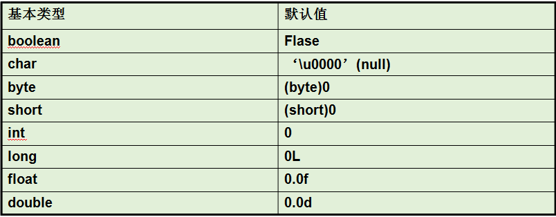
>    2. <b>局部变量</b>：没有
> 4. <b>是否要初始化</b>
>    1. <b>成员变量</b>：不需要，不建议初始化，后续使用的时候在赋值即可
>    2. <b>局部变量</b>：一定需要，不然直接使用的时候会报错
> 5. <b>内存中的位置不同</b>
>    1. <b>成员变量</b>：堆内存
>    2. <b>局部变量</b>：栈内存
> 6. <b>作用时间不同</b>
>    1. <b>成员变量</b>：当前对象从创建到销毁
>    2. <b>局部变量</b>：当前方法从开始执行到执行完毕

- 代码示例

```java
public class Student {
    byte e;
    short s;
    int c ;//成员变量：在类中方法外
    long num2;
    float f ;
    double d;
    char ch;
    boolean bo;
    String name;
    public void study(){
        int num = 10 ; //局部变量：在方法中
        System.out.println(num);//10
        //int num ;重复命名，出错了
        {
            int a;//局部变量：在代码块中
        }
        int a;
        if(1==3){
            int b;
        }
        System.out.println(c);
    }
    public void eat(){
        System.out.println(c);
    }
    //这是一个main方法，是程序的入口：
    public static void main(String[] args) {
        Student s = new Student();
        System.out.println(s.c);
        System.out.println(s.bo);
        System.out.println(s.ch);
        System.out.println(s.d);
        System.out.println(s.e);
        System.out.println(s.f);
        System.out.println(s.name);
        System.out.println(s.num2);
        System.out.println(s.s);
        s.d = 10.4;
    }
}
```

#### 2.6.4 类构造器

> 构造器分为
>
> - 无参构造器
> - 有参构造器

```java
public class Person {
    // 属性
    private String name;
    private int age;

    // 无参构造器  没有任何参数的构造器我们叫做：空参构造器--> 空构造器
    public Person() {

    }

    // 有参构造器
    public Person(String name, int age) {
        this.name = name;
        this.age = age;
    }

    // 无参构造器  和 有参狗在其 就是 重载

    //方法：
    public void eat() {
        System.out.println("我喜欢吃饭");
    }
}
```

> <b>构造器</b>： new关键字实际上是在调用一个方法，这个方法叫构造方法（<b>构造器</b>）
>
> 调用<b>构造器</b>的时候，如果你的类中没有写构造器，那么系统会默认给你分配一个<b>构造器</b>，只是我们看不到罢了。 可以自己显式 的将<b>构造器</b>编写出来：

> - 构造器的格式
>
> ```java
> [修饰符] 构造器的名字(){
> }
> 
> [修饰符] 构造器的名字(参数类型 参数名...){
>     this.属性名 = 参数名;
>     ...
> }
> ```
>
> - <b>构造器</b>和方法的区别：
>   - 没有方法的返回值类型
>   - 方法体内部不能有return语句
>   - <b>构造器</b>的名字很特殊，必须跟类名一样
> - <b>构造器</b>的作用
>   - 不是为了创建对象，因为在调用<b>构造器</b>之前，这个对象就已经创建好了，并且属性有默认的初始化的值。调用<b>构造器</b>的目的是给属性进行赋值操作的。
> - 注意事项：
>   - 我们一般不会在空<b>构造器</b>中进行初始化操作，因为那样的话每个对象的属性就一样了。 实际上，我们只要保证空<b>构造器</b>的存在就可以了，里面的东西不用写
>
> - 代码片段
>
>   - ```java
>         Person p = new Person();
>         System.out.println(p.age);
>         System.out.println(p.name);
>         System.out.println(p.height);
>         Person p2 = new Person();
>         System.out.println(p2.age);
>         System.out.println(p2.name);
>         System.out.println(p2.height);
>     ```

#### 2.6.5 创建对象内存分析

##### 2.6.5.1 new Person() 内存分析

> ```java
>  public class Person {
>         int  id;
>         int  age;
> 
>         public static void main(String args[]){
>                 Person p1= new Person();
>         }
> }
> ```
>
> 内存分析如图：
>
> - 创建main方法栈帧，局部变量P1存在在栈帧中
> - 堆内存中存储属性(成员变量)的值以及实例地址
> - 方法区内存储整个类的字节码信息
>
> 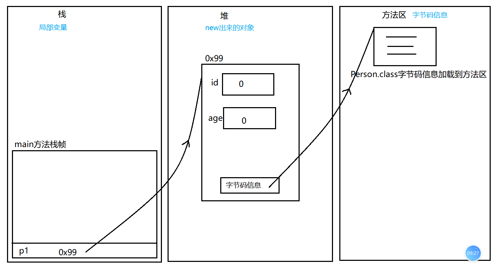

##### 2.6.5.2 有参构造器内存分析

> ```java
> public class Person {
>         int id;
>         int age;
>         String school;
>         public Person (int a,int b,String c){
>                 id=a;
>                 age=b;
>                 school=c;
>         }
>         public static void main(String args[]){
>                 Person p= new Person(1,20, "海淀");
>         }
> }
> ```
>
> 内存分析图：
>
> - 其他不变，这里多了个构造器方法，那么就要创建1个构造器方法的栈帧
> - 构造器中的赋值操作，就是把堆中的成员变量的值和方法区中的字符串常量11对应。
>
> 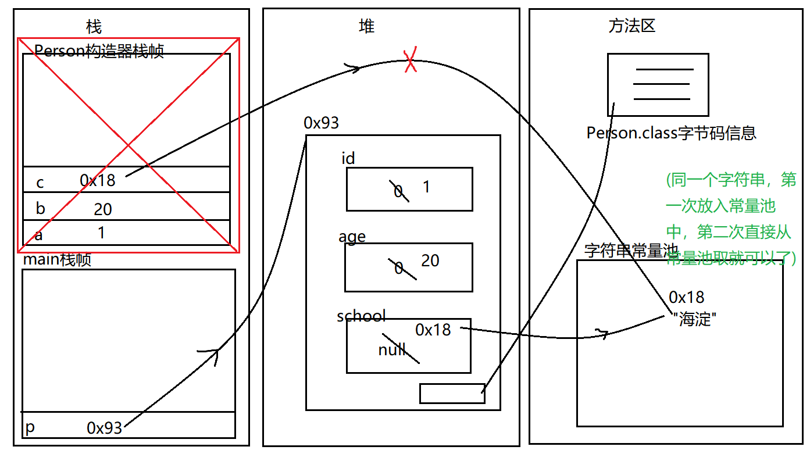

#### 2.6.6 类中关键字介绍

::: tabs

@tab `this`

> `this`关键字在类中的作用： 指代的就是**当前对象**
>
> ::: tabs
>
> @tab `this`可以修饰**属性**
>
> - 当属性名字和形参发生重名的时候或者属性名字和局部变量重名的时候，都会发生就近原则，所以如果我要是直接使用变量名字的话就指的是离的近的那个形参或者局部变量，这时候如果我想要表示属性的话，在前面要加上：`this`.修饰
>
> - 如果不发生重名问题的话，实际上你要是访问属性也可以省略this.
>
> - ```java
>   public class Person {
>       //属性
>       int age;
>       String name;
>       double height;
>       //空构造器
>       public Person(){
>       }
>       //有参构造器
>       public Person(int age,String name,double height){
>           this.age = age;
>           this.name = name;
>           this.height = height;
>       }
>       //方法：
>       public void eat(){
>           int age = 10;
>           System.out.println(age);//就近原则，age指的是离它近的age--》局部变量的age
>           System.out.println(this.age);//这里指代的就是属性的age
>           System.out.println("我喜欢吃饭");
>       }
>   }
>   ```
>
> @tab `this`可以修饰**方法**
>
> - 在同一个类中，方法可以互相调用，this.可以省略不写。
>
> - ```java
>   public class Person {
>       //属性
>       int age;
>       String name;
>       double height;
>       //空构造器
>       public Person(){
>       }
>       //有参构造器
>       public Person(int age,String name,double height){
>           this.age = age;
>           this.name = name;
>           this.height = height;
>       }
>       //方法：
>       /*public void eat(){
>           int age = 10;
>           System.out.println(age);//就近原则，age指的是离它近的age--》局部变量的age
>           System.out.println(this.age);//这里指代的就是属性的age
>           System.out.println("我喜欢吃饭");
>       }*/
>       public void play(){
>           /*this.*/eat();
>           System.out.println("上网");
>           System.out.println("洗澡");
>       }
>       public void eat(){
>           System.out.println(/*this.*/age);
>           System.out.println("吃饭");
>       }
>   }
>   ```
>
> @tab `this`可以修饰**构造器**
>
> - 同一个类中的构造器可以相互用this调用，注意：this修饰构造器必须放在第一行
>
> - ```java
>   public class Person {
>       //属性
>       int age;
>       String name;
>       double height;
>       //空构造器
>       public Person(){
>       }
>       //有参构造器
>       public Person(int age,String name,double height){
>           this(age,name);
>           this.height = height;
>       }
>       public Person(int age,String name){
>           this(age);
>           this.name = name;
>       }
>       public Person(int age){
>           this.age = age;
>       }
>       //方法：
>       /*public void eat(){
>           int age = 10;
>           System.out.println(age);//就近原则，age指的是离它近的age--》局部变量的age
>           System.out.println(this.age);//这里指代的就是属性的age
>           System.out.println("我喜欢吃饭");
>       }*/
>       public void play(){
>           /*this.*/eat();
>           System.out.println("上网");
>           System.out.println("洗澡");
>       }
>       public void eat(){
>           System.out.println(/*this.*/age);
>           System.out.println("吃饭");
>       }
>   }
>   ```
>
> :::

@tab `static`

> `static`可以修饰：
>
> - 属性
> - 方法
> - 代码块
> - 内部类
>
> ::: tabs
>
> @tab `static` 修饰属性	
>
> - 属性：
>   - 静态属性 （类变量）
>   - 非静态属性（实例变量）
>
> - 代码演示
>
>   - ```java
>     public class Test {
>         //属性：
>         int id;
>         static int sid;
>         //这是一个main方法，是程序的入口：
>         public static void main(String[] args) {
>             //创建一个Test类的具体的对象
>             Test t1 = new Test();
>             t1.id = 10;
>             t1.sid = 10;
>             Test t2 = new Test();
>             t2.id = 20;
>             t2.sid = 20;
>             Test t3 = new Test();
>             t3.id = 30;
>             t3.sid = 30;
>             //读取属性的值：
>             System.out.println(t1.id);
>             System.out.println(t2.id);
>             System.out.println(t3.id);
>             System.out.println(t1.sid);
>             System.out.println(t2.sid);
>             System.out.println(t3.sid);
>         }
>     }
>     ```
>
> - 内存分析
>
>   - 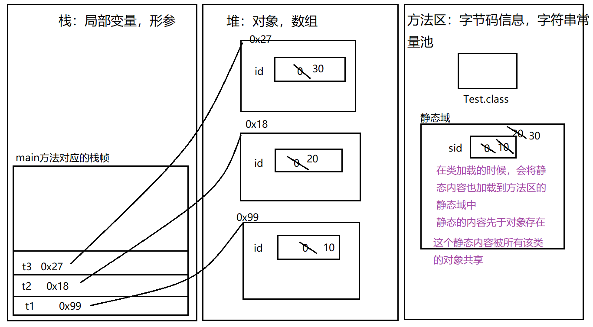
>
> - 访问形式
>
>   - 一般官方的推荐访问方式：可以通过类名.属性名的方式去访问：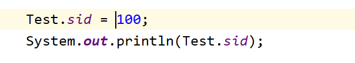
>
> - 应用场景
>
>   - 某些特定的数据想要在内存中共享，只有一块 --> 这个情况下，就可以用static修饰的属性
>
> - 总结
>
>   - （1）在类加载的时候一起加载入方法区中的静态域中
>   - （2）先于对象存在
>   - （3）访问方式： 对象名.属性名    类名.属性名（推荐）
>
> @tab `static` 修饰方法
>
> - 代码演示
>
> ```java
> public class Demo {
>     int id;
>     static int sid;
>     public void a(){
>         System.out.println(id);
>         System.out.println(sid);
>         System.out.println("------a");
>     }
>     //1.static和public都是修饰符，并列的没有先后顺序，先写谁后写谁都行
>     static public void b(){
>         //System.out.println(this.id);//4.在静态方法中不能使用this关键字
>         //a();//3.在静态方法中不能访问非静态的方法
>         //System.out.println(id);//2.在静态方法中不能访问非静态的属性
>         System.out.println(sid);
>         System.out.println("------b");
>     }
>     //这是一个main方法，是程序的入口：
>     public static void main(String[] args) {
>         //5.非静态的方法可以用对象名.方法名去调用
>         Demo d = new Demo();
>         d.a();
>         //6.静态的方法可以用   对象名.方法名去调用  也可以 用  类名.方法名 （推荐）
>         Demo.b();
>         d.b();
>        
>     }
> }
> ```
>
> - 注意事项:
>   - `static`和`public`都是修饰符，并列的没有先后顺序，先写谁后写谁都行
>   - 在静态方法中不能访问非静态的属性
>   - 在静态方法中不能访问非静态的方法
>   - 在静态方法中不能使用`this`关键字
>   - 非静态的方法可以用对象名.方法名去调用
>   - 静态的方法可以用   对象名.方法名去调用  也可以 用  类名.方法名 （推荐）
>
> :::

@tab `import` & `package`

> ::: tabs
>
> @tab `package`
>
> - 包的作用
>   - 为了解决重名问题（实际上包对应的就是盘符上的目录）
>   - 解决权限问题
> - `idea`创建包
>   - 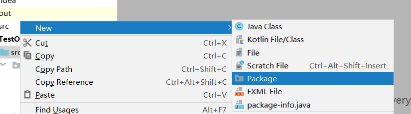
> - 包名定义规则：
>   - （1）名字全部小写
>   - （2）中间用.隔开
>   - （3）一般都是公司域名倒着写 ：  `com.jd` `com.msb`
>   - （4）加上模块名字：`com.jd.login`    `com.jd.register`
>   - （5）不能使用系统中的关键字：`nul,``con,``com1`---`com9`.....
>   - （6）包声明的位置一般都在非注释性代码的第一行：
>     - 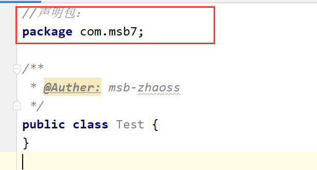
>
> @tab `import`
>
> - 导入包
>
> - ```java
>   //声明包：
>   package com.msb7;
>   import com.msb2.Person; //导包：就是为了进行定位
>   import java.util.Date;
>   /**
>    * @Auther: msb-zhaoss
>    */
>   public class Test {
>       //这是一个main方法，是程序的入口：
>       public static void main(String[] args) {
>           new Person();
>           new Date();
>           new java.sql.Date(1000L);//在导包以后，还想用其他包下同名的类，就必须要手动自己写所在的包。
>           new Demo();
>       }
>   }
>   ```
>
> - 总结：
>
>   - （1）使用不同包下的类要需要导包：` import **.*.*`;  例如：`import java.util.Date;`
>   - （2）在导包以后，还想用其他包下同名的类，就必须要手动自己写所在的包。
>   - （3）同一个包下的类想使用不需要导包，可以直接使用。
>   - （4）在`java.lang`包下的类，可以直接使用无需导包：
>   - （5）IDEA中导包快捷键：`alt`+`enter`     可以自己设置自动导包
>   - （6）可以直接导入*：
>     - 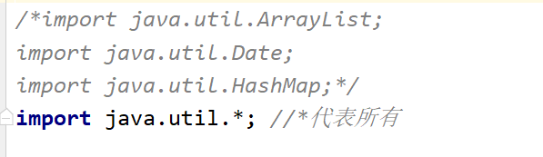
>   - 在Java中的导包没有包含和被包含的关系：设置目录平级的格式（不是包含和被包含的显示）
>     - 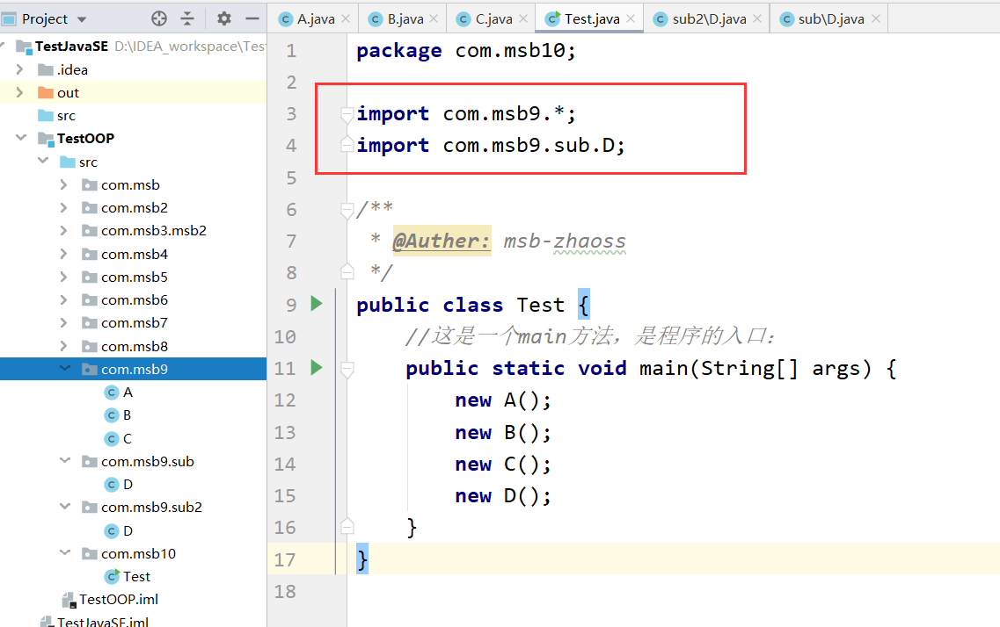
>
> - 静态导入
>
> ```java
> package com.msb11;
> //静态导入：
> import static java.lang.Math.*;
> //导入：java.lang下的Math类中的所有静态的内容
> /**
>  * @Auther: msb-zhaoss
>  */
> public class Test {
>     //这是一个main方法，是程序的入口：
>     public static void main(String[] args) {
>         System.out.println(random());
>         System.out.println(PI);
>         System.out.println(round(5.6));
>     }
>     //在静态导入后，同一个类中有相同的方法的时候，会优先走自己定义的方法。
>     public static int round(double a){
>         return 1000;
>     }
> }
> ```
>
> :::

@tab `final`

> `final`： 所有被`final`修饰过的都是不可以改变的。

> - 3种情形:
>
> ::: tabs
>
> @tab `final`修饰变量
>
> - 第1种情况：`final`修饰一个变量，变量的值不可以改变，这个变量也变成了一个字符常量，约定俗称的规定：名字大写
> - 第2种情况:  `final`修饰基本数据类型,值不允许改变
> - 第3种情况：`final`修饰引用数据类型，那么地址值就不可以改变，但是地址值对应的对象中的属性值可以改变
> - 第4种情况：`final`修饰方法中的形参，指向不可以改变
>
> ```java
> public class Test {
>     //这是一个main方法，是程序的入口：
>     public static void main(String[] args) {
>         //第1种情况：
>         //final修饰一个变量，变量的值不可以改变，这个变量也变成了一个字符常量，约定俗称的规定：名字大写
>         final int A = 10;//final修饰基本数据类型
>         //A = 20; 报错：不可以修改值
>         //第2种情况：
>         final Dog d = new Dog();//final修饰引用数据类型，那么地址值就不可以改变
>         //d = new Dog(); -->地址值不可以更改
>         //d对象的属性依然可以改变：
>         d.age = 10;
>         d.weight = 13.7;
>         //第3种情况：
>         final Dog d2 = new Dog();
>         a(d2);
>         //第4种情况：
>         b(d2);
>     }
>     public static void a(Dog d){
>         d = new Dog();
>     }
>     public static void b(final Dog d){//d被final修饰 ，指向不可以改变
>         //d = new Dog();
>     }
> }
> ```
>
> @tab `final`修饰方法
>
> > `final`修饰方法，那么这个方法不可以被该类的子类重写：
> >
> > 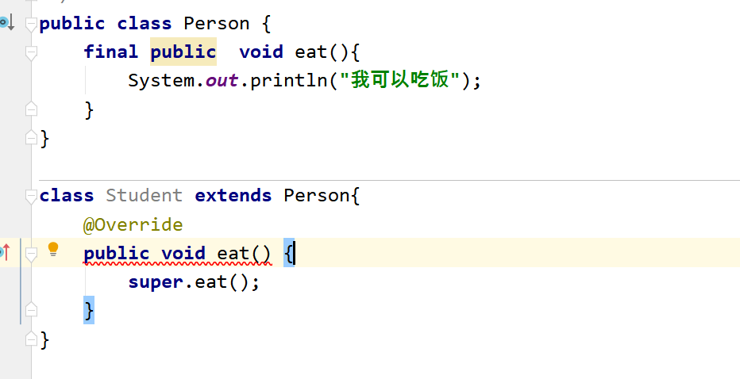
>
> @tab `final`修饰类
>
> > `final`修饰类，代表没有子类，该类不可以被继承：
> > 一旦一个类被`final`修饰，那么里面的方法也没有必要用`final`修饰了（`final`可以省略不写）
> >
> > 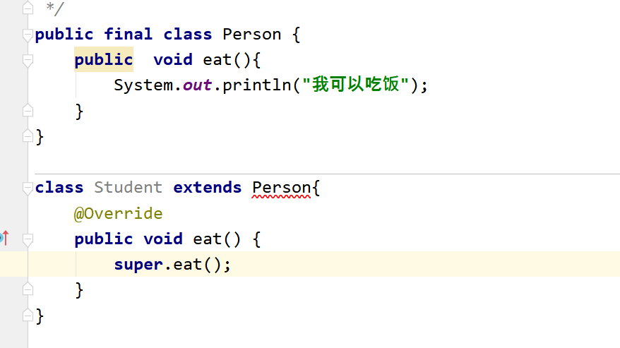
>
> :::
>
> - 案例
>   - （1）使用`Math`类的时候无需导包，直接使用即可：
>     - 
>   - （2）`Math`类没有子类，不能被其他类继承了
>     - 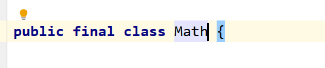
>   - （3）里面的属性全部被`final`修饰，方法也是被`final`修饰的，只是省略不写了
>     原因：子类没有必要进行重写。
>   - （4）外界不可以创建对象：
>     - 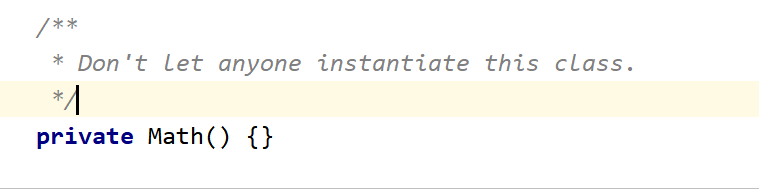
>   - （5）发现`Math`类中的所有的属性，方法都被`static`修饰
>     那么不用创建对象去调用，只能通过类名.属性名  类名.方法名 去调用

:::

#### 2.6.7  类的分类

##### 2.6.7.1 接口

::: tabs 

@tab 在`JDK1.8`之前

> 在`JDK1.8`之前，接口中只有两部分内容
>
> - 常量：固定修饰符：`public static final`
> - 抽象方法：固定修饰符：`public abstract `
> - 接口方法
>
> 代码示例：
>
> ```java
> public interface Interface01 {
>     // 接口中允许有常量
>     public static final Integer num = 100;
>     // 接口中允许有接口
>     void interfaceMethod01();
>     // 接口中允许有抽象方法
>     public abstract void method01(){
>         // 语句
>     }
> }
> ```

@tab  在`JDK1.8`之后

> 新增**非抽象方法**
>
> - <b>被`public default`修饰的非抽象方法</b>
>
>   - 注意1：`default`修饰符必须要加上，否则出错
>
>   - 注意2：实现类中要是想重写接口中的非抽象方法，那么`default`修饰符必须不能加，否则出错。
>
>   - 代码示例：
>
>     - ```java
>       public interface TestInterface {
>           //常量：
>           public static final int NUM= 10;
>           //抽象方法：
>           public abstract void a();
>           //public default修饰的非抽象方法：
>           public default void b(){
>               System.out.println("-------TestInterface---b()-----");
>           }
>       }
>       class Test implements TestInterface{
>           public void c(){
>               //用一下接口中的b方法：
>               b();//可以
>               //super.b();不可以
>               TestInterface.super.b();//可以
>           }
>           @Override
>           public void a() {
>               System.out.println("重写了a方法");
>           }
>           @Override
>           public void b() {
>           }
>       }
>       ```
>
> - <b>静态方法</b>
>
>   - 注意1：`static`不可以省略不写
>
>   - 注意2：静态方法不能重写
>
>   - 代码示例：
>
>     - ```java
>       public interface TestInterface2 {
>           //常量：
>           public static final int NUM = 10;
>           //抽象方法：
>           public abstract  void a();
>           //public default非抽象方法；
>           public default void b(){
>               System.out.println("-----TestInterface2---b");
>           }
>           //静态方法：
>           public static void c(){
>               System.out.println("TestInterface2中的静态方法");
>           }
>       }
>       class Demo implements TestInterface2{
>           @Override
>           public void a() {
>               System.out.println("重写了a方法");
>           }
>           public static void c(){
>               System.out.println("Demo中的静态方法");
>           }
>       }
>       class A {
>           //这是一个main方法，是程序的入口：
>           public static void main(String[] args) {
>               Demo d = new Demo();
>               d.c();
>               Demo.c();
>               TestInterface2.c();
>           }
>       }
>       ```

> ::: important 为什么要在接口中加入非抽象方法呢？
>
> - **以前**：如果接口中只能定义抽象方法的话，那么我要是修改接口中的内容，那么对实现类的影响太大了，<font style="color:red;">所有实现类都会受到影响</font>。
> - **现在**，<font style="color:red;">在接口中加入非抽象方法，对实现类没有影响，想调用就去调用即可。</font>
>
> :::
:::

##### 2.6.7.2 抽象类和抽象方法

> - 【1】<b>抽象类</b>和<b>抽象方法</b>的关系：
>
>   - <b>抽象类</b>中可以定义0-n个<b>抽象方法</b>。
>
> - 【2】<b>抽象类</b>作用：
>
>   - 在<b>抽象类</b>中定义<b>抽象方法</b>，目的是为了为子类提供一个通用的模板，子类可以在模板的基础上进行开发，先重写父类的<b>抽象方法</b>，然后可以扩展子类自己的内容。
>   - <b>抽象类</b>设计避免了子类设计的随意性，通过<b>抽象类</b>，子类的设计变得更加严格，进行某些程度上的限制。使子类更加的通用。
>
> - 【3】代码示例
>
>   - ```java
>     //4.一个类中如果有方法是抽象方法，那么这个类也要变成一个抽象类。
>     //5.一个抽象类中可以有0-n个抽象方法
>     public abstract class Person {
>         //1.在一个类中，会有一类方法，子类对这个方法非常满意，无需重写，直接使用
>         public void eat(){
>             System.out.println("一顿不吃饿得慌");
>         }
>         //2.在一个类中，会有一类方法，子类对这个方法永远不满意，会对这个方法进行重写。
>         //3.一个方法的方法体去掉，然后被abstract修饰，那么这个方法就变成了一个抽象方法
>         public abstract void say();
>         public abstract void sleep();
>     }
>     //6.抽象类可以被其他类继承：
>     //7.一个类继承一个抽象类，那么这个类可以变成抽象类
>     //8.一般子类不会加abstract修饰，一般会让子类重写父类中的抽象方法
>     //9.子类继承抽象类，就必须重写全部的抽象方法
>     //10.子类如果没有重写父类全部的抽象方法，那么子类也可以变成一个抽象类。
>     class Student extends Person{
>         @Override
>         public void say() {
>             System.out.println("我是东北人，我喜欢说东北话。。");
>         }
>         @Override
>         public void sleep() {
>             System.out.println("东北人喜欢睡炕。。");
>         }
>     }
>     class Demo{
>         //这是一个main方法，是程序的入口：
>         public static void main(String[] args) {
>             //11.创建抽象类的对象：-->抽象类不可以创建对象
>             //Person p = new Person();
>             //12.创建子类对象：
>             Student s = new Student();
>             s.sleep();
>             s.say();
>                     
>             //13.多态的写法：父类引用只想子类对象：
>             Person p  = new Student();
>             p.say();
>             p.sleep();
>         }
>     }
>     ```
>
>   - 【4】Q&A
>
>   ::: tabs 
>
>   @tab <b>Q:抽象类</b>不能创建对象，那么<b>抽象类</b>中是否有构造器？
>
>   <b>A:抽象类</b>中一定有构造器。构造器的作用: 给子类初始化对象的时候要先`super`调用父类的构造器。
>
>   @tab  <b>Q:抽象类</b>是否可以被final修饰？
>
>   <b>A:</b>不能被final修饰，因为<b>抽象类</b>设计的初衷就是给子类继承用的。要是被final修饰了这个<b>抽象类</b>了，就不存在继承了，就没有子类。
>
>   ::: 

##### 2.6.7.3 内部类

> <b>内部类</b> 分为以下2类
>
> - <b>成员内部类</b>
> - <b>局部内部类</b>

::: tabs 

@tab <b>成员内部类</b>

- <b>成员内部类</b>分为静态和非静态
- <b>成员内部类</b>的位置
  - 属性
  - 方法
  - 构造器

```java
/**
 * 1.一个类TestOuter的内部的类SubTest叫内部类， 内部类 ：SubTest  外部类：TestOuter
 * 2.内部类：成员内部类 (静态的，非静态的) 
 * 3.成员内部类:
 *      里面属性，方法，构造器等
 *      修饰符：private，default，protect，public，final,abstract
 */
public class TestOuter {
    //非静态的成员内部类：
    public class D{
        int age = 20;
        String name;
        public void method(){
            //5.内部类可以访问外部类的内容
            /*System.out.println(age);
            a();*/
            int age = 30;
            //8.内部类和外部类属性重名的时候，如何进行调用：
            System.out.println(age);//30
            System.out.println(this.age);//20
            System.out.println(TestOuter.this.age);//10
        }
    }
    //静态成员内部类：
    static class E{
        public void method(){
            //6.静态内部类中只能访问外部类中被static修饰的内容
            /*System.out.println(age);
            a();*/
        }
    }
    //属性：
    int age = 10;
    //方法：
    public void a(){
        System.out.println("这是a方法");
        {
            System.out.println("这是一个普通块");
            class B{
            }
        }
        class A{
        }
        //7.外部类想要访问内部类的东西，需要创建内部类的对象然后进行调用
        D d = new D();
        System.out.println(d.name);
        d.method();
    }
    static{
        System.out.println("这是静态块");
    }
    {
        System.out.println("这是构造块");
    }
    //构造器：
    public TestOuter(){
        class C{
        }
    }
    public TestOuter(int age) {
        this.age = age;
    }
}
class Demo{
    //这是一个main方法，是程序的入口：
    public static void main(String[] args) {
        //创建外部类的对象：
        TestOuter to = new TestOuter();
        to.a();
        //9.创建内部类的对象：
        //静态的成员内部类创建对象：
        TestOuter.E e = new TestOuter.E();
        //非静态的成员内部类创建对象：
        //错误：TestOuter.D d = new TestOuter.D();
        TestOuter t = new TestOuter();
        TestOuter.D d = t.new D();
    }
}
```

@tab <b>局部内部类</b>

- <b>局部内部类</b>的位置
  - 方法内部
  - 代码块内
  - 构造器内

- <b>局部内部类</b>中的可以访问到的变量必须是被`final`修饰的
- 若1个类在整个项目中只使用1次，那么就没有必要单独创建1个类B类，而是使用<b>局部内部类</b>的形式进行创建即可

```java
//局部内部类（位置：方法内，块内，构造器内）
public class PartInner {
    //1.在局部内部类中访问到的变量必须是被final修饰的
    public void method(){
        final int num = 10;
        // 方法内部局部内部类
        class A{
            public void a(){
                //num = 20;
                System.out.println(num);
            }
        }
    }
    //2.如果类B在整个项目中只使用一次，那么就没有必要单独创建一个B类，使用内部类就可以了
    public Comparable method2(){
        class B implements Comparable{
            @Override
            public int compareTo(Object o) {
                return 100;
            }
        }
        return new B();
    }
    public Comparable method3(){
        //3.匿名内部类
        return new Comparable(){
            @Override
            public int compareTo(Object o) {
                return 200;
            }
        };
    }
    public void teat(){
        Comparable com = new Comparable(){
            // 构造器内匿名局部内部类
            @Override
            public int compareTo(Object o) {
                return 200;
            }
        };
        System.out.println(com.compareTo("abc"));
    }
}
```

:::

## 【3】面向对象的三大特性

### 3.1 封装

- **概念**

::: info 概念

官方解释：

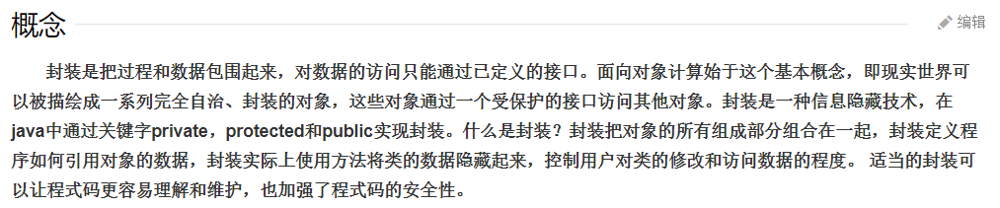

通俗理解： 将某些东西进行隐藏，然后提供相应的方式进行获取。

::: 

- **封装的设计思想**

> 我们程序设计追求“高内聚，低耦合”。
> ➢高内聚:类的内部数据操作细节自己完成，不允许外部干涉;
> ➢低耦合:仅对外暴露少量的方法用于使用。 
> 隐藏对象内部的复杂性，只对外公开简单的接口。便于外界调用，从而提
> 高系统的可扩展性、可维护性。通俗的说，把该隐藏的隐藏起来，该暴露
> 的暴露出来。这就是封装性的设计思想。

- **封装的好处**

> 提高代码的安全性

- **代码示例**

```java
public class Girl {//女孩
    //属性：
    private int age;
    //读取年龄：
    public int duquAge(){
        return age;
    }
    //设置年龄：
    public void shezhiAge(int age){
        if(age >= 30 ){
            this.age = 18;
        }else{
            this.age = age;
        }
    }
}
public class Test {
    //这是一个main方法，是程序的入口：
    public static void main(String[] args) {
        //创建一个Girl类的对象：
        Girl g = new Girl();
        /*g.age = 33;
        System.out.println(g.age);*/
        //设置年龄：
        g.shezhiAge(31);
        //读取年龄：
        System.out.println(g.duquAge());
    }
}
```

- **代码解析**

> 上面的代码，对于属性`age`来说，我加了修饰符`private`，这样外界对它的访问就受到了限制，现在我还想加上其他的限制条件，但是在属性本身上没有办法再加了，所以我们通过定义方法来进行限制条件的添加。
> 以**属性**为案例，进行封装：
>
> - （1）将属性私有化，被private修饰--》加入权限修饰符,一旦加入了权限修饰符，其他人就不可以随意的获取这个属性
> - （2）提供public修饰的方法让别人来访问/使用
> - （3）即使外界可以通过方法来访问属性了，但是也不能随意访问，因为咱们在方法中可以加入 限制条件。

- 实际应用

> 实际开发中，方法一般会写成 `setter`，`getter`方法：
>
> 可以利用IDEA快捷键生成：`alt+insert -->getter and setter:`
>
> 或者使用`Lombok`插件。

### 3.2 继承

#### 3.2.1 类是对对象的抽象

> EG： 荣耀20 ，小米 红米3，华为 p40 pro   ---> 类：手机类

#### 3.2.2 继承是对类的抽象

> - EG：
>   - 学生类：Student：
>     - 属性：姓名，年龄，身高，学生编号
>     - 方法：吃饭，睡觉，喊叫，学习
>   - 教师类：Teacher:
>     - 属性：姓名，年龄，身高，教师编号
>     - 方法：吃饭，睡觉，喊叫，教学
>   - 员工类：Emploee:
>     - 属性：姓名，年龄，身高，员工编号
>     - 方法：吃饭，睡觉，喊叫，工作
>   - 共同的东西：人类：
>     - 属性：姓名，年龄，身高
>     - 方法：吃饭，睡觉，喊叫
>
> - 结论：
>
>   - 学生类/教师类/员工类  继承 自   人类
>   - 人类为父类
>   - 学生类/教师类/员工类为子类
>   - 子类 继承自  父类 
>   - 总结：继承 就是  is - a 的关系 
>
> - 代码层面的解释
>
>   - 先写父类，再写子类：
>
>   - 父类：人类  Person
>
>     - ```java
>       public class Person {
>           //属性：
>           private int age;
>           private String name;
>           private double height;
>           //提供setter getter方法：
>           public int getAge() {
>               return age;
>           }
>           public void setAge(int age) {
>               this.age = age;
>           }
>           public String getName() {
>               return name;
>           }
>           public void setName(String name) {
>               this.name = name;
>           }
>           public double getHeight() {
>               return height;
>           }
>           public void setHeight(double height) {
>               this.height = height;
>           }
>           //方法：
>           public void eat(){
>               System.out.println("可以吃饭。。。");
>           }
>           public void sleep(){
>               System.out.println("可以睡觉。。。");
>           }
>       }
>       ```
>
>   - 子类：学生类   Student
>
>     - ```java
>       public class Student extends Person {//子类Student 继承  父类Person
>           //属性：
>           private int sno;//学号
>           public int getSno() {
>               return sno;
>           }
>           public void setSno(int sno) {
>               this.sno = sno;
>           }
>           //方法：
>           public void study(){
>               System.out.println("学生可以学习");
>           }
>       }
>       ```
>
>   - 测试类
>
>     - ```java
>       public class Test {
>           //这是一个main方法，是程序的入口：
>           public static void main(String[] args) {
>               //创建子类Student的对象
>               Student s = new Student();
>               s.setSno(1001);
>               s.setAge(18);
>               s.setName("菲菲");
>               s.setHeight(180.4);
>               System.out.println("学生名字为："+s.getName()+",学生的年纪："+s.getAge());
>               //访问方法：
>               s.study();
>               s.eat();
>               s.sleep();
>           }
>       }
>       ```

#### 3.2.3 继承的好处

> <b>继承的好处</b>:
>
> - 提高代码的复用性
> - 父类定义的内容，子类可以直接拿过来用就可以了，不用代码上反复重复定义了
> - 便于代码的扩展
> - 为了以后多态的使用。是多态的前提。
>
> ::: warning 需要注意的点
>
> 父类private修饰的内容，子类实际上也继承，只是因为封装的特性阻碍了直接调用，但是提供了间接调用的方式，可以间接调用。
>
> :::

#### 3.2.4 继承的总结

> <b>总结</b>
>
> - 继承关系 ：
>   - 父类/基类/超类
>   - 子类/派生类
>   - 子类继承父类一定在合理的范围进行继承的    子类 extends  父类
> - 继承的好处
>   - 提高了代码的复用性
>   - 父类定义的内容，子类可以直接拿过来用就可以了，不用代码上反复重复定义了
>   - 便于代码的扩展
>   - 为了以后多态的使用。是多态的前提。
> - 父类private修饰的内容，子类也继承过来了
> - 一个父类可以有多个子类
> - 一个子类只能有一个直接父类，但是可以间接的继承自其它类。
>   - 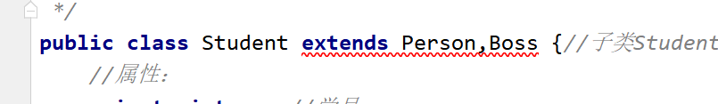
> - 继承具有传递性
>   - Student --》继承自  Person  ---》继承自Object
>   - Object类是所有类的根基父类。
>   - 所有的类都直接或者间接的继承自Object

#### 3.2.5 继承的内存分析

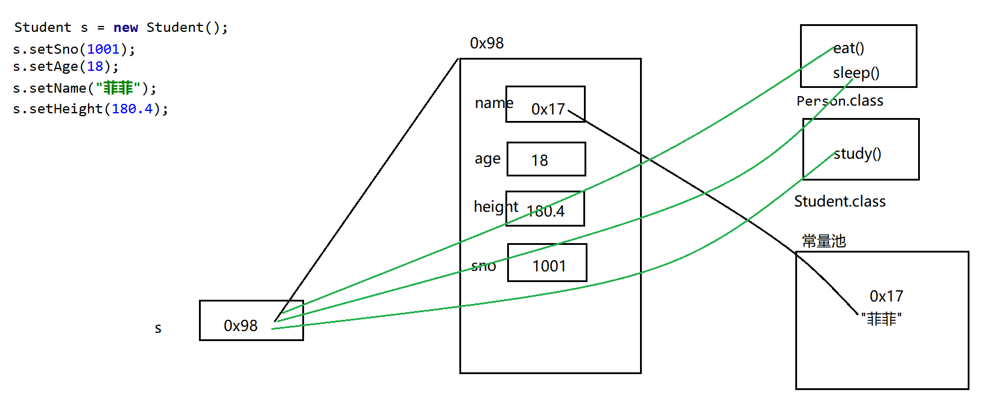

#### 3.2.6 修饰符的权限

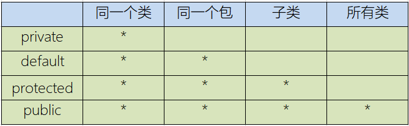

> - 【1】`private`：权限：在当前类中可以访问
> - 【2】`default`:缺省修饰符：权限：到同一个包下的其他类都可以访问
> - 【3】`protected`：权限：最大到不同包下的子类
> - 【4】`public`：在整个项目中都可以访问

> - 总结：
>
>   - 属性，方法：修饰符：四种：`private`，缺省，`protected`，`public`
>
>   - 类：修饰符：两种：缺省，`public`
>
> - 以后写代码:
>
>   - 一般属性：用`private`修饰 
>   - 方法：用`public`修饰

#### 3.2.7 继承后方法的重写

> - 重写的定义
>
> ::: info 继承后方法的重写
>
> 发生在子类和父类中，当子类对父类提供的方法不满意的时候，要对父类的方法进行重写。
>
> :::
>
> - 重写的格式
>
> > 子类的方法名字和父类必须一致，参数列表（个数，类型，顺序）也要和父类一致。
>
> - 代码示例
>
> ```java
> public class Person {
>     public void eat(){
>         System.out.println("吃食物");
>     }
>     public void sleep(){
>         System.out.println("睡觉");
>     }
> }
> 
> public class Student extends Person {
>     public void study(){
>         System.out.println("学习");
>     }
>     @override
>     public void eat(){
>         // 这里吃的东西不一样了 重写了
>         System.out.println("我喜欢吃小龙虾喝啤酒。。");
>     }
> }
> public class Test {
>     //这是一个main方法，是程序的入口：
>     public static void main(String[] args) {
>         //创建一个Student类的对象：
>         Student s = new Student();
>         s.eat();
>     }
> }
> ```
>
> - 上述代码的内存分析
>
> 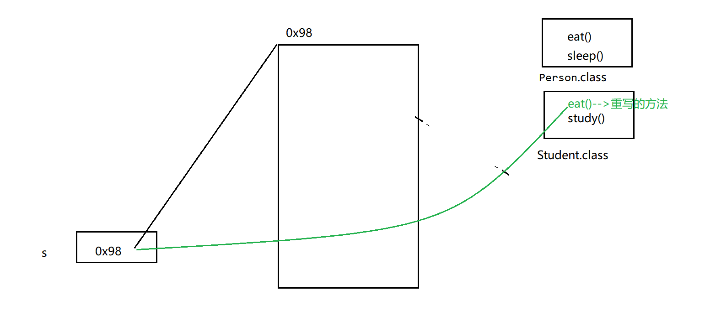

::: important 重载和重写的区别

> <b>重载</b>：在同一个类中，当方法名相同，形参列表不同的时候  多个方法构成了重载
> <b>重写</b>：在不同的类中，子类对父类提供的方法不满意的时候，要对父类的方法进行重写。
>
> 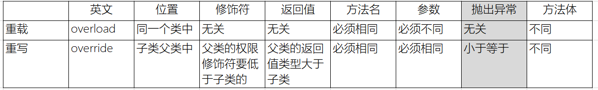

:::

#### 3.2.8 继承中`super`关键词

> - 【1】`super`:指的是：  父类的
>
> - 【2】`super`可以修饰属性，可以修饰方法；
>
>   - 修饰<b>属性</b>
>   - 修饰<b>方法</b>
>
> - 【3】在子类的方法中，可以通过  `super`.属性  `super`.方法 的方式，显示的去调用父类提供的属性，方法。在通常情况下，`super`.可以省略不写：
>
>   - 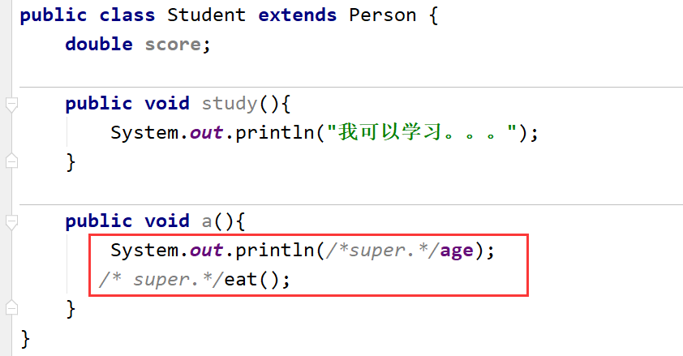
>
> - 【4】特殊情况
>
>   - >  在特殊情况下，当子类和父类的属性重名时，你要想使用父类的属性，必须加上修饰符`super`.，只能通过`super`.属性来调用
>     > 在特殊情况下，当子类和父类的方法重名时，你要想使用父类的方法，必须加上修饰符`super`.，只能通过`super`.方法来调用
>     > 在这种情况下，`super`.就不可以省略不写。
>
>   - 子类和父类的<b>属性</b>重名
>
>   - 子类和父类的<b>方法</b>重名
>
>   - 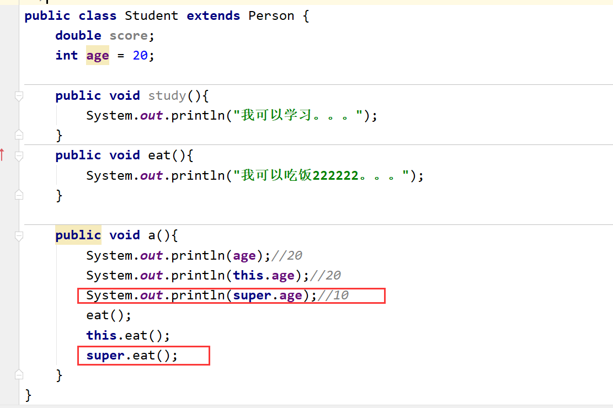
>
> - 【5】`super`修饰构造器
>
> > - 其实我们平时写的构造器的第一行都有：`super() ` -->作用：调用父类的空构造器，只是我们一般都省略不写
> > - （所有构造器的第一行默认情况下都有super(),但是一旦你的构造器中显示的使用super调用了父类构造器，那么这个super()就不会给你默认分配了。如果构造器中没有显示的调用父类构造器的话，那么第一行都有super(),可以省略不写）
> >   - 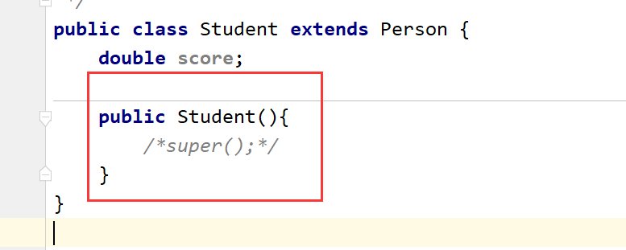
> > - 如果构造器中已经显示的调用super父类构造器，那么它的第一行就没有默认分配的`super()`了
> >   - 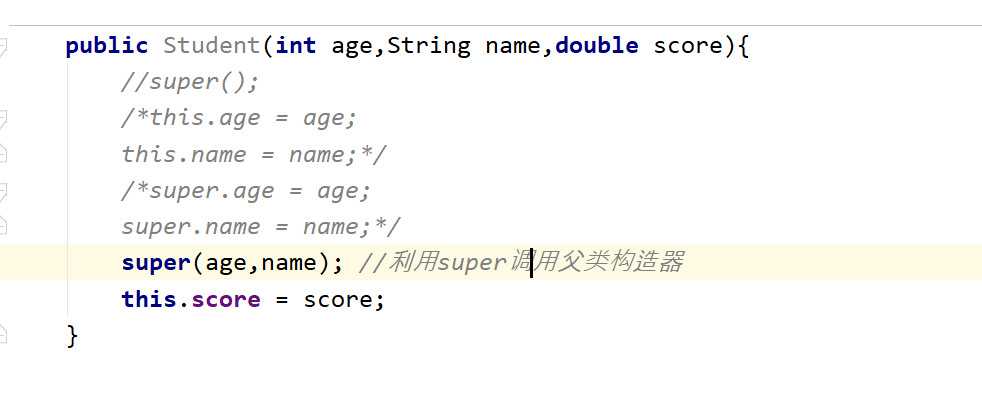
> > - 在构造器中，`super`调用父类构造器和`this`调用子类构造器只能存在一个，两者不能共存：因为`super`修饰构造器要放在第一行，`this`修饰构造器也要放在第一行：
> >   - 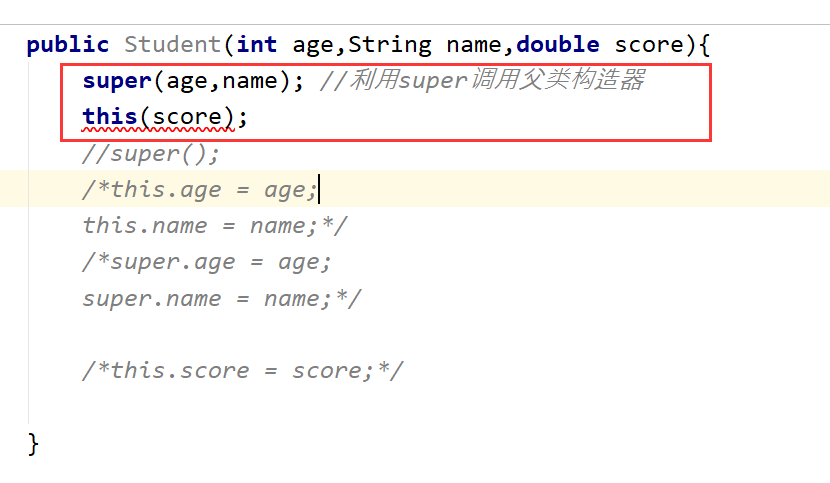
> > - 改正二选一即可
> >   - 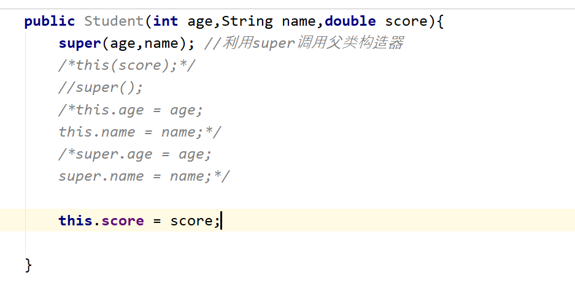

#### 3.2.9 继承条件下构造方法的执行过程

> 代码示例如下：
>
> ```java
> public class Person {
>     int age;
>     String name;
>     public Person(int age, String name) {
>         super();
>         this.age = age;
>         this.name = name;
>     }
>     public Person() {
>     }
> }
> public class Student extends Person {
>     double height ;
>     public Student() {
>     }
>     public Student(int age, String name, double height) {
>         super(age, name);
>         this.height = height;
>     }
> }
> public class Test {
>     //这是一个main方法，是程序的入口：
>     public static void main(String[] args) {
>         Student s = new Student(19,"feifei",160.8);
>     }
> }
> ```

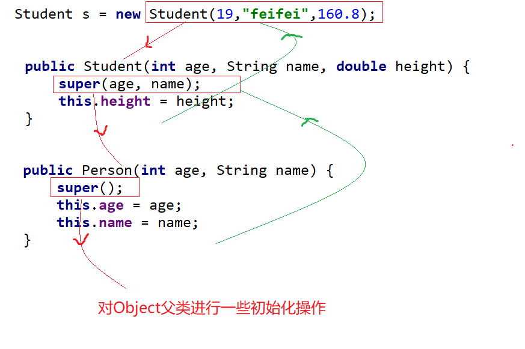

#### 3.2.10 `Java`中的特殊类`Object`

##### 3.2.10.1 `Object`.java 初识

```java
package java.lang;

import jdk.internal.vm.annotation.IntrinsicCandidate;

/**
 * Class {@code Object} is the root of the class hierarchy.
 * Every class has {@code Object} as a superclass. All objects,
 * including arrays, implement the methods of this class.
 *
 * @see     java.lang.Class
 * @since   1.0
 */
public class Object {
...
}
```

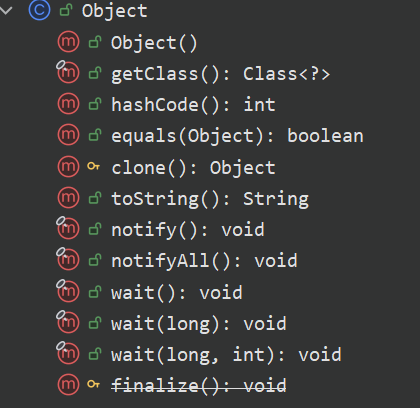

> - 所有类都直接或间接的继承自`Object`类，Object类`是`所有`Java`类的根基类
> - 也就意味着所有的`Java`对象都拥有`Object`类的属性和方法。
> - 如果在类的声明中未使用`extends`关键字指明其父类，则默认继承`Object`类。
> - 

##### 3.2.10.2 `Object`类中的`toString`方法

> - 官网描述:
>
> 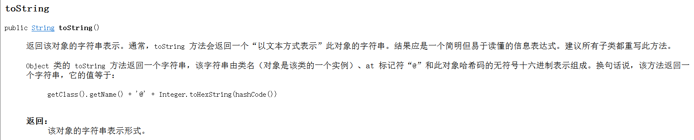
>
> - 原理：
>
> 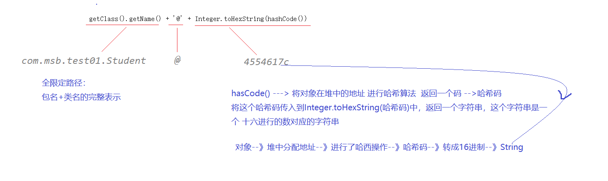
>
> - 重写`ToString()`
>
>   - `toString`的作用就是对对象进行“自我介绍”，一般子类对父类提供的`toString`都不满意，都要进行重写。
>
>   - ```java
>      @Override
>         public String toString() {
>             return "Student{" +
>                     "name='" + name + '\'' +
>                     ", age=" + age +
>                     ", height=" + height +
>                     '}';
>         }
>     ```

##### 3.2.10.3 `Object`类中的`equals()`方法

```java
public class Phone {//手机类：
    //属性：
    private String brand;//品牌型号
    private double price;//价格
    private int year ;//出产年份
    //方法：
    public String getBrand() {
        return brand;
    }
    public void setBrand(String brand) {
        this.brand = brand;
    }
    public double getPrice() {
        return price;
    }
    public void setPrice(double price) {
        this.price = price;
    }
    public int getYear() {
        return year;
    }
    public void setYear(int year) {
        this.year = year;
    }
    @Override
    public String toString() {
        return "Phone{" +
                "brand='" + brand + '\'' +
                ", price=" + price +
                ", year=" + year +
                '}';
    }
    //构造器：
    public Phone() {
    }
    public Phone(String brand, double price, int year) {
        this.brand = brand;
        this.price = price;
        this.year = year;
    }
    //对equals方法进行重写：
    public boolean equals(Object obj) {//Object obj = new Phone();
        //将obj转为Phone类型：
        Phone other = (Phone)obj;//向下转型，为了获取子类中特有的内容
        if(this.getBrand()==other.getBrand()&&this.getPrice()==other.getPrice()&&this.getYear()==other.getYear()){
            return true;
        }
        return false;
    }
}
public class Test {
    //这是一个main方法，是程序的入口：
    public static void main(String[] args) {
        //创建Phone类的对象：
        Phone p1 = new Phone("华为P40",2035.98,2020);
        Phone p2 = new Phone("华为P40",2035.98,2020);
        //比较两个对象：p1和p2对象：
        //==的作用：比较左右两侧的值是否想的，要么相等，返回true,要么不相等,返回false
        System.out.println(p1==p2);//-->>>对于引用数据类型来说，比较的是地址值。--->一定返回的是false
        //Object类提供了一个方法 equals方法 ：作用：比较对象具体内容是否相等。
        boolean flag = p1.equals(p2);//点进源码发现：底层依旧比较的是==，比较的还是地址值。
        System.out.println(flag);
    }
}
```

> **equals作用**
>
> - 这个方法提供了对对象的内容是否相等 的一个比较方式，对象的内容指的就是属性。
>   父类Object提供的equals就是在比较==地址，没有实际的意义，我们一般不会直接使用父类提供的方法，而是在子类中对这个方法进行重写。
>
> **Instanceof**
>
> - 判断某个对象是否是其的实例
>
> - 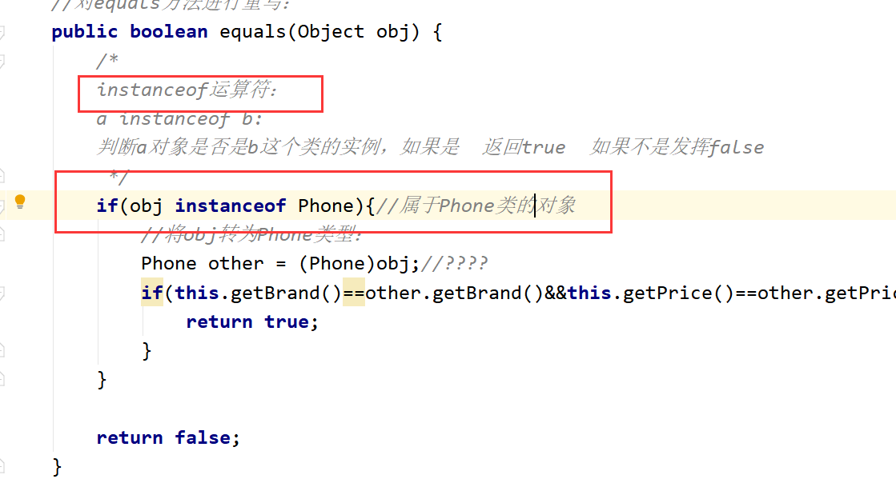
> - 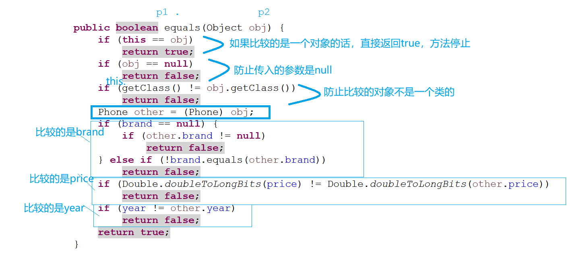
> - 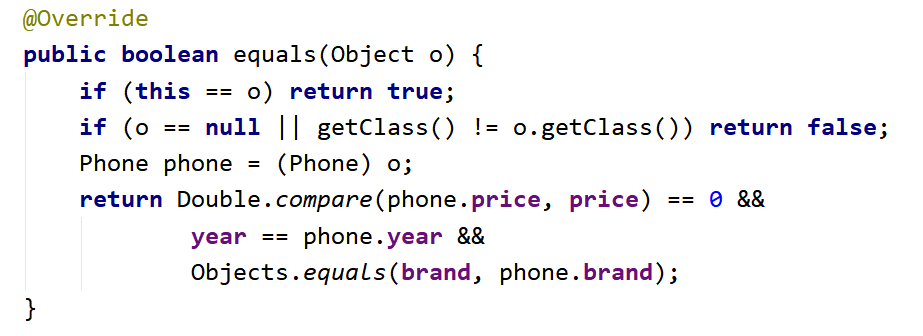

#### 3.2.11 类和类之间的关系

> 1. 继承关系
>
> 继承指的是一个类（称为子类、子接口）继承另外的一个类（称为父类、父接口）的功能，并可以增加它自己的新功能的能力。在Java中继承关系通过关键字extends明确标识，在设计时一般没有争议性。在UML类图设计中，继承用一条带空心三角箭头的实线表示，从子类指向父类，或者子接口指向父接口。
>
> 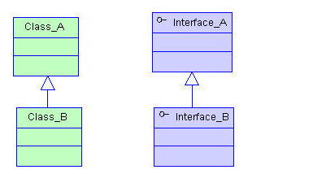

> 2. 实现关系
>
> 实现指的是一个class类实现interface接口（可以是多个）的功能，实现是类与接口之间最常见的关系。在Java中此类关系通过关键字implements明确标识，在设计时一般没有争议性。在UML类图设计中，实现用一条带空心三角箭头的虚线表示，从类指向实现的接口。
>
> 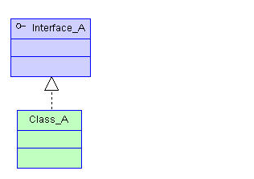

> 3. 依赖关系
>
> 简单的理解，依赖就是一个类A使用到了另一个类B，而这种使用关系是具有偶然性的、临时性的、非常弱的，但是类B的变化会影响到类A。比如某人要过河，需要借用一条船，此时人与船之间的关系就是依赖。表现在代码层面，让类B作为参数被类A在某个method方法中使用。在UML类图设计中，依赖关系用由类A指向类B的带箭头虚线表示。
>
> 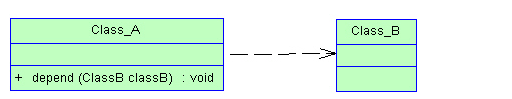

> 4. 关联关系
>
> 关联体现的是两个类之间语义级别的一种强依赖关系，比如我和我的朋友，这种关系比依赖更强、不存在依赖关系的偶然性、关系也不是临时性的，一般是长期性的，而且双方的关系一般是平等的。关联可以是单向、双向的。表现在代码层面，为被关联类B以类的属性形式出现在关联类A中，也可能是关联类A引用了一个类型为被关联类B的全局变量。在UML类图设计中，关联关系用由关联类A指向被关联类B的带箭头实线表示，在关联的两端可以标注关联双方的角色和多重性标记。
>
> 

> 5. 聚合关系
>
> 聚合是关联关系的一种特例，它体现的是整体与部分的关系，即has-a的关系。此时整体与部分之间是可分离的，它们可以具有各自的生命周期，部分可以属于多个整体对象，也可以为多个整体对象共享。比如计算机与CPU、公司与员工的关系等，比如一个航母编队包括海空母舰、驱护舰艇、舰载飞机及核动力攻击潜艇等。表现在代码层面，和关联关系是一致的，只能从语义级别来区分。在UML类图设计中，聚合关系以空心菱形加实线箭头表示。
>
> 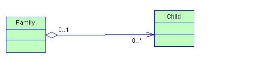

> 6. 组合关系
>
> 组合也是关联关系的一种特例，它体现的是一种contains-a的关系，这种关系比聚合更强，也称为强聚合。它同样体现整体与部分间的关系，但此时整体与部分是不可分的，整体的生命周期结束也就意味着部分的生命周期结束，比如人和人的大脑。表现在代码层面，和关联关系是一致的，只能从语义级别来区分。在UML类图设计中，组合关系以实心菱形加实线箭头表示。
>
> 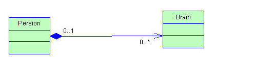

> 总结：
>
> 对于继承、实现这两种关系没多少疑问，它们体现的是一种类和类、或者类与接口间的纵向关系。其他的四种关系体现的是类和类、或者类与接口间的引用、横向关系，是比较难区分的，有很多事物间的关系要想准确定位是很难的。前面也提到，这四种关系都是语义级别的，所以从代码层面并不能完全区分各种关系，但总的来说，后几种关系所表现的强弱程度依次为：
>
> 组合>聚合>关联>依赖。

### 3.3 多态

> - 【1】<b>多态</b>跟属性无关，多态指的是方法的<b>多态</b>，而不是属性的<b>多态</b>。
> - 【2】案例代入：
>
> ```java
> public class Animal {//父类：动物：
>     public void shout(){
>         System.out.println("我是小动物，我可以叫。。。");
>     }
> }
> 
> public class Cat extends Animal{
>     //喊叫方法：
>     public void shout(){
>         System.out.println("我是小猫，可以喵喵叫");
>     }
>     public void scratch(){
>         System.out.println("我是小猫，我可以挠人");
>     }
> }
> 
> public class Dog extends Animal{
>     //喊叫：
>     public void shout(){
>         System.out.println("我是小狗，我可以汪汪叫");
>     }
>     public void guard(){
>         System.out.println("我是小狗，我可以看家护院，保护我的小主人。。。");
>     }
> }
> 
> public class Pig extends Animal{
>     public void shout(){
>         System.out.println("我是小猪，我嗯嗯嗯的叫");
>     }
>     public void eat(){
>         System.out.println("我是小猪，我爱吃东西。。");
>     }
>     
> }
> 
> public class Girl {
>     //跟猫玩耍：
>     /*public void play(Cat cat){
>         cat.shout();
>     }*/
>     //跟狗玩耍：
>     /*public void play(Dog dog){
>         dog.shout();
>     }*/
>     //跟小动物玩耍：
>     public void play(Animal an){
>         an.shout();
>     }
> }
> 
> public class Test {
>     //这是一个main方法，是程序的入口：
>     public static void main(String[] args) {
>         //具体的猫：--》猫的对象
>         //Cat c = new Cat();
>         //具体的小女孩：--》女孩的对象
>         Girl g = new Girl();
>         //小女孩跟猫玩：
>         //g.play(c);
>         //具体的狗---》狗的对象：
>         //Dog d = new Dog();
>         //小女孩跟狗玩：
>         //g.play(d);
>         //具体的动物：--》动物的对象：
>         //Cat c = new Cat();
>         //Dog d = new Dog();
>         Pig p = new Pig();
>         Animal an = p;
>         g.play(an);
>     }
> }
> ```
>
> - 【3】总结：
>
>   - （1）先有父类，再有子类：--> 继承   先有子类，再抽取父类 ----> 泛化 
>
>   - （2）什么是<b>多态</b>：
>
>     - <b>多态</b>就是多种状态：同一个行为，不同的子类表现出来不同的形态。
>     - <b>多态</b>指的就是同一个方法调用，然后由于对象不同会产生不同的行为。
>
>   - （3）<b>多态</b>的好处：
>
>     - 为了提高代码的扩展性，符合面向对象的设计原则：开闭原则。
>     - 开闭原则：指的就是扩展是 开放的，修改是关闭的。
>     - 注意：<b>多态</b>可以提高扩展性，但是扩展性没有达到最好，以后我们会学习反射
>
>   - （4）<b>多态</b>的要素：
>
>     - 一，继承：  ` Cat extends Animal  ,Pig extends Animal,   Dog extends Animal`
>
>     - 二，重写：子类对父类的方法shout()重写
>
>     - 三， 父类引用指向子类对象：
>
>       - ```java
>         Pig p = new Pig();
>         Animal an = p;
>         //将上面的代码合为一句话：
>         //Animal an = new Pig();
>         //=左侧：编译期的类型
>         //=右侧：运行期的类型
>         
>         Animal an = new Pig();
>         g.play(an); 
>         
>         public void play(Animal an){
>             //Animal an = an = new Pig();
>             an.shout();
>         }
>         ```
>
>       - 上面的代码，也是<b>多态</b>的一种非常常见的应用场合：父类当方法的形参，然后传入的是具体的子类的对象，然后调用同一个方法，根据传入的子类的不同展现出来的效果也不同，构成了<b>多态</b>。
>
>       - 内存分析
>
>         - 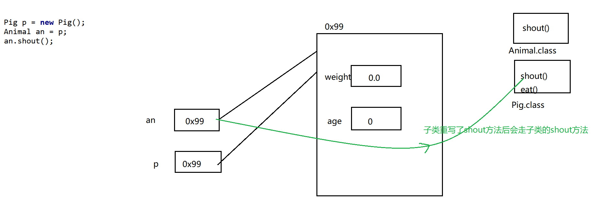

## 【4】参考资料

- [B站免费的马士兵java初级教程](https://www.bilibili.com/video/BV1RK4y1g7A5/?spm_id_from=333.337.search-card.all.click&vd_source=65c7f6924d2d8ba5fa0d4c448818e08a)

