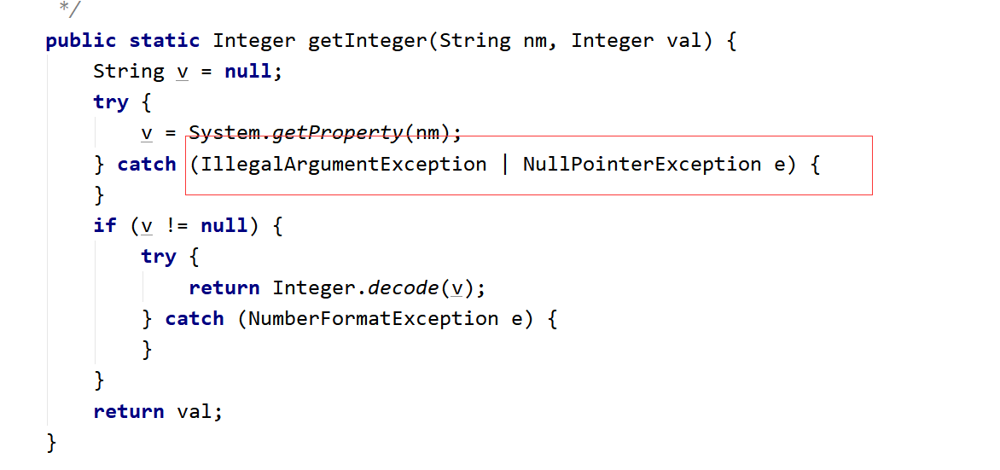
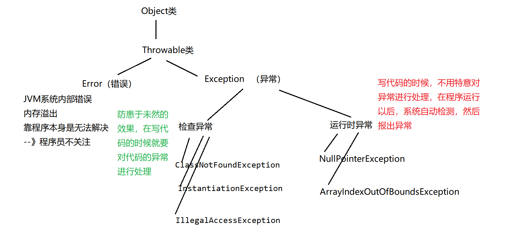
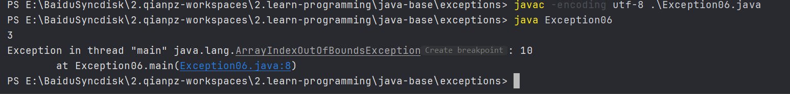

# JAVA基础知识 \- 异常

[[toc]]

> 说在前面的话，本文为个人学习[B站免费的马士兵java初级教程](https://www.bilibili.com/video/BV1RK4y1g7A5/?spm_id_from=333.337.search-card.all.click&vd_source=65c7f6924d2d8ba5fa0d4c448818e08a)后进行总结的文章，本文主要用于<b>JAVA基础知识</b>。

## 【1】引入

> 先看一段代码

```java
import java.util.Scanner;

public class Exception01 {
    //这是一个main方法，是程序的入口：
    public static void main(String[] args) {
        //实现一个功能：键盘录入两个数，求商：
        Scanner sc = new Scanner(System.in);
        System.out.println("请录入第一个数：");
        int num1 = sc.nextInt();
        System.out.println("请录入第二个数：");
        int num2 = sc.nextInt();
        System.out.println("商：" + num1 / num2);
    }
}

```

> 编译：`javac -encoding utf-8 .\Exception01.java`
>
> 运行：`java Exception01`
>
>  正常结果：
>
> 请录入第一个数：
> 20
> 请录入第二个数：
> 4
> 商：5
>
> 当我们将被除数输入0的时候：
>
> ```java
> 请录入第一个数：
> 20
> 请录入第二个数：
> 0
> Exception in thread "main" java.lang.ArithmeticException: / by zero
>         at Exception01.main(Exception01.java:12)
> ```
>
>  当我们输入1个不是数字的字符串的时候：
>
> ```java
> 请录入第一个数：
> 1231啊实打实
> Exception in thread "main" java.util.InputMismatchException
>         at java.util.Scanner.throwFor(Scanner.java:864)
>         at java.util.Scanner.next(Scanner.java:1485)
>         at java.util.Scanner.nextInt(Scanner.java:2117)
>         at java.util.Scanner.nextInt(Scanner.java:2076)
>         at Exception01.main(Exception01.java:9)
> ```
>
> 我们发现程序出错了，这个就是**异常**

> ::: info **异常**
>
> **异常**：Exception：在程序的运行过程中，发生了不正常的现象，阻止了程序的运行，我们称之为发生**异常**。
>
> :::                                                                                                                                                                                                                                                                                                                                                                                                                                                                                                                                                                                                                                                                                                                                          

## 【2】通过`if-else`解决异常

```java
import java.util.Scanner;

public class Exception02 {
    public static void main(String[] args) {
        //实现一个功能：键盘录入两个数，求商：
        Scanner sc = new Scanner(System.in);
        System.out.println("请录入第一个数：");
        if (sc.hasNextInt()) {
            int num1 = sc.nextInt();
            System.out.println("请录入第二个数：");
            if (sc.hasNextInt()) {
                int num2 = sc.nextInt();
                if (num2 == 0) {
                    System.out.println("对不起，除数不能为0");
                } else {
                    System.out.println("商：" + num1 / num2);
                }
            } else {
                System.out.println("对不起，你录入的不是int类型的数据！");
            }
        } else {
            System.out.println("对不起，你录入的不是int类型的数据！");
        }
    }
}
```

> 编译：`javac -encoding utf-8 .\Exception02.java`
>
> 运行：`java Exception02`
>
> 结果:
>
> ```java
> 请录入第一个数：
> 20
> 请录入第二个数：
> 0
> 对不起，除数不能为0
>     
> 请录入第一个数：
> 123asd
> 对不起，你录入的不是int类型的数据！
> ```

> 就这样，通过`if-else`控制语句规避了这2种异常的发生。
>
> 但是有着一些弊端。
>
> - （1）代码臃肿，业务代码和处理异常的代码混在一起。
> - （2）可读性差
> - （3）程序员需要花费大量的经历来维护这个漏洞
> - （4）程序员很难堵住所有的漏洞。

## 【3】JAVA异常处理机制

### 3.1 `try-catch`

> 基于`if-else`处理异常缺点太多，所以java中专门出了一个异常处理机制：
> “异常三连”  `try-catch-finally`

> 对应代码：
>
> ```java
> public class Exception03 {
>     public static void main(String[] args) {
>         //实现一个功能：键盘录入两个数，求商：
>         try {
>             Scanner sc = new Scanner(System.in);
>             System.out.println("请录入第一个数：");
>             int num1 = sc.nextInt();
>             System.out.println("请录入第二个数：");
>             int num2 = sc.nextInt();
>             System.out.println("商：" + num1 / num2);
>         } catch (Exception ex) {
>             System.out.println("对不起，程序出现异常！");
>         }
>         System.out.println("----谢谢你使用计算器111");
>         System.out.println("----谢谢你使用计算器222");
>         System.out.println("----谢谢你使用计算器333");
>         System.out.println("----谢谢你使用计算器444");
>         System.out.println("----谢谢你使用计算器555");
>         System.out.println("----谢谢你使用计算器666");
>     }
> }
> ```

### 3.2 原理

> ::: important 原理
>
> 把可能出现异常的代码放入`try`代码块中，然后将异常封装为对象，被`catch`后面的()中的那个异常对象接收，接收以后：执行`catch`后面的{}里面的代码，然后`try-catch`后面的代码，该怎么执行就怎么执行。
>
> :::

> ::: info 详解
>
> - （1）`try`中没有异常，`catch`中代码不执行。
> - 2）`try`中有异常，catch`进行`捕获：
>   - 如果`catch`中异常类型和你出的异常类型匹配的话：走`catch`中的代码-->进行捕获
>   - 如果`catch`中异常类型和你出的异常类型不匹配的话：不走`catch`中的代码-->没有捕获成功，程序相当于遇到异常了，中断了，后续代码不执行
>
> :::
>
> ::: warning 注意事项
>
> - `try`中如果出现异常，然后用`catch`捕获成功的话，那么`try`中后续的代码是不会执行的。
> - 如果`catch`捕获异常成功，那么`try-catch`后面的代码该执行还是执行没有影响。
>
> :::

### 3.3 `catch`中如何处理异常?

> ```java
> //实现一个功能：键盘录入两个数，求商：
>         try{
>             Scanner sc = new Scanner(System.in);
>             System.out.println("请录入第一个数：");
>             int num1 = sc.nextInt();
>             System.out.println("请录入第二个数：");
>             int num2 = sc.nextInt();
>             System.out.println("商："+num1/num2);
>         }catch(Exception ex){
>             //第一种处理：什么都不写，什么都不做
>             
>             //第二种处理：输出自定义异常信息
>             //System.out.println("对不起，你的代码有问题！");
>             //第三种处理：打印异常信息：
>             /*(1)调用toString方法，显示异常的类名（全限定路径）*/
>             /*System.out.println(ex);
>             System.out.println(ex.toString());*/
>             /*(2)显示异常描述信息对应的字符串，如果没有就显示null
>             System.out.println(ex.getMessage());*/
>             /*(3)显示异常的堆栈信息：将异常信息捕获以后，在控制台将异常的效果给我们展示出来，方便我们查看异常*/
>            /* ex.printStackTrace();*/
>             //第四种处理：抛出异常：
>             throw ex;
>         }
> ```
>
> 看到上述代码,可以知道，我们catch中的代码处理异常有以下4种方式:
>
> 1. 什么都不写，什么都不做，吃掉异常
> 2. 输出异常信息或者打印异常信息到日志中
> 3. 打印异常信息的堆栈
> 4. 抛出异常交由上层调用方进行处理

### 3.4 `try-catch-finally`

```java
import java.util.Scanner;

public class Exception04 {
    public static void main(String[] args) {
        //实现一个功能：键盘录入两个数，求商：
        try {
            Scanner sc = new Scanner(System.in);
            System.out.println("请录入第一个数：");
            int num1 = sc.nextInt();
            System.out.println("请录入第二个数：");
            int num2 = sc.nextInt();
            System.out.println("商：" + num1 / num2);
            System.exit(0);//终止当前的虚拟机执行
            return;
        } catch (ArithmeticException ex) {
            //throw ex;
        } finally {
            System.out.println("----谢谢你使用计算器111");
        }
    }
}
```

> 这里，我们发现无论`catch`的逻辑是如何，无论是否异常，均会执行``finally``的语句。

> 所以我们要思考：
>
> 1. 在什么情况下，`try-catch`后面的代码不执行？
>    1. （1）`throw`抛出异常的情况
>    2. （2）`catch`中没有正常的进行异常捕获
>    3. （3）在`try`中遇到`return`
> 2. 怎么样才可以将 `try-catch`后面的代码  必须执行？
>    1. 只要将必须执行的代码放入`finally`中，那么这个代码无论如何一定执行。
> 3. `return`和`finally`执行顺序？
>    1. 先执行`finally`最后执行`return`
> 4. 什么代码会放在`finally`中呢？
>    1. 关闭数据库资源，关闭`IO`流资源，关闭`socket`资源。
> 5. 有一句话代码很厉害，它可以让`finally`中代码不执行!
>    1. **`System.exit(0);`**  //终止当前的虚拟机执行

### 3.5 多重`catch`

> - 【1】`try`中出现异常以后，将异常类型跟`catch`后面的类型依次比较，按照代码的顺序进行比对，执行第一个与异常类型匹配的`catch`语句
> - 【2】一旦执行其中一条`catch`语句之后，后面的`catch`语句就会被忽略了！
> - 【3】在安排`catch`语句的顺序的时候，一般会将特殊异常放在前面（并列），一般化的异常放在后面。先写子类异常，再写父类异常。
> - 【4】在`JDK1.7`以后，异常新处理方式：可以并列用|符号连接：
>   - 
>
> - 【5】代码示例
>
> ```java
> import java.util.Scanner;
> 
> public class Exception05 {
>     public static void main(String[] args) {
>         //实现一个功能：键盘录入两个数，求商：
>         try {
>             Scanner sc = new Scanner(System.in);
>             System.out.println("请录入第一个数：");
>             int num1 = sc.nextInt();
>             System.out.println("请录入第二个数：");
>             int num2 = sc.nextInt();
>             System.out.println("商：" + num1 / num2);
>         } catch (ArithmeticException ex) {
>             System.out.println("对不起，除数不可以为0");
>         } catch (InputMismatchException ex) {
>             System.out.println("对不起，你录入的数据不是int类型的数据");
>         } catch (Exception ex) {
>             System.out.println("对不起，你的程序出现异常");
>         } finally {
>             System.out.println("----谢谢你使用计算器111");
>         }
>     }
> }
> ```

## 【4】Java异常分类

### 4.1 层次结构



::: warning 注意

- **注意** ： 程序中语法错误，逻辑错误  都不属于上面的`Error`，`Exception`

:::

> 分类：
>
> - 运行时异常
> - 检查异常

### 4.2 运行时异常

```java
public class Exception06 {
    public static void main(String[] args) {
        //运行时异常：
        int[] arr = {1, 2, 3};
        System.out.println(arr.length);
        /*int[] arr2 = null;
        System.out.println(arr2.length);*/
        System.out.println(arr[10]);
    }
}
```



> 在运行的过程中出现的异常则时**运行时异常** 

### 4.3 检查异常

- 处理方式1：try-catch嵌套try-catch
  ```java
  public class Test6 {
      //这是一个main方法，是程序的入口：
      public static void main(String[] args) {
          //检查异常：
          try {
              try {
                  Class.forName("com.msb.test01.Test").newInstance();
              } catch (InstantiationException e) {
                  e.printStackTrace();
              } catch (IllegalAccessException e) {
                  e.printStackTrace();
              }
          } catch (ClassNotFoundException e) {
              e.printStackTrace();
          }
      }
  }
  ```

- 处理方式2：多重catch

```java
public class Test6 {
    //这是一个main方法，是程序的入口：
    public static void main(String[] args) {
        //检查异常：
        try {
            Class.forName("com.msb.test01.Test").newInstance();
        } catch (ClassNotFoundException | InstantiationException | IllegalAccessException e) {
            e.printStackTrace();
        }
    }
}
```

- 处理方式3：throws

  ```java
  public class Test6 {
      //这是一个main方法，是程序的入口：
      public static void main(String[] args) throws ClassNotFoundException, IllegalAccessException, InstantiationException {
          //检查异常：
          Class.forName("com.msb.test01.Test").newInstance();
      }
  }
  ```

## 【5】`throw` 和 `throws `的区别

> 看如下这段代码片段:
>
> ```java
> //这是一个main方法，是程序的入口：
>     public static void main(String[] args) throws Exception {
>         //实现一个功能：两个数相除，当除数为0的时候，程序出现异常。
>         /*try {
>             devide();
>         } catch (Exception e) {
>             e.printStackTrace();
>         }*/
>         devide();
>     }
>     public static void devide() throws Exception {
>         Scanner sc = new Scanner(System.in);
>         System.out.println("请录入第一个数：");
>         int num1 = sc.nextInt();
>         System.out.println("请录入第二个数：");
>         int num2 = sc.nextInt();
>         if(num2 == 0 ){//除数为0 ，制造异常。
>             //制造运行时异常：
>             /*throw new RuntimeException();*/
>             //制造检查异常：
>             /*try {
>                 throw new Exception();
>             } catch (Exception e) {
>                 e.printStackTrace();
>             }*/
>             throw new Exception();
>         }else{
>             System.out.println("商："+num1/num2);
>         }
>     }
> ```
>
> 这里其实很明显可以看到`throw` 和 `throws `的区别
>
> 1. 位置不同
>    1. `throw`使用在方法的内部
>    2. `throws`使用在方法的签名处、声明处
> 2. 内容不同
>    1. `throw`+异常对象（检查异常、运行时异常）
>    2. `throws`+异常的类型（可以多个类型,用英文逗号分隔）
> 3. 作用不同
>    1. `throw`是异常出现的源头，制造异常
>    2. `throws`在方法的声明处，告诉方法的调用者，这个方法可能会出现我声明的这些异常，然后调用者自行去处理这个异常。(要么自行处理要么继续往外抛出去)

## 【6】自定义异常

> 自定义的异常可以继承：运行时异常
>
> ```java
> public class MyException extends RuntimeException {
>     
>     static final long serialVersionUID = -70348971907L;
>     
>     public MyException(){
>     }
>     public MyException(String msg){
>         super(msg);
>     }
> }
> ```
>
> 也可以继承检查异常：
>
> ```java
> public class MyException extends Exception {
>     static final long serialVersionUID = -70348971907L;
>     public MyException(){
>     }
>     public MyException(String msg){
>         super(msg);
>     }
> }
> ```
>
> 如果继承的是运行时异常，那么在使用的时候无需额外处理
> 如果继承的是检查异常，那么使用的时候需要`try-catch`捕获或者`throws`向上抛

## 【7】参考资料

- [B站免费的马士兵java初级教程](https://www.bilibili.com/video/BV1RK4y1g7A5/?spm_id_from=333.337.search-card.all.click&vd_source=65c7f6924d2d8ba5fa0d4c448818e08a)