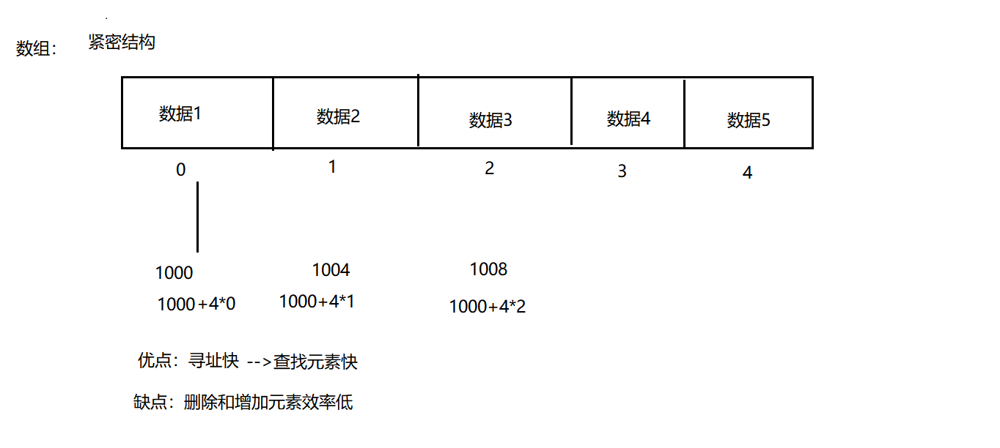
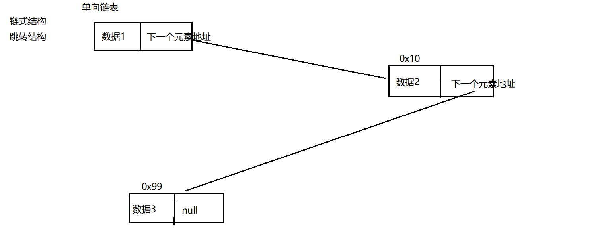
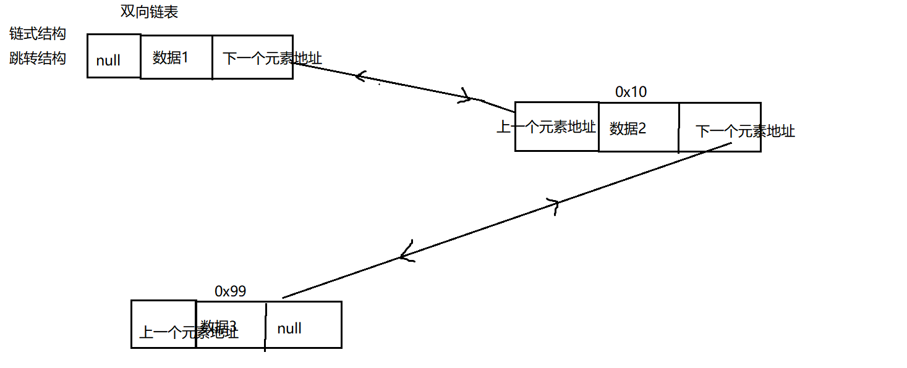
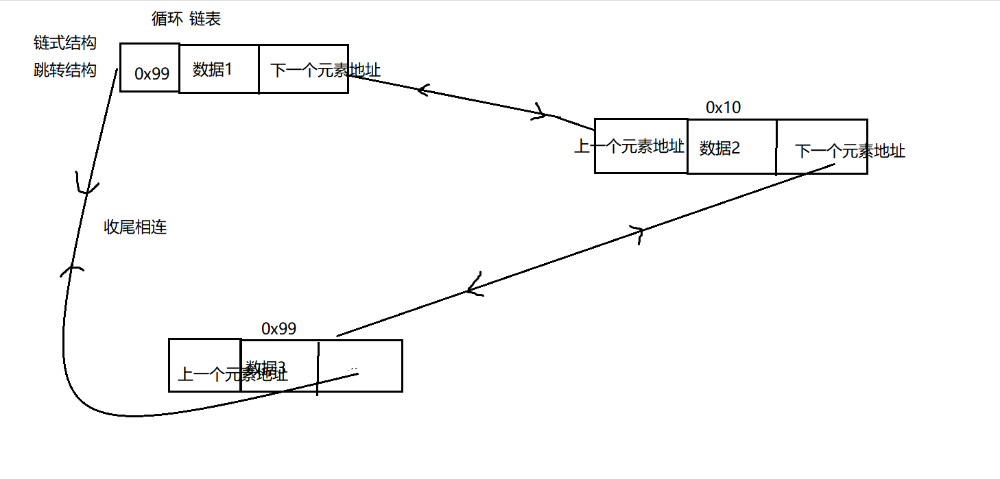
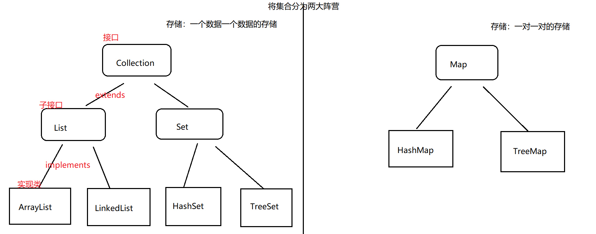

# JAVA基础知识 \- 集合

[[toc]]

> 说在前面的话，本文为个人学习[B站免费的马士兵java初级教程](https://www.bilibili.com/video/BV1RK4y1g7A5/?spm_id_from=333.337.search-card.all.click&vd_source=65c7f6924d2d8ba5fa0d4c448818e08a)后进行总结的文章，本文主要用于<b>JAVA基础知识</b>。

## 【1】算法和数据结构

> ::: important 集合学习的前置基础
>
> 学习集合(容器)，我们不可避免的需要谈到算法和数据结构，这里我们主要做一些简单的介绍，具体的算法和数据结构，我们会再启动一块详细介绍。
>
> :::

### 1.1 算法

> ::: info 算法
>
> <b>算法</b>就是字面意思，就是我们常说的数学解题方法。
>
> 比如：`1+2+3+...+99+100=?`
>
> - 算法1（解法1）：
>   - `1+2=3，3+3=6，6+4=10，...，加到100 ---> 5050`
> - 算法2（解法2）：
>   - `（1+100）* 50 / 2= 101 * 50 = 5050`   即：高斯算法
>
> <b>算法</b>评价的具体的指标：（了解，后续再详解）
>
> - 时间复杂度
> - 空间复杂度
>
> :::

### 1.2 数据结构

#### 1.2.1 数据结构定义

> ::: info 数据结构
>
> - 引自百度百科的定义：
>
> 
>
> - 在计算机科学中，<b>数据结构</b>是一种<b>数据组织</b>、<b>管理和存储</b>的<b>格式</b>
> - 通俗的理解：
>   - <b>数据结构</b>：就是在计算机的缓存，内存，硬盘  如何组织管理数据的。
>   - <b>重点</b>在<b>结构</b>上，是按照什么<b>结构</b>来组织管理我们的数据。
>
> :::

#### 1.2.2 数据结构分类

> - 按照<b>逻辑</b>结构划分分为：
>   - 非线性结构
>   - 线性结构 （数组、链表，图， 树，栈，队列）
> - 按照<b>物理</b>结构划分分为：
>   - 紧密结构，又叫<b>顺序结构</b>
>   - 跳转结构, 又叫<b>链式结构</b>

#### 1.2.3 线性表

- > **线性表的逻辑结构**如图所示:
  >
  > 

- > **线性表定义**：线性表是n个类型相同数据元素的有限序列，通常记作`a0,a1,,,ai-1,ai,ai+1,,,,,an-1)`。

- > **线性表的特点**：
  >
  > 1. **相同的数据结构**
  >
  > > ::: info **相同的数据结构**
  > >
  > > - 在线性表的定义中,我们看到从`a0`到`an-1`的n个数据元素是具有相同属件的亓素。
  > >
  > > - 比如说可以都是数字,例如(12,23,45,56,45)，也可以是宇符,例如(A,B,....Z)
  > >
  > > - 当然也可以是具有更复杂结构的数据元素,例如学生、商品、装备等。
  > >
  > > - 相同数据类型意味着在内存中存储时,每个元素会占用相同的内存空间,便于后续的查询定位。
  > >
  > > :::
  >
  > 2. **序列(顺序的)**
  >
  > > ::: info **序列(顺序的)**
  > >
  > > -   在线性表的相邻数据元素之间存在若序偶关系， 即`ai-1`是`ai`的直接前驱,则`ai`是`ai-1`的直接后续,同时`ai`又是`ai+1`的直接前驱，`ai+1`是ai的直接后续。
  > > - 唯一没有直接前驱的元素`a0` 一端称为表头,唯一没有后续的元素`an-1`一端称为表尾。
  > > -   除了表头和表尾元素外,任何一个元素都有且仅有一个直接前驱和直接后继。
  > >
  > > :::
  >
  > 3. **有限**
  >
  > > ::: info **有限**
  > >
  > > -  线件表中数据元素的个数n定义为线性表的长度, n是个有限值。
  > > - 当n=0时线性表为空表，
  > > -   在非空的线性表中每个数据元索在线性表中都有唯一确定的序号，
  > > -   例如`a0`的序号是0 ,`ai`的序号是i。
  > > -   在一个具有n>0个数据元素的线性表中,数据元素序号的范围是[0, n-1]。
  > >
  > > :::

#### 1.2.4 数组

> 数组就是典型的紧密结构。
>
> 

#### 1.2.5 单向链表



#### 1.2.6 双向链表



#### 1.2.7 循环链表



## 【2】集合的引入

### 2.1 数组的缺点

> - （1）数组一旦指定了长度，那么长度就被确定了，不可以更改。
> - （2）删除，增加元素  效率低。
> - （3）数组中实际元素的数量是没有办法获取的，没有提供对应的方法或者属性来获
> - （4）数组存储：有序，可重复 ，对于无序的，不可重复的数组不能满足要求。

### 2.2 引入集合

> 正因为上面的缺点，引入了一个新的存储数据的结构--> **集合**,也叫做**容器**

> ::: warning 集合一章我们会学习很多集合，为什么要学习这么多集合呢？
>
> A: 因为不同集合底层数据结构不一样。集合不一样，特点也不一样
>
> :::

### 2.3 简要集合的结构图



## 【3】`Collection`

### 3.1 `Collection` 接口的常用方法

> 1. **首先看下`Collection`的接口源码**
>
> ```java
> public interface Collection<E> extends Iterable<E> {
>      int size();
>      boolean isEmpty();
>      boolean contains(Object o);
>      Iterator<E> iterator();
>      Object[] toArray();
>      <T> T[] toArray(T[] a);
>      default <T> T[] toArray(IntFunction<T[]> generator) {
>          return toArray(generator.apply(0));
>      }
>      boolean add(E e);
>      boolean remove(Object o);
>      boolean containsAll(Collection<?> c);
>      boolean addAll(Collection<? extends E> c);
>      boolean removeAll(Collection<?> c);
>      default boolean removeIf(Predicate<? super E> filter) {
>          Objects.requireNonNull(filter);
>          boolean removed = false;
>          final Iterator<E> each = iterator();
>          while (each.hasNext()) {
>              if (filter.test(each.next())) {
>                  each.remove();
>                  removed = true;
>              }
>          }
>          return removed;
>      }
>      boolean retainAll(Collection<?> c);
>      void clear();
>      boolean equals(Object o);
>      int hashCode();
>      @Override
>      default Spliterator<E> spliterator() {
>          return Spliterators.spliterator(this, 0);
>      }
>      default Stream<E> stream() {
>          return StreamSupport.stream(spliterator(), false);
>      }
>      default Stream<E> parallelStream() {
>          return StreamSupport.stream(spliterator(), true);
>      }
> }
> ```
>
> 2. **常用方法梳理**
>
> - 添加元素到集合中：`boolean add(E e);`    
> - 添加A集合到B集合中：`boolean addAll(Collection<? extends E> c);`
> - 删除集合中的某个元素： `boolean remove(Object o);`
>
> 

## 【4】Map

## 【5】Collections工具类

## 【X】参考资料

- [B站免费的马士兵java初级教程](https://www.bilibili.com/video/BV1RK4y1g7A5/?spm_id_from=333.337.search-card.all.click&vd_source=65c7f6924d2d8ba5fa0d4c448818e08a)

