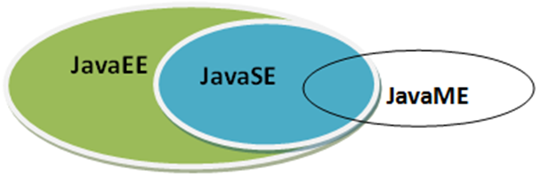

# 初识JAVA - Java体系结构

[[toc]]

> 说在前面的话，本文为个人学习[B站免费的马士兵java初级教程](https://www.bilibili.com/video/BV1RK4y1g7A5/?spm_id_from=333.337.search-card.all.click&vd_source=65c7f6924d2d8ba5fa0d4c448818e08a)后进行总结的文章，本文主要用于<b>初步了解JAVA</b>。

## 【1】JAVASE

**JavaSE**（Java  Standard  Edition）：**标准版**，定位在个人计算机上的应用
这个版本是Java平台的核心，它提供了非常丰富的API来开发一般个人计算机上的应用程序，包括用户界面接口AWT及Swing，网络功能与国际化、图像处理能力以及输入输出支持等。在上世纪90年代末互联网上大放异彩的Applet也属于这个版本。Applet后来为Flash取代，Flash即将被HTML5取代。

## 【2】JAVAEE

**JavaEE**（Java  Enterprise Edition）：**企业版**，定位在服务器端的应用
JavaEE是JavaSE的扩展，增加了用于服务器开发的类库。如：JDBC是让程序员能直接在Java内使用的SQL的语法来访问数据库内的数据；Servlet能够延伸服务器的功能，通过请求-响应的模式来处理客户端的请求；JSP是一种可以将Java程序代码内嵌在网页内的技术；

## 【3】JAVAME

**JavaME**（Java  Micro  Edition）：**微型版**，定位在消费性电子产品的应用上
JavaME是JavaSE的内伸，包含J2SE的一部分核心类，也有自己的扩展类,增加了适合微小装置的类库：javax.microedition.io.*等。该版本针对资源有限的电子消费产品的需求精简核心类库，并提供了模块化的架构让不同类型产品能够随时增加支持的能力。

## 【4】图解

## 【5】参考资料

- [B站免费的马士兵java初级教程](https://www.bilibili.com/video/BV1RK4y1g7A5/?spm_id_from=333.337.search-card.all.click&vd_source=65c7f6924d2d8ba5fa0d4c448818e08a)