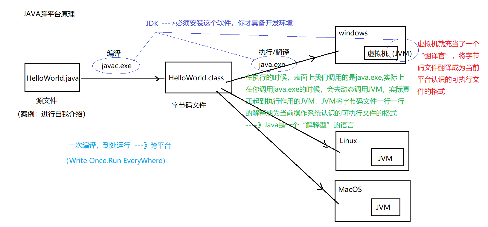
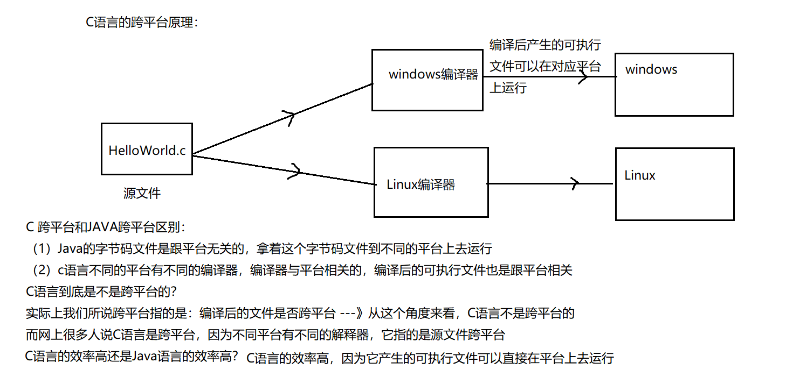
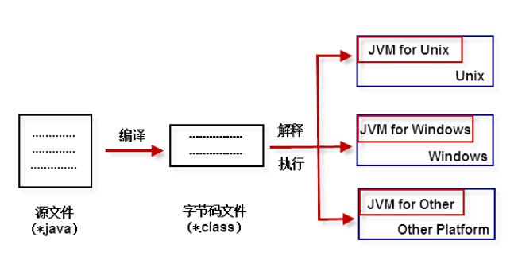

# 初识JAVA - 跨平台性的原理

[[toc]]

> 说在前面的话，本文为个人学习[B站免费的马士兵java初级教程](https://www.bilibili.com/video/BV1RK4y1g7A5/?spm_id_from=333.337.search-card.all.click&vd_source=65c7f6924d2d8ba5fa0d4c448818e08a)后进行总结的文章，本文主要用于<b>初步了解JAVA</b>。

## 【1】JAVA的跨平台

## 【2】C的跨平台

## 【3】总结

**JVM(Java Virtual Machine)** 就是一个虚拟的用于执行bytecode字节码的”虚拟计算机”。他也定义了指令集、寄存器集、结构栈、垃圾收集堆、内存区域。JVM负责将Java字节码解释运行，边解释边运行，这样，速度就会受到一定的影响。
不同的操作系统有不同的虚拟机。Java 虚拟机机制屏蔽了底层运行平台的差别，实现了“一次编译，随处运行”。 Java虚拟机是实现跨平台的核心机制。如图所示：

我们说的语言跨平台是编译后的文件跨平台，而不是源程序跨平台。
接下来我们再比较下两种方式的差异：

- 第一，C语言是编译执行的，编译器与平台相关，编译生成的可执行文件与平台相关；
- 第二，Java是解释执行的，编译为中间码的编译器与平台无关，编译生成的中间码也与平台无关（一次编译，到处运行），中间码再由解释器解释执行，解释器是与平台相关的，也就是不同的平台需要不同的解释器.

## 【4】参考资料

- [B站免费的马士兵java初级教程](https://www.bilibili.com/video/BV1RK4y1g7A5/?spm_id_from=333.337.search-card.all.click&vd_source=65c7f6924d2d8ba5fa0d4c448818e08a)