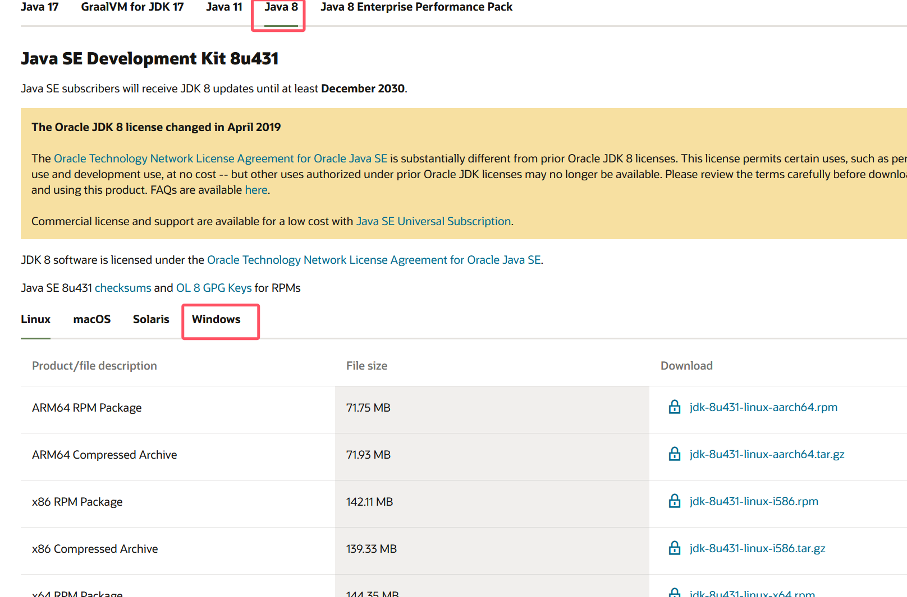
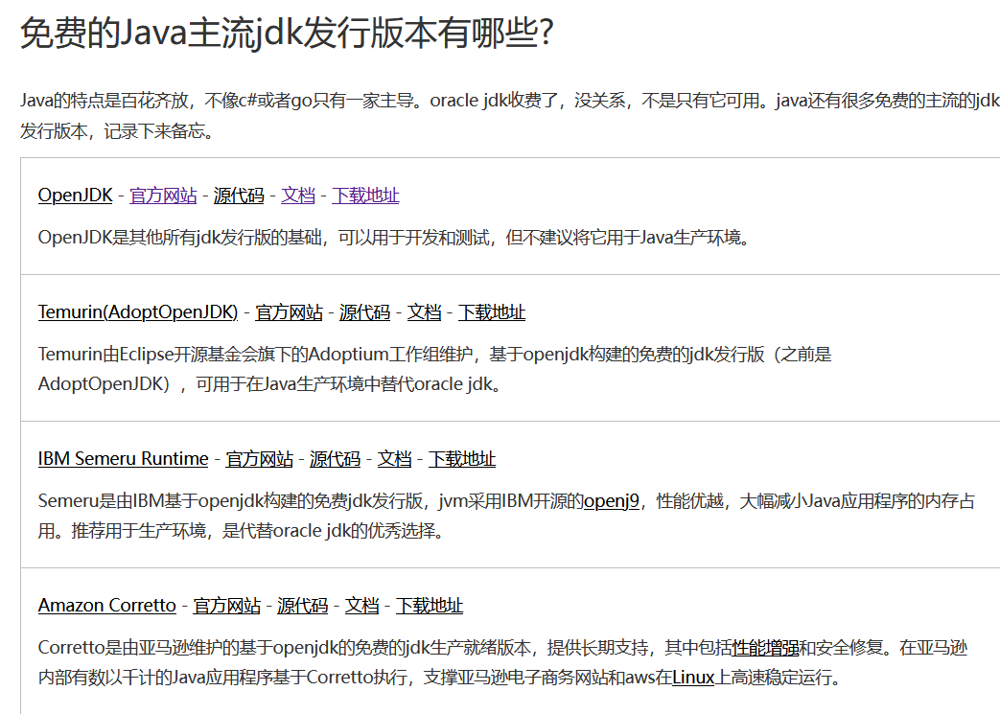
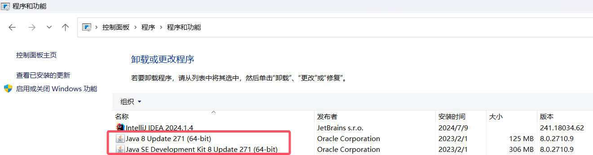
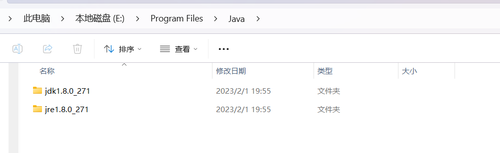
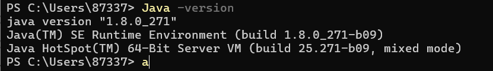
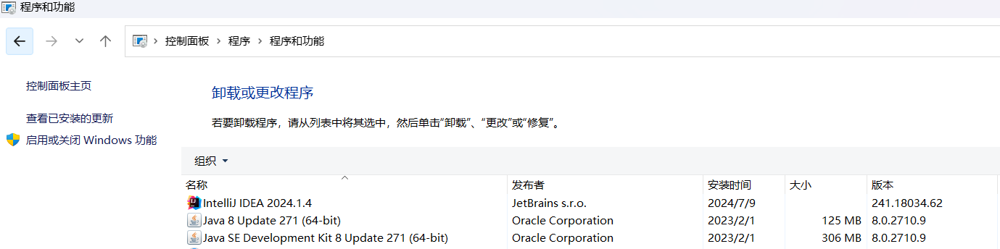
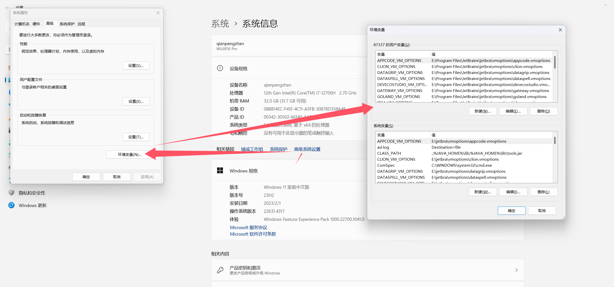
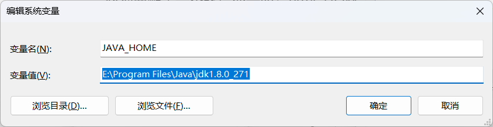
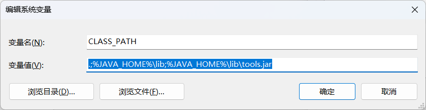
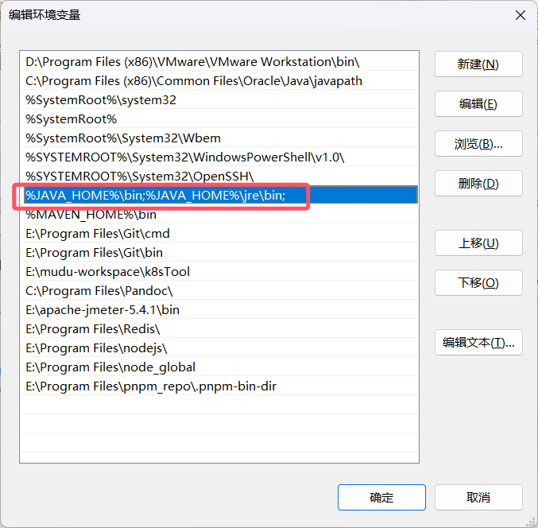

# 初识JAVA - JDK的下载以及环境配置

[[toc]]

> 说在前面的话，本文为个人学习[B站免费的马士兵java初级教程](https://www.bilibili.com/video/BV1RK4y1g7A5/?spm_id_from=333.337.search-card.all.click&vd_source=65c7f6924d2d8ba5fa0d4c448818e08a)后进行总结的文章，本文主要用于<b>初步了解JAVA</b>。

## 【1】JDK下载

从[JAVA基础 - 跨平台性的原理](basic_004.html)我们知道必须本地下载安装了JDK才可以进行开发工作，以下我们则以JDK8为例，介绍下如何进行下载

- 从[官网](https://www.oracle.com/java/technologies/downloads/?er=221886#java8-windows)下载JDK8

  

- 从其他的厂商下载

  - https://www.cnblogs.com/java-blogger/p/java-jdk-Temurin-Semeru-Corretto-Dragonwell-Kona-Zulu-Liberica-GraalVM.html

  - 

    ​	

## 【2】JDK安装

将对应环境的JDK一步一步的进行安装即可

## 【3】卸载JDK

控制面板卸载即可：



## 【4】验证JDK是否安装成功

- （1）方式1：去安装目录下看一眼



- （2）方式2：通过控制命令台查看

  

- （3）方式3：通过控制面板查看

  

## 【5】JDK和JRE

- JDK： Java Development kit   ———>编写Java程序的程序员使用的软件

- JRE : Java Runtime Enviroment  ———>运行Java程序的用户使用的软件

## 【6】环境变量配置

### 【6.1】JAVA_HOME

后续我们会用到一个软件：tomcat，在执行startup.bat的时候会出现闪退问题。

解决：
					必须要配置一个环境变量叫：JAVA_HOME 

​		    对应的值为 jdk的安装路径






### 【6.2】CLASSPATH

> 介绍：
>
> 系统有一个环境变量叫：classpath，现在我们将classpath环境变量显式的写出来。
>
> classpath作用：针对java执行字节码文件而产生的环境变量，只要配置了字节码文件所在的路径以后，那么以后你在任意位置都可以执行对应的字节码文件



``` java
.;%JAVA_HOME%\lib;%JAVA_HOME%\lib\tools.jar
```

### 【6.3】PATH

``` java
%JAVA_HOME%\bin;%JAVA_HOME%\jre\bin;
```



## 【7】参考资料

- [B站免费的马士兵java初级教程](https://www.bilibili.com/video/BV1RK4y1g7A5/?spm_id_from=333.337.search-card.all.click&vd_source=65c7f6924d2d8ba5fa0d4c448818e08a)