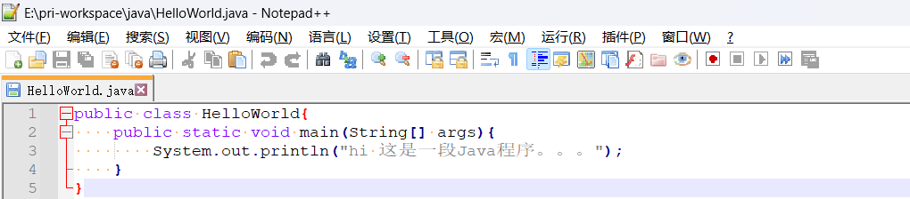
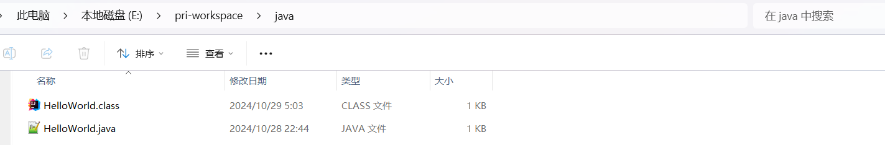
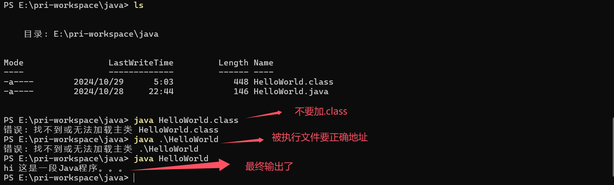
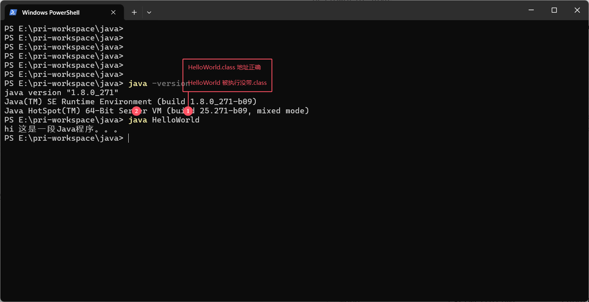

# 初识JAVA - Hello World

[[toc]]

> 说在前面的话，本文为个人学习[B站免费的马士兵java初级教程](https://www.bilibili.com/video/BV1RK4y1g7A5/?spm_id_from=333.337.search-card.all.click&vd_source=65c7f6924d2d8ba5fa0d4c448818e08a)后进行总结的文章，本文主要用于<b>初步了解JAVA</b>。

## 【1】 在nodepad++上写一段代码

在目录`E:\pri-workspace\java`下新建1个文件 **HelloWorld.java** ,然后使用[nodePad++](../../more/essay/essay_004_nodepad.html)打开后，输入以下内容：

``` java
public class HelloWorld{
    public static void main(String[] args){
        System.out.println("hi 这是一段Java程序。。。");
    }
}
```

记得保存  ctrl+s



## 【2】编译

``` java
//编译使用 javac 
```

``` java
PS E:\pri-workspace\java> javac HelloWorld.java
HelloWorld.java:3: 错误: 编码GBK的不可映射字符
        System.out.println("hi 杩欐槸涓?娈礘ava绋嬪簭銆傘?傘??");
                                   ^
HelloWorld.java:3: 错误: 编码GBK的不可映射字符
        System.out.println("hi 杩欐槸涓?娈礘ava绋嬪簭銆傘?傘??");
                                              ^
HelloWorld.java:3: 错误: 编码GBK的不可映射字符
        System.out.println("hi 杩欐槸涓?娈礘ava绋嬪簭銆傘?傘??");
                                                ^
HelloWorld.java:3: 错误: 编码GBK的不可映射字符
        System.out.println("hi 杩欐槸涓?娈礘ava绋嬪簭銆傘?傘??");
                                                 ^
4 个错误
PS E:\pri-workspace\java>
```

如果你是在命令行编译的，可以使用`-encoding`参数指定编码，如：`javac -encoding UTF-8 HelloWorld.java`。

``` java
PS E:\pri-workspace\java> javac -encoding UTF-8 HelloWorld.java
PS E:\pri-workspace\java>
```



## 【3】进行解释/翻译/执行

``` java
//解释/翻译/执行使用 java
```

``` java
PS E:\pri-workspace\java> ls


    目录: E:\pri-workspace\java


Mode                 LastWriteTime         Length Name
----                 -------------         ------ ----
-a----        2024/10/29      5:03            448 HelloWorld.class
-a----        2024/10/28     22:44            146 HelloWorld.java


PS E:\pri-workspace\java> java HelloWorld.class
错误: 找不到或无法加载主类 HelloWorld.class
PS E:\pri-workspace\java> java .\HelloWorld
错误: 找不到或无法加载主类 .\HelloWorld
PS E:\pri-workspace\java> java HelloWorld
hi 这是一段Java程序。。。
PS E:\pri-workspace\java>
```



上面执行过程成功的原因：



2. java命令可以被执行,说明在系统变量中PATH中将jdk/bin/下的java.exe配置OK了。

## 【4】完结

> 至此，我们的第一段代码就完成了，面向HelloWorld编程

## 【5】参考资料

- [B站免费的马士兵java初级教程](https://www.bilibili.com/video/BV1RK4y1g7A5/?spm_id_from=333.337.search-card.all.click&vd_source=65c7f6924d2d8ba5fa0d4c448818e08a)