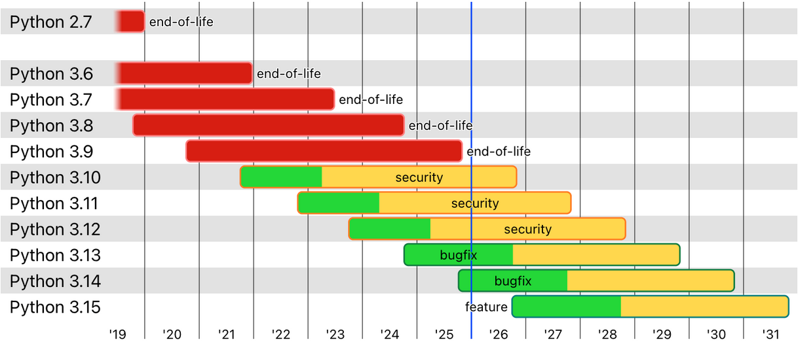

# 第一章: Python3 历史背景

[\[toc]] 

> 说在前面的话，本文为个人学习[Python3 教程](https://www.runoob.com/python3/python3-tutorial.html)后进行总结的文章，本文主要用于<b>Python3基础知识</b>。

## 1. `Python3`简介

> `Python3`是`Python`的`3.0`版本，常被称作`Python 3000`，或者简称`Py3K`.
>
> 相对于 `Python`的早期版本，这是一个较大的升级。为了不带入过多的累赘，`Python 3.0` 在设计的时候没有考虑向下兼容。

> `Python`是一个高层次的结合了**解释性**、**编译性**、**互动性**和**面向对象**的脚本语言。 
>
> `Python`的设计具有很强的可读性，相比其他语言经常使用英文关键字，其他语言的一些标点符号，它具有比其他语言更有特色语法结构。
>
> - **`Python`是一种解释型语言：** 这意味着开发过程中没有了编译这个环节。类似于`PHP`和`Perl`语言。
> - **`Python`是交互式语言：** 这意味着，您可以在一个 `Python`提示符 >>> 后直接执行代码。
> - **`Python`是面向对象语言:** 这意味着`Python`支持面向对象的风格或代码封装在对象的编程技术。
> - **`Python`是初学者的语言：**`Python`对初级程序员而言，是一种伟大的语言，它支持广泛的应用程序开发，从简单的文字处理到 `WWW`浏览器再到游戏。

## 2. `Python`的发展历史

> `Python`是由 `Guido van Rossum` 在八十年代末和九十年代初，在荷兰国家数学和计算机科学研究所设计出来的。
>
> `Python`本身也是由诸多其他语言发展而来的,这包括 `ABC`、`Modula-3`、`C`、`C++`、`Algol-68`、`SmallTalk`、`Unix shell` 和其他的脚本语言等等。
>
> 像 `Perl `语言一样，`Python`源代码同样遵循 `GPL(GNU General Public License)`协议。
>
> 现在 `Python`是由一个核心开发团队在维护，Guido van Rossum 仍然占据着至关重要的作用，指导其进展。
>
> `Python`2.0 于 2000 年 10 月 16 日发布，增加了实现完整的垃圾回收，并且支持 Unicode。
>
> `Python`3.0 于 2008 年 12 月 3 日发布，此版不完全兼容之前的 `Python`源代码。不过，很多新特性后来也被移植到旧的`Python`2.6/2.7版本。
>
> `Python`3.0 版本，常被称为 `Python`3000，或简称 Py3k。相对于 `Python`的早期版本，这是一个较大的升级。
>
> `Python`2.7 被确定为最后一个 `Python`2.x 版本，它除了支持 `Python`2.x 语法外，还支持部分 `Python`3.1 语法。

## 3. `Python`的特点

- **1.易于学习：**`Python`有相对较少的关键字，结构简单，和一个明确定义的语法，学习起来更加简单。
- **2.易于阅读：**`Python`代码定义的更清晰。
- **3.易于维护：**`Python`的成功在于它的源代码是相当容易维护的。
- **4.一个广泛的标准库：**`Python`的最大的优势之一是丰富的库，跨平台的，在`UNIX`，`Windows`和`Macintosh`兼容很好。
- <b>5.互动模式: </b> 互动模式的支持，您可以从终端输入执行代码并获得结果的语言，互动的测试和调试代码片断。
- <b>6.可移植: </b> 基于其开放源代码的特性，`Python`已经被移植（也就是使其工作）到许多平台。
- **7.可扩展：** 如果你需要一段运行很快的关键代码，或者是想要编写一些不愿开放的算法，你可以使用`C`或`C++`完成那部分程序，然后从你的`Python`程序中调用。
- **8.数据库：** `Python`提供所有主要的商业数据库的接口。
- **9.GUI编程：** `Python`支持GUI可以创建和移植到许多系统调用。
- **10.可嵌入:** 你可以将`Python`嵌入到`C/C++`程序，让你的程序的用户获得"脚本化"的能力。

## 4. `Python`的应用

- Youtube - 视频社交网站
- Reddit - 社交分享网站
- Dropbox - 文件分享服务
- 豆瓣网 - 图书、唱片、电影等文化产品的资料数据库网站
- 知乎 - 一个问答网站
- 果壳 - 一个泛科技主题网站
- Bottle - Python微Web框架
- EVE - 网络游戏EVE大量使用Python进行开发
- Blender - 使用Python作为建模工具与GUI语言的开源3D绘图软件
- Inkscape - 一个开源的SVG矢量图形编辑器。
- ...

## 5.`Python` 版本进度

下图展示了 Pyhton 的历史版本及未来版本的维护与发布时间：

