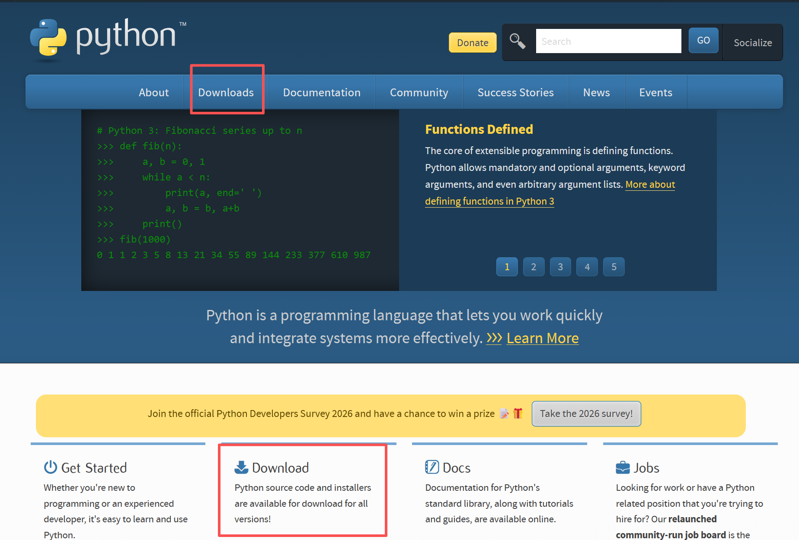
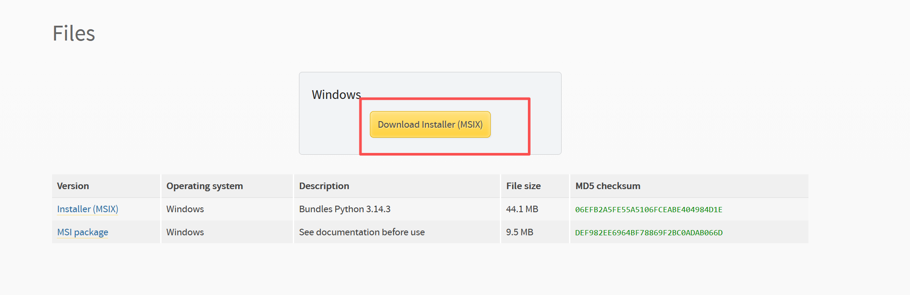
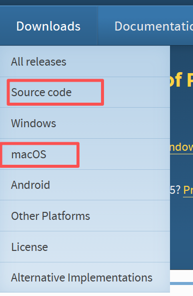
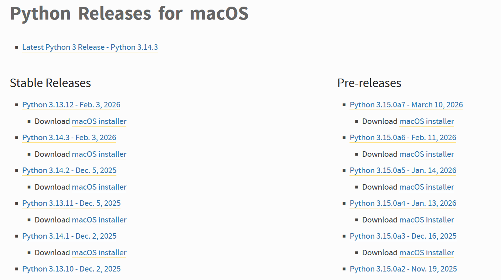
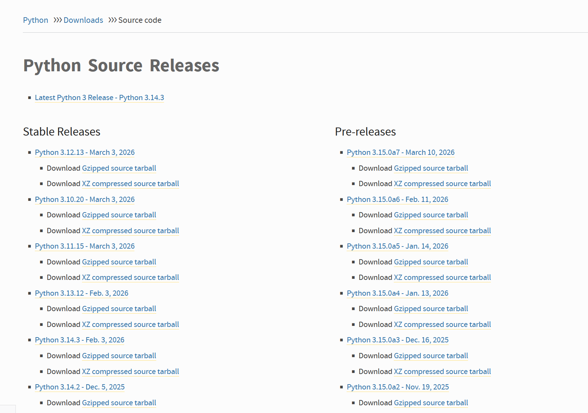
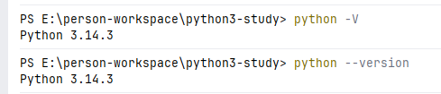
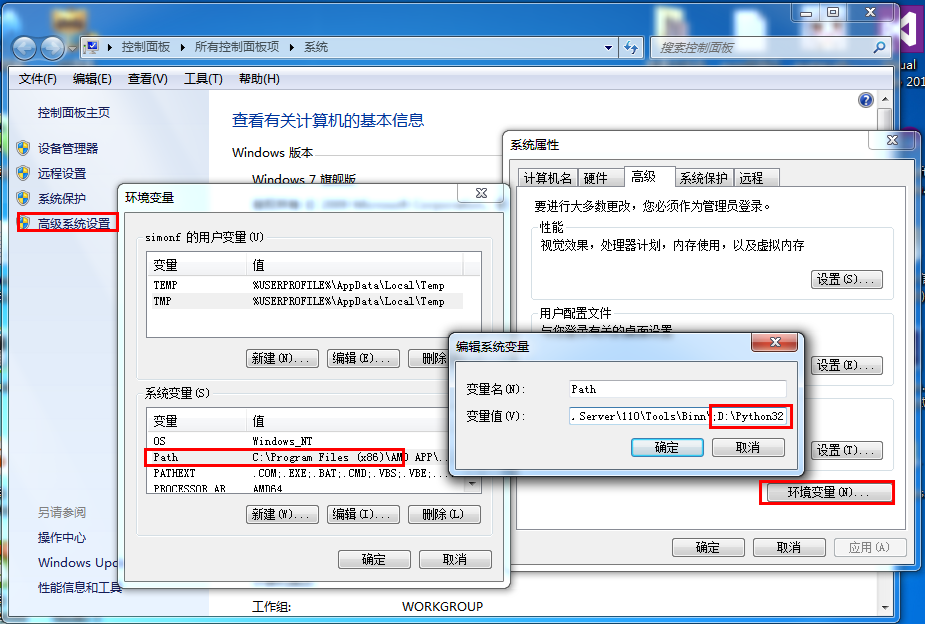
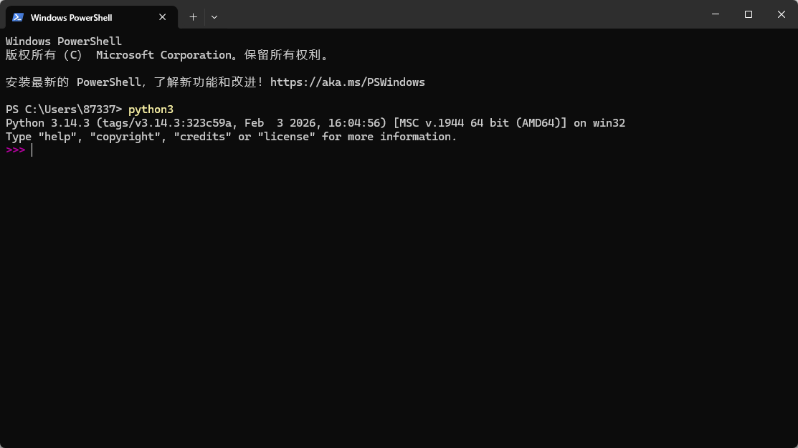

# 第二章: Python3 下载以及环境配置

[[toc]]

> 说在前面的话，本文为个人学习[Python3 教程](https://www.runoob.com/python3/python3-tutorial.html)后进行总结的文章，本文主要用于<b>Python3基础知识</b>。

## 1. `Python3`的环境搭建

Python3 具备出色的跨平台兼容性，可稳定运行在 Windows、Linux、Mac OS X 三大主流操作系统中，同时也支持众多其他平台与环境，包括：

- Unix 系列（Solaris、Linux、FreeBSD、AIX、HP/UX、SunOS、IRIX 等）
- 传统Windows系统（9x/NT/2000）
- 经典Macintosh系统（Intel、PPC、68K架构）
- 其他专用/小众平台（OS/2、多版本DOS、PalmOS、Nokia移动手机、Windows CE、Acorn/RISC OS、BeOS、Amiga、VMS/OpenVMS、QNX、VxWorks、Psion）

此外，Python 还可移植到 Java 及 .NET 虚拟机环境中运行。

## 2. `Python3`下载

- Python3 最新源码，二进制文档，新闻资讯等可以在 Python 的官网查看到。

- Python 官网：https://www.python.org/
- Python3 下载



然后进入到最新的版本的下载页面: https://www.python.org/downloads/release/pymanager-260/, 然后根据系统不同选择对应的安装包，我这边目前是windows系统，故选择windows对应的



若是 Mac系统或者Linux环境则需要下载对应`macOs`和`Source Code`下的安装包进行处理





Linux：



- Python3 提供了完整的中文文档：https://docs.python.org/zh-cn/3/

## 3. `Python3`的安装

### 3.1 windows下的安装

> 将安装包一步步的进行点下去即可。
>
> 记得勾选 **Add Python 3.14.3 to PATH**。
>
> <font style="color:red">注意：如果没有勾选 **Add Python3.14.3 to PATH**，会导致命令行无法识别 `python`/`python3 `命令，需手动配置环境变量。</font>

### 3.2 MacOs下的安装

MAC 系统都自带有 Python  环境，你可以在链接 https://www.python.org/downloads/mac-osx/ 上下载最新版安装。

## 4.验证环境是否OK

验证 Python3 版本打开命令提示符（Windows）或终端（macOS/Linux），执行以下命令：

```shell
# 通用命令（推荐，所有系统兼容）
python3 --version
# 补充：Windows系统若已配置PATH，也可执行
python --version
```

若输出类似 Python 3.14.3 的信息，说明 Python3 安装成功。



## 5. 环境变量配置

如果以上执行 python 命令执行成功，说明环境配置好了，不需要额外配置，这部分内容可以忽略。

程序可执行文件的存放目录常不在系统默认搜索路径中，而系统的 PATH 环境变量（Unix 区分大小写，Windows 不区分）正是用于存储可执行文件的搜索路径。

Mac OS 中若需在非默认目录引用 Python，需手动将 Python 安装目录添加到 PATH 中。

### 在 Unix/Linux 设置环境变量

**注：** **/usr/local/bin/python** 为 Python 安装目录，需替换为你的实际路径。

bash shell（Linux）：

```
export PATH="$PATH:/usr/local/bin/python"
```

csh shell：

```
setenv PATH "$PATH:/usr/local/bin/python"
```

sh/ksh shell：

```
PATH="$PATH:/usr/local/bin/python"
```

### 在 Windows 设置环境变量

若安装 Python3 时未勾选 Add Python.exe to PATH ，会导致命令行无法识别 python/python3 命令，需手动配置环境变量：

- 找到 Python3 的安装路径（如D:\Python3143、C:\Program Files\Python3143），同时找到其下的Scripts文件夹（路径如D:\Python3143\Scripts，pip3 所在目录）。
- 右键「此电脑」→「属性」→「高级系统设置」→「环境变量」。
- 在「用户变量」或「系统变量」中找到 Path 变量，双击编辑。
- 点击「新建」，分别添加 Python3 的安装根路径和Scripts文件夹路径，点击「确定」保存所有配置。



关闭原有命令提示符，重新打开后执行验证命令即可生效。

下面几个应用于 Python 的环境变量说明：

| 环境变量名称              | 核心作用                                                  |
| ------------------------- | --------------------------------------------------------- |
| `PATH`                    | 系统查找 Python 解释器及可执行文件的搜索路径              |
| `PYTHONPATH`              | Python 查找第三方库和自定义模块的搜索路径                 |
| `PYTHONHOME`              | 指定 Python 的安装根目录，告知解释器核心库/标准库存放位置 |
| `PYTHONSTARTUP`           | 指定 Python 交互式解释器启动时自动执行的脚本文件路径      |
| `PYTHONCASEOK`            | Windows 专属，让 Python 导入模块时忽略大小写              |
| `PYTHONDONTWRITEBYTECODE` | 禁止 Python 运行时生成 `.pyc` / `.pyo` 字节码缓存文件     |

## 6.运行Python

有三种方式可以运行 Python：

### 6.1 交互式解释器

你可以通过命令行窗口进入 Python 并开始在交互式解释器中开始编写 Python 代码。

你可以在 Unix、DOS 或任何其他提供了命令行或者 shell 的系统进行 Python 编码工作。

```shell
python3
```



以下为 Python 命令行参数：

| 选项           | 描述                                                         |
| -------------- | ------------------------------------------------------------ |
| -d             | 启用调试模式，在代码解析和解释器运行时显示详细调试信息       |
| -O             | 生成优化代码，编译脚本时生成 .pyo 优化字节码文件（忽略断言语句等调试相关代码） |
| -OO            | 深度优化代码，生成 .pyo 文件并移除代码中的所有文档字符串，进一步减小文件体积 |
| -S             | Python 启动时不自动引入 site 模块，即不加载查找 Python 模块路径的相关配置（如 site-packages 目录） |
| -V / --version | 输出当前安装的 Python 版本号，直接退出解释器                 |
| -vv            | 输出详细的版本信息（包括编译环境、依赖库等额外信息）         |
| -X             | 从 Python 1.6 版本之后，基于内建的异常（仅用于字符串类型）的用法已过时，该参数用于兼容旧版相关特性 |
| -h / --help    | 查看所有 Python 命令行参数的完整帮助说明，直接退出解释器     |
| -c cmd         | 直接在命令行中执行指定的 Python 代码片段（cmd 为字符串格式的代码），无需编写 .py 脚本文件 |
| -m module      | 以模块的形式运行指定的 Python 模块（如 pip、http.server 等），自动查找模块路径并执行 |
| -i             | 执行完指定的 Python 脚本后，自动进入交互式解释器环境，便于后续调试和代码补充执行 |
| -b             | 当遇到字节串（bytes）与字符串（str）不兼容的比较操作时，发出警告信息 |
| -bb            | 当遇到字节串（bytes）与字符串（str）不兼容的比较操作时，直接抛出错误，终止程序运行 |
| -u             | 禁用标准输出（stdout）和标准错误（stderr）的缓冲机制，实现日志或输出内容的实时打印 |
| file           | 指定要执行的 Python 脚本文件路径（绝对路径或相对路径），解释器将加载并运行该文件中的代码 |
| -q             | 进入交互式解释器时，隐藏欢迎信息，直接显示命令提示符         |

### 6.2 命令行脚本

在你的应用程序中通过引入解释器可以在命令行中执行Python脚本，如下所示：

```shell
python script.py
```

**注意：**在执行脚本时，请检查脚本是否有可执行权限。

### 6.3、集成开发环境（IDE：Integrated Development Environment）: PyCharm 

PyCharm 是由 JetBrains 打造的一款 Python IDE，支持 macOS、 Windows、 Linux 系统。

PyCharm 功能 : 调试、语法高亮、Project管理、代码跳转、智能提示、自动完成、单元测试、版本控制……

PyCharm 下载地址 : https://www.jetbrains.com/pycharm/download/

PyCharm 安装地址：https://www.runoob.com/pycharm/pycharm-install.html

Professional（专业版，收费）：完整的功能，可试用 30 天。

Community（社区版，免费）：阉割版的专业版。

## 7.更多必备工具

以下工具是后期学习必备的，你可以先跳过，后期来学习。

### Anaconda 集成环境

Anaconda 发行版包含了 Python。

Anaconda 是一个集成的数据科学和机器学习环境，其中包括了 Python 解释器以及大量常用的数据科学库和工具。

Anaconda 包及其依赖项和环境的管理工具为 conda 命令，文与传统的 Python pip 工具相比 Anaconda 的conda 可以更方便地在不同环境之间进行切换，环境管理较为简单。

Anaconda 详细安装与介绍参考：[Anaconda 教程。](https://www.runoob.com/python-qt/anaconda-tutorial.html)

### uv -- Python 包与环境管理工具

uv 是由 Astral 公司开发的一款 Rust 编写的 Python 包管理器和环境管理器，它的主要目标是提供比现有工具快 10-100 倍的性能，同时保持简单直观的用户体验。

uv 可以替代 pip、virtualenv、pip-tools 等工具，提供依赖管理、虚拟环境创建、Python 版本管理等一站式服务。

uv 详细安装与介绍参考：[uv 教程。](https://www.runoob.com/python3/uv-tutorial.html)

### Jupyter Notebook -- Python 包与环境管理工具

Jupyter Notebook 是一个开源的 Web 交互式计算工具，允许你创建和分享包含**实时代码、可视化图表、公式和文本**的文档。它的名字来源于它支持的三种核心编程语言：**Ju**lia, **Pyt**hon, **R**。

Jupyter Notebook 将代码、说明文字和运行结果组织在同一个 Notebook 文档中，该文档以 JSON 格式保存，由多个有序的单元格组成，每个单元格既可以运行代码，也可以编写 Markdown 文本、展示数学公式、图表或其他富媒体内容。

通过 Jupyter Notebook 我们可以很方便的学习并运行 Python 程序。

Jupyter Notebook 详细安装与介绍参考：[Jupyter Notebook 教程](https://www.runoob.com/jupyter-notebook/jupyter-notebook-tutorial.html)。