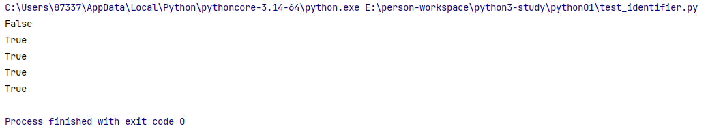
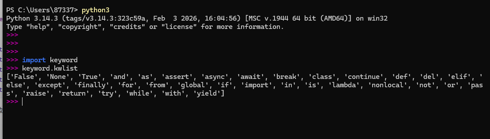
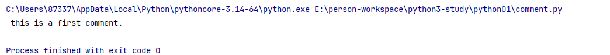
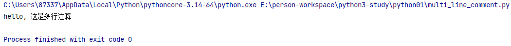
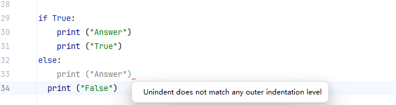
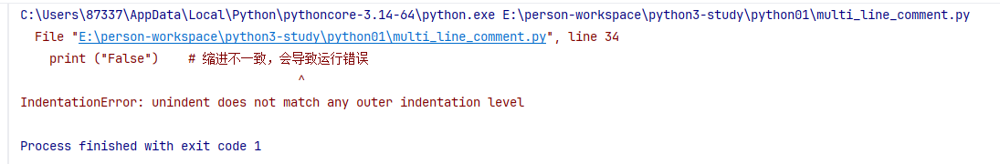
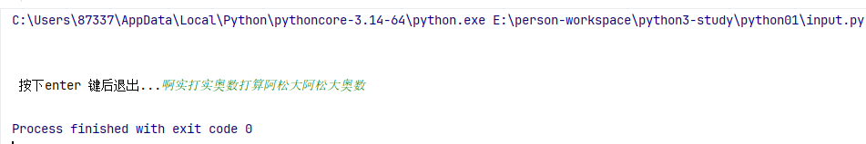

# 第三章: Python3 基础语法

[[toc]]

> 说在前面的话，本文为个人学习[Python3 教程](https://www.runoob.com/python3/python3-tutorial.html)后进行总结的文章，本文主要用于<b>Python3基础知识</b>。

## 1. 编码

默认情况下，`Python3 `源码文件以 **`UTF-8`** 编码，所有字符串都是 `unicode `字符串。

当然你也可以为源码文件指定不同的编码：

```python
# -*- coding: cp-1252 -*-
# -*- coding: utf8 -*-
```

上述定义允许在源文件中使用 `Windows-1252` 字符集中的字符编码，对应适合语言为保加利亚语、白俄罗斯语、马其顿语、俄语、塞尔维亚语。

## 2.标识符

### 2.1 规则

`Python`的**标识符**的规则如下:

- 第一个字符必须以字母（a-z, A-Z）或下划线 _ 。
- 标识符的其他的部分由字母、数字和下划线组成。
- 标识符对大小写敏感，`count `和 `Count `是不同的标识符。
- 标识符对长度无硬性限制，但建议保持简洁（一般不超过 20 个字符）。
- 禁止使用保留关键字，如 `if`、`for`、`class `等不能作为标识符。

### 2.2 例子

合法标识符如下例子:

```python
age = 25                # 普通变量名，最常见
user_name = "Alice"     # 用下划线连接单词，清晰易读
_total = 100            # 下划线开头通常表示“内部使用”或“私有”
MAX_SIZE = 1024         # 全大写通常表示“常量”（固定不变的值）
calculate_area()        # 函数名，动词+名词
StudentInfo             # 类名，首字母大写（驼峰命名法）
__private_var           # 双下划线开头，有特殊含义
```

非法标识符如下例子：

```python
2nd_place = "silver"    # 错误：以数字开头
user-name = "Bob"       # 错误：包含连字符
class = "Math"          # 错误：使用关键字
$price = 9.99          # 错误：包含特殊字符
for = "loop"           # 错误：使用关键字
```

### 2.3 特例

> `Python3 `允许使用 `Unicode `字符作为标识符，可以用中文作为变量名，非 ASCII 标识符也是允许的了。

```python
姓名 = "张三"  # 合法
π = 3.14159   # 合法
圆周率 = 3.1415923 # 合法
```

### 2.4 标识符的测试

```python
#!/usr/bin/python3
# -*- coding: utf8 -*-

# 测试标识符是否合法

def is_valid_identifier(name):
    try:
        exec(f"{name} = None")
        return True
    except:
        return False

print(is_valid_identifier("2var"))  # False
print(is_valid_identifier("var2"))  # True
print(is_valid_identifier("圆周率"))  # True
print(is_valid_identifier("姓名"))  # True
print(is_valid_identifier("π"))  # True
```

执行后如下:



## 3、保留关键字

### 3.1 关键字的查询和罗列

> **保留字**即**关键字**，我们不能把它们用作任何标识符名称。`Python`的标准库提供了一个 `keyword 模块，可以输出当前版本的所有关键字：

```
>>> import keyword
>>> keyword.kwlist
['False', 'None', 'True', 'and', 'as', 'assert', 'async', 'await', 'break', 'class', 'continue', 'def', 'del', 'elif', 'else', 'except', 'finally', 'for', 'from', 'global', 'if', 'import', 'in', 'is', 'lambda', 'nonlocal', 'not', 'or', 'pass', 'raise', 'return', 'try', 'while', 'with', 'yield']
>>> 
```



### 3.2 关键字详解

>  更多 Python 保留关键字参考：[https://www.runoob.com/python3/python3-keyword.html](https://www.runoob.com/python3/python3-keyword.html)。

| **类别**     | **关键字** | **说明**                               |
| ------------ | ---------- | -------------------------------------- |
| **逻辑值**   | `True`     | 布尔真值                               |
|              | `False`    | 布尔假值                               |
|              | `None`     | 表示空值或无值                         |
| **逻辑运算** | `and`      | 逻辑与运算                             |
|              | `or`       | 逻辑或运算                             |
|              | `not`      | 逻辑非运算                             |
| **条件控制** | `if`       | 条件判断语句                           |
|              | `elif`     | 否则如果（else if 的缩写）             |
|              | `else`     | 否则分支                               |
| **循环控制** | `for`      | 迭代循环                               |
|              | `while`    | 条件循环                               |
|              | `break`    | 跳出循环                               |
|              | `continue` | 跳过当前循环的剩余部分，进入下一次迭代 |
| **异常处理** | `try`      | 尝试执行代码块                         |
|              | `except`   | 捕获异常                               |
|              | `finally`  | 无论是否发生异常都会执行的代码块       |
|              | `raise`    | 抛出异常                               |
| **函数定义** | `def`      | 定义函数                               |
|              | `return`   | 从函数返回值                           |
|              | `lambda`   | 创建匿名函数                           |
| **类与对象** | `class`    | 定义类                                 |
|              | `del`      | 删除对象引用                           |
| **模块导入** | `import`   | 导入模块                               |
|              | `from`     | 从模块导入特定部分                     |
|              | `as`       | 为导入的模块或对象创建别名             |
| **作用域**   | `global`   | 声明全局变量                           |
|              | `nonlocal` | 声明非局部变量（用于嵌套函数）         |
| **异步编程** | `async`    | 声明异步函数                           |
|              | `await`    | 等待异步操作完成                       |
| **其他**     | `assert`   | 断言，用于测试条件是否为真             |
|              | `in`       | 检查成员关系                           |
|              | `is`       | 检查对象身份（是否是同一个对象）       |
|              | `pass`     | 空语句，用于占位                       |
|              | `with`     | 上下文管理器，用于资源管理             |
|              | `yield`    | 从生成器函数返回值                     |

## 4. 注释

### 4.1 单行注释

> Python 中的单行注释以 `#` 开头

实例如下:

```python
#!/usr/bin/python3 
# -*- coding: utf-8 -*- 

# 单行注释
# 第一个注释 
print(" this is a first comment.")
```

执行以上代码，输出结果为：



### 4.2 多行注释

> Python 中的多行注释可以使用 多个 `#`  或者 `'''` 和 `"""`  为开始和结尾
>
> <font style="color:red">注意：不可以嵌套，会报错</font>

实例如下：

```python
#!/usr/bin/python3 
# -*- coding: utf-8 -*- 

# 多行注释

# 第一种 多个#
# 第一个注释
# 第二个注释
# 第X个注释...
# ....

# 第二种 '''   '''
'''
这是第二种多行注释
....
....
'''

# 第三种  """ """
"""
这是第三种多行注释
....
....
"""

print("hello, 这是多行注释")
```

执行以上代码，输出结果如下：



## 5. 行与缩进

> Python 最具特色的就是使用缩进来表示代码块,不需要使用大括号`{}`
>
> 缩进的空格数是可变的，但是同一个代码块的语句必须包含相同的缩进空格数。

实例如下:

```python
#!/usr/bin/python3 
# -*- coding: utf-8 -*- 
if True:
    print ("True")
else:
    print ("False")
```

以下代码最后一行语句缩进数的空格数不一致，会导致运行错误：

```python
#!/usr/bin/python3 
# -*- coding: utf-8 -*- 
if True:
    print ("Answer")
    print ("True")
else:
    print ("Answer")
  print ("False")    # 缩进不一致，会导致运行错误
```





## 6、多行语句

> Python 通常是一行写完一条语句，但如果语句很长，我们可以使用反斜杠 `\`来实现多行语句

```py
total = item_one + \
        item_two + \
        item_three
```

实例如下：

```python
#!/usr/bin/python3 
# -*- coding: utf-8 -*- 
item_one = 1
item_two = 2
item_three = 3
total = item_one + \
        item_two + \
        item_three
print(total) # 输出为 6
```

> 注意：
>
> - 在  `[]`, `{}`, 或 `()`中的多行语句，不需要使用反斜杠 `\`

例如：

```python
total = ['item_one', 'item_two', 'item_three',
        'item_four', 'item_five']
```

## 7.空行

> 函数之间或类的方法之间用空行分隔，表示一段新的代码的开始。类和函数入口之间也用一行空行分隔，以突出函数入口的开始。
>
> 空行与代码缩进不同，空行并不是 Python 语法的一部分。书写时不插入空行，Python 解释器运行也不会出错。但是空行的作用在于分隔两段不同功能或含义的代码，便于日后代码的维护或重构。
>
> **记住：**空行也是程序代码的一部分。

## 8.等待用户输入

> `input(prompt)`  这个会在控制台等待用户输入

执行下面的程序在按回车键前就会等待用户输入：

```python
#!/usr/bin/python3
# -*- coding: utf8 -*-


# 等待用户输入

input("\n\n 按下enter 键后退出...")
```

以上代码中 ，\n\n 在结果输出前会输出两个新的空行。一旦用户按下 **enter** 键时，程序将退出。



## 9.同一行显示多条语句

> Python 可以在同一行中使用多条语句，语句之间使用分号 `;` 分割

以下是一个简单的实例：

```python
#!/usr/bin/python3
 
import sys; x = 'runoob'; sys.stdout.write(x + '\n')
```

使用脚本执行以上代码，输出结果为：

```python
runoob
```

使用交互式命令行执行，输出结果为：

```python
PS C:\Users\87337> python3
Python 3.14.3 (tags/v3.14.3:323c59a, Feb  3 2026, 16:04:56) [MSC v.1944 64 bit (AMD64)] on win32
Type "help", "copyright", "credits" or "license" for more information.
>>>
>>> import sys; x = 'runoob'; sys.stdout.write(x + "\n");
runoob
7
>>>
```

此处的 7 表示字符数，**runoob** 有 6 个字符，**\n** 表示一个字符，加起来 **7** 个字符。

```python
>>> import sys
>>> sys.stdout.write(" hi ")    # hi 前后各有 1 个空格
 hi 4
```

## 10.多个语句构成代码组

> 缩进相同的一组语句构成一个代码块，我们称之**代码组**。
>
> 像if、while、def和class这样的复合语句，首行以`关键字`开始，以冒号(` :` )结束，该行之后的一行或多行代码构成**代码组**。
>
> 我们将首行及后面的代码组称为一个**子句**(`clause`)。

如下实例：

```python
if expression : 
   suite 
elif expression : 
   suite 
else : 
   suite 
```

## 11.Print 输出

> **print** 默认输出是换行的，如果要实现不换行需要在变量末尾加上 `end=""`：

实例如下：

```python
#!/usr/bin/python3
# -*- coding: utf-8 -*-

# print 默认换行

x = 'a'
y = 'b'
print(x)
print(y)

# print变量末尾+ ,end=" " 则不换行

print(" 下面 a,b 不换行")
print(x, end = "")
print(y, end = "")
```

执行后，结果如下：

```python
a
b
 下面 a,b 不换行
ab
```

## 12. import 与 from...import

在 `python `用 `import `或者 `from...import` 来导入相应的模块。

将整个模块(`somemodule`)导入，格式为： `import somemodule`

从某个模块中导入某个函数,格式为： `from somemodule import somefunction`

从某个模块中导入多个函数,格式为：` from somemodule import firstfunc, secondfunc, thirdfunc`

将某个模块中的全部函数导入，格式为：` from somemodule import *`

### 12.1 导入 `sys` 模块

```python
#!/usr/bin/python3
# -*- coding: utf-8 -*-

import sys 
print('================Python import mode==========================') 
print ('命令行参数为:') 
for i in sys.argv:    
    print (i) 
    print ('\n python 路径为', sys.path)
```

### 12.2 导入 `sys`模块的 `argv`,`path` 成员

```python
#!/usr/bin/python3
# -*- coding: utf-8 -*-

from sys import argv,path  #  导入特定的成员  
print('================python from import===================================') 
print('path:',path) # 因为已经导入path成员，所以此处引用时不需要加sys.path
```

## 13. 命令行参数

很多程序可以执行一些操作来查看一些基本信息，Python可以使用-h参数查看各参数帮助信息：

```
$ python -h
usage: python [option] ... [-c cmd | -m mod | file | -] [arg] ...
Options and arguments (and corresponding environment variables):
-c cmd : program passed in as string (terminates option list)
-d     : debug output from parser (also PYTHONDEBUG=x)
-E     : ignore environment variables (such as PYTHONPATH)
-h     : print this help message and exit

[ etc. ]
```

我们在使用脚本形式执行 Python 时，可以接收命令行输入的参数，具体使用可以参照 [Python 3 命令行参数](https://www.runoob.com/python3/python3-command-line-arguments.html)。

