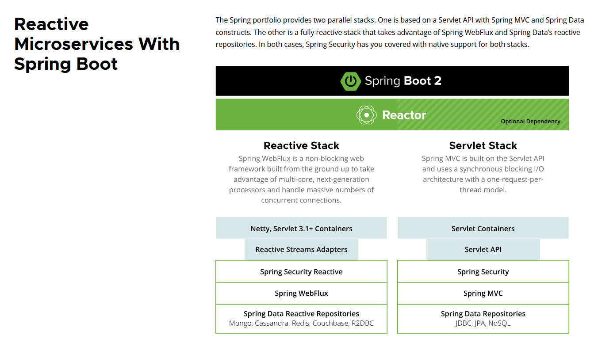

# 第一章: 走进响应式编程

[[toc]]

> 说在前面的话，本文为个人学习[SpringBoot3响应式编程精讲](https://www.bilibili.com/video/BV1gsYEeLEuM?spm_id_from=333.788.videopod.episodes&vd_source=65c7f6924d2d8ba5fa0d4c448818e08a)后进行总结的文章，本文主要用于<b>响应式编程</b>。

## 【1】响应式编程介绍

我们可以打开Spring的官网找到Reactive的相关资料。[响应式资料链接](https://spring.io/reactive)

### 1.1 什么是响应式?

::: info  什么是响应式(Reactive)系统?  

首先，看下官网定义

> # Reactive
>
>   Reactive systems have certain characteristics that make them ideal for low-latency, high-throughput workloads. Project Reactor and the Spring  portfolio work together to enable developers to build enterprise-grade  reactive systems that are responsive, resilient, elastic, and  message-driven.

翻译过来则是:

> # 响应式 (Reactive)
>
> 响应式系统具有某些特性，使其成为处理‌**低延迟、高吞吐量工作负载**‌的理想选择。Project Reactor 框架与 Spring 产品组合协同工作，帮助开发者构建具有‌**响应灵敏、弹性恢复、灵活伸缩和消息驱动**‌特性的企业级响应式系统。

:::

可以发现，**响应式** 其实就是1个目标词汇，它的效果为：

- **低延迟				 low-latency**

- **高吞吐量               high-throughput** 

- **高负载                 high-workloads**

**响应式** 的特性有以下4个:

- **响应灵敏    responsive**

- **弹性恢复    resilient**

- **灵活伸缩    elastic**

- **消息驱动    message-driven**

### 1.2 什么是响应式处理?

::: info 什么是响应式处理？ 

官方定义如下：

> #  What is reactive processing?
>
> Reactive processing is a paradigm that enables developers build  non-blocking, asynchronous applications that can handle back-pressure  (flow control).

翻译过来如下:

> # 什么是响应式处理?
>
> **响应式处理**‌是一种编程范式，使开发者能够‌**构建非阻塞、异步的应用程序**‌，并能处理**背压机制(流量控制)** 

:::

#### 术语解析

1. **非阻塞(Non-blocking)** ‌: 
   应用程序线程无需等待 I/O 操作完成，可立即处理其他任务。
2. ‌**异步(Asynchronous)** ‌ ‌: 
   任务执行无需严格顺序，通过事件驱动机制触发后续操作。
3. ‌**背压(Back-pressure)** ‌ ‌: 
   消费者动态控制数据流量的机制，防止生产端过载导致系统崩溃。

> 此范式通过 ‌**Reactive Streams 规范**‌（如 Project Reactor 实现）提供标准化流控支持5，是构建高吞吐、低延迟系统的核心方案。

### 1.3 为什么需要用到响应式处理?

::: info 为什么需要用到响应式处理?

官方说法如下：

> # Why use reactive processing?
>
> Reactive systems better utilize modern processors. Also, the  inclusion of back-pressure in reactive programming ensures better  resilience between decoupled components.

翻译过来则是:

> # 为何采用响应式处理?
>
>  响应式系统能更充分地‌**发挥现代处理器的效能**‌。此外，响应式编程中引入的‌**背压机制(Back-pressure)** ‌，可显著增强‌**解耦组件间的系统弹性**

:::

::: important **响应式处理** 的**核心价值** 如下:

>  **现代的处理器效能优化** 
>
> - 传统的阻塞模型难以利用多核CPU的资源，**响应式** 则可以通过异步非阻塞调用 最大化硬件利用率
>
> - 例如： 单线程异步处理万级并发请求 如：`Netflix` 网关

> **背压的弹性价值** 
>
> - **问题场景** 
>   - 生产者(如数据源)速率 >  消费者(如服务) 的处理能力的时候，则会导致内存溢出或者服务崩溃
> - **解决机制** 
>   - 消费者通过背压动态反馈需求，生产者自适应调整数据流速(如 TCP滑动窗口的软件实现)
> - **架构收益** 
>   - 解耦组件间形成自调节流量缓冲带,避免级联故障

> **响应式架构** 通过 **资源效率**  +  **流控韧性** 成为了云原生和微服务的核心支撑技术。

::: 

### 1.4  **基于 Spring Boot 的响应式微服务架构**‌

> 从图中我们可以看到，我们以前使用的`SpringMVC`架构，即右边的`Servlet Stack`,`Servlet 堆栈`，它是**阻塞IO架构** ,`One-Request-Per-Thread`模型。

> 而我们的基于`SpringBoot`的响应式微服务架构，即左边的图，`Reactive Stack`, `响应式堆栈`,它最底层基于`netty`,`Servlet 3.1+ Containers`，实现了`Reactive Streas Adapters` , 从而又有了`Spring WebFlux`、`Spring Security Reactive` 等框架。它是**异步非阻塞IO模型** ,可以使用少量的线程支撑更多的并发请求。

## 【2】 响应式编程学习路线图

## 【3】参考资料

- [SpringBoot3响应式编程精讲](https://www.bilibili.com/video/BV1gsYEeLEuM?spm_id_from=333.788.videopod.episodes&vd_source=65c7f6924d2d8ba5fa0d4c448818e08a)