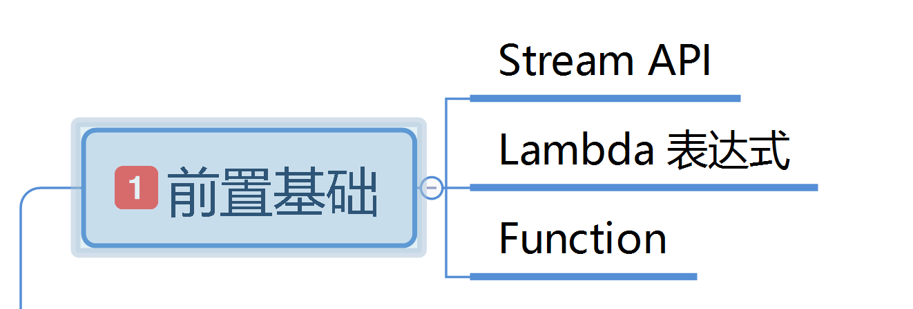
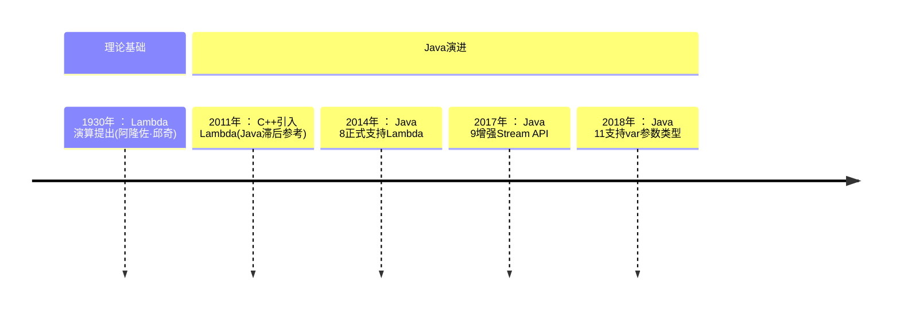

# 第二章: 前置基础学习

[[toc]]

> 说在前面的话，本文为个人学习[SpringBoot3响应式编程精讲](https://www.bilibili.com/video/BV1gsYEeLEuM?spm_id_from=333.788.videopod.episodes&vd_source=65c7f6924d2d8ba5fa0d4c448818e08a)后进行总结的文章，本文主要用于<b>响应式编程</b>。

## 【1】前置基础学习图



## 【2】 Lambda 表达式

### 2.1  info Lambda 表达式定义

::: info Lambda 表达式定义

- **`Lambda` 表达式**  ：这是 `Java8` 中最具代表性的**语法糖**，它允许你将函数作为方法参数传递，或者将代码像数据一样处理。`Lambda` 表达式可以极大地简化匿名内部类的写法。

- **语法糖** ： **语法糖**（`Syntactic Sugar`）是指在计算机语言中添加的某种语法，这种语法对语言的功能并没有影响，但是更方便程序员使用。它可以让代码更加简洁、易读，提升开发效率

:::

::: important Lambda表达式的**本质** 和**设计目标** 

- **本质** ：**匿名函数** 的简介表示法，用于实现**函数式接口** (仅含1个抽象方法的接口)
- **设计目标** : 简化匿名内部类写法，支持函数式编程范式

:::

### 2.2 Lambda 表达式的语法

#### 2.2.1 语法

``` java
(parameters) -> {expression_or_statements}
```

#### 2.2.2 语法构成解析

| 组成部分     | 说明                                             |
| ------------ | ------------------------------------------------ |
| `parameters` | 形参列表（可省略类型声明，单参数时可省略括号）   |
| `->`         | Lambda操作符（箭头符号）                         |
| `expression` | 单条表达式（可省略`{}`和`return`）               |
| `statements` | 代码块（多条语句需`{}`包裹，显式`return`返回值） |

#### 2.2.3 Labmda的历史简介



### 2.3 Lambda 表达式的演进过程

> 下面我们从代码角度，1个类 从上到下的执行顺序，以及注释来慢慢演进`Lambda` 表达式

``` java
package com.learn.stream.api.lambda;

// 以前写一个接口
interface MyInterface {
    int sum(int a, int b);
}

interface MyNoParamInterface {
    Integer no();
}

// 然后写一个它的实现类
class MyImpl implements MyInterface {
    @Override
    public int sum(int a, int b) {
        return a + b;
    }
}

/**
 * 学习Lambda表达式
 *
 * @author qianpengzhan
 * @since 2025/6/27 17:02
 */
public class LambdaLearn {

    public static void main(String[] args) {
        //1. 自己创建实现类去实现
        MyInterface myInterface = new MyImpl();
        System.out.println(myInterface.sum(10, 20));

        //2. 创建匿名实现类
        MyInterface myInterface1 = new MyInterface() {
            @Override
            public int sum(int a, int b) {
                return a * b;
            }
        };
        System.out.println(myInterface1.sum(10, 20));
        // 可以到上述匿名实现类的写法 非常的冗余 ---> 就这样 引出了 lambda表达式

        //3. 使用lambda表达式 那么怎么写呢？ 实际上就觉得冗余的去掉 比如 new MyInterface { 和 }
        // 以及 @Overide public int sum这些类型、修饰符、方法名称都是不可变的东西 去掉  然后 使用动态的写法 加上操作符 ->
        MyInterface myInterface2 = (int a, int b) -> {
            return a * b;
        };
        System.out.println(myInterface2.sum(10, 20));
        // 从上述代码可以看到 其实 lambda表达式就是  参数列表 + 操作符号(->) + 方法体
        // 同样我们也看出来 我们只要会写匿名实现类 自然就会写 lambda 表达式了
        // 上述代码 其实还可以再次简化 上述为1个完整的写法

        // 3.1 简化写法一 参数类型可以不写  接口定义 参数类型是固定的. 而且参数变量名也是可以改的，随意定义
        MyInterface myInterface3 = (a, b) -> {
            return a * a + b * b;
        };
        System.out.println(myInterface3.sum(10, 20));

        // 3.2 简化写法二 最少参数形式  因为上述是固定了2个参数，有些无参方法就可以如下写法
        // 去上面定义1个无参方法的接口
        MyNoParamInterface myNoParamInterface = () -> {
            return 10;
        };
        System.out.println(myNoParamInterface.no());

        // 3.3 简化写法三  方法体若是只有1行代码 {}都可以省略
        MyNoParamInterface myNoParamInterface1 = () -> 20;
        System.out.println(myNoParamInterface1.no());

        // 4.综上所述, lambda表达式简化了很多代码。
        // 在java中,只要是函数式接口,就可以使用lambda表达式。
    }
}
```

## 【3】函数式接口

### 3.1 什么是函数式接口?

::: info 什么是函数式接口？

> **函数式接口是仅包含一个抽象方法的接口**‌（允许包含默认方法、静态方法和Object类中的公共方法）。它是Java 8为支持Lambda表达式引入的核心概念，是Lambda表达式的‌**目标类型**‌。

:::

### 3.2 函数式接口的关键特性

> 特性如下:
>
> - 单抽象方法原则
> - @FunctionalInterface 注解
> - 允许包含的方法类型

#### 3.2.1 单抽象方法原则

> - 必须只有1个未实现的抽象方法

``` java
package com.learn.stream.api.lambda;

// ✔️ 合法函数式接口
@FunctionalInterface   // 加上此注解后,若多定义抽象方法未实现会编译报错
interface ValidFunctionalInterface {
    void printName(String name);  // 唯一抽象方法

    // 允许默认方法
    default void log() {
        System.out.println("Logged");
    }
}

// ❌ 非法（包含两个抽象方法）
interface InvalidFunctionalInterface {
    void method1();

    void method2();  // 编译报错
}

/**
 * 函数式接口学习
 *
 * @author qianpengzhan
 * @since 2025-06-27 17:52:36
 */
public class FunctionalInterfaceLearn {
    public static void main(String[] args) {

    }
}

```

#### 3.2.2 @FunctionalInterface 注解

> - 非强制但‌**强烈推荐使用**‌，帮助编译器检查接口合法性

``` java
// ✔️ 合法函数式接口
@FunctionalInterface   // 加上此注解后,若多定义抽象方法未实现会编译报错
interface ValidFunctionalInterface {
    void printName(String name);  // 唯一抽象方法

    // 允许默认方法
    default void log() {
        System.out.println("Logged");
    }
}
```

#### 3.2.3 允许包含的方法类型

| 方法类型            | 是否允许 | 示例                     |
| ------------------- | -------- | ------------------------ |
| 单个抽象方法        | ✅        | `void run()`             |
| 默认方法（default） | ✅        | `default void log()`     |
| 静态方法（static）  | ✅        | `static void check()`    |
| Object类公共方法    | ✅        | `boolean equals(Object)` |


## 【X】参考资料

- [SpringBoot3响应式编程精讲](https://www.bilibili.com/video/BV1gsYEeLEuM?spm_id_from=333.788.videopod.episodes&vd_source=65c7f6924d2d8ba5fa0d4c448818e08a)

