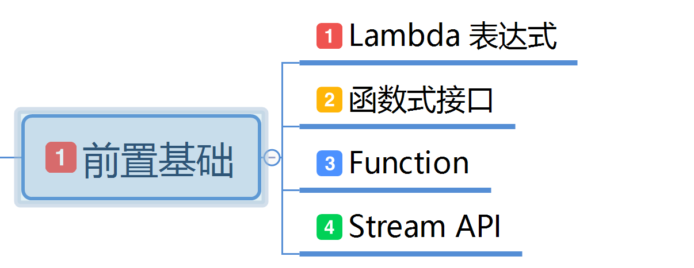
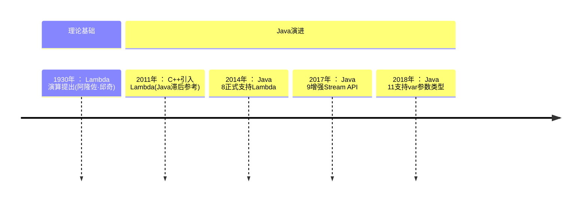
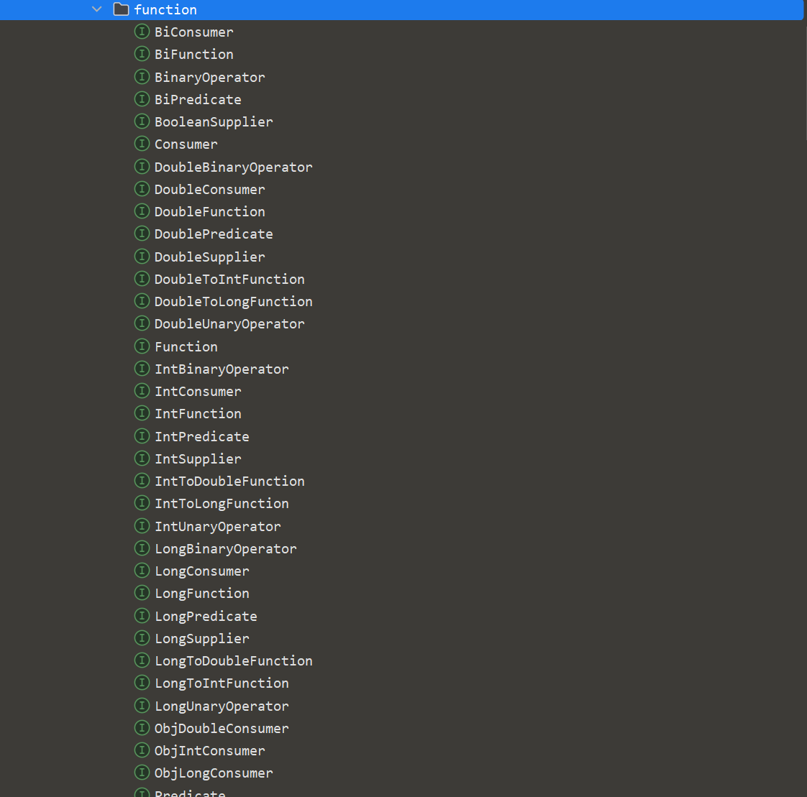
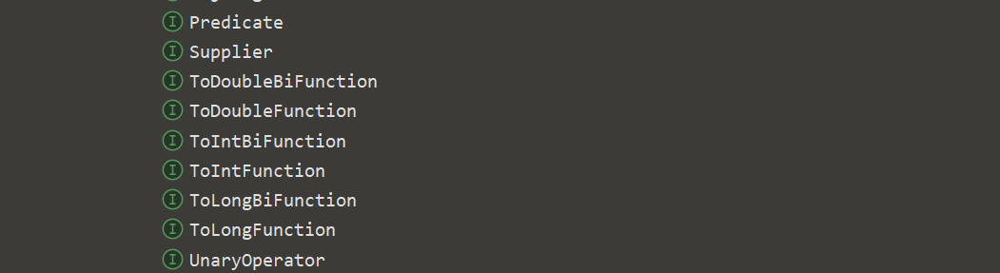
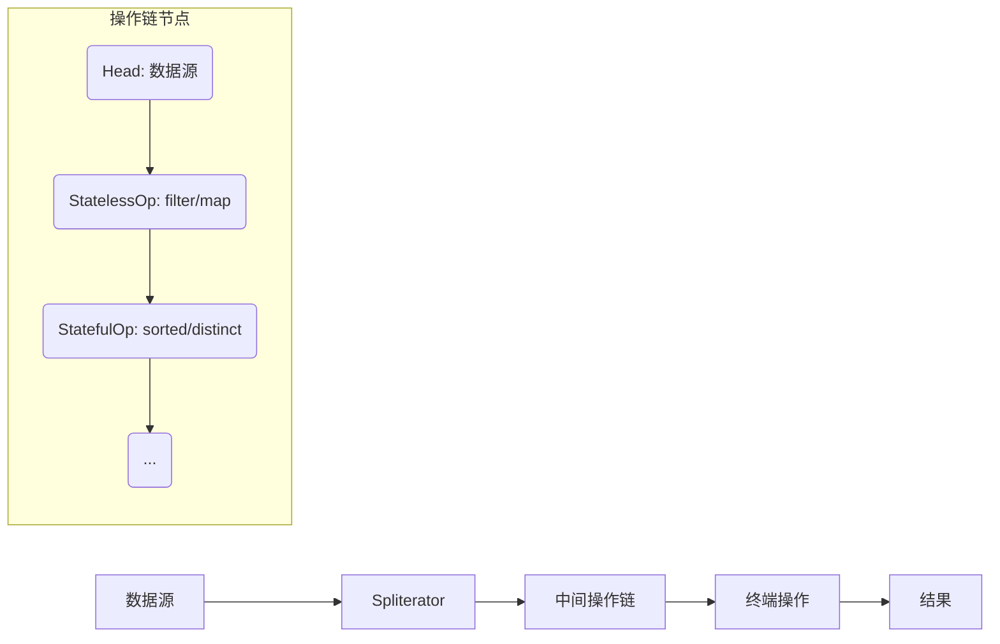
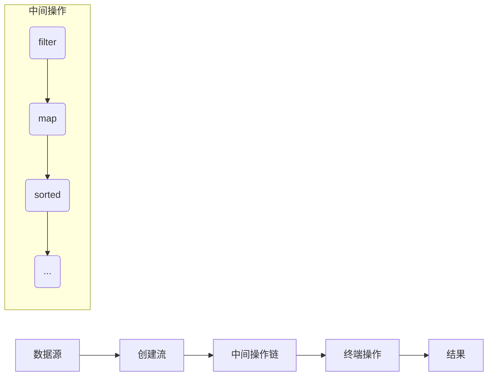

# 第二章: 前置基础学习

[[toc]]

> 说在前面的话，本文为个人学习[SpringBoot3响应式编程精讲](https://www.bilibili.com/video/BV1gsYEeLEuM?spm_id_from=333.788.videopod.episodes&vd_source=65c7f6924d2d8ba5fa0d4c448818e08a)后进行总结的文章，本文主要用于<b>响应式编程</b>。

## 【1】前置基础学习图



## 【2】 Lambda 表达式

### 2.1  info Lambda 表达式定义

::: info Lambda 表达式定义

- **`Lambda` 表达式**  ：这是 `Java8` 中最具代表性的**语法糖**，它允许你将函数作为方法参数传递，或者将代码像数据一样处理。`Lambda` 表达式可以极大地简化匿名内部类的写法。

- **语法糖** ： **语法糖**（`Syntactic Sugar`）是指在计算机语言中添加的某种语法，这种语法对语言的功能并没有影响，但是更方便程序员使用。它可以让代码更加简洁、易读，提升开发效率

:::

::: important Lambda表达式的**本质** 和**设计目标** 

- **本质** ：**匿名函数** 的简介表示法，用于实现**函数式接口** (仅含1个抽象方法的接口)
- **设计目标** : 简化匿名内部类写法，支持函数式编程范式

:::

### 2.2 Lambda 表达式的语法

#### 2.2.1 语法

``` java
(parameters) -> {expression_or_statements}
```

#### 2.2.2 语法构成解析

| 组成部分     | 说明                                             |
| ------------ | ------------------------------------------------ |
| `parameters` | 形参列表（可省略类型声明，单参数时可省略括号）   |
| `->`         | Lambda操作符（箭头符号）                         |
| `expression` | 单条表达式（可省略`{}`和`return`）               |
| `statements` | 代码块（多条语句需`{}`包裹，显式`return`返回值） |

#### 2.2.3 Labmda的历史简介



### 2.3 Lambda 表达式的演进过程

> 下面我们从代码角度，1个类 从上到下的执行顺序，以及注释来慢慢演进`Lambda` 表达式

``` java
package com.learn.stream.api.lambda;

// 以前写一个接口
interface MyInterface {
    int sum(int a, int b);
}

interface MyNoParamInterface {
    Integer no();
}

// 然后写一个它的实现类
class MyImpl implements MyInterface {
    @Override
    public int sum(int a, int b) {
        return a + b;
    }
}

/**
 * 学习Lambda表达式
 *
 * @author qianpengzhan
 * @since 2025/6/27 17:02
 */
public class LambdaLearn {

    public static void main(String[] args) {
        //1. 自己创建实现类去实现
        MyInterface myInterface = new MyImpl();
        System.out.println(myInterface.sum(10, 20));

        //2. 创建匿名实现类
        MyInterface myInterface1 = new MyInterface() {
            @Override
            public int sum(int a, int b) {
                return a * b;
            }
        };
        System.out.println(myInterface1.sum(10, 20));
        // 可以到上述匿名实现类的写法 非常的冗余 ---> 就这样 引出了 lambda表达式

        //3. 使用lambda表达式 那么怎么写呢？ 实际上就觉得冗余的去掉 比如 new MyInterface { 和 }
        // 以及 @Overide public int sum这些类型、修饰符、方法名称都是不可变的东西 去掉  然后 使用动态的写法 加上操作符 ->
        MyInterface myInterface2 = (int a, int b) -> {
            return a * b;
        };
        System.out.println(myInterface2.sum(10, 20));
        // 从上述代码可以看到 其实 lambda表达式就是  参数列表 + 操作符号(->) + 方法体
        // 同样我们也看出来 我们只要会写匿名实现类 自然就会写 lambda 表达式了
        // 上述代码 其实还可以再次简化 上述为1个完整的写法

        // 3.1 简化写法一 参数类型可以不写  接口定义 参数类型是固定的. 而且参数变量名也是可以改的，随意定义
        MyInterface myInterface3 = (a, b) -> {
            return a * a + b * b;
        };
        System.out.println(myInterface3.sum(10, 20));

        // 3.2 简化写法二 最少参数形式  因为上述是固定了2个参数，有些无参方法就可以如下写法
        // 去上面定义1个无参方法的接口
        MyNoParamInterface myNoParamInterface = () -> {
            return 10;
        };
        System.out.println(myNoParamInterface.no());

        // 3.3 简化写法三  方法体若是只有1行代码 {}都可以省略
        MyNoParamInterface myNoParamInterface1 = () -> 20;
        System.out.println(myNoParamInterface1.no());

        // 4.综上所述, lambda表达式简化了很多代码。
        // 在java中,只要是函数式接口,就可以使用lambda表达式。
    }
}
```

## 【3】函数式接口

### 3.1 什么是函数式接口?

::: info 什么是函数式接口？

> **函数式接口是仅包含一个抽象方法的接口**‌（允许包含默认方法、静态方法和Object类中的公共方法）。它是Java 8为支持Lambda表达式引入的核心概念，是Lambda表达式的‌**目标类型**‌。

:::

### 3.2 函数式接口的关键特性

> 特性如下:
>
> - 单抽象方法原则
> - @FunctionalInterface 注解
> - 允许包含的方法类型

#### 3.2.1 单抽象方法原则

> - 必须只有1个未实现的抽象方法

``` java
package com.learn.stream.api.lambda;

// ✔️ 合法函数式接口
@FunctionalInterface   // 加上此注解后,若多定义抽象方法未实现会编译报错
interface ValidFunctionalInterface {
    void printName(String name);  // 唯一抽象方法

    // 允许默认方法
    default void log() {
        System.out.println("Logged");
    }
}

// ❌ 非法（包含两个抽象方法）
interface InvalidFunctionalInterface {
    void method1();

    void method2();  // 编译报错
}

/**
 * 函数式接口学习
 *
 * @author qianpengzhan
 * @since 2025-06-27 17:52:36
 */
public class FunctionalInterfaceLearn {
    public static void main(String[] args) {

    }
}

```

#### 3.2.2 @FunctionalInterface 注解

> - 非强制但‌**强烈推荐使用**‌，帮助编译器检查接口合法性

``` java
// ✔️ 合法函数式接口
@FunctionalInterface   // 加上此注解后,若多定义抽象方法未实现会编译报错
interface ValidFunctionalInterface {
    void printName(String name);  // 唯一抽象方法

    // 允许默认方法
    default void log() {
        System.out.println("Logged");
    }
}
```

#### 3.2.3 允许包含的方法类型

| 方法类型            | 是否允许 | 示例                     |
| ------------------- | -------- | ------------------------ |
| 单个抽象方法        | ✅        | `void run()`             |
| 默认方法（default） | ✅        | `default void log()`     |
| 静态方法（static）  | ✅        | `static void check()`    |
| Object类公共方法    | ✅        | `boolean equals(Object)` |

### 3.3 为什么需要函数式接口?

> - **为了支持Lambda表达式** ：Lambda 的本质就是函数式表达式的实例。

``` java 
public class FunctionalInterfaceLearn {
    public static void main(String[] args) {
        // 函数式接口的实例就是 lambda 表达式
        ValidFunctionalInterface v1 = name -> System.out.println("Hello " + name);
        v1.printName("Peety");
    }
}
```

### 3.4 函数式接口的注意事项

1. ‌<b>`Object` 类的方法不算抽象方法</b>：

   ```java
   @FunctionalInterface
   interface ValidInterface {
       void execute();
       String toString();  // Object 的方法，不计入抽象方法
       boolean equals(Object obj);  // 同样不计入
   }
   ```

2. ‌**默认方法不破坏函数式接口**‌：

   ```java
   @FunctionalInterface
   interface Calculator {
       int calculate(int a, int b);  // 抽象方法
       
       default void log() {  // 默认方法，允许存在
           System.out.println("Calculating...");
       }
   }
   ```

### 3.5 Lambda 表达式的简单使用

#### 3.5.1 替代匿名内部类

``` java
package com.learn.stream.api.lambda;

/**
 * Lambda 使用场景
 *
 * @author qianpengzhan
 * @since 2025/6/30 9:53
 */
public class LambdaUseScene {

    public static void main(String[] args) {
        // 1. 替代匿名实现类
        // 传统runnable 匿名类处理
        Runnable r1 = new Runnable() {
            @Override
            public void run() {
                System.out.println("run1");
            }
        };
        r1.run();

        // lambda表达式
        Runnable r2 = () -> System.out.println("run2");
        r2.run();
    }
}
```

#### 3.5.2 集合操作 (使用Stream API)

::: important Stream  API 有哪些接口?

在 `java.util.function` 包中提供了常用函数式接口： **(后续详细学习)** 

| 接口             | 抽象方法            | 作用         | Lambda 示例                       |
| ---------------- | ------------------- | ------------ | --------------------------------- |
| `Supplier<T>`    | `T get()`           | 无参返回结果 | `() -> "Hello"`                   |
| `Consumer<T>`    | `void accept(T t)`  | 消费一个参数 | `s -> System.out.println(s)`      |
| `Function<T, R>` | `R apply(T t)`      | 转换参数类型 | `s -> s.length()`                 |
| `Predicate<T>`   | `boolean test(T t)` | 条件判断     | `s -> s.isEmpty()`                |
| `Runnable`       | `void run()`        | 无参无返回值 | `() -> System.out.println("Run")` |

:::

``` java
package com.learn.stream.api.lambda;

import java.util.Arrays;
import java.util.List;

/**
 * Lambda 使用场景
 *
 * @author qianpengzhan
 * @since 2025/6/30 9:53
 */
public class LambdaUseScene {

    public static void main(String[] args) {
        // ... 省略1

        // 2. 操作集合
        // 以前我们都是直接 for询环遍历集合
        List<String> list1 = Arrays.asList("a", "b", "c");
        for (String s : list1) {
            System.out.println(s);
        }
        // 现在使用lambda 表达式
        list1.forEach(System.out::println);					// Consumer 函数式接口
        list1.stream()
                .filter(s -> s.startsWith("a"))      		// Predicate 函数式接口
                .map(String::toUpperCase)                   // Function 函数式接口
                .forEach(System.out::println);              // Consumer 函数式接口
    }
}

```

### 3.6 Lambda表达式和函数式接口总结

> 函数式接口的核心是 ‌<b>“一个抽象方法”</b>，它是 Java 函数式编程的基石。通过 Lambda 表达式和方法引用，可以简洁地实现接口，使代码更紧凑、可读性更强，尤其适用于回调、事件处理和集合操作等场景。

## 【4】Function 接口

### 4.1 概念

> - 引子
>
>   Function 是 Java8 引入的核心函数式接口之一，属于顶层函数式接口，位于 `java.util.function` 包中, 主要用于表示 <b>"接受1个参数并返回一个结果参数"</b> 的函数式操作。

::: info Function 函数式接口的基本概念

> Function 接口是一个泛型接口, 通过源码，可以看到其定义如下:
>
> ```java
> package java.util.function;
> import java.util.Objects;
> @FunctionalInterface
> public interface Function<T, R> {
>     /**
>      * 输入1个参数, 返回1个结果参数
>      */
>     R apply(T t);
>     default <V> Function<V, R> compose(Function<? super V, ? extends T> before) {
>         Objects.requireNonNull(before);
>         return (V v) -> apply(before.apply(v));
>     }
>     default <V> Function<T, V> andThen(Function<? super R, ? extends V> after) {
>         Objects.requireNonNull(after);
>         return (T t) -> after.apply(apply(t));
>     }
>     static <T> Function<T, T> identity() {
>         return t -> t;
>     }
> }
> ```

> 可以发现，它是一个函数式接口，包含一个抽象方法 `apply(T t)`，接受类型为 T 的参数，返回类型为 R 的结果‌，然后包含`compose`、`andThen`、`identity` 3个默认方法。

:::

### 4.2 主要方法介绍

> <b>apply(T t)</b> ：核心方法，应用函数到给定参数
>
> <b>compose(Function before)</b>‌：先执行 before 函数，再执行当前函数
>
> <b>andThen(Function after)</b>‌：先执行当前函数，再执行 after 函数
>
> <b>identity()</b>：静态方法，返回一个总是返回其输入参数的函数

### 4.3 核心特性

> <b>类型转换</b>：Function 的核心作用是将一种数据类型<b>转换</b>为另一种数据类型‌
>
> ‌<b>Lambda 支持</b>：可以通过 Lambda 表达式简洁地实现 Function 接口
>
> ‌<b>方法引用</b>：支持通过方法引用来创建 Function 实例
>
> ‌<b>链式操作</b>：提供 `andThen` 和 `compose` 方法支持函数组合

### 4.4 基础用法

> - 类型转换
> - 进制转换

``` java
package com.learn.stream.api.function;

import java.util.function.Function;

/**
 * Function 函数式接口 学习和详细用法
 *
 * @author qianpengzhan
 * @since 2025/6/30 10:29
 */
public class FunctionLearn {
    public static void main(String[] args) {
        // Function最最核心的特性就是参数T转换为参数R
        // 那么它的第一个应用就是类型转换
        // 1. 字符串类型转为整型  lambda 表达式替代匿名实现类 去实例化 Function
        Function<String, Integer> f1 = s -> Integer.parseInt(s);
        System.out.println(f1.apply("123"));
        // 其简化写法 :: 即调用某个类的某个方法 下面就是 调用Integer这个类的parseInt方法 作为Function的实例化对象
        Function<String, Integer> f2 = Integer::parseInt;
        System.out.println(f2.apply("123"));

        // 2.进制转换 意思就是 f2 字符串先转为整型 然后整型再转为16进制字符串
        Function<String, String> f3 = f2.andThen(Integer::toHexString);
        System.out.println(f3.apply("123"));
    }
}

// 执行后的结果:
123
123
7b  ----> 123的16进制
```

### 4.5 复杂用法 

> Function的 复杂用户其实就是  和 Stream API 相结合使用 ，这里简单写一个例子，后面学习 Stream API 的用法时可以详细介绍。

``` java
package com.learn.stream.api.function;

import java.util.List;
import java.util.function.Function;

/**
 * Function 函数式接口 学习和详细用法
 *
 * @author qianpengzhan
 * @since 2025/6/30 10:29
 */
public class FunctionLearn {
    public static void main(String[] args) {
        // Function最最核心的特性就是参数T转换为参数R
        // 。。。。

        // 3.和Stream API 相结合使用
        var names = List.of("Tom", "Petty", "Jerry", "James");
        List<String> list = names.stream()
                .map(String::toUpperCase)  // 这里就是使用 Function<String,String> f = String::toUpperCase  字符串转大写
                .toList();
        System.out.println(list);
    }
}
// 执行结果： [TOM, PETTY, JERRY, JAMES]
```

### 4.5 Function 类使用的注意事项

> 1. ‌**空值处理**‌：Function不自动处理null，需要显式检查
> 2. ‌**异常处理**‌：apply方法抛出的异常需要捕获或声明
> 3. ‌**性能考虑**‌：复杂函数可能影响性能，特别是链式调用时
> 4. ‌**线程安全**‌：无状态的Function实例是线程安全的
>
> Function接口是Java函数式编程的重要基础，合理使用可以大幅简化代码并提高可读性‌

### 4.6 Java内置 Function

> 查询 `java.util.function` 包, 我们可以发现有很多的接口，如下图：





> 以上的接口，我们可以按照入参和出参进行分类。

#### 4.6.1 无入参无出参

> 这种只有1个 Runnable  r = () -> {};

``` java
// 1. 无入参 无出参 调用 run()  运行方法  我们把他称之为 普通函数
Runnable runnable = () -> {
    System.out.println("this is 无入参 无出参的 函数式接口, 即 普通函数式接口");
};
runnable.run();
```

> 我们把这种称之为 **"普通函数"** 

#### 4.6.2 无入参有出参

``` java
// 2. 有入参 无出参  使用 Consumer 调用 accept() 接收 我们把它称之为 消费者函数
BiConsumer<String, String> biConsumer = (str, str2) -> {
    System.out.println("您的姓名: " + str + ", \r\n 您的性别: " + str2);
};
biConsumer.accept("张三", "男");
```

> 我们把这种称之为 **"消费者函数"** 

#### 4.6.3 有入参无出参

``` java
// 3.无入参  有出参 使用 Supplier 调用 get() 获取 我们把它称之为 提供者函数
Supplier<Integer> supplier = () -> {
    return 1;
};
Integer i = supplier.get();
System.out.println(i);
```

我们把这种称之为 **"提供(生产)者函数"**  

####  4.6.4 有入参有出参

``` java
// 4.有入参 有出参 使用 Function 调用 apply() 应用 我们把它称之为 多功能函数
ToDoubleBiFunction<Double, Double> toDoubleBiFunction = Double::sum;
System.out.println(toDoubleBiFunction.applyAsDouble(1D, 2D));
```

我们把这种称之为 **"多功能函数"**  

#### 4.6.5 条件判断

```java
// 5.条件判断 就是输入1个值  判断这个值 在这个函数中是否为true
Predicate<Integer> predicate = x -> x > 3;
System.out.println(predicate.test(1));  // false
```

> 我们把这种称之为 **"流程控制函数"**  

#### 4.6.6 源码

```java
package com.learn.stream.api.function;

import java.util.function.BiConsumer;
import java.util.function.Predicate;
import java.util.function.Supplier;
import java.util.function.ToDoubleBiFunction;

/**
 * Java 内置 function 学习
 *
 * @author qianpengzhan
 * @since 2025/6/30 13:18
 */
public class InnerFunctionLearn {
    public static void main(String[] args) {
        // 1. 无入参 无出参 调用 run()  运行方法  我们把他称之为 普通函数
        Runnable runnable = () -> {
            System.out.println("this is 无入参 无出参的 函数式接口, 即 普通函数式接口");
        };
        runnable.run();

        // 2. 有入参 无出参  使用 Consumer 调用 accept() 接收 我们把它称之为 消费者函数
        BiConsumer<String, String> biConsumer = (str, str2) -> {
            System.out.println("您的姓名: " + str + ", \r\n 您的性别: " + str2);
        };
        biConsumer.accept("张三", "男");

        // 3.无入参  有出参 使用 Supplier 调用 get() 获取 我们把它称之为 提供者函数
        Supplier<Integer> supplier = () -> {
            return 1;
        };
        Integer i = supplier.get();
        System.out.println(i);

        // 4.有入参 有出参 使用 Function 调用 apply() 应用 我们把它称之为 多功能函数
        ToDoubleBiFunction<Double, Double> toDoubleBiFunction = Double::sum;
        System.out.println(toDoubleBiFunction.applyAsDouble(1D, 2D));

        // 5.条件判断 就是输入1个值  判断这个值 在这个函数中是否为true
        Predicate<Integer> predicate = x -> x > 3;
        System.out.println(predicate.test(1));  // false
    }
}
```

## 【5】Stream API 

### 5.1 定义

::: info 什么是Stream?

> Stream 是 Java8 引入的<b>声明式数据流处理器</b>， 基于函数式编程，支持对集合、数组、i/O 等数据源的链式操作，不存粗数据而是通过流水线计算生成结果。

:::

### 5.2 核心特性

| **特性**‌     | ‌**说明**‌                                                     |
| ------------ | ------------------------------------------------------------ |
| ‌**惰性求值**‌ | 中间操作（如 `filter`）延迟执行，终端操作（如 `collect`）触发计算‌。 |
| ‌**并行处理**‌ | `parallelStream()` 利用 `ForkJoinPool` 实现多核加速‌。        |
| ‌**不可复用**‌ | 流只能被消费一次，终端操作后自动关闭‌。                       |

### 5.3 核心 Stream API 接口 

#### 5.3.1. 创建流

> **顺序流**‌：`stream()`
>  ▸ 单线程顺序处理数据。
>
> ‌**并行流**‌：`parallelStream()`
>  ▸ 自动拆分任务，利用多核加速（底层使用Fork/Join框架）。‌

| ‌**方法**‌      | ‌**示例**‌                             | ‌**场景**‌                       |
| ------------- | ------------------------------------ | ------------------------------ |
| 集合创建      | `list.stream()`                      | 集合数据处理‌13                 |
| 数组创建      | `Arrays.stream(new int[]{1,2,3})`    | 数组转换‌23                     |
| 文件 I/O 创建 | `Files.lines(Paths.get("data.txt"))` | 大文件流式处理（需关闭资源）‌13 |
| 生成器创建    | `Stream.iterate(0, n -> n+1)`        | 无限序列（需 `limit` 截断）‌23  |

#### ‌5.3.2. 中间操作（Intermediate Operations）

> **无状态操作**‌：`filter()`（过滤）、`map()`（转换）、`flatMap()`（扁平化）、`peek()`（调试输出）
>  ▸ 每个元素独立处理，不依赖其他元素。‌
>
> ‌**有状态操作**‌：`distinct()`（去重）、`sorted()`（排序）、`limit()`/`skip()`（截取）
>  ▸ 需缓存或比较元素状态。‌

| ‌**操作**‌            | ‌**作用**‌               | ‌**示例**‌                               |
| ------------------- | ---------------------- | -------------------------------------- |
| `filter(Predicate)` | 条件过滤               | `.filter(s -> s.length() > 3)`         |
| `map(Function)`     | 元素转换               | `.map(String::toUpperCase)`            |
| `flatMap(Function)` | 扁平化嵌套流           | `.flatMap(list -> list.stream())`      |
| `distinct()`        | 去重                   | `.distinct()`                          |
| `sorted()`          | 排序（可自定义比较器） | `.sorted(Comparator.reverseOrder())`‌12 |

#### 5.3‌.3. 终端操作（Terminal Operations）

> **非短路操作**‌：`collect()`（聚合）、`forEach()`（遍历）、`count()`（计数）、`toArray()`（转数组）
>  ▸ 处理所有元素。‌
>
> ‌**短路操作**‌：`anyMatch()`/`allMatch()`（条件匹配）、`findFirst()`/`findAny()`（查找）
>  ▸ 遇到满足条件元素即终止。‌

| ‌**操作**‌              | ‌**作用**‌                 | ‌**示例**‌                                |
| --------------------- | ------------------------ | --------------------------------------- |
| `collect(Collector)`  | 聚合结果（如转List/Map） | `.collect(Collectors.toList())`         |
| `forEach(Consumer)`   | 遍历消费                 | `.forEach(System.out::println)`         |
| `reduce()`            | 归约计算（如求和）       | `.reduce(0, (a, b) -> a + b)`           |
| `anyMatch(Predicate)` | 短路匹配（存在即返回）   | `.anyMatch(s -> s.contains("error"))`‌24 |

### 5.4 Stream API的操作图解






### 5.5 基础用法

#### 5.5.1 场景1： 集合的过滤和转换

``` java
package com.learn.stream.api;

import java.util.Arrays;
import java.util.List;

/**
 * 学习Stream API
 *
 * @author qianpengzhan
 * @since 2025/7/1 13:11
 */
public class StreamApiLearn {
    public static void main(String[] args) {
        // 场景1: 集合的过滤和转换
        // 人名集合如下：
        List<String> names = Arrays.asList("Alice", "Bob", "Charlie", "David");
        // 现在需要找出人名长度大于4的并转换为大写输出
        List<String> result = names.stream()
                .filter(name -> name.length() > 4)  // 过滤长度>4
                .map(String::toUpperCase) // 转换为大写
                .toList();// 收集为list
        System.out.println(result);
        // [ALICE, CHARLIE, DAVID]
    }
}
```

#### 5.5.2 数值归约计算

```java
package com.learn.stream.api;

import java.util.Arrays;
import java.util.List;
import java.util.stream.IntStream;

/**
 * 学习Stream API
 *
 * @author qianpengzhan
 * @since 2025/7/1 13:11
 */
public class StreamApiLearn {
    public static void main(String[] args) {
        // 场景二： 数值归约计算
        IntStream range = IntStream.range(1, 11);  //生成1~10
        int sum = range.reduce(0, Integer::sum);// 累计求和
        System.out.println(sum);
        //  55
    }
}
```

### 5.6 复杂进阶用法

> - 分组和分区玩法
> - 并行流用法

```java
package com.learn.stream.api;

import java.io.IOException;
import java.nio.file.Files;
import java.nio.file.Paths;
import java.util.Arrays;
import java.util.List;
import java.util.Map;
import java.util.stream.Collectors;
import java.util.stream.IntStream;

/**
 * 学习Stream API
 *
 * @author qianpengzhan
 * @since 2025/7/1 13:11
 */
public class StreamApiLearn {
    public static void main(String[] args) throws IOException {
        // 场景1: 分组和分区收集
        Map<Integer, List<String>> collect = names.stream()
                .collect(Collectors.groupingBy(String::length));
        System.out.println(collect);
        // {3=[Bob], 5=[Alice, David], 7=[Charlie]}

        // 场景2: 并行流
        long count = Files.lines(Paths.get("largefile.log"))
                .parallel()                 // 启用并行
                .filter(line -> line.contains("ERROR"))
                .count();
    }
}
```

## 【6】参考资料

- [SpringBoot3响应式编程精讲](https://www.bilibili.com/video/BV1gsYEeLEuM?spm_id_from=333.788.videopod.episodes&vd_source=65c7f6924d2d8ba5fa0d4c448818e08a)

