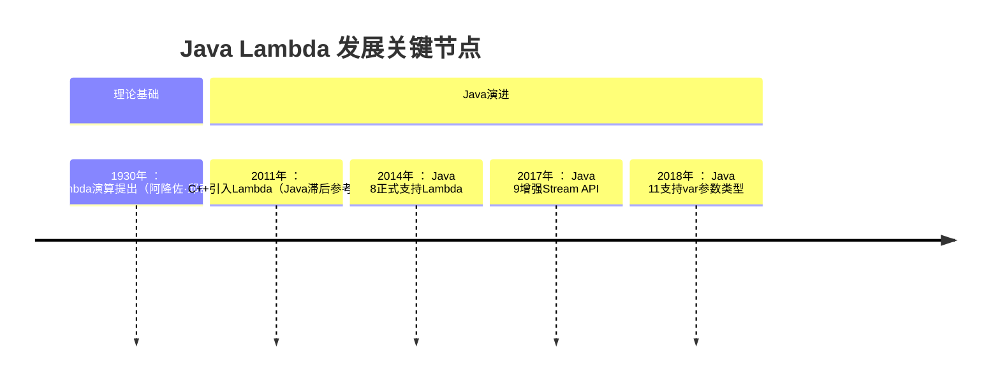
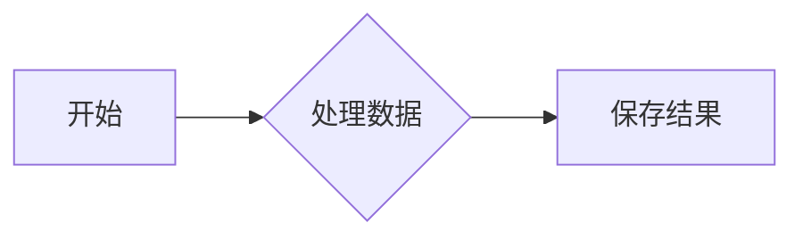

# 第二章: 前置基础学习

[[toc]]

> 说在前面的话，本文为个人学习[SpringBoot3响应式编程精讲](https://www.bilibili.com/video/BV1gsYEeLEuM?spm_id_from=333.788.videopod.episodes&vd_source=65c7f6924d2d8ba5fa0d4c448818e08a)后进行总结的文章，本文主要用于<b>响应式编程</b>。

## 【1】前置基础学习图


## 【2】 Lambda 表达式

### 2.1  info Lambda 表达式定义

::: info Lambda 表达式定义

`Lambda` 表达式 ：这是 `Java8` 中最具代表性的**语法糖**，它允许你将函数作为方法参数传递，或者将代码像数据一样处理。`Lambda` 表达式可以极大地简化匿名内部类的写法。

- **语法糖** ： **语法糖**（`Syntactic Sugar`）是指在计算机语言中添加的某种语法，这种语法对语言的功能并没有影响，但是更方便程序员使用。它可以让代码更加简洁、易读，提升开发效率

:::

::: important Lambda表达式的**本质** 和**设计目标** 

- **本质** ：**匿名函数** 的简介表示法，用于实现**函数式接口** (仅含1个抽象方法的接口)
- **设计目标** : 简化匿名内部类写法，支持函数式编程范式

:::

### 2.2 Lambda 表达式的语法

#### 2.2.1 语法

``` java
(parameters) -> {expression_or_statements}
```

#### 2.2.2 语法构成解析

| 组成部分     | 说明                                             |
| ------------ | ------------------------------------------------ |
| `parameters` | 形参列表（可省略类型声明，单参数时可省略括号）   |
| `->`         | Lambda操作符（箭头符号）                         |
| `expression` | 单条表达式（可省略`{}`和`return`）               |
| `statements` | 代码块（多条语句需`{}`包裹，显式`return`返回值） |

### 2.3 场景代码案例

#### 2.3.1 






## 【】参考资料

- [SpringBoot3响应式编程精讲](https://www.bilibili.com/video/BV1gsYEeLEuM?spm_id_from=333.788.videopod.episodes&vd_source=65c7f6924d2d8ba5fa0d4c448818e08a)

