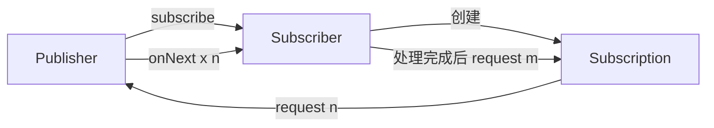

# 第三章: Reactive Streams 规范


[[toc]]

> 说在前面的话，本文为个人学习[SpringBoot3响应式编程精讲](https://www.bilibili.com/video/BV1gsYEeLEuM?spm_id_from=333.788.videopod.episodes&vd_source=65c7f6924d2d8ba5fa0d4c448818e08a)后进行总结的文章，本文主要用于<b>响应式编程</b>。

## 【1】本章学习图解


## 【2】规范背景

::: important 规范背景

> **背景**‌：传统同步阻塞 I/O 在高吞吐场景下易引发线程阻塞或内存溢出，需异步流控机制平衡生产消费速率‌

:::

## 【3】定义和定位

::: info 定义

> <b>Reactive Streams</b> 是一套‌**异步数据流处理标准**‌（JVM 规范），旨在解决高并发场景下生产者（Publisher）与消费者（Subscriber）间的‌**背压控制**‌（Backpressure）问题，确保资源不被压垮。
>
> <b>Reactive Streams</b> 是一套**处理异步数据流并支持背压（Backpressure）** 的标准接口，主要用于**非阻塞、高性能、响应式编程场景**

:::

::: important 本质

> 其**本质** 是通过标准化接口实现非阻塞、响应式的流式数据处理‌

:::

## 【4】核心目标

> - 支持异步流处理
> - 控制数据流动速率（背压机制）
> - 解耦生产者与消费者
> - 提高系统伸缩性与资源利用率

## 【5】底层机制

::: important 底层机制

>  背压（Backpressure）与异步流控

> **1.背压核心原理** : 消费者通过 `Subscription.request(n)` 主动声明可处理的数据量，生产者据此动态调整推送速率，避免数据积压或资源耗尽‌12。
>
> - ‌**反馈循环**‌：`Subscriber` 接收数据后，根据处理能力再次调用 `request(n)`，形成闭环调控‌23。
> - ‌**非阻塞队列**‌：数据暂存于有界缓冲区，当缓冲区满时，生产者暂停推送（如 `onBackpressureBuffer()`）‌24。
>
> ‌**2.线程调度优化**‌
>
> - ‌**I/O 与计算分离**‌：通过 `publishOn` 切换消费者线程，`subscribeOn` 控制生产者线程，避免阻塞‌56。
> - ‌**事件循环模型**‌：基于 Netty 等框架，单线程处理多连接，提升高并发吞吐量（如 WebFlux 在 Netty 的实践）‌

:::

## 【6】发布-订阅模型运作流程

  



>  **订阅阶段**‌：`Publisher.subscribe(Subscriber)` 建立连接，返回 `Subscription` 对象‌。
>
> ‌**请求阶段**‌：`Subscriber` 通过 `Subscription.request(n)` 请求数据‌。
>
> ‌**推送阶段**‌：`Publisher` 调用 `Subscriber.onNext(data)` 推送最多 `n` 条数据‌。
>
> ‌**动态调控**‌：消费者处理完数据后，再次触发 `request(m)` 续传数据流‌。

## 【7】四大核心组件详解(Java中)

> 项目中需要先引入jar包 ：
>
> 

#### 1. Publisher（发布者）

- ‌**职责**‌：作为数据源，通过 `subscribe(Subscriber)` 绑定订阅者‌15。

- ‌实现示例 : 

  ```java
  public interface Publisher<T> {
      void subscribe(Subscriber<? super T> s);
  }
  ```

#### ‌2. Subscriber（订阅者）

- ‌实现示例 : 

  ```java
  public interface Publisher<T> {
      void subscribe(Subscriber<? super T> s);
  }
  ```


- ‌核心方法 : 
  - `onSubscribe(Subscription s)`：接收订阅凭证，初始化请求（如 `s.request(10)`）。
  - `onNext(T data)`：处理单条数据。
  - `onError(Throwable t)`：处理错误并终止流‌。
  - `onComplete()`：数据流结束通知‌。

#### ‌3. Subscription（订阅关系）

- ‌双向协调器 :
  - 传递 `request(n)` 背压请求至生产者‌。
  - 提供 `cancel()` 终止数据流（如超时或错误）。

#### ‌4. Processor（处理器）

- ‌**双重身份**‌：同时实现 `Publisher` 和 `Subscriber` 接口，用于流转换（如过滤、映射）。

- ‌典型场景: 

  ```java
  // 将字符串流转换为大写
  Processor<String, String> processor = ...;
  processor.onNext("hello"); // 输入
  processor.subscribe(data -> System.out.println(data)); // 输出 "HELLO"
  ```

## 【X】参考资料

- [SpringBoot3响应式编程精讲](https://www.bilibili.com/video/BV1gsYEeLEuM?spm_id_from=333.788.videopod.episodes&vd_source=65c7f6924d2d8ba5fa0d4c448818e08a)
- <a href="refer_reactive_streams.html" target="_blank">Reactive Streams</a>
- <a href="www.reactivemanifesto.org/zh-CN" target="_blank">响应式宣言</a>

