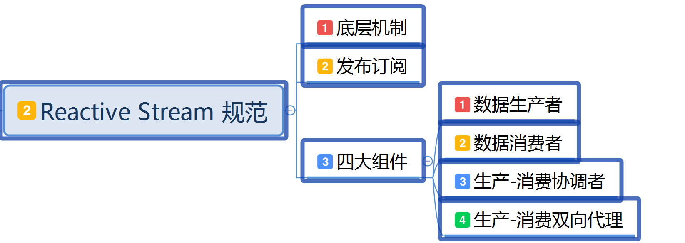
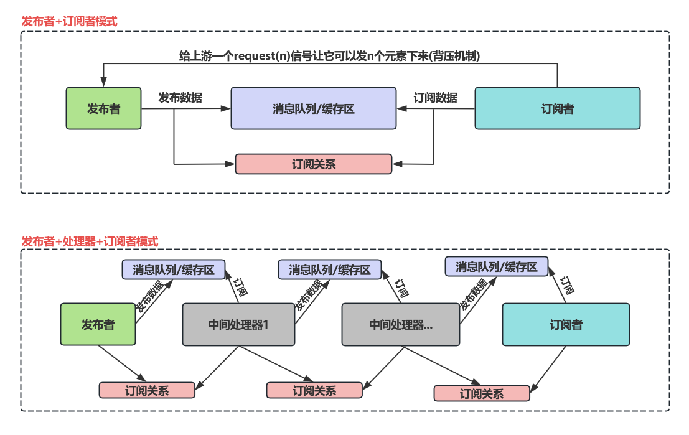
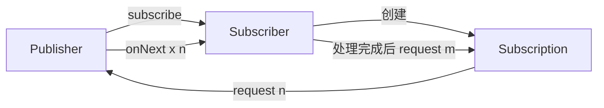

# 第三章: Reactive Streams 规范


[[toc]]

> 说在前面的话，本文为个人学习[SpringBoot3响应式编程精讲](https://www.bilibili.com/video/BV1gsYEeLEuM?spm_id_from=333.788.videopod.episodes&vd_source=65c7f6924d2d8ba5fa0d4c448818e08a)后进行总结的文章，本文主要用于<b>响应式编程</b>。

## 【1】本章学习图解



## 【2】规范背景

::: important 规范背景

> **背景**‌：传统同步阻塞 I/O 在高吞吐场景下易引发线程阻塞或内存溢出，需异步流控机制平衡生产消费速率‌

:::

## 【3】定义和定位

::: info 定义

> <b>Reactive Streams</b> 是一套‌**异步数据流处理标准**‌（JVM 规范），旨在解决高并发场景下生产者（Publisher）与消费者（Subscriber）间的‌**背压控制**‌（Backpressure）问题，确保资源不被压垮。
>
> <b>Reactive Streams</b> 是一套**处理异步数据流并支持背压（Backpressure）** 的标准接口，主要用于**非阻塞、高性能、响应式编程场景**

:::

::: important 本质

> 其**本质** 是通过标准化接口实现非阻塞、响应式的流式数据处理‌

:::

## 【4】核心目标

> **非阻塞背压（Backpressure）**‌：订阅者通过 `request(n)` 声明可处理的数据量，发布者按需推送，避免因处理速度不匹配导致的资源耗尽或数据丢失‌。
>
> ‌**异步边界**‌：数据生产与消费解耦，支持跨线程或网络的高效协作‌。
>
> ‌**有界队列**‌：发布者维护有限缓冲区，避免内存溢出。
>
> ‌**动态调整**‌：订阅者根据处理能力实时调整请求量（如初始 `request(1)`，处理完再请求下一个）。

## 【5】底层机制

::: important 底层机制

>  背压（Backpressure）与异步流控

> **1.背压核心原理** : 消费者通过 `Subscription.request(n)` 主动声明可处理的数据量，生产者据此动态调整推送速率，避免数据积压或资源耗尽‌12。
>
> - ‌**反馈循环**‌：`Subscriber` 接收数据后，根据处理能力再次调用 `request(n)`，形成闭环调控‌23。
> - ‌**非阻塞队列**‌：数据暂存于有界缓冲区，当缓冲区满时，生产者暂停推送（如 `onBackpressureBuffer()`）‌24。
>
> ‌**2.线程调度优化**‌
>
> - ‌**I/O 与计算分离**‌：通过 `publishOn` 切换消费者线程，`subscribeOn` 控制生产者线程，避免阻塞‌56。
> - ‌**事件循环模型**‌：基于 Netty 等框架，单线程处理多连接，提升高并发吞吐量（如 WebFlux 在 Netty 的实践）‌
>
> **3.正压和背压** 
>
> - 正压：生产者给消费者压力
> - 背压：生产者给缓存区压力，消费者根据自己的能力慢慢

:::

## 【6】发布-订阅模型运作流程

  



>  **订阅阶段**‌：`Publisher.subscribe(Subscriber)` 建立连接，返回 `Subscription` 对象‌。
>
> ‌**请求阶段**‌：`Subscriber` 通过 `Subscription.request(n)` 请求数据‌。
>
> ‌**推送阶段**‌：`Publisher` 调用 `Subscriber.onNext(data)` 推送最多 `n` 条数据‌。
>
> ‌**动态调控**‌：消费者处理完数据后，再次触发 `request(m)` 续传数据流‌。

## 【7】四大核心组件详解(Java中)

> 项目中需要先引入jar包 ：
>
> ```xml
> <dependency>
>   <groupId>org.reactivestreams</groupId>
>   <artifactId>reactive-streams</artifactId>
>   <version>1.0.4</version>
> </dependency>
> <dependency>
>   <groupId>org.reactivestreams</groupId>
>   <artifactId>reactive-streams-tck</artifactId>
>   <version>1.0.4</version>
>   <scope>test</scope>
> </dependency>
> ```


> 这些组件类均在 `java.util.concurrent.Flow`下

#### 1. Publisher（发布者）

- ‌<b>职责</b>：作为数据源，通过 `subscribe(Subscriber)` 绑定订阅者‌。

- ‌<b>实现示例</b> : 

  ```java
  public interface Publisher<T> {
      void subscribe(Subscriber<? super T> s);
  }
  ```

- <b>核心方法</b>:
  - `subscribe(Subscriber<? super T> s)`:  关联订阅者

#### 2. Subscriber（订阅者）

- ‌<b>职责</b>： 作为接收方，接收数据源发出的信息。

- ‌‌<b>实现示例</b> : 

  ```java
  public static interface Subscriber<T> {
      
          public void onSubscribe(Subscription subscription);
  
          public void onNext(T item);
  
          public void onError(Throwable throwable);
  
          public void onComplete();
      }
  ```

- ‌<b>核心方法</b>:
  - `onSubscribe(Subscription s)`：接收订阅凭证，初始化请求（如 `s.request(10)`）。
  - `onNext(T data)`：处理单条数据。
  - `onError(Throwable t)`：处理错误并终止流‌。
  - `onComplete()`：数据流结束通知‌。

#### ‌3. Subscription（订阅关系）

- ‌<b>职责</b>： 作为订阅关系的维系，协调维护数据源和订阅方的关系，保持不断

- ‌‌<b>实现示例</b> : 

```java
 public static interface Subscription {
   
        public void request(long n);

        public void cancel();
    }
```

- <b>核心方法</b>:
  - `request(long n)`： 传递信息
  - `cancle`： 终止传递信息

- ‌<b>双向协调器</b> :
  - 传递 `request(n)` 背压请求至生产者‌。
  - 提供 `cancel()` 终止数据流（如超时或错误）。

#### ‌4. Processor（处理器）

- ‌<b>职责</b>： 中间处理器

- ‌‌<b>实现示例</b> : 

  ```java
      public static interface Processor<T,R> extends Subscriber<T>, Publisher<R> {
      }
  ```

- ‌<b>双重身份</b>：同时实现 `Publisher` 和 `Subscriber` 接口，用于流转换（如过滤、映射）。

- ‌<b>典型场景</b>: 

  ```java
  // 将字符串流转换为大写
  Processor<String, String> processor = ...;
  processor.onNext("hello"); // 输入
  processor.subscribe(data -> System.out.println(data)); // 输出 "HELLO"
  ```

## 【8】关键特性

### 1. 事件驱动与声明式编程

>  数据到达时立即触发处理，而非轮询或阻塞等待，降低延迟。开发者通过声明式API（如`map`、`filter`）描述处理逻辑，而非手动控制流程‌。

### 2. 流量控制机制

> - <b>拉模式（Pull Model）</b>：订阅者主动请求数据，主动权由消费者掌握（对比传统推模式）。
> - <b>动态调整</b>：订阅者可根据处理能力动态调整请求速率‌。

### 3. 异步非阻塞

> - 基于回调或响应式框架（如Reactor、RxJava）实现高效资源利用，避免线程阻塞‌。
> - 通过 `publishOn`/`subscribeOn` 指定执行线程，分离 I/O 密集型与计算密集型任务。

### 4. 操作符丰富性

> - ‌**转换类**‌：`map`（映射）、`flatMap`（异步展开）。
> - ‌**过滤类**‌：`filter`（过滤）、`take(n)`（取前N项）。
> - ‌**组合类**‌：`merge`（合并流）、`zip`（多流聚合）。

## 【9】应用场景

### 1. 高吞吐实时数据处理

> 如社交媒体实时推文分析、物联网设备数据流处理‌。

### 2. 微服务通信

> 服务间异步消息传递，结合背压避免服务雪崩‌。

### 3. 资源敏感型任务

> 文件/数据库流式读写，减少内存占用‌。

| ‌**场景**‌          | ‌**问题挑战**‌           | ‌**Reactive Streams 解决方案**‌             |
| ----------------- | ---------------------- | ----------------------------------------- |
| ‌**实时数据处理**‌  | 高吞吐、低延迟需求     | 背压控制 + 非阻塞 I/O（如 Kafka 流处理）  |
| ‌**微服务通信**‌    | 服务雪崩、资源竞争     | 异步消息传递 + 熔断机制（如 RSocket）     |
| ‌**响应式Web服务**‌ | 高并发连接下的线程阻塞 | 非阻塞服务器（如 Netty + Spring WebFlux） |
| ‌**大数据流处理**‌  | 内存溢出、处理延迟     | 分批次拉取 + 背压缓冲（如 Flink 集成）    |

## 【10】主流的实现框架

### 1.引言

> ​	通过前文可知，`Reactive  Streams`本质上是一套标准化接口规范，其核心价值在于为异步流处理建立了背压机制的统一契约，该规范本身并不提供具体实现，而是通过定义`Publisher/Subscriber`等核心组件及其交互规则，为响应式编程奠定了可互操作的底层基础.。
>
> ​	在工业界实践中，基于该规范已衍生出多个成熟的技术实现方案（如`Project Reactor`、`RxJava`、`Akka  Streams`等），这些框架通过扩展核心接口形成了各具特色的技术生态。对于开发者而言，需根据业务场景中的吞吐量需求、背压处理策略、线程调度模型等关键维度，结合框架特性和社区生态进行多维评估，最终实现精准的技术选型。这些实现框架不仅完整支持响应式宣言（`Reactive Manifesto`）的核心原则，更通过丰富的操作符和配置策略，为构建弹性化、响应式的分布式系统提供了标准化工具链。

### 2. 响应式宣言`Reactive Manifesto`

- <a href="www.reactivemanifesto.org/zh-CN" target="_blank">响应式宣言</a>
- <b>特性</b>
  - <b>实现即时响应（Responsive）</b>
  - <b>回弹性（Resilient）</b>
  - <b>消息驱动（Message-Driven）‌</b>
    - 反应式系统依赖异步的消息传递

### 3. 主流框架之`Reactor`（Spring 生态首选）

- <b>我们主要学习这个框架</b>

- <b>核心类型</b>：`Mono`（0/1元素流）、`Flux`（0-N元素流）。
- <b>关键特性</b>：
   - 深度集成 Spring 生态（如 `WebFlux`、`Spring Data Reactive`）。
   - 支持丰富的背压策略（`Buffer`、`Drop`、`Latest`）。
   - 提供 100+ 操作符（`map`、`flatMap`、`zip`）。
- <b>适用场景</b>：
   - 高并发`Web` 服务（替代 `Spring MVC`）。
   - 微服务间响应式通信（如 `RSocket`）。
- <b>官网</b>：[Project Reactor](https://projectreactor.io/)

### 4. 主流框架之 `RxJava`（复杂事件流处理）
- <b>核心类型</b>：`Observable`（非背压流）、`Flowable`（背压流）。
- <b>关键特性</b>：
  - 支持 300+ 操作符，功能最全的响应式库。
  - 兼容 Java 6+ 和 Android 平台。
  - 提供线程调度（`observeOn`、`subscribeOn`）。
- <b>适用场</b>景：
  - Android 应用异步任务。
  - 复杂事件流合并/转换（如多数据源聚合）。
- <b>官网</b>：[ReactiveX/RxJava](https://github.com/ReactiveX/RxJava)

### 5. 主流框架之 `Akka Streams` (分布式流处理)

- <b>核心概念</b>：`Source`（发布者）、`Flow`（处理器）、`Sink`（订阅者）。
- <b>关键特性</b>：基于 Actor 模型，支持分布式容错。
  - 内置背压传播，无需手动配置。
  - 提供流式 DSL（领域特定语言）。
- <b>适用场景</b>：
  - 分布式数据管道（如 Kafka 流处理）。
  - 高容错性实时计算（如金融风控）。
- ‌<b>官网</b>：[Akka Streams](https://akka.io/docs/)

### 6. 主流框架之 `Java Flow API` （原生轻量级方案）

- <b>核心类</b>：`Flow.Publisher`、`Flow.Subscriber`、`Flow.Subscription`。
- <b>关键特性</b>：
  - Java 9+ 原生支持，无需第三方依赖。
  - 提供基础背压控制（`request(n)`）。
  - 兼容其他 Reactive Streams 实现。
- <b>适用场景</b>：
  - 轻量级响应式工具开发。
  - 与其他框架的兼容性适配。
- <b>文档</b>：[Java 9 Flow API](https://docs.oracle.com/javase/9/docs/api/java/util/concurrent/Flow.html)

### 7. 主流框架之 `RSocket` (响应式通讯协议)

- <b>核心特性</b>：
  - 基于 Reactive Streams 的二进制协议，支持 TCP/WebSocket。
  - 提供四种交互模式：`Request-Response`、`Fire-and-Forget`、`Stream`、`Channel`。
- <b>‌适用场景</b>：
  - 跨语言微服务通信（Java、Go、Node.js）。
  - 实时双向数据流（如 IoT 设备控制）。
- <b>‌集成框架‌</b>：
  - Reactor（Spring RSocket）、RxJava、Kotlin Coroutines。
- <b>官网</b>：[RSocket](https://rsocket.io/)

## 【11】主流框架选型对比

| ‌**框架**‌         | ‌**技术生态**‌     | ‌**背压支持**‌ | ‌**适用场景**‌           | ‌**学习成本**‌ |
| ---------------- | ---------------- | ------------ | ---------------------- | ------------ |
| ‌**Reactor**‌      | Spring/WebFlux   | 强           | Web服务、微服务通信    | 中           |
| ‌**RxJava**‌       | Android/Java     | 强           | 移动端、复杂事件流     | 高           |
| ‌**Akka Streams**‌ | Akka/Scala       | 自动         | 分布式系统、大数据管道 | 高           |
| ‌**Java Flow**‌    | Java原生         | 基础         | 轻量级工具、兼容性适配 | 低           |
| ‌**RSocket**‌      | 多语言（跨平台） | 强           | 实时通信、IoT          | 中           |

------

>  根据项目需求选择框架：‌

- **Spring 生态优先 Reactor**‌
- **Android 选 RxJava**‌
- **分布式系统用 Akka Streams**‌
- **轻量级场景用 Java Flow**‌
- **跨语言通信用 RSocket**‌

## 【12】Reactive Strems 学习代码

``` java
package com.learn.reactive.stream.flow;

import java.util.concurrent.CountDownLatch;
import java.util.concurrent.Flow;
import java.util.concurrent.SubmissionPublisher;

/**
 * @author qianpengzhan
 * @since 2025/7/2 11:08
 */
public class ReactiveStreamLearn {
    public static void main(String[] args) throws InterruptedException {
        System.out.println("主线程开始...");
        CountDownLatch countDownLatch = new CountDownLatch(10);
        // 1.定义1个发布者 发布数据流
//        Flow.Publisher<String> publisher = new Flow.Publisher<String>() {
//            public Flow.Subscriber<? super String> subscriber;
//
//            // 订阅者订阅发布者的接口 需要保存下订阅者
//            @Override
//            public void subscribe(Flow.Subscriber<? super String> subscriber) {
//                this.subscriber = subscriber;
//            }
//        };

        // jvm底层已经对整个发布订阅关系做好了 异步 + 缓存区处理 + 虚拟线程消费 =  响应式系统

        // 我们直接使用内置的发布者
        SubmissionPublisher<String> publisher = new SubmissionPublisher<>();

        // 2.定义1个订阅者 订阅者感兴趣发布者的数据 接收数据
        Flow.Subscriber<String> subscriber = new Flow.Subscriber<>() {
            private Flow.Subscription subscription;

            // subscription 订阅关系  订阅凭证
            @Override
            public void onSubscribe(Flow.Subscription subscription) {
                System.out.println(Thread.currentThread() + ", 订阅开始了" + ", timestamp: " + System.currentTimeMillis());
                this.subscription = subscription;

                // 水龙头在消费者这边控制 现在就是给我1滴水  意思我这边消费1个数据
                subscription.request(100);
            }

            @Override
            public void onNext(String item) {
                System.out.println(Thread.currentThread() + ", 接收到数据: " + item + ", timestamp: " + System.currentTimeMillis());
                // 拿到1个 就再要1个
                if (item.equals("publish-7")) {
                    throw new RuntimeException("故意报错,到7就不相干了");
                } else {
                    subscription.request(100);
                }
                // 计数-1
                countDownLatch.countDown();
            }

            @Override
            public void onError(Throwable throwable) {
                System.out.println(Thread.currentThread() + ", 接收错误信号, " + throwable.getMessage() + ", timestamp: " + System.currentTimeMillis());
                // 异常计数也-1
                long count = countDownLatch.getCount();
                for (int i = 0; i < count; i++) {
                    countDownLatch.countDown();
                }
            }

            @Override
            public void onComplete() {
                System.out.println(Thread.currentThread() + ", 接收完毕" + ", timestamp: " + System.currentTimeMillis());
            }
        };

        // 3.绑定发布订阅关系
        publisher.subscribe(subscriber);

        // 4.测试
        // 然后我们遍历发布0~10
        for (int i = 0; i < 10; i++) {
            System.out.println(Thread.currentThread() + ", 发布者的线程" + ", timestamp: " + System.currentTimeMillis());
            // 发布10条数据
            if (i == 9) {
                //publisher.closeExceptionally(new RuntimeException("故意报错,打印出来,结束"));
                publisher.submit("publish-" + i);
            } else {
                publisher.submit("publish-" + i);
                // 发布者发布的数据都存在发布者的buffer中，是一个array
            }
        }

        //5. 发布者关闭通道
        countDownLatch.await(); // 阻塞到所有数据被消费
        publisher.close();
        System.out.println("主线程结束..");
    }
}
执行后：
Connected to the target VM, address: '127.0.0.1:53243', transport: 'socket'
主线程开始...
Thread[ForkJoinPool.commonPool-worker-1,5,main], 订阅开始了, timestamp: 1751439414466
Thread[main,5,main], 发布者的线程, timestamp: 1751439414466
Thread[main,5,main], 发布者的线程, timestamp: 1751439414479
Thread[main,5,main], 发布者的线程, timestamp: 1751439414479
Thread[main,5,main], 发布者的线程, timestamp: 1751439414479
Thread[main,5,main], 发布者的线程, timestamp: 1751439414479
Thread[main,5,main], 发布者的线程, timestamp: 1751439414479
Thread[main,5,main], 发布者的线程, timestamp: 1751439414479
Thread[main,5,main], 发布者的线程, timestamp: 1751439414479
Thread[main,5,main], 发布者的线程, timestamp: 1751439414479
Thread[main,5,main], 发布者的线程, timestamp: 1751439414479
Thread[ForkJoinPool.commonPool-worker-1,5,main], 接收到数据: publish-0, timestamp: 1751439414479
Thread[ForkJoinPool.commonPool-worker-1,5,main], 接收到数据: publish-1, timestamp: 1751439414485
Thread[ForkJoinPool.commonPool-worker-1,5,main], 接收到数据: publish-2, timestamp: 1751439414485
Thread[ForkJoinPool.commonPool-worker-1,5,main], 接收到数据: publish-3, timestamp: 1751439414486
Thread[ForkJoinPool.commonPool-worker-1,5,main], 接收到数据: publish-4, timestamp: 1751439414486
Thread[ForkJoinPool.commonPool-worker-1,5,main], 接收到数据: publish-5, timestamp: 1751439414486
Thread[ForkJoinPool.commonPool-worker-1,5,main], 接收到数据: publish-6, timestamp: 1751439414486
Thread[ForkJoinPool.commonPool-worker-1,5,main], 接收到数据: publish-7, timestamp: 1751439414486
Thread[ForkJoinPool.commonPool-worker-1,5,main], 接收错误信号, 故意报错,到7就不相干了, timestamp: 1751439414486
主线程结束..
Disconnected from the target VM, address: '127.0.0.1:53243', transport: 'socket'
```

``` java
package com.learn.reactive.stream.flow;

import java.util.concurrent.CountDownLatch;
import java.util.concurrent.Flow;
import java.util.concurrent.SubmissionPublisher;


/**
 * @author qianpengzhan
 * @since 2025/7/2 15:04
 */
public class ReactiveStreamLearn02 {

    public static void main(String[] args) throws InterruptedException {
        System.out.println("主线程开始...");
        CountDownLatch countDownLatch = new CountDownLatch(10);
        //1 定义1个发布者
        SubmissionPublisher<String> publisher = new SubmissionPublisher<>();

        //2 定义1个订阅者
        Flow.Subscriber<String> subscriber = new Flow.Subscriber<>() {
            private Flow.Subscription subscription;

            // subscription 订阅关系  订阅凭证
            @Override
            public void onSubscribe(Flow.Subscription subscription) {
                System.out.println(Thread.currentThread() + ", 订阅开始了" + ", timestamp: " + System.currentTimeMillis());
                this.subscription = subscription;

                // 水龙头在消费者这边控制 现在就是给我1滴水  意思我这边消费1个数据
                // 订阅者慢慢消费
                try {
                    Thread.sleep(1000);
                } catch (InterruptedException e) {
                    throw new RuntimeException(e);
                }
                subscription.request(1);
            }

            @Override
            public void onNext(String item) {
                System.out.println(Thread.currentThread() + ", 消费者接收到数据: " + item + ", timestamp: " + System.currentTimeMillis());
                // 拿到1个 就再要1个
                if (item.equals("publish-7")) {
                    throw new RuntimeException("故意报错,到7就不相干了");
                } else {
                    // 订阅者慢慢消费
                    try {
                        Thread.sleep(1000);
                    } catch (InterruptedException e) {
                        throw new RuntimeException(e);
                    }
                    subscription.request(1);
                }
                // 计数-1
                countDownLatch.countDown();
            }

            @Override
            public void onError(Throwable throwable) {
                System.out.println(Thread.currentThread() + ", 消费者接收错误信号, " + throwable.getMessage() + ", timestamp: " + System.currentTimeMillis());
                // 异常计数也-1
                long count = countDownLatch.getCount();
                for (int i = 0; i < count; i++) {
                    countDownLatch.countDown();
                }
            }

            @Override
            public void onComplete() {
                System.out.println(Thread.currentThread() + ", 消费者接收完毕" + ", timestamp: " + System.currentTimeMillis());
            }
        };

        //3 定义1个中间处理器  给每个元素添加1个 哈哈哈 后缀
        MyProcessor processor1 = new MyProcessor();
        MyProcessor processor2 = new MyProcessor();
        MyProcessor processor3 = new MyProcessor();

        //4 绑定三者关系
        processor3.subscribe(subscriber);
        processor2.subscribe(processor3);
        processor1.subscribe(processor2);
        publisher.subscribe(processor1);

        //5 发布者发布数据
        for (int i = 0; i < 10; i++) {
            publisher.submit("publish-" + i);
        }

        //6 阻塞到完成 关闭流
        countDownLatch.await();
        publisher.close();
    }

    // 定义1个流中间操作器
    static class MyProcessor extends SubmissionPublisher<String> implements Flow.Subscriber<String> {
        public Flow.Subscription subscription;

        @Override
        public void onSubscribe(Flow.Subscription subscription) {
            System.out.println(Thread.currentThread() + ", processer订阅发布者" + ", timestamp: " + System.currentTimeMillis());
            this.subscription = subscription;
            subscription.request(1);
        }

        @Override  // 数据到达 触发回调
        public void onNext(String item) {
            System.out.println(Thread.currentThread() + ", processer 拿到数据: " + item + ", timestamp: " + System.currentTimeMillis());
            // 在加工
            item += ": 哈哈哈";
            System.out.println(Thread.currentThread() + ", processor 再加工后的数据：" + item + ", timestamp: " + System.currentTimeMillis());
            // 再发布出去
            submit(item);
            // 再拿1个数据
            subscription.request(1);
        }

        @Override
        public void onError(Throwable throwable) {

        }

        @Override
        public void onComplete() {
            System.out.println(Thread.currentThread() + ", processor  完成了" + ", timestamp: " + System.currentTimeMillis());
        }
    }
}
Connected to the target VM, address: '127.0.0.1:55656', transport: 'socket'
主线程开始...
Thread[ForkJoinPool.commonPool-worker-1,5,main], 订阅开始了, timestamp: 1751441255902
Thread[ForkJoinPool.commonPool-worker-2,5,main], processer订阅发布者, timestamp: 1751441255902
Thread[ForkJoinPool.commonPool-worker-4,5,main], processer订阅发布者, timestamp: 1751441255902
Thread[ForkJoinPool.commonPool-worker-3,5,main], processer订阅发布者, timestamp: 1751441255902
Thread[ForkJoinPool.commonPool-worker-4,5,main], processer 拿到数据: publish-0, timestamp: 1751441255917
Thread[ForkJoinPool.commonPool-worker-4,5,main], processor 再加工后的数据：publish-0: 哈哈哈, timestamp: 1751441255922
Thread[ForkJoinPool.commonPool-worker-2,5,main], processer 拿到数据: publish-0: 哈哈哈, timestamp: 1751441255922
Thread[ForkJoinPool.commonPool-worker-4,5,main], processer 拿到数据: publish-1, timestamp: 1751441255922
Thread[ForkJoinPool.commonPool-worker-2,5,main], processor 再加工后的数据：publish-0: 哈哈哈: 哈哈哈, timestamp: 1751441255922
Thread[ForkJoinPool.commonPool-worker-4,5,main], processor 再加工后的数据：publish-1: 哈哈哈, timestamp: 1751441255922
Thread[ForkJoinPool.commonPool-worker-4,5,main], processer 拿到数据: publish-2, timestamp: 1751441255922
Thread[ForkJoinPool.commonPool-worker-2,5,main], processer 拿到数据: publish-1: 哈哈哈, timestamp: 1751441255922
Thread[ForkJoinPool.commonPool-worker-3,5,main], processer 拿到数据: publish-0: 哈哈哈: 哈哈哈, timestamp: 1751441255922
Thread[ForkJoinPool.commonPool-worker-2,5,main], processor 再加工后的数据：publish-1: 哈哈哈: 哈哈哈, timestamp: 1751441255923
Thread[ForkJoinPool.commonPool-worker-4,5,main], processor 再加工后的数据：publish-2: 哈哈哈, timestamp: 1751441255922
Thread[ForkJoinPool.commonPool-worker-3,5,main], processor 再加工后的数据：publish-0: 哈哈哈: 哈哈哈: 哈哈哈, timestamp: 1751441255923
Thread[ForkJoinPool.commonPool-worker-3,5,main], processer 拿到数据: publish-1: 哈哈哈: 哈哈哈, timestamp: 1751441255923
Thread[ForkJoinPool.commonPool-worker-4,5,main], processer 拿到数据: publish-3, timestamp: 1751441255923
Thread[ForkJoinPool.commonPool-worker-3,5,main], processor 再加工后的数据：publish-1: 哈哈哈: 哈哈哈: 哈哈哈, timestamp: 1751441255923
Thread[ForkJoinPool.commonPool-worker-2,5,main], processer 拿到数据: publish-2: 哈哈哈, timestamp: 1751441255923
Thread[ForkJoinPool.commonPool-worker-4,5,main], processor 再加工后的数据：publish-3: 哈哈哈, timestamp: 1751441255923
Thread[ForkJoinPool.commonPool-worker-2,5,main], processor 再加工后的数据：publish-2: 哈哈哈: 哈哈哈, timestamp: 1751441255923
Thread[ForkJoinPool.commonPool-worker-4,5,main], processer 拿到数据: publish-4, timestamp: 1751441255923
Thread[ForkJoinPool.commonPool-worker-2,5,main], processer 拿到数据: publish-3: 哈哈哈, timestamp: 1751441255923
Thread[ForkJoinPool.commonPool-worker-4,5,main], processor 再加工后的数据：publish-4: 哈哈哈, timestamp: 1751441255923
Thread[ForkJoinPool.commonPool-worker-2,5,main], processor 再加工后的数据：publish-3: 哈哈哈: 哈哈哈, timestamp: 1751441255923
Thread[ForkJoinPool.commonPool-worker-3,5,main], processer 拿到数据: publish-2: 哈哈哈: 哈哈哈, timestamp: 1751441255923
Thread[ForkJoinPool.commonPool-worker-4,5,main], processer 拿到数据: publish-5, timestamp: 1751441255923
Thread[ForkJoinPool.commonPool-worker-2,5,main], processer 拿到数据: publish-4: 哈哈哈, timestamp: 1751441255923
Thread[ForkJoinPool.commonPool-worker-4,5,main], processor 再加工后的数据：publish-5: 哈哈哈, timestamp: 1751441255923
Thread[ForkJoinPool.commonPool-worker-3,5,main], processor 再加工后的数据：publish-2: 哈哈哈: 哈哈哈: 哈哈哈, timestamp: 1751441255923
Thread[ForkJoinPool.commonPool-worker-4,5,main], processer 拿到数据: publish-6, timestamp: 1751441255923
Thread[ForkJoinPool.commonPool-worker-2,5,main], processor 再加工后的数据：publish-4: 哈哈哈: 哈哈哈, timestamp: 1751441255923
Thread[ForkJoinPool.commonPool-worker-4,5,main], processor 再加工后的数据：publish-6: 哈哈哈, timestamp: 1751441255923
Thread[ForkJoinPool.commonPool-worker-3,5,main], processer 拿到数据: publish-3: 哈哈哈: 哈哈哈, timestamp: 1751441255923
Thread[ForkJoinPool.commonPool-worker-4,5,main], processer 拿到数据: publish-7, timestamp: 1751441255923
Thread[ForkJoinPool.commonPool-worker-2,5,main], processer 拿到数据: publish-5: 哈哈哈, timestamp: 1751441255923
Thread[ForkJoinPool.commonPool-worker-4,5,main], processor 再加工后的数据：publish-7: 哈哈哈, timestamp: 1751441255923
Thread[ForkJoinPool.commonPool-worker-3,5,main], processor 再加工后的数据：publish-3: 哈哈哈: 哈哈哈: 哈哈哈, timestamp: 1751441255923
Thread[ForkJoinPool.commonPool-worker-4,5,main], processer 拿到数据: publish-8, timestamp: 1751441255923
Thread[ForkJoinPool.commonPool-worker-2,5,main], processor 再加工后的数据：publish-5: 哈哈哈: 哈哈哈, timestamp: 1751441255923
Thread[ForkJoinPool.commonPool-worker-3,5,main], processer 拿到数据: publish-4: 哈哈哈: 哈哈哈, timestamp: 1751441255923
Thread[ForkJoinPool.commonPool-worker-2,5,main], processer 拿到数据: publish-6: 哈哈哈, timestamp: 1751441255924
Thread[ForkJoinPool.commonPool-worker-4,5,main], processor 再加工后的数据：publish-8: 哈哈哈, timestamp: 1751441255923
Thread[ForkJoinPool.commonPool-worker-2,5,main], processor 再加工后的数据：publish-6: 哈哈哈: 哈哈哈, timestamp: 1751441255924
Thread[ForkJoinPool.commonPool-worker-3,5,main], processor 再加工后的数据：publish-4: 哈哈哈: 哈哈哈: 哈哈哈, timestamp: 1751441255924
Thread[ForkJoinPool.commonPool-worker-4,5,main], processer 拿到数据: publish-9, timestamp: 1751441255924
Thread[ForkJoinPool.commonPool-worker-2,5,main], processer 拿到数据: publish-7: 哈哈哈, timestamp: 1751441255924
Thread[ForkJoinPool.commonPool-worker-3,5,main], processer 拿到数据: publish-5: 哈哈哈: 哈哈哈, timestamp: 1751441255924
Thread[ForkJoinPool.commonPool-worker-4,5,main], processor 再加工后的数据：publish-9: 哈哈哈, timestamp: 1751441255924
Thread[ForkJoinPool.commonPool-worker-3,5,main], processor 再加工后的数据：publish-5: 哈哈哈: 哈哈哈: 哈哈哈, timestamp: 1751441255924
Thread[ForkJoinPool.commonPool-worker-2,5,main], processor 再加工后的数据：publish-7: 哈哈哈: 哈哈哈, timestamp: 1751441255924
Thread[ForkJoinPool.commonPool-worker-3,5,main], processer 拿到数据: publish-6: 哈哈哈: 哈哈哈, timestamp: 1751441255924
Thread[ForkJoinPool.commonPool-worker-3,5,main], processor 再加工后的数据：publish-6: 哈哈哈: 哈哈哈: 哈哈哈, timestamp: 1751441255924
Thread[ForkJoinPool.commonPool-worker-2,5,main], processer 拿到数据: publish-8: 哈哈哈, timestamp: 1751441255924
Thread[ForkJoinPool.commonPool-worker-3,5,main], processer 拿到数据: publish-7: 哈哈哈: 哈哈哈, timestamp: 1751441255924
Thread[ForkJoinPool.commonPool-worker-2,5,main], processor 再加工后的数据：publish-8: 哈哈哈: 哈哈哈, timestamp: 1751441255924
Thread[ForkJoinPool.commonPool-worker-3,5,main], processor 再加工后的数据：publish-7: 哈哈哈: 哈哈哈: 哈哈哈, timestamp: 1751441255924
Thread[ForkJoinPool.commonPool-worker-2,5,main], processer 拿到数据: publish-9: 哈哈哈, timestamp: 1751441255924
Thread[ForkJoinPool.commonPool-worker-3,5,main], processer 拿到数据: publish-8: 哈哈哈: 哈哈哈, timestamp: 1751441255924
Thread[ForkJoinPool.commonPool-worker-2,5,main], processor 再加工后的数据：publish-9: 哈哈哈: 哈哈哈, timestamp: 1751441255924
Thread[ForkJoinPool.commonPool-worker-3,5,main], processor 再加工后的数据：publish-8: 哈哈哈: 哈哈哈: 哈哈哈, timestamp: 1751441255924
Thread[ForkJoinPool.commonPool-worker-3,5,main], processer 拿到数据: publish-9: 哈哈哈: 哈哈哈, timestamp: 1751441255924
Thread[ForkJoinPool.commonPool-worker-3,5,main], processor 再加工后的数据：publish-9: 哈哈哈: 哈哈哈: 哈哈哈, timestamp: 1751441255924
Thread[ForkJoinPool.commonPool-worker-1,5,main], 消费者接收到数据: publish-0: 哈哈哈: 哈哈哈: 哈哈哈, timestamp: 1751441256930
Thread[ForkJoinPool.commonPool-worker-1,5,main], 消费者接收到数据: publish-1: 哈哈哈: 哈哈哈: 哈哈哈, timestamp: 1751441257935
Thread[ForkJoinPool.commonPool-worker-1,5,main], 消费者接收到数据: publish-2: 哈哈哈: 哈哈哈: 哈哈哈, timestamp: 1751441258943
Thread[ForkJoinPool.commonPool-worker-1,5,main], 消费者接收到数据: publish-3: 哈哈哈: 哈哈哈: 哈哈哈, timestamp: 1751441259951
Thread[ForkJoinPool.commonPool-worker-1,5,main], 消费者接收到数据: publish-4: 哈哈哈: 哈哈哈: 哈哈哈, timestamp: 1751441260966
Thread[ForkJoinPool.commonPool-worker-1,5,main], 消费者接收到数据: publish-5: 哈哈哈: 哈哈哈: 哈哈哈, timestamp: 1751441261980
Thread[ForkJoinPool.commonPool-worker-1,5,main], 消费者接收到数据: publish-6: 哈哈哈: 哈哈哈: 哈哈哈, timestamp: 1751441262992
Thread[ForkJoinPool.commonPool-worker-1,5,main], 消费者接收到数据: publish-7: 哈哈哈: 哈哈哈: 哈哈哈, timestamp: 1751441264001
Thread[ForkJoinPool.commonPool-worker-1,5,main], 消费者接收到数据: publish-8: 哈哈哈: 哈哈哈: 哈哈哈, timestamp: 1751441265013
Thread[ForkJoinPool.commonPool-worker-1,5,main], 消费者接收到数据: publish-9: 哈哈哈: 哈哈哈: 哈哈哈, timestamp: 1751441266026
Disconnected from the target VM, address: '127.0.0.1:55656', transport: 'socket'
```

## 【13】总结

> **价值**‌
>
> - ‌**统一规范**‌：解决不同响应式库的兼容性问题。
> - ‌**标准化集成**‌：Java 9已将Reactive Streams接口纳入`java.util.concurrent.Flow`类‌。
>
> ‌**挑战**‌
>
> - ‌**复杂度**‌：异步回调逻辑需谨慎设计，避免嵌套地狱‌。
> - ‌**调试困难**‌：异步链路追踪与错误处理需依赖专用工具（如Reactor Debug Agent）‌。

### 13.1 响应式编程总结

> - 底层：基于数据缓存队列 + 消息驱动模型 + 异步回调机制
> - 编码： 流式编程 + 链式调用 + 声明式API
> - 效果： 优雅全异步 + 消息实时处理 + 高吞吐量 + 占用少量资源

## 【14】参考资料

- [SpringBoot3响应式编程精讲](https://www.bilibili.com/video/BV1gsYEeLEuM?spm_id_from=333.788.videopod.episodes&vd_source=65c7f6924d2d8ba5fa0d4c448818e08a)
- <a href="refer_reactive_streams.html" target="_blank">Reactive Streams</a>
- <a href="www.reactivemanifesto.org/zh-CN" target="_blank">响应式宣言</a>

