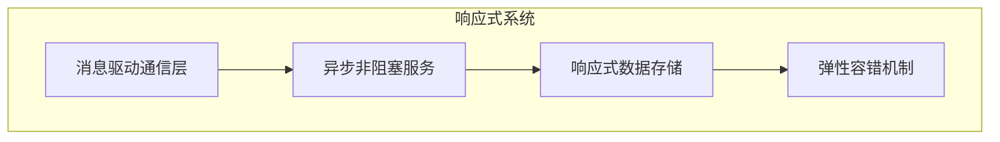

# 第四章: Reactor 框架

[[toc]]

> 说在前面的话，本文为个人学习[SpringBoot3响应式编程精讲](https://www.bilibili.com/video/BV1gsYEeLEuM?spm_id_from=333.788.videopod.episodes&vd_source=65c7f6924d2d8ba5fa0d4c448818e08a)后进行总结的文章，本文主要用于<b>响应式编程</b>。

## 【1】本章学习图解


## 【2】Project Reactor 官网

> 英文官网地址:  [https://projectreactor.io/](https://projectreactor.io/)

> 以往：

::: tabs

@tab:active  **高并发三宝**

- **异步**
- **缓存**
- **队列排好**

@tab **高可用三宝**

- **分片**
- **复制**
- **选领导**

@tab **非阻塞的原理**

- **缓冲区**
- **回调**

:::

> 现在，1个框架就全搞定了。 这就是 `Project Reactor` 框架

## 【3】Reactor 响应式编程模型




## 【4】引入相关jar

::: tabs

@tab:active 引入父pom的jar

``` xml
  <!--    引入project reactor 的jar     -->
<dependencyManagement> 
    <dependencies>
        <dependency>
            <groupId>io.projectreactor</groupId>
            <artifactId>reactor-bom</artifactId>
            <version>2024.0.6</version>
            <type>pom</type>
            <scope>import</scope>
        </dependency>
    </dependencies>
</dependencyManagement>
```

@tab 再在子pom.xml中引入使用的jar

```xml
<dependencies>
    <dependency>
        <groupId>io.projectreactor</groupId>
        <artifactId>reactor-core</artifactId> 
        
    </dependency>
    <dependency>
        <groupId>io.projectreactor</groupId>
        <artifactId>reactor-test</artifactId> 
        <scope>test</scope>
    </dependency>
</dependencies>
```

:::

## 【5】核心组件 Mono 和 Flux 

> 万物皆数据，数据分2种，1种是**单个或者没有**，另一种是**多个**
>
> 数据流 = N个元素  + 1个信号(完成/异常)

### 5.1 Flux 

> 

> 官网弹珠图:
>
> 

> With this large scope of possible signals, `Flux` is the general-purpose reactive type. Note that all events, even terminating ones, are optional: no `onNext` event but an `onComplete` event represents an *empty* finite sequence, but remove the `onComplete` and you have an *infinite* empty sequence (not particularly useful, except for tests around cancellation). Similarly, infinite sequences are not necessarily empty. For example, `Flux.interval(Duration)` produces a `Flux<Long>` that is infinite and emits regular ticks from a clock.
>
> 有了这么大范围的可能信号，`Flux`是通用的反应式类型。请注意，所有事件，甚至是终止事件，都是可选的：没有`onNext`事件，但`onComplete`事件表示一个*空*的有限序列，但删除`onComplete`，你有一个*无限*的空序列（不是特别有用，除了关于取消的测试）。类似地，无限序列不一定是空的。例如，`Flux.interval(Duration)`产生一个无限的`Flux<Long>`，并从时钟发出规则的滴答声。

### 5.2 Mono

> 

> 

> A `Mono<T>` is a specialized `Publisher<T>` that emits at most one item *via* the `onNext` signal then terminates with an `onComplete` signal (successful `Mono`, with or without value), or only emits a single `onError` signal (failed `Mono`).
>
> 一个`Mono<T>`是一个专门的`Publisher<T>`，它*通过*onNext信号发出最多一个项目`onNext`然后以`onComplete`信号终止（成功的`Mono`，有或没有值），或者只发出一个`onError`信号（失败的`Mono`）。
>
> Most `Mono` implementations are expected to immediately call `onComplete` on their `Subscriber` after having called `onNext`. `Mono.never()` is an outlier: it doesn’t emit any signal, which is not technically forbidden although not terribly useful outside of tests. On the other hand, a combination of `onNext` and `onError` is explicitly forbidden.
>
> 大多数`Mono`实现在调用`onNext`后会立即在`Subscriber`器上调用`onComplete`。`Mono.never()`是一个异常值：它不发出任何信号，这在技术上是不被禁止的，尽管在测试之外并不十分有用。另一方面，`onNext`和`onError`的组合被明确禁止。
>
> `Mono` offers only a subset of the operators that are available for a `Flux`, and some operators (notably those that combine the `Mono` with another `Publisher`) switch to a `Flux`. For example, `Mono#concatWith(Publisher)` returns a `Flux` while `Mono#then(Mono)` returns another `Mono`.
>
> `Mono`仅提供可用于`Flux`的运算符子集，一些运算符（特别是将`Mono`与另一个`Publisher`组合的运算符）切换到`Flux`。例如，`Mono#concatWith(Publisher)`返回一个`Flux`，而`Mono#then(Mono)`返回另一个`Mono`。
>
> Note that you can use a `Mono` to represent no-value asynchronous processes that only have the concept of completion (similar to a `Runnable`). To create one, you can use an empty `Mono<Void>`.
>
> 请注意，您可以使用`Mono`来表示只有完成概念的无值异步进程（类似于`Runnable`）。要创建一个，您可以使用空的`Mono<Void>`。

### 5.3 总结

> <b>`Flux`</b> ：代表包含 0 到 N 个元素的异步序列，支持 `onNext`（数据元素）、`onComplete`（完成信号）、`onError`（错误信号）三种事件通知。
>
> ‌<b>`Mono`</b> ‌：表示最多包含 ‌**0 或 1 个元素**‌的异步序列，适用于单值场景（如 HTTP 请求响应）。
>
> ‌**核心差异**‌：`Flux` 处理流式数据（如数据库查询结果集），`Mono` 处理单次操作（如保存结果）

### 5.4 设计原则

> - ‌**异步非阻塞**‌：通过事件驱动模型避免线程阻塞，提高并发吞吐量。
> - ‌<b>背压机制(Backpressure)</b>：消费者主动控制数据流速（如 `limitRate`），防止生产者过载。
> - ‌**声明式操作链**‌：通过操作符（如 `map`、`filter`）构建处理流水线，取代传统回调嵌套。

### 5.5 **关键操作符与代码实践**‌

#### 5.5.1 创建数据流‌

```java
// 静态创建 Flux
Flux<String> flux1 = Flux.just("Java", "Python", "Go"); // 直接创建元素
Flux<Integer> flux2 = Flux.range(1, 5); // 生成整数序列
Flux<Long> flux3 = Flux.interval(Duration.ofSeconds(1)); // 每秒发射一个递增整数

// 从集合创建
List<String> list = Arrays.asList("A", "B", "C");
Flux<String> flux4 = Flux.fromIterable(list); // 从集合派生

// 创建 Mono
Mono<String> mono1 = Mono.just("Hello"); // 单值
Mono<Void> mono2 = Mono.empty(); // 空序列（仅发送完成信号)
Mono<User> mono3 = Mono.fromCallable(() -> fetchUserById(1)); // 从异步任务创建
```

#### 5.5.2 转换与处理数据‌

```java
// Map：同步转换元素
Flux<String> upperFlux = Flux.just("a", "b")
    .map(String::toUpperCase); // 输出 "A", "B"

// FlatMap：异步转换（元素顺序可能乱序）
Flux<String> asyncFlux = Flux.just(1, 2)
    .flatMap(id -> Mono.fromFuture(fetchNameAsync(id))); // 异步获取名称

// Filter：过滤元素
Flux<Integer> filtered = Flux.range(1, 10)
    .filter(i -> i % 2 == 0); // 仅保留偶数

```

#### 5.5.3 错误处理

```java
// 捕获并返回默认值
Flux<Integer> safeFlux = Flux.error(new RuntimeException("Fail"))
    .onErrorReturn(0); // 出错时返回

// 重试机制
Flux<String> retryFlux = httpRequestFlux()
    .retry(3); // 失败时最多重试 3 次

```

#### 5.5.4 组合流

```java
// 合并流（并发执行）
Flux<String> merged = Flux.merge(fluxA, fluxB); // 元素按到达时间混合

// 按顺序拼接
Flux<String> concatenated = Flux.concat(fluxA, fluxB); // 先消费 fluxA 再 fluxB

// 聚合多个流结果
Mono<String> zipped = Mono.zip(monoA, monoB, (a, b) -> a + b); // 等待两个 Mono 完成并聚合

```

#### 5.5.5 背压控制

```java
Flux.range(1, 1000)
    .limitRate(100) // 每次请求 100 个元素
    .subscribe(
        data -> process(data), 
        err -> handleError(),
        () -> System.out.println("Completed")
    ); // 控制消费者拉取速率
```

### 5.6 事件感知 `doOnXxx`

#### 5.6.1 `doOnXxx` 核心作用

> - **功能定位**‌
>   - 用于在流生命周期中插入‌**副作用操作**‌（如日志、监控、调试），‌**不改变流内容**‌，仅感知事件
>   - 典型场景：记录元素到达时间、统计错误率、资源清理。
> - **与 `subscribe()` 回调的区别**‌
>   - `subscribe()`：定义‌**终端操作**‌（如消费数据、处理错误)
>   - `doOnXxx`：定义‌**中间操作**‌，可在流处理链中多次调用。

#### 5.6.2 常用 `doOnXxx` 方法‌

##### 5.6.2.1 基础事件感知

| ‌**方法**‌        | ‌**触发时机**‌     | ‌**示例用途**‌   |
| --------------- | ---------------- | -------------- |
| `doOnSubscribe` | 订阅发生时       | 记录订阅时间戳 |
| `doOnNext`      | 每个元素被发出时 | 打印元素值     |
| `doOnError`     | 流发生错误时     | 记录错误日志   |
| `doOnComplete`  | 流正常完成时     | 发送完成通知   |
| `doOnCancel`    | 流被取消时       | 释放占用的资源 |

##### 5.6.2.2 复合事件感知‌

- ‌`doOnEach`‌
   每个元素或信号（包括 `onNext`/`onComplete`/`onError`）到达时触发，通过 `Signal` 对象区分事件类型。

  ```java
  Flux.just("A", "B")
      .doOnEach(signal -> {
          if (signal.isOnNext()) System.out.println("元素: " + signal.get());
          if (signal.isOnComplete()) System.out.println("流完成");
      })
      .subscribe();
  ```

- ‌**`doFinally`**‌
   流终止（无论成功、失败或取消）时触发，适合资源清理。

  ```java
  Flux.range(1, 5)
      .doFinally(type -> {
          if (type == SignalType.CANCEL) System.out.println("流被取消");
      });
  ```

##### 5.6.2.3 代码实践

- 日志记录与监控

  ``` java
  Flux.just("apple", "banana")
      .doOnSubscribe(sub -> log.info("订阅开始"))
      .doOnNext(fruit -> log.debug("处理水果: {}", fruit))
      .doOnError(e -> log.error("处理失败", e))
      .doOnComplete(() -> log.info("处理完成"))
      .subscribe();
  ```

- 性能统计

  ```java
  Mono.fromCallable(() -> fetchFromDatabase(id))
      .doOnSubscribe(s -> startTimer())
      .doOnSuccess(data -> recordLatency())
      .doOnError(e -> incrementErrorCount());
  ```

- 资源管理

  ```java
  Flux.using(
      () -> openFile(),           // 资源创建
      file -> Flux.fromIterable(readLines(file)), // 流生成
      file -> closeFile(file)     // 资源释放
  )
  .doOnCancel(() -> log.warn("文件读取被中断"));
  ```

- 其他实践

  ```java
  import reactor.core.publisher.Flux;
  
  import java.time.Duration;
  
  /**
   * @author qianpengzhan
   * @since 2025/7/2 16:01
   */
  public class ReactorLearn01 {
      public static void main(String[] args) throws InterruptedException {
  
          // 1.多元素的流
          Flux<Integer> just = Flux.just(1, 2, 3, 4, 5, 6, 7, 8, 9, 10);
  
          just.subscribe(o1 -> System.out.println("o1: " + o1));
          just.subscribe(o2 -> System.out.println("o2: " + o2));
          // 执行后发现， 都打印了1~10
          // 说明对于每个订阅者来说,流都是一样的。  这就是广播模式
  
          // 2.每秒发布者产生1个递增的数字
          Flux<Long> interval = Flux.interval(Duration.ofSeconds(1));
          interval.subscribe(o -> System.out.println("o: " + o));
  
          // 等消费者订阅结束 或者等到15s 直接结束
          Thread.sleep(15000);
      }
  }
  ```

## 【6】核心组件`log()`

> 这个比较简单，主要是理解什么地方调用log() 则打印哪个流的日志。

- **代码实践一**

  ```java
  package com.learn.reactive.stream.flow;
  
  import reactor.core.publisher.Flux;
  
  /**
   * @author qianpengzhan
   * @since 2025/7/7 13:10
   */
  public class ReactorLogLearn {
      public static void main(String[] args) throws InterruptedException {
          Flux.range(1, 10)
                  .log()  // 这里的日志 是 OnNext(1,10)
                  .filter(integer -> integer % 2 == 0)
                  //.log()
                  .map(integer -> integer + 1)
                  //.log()
                  .subscribe(System.out::println);
  
          Thread.sleep(10000);
      }
  }
  // 执行后
  [ INFO] (main) | onSubscribe([Synchronous Fuseable] FluxRange.RangeSubscriptionConditional)
  [ INFO] (main) | request(unbounded)
  [ INFO] (main) | onNext(1)
  [ INFO] (main) | onNext(2)
  3
  [ INFO] (main) | onNext(3)
  [ INFO] (main) | onNext(4)
  5
  [ INFO] (main) | onNext(5)
  [ INFO] (main) | onNext(6)
  7
  [ INFO] (main) | onNext(7)
  [ INFO] (main) | onNext(8)
  9
  [ INFO] (main) | onNext(9)
  [ INFO] (main) | onNext(10)
  11
  [ INFO] (main) | onComplete()
  ```

- **代码实践二**

  ```java
  package com.learn.reactive.stream.flow;
  
  import reactor.core.publisher.Flux;
  
  /**
   * @author qianpengzhan
   * @since 2025/7/7 13:10
   */
  public class ReactorLogLearn {
      public static void main(String[] args) throws InterruptedException {
          Flux.range(1, 10)
                  //.log()  // 这里的日志 是 OnNext(1,10)
                  .filter(integer -> integer % 2 == 0)
                  .log()  // 这里的日志是 OnNext(2,4,6,8,10) 偶数
                  .map(integer -> integer + 1)
                  //.log()
                  .subscribe(System.out::println);
  
          Thread.sleep(10000);
      }
  }
  // 执行后：
  [ INFO] (main) | onSubscribe([Fuseable] FluxFilterFuseable.FilterFuseableSubscriber)
  [ INFO] (main) | request(unbounded)
  [ INFO] (main) | onNext(2)
  3
  [ INFO] (main) | onNext(4)
  5
  [ INFO] (main) | onNext(6)
  7
  [ INFO] (main) | onNext(8)
  9
  [ INFO] (main) | onNext(10)
  11
  [ INFO] (main) | onComplete()
  ```

  

- **代码实践三**

  ```java
  package com.learn.reactive.stream.flow;
  
  import reactor.core.publisher.Flux;
  
  /**
   * @author qianpengzhan
   * @since 2025/7/7 13:10
   */
  public class ReactorLogLearn {
      public static void main(String[] args) throws InterruptedException {
          Flux.range(1, 10)
                  //.log()  // 这里的日志 是 OnNext(1,10)
                  .filter(integer -> integer % 2 == 0)
                  //.log()  // 这里的日志是 OnNext(2,4,6,8,10) 偶数
                  .map(integer -> integer + 1)
                  .log()   // 这里就是偶数+1 3，5，7，9，11 5个数的流的日志了
                  .subscribe(System.out::println);
  
          Thread.sleep(10000);
      }
  }
  // 执行后
  [ INFO] (main) | onSubscribe([Fuseable] FluxMapFuseable.MapFuseableSubscriber)
  [ INFO] (main) | request(unbounded)
  [ INFO] (main) | onNext(3)
  3
  [ INFO] (main) | onNext(5)
  5
  [ INFO] (main) | onNext(7)
  7
  [ INFO] (main) | onNext(9)
  9
  [ INFO] (main) | onNext(11)
  11
  [ INFO] (main) | onComplete()
  ```

## 【7】核心组件`subscribe()`

### 7.1 订阅方法API

```java
subscribe();    Subscribe and trigger the sequence.   // 订阅并触发序列。

subscribe(Consumer<? super T> consumer);   Do something with each produced value.  // 对每个产生的值做些什么。

subscribe(Consumer<? super T> consumer,
          Consumer<? super Throwable> errorConsumer);  Deal with values but also react to an error.  // 处理值，但也对错误做出反应。

subscribe(Consumer<? super T> consumer,
          Consumer<? super Throwable> errorConsumer,
          Runnable completeConsumer); 
Deal with values and errors but also run some code when the sequence successfully completes.
// 处理值和错误，但也在序列成功完成时运行一些代码。

subscribe(Consumer<? super T> consumer,
          Consumer<? super Throwable> errorConsumer,
          Runnable completeConsumer,
          Consumer<? super Subscription> subscriptionConsumer); 
Deal with values and errors and successful completion but also do something with the `Subscription` produced by this `subscribe` call.
// 处理值和错误以及成功完成，但也对这个`subscribe`调用产生的`Subscription`做些什么。
```

::: important 订阅方法

> 流尚未被订阅不会触发流的流动，只有被订阅才会进行流的序列流动，且背压受订阅者控制流动速率。

:::

:::  tip TIP

> These variants return a reference to the subscription that you can use to cancel the subscription when no more data is needed. Upon cancellation, the source should stop producing values and clean up any resources it created. This cancel-and-clean-up behavior is represented in Reactor by the general-purpose `Disposable` interface.

> 这些变体返回对订阅的引用，当不需要更多数据时，您可以使用该引用来取消订阅。取消后，源应该停止生成值并清理它创建的任何资源。这种取消和清理行为在反应器中由通用的`Disposable`接口表示。

::: 

### 7.2 订阅方法代码示例

> 将根据上述的API对每种都进行代码示例

- **`subscribe()`** 

  ```java
  package com.learn.reactive.stream.flow;
  
  import reactor.core.publisher.Flux;
  
  /**
   * @author qianpengzhan
   * @since 2025/7/7 13:32
   */
  public class ReactorSubscribeLearn {
      public static void main(String[] args) {
          // 1. 不带参数的方法 subscribe()
          // 设置当订阅者连接时产生三个值的Flux。
          Flux<Integer> range = Flux.range(1, 10);
          // 以最简单的方式订阅 即 默认订阅
          range.log().subscribe();
      }
  }
  
  // 执行后:
  [ INFO] (main) | onSubscribe([Synchronous Fuseable] FluxRange.RangeSubscription)
  [ INFO] (main) | request(unbounded)
  [ INFO] (main) | onNext(1)
  [ INFO] (main) | onNext(2)
  [ INFO] (main) | onNext(3)
  [ INFO] (main) | onNext(4)
  [ INFO] (main) | onNext(5)
  [ INFO] (main) | onNext(6)
  [ INFO] (main) | onNext(7)
  [ INFO] (main) | onNext(8)
  [ INFO] (main) | onNext(9)
  [ INFO] (main) | onNext(10)
  [ INFO] (main) | onComplete()
  ```

- **`subscribe(Consumer<? super T> consumer)`** 

  ```java
  package com.learn.reactive.stream.flow;
  
  import reactor.core.publisher.Flux;
  
  /**
   * @author qianpengzhan
   * @since 2025/7/7 13:32
   */
  public class ReactorSubscribeLearn {
      public static void main(String[] args) {
          // 1. 不带参数的方法 subscribe()
          // 设置当订阅者连接时产生三个值的Flux。
          Flux<Integer> range = Flux.range(1, 10);
          // 以最简单的方式订阅 即 默认订阅
          //range.log().subscribe();
  
          // 2. subscribe(Consumer<? super T> consumer);
          // 以函数式接口作为订阅者 打印流的元素
          range.subscribe(System.out::println);
      }
  }
  // 执行后:
  1
  2
  3
  4
  5
  6
  7
  8
  9
  10
  ```

- **`subscribe(Consumer<? super T> consumer, Consumer<? super Throwable> errorConsumer)`** 

  ```java
  package com.learn.reactive.stream.flow;
  
  import reactor.core.publisher.Flux;
  
  /**
   * @author qianpengzhan
   * @since 2025/7/7 13:32
   */
  public class ReactorSubscribeLearn {
      public static void main(String[] args) {
          // 1. 不带参数的方法 subscribe()
          // 设置当订阅者连接时产生十个值的Flux。
          Flux<Integer> range = Flux.range(1, 10);
          // 以最简单的方式订阅 即 默认订阅
          //range.log().subscribe();
  
          // 2. subscribe(Consumer<? super T> consumer);
          // 以函数式接口作为订阅者 打印流的元素
          //range.subscribe(System.out::println);
  
          //3. subscribe(Consumer<? super T> consumer,
          //          Consumer<? super Throwable> errorConsumer);
          Flux<Integer> newRange = range.map(i -> {
              if (i == 9) {
                  return 10 / 0;
              }
              return i;
          });
          newRange.subscribe(System.out::println,
                  error -> {
                      System.out.println("error: " + error.getMessage());
                  });
      }
  }
  // 执行后：
  1
  2
  3
  4
  5
  6
  7
  8
  error: / by zero
  ```

- **`subscribe(Consumer<? super T> consumer,Consumer<? super Throwable> errorConsumer,Runnable completeConsumer)`**  

  ```java
  package com.learn.reactive.stream.flow;
  
  import reactor.core.publisher.Flux;
  
  /**
   * @author qianpengzhan
   * @since 2025/7/7 13:32
   */
  public class ReactorSubscribeLearn {
      public static void main(String[] args) {
          // 1. 不带参数的方法 subscribe()
          // 设置当订阅者连接时产生十个值的Flux。
          Flux<Integer> range = Flux.range(1, 10);
          // 以最简单的方式订阅 即 默认订阅
          //range.log().subscribe();
  
          // 2. subscribe(Consumer<? super T> consumer);
          // 以函数式接口作为订阅者 打印流的元素
          //range.subscribe(System.out::println);
  
          //3. subscribe(Consumer<? super T> consumer,
          //          Consumer<? super Throwable> errorConsumer);
          Flux<Integer> newRange = range.map(i -> {
              if (i == 9) {
                  return 10 / 0;
              }
              return i;
          });
  //        newRange.subscribe(System.out::println,
  //                error -> {
  //                    System.out.println("error: " + error.getMessage());
  //                });
  
          //4. subscribe(Consumer<? super T> consumer,Consumer<? super Throwable> errorConsumer,Runnable completeConsumer)
          // 加了完成信号
          range.subscribe(System.out::println,
                  error -> {
                      System.out.println("error: " + error.getMessage());
                  },
                  () -> System.out.println("done"));
      }
  }
  // 执行后:
  1
  2
  3
  4
  5
  6
  7
  8
  9
  10
  done
  ```

- **`subscribe(Consumer<? super T> consumer,Consumer<? super Throwable> errorConsumer,Runnable completeConsumer,Consumer<? super Subscription> subscriptionConsumer)`**  

  ```java
  package com.learn.reactive.stream.flow;
  
  import reactor.core.publisher.Flux;
  
  /**
   * @author qianpengzhan
   * @since 2025/7/7 13:32
   */
  public class ReactorSubscribeLearn {
      public static void main(String[] args) {
          // 1. 不带参数的方法 subscribe()
          // 设置当订阅者连接时产生十个值的Flux。
          Flux<Integer> range = Flux.range(1, 10);
          // 以最简单的方式订阅 即 默认订阅
          //range.log().subscribe();
  
          // 2. subscribe(Consumer<? super T> consumer);
          // 以函数式接口作为订阅者 打印流的元素
          //range.subscribe(System.out::println);
  
          //3. subscribe(Consumer<? super T> consumer,
          //          Consumer<? super Throwable> errorConsumer);
          Flux<Integer> newRange = range.map(i -> {
              if (i == 9) {
                  return 10 / 0;
              }
              return i;
          });
  //        newRange.subscribe(System.out::println,
  //                error -> {
  //                    System.out.println("error: " + error.getMessage());
  //                });
  
          //4. subscribe(Consumer<? super T> consumer,Consumer<? super Throwable> errorConsumer,Runnable completeConsumer)
          // 加了完成信号
  //        range.subscribe(System.out::println,
  //                error -> {
  //                    System.out.println("error: " + error.getMessage());
  //                },
  //                () -> System.out.println("done"));
  
          // 5.subscribe(Consumer<? super T> consumer,Consumer<? super Throwable> errorConsumer,Runnable completeConsumer,Consumer<? super Subscription> subscriptionConsumer)
  
          range.subscribe(System.out::println,
                  error -> {
                      System.out.println("error: " + error.getMessage());
                  },
                  () -> System.out.println("done"),
                  // 执行1个中间操作    
                  subscription -> {
                      subscription.request(Integer.MAX_VALUE);
                      System.out.println(subscription);
                  });
  
      }
  }
  //执行后：
  1
  2
  3
  4
  5
  6
  7
  8
  9
  10
  done
  reactor.core.publisher.FluxRange$RangeSubscription@50675690
  ```

### 7.3 订阅方法中自定义消费者

```java
package com.learn.reactive.stream.flow;

import org.reactivestreams.Subscription;
import reactor.core.publisher.BaseSubscriber;
import reactor.core.publisher.Flux;
import reactor.core.publisher.SignalType;

/**
 * 自定义消费者
 *
 * @author qianpengzhan
 * @since 2025/7/7 15:03
 */
public class ReactorSubscribeCustomSubscriberLearn {
    public static void main(String[] args) {
        // 发布者
        Flux<Integer> range = Flux.range(1, 10);

        // 订阅
        range.subscribe(new BaseSubscriber<Integer>() {
            //自定义实现hook 生命周期的钩子函数


            @Override
            protected void hookOnSubscribe(Subscription subscription) {
                System.out.println("订阅的时候触发本钩子函数..." + subscription);
                // 开始订阅元素
                request(1); // 每次要1个
                //requestUnbounded();// 每次要无限个
            }

            @Override
            protected void hookOnNext(Integer value) {
                System.out.println("元素到达的时候触发本钩子函数..." + value);
                // 开始订阅下一个元素
                request(1);
            }

            @Override
            protected void hookOnComplete() {
                System.out.println("元素全部流动结束的时候触发本钩子函数...");
            }

            @Override
            protected void hookOnError(Throwable throwable) {
                System.out.println("元素流动过程中触发报错的时候触发本钩子函数..." + throwable.getMessage());
            }

            @Override
            protected void hookOnCancel() {
                System.out.println("元素取消发布的时候触发本钩子函数...");
            }

            @Override
            protected void hookFinally(SignalType type) {
                System.out.println("资源结束的时候触发本钩子函数..." + type);
            }
        });
    }
}

//执行后：
订阅的时候触发本钩子函数...reactor.core.publisher.FluxRange$RangeSubscription@46f5f779
元素到达的时候触发本钩子函数...1
元素到达的时候触发本钩子函数...2
元素到达的时候触发本钩子函数...3
元素到达的时候触发本钩子函数...4
元素到达的时候触发本钩子函数...5
元素到达的时候触发本钩子函数...6
元素到达的时候触发本钩子函数...7
元素到达的时候触发本钩子函数...8
元素到达的时候触发本钩子函数...9
元素到达的时候触发本钩子函数...10
元素全部流动结束的时候触发本钩子函数...
资源结束的时候触发本钩子函数...onComplete
```

> 这里就不演示 `oncancle` `onError`了. 有兴趣的可以自行改下代码调试下.

## 【8】请求重塑

> 

> When implementing backpressure in Reactor, the way consumer pressure is propagated back to the source is by sending a `request` to the upstream operator. The sum of current requests is sometimes referenced to as the current “demand”, or “pending request”. Demand is capped at `Long.MAX_VALUE`, representing an unbounded request (meaning “produce as fast as you can” — basically disabling backpressure).

> 在反应器中实现背压时，消费者压力传播回源的方式是向上游操作员发送请求。当前请求的总和有时被引用为当前“需求”或“待处理请求”。需求上限为Long.MAX_VALUE，代表无界请求（意思是“尽可能快地生产”——基本上禁用反压）。

> The first request comes from the final subscriber at  subscription time, yet the most direct ways of subscribing all  immediately trigger an unbounded request of `Long.MAX_VALUE`:

> 第一个请求来自订阅时的最终订阅者，但最直接的订阅方式都会立即触发Long.MAX_VALUE的无界请求：
>
> - `subscribe()` and most of its lambda-based variants (to the exception of the one that has a `Consumer<Subscription>`)
> - 订阅（）及其大多数基于lambda的变体（具有消费者<订阅>的变体除外）
> - `block()`, `blockFirst()` and `blockLast()`
> - 阻塞，阻塞第一个，阻塞最后1个
> - iterating over a `toIterable()` or `toStream()`
> - 迭代，转迭代，转流

> The simplest way of customizing the original request is to `subscribe` with a `BaseSubscriber` with the `hookOnSubscribe` method overridden, as the following example shows:
>
> 自定义原始请求的最简单方法是使用覆盖hookOnSubscribe方法的BaseSubscriber订阅，如下例所示：
>
> ```java
> package com.learn.reactive.stream.flow;
> 
> import org.reactivestreams.Subscription;
> import reactor.core.publisher.BaseSubscriber;
> import reactor.core.publisher.Flux;
> 
> /**
>  * 请求重塑
>  *
>  * @author qianpengzhan
>  * @since 2025/7/7 15:32
>  */
> public class ReactorReshapeRequests {
>     public static void main(String[] args) {
>         Flux.range(1, 10)
>                 .doOnRequest(r -> System.out.println("request of " + r))
>                 .subscribe(new BaseSubscriber<Integer>() {
> 
>                     @Override
>                     public void hookOnSubscribe(Subscription subscription) {
>                         request(1);
>                     }
> 
>                     @Override
>                     public void hookOnNext(Integer integer) {
>                         System.out.println("Cancelling after having received " + integer);
>                         // 这个就是取消订阅了
>                         cancel();
>                     }
>                 });
>     }
> }
> 
> // 执行后:
> request of 1
> Cancelling after having received 1
> ```

::: warning 注意事项

>When manipulating a request, you must be careful to produce enough demand for the sequence to advance, or your Flux can get “stuck”. That is why `BaseSubscriber` defaults to an unbounded request in `hookOnSubscribe`. When overriding this hook, you should usually call `request` at least once.

>操作请求时，您必须小心产生足够的需求以使序列前进，否则您的`Flux`可能会“卡住”。这就是为什么`BaseSubscriber`在`hookOnSubscribe`中默认为无界请求。覆盖此钩子函数时，您通常应该至少调用一次请求。

:::


## 【X】参考资料

- [SpringBoot3响应式编程精讲](https://www.bilibili.com/video/BV1gsYEeLEuM?spm_id_from=333.788.videopod.episodes&vd_source=65c7f6924d2d8ba5fa0d4c448818e08a)
- [Project Reactor官网](https://projectreactor.io/docs/core/release/reference/coreFeatures/simple-ways-to-create-a-flux-or-mono-and-subscribe-to-it.html)