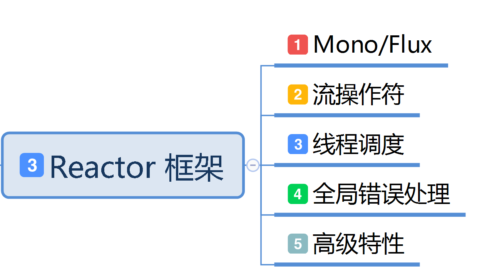

# 第四章: Reactor 框架

[[toc]]

> 说在前面的话，本文为个人学习[SpringBoot3响应式编程精讲](https://www.bilibili.com/video/BV1gsYEeLEuM?spm_id_from=333.788.videopod.episodes&vd_source=65c7f6924d2d8ba5fa0d4c448818e08a)后进行总结的文章，本文主要用于<b>响应式编程</b>。

## 【1】本章学习图解



## 【2】Project Reactor 官网

> 英文官网地址:  [https://projectreactor.io/](https://projectreactor.io/)

> 以往：

::: tabs

@tab:active  **高并发三宝**

- **异步**
- **缓存**
- **队列排好**

@tab **高可用三宝**

- **分片**
- **复制**
- **选领导**

@tab **非阻塞的原理**

- **缓冲区**
- **回调**

:::

> 现在，1个框架就全搞定了。 这就是 `Project Reactor` 框架

## 【3】Reactor 响应式编程模型


## 【4】引入相关jar

::: tabs

@tab:active 引入父pom的jar

``` xml
  <!--    引入project reactor 的jar     -->
<dependencyManagement> 
    <dependencies>
        <dependency>
            <groupId>io.projectreactor</groupId>
            <artifactId>reactor-bom</artifactId>
            <version>2024.0.6</version>
            <type>pom</type>
            <scope>import</scope>
        </dependency>
    </dependencies>
</dependencyManagement>
```

@tab 再在子pom.xml中引入使用的jar

```xml
<dependencies>
    <dependency>
        <groupId>io.projectreactor</groupId>
        <artifactId>reactor-core</artifactId> 
        
    </dependency>
    <dependency>
        <groupId>io.projectreactor</groupId>
        <artifactId>reactor-test</artifactId> 
        <scope>test</scope>
    </dependency>
</dependencies>
```

:::

## 【5】核心组件 Mono 和 Flux 

> 万物皆数据，数据分2种，1种是**单个或者没有**，另一种是**多个**
>
> 数据流 = N个元素  + 1个信号(完成/异常)

### 5.1 Flux 

> 

> 官网弹珠图:
>
> 

> With this large scope of possible signals, `Flux` is the general-purpose reactive type. Note that all events, even terminating ones, are optional: no `onNext` event but an `onComplete` event represents an *empty* finite sequence, but remove the `onComplete` and you have an *infinite* empty sequence (not particularly useful, except for tests around cancellation). Similarly, infinite sequences are not necessarily empty. For example, `Flux.interval(Duration)` produces a `Flux<Long>` that is infinite and emits regular ticks from a clock.
>
> 有了这么大范围的可能信号，`Flux`是通用的反应式类型。请注意，所有事件，甚至是终止事件，都是可选的：没有`onNext`事件，但`onComplete`事件表示一个*空*的有限序列，但删除`onComplete`，你有一个*无限*的空序列（不是特别有用，除了关于取消的测试）。类似地，无限序列不一定是空的。例如，`Flux.interval(Duration)`产生一个无限的`Flux<Long>`，并从时钟发出规则的滴答声。

### 5.2 Mono

> 

> 

> A `Mono<T>` is a specialized `Publisher<T>` that emits at most one item *via* the `onNext` signal then terminates with an `onComplete` signal (successful `Mono`, with or without value), or only emits a single `onError` signal (failed `Mono`).
>
> 一个`Mono<T>`是一个专门的`Publisher<T>`，它*通过*onNext信号发出最多一个项目`onNext`然后以`onComplete`信号终止（成功的`Mono`，有或没有值），或者只发出一个`onError`信号（失败的`Mono`）。
>
> Most `Mono` implementations are expected to immediately call `onComplete` on their `Subscriber` after having called `onNext`. `Mono.never()` is an outlier: it doesn’t emit any signal, which is not technically forbidden although not terribly useful outside of tests. On the other hand, a combination of `onNext` and `onError` is explicitly forbidden.
>
> 大多数`Mono`实现在调用`onNext`后会立即在`Subscriber`器上调用`onComplete`。`Mono.never()`是一个异常值：它不发出任何信号，这在技术上是不被禁止的，尽管在测试之外并不十分有用。另一方面，`onNext`和`onError`的组合被明确禁止。
>
> `Mono` offers only a subset of the operators that are available for a `Flux`, and some operators (notably those that combine the `Mono` with another `Publisher`) switch to a `Flux`. For example, `Mono#concatWith(Publisher)` returns a `Flux` while `Mono#then(Mono)` returns another `Mono`.
>
> `Mono`仅提供可用于`Flux`的运算符子集，一些运算符（特别是将`Mono`与另一个`Publisher`组合的运算符）切换到`Flux`。例如，`Mono#concatWith(Publisher)`返回一个`Flux`，而`Mono#then(Mono)`返回另一个`Mono`。
>
> Note that you can use a `Mono` to represent no-value asynchronous processes that only have the concept of completion (similar to a `Runnable`). To create one, you can use an empty `Mono<Void>`.
>
> 请注意，您可以使用`Mono`来表示只有完成概念的无值异步进程（类似于`Runnable`）。要创建一个，您可以使用空的`Mono<Void>`。

### 5.3 总结

> <b>`Flux`</b> ：代表包含 0 到 N 个元素的异步序列，支持 `onNext`（数据元素）、`onComplete`（完成信号）、`onError`（错误信号）三种事件通知。
>
> ‌<b>`Mono`</b> ‌：表示最多包含 ‌**0 或 1 个元素**‌的异步序列，适用于单值场景（如 HTTP 请求响应）。
>
> ‌**核心差异**‌：`Flux` 处理流式数据（如数据库查询结果集），`Mono` 处理单次操作（如保存结果）

### 5.4 设计原则

> - ‌**异步非阻塞**‌：通过事件驱动模型避免线程阻塞，提高并发吞吐量。
> - ‌<b>背压机制(Backpressure)</b>：消费者主动控制数据流速（如 `limitRate`），防止生产者过载。
> - ‌**声明式操作链**‌：通过操作符（如 `map`、`filter`）构建处理流水线，取代传统回调嵌套。

### 5.5 **关键操作符与代码实践**‌

#### 5.5.1 创建数据流‌

```java
// 静态创建 Flux
Flux<String> flux1 = Flux.just("Java", "Python", "Go"); // 直接创建元素
Flux<Integer> flux2 = Flux.range(1, 5); // 生成整数序列
Flux<Long> flux3 = Flux.interval(Duration.ofSeconds(1)); // 每秒发射一个递增整数

// 从集合创建
List<String> list = Arrays.asList("A", "B", "C");
Flux<String> flux4 = Flux.fromIterable(list); // 从集合派生

// 创建 Mono
Mono<String> mono1 = Mono.just("Hello"); // 单值
Mono<Void> mono2 = Mono.empty(); // 空序列（仅发送完成信号)
Mono<User> mono3 = Mono.fromCallable(() -> fetchUserById(1)); // 从异步任务创建
```

#### 5.5.2 转换与处理数据‌

```java
// Map：同步转换元素
Flux<String> upperFlux = Flux.just("a", "b")
    .map(String::toUpperCase); // 输出 "A", "B"

// FlatMap：异步转换（元素顺序可能乱序）
Flux<String> asyncFlux = Flux.just(1, 2)
    .flatMap(id -> Mono.fromFuture(fetchNameAsync(id))); // 异步获取名称

// Filter：过滤元素
Flux<Integer> filtered = Flux.range(1, 10)
    .filter(i -> i % 2 == 0); // 仅保留偶数

```

#### 5.5.3 错误处理

```java
// 捕获并返回默认值
Flux<Integer> safeFlux = Flux.error(new RuntimeException("Fail"))
    .onErrorReturn(0); // 出错时返回

// 重试机制
Flux<String> retryFlux = httpRequestFlux()
    .retry(3); // 失败时最多重试 3 次

```

#### 5.5.4 组合流

```java
// 合并流（并发执行）
Flux<String> merged = Flux.merge(fluxA, fluxB); // 元素按到达时间混合

// 按顺序拼接
Flux<String> concatenated = Flux.concat(fluxA, fluxB); // 先消费 fluxA 再 fluxB

// 聚合多个流结果
Mono<String> zipped = Mono.zip(monoA, monoB, (a, b) -> a + b); // 等待两个 Mono 完成并聚合

```

#### 5.5.5 背压控制

```java
Flux.range(1, 1000)
    .limitRate(100) // 每次请求 100 个元素
    .subscribe(
        data -> process(data), 
        err -> handleError(),
        () -> System.out.println("Completed")
    ); // 控制消费者拉取速率
```

### 5.6 事件感知 `doOnXxx`

#### 5.6.1 `doOnXxx` 核心作用

> - **功能定位**‌
>   - 用于在流生命周期中插入‌**副作用操作**‌（如日志、监控、调试），‌**不改变流内容**‌，仅感知事件
>   - 典型场景：记录元素到达时间、统计错误率、资源清理。
> - **与 `subscribe()` 回调的区别**‌
>   - `subscribe()`：定义‌**终端操作**‌（如消费数据、处理错误)
>   - `doOnXxx`：定义‌**中间操作**‌，可在流处理链中多次调用。

#### 5.6.2 常用 `doOnXxx` 方法‌

##### 5.6.2.1 基础事件感知

| ‌**方法**‌        | ‌**触发时机**‌     | ‌**示例用途**‌   |
| --------------- | ---------------- | -------------- |
| `doOnSubscribe` | 订阅发生时       | 记录订阅时间戳 |
| `doOnNext`      | 每个元素被发出时 | 打印元素值     |
| `doOnError`     | 流发生错误时     | 记录错误日志   |
| `doOnComplete`  | 流正常完成时     | 发送完成通知   |
| `doOnCancel`    | 流被取消时       | 释放占用的资源 |

##### 5.6.2.2 复合事件感知‌

- ‌`doOnEach`‌
   每个元素或信号（包括 `onNext`/`onComplete`/`onError`）到达时触发，通过 `Signal` 对象区分事件类型。

  ```java
  Flux.just("A", "B")
      .doOnEach(signal -> {
          if (signal.isOnNext()) System.out.println("元素: " + signal.get());
          if (signal.isOnComplete()) System.out.println("流完成");
      })
      .subscribe();
  ```

- ‌**`doFinally`**‌
   流终止（无论成功、失败或取消）时触发，适合资源清理。

  ```java
  Flux.range(1, 5)
      .doFinally(type -> {
          if (type == SignalType.CANCEL) System.out.println("流被取消");
      });
  ```

##### 5.6.2.3 代码实践

- 日志记录与监控

  ``` java
  Flux.just("apple", "banana")
      .doOnSubscribe(sub -> log.info("订阅开始"))
      .doOnNext(fruit -> log.debug("处理水果: {}", fruit))
      .doOnError(e -> log.error("处理失败", e))
      .doOnComplete(() -> log.info("处理完成"))
      .subscribe();
  ```

- 性能统计

  ```java
  Mono.fromCallable(() -> fetchFromDatabase(id))
      .doOnSubscribe(s -> startTimer())
      .doOnSuccess(data -> recordLatency())
      .doOnError(e -> incrementErrorCount());
  ```

- 资源管理

  ```java
  Flux.using(
      () -> openFile(),           // 资源创建
      file -> Flux.fromIterable(readLines(file)), // 流生成
      file -> closeFile(file)     // 资源释放
  )
  .doOnCancel(() -> log.warn("文件读取被中断"));
  ```

- 其他实践

  ```java
  import reactor.core.publisher.Flux;
  
  import java.time.Duration;
  
  /**
   * @author qianpengzhan
   * @since 2025/7/2 16:01
   */
  public class ReactorLearn01 {
      public static void main(String[] args) throws InterruptedException {
  
          // 1.多元素的流
          Flux<Integer> just = Flux.just(1, 2, 3, 4, 5, 6, 7, 8, 9, 10);
  
          just.subscribe(o1 -> System.out.println("o1: " + o1));
          just.subscribe(o2 -> System.out.println("o2: " + o2));
          // 执行后发现， 都打印了1~10
          // 说明对于每个订阅者来说,流都是一样的。  这就是广播模式
  
          // 2.每秒发布者产生1个递增的数字
          Flux<Long> interval = Flux.interval(Duration.ofSeconds(1));
          interval.subscribe(o -> System.out.println("o: " + o));
  
          // 等消费者订阅结束 或者等到15s 直接结束
          Thread.sleep(15000);
      }
  }
  ```

## 【6】核心组件`log()`

> 这个比较简单，主要是理解什么地方调用log() 则打印哪个流的日志。

- **代码实践一**

  ```java
  package com.learn.reactive.stream.flow;
  
  import reactor.core.publisher.Flux;
  
  /**
   * @author qianpengzhan
   * @since 2025/7/7 13:10
   */
  public class ReactorLogLearn {
      public static void main(String[] args) throws InterruptedException {
          Flux.range(1, 10)
                  .log()  // 这里的日志 是 OnNext(1,10)
                  .filter(integer -> integer % 2 == 0)
                  //.log()
                  .map(integer -> integer + 1)
                  //.log()
                  .subscribe(System.out::println);
  
          Thread.sleep(10000);
      }
  }
  // 执行后
  [ INFO] (main) | onSubscribe([Synchronous Fuseable] FluxRange.RangeSubscriptionConditional)
  [ INFO] (main) | request(unbounded)
  [ INFO] (main) | onNext(1)
  [ INFO] (main) | onNext(2)
  3
  [ INFO] (main) | onNext(3)
  [ INFO] (main) | onNext(4)
  5
  [ INFO] (main) | onNext(5)
  [ INFO] (main) | onNext(6)
  7
  [ INFO] (main) | onNext(7)
  [ INFO] (main) | onNext(8)
  9
  [ INFO] (main) | onNext(9)
  [ INFO] (main) | onNext(10)
  11
  [ INFO] (main) | onComplete()
  ```

- **代码实践二**

  ```java
  package com.learn.reactive.stream.flow;
  
  import reactor.core.publisher.Flux;
  
  /**
   * @author qianpengzhan
   * @since 2025/7/7 13:10
   */
  public class ReactorLogLearn {
      public static void main(String[] args) throws InterruptedException {
          Flux.range(1, 10)
                  //.log()  // 这里的日志 是 OnNext(1,10)
                  .filter(integer -> integer % 2 == 0)
                  .log()  // 这里的日志是 OnNext(2,4,6,8,10) 偶数
                  .map(integer -> integer + 1)
                  //.log()
                  .subscribe(System.out::println);
  
          Thread.sleep(10000);
      }
  }
  // 执行后：
  [ INFO] (main) | onSubscribe([Fuseable] FluxFilterFuseable.FilterFuseableSubscriber)
  [ INFO] (main) | request(unbounded)
  [ INFO] (main) | onNext(2)
  3
  [ INFO] (main) | onNext(4)
  5
  [ INFO] (main) | onNext(6)
  7
  [ INFO] (main) | onNext(8)
  9
  [ INFO] (main) | onNext(10)
  11
  [ INFO] (main) | onComplete()
  ```

  

- **代码实践三**

  ```java
  package com.learn.reactive.stream.flow;
  
  import reactor.core.publisher.Flux;
  
  /**
   * @author qianpengzhan
   * @since 2025/7/7 13:10
   */
  public class ReactorLogLearn {
      public static void main(String[] args) throws InterruptedException {
          Flux.range(1, 10)
                  //.log()  // 这里的日志 是 OnNext(1,10)
                  .filter(integer -> integer % 2 == 0)
                  //.log()  // 这里的日志是 OnNext(2,4,6,8,10) 偶数
                  .map(integer -> integer + 1)
                  .log()   // 这里就是偶数+1 3，5，7，9，11 5个数的流的日志了
                  .subscribe(System.out::println);
  
          Thread.sleep(10000);
      }
  }
  // 执行后
  [ INFO] (main) | onSubscribe([Fuseable] FluxMapFuseable.MapFuseableSubscriber)
  [ INFO] (main) | request(unbounded)
  [ INFO] (main) | onNext(3)
  3
  [ INFO] (main) | onNext(5)
  5
  [ INFO] (main) | onNext(7)
  7
  [ INFO] (main) | onNext(9)
  9
  [ INFO] (main) | onNext(11)
  11
  [ INFO] (main) | onComplete()
  ```

## 【7】核心组件`subscribe()`

### 7.1 订阅方法API

```java
subscribe();    Subscribe and trigger the sequence.   // 订阅并触发序列。

subscribe(Consumer<? super T> consumer);   Do something with each produced value.  // 对每个产生的值做些什么。

subscribe(Consumer<? super T> consumer,
          Consumer<? super Throwable> errorConsumer);  Deal with values but also react to an error.  // 处理值，但也对错误做出反应。

subscribe(Consumer<? super T> consumer,
          Consumer<? super Throwable> errorConsumer,
          Runnable completeConsumer); 
Deal with values and errors but also run some code when the sequence successfully completes.
// 处理值和错误，但也在序列成功完成时运行一些代码。

subscribe(Consumer<? super T> consumer,
          Consumer<? super Throwable> errorConsumer,
          Runnable completeConsumer,
          Consumer<? super Subscription> subscriptionConsumer); 
Deal with values and errors and successful completion but also do something with the `Subscription` produced by this `subscribe` call.
// 处理值和错误以及成功完成，但也对这个`subscribe`调用产生的`Subscription`做些什么。
```

::: important 订阅方法

> 流尚未被订阅不会触发流的流动，只有被订阅才会进行流的序列流动，且背压受订阅者控制流动速率。

:::

:::  tip TIP

> These variants return a reference to the subscription that you can use to cancel the subscription when no more data is needed. Upon cancellation, the source should stop producing values and clean up any resources it created. This cancel-and-clean-up behavior is represented in Reactor by the general-purpose `Disposable` interface.

> 这些变体返回对订阅的引用，当不需要更多数据时，您可以使用该引用来取消订阅。取消后，源应该停止生成值并清理它创建的任何资源。这种取消和清理行为在反应器中由通用的`Disposable`接口表示。

::: 

### 7.2 订阅方法代码示例

> 将根据上述的API对每种都进行代码示例

- **`subscribe()`** 

  ```java
  package com.learn.reactive.stream.flow;
  
  import reactor.core.publisher.Flux;
  
  /**
   * @author qianpengzhan
   * @since 2025/7/7 13:32
   */
  public class ReactorSubscribeLearn {
      public static void main(String[] args) {
          // 1. 不带参数的方法 subscribe()
          // 设置当订阅者连接时产生三个值的Flux。
          Flux<Integer> range = Flux.range(1, 10);
          // 以最简单的方式订阅 即 默认订阅
          range.log().subscribe();
      }
  }
  
  // 执行后:
  [ INFO] (main) | onSubscribe([Synchronous Fuseable] FluxRange.RangeSubscription)
  [ INFO] (main) | request(unbounded)
  [ INFO] (main) | onNext(1)
  [ INFO] (main) | onNext(2)
  [ INFO] (main) | onNext(3)
  [ INFO] (main) | onNext(4)
  [ INFO] (main) | onNext(5)
  [ INFO] (main) | onNext(6)
  [ INFO] (main) | onNext(7)
  [ INFO] (main) | onNext(8)
  [ INFO] (main) | onNext(9)
  [ INFO] (main) | onNext(10)
  [ INFO] (main) | onComplete()
  ```

- **`subscribe(Consumer<? super T> consumer)`** 

  ```java
  package com.learn.reactive.stream.flow;
  
  import reactor.core.publisher.Flux;
  
  /**
   * @author qianpengzhan
   * @since 2025/7/7 13:32
   */
  public class ReactorSubscribeLearn {
      public static void main(String[] args) {
          // 1. 不带参数的方法 subscribe()
          // 设置当订阅者连接时产生三个值的Flux。
          Flux<Integer> range = Flux.range(1, 10);
          // 以最简单的方式订阅 即 默认订阅
          //range.log().subscribe();
  
          // 2. subscribe(Consumer<? super T> consumer);
          // 以函数式接口作为订阅者 打印流的元素
          range.subscribe(System.out::println);
      }
  }
  // 执行后:
  1
  2
  3
  4
  5
  6
  7
  8
  9
  10
  ```

- **`subscribe(Consumer<? super T> consumer, Consumer<? super Throwable> errorConsumer)`** 

  ```java
  package com.learn.reactive.stream.flow;
  
  import reactor.core.publisher.Flux;
  
  /**
   * @author qianpengzhan
   * @since 2025/7/7 13:32
   */
  public class ReactorSubscribeLearn {
      public static void main(String[] args) {
          // 1. 不带参数的方法 subscribe()
          // 设置当订阅者连接时产生十个值的Flux。
          Flux<Integer> range = Flux.range(1, 10);
          // 以最简单的方式订阅 即 默认订阅
          //range.log().subscribe();
  
          // 2. subscribe(Consumer<? super T> consumer);
          // 以函数式接口作为订阅者 打印流的元素
          //range.subscribe(System.out::println);
  
          //3. subscribe(Consumer<? super T> consumer,
          //          Consumer<? super Throwable> errorConsumer);
          Flux<Integer> newRange = range.map(i -> {
              if (i == 9) {
                  return 10 / 0;
              }
              return i;
          });
          newRange.subscribe(System.out::println,
                  error -> {
                      System.out.println("error: " + error.getMessage());
                  });
      }
  }
  // 执行后：
  1
  2
  3
  4
  5
  6
  7
  8
  error: / by zero
  ```

- **`subscribe(Consumer<? super T> consumer,Consumer<? super Throwable> errorConsumer,Runnable completeConsumer)`**  

  ```java
  package com.learn.reactive.stream.flow;
  
  import reactor.core.publisher.Flux;
  
  /**
   * @author qianpengzhan
   * @since 2025/7/7 13:32
   */
  public class ReactorSubscribeLearn {
      public static void main(String[] args) {
          // 1. 不带参数的方法 subscribe()
          // 设置当订阅者连接时产生十个值的Flux。
          Flux<Integer> range = Flux.range(1, 10);
          // 以最简单的方式订阅 即 默认订阅
          //range.log().subscribe();
  
          // 2. subscribe(Consumer<? super T> consumer);
          // 以函数式接口作为订阅者 打印流的元素
          //range.subscribe(System.out::println);
  
          //3. subscribe(Consumer<? super T> consumer,
          //          Consumer<? super Throwable> errorConsumer);
          Flux<Integer> newRange = range.map(i -> {
              if (i == 9) {
                  return 10 / 0;
              }
              return i;
          });
  //        newRange.subscribe(System.out::println,
  //                error -> {
  //                    System.out.println("error: " + error.getMessage());
  //                });
  
          //4. subscribe(Consumer<? super T> consumer,Consumer<? super Throwable> errorConsumer,Runnable completeConsumer)
          // 加了完成信号
          range.subscribe(System.out::println,
                  error -> {
                      System.out.println("error: " + error.getMessage());
                  },
                  () -> System.out.println("done"));
      }
  }
  // 执行后:
  1
  2
  3
  4
  5
  6
  7
  8
  9
  10
  done
  ```

- **`subscribe(Consumer<? super T> consumer,Consumer<? super Throwable> errorConsumer,Runnable completeConsumer,Consumer<? super Subscription> subscriptionConsumer)`**  

  ```java
  package com.learn.reactive.stream.flow;
  
  import reactor.core.publisher.Flux;
  
  /**
   * @author qianpengzhan
   * @since 2025/7/7 13:32
   */
  public class ReactorSubscribeLearn {
      public static void main(String[] args) {
          // 1. 不带参数的方法 subscribe()
          // 设置当订阅者连接时产生十个值的Flux。
          Flux<Integer> range = Flux.range(1, 10);
          // 以最简单的方式订阅 即 默认订阅
          //range.log().subscribe();
  
          // 2. subscribe(Consumer<? super T> consumer);
          // 以函数式接口作为订阅者 打印流的元素
          //range.subscribe(System.out::println);
  
          //3. subscribe(Consumer<? super T> consumer,
          //          Consumer<? super Throwable> errorConsumer);
          Flux<Integer> newRange = range.map(i -> {
              if (i == 9) {
                  return 10 / 0;
              }
              return i;
          });
  //        newRange.subscribe(System.out::println,
  //                error -> {
  //                    System.out.println("error: " + error.getMessage());
  //                });
  
          //4. subscribe(Consumer<? super T> consumer,Consumer<? super Throwable> errorConsumer,Runnable completeConsumer)
          // 加了完成信号
  //        range.subscribe(System.out::println,
  //                error -> {
  //                    System.out.println("error: " + error.getMessage());
  //                },
  //                () -> System.out.println("done"));
  
          // 5.subscribe(Consumer<? super T> consumer,Consumer<? super Throwable> errorConsumer,Runnable completeConsumer,Consumer<? super Subscription> subscriptionConsumer)
  
          range.subscribe(System.out::println,
                  error -> {
                      System.out.println("error: " + error.getMessage());
                  },
                  () -> System.out.println("done"),
                  // 执行1个中间操作    
                  subscription -> {
                      subscription.request(Integer.MAX_VALUE);
                      System.out.println(subscription);
                  });
  
      }
  }
  //执行后：
  1
  2
  3
  4
  5
  6
  7
  8
  9
  10
  done
  reactor.core.publisher.FluxRange$RangeSubscription@50675690
  ```

### 7.3 订阅方法中自定义消费者

```java
package com.learn.reactive.stream.flow;

import org.reactivestreams.Subscription;
import reactor.core.publisher.BaseSubscriber;
import reactor.core.publisher.Flux;
import reactor.core.publisher.SignalType;

/**
 * 自定义消费者
 *
 * @author qianpengzhan
 * @since 2025/7/7 15:03
 */
public class ReactorSubscribeCustomSubscriberLearn {
    public static void main(String[] args) {
        // 发布者
        Flux<Integer> range = Flux.range(1, 10);

        // 订阅
        range.subscribe(new BaseSubscriber<Integer>() {
            //自定义实现hook 生命周期的钩子函数


            @Override
            protected void hookOnSubscribe(Subscription subscription) {
                System.out.println("订阅的时候触发本钩子函数..." + subscription);
                // 开始订阅元素
                request(1); // 每次要1个
                //requestUnbounded();// 每次要无限个
            }

            @Override
            protected void hookOnNext(Integer value) {
                System.out.println("元素到达的时候触发本钩子函数..." + value);
                // 开始订阅下一个元素
                request(1);
            }

            @Override
            protected void hookOnComplete() {
                System.out.println("元素全部流动结束的时候触发本钩子函数...");
            }

            @Override
            protected void hookOnError(Throwable throwable) {
                System.out.println("元素流动过程中触发报错的时候触发本钩子函数..." + throwable.getMessage());
            }

            @Override
            protected void hookOnCancel() {
                System.out.println("元素取消发布的时候触发本钩子函数...");
            }

            @Override
            protected void hookFinally(SignalType type) {
                System.out.println("资源结束的时候触发本钩子函数..." + type);
            }
        });
    }
}

//执行后：
订阅的时候触发本钩子函数...reactor.core.publisher.FluxRange$RangeSubscription@46f5f779
元素到达的时候触发本钩子函数...1
元素到达的时候触发本钩子函数...2
元素到达的时候触发本钩子函数...3
元素到达的时候触发本钩子函数...4
元素到达的时候触发本钩子函数...5
元素到达的时候触发本钩子函数...6
元素到达的时候触发本钩子函数...7
元素到达的时候触发本钩子函数...8
元素到达的时候触发本钩子函数...9
元素到达的时候触发本钩子函数...10
元素全部流动结束的时候触发本钩子函数...
资源结束的时候触发本钩子函数...onComplete
```

> 这里就不演示 `oncancle` `onError`了. 有兴趣的可以自行改下代码调试下.

## 【8】核心 - 请求重塑

> 

> When implementing backpressure in Reactor, the way consumer pressure is propagated back to the source is by sending a `request` to the upstream operator. The sum of current requests is sometimes referenced to as the current “demand”, or “pending request”. Demand is capped at `Long.MAX_VALUE`, representing an unbounded request (meaning “produce as fast as you can” — basically disabling backpressure).

> 在反应器中实现背压时，消费者压力传播回源的方式是向上游操作员发送请求。当前请求的总和有时被引用为当前“需求”或“待处理请求”。需求上限为Long.MAX_VALUE，代表无界请求（意思是“尽可能快地生产”——基本上禁用反压）。

> The first request comes from the final subscriber at  subscription time, yet the most direct ways of subscribing all  immediately trigger an unbounded request of `Long.MAX_VALUE`:

> 第一个请求来自订阅时的最终订阅者，但最直接的订阅方式都会立即触发Long.MAX_VALUE的无界请求：
>
> - `subscribe()` and most of its lambda-based variants (to the exception of the one that has a `Consumer<Subscription>`)
> - 订阅（）及其大多数基于lambda的变体（具有消费者<订阅>的变体除外）
> - `block()`, `blockFirst()` and `blockLast()`
> - 阻塞，阻塞第一个，阻塞最后1个
> - iterating over a `toIterable()` or `toStream()`
> - 迭代，转迭代，转流

> The simplest way of customizing the original request is to `subscribe` with a `BaseSubscriber` with the `hookOnSubscribe` method overridden, as the following example shows:
>
> 自定义原始请求的最简单方法是使用覆盖hookOnSubscribe方法的BaseSubscriber订阅，如下例所示：
>
> ```java
> package com.learn.reactive.stream.flow;
> 
> import org.reactivestreams.Subscription;
> import reactor.core.publisher.BaseSubscriber;
> import reactor.core.publisher.Flux;
> 
> /**
>  * 请求重塑
>  *
>  * @author qianpengzhan
>  * @since 2025/7/7 15:32
>  */
> public class ReactorReshapeRequests {
>     public static void main(String[] args) {
>         Flux.range(1, 10)
>                 .doOnRequest(r -> System.out.println("request of " + r))
>                 .subscribe(new BaseSubscriber<Integer>() {
> 
>                     @Override
>                     public void hookOnSubscribe(Subscription subscription) {
>                         request(1);
>                     }
> 
>                     @Override
>                     public void hookOnNext(Integer integer) {
>                         System.out.println("Cancelling after having received " + integer);
>                         // 这个就是取消订阅了
>                         cancel();
>                     }
>                 });
>     }
> }
> 
> // 执行后:
> request of 1
> Cancelling after having received 1
> ```

::: warning 注意事项

>When manipulating a request, you must be careful to produce enough demand for the sequence to advance, or your Flux can get “stuck”. That is why `BaseSubscriber` defaults to an unbounded request in `hookOnSubscribe`. When overriding this hook, you should usually call `request` at least once.

>操作请求时，您必须小心产生足够的需求以使序列前进，否则您的`Flux`可能会“卡住”。这就是为什么`BaseSubscriber`在`hookOnSubscribe`中默认为无界请求。覆盖此钩子函数时，您通常应该至少调用一次请求。

:::

### 8.1 buffer(N)

::: info 资料

> One thing to keep in mind is that demand expressed at the subscribe level **can** be reshaped by each operator in the upstream chain. A textbook case is the `buffer(N)` operator: If it receives a `request(2)`, it is interpreted as a demand for **two full buffers**. As a consequence, since buffers need `N` elements to be considered full, the `buffer` operator reshapes the request to `2 x N`.

> 需要记住的一件事是，在订阅级别表达的需求可以被上游链中的每个运算符重塑。一个典型的案例是缓冲区（N）运算符：如果它收到一个请求（2），它被解释为对两个完整缓冲区的需求。结果，由于缓冲区需要N个元素才能被认为是完整的，缓冲区运算符将请求重塑为2 x N。

:::


```java
package com.learn.reactive.stream.flow;

import reactor.core.publisher.Flux;

import java.util.List;

/**
 * 请求重塑 buffer N 代码示例
 *
 * @author qianpengzhan
 * @since 2025/7/7 16:19
 */
public class ReactorBufferNLearn {
    public static void main(String[] args) {
        Flux<List<Integer>> buffer = Flux.range(1, 10)
                .buffer(2);// 缓冲区 缓存2个元素 消费1次可以拿到2个元素 凑满后批量发给消费者
        buffer.subscribe(b -> System.out.println("buffer.type: " + b.getClass() + ", value: " + b.toString()));
        // 执行后：
        /*
         buffer.type: class java.util.ArrayList, value: [1, 2]
         buffer.type: class java.util.ArrayList, value: [3, 4]
         buffer.type: class java.util.ArrayList, value: [5, 6]
         buffer.type: class java.util.ArrayList, value: [7, 8]
         buffer.type: class java.util.ArrayList, value: [9, 10]
         */
    }
}
```

### 8.2 limitRate(N)

::: info 资料

>`limitRate(N)` splits the downstream requests so that they are propagated upstream in smaller batches. For instance, a request of `100` made to `limitRate(10)` would result in, at most, `10` requests of `10` being propagated to the upstream. Note that, in this form, `limitRate` actually implements the replenishing optimization discussed earlier.

> 限制速率（N）拆分下游请求，以便它们以较小的批次向上游传播。例如，向限制速率（10）发出100的请求最多会导致10个10的请求被传播到上游。请注意，在这种形式下，限制速率实际上实现了前面讨论的补充优化。

::: 


```java
package com.learn.reactive.stream.flow;

import reactor.core.publisher.Flux;

/**
 * 请求重塑 请求速率控制
 *
 * @author qianpengzhan
 * @since 2025/7/7 16:26
 */
public class ReactorLimitRateLearn {
    public static void main(String[] args) {
        //
        Flux<Integer> limitRate = Flux.range(1, 1000)
                .log()
                .limitRate(100);
        limitRate.subscribe();

        // 75%的预取策略 若75%的元素已经处理  则继续取新的75%的元素进入预取池 进行处理
    }
}
// 执行后:
[ INFO] (main) | onSubscribe([Synchronous Fuseable] FluxRange.RangeSubscription)
[ INFO] (main) | request(100)
[ INFO] (main) | onNext(1)
[ INFO] (main) | onNext(2)
[ INFO] (main) | onNext(3)
[ INFO] (main) | onNext(4)
    ...
[ INFO] (main) | onNext(73)
[ INFO] (main) | onNext(74)
[ INFO] (main) | onNext(75)
[ INFO] (main) | request(75)  取新的75%元素
[ INFO] (main) | onNext(76)
[ INFO] (main) | onNext(77)
[ INFO] (main) | onNext(78)
[ INFO] (main) | onNext(79)
    ...
[ INFO] (main) | onNext(147)
[ INFO] (main) | onNext(148)
[ INFO] (main) | onNext(149)
[ INFO] (main) | onNext(150)
[ INFO] (main) | request(75) 取新的75%元素
[ INFO] (main) | onNext(151)
[ INFO] (main) | onNext(152)
[ INFO] (main) | onNext(153)
[ INFO] (main) | onNext(154)
    ...
[ INFO] (main) | onNext(972)
[ INFO] (main) | onNext(973)
[ INFO] (main) | onNext(974)
[ INFO] (main) | onNext(975)
[ INFO] (main) | request(75) 取新的75%元素
[ INFO] (main) | onNext(976)
[ INFO] (main) | onNext(977)
[ INFO] (main) | onNext(978)
[ INFO] (main) | onNext(979)
[ INFO] (main) | onNext(980)
[ INFO] (main) | onNext(981)
[ INFO] (main) | onNext(982)
[ INFO] (main) | onNext(983)
[ INFO] (main) | onNext(984)
[ INFO] (main) | onNext(985)
[ INFO] (main) | onNext(986)
[ INFO] (main) | onNext(987)
[ INFO] (main) | onNext(988)
[ INFO] (main) | onNext(989)
[ INFO] (main) | onNext(990)
[ INFO] (main) | onNext(991)
[ INFO] (main) | onNext(992)
[ INFO] (main) | onNext(993)
[ INFO] (main) | onNext(994)
[ INFO] (main) | onNext(995)
[ INFO] (main) | onNext(996)
[ INFO] (main) | onNext(997)
[ INFO] (main) | onNext(998)
[ INFO] (main) | onNext(999)
[ INFO] (main) | onNext(1000)
[ INFO] (main) | onComplete()
```

### 8.3 limitRequest(N)  Expired

::: info 资料

> `limitRequest(N)`, on the other hand, **caps** the downstream request to a maximum total demand. It adds up requests up to `N`. If a single `request` does not make the total demand overflow over `N`, that particular request is wholly propagated upstream. After that amount has been emitted by the source, `limitRequest` considers the sequence complete, sends an `onComplete` signal downstream, and cancels the source.

> 另一方面，限制请求（N）将目标端请求限制为最大总需求。它将请求加起来最多为N。如果单个请求没有使总需求溢出超过N，则该特定请求完全向上游传播。在源发出该数量后，限制请求认为序列已完成，向目标端发送onFull信号，并取消源。

:::

## 【9】核心组件 - 以编程方式创建序列

### 9.1 同步生成

> 编程创建`Flux`的最简单形式是通过生成方法，该方法采用生成器函数。

> 这是用于同步和逐个排放的，这意味着接收器是一个同步接收器，并且每次回调调用最多只能调用一次它的`next()`方法。然后您可以额外调用`error``（Throwable）`或完成`（）`，但这是可选的。

> 最有用的变体可能是允许您保留接收器使用详情可见的状态以决定下一步发出什么的变体。然后生成器函数变成`BiFunction<S， SynsynousSink<T>，S>`，其中`<S>`是状态对象的类型。您必须为初始状态/初状态提供一个供应商`<S>`，现在生成器函数在每轮都返回一个新状态。

> For instance, you could use an `int` as the state:
>
> ```java
> package com.learn.reactive.stream.flow;
> 
> import reactor.core.publisher.Flux;
> 
> /**
>  * @author qianpengzhan
>  * @since 2025/7/7 17:00
>  */
> public class ReactorGenerateSeqLearn01 {
>     public static void main(String[] args) {
>         // 1. 同步生成序列
>         Flux<String> flux = Flux.generate(
>                 () -> 0,   // 我们提供初始状态值0。
>                 // 这里的state就是状态值 sink就是水槽、管道、数据的接收器
>                 (state, sink) -> {
>                     sink.next("3 x " + state + " = " + 3 * state);  // 我们使用状态来选择要发射的内容（乘法表3中的一行）。
>                     if (state == 10) sink.complete(); // 我们也用它来选择何时停止。
>                     return state + 1;  // 我们返回一个我们在下一次调用中使用的新状态（除非序列在这个调用中终止）。
>                 });
>         flux.log().subscribe();
>     }
> }
> // 执行后:
> [ INFO] (main) | onSubscribe([Fuseable] FluxGenerate.GenerateSubscription)
> [ INFO] (main) | request(unbounded)
> [ INFO] (main) | onNext(3 x 0 = 0)
> [ INFO] (main) | onNext(3 x 1 = 3)
> [ INFO] (main) | onNext(3 x 2 = 6)
> [ INFO] (main) | onNext(3 x 3 = 9)
> [ INFO] (main) | onNext(3 x 4 = 12)
> [ INFO] (main) | onNext(3 x 5 = 15)
> [ INFO] (main) | onNext(3 x 6 = 18)
> [ INFO] (main) | onNext(3 x 7 = 21)
> [ INFO] (main) | onNext(3 x 8 = 24)
> [ INFO] (main) | onNext(3 x 9 = 27)
> [ INFO] (main) | onNext(3 x 10 = 30)
> [ INFO] (main) | onComplete()
> ```

> 您也可以使用可变的`<S>`。上面的实例可以使用单个原子长作为状态重写，每轮都改变它：
>
> ```java
> package com.learn.reactive.stream.flow;
> 
> import reactor.core.publisher.Flux;
> 
> import java.util.concurrent.atomic.AtomicLong;
> 
> /**
>  * @author qianpengzhan
>  * @since 2025/7/7 17:00
>  */
> public class ReactorGenerateSeqLearn01 {
>     public static void main(String[] args) {
>         // 1. 同步生成序列
> //        Flux<String> flux = Flux.generate(
> //                () -> 0,   // 我们提供初始状态值0。
> //                // 这里的state就是状态值 sink就是水槽、管道、数据的接收器
> //                (state, sink) -> {
> //                    sink.next("3 x " + state + " = " + 3 * state);  // 我们使用状态来选择要发射的内容（乘法表3中的一行）。
> //                    if (state == 10) sink.complete(); // 我们也用它来选择何时停止。
> //                    return state + 1;  // 我们返回一个我们在下一次调用中使用的新状态（除非序列在这个调用中终止）。
> //                });
>         //flux.log().subscribe();
> 
>         // 您也可以使用可变的<S>。上面的实例可以使用单个原子长作为状态重写，每轮都改变它：
>         Flux<String> flux = Flux.generate(
>                 AtomicLong::new,
>                 (state, sink) -> {
>                     long i = state.getAndIncrement();
>                     sink.next("3 x " + i + " = " + 3 * i);
>                     if (i == 10) sink.complete();
>                     return state;
>                 });
>         flux.log().subscribe();
>     }
> }
> // 执行后：
> [ INFO] (main) | onSubscribe([Fuseable] FluxGenerate.GenerateSubscription)
> [ INFO] (main) | request(unbounded)
> [ INFO] (main) | onNext(3 x 0 = 0)
> [ INFO] (main) | onNext(3 x 1 = 3)
> [ INFO] (main) | onNext(3 x 2 = 6)
> [ INFO] (main) | onNext(3 x 3 = 9)
> [ INFO] (main) | onNext(3 x 4 = 12)
> [ INFO] (main) | onNext(3 x 5 = 15)
> [ INFO] (main) | onNext(3 x 6 = 18)
> [ INFO] (main) | onNext(3 x 7 = 21)
> [ INFO] (main) | onNext(3 x 8 = 24)
> [ INFO] (main) | onNext(3 x 9 = 27)
> [ INFO] (main) | onNext(3 x 10 = 30)
> [ INFO] (main) | onComplete()
> ```

### 9.2 异步或者多线程生成序列

> `Create`是一种更高级的`Flux`编程创建形式，适用于每轮多次发射，甚至来自多个线程。
>
> 它公开了一个`FLUSink`，以及它的下一个、错误和完整的方法。与生成相反，它没有基于状态的变体。另一方面，它可以在回调/回传中触发多线程事件。

```java
package com.learn.reactive.stream.flow;

import reactor.core.publisher.Flux;
import reactor.core.publisher.FluxSink;

/**
 * @author qianpengzhan
 * @since 2025/7/7 17:00
 */
public class ReactorGenerateSeqLearn01 {
    public static void main(String[] args) {
        // 1. 同步生成序列
//        Flux<String> flux = Flux.generate(
//                () -> 0,   // 我们提供初始状态值0。
//                // 这里的state就是状态值 sink就是水槽、管道、数据的接收器
//                (state, sink) -> {
//                    sink.next("3 x " + state + " = " + 3 * state);  // 我们使用状态来选择要发射的内容（乘法表3中的一行）。
//                    if (state == 10) sink.complete(); // 我们也用它来选择何时停止。
//                    return state + 1;  // 我们返回一个我们在下一次调用中使用的新状态（除非序列在这个调用中终止）。
//                });
        //flux.log().subscribe();

//        // 您也可以使用可变的<S>。上面的实例可以使用单个原子长作为状态重写，每轮都改变它：
//        Flux<String> flux = Flux.generate(
//                AtomicLong::new,
//                (state, sink) -> {
//                    long i = state.getAndIncrement();
//                    sink.next("3 x " + i + " = " + 3 * i);
//                    if (i == 10) sink.complete();
//                    return state;
//                });
//        flux.log().subscribe();

        // 2、异步或者多线程创建序列
        Flux.create(sink -> {
            MyListener listener = new MyListener(sink);
            for (int i = 0; i < 10; i++) {
                listener.online(i + "");
            }
        }).log().subscribe();
    }

    static class MyListener {
        private FluxSink<Object> sink;

        public MyListener(FluxSink<Object> sink) {
            this.sink = sink;
        }

        public void online(String s) {
            sink.next("hello-" + s);
        }
    }
}
//执行后:
[ INFO] (main) onSubscribe(FluxCreate.BufferAsyncSink)
[ INFO] (main) request(unbounded)
[ INFO] (main) onNext(hello-0)
[ INFO] (main) onNext(hello-1)
[ INFO] (main) onNext(hello-2)
[ INFO] (main) onNext(hello-3)
[ INFO] (main) onNext(hello-4)
[ INFO] (main) onNext(hello-5)
[ INFO] (main) onNext(hello-6)
[ INFO] (main) onNext(hello-7)
[ INFO] (main) onNext(hello-8)
[ INFO] (main) onNext(hello-9)
```

### 9.3 自定义元素处理器 Handle


```java
package com.learn.reactive.stream.flow;

import reactor.core.publisher.Flux;

/**
 * @author qianpengzhan
 * @since 2025/7/7 17:46
 */
public class ReactorCustomHandleLearn {
    public static void main(String[] args) {
        // 自定义处理器 Handle
        Flux<Object> handle = Flux.range(1, 10)
                .handle((v, e) -> {
                    v = v * 2 - 1;
                    e.next(v);
                });
        handle.log().subscribe();
    }
}
//执行后：
[ INFO] (main) | onSubscribe([Fuseable] FluxHandleFuseable.HandleFuseableSubscriber)
[ INFO] (main) | request(unbounded)
[ INFO] (main) | onNext(1)
[ INFO] (main) | onNext(3)
[ INFO] (main) | onNext(5)
[ INFO] (main) | onNext(7)
[ INFO] (main) | onNext(9)
[ INFO] (main) | onNext(11)
[ INFO] (main) | onNext(13)
[ INFO] (main) | onNext(15)
[ INFO] (main) | onNext(17)
[ INFO] (main) | onNext(19)
[ INFO] (main) | onComplete()
```

## 【10】核心 - 自定义线程调度规则

```java
package com.learn.reactive.stream.flow;

import reactor.core.publisher.Flux;
import reactor.core.scheduler.Schedulers;

import java.util.concurrent.ArrayBlockingQueue;
import java.util.concurrent.ThreadPoolExecutor;
import java.util.concurrent.TimeUnit;

/**
 * @author qianpengzhan
 * @since 2025/7/7 17:51
 */
public class ReactorThreadsAndSchedulesLearn01 {
    public static void main(String[] args) throws InterruptedException {
        // 调度器  线程池
        Schedulers.boundedElastic(); // 有界  弹性调度 不是无限扩充的线程池  10*CPU的线程池 队列默认100K 默认60秒存活时间
        Schedulers.immediate(); // 无执行上下文 当前线程执行所有操作  默认使用这个
        Schedulers.single(); // 使用固定的单线程执行所有操作
        Schedulers.fromExecutor(new ThreadPoolExecutor(4, 8, 60, TimeUnit.SECONDS,
                new ArrayBlockingQueue<>(100)));  // 自定义的线程池

        // publishOn(Schedulers.boundedElastic())  改变发布者的线程池
        // subscribeOn(Schedulers.boundedElastic()) 改变订阅者的线程池

        Flux.range(1, 10)
                .publishOn(Schedulers.boundedElastic())
                .log()
                .subscribe();
        /**
         * [ INFO] (main) | onSubscribe([Fuseable] FluxPublishOn.PublishOnSubscriber)
         * [ INFO] (main) | request(unbounded)
         * [ INFO] (boundedElastic-1) | onNext(1)
         * [ INFO] (boundedElastic-1) | onNext(2)
         * [ INFO] (boundedElastic-1) | onNext(3)
         * [ INFO] (boundedElastic-1) | onNext(4)
         * [ INFO] (boundedElastic-1) | onNext(5)
         * [ INFO] (boundedElastic-1) | onNext(6)
         * [ INFO] (boundedElastic-1) | onNext(7)
         * [ INFO] (boundedElastic-1) | onNext(8)
         * [ INFO] (boundedElastic-1) | onNext(9)
         * [ INFO] (boundedElastic-1) | onNext(10)
         * [ INFO] (boundedElastic-1) | onComplete()
         */

        Flux.range(1, 10)
                .publishOn(Schedulers.single())
                .log()
                .subscribe();
        /**
         * [ INFO] (main) | onSubscribe([Fuseable] FluxPublishOn.PublishOnSubscriber)
         * [ INFO] (main) | request(unbounded)
         * [ INFO] (single-1) | onNext(1)
         * [ INFO] (single-1) | onNext(2)
         * [ INFO] (single-1) | onNext(3)
         * [ INFO] (single-1) | onNext(4)
         * [ INFO] (single-1) | onNext(5)
         * [ INFO] (single-1) | onNext(6)
         * [ INFO] (single-1) | onNext(7)
         * [ INFO] (single-1) | onNext(8)
         * [ INFO] (single-1) | onNext(9)
         * [ INFO] (single-1) | onNext(10)
         * [ INFO] (single-1) | onComplete()
         */

        // 异步换线程了 所以需要阻塞下
        Thread.sleep(2000);
    }
}
```

## 【11】Reactor API的常用操作

> Reactor API的常规操作有哪些:
>
> - `fliter`
> - `flatMap`
> - `concatMap`
> - `transform`
> - `defautlIfEmpty`
> - `switchIfEmpty`
> - `merge`
> - `zip`

### 11.1 `filter`

> 数据流经过这个API会根据`filter`中的断言来挑选符合它条件的数据流进入后面的操作中。


```java
package com.learn.reactive.stream.flow;

import org.junit.Test;
import reactor.core.publisher.Flux;

/**
 * @author qianpengzhan
 * @since 2025/7/8 9:44
 */
public class FilterTest {
    
    @Test
    public void filterTest() {
        // filter 挑选符合条件的元素或者对象
        Flux.just(1, 2, 3, 4)
                //.log()
                .filter(i -> i % 2 == 0)   // 挑选偶数
                //.log()
                .subscribe();
        /*
[ INFO] (main) | onSubscribe([Synchronous Fuseable] FluxArray.ArrayConditionalSubscription)
[ INFO] (main) | request(unbounded)
[ INFO] (main) | onNext(1)
[ INFO] (main) | request(1)
[ INFO] (main) | onNext(2)
[ INFO] (main) | onNext(3)
[ INFO] (main) | request(1)
[ INFO] (main) | onNext(4)
[ INFO] (main) | onComplete()
         */

        Flux.range(1, 4)
                .log()
                .filter(i -> i % 2 == 0)   // 挑选偶数
                //.log()
                .subscribe();
        /*
[ INFO] (main) | onSubscribe([Synchronous Fuseable] FluxRange.RangeSubscriptionConditional)
[ INFO] (main) | request(unbounded)
[ INFO] (main) | onNext(1)
[ INFO] (main) | onNext(2)
[ INFO] (main) | onNext(3)
[ INFO] (main) | onNext(4)
[ INFO] (main) | onComplete()

         */
	// 这里打印日志不一样的点  range 和 just 得到的数据类型不同， filter 会存在先执行 后执行的问题
    // just中值是数据库流为空 1个个的发射， range是 已经把这些值放入 数据流 然后一起发射 消费端再订阅
    }
}

```

###  11.2 `flatMap`

> 扁平化数据流操作。可以将数据流的某个元素按照规则扁平化为多个不同的元素的操作。


```java
package com.learn.reactive.stream.flow;

import org.junit.Test;
import reactor.core.publisher.Flux;

/**
 * @author qianpengzhan
 * @since 2025/7/8 10:23
 */
public class FlatMapTest {

    @Test
    public void flatMapTest() {
        Flux<String> just = Flux.just("zhang san", "li si", "wang er ma zi");
        // 将上述数据流的数据按照空格切分为多个字符串
        just.log().flatMap(i -> Flux.fromArray(i.split(" "))).subscribe();

        /*
        这里是原数据库流怎么被扁平化的操作的日志
        [ INFO] (main) | onSubscribe([Synchronous Fuseable] FluxArray.ArraySubscription)
        [ INFO] (main) | request(256)
        [ INFO] (main) | onNext(zhang san)
        [ INFO] (main) | request(1)              // 这里就是先扁平化 然后再取值
        [ INFO] (main) | onNext(li si)
        [ INFO] (main) | request(1)             // 这里就是先扁平化 然后再取值
        [ INFO] (main) | onNext(wang er ma zi)
        [ INFO] (main) | request(1)             // 这里就是先扁平化 然后再取值
        [ INFO] (main) | onComplete()
         */

        just.flatMap(i -> Flux.fromArray(i.split(" "))).log().subscribe();
        /*
        这里就是打印扁平化之后的所有元素
        [ INFO] (main) onSubscribe(FluxFlatMap.FlatMapMain)
        [ INFO] (main) request(unbounded)
        [ INFO] (main) onNext(zhang)
        [ INFO] (main) onNext(san)
        [ INFO] (main) onNext(li)
        [ INFO] (main) onNext(si)
        [ INFO] (main) onNext(wang)
        [ INFO] (main) onNext(er)
        [ INFO] (main) onNext(ma)
        [ INFO] (main) onNext(zi)
        [ INFO] (main) onComplete()
         */
    }
}

```

###  11.3 `concatMap`

> 这里有三个API
>
> - `concat` :  `Flux`.`concat(Publisher1,Publisher2,...)`  可以连接多个发布者 将多个发布者的数据源串在一起
> - `concatMap`: `Flux.just(1,2,3,4).concatMap(Function)` 对原数据源的每个元素进行转换之后拼接一起组成新的数据源
> - `concatWith`: `Flux.just(1,2).concatWith(Flux.just(3,4))` 老数据源和同类型的新数据源拼接在一起


```java
package com.learn.reactive.stream.flow;

import org.junit.Test;
import reactor.core.publisher.Flux;

/**
 * @author qianpengzhan
 * @since 2025/7/8 11:10
 */
public class ConcatMapTest {

    @Test
    public void concatTest() {
        // `concat` :  `Flux`.`concat(Publisher1,Publisher2,...)`  可以连接多个发布者 将多个发布者的数据源串在一起
        // 这种支持不同类型的数据源之间的拼接 串联
        Flux.concat(Flux.range(1, 4), Flux.just("zhang san", "li si"))
                .log()
                .subscribe();
        /*
        [ INFO] (main) onSubscribe(FluxConcatArray.ConcatArraySubscriber)
        [ INFO] (main) request(unbounded)
        [ INFO] (main) onNext(1)
        [ INFO] (main) onNext(2)
        [ INFO] (main) onNext(3)
        [ INFO] (main) onNext(4)
        [ INFO] (main) onNext(zhang san)
        [ INFO] (main) onNext(li si)
        [ INFO] (main) onComplete()
         */
    }


    @Test
    public void concatMapTest() {
        // `concatMap`: `Flux.just(1,2,3,4).concatMap(Function)` 对原数据源的每个元素进行转换之后拼接一起组成新的数据源
        Flux.just(1, 2, 3)
                .concatMap(i -> Flux.just(i + 1))
                .log()
                .subscribe();
        /*
        [ INFO] (main) onSubscribe(FluxConcatMapNoPrefetch.FluxConcatMapNoPrefetchSubscriber)
        [ INFO] (main) request(unbounded)
        [ INFO] (main) onNext(2)
        [ INFO] (main) onNext(3)
        [ INFO] (main) onNext(4)
        [ INFO] (main) onComplete()
         */
    }


    @Test
    public void concatWithTest() {
        // `concatWith`: `Flux.just(1,2).concatWith(Flux.just(3,4))` 老数据源和同类型的新数据源拼接在一起
        Flux.just(1, 2, 3)
                .concatWith(Flux.range(1, 4))
                .log()
                .subscribe();
        /*
        [ INFO] (main) | onSubscribe([Fuseable] FluxOnAssembly.OnAssemblySubscriber)
        [ INFO] (main) | request(unbounded)
        [ INFO] (main) | onNext(1)
        [ INFO] (main) | onNext(2)
        [ INFO] (main) | onNext(3)
        [ INFO] (main) | onNext(1)
        [ INFO] (main) | onNext(2)
        [ INFO] (main) | onNext(3)
        [ INFO] (main) | onNext(4)
        [ INFO] (main) | onComplete()
         */
    }
}

```

### 11.4 `transform`

> 把流变成新数据
>
> - `transform` : 直接变换
>   - 
> - `transformDeferred`":  带有延迟的变换
>   - 

```java
package com.learn.reactive.stream.flow;

import org.junit.Test;
import reactor.core.publisher.Flux;

import java.util.concurrent.atomic.AtomicInteger;

/**
 * @author qianpengzhan
 * @since 2025/7/8 13:04
 */
public class TransformTest {

    @Test
    public void transformTest() {
        // 假设一个场景
        // transform 不会共享变量 各自处理各自的
        AtomicInteger count = new AtomicInteger(0);
        Flux<String> transform = Flux.just("a", "b", "c")
                .transform(v -> {
                    if (count.incrementAndGet() == 1) {
                        // 第1次调用 则转大写
                        return v.map(String::toUpperCase);
                    } else {
                        // 非第一次 返回原值
                        return v;
                    }
                });
        transform.subscribe(v -> System.out.println("订阅者1： " + v));
        transform.subscribe(v -> System.out.println("订阅者2： " + v));
        /*
        订阅者1： A
        订阅者1： B
        订阅者1： C
        订阅者2： A
        订阅者2： B
        订阅者2： C
         */

        // transformDeferred 有状态的变化  count
        AtomicInteger count1 = new AtomicInteger(0);
        Flux<String> transform1 = Flux.just("a", "b", "c")
                .transformDeferred(v -> {
                    if (count1.incrementAndGet() == 1) {
                        // 第1次调用 则转大写
                        return v.map(String::toUpperCase);
                    } else {
                        // 非第一次 返回原值
                        return v;
                    }
                });
        transform1.subscribe(v -> System.out.println("订阅者3： " + v));
        transform1.subscribe(v -> System.out.println("订阅者4： " + v));
        /*
        订阅者3： A
        订阅者3： B
        订阅者3： C
        订阅者4： a
        订阅者4： b
        订阅者4： c
         */
    }
}

```

### 11.5 `ifEmpty`

> 就是判空
>
> - `defaultIfEmpty` : 若发布者的数据流为空则给默认流，反之使用该发布者的流 (兜底处理)
>   - 
> - `switchIfEmpty`： 动态兜底转换数据流
>   - 

```java
package com.learn.reactive.stream.flow;

import org.junit.Test;
import reactor.core.publisher.Mono;

/**
 * @author qianpengzhan
 * @since 2025/7/8 13:31
 */
public class EmptyTest {


    @Test
    public void test1() {
        // Mono.just(null) 这个不是空流
        // Mono.empty(); 这个是空流 只有1个完成信号
        get()
                .switchIfEmpty(Mono.just("z"))
                .defaultIfEmpty("x")
                .subscribe(System.out::println);
    }

    Mono<String> get() {
        // return Mono.empty();
        return Mono.just("y");
    }
}

```

### 11.6  `merge`  

> 类似`concat`，它也有三个API，这个叫做**`合并`** 
>
> - `merge`
>   - 
>
> - `mergeWith`
>   - 

```java
package com.learn.reactive.stream.flow;

import org.junit.Test;
import reactor.core.publisher.Flux;

import java.time.Duration;

/**
 * @author qianpengzhan
 * @since 2025/7/8 13:49
 */
public class MergeTest {

    @Test
    public void mergeTest() throws InterruptedException {
        //类似于提交代码的merge
        // 将多个数据源的流按照每个元素的时间戳重新排列得到新的数据流
        Flux<String> merge = Flux.merge(
                Flux.just("a", "b", "c").delayElements(Duration.ofSeconds(1)),
                Flux.just("e", "f", "g").delayElements(Duration.ofSeconds(2)),
                Flux.just("d", "x", "y", "z").delayElements(Duration.ofMillis(1500))
        );

        merge.log().subscribe();

        Thread.sleep(10000);

        /*
        [ INFO] (main) onSubscribe(FluxFlatMap.FlatMapMain)
        [ INFO] (main) request(unbounded)
        [ INFO] (parallel-1) onNext(a)
        [ INFO] (parallel-3) onNext(d)
        [ INFO] (parallel-4) onNext(b)
        [ INFO] (parallel-2) onNext(e)
        [ INFO] (parallel-5) onNext(x)
        [ INFO] (parallel-6) onNext(c)
        [ INFO] (parallel-7) onNext(f)
        [ INFO] (parallel-8) onNext(y)
        [ INFO] (parallel-10) onNext(z)
        [ INFO] (parallel-9) onNext(g)
        [ INFO] (parallel-9) onComplete()
         */
    }


    @Test
    public void mergeWithTest() throws InterruptedException {
        // mergeWith 同类型的2个数据流新老拼接
        Flux<String> merge = Flux.just("a", "b", "c").delayElements(Duration.ofMillis(10));
        Flux<String> stringFlux = merge.mergeWith(Flux.just("e", "f", "g").delayElements(Duration.ofMillis(8)));
        stringFlux.subscribe(v -> System.out.println("time1: " + System.currentTimeMillis() + ", v= " + v));
        Thread.sleep(1000);
        /*
        time1: 1751954443824, v= e
        time1: 1751954443827, v= a
        time1: 1751954443839, v= f
        time1: 1751954443839, v= b
        time1: 1751954443855, v= c
        time1: 1751954443855, v= g
         */
    }
}

```

### 11.7 `zip`

> 压缩
>
> - `zipWith`
> - `zip`


```java
package com.learn.reactive.stream.flow;

import org.junit.Test;
import reactor.core.publisher.Flux;

/**
 * @author qianpengzhan
 * @since 2025/7/8 14:06
 */
public class ZipTest {

    @Test
    public void zipTest() {
        // reactor.util.function.Tuple2<T1, T2>  1个2元素的元组
        // 若2个
        Flux<String> stringFlux = Flux.just("a", "b", "c");
        Flux<String> stringFlux2 = Flux.just("x", "y", "z");
        Flux.zip(stringFlux, stringFlux2).subscribe(System.out::println);
        /**
         * [a,x]
         * [b,y]
         * [c,z]
         */
    }
}

```


## 【12】Reactor 错误如何处理

### 12.1 Catch and return a static default value.

> 捕获并返回静态默认值。

> 以前同步方法捕获异常如下：

```java
try {
  return doSomethingDangerous(10);
}
catch (Throwable error) {
  return "RECOVERED";
}
```

> 在异步中`onErrorReturn` API 等同于上述代码的效果。
>
> - 吃掉异常，消费者无感知异常
> - 返回一个默认值
> - 流正常完成

```java
    @Test
    public void test1() {
        // 12.1 Catch and return a static default value.
        // 捕获并返回静态默认值。
        /*
        try {
          return doSomethingDangerous(10);
        }
        catch (Throwable error) {
          return "RECOVERED";
        }
         */
        Flux.just(10)
                .map(this::doSomethingDangerous)
                .onErrorReturn("RECOVERED")
                .log().subscribe();
        /*
        [ INFO] (main) onSubscribe(FluxOnErrorReturn.ReturnSubscriber)
        [ INFO] (main) request(unbounded)
        [ INFO] (main) onNext(RECOVERED)
        [ INFO] (main) onComplete()
         */
    }

    private Object doSomethingDangerous(Integer integer) {
        return integer / 0;
    }
```

### 12.2 Catch and execute an alternative path with a fallback method.

> 吃掉异常，使用兜底方法
>
> 以前同步方法捕获异常如下：

```java
try {
  return doSomethingDangerous(10);
}
catch (Throwable error) {
  return doOtherthing();
}
```

> 在异步中`onErrorResume` API 等同于上述代码的效果。

```java
@Test
    public void test2() {
        Flux.just(10)
                .map(this::doSomethingDangerous)
                .onErrorResume(o -> Mono.just(o.getLocalizedMessage()))
                .log().subscribe();
        /*
        [ INFO] (main) onSubscribe(FluxOnErrorResume.ResumeSubscriber)
        [ INFO] (main) request(unbounded)
        [ INFO] (main) onNext(/ by zero)
        [ INFO] (main) onComplete()
         */
    }

    private Object doSomethingDangerous(Integer integer) {
        return integer / 0;
    }
```

### 12.3 Catch and dynamically compute a fallback value.

> 捕获并动态计算一个返回值。返回值根据错误得到新值

```java
try {
  Value v = erroringMethod();
  return MyWrapper.fromValue(v);
}
catch (Throwable error) {
  return MyWrapper.fromError(error);
}
```

```java
erroringFlux.onErrorResume(error -> Mono.just( 
        MyWrapper.fromError(error) 
));
```

> 

```java

```

### 12.4 Catch, wrap to a `BusinessException`, and re-throw.

> “捕获、包装到BusinessException并重新抛出”在命令式世界中如下所示：

```java
try {
  return callExternalService(k);
}
catch (Throwable error) {
  throw new BusinessException("oops, SLA exceeded", error);
}
```

> 在“回退方法”示例中，平面地图中的最后一行提示我们以响应方式实现相同的功能，
>
> 可以继续使用`OnErrorResume` 结合`Flux.error(new BusinessException())`来抛出自定义异常
>
> 如下所示：

```java
Flux.just("timeout1")
    .flatMap(k -> callExternalService(k))
    .onErrorResume(original -> Flux.error(
            new BusinessException("oops, SLA exceeded", original))
    );
```

> 但是，有一种更直接的方法可以使用onErrorMap实现相同的效果：(使用`OnErrorMap`进行映射到自定义异常 ---> 推荐这种方式)

```java
Flux.just("timeout1")
    .flatMap(k -> callExternalService(k))
    .onErrorMap(original -> new BusinessException("oops, SLA exceeded", original));
```

```java
 	@Test
    public void test3() {
        Flux.just(10)
                .map(this::doSomethingDangerous)
                .onErrorResume(error -> Flux.error(new BusinessException("自定义业务异常: " + error.getMessage())))
                .subscribe(v -> System.out.println("v: " + v),
                        error -> System.out.println("<ERROR>: " + error.getMessage()),
                        () -> System.out.println("<COMPLETE>"))
        Flux.just(1, 2, 3, 4)
            .map(this::doSomethingDangerous)
            .onErrorMap(error -> new BusinessException("自定义业务异常: " + error.getMessage()))
            .subscribe(v -> System.out.println("v: " + v),
                    error -> System.out.println("<ERROR>: " + error.getMessage()),
                    () -> System.out.println("<COMPLETE>"));
    // <ERROR>: 自定义业务异常: / by zero
}

private Object doSomethingDangerous(Integer integer) {
    return integer / 0;
}

class BusinessException extends RuntimeException {
    public BusinessException(String message) {
        super(message);
    }
}
            
```

### 12.5 Catch, log an error-specific message, and re-throw.

>  对于希望错误继续传播但仍然希望在不修改序列的情况下对其做出反应的情况（对实例进行日志记录），可以使用doOnError运算符。这相当于“Catch、log an error-特定消息并重新抛出”模式，如下例所示：

```java
try {
  return callExternalService(k);
}
catch (RuntimeException error) {
  //make a record of the error
  log("uh oh, falling back, service failed for key " + k);
  throw error;
}
```

> `doOnError`运算符以及所有以`doOn`为前缀的运算符有时被称为具有“副作用”。它们让您无需修改即可查看序列的事件内部。
>
> 与前面显示的命令式示例一样，以下示例仍然传播错误，但确保我们至少记录外部服务发生故障：

```java
LongAdder failureStat = new LongAdder();
Flux<String> flux =
Flux.just("unknown")
    .flatMap(k -> callExternalService(k) 
        .doOnError(e -> {
            failureStat.increment();
            log("uh oh, falling back, service failed for key " + k); 
        })
        
    );
```

### 12.6 Use the `finally` block to clean up resources or a Java 7 “try-with-resource” construct.

> 与命令式编程的最后一个并行是清理，可以通过使用“使用最终屏蔽来清理资源”或使用“Java7 try-with资源构造”来完成，两者都如下所示：

```java
Stats stats = new Stats();
stats.startTimer();
try {
  doSomethingDangerous();
}
finally {
  stats.stopTimerAndRecordTiming();
}

try (SomeAutoCloseable disposableInstance = new SomeAutoCloseable()) {
  return disposableInstance.toString();
}
```

> 使用`doFinal` 最终一定会执行的API

```java
Stats stats = new Stats();
LongAdder statsCancel = new LongAdder();

Flux<String> flux =
Flux.just("foo", "bar")
    .doOnSubscribe(s -> stats.startTimer())
    .doFinally(type -> { 
        stats.stopTimerAndRecordTiming();
        if (type == SignalType.CANCEL) 
          statsCancel.increment();
    })
    .take(1); 
```

### 12.7 Ignore Error Continue 

> 忽略当前异常，继续执行, 使用`OnErrorContinue`

```java
@Test
    public void test4() {
        Flux.just(1, 2, 3, 4, 5, 0, 7, 8, 9, 10)
                .map(this::doSomethingDangerous1)
                .onErrorContinue((error, complete) -> {
                    System.out.println("error: " + error);
                    System.out.println("complete: " + complete);
                    System.out.println("发现" + complete + "有问题,但是继续执行其他的,我会记录这个问题");
                })
                .log().subscribe();
        /*
        [ INFO] (main) | onSubscribe([Fuseable] FluxContextWrite.ContextWriteSubscriber)
        [ INFO] (main) | request(unbounded)
        [ INFO] (main) | onNext(10)
        [ INFO] (main) | onNext(5)
        [ INFO] (main) | onNext(3)
        [ INFO] (main) | onNext(2)
        [ INFO] (main) | onNext(2)
        error: java.lang.ArithmeticException: / by zero
        complete: 0
        发现0有问题,但是继续执行其他的,我会记录这个问题
        [ INFO] (main) | onNext(1)
        [ INFO] (main) | onNext(1)
        [ INFO] (main) | onNext(1)
        [ INFO] (main) | onNext(1)
        [ INFO] (main) | onComplete()
         */
    }

    private Object doSomethingDangerous1(Integer integer) {
        return 10 / integer;
    }
```

## 【13】Reactor 超时和重试


## 【14】Sinks工具类的用法

### 14.1 单播

### 14.2 多播

### 14.3 重放

### 14.3 背压

### 14.4 缓存

## 【15】阻塞式API

## 【16】 Context 上下文API

## 【17】 parallelFlux

## 【X】参考资料

- [SpringBoot3响应式编程精讲](https://www.bilibili.com/video/BV1gsYEeLEuM?spm_id_from=333.788.videopod.episodes&vd_source=65c7f6924d2d8ba5fa0d4c448818e08a)
- [Project Reactor官网](https://projectreactor.io/docs/core/release/reference/coreFeatures/simple-ways-to-create-a-flux-or-mono-and-subscribe-to-it.html)