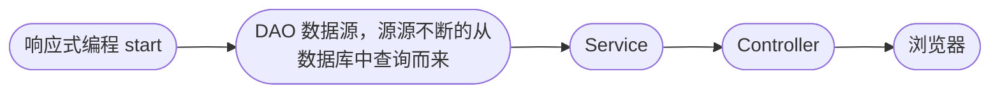

# 第五章: Spring WebFlux

[[toc]]

> 说在前面的话，本文为个人学习[SpringBoot3响应式编程精讲](https://www.bilibili.com/video/BV1gsYEeLEuM?spm_id_from=333.788.videopod.episodes&vd_source=65c7f6924d2d8ba5fa0d4c448818e08a)后进行总结的文章，本文主要用于<b>响应式编程</b>。

## 【1】本章学习图解


## 【2】响应式Web和阻塞式Web对比

> - `Spring webFlux`:  底层完全是基于 `netty` + `reactor` + `springweb`完成的1个全异步非阻塞**响应式Web架构**
> - **底层**: **异步 + 消息队列(内存级别) + 事件回调机制**  =  **整套系统**
> - **优点** :  可以使用少量资源就可以处理大量的请求


> **`Mon`** : **返回0|1数据流**
>
> **`Flux`** : **返回N数据流**

## 【3】Spring WebFlux 的引入和介绍

> 再次强调下,Spring WebFlux的底层容器不是`tomcat`,而是：
>
> - **Netty** 

### 3.1 新建项目


### 3.2 引入依赖

> 在项目的`pom.xml`中加入如下依赖：

```xml
    <dependencyManagement>
        <dependencies>
            <dependency>
                <groupId>org.springframework.boot</groupId>
                <artifactId>spring-boot-starter-parent</artifactId>
                <version>3.5.3</version>
            </dependency>
        </dependencies>
    </dependencyManagement>

 <dependencies>
        <dependency>
            <groupId>org.springframework.boot</groupId>
            <artifactId>spring-boot-starter-webflux</artifactId>
        </dependency>
</dependencies>
```

### 3.3 官网文档

> 所有的学习参考[这里](https://docs.spring.io/spring-framework/reference/6.2-SNAPSHOT/web/webflux.html)

### 3.4 编程方式改变





> 以前：浏览器--> `Controller`-->`Service`--->`Dao`--->数据库  ： 这是以往的**阻塞式编程流程** 
>
> 现在: DAO(查询得到数据源,是发布者) --> `Service` --> `Contorller` --> 浏览器(订阅者)  : 这是**响应式编程**
>
> 在这其中，`service`, `controller` 则是中间处理器的作用.
>
> `Context` 则是承担着上下文的数据传递的作用。

### 3.5 原生API搭建简单服务器

[参照](https://docs.spring.io/spring-framework/reference/6.2-SNAPSHOT/web/webflux/reactive-spring.html)


```java
// 函数式接口
package org.springframework.http.server.reactive;

import reactor.core.publisher.Mono;

public interface HttpHandler {
    Mono<Void> handle(ServerHttpRequest request, ServerHttpResponse response);
}
```

```java
package com.learn.spring.webflux.demo;


import org.springframework.core.io.buffer.DataBuffer;
import org.springframework.core.io.buffer.DataBufferFactory;
import org.springframework.http.server.reactive.HttpHandler;
import org.springframework.http.server.reactive.ReactorHttpHandlerAdapter;
import org.springframework.http.server.reactive.ServerHttpRequest;
import org.springframework.http.server.reactive.ServerHttpResponse;
import reactor.core.publisher.Mono;
import reactor.netty.DisposableServer;
import reactor.netty.http.server.HttpServer;

import java.io.IOException;
import java.nio.charset.StandardCharsets;

/**
 * @author qianpengzhan
 * @since 2025/7/10 9:58
 */
public class SpringWebFluxDemoApplication {
    public static void main(String[] args) throws IOException {
        // 快速编写一个可以处理http请求的服务器

        // 1.创建一个可以处理http请求的处理器
        HttpHandler httpHandler = (ServerHttpRequest request,
                                   ServerHttpResponse response) -> {
            // Mono<Void> handle(ServerHttpRequest request, ServerHttpResponse response);
            System.out.println("请求进来了...." + request.getURI());
            // 这里我们在编写一段内容给浏览器响应
            String respContent = request.getURI().toString() + ", Hello!";
            DataBufferFactory dataBufferFactory = response.bufferFactory();
            DataBuffer dataBuffer = dataBufferFactory.wrap(respContent.getBytes(StandardCharsets.UTF_8));
            // 处理业务逻辑
            return response.writeWith(Mono.just(dataBuffer));
//            return response.setComplete();
        };

        // 2. 创建1个Reactor的Http请求的适配器
        ReactorHttpHandlerAdapter adapter = new ReactorHttpHandlerAdapter(httpHandler);

        // 3. 启动1个Netty服务器 监听8080端口 接收数据 拿到数据提交给 HttpHandler 进行业务处理
        /*
        HttpServer.create()
          .host("0.0.0.0")
          .handle((req, res) -> res.sendString(Flux.just("hello")))
          .bind()
          .block();
         */
        // reactor.netty.transport.ServerTransport$InetDisposableBind@1224144a
        DisposableServer server = HttpServer.create()
                .host("localhost")
                .port(8080)
                .handle(adapter)
                .bindNow();
        System.out.println("服务器启动完成,监听8080端口...");

        // 4. 阻塞住
        System.in.read();
        System.out.println("服务停止..");
    }
}
```

> 请求:
>
> 

## 【4】Spring WebFlux Controller

> `SpringMVC`: `DispathcerServlet`
>
> `SpringWebFlux`: `DispatherHandler`

> `SpringWebFlux` 写`Controller`和`SpringMVC`差不多的。就是返回参数改为`Flux<T>`. `Mono<T>`即可。

> `SpringMVC`写法如下:

```java
package com.learn.spring.webflux.demo.controller;

import org.springframework.web.bind.annotation.GetMapping;
import org.springframework.web.bind.annotation.RestController;

/**
 * @author qianpengzhan
 * @since 2025/7/10 14:39
 */
@RestController
public class MvcDemoController {


    @GetMapping("/hello-world")
    public String HelloWorld() {
        return "Hello World";
    }
}

```

> `SpringWebFlux`的写法如下:

```java
package com.learn.spring.webflux.demo.controller;

import org.springframework.web.bind.annotation.GetMapping;
import org.springframework.web.bind.annotation.RestController;
import reactor.core.publisher.Mono;

/**
 * @author qianpengzhan
 * @since 2025/7/10 14:39
 */
@RestController
public class WebFluxDemoController {


    @GetMapping("/webflux/hello-world")
    public Mono<String> helloWorld() {
        return Mono.just("Hello World");
    }
}
```

> 服务启动：


>  访问如下:


> 故而: 以前`SpringMVC`怎么写`Controller`,`SpringWebFlux`可以无缝衔接的。但是底层需要自行改造为响应式编程。

## 【5】Server Send Event (SSE) 服务端事件推送

### 5.1 简单的例子

> 简单的例子：

```java
package com.learn.spring.webflux.demo.controller;

import org.springframework.web.bind.annotation.GetMapping;
import org.springframework.web.bind.annotation.RestController;
import reactor.core.publisher.Flux;

import java.time.Duration;

/**
 * @author qianpengzhan
 * @since 2025/7/10 15:13
 */
@RestController
public class SseController {


    // 告诉前端数据类型是 事件流  text/event-stream
    @GetMapping(value = "/sse", produces = MediaType.TEXT_EVENT_STREAM_VALUE)
    public Flux<String> sse() {
        return Flux.range(1, 100)
                .map(i -> "Hello-" + i)
                // 每隔500毫秒发送浏览器1个字符串 直到结束
                .delayElements(Duration.ofMillis(500));
    }
}

```

> 启动服务后，访问会出现如下动图的展示：


### 5.2 带有界面的例子

[参照Axios的中文文档，它是专门可以处理SSE的数据接收](http://www.axios-js.com/zh-cn/docs/)

- 在`resource`下创建`static`文件夹并且创建`index.html`文件

  ```html
  <!DOCTYPE html>
  <html lang="en">
  <head>
      <meta charset="UTF-8">
      <title>Title</title>
  </head>
  <body>
  <h1>SSE数据展示</h1>
  </body>
  </html>
  ```

- 然后引入`axios`，编写`axios`的请求代码，最终代码如下

  ```html
  <!DOCTYPE html>
  <html lang="en">
  <head>
      <meta charset="UTF-8">
      <title>Title</title>
  </head>
  <body>
  <h1>SSE数据展示</h1>
  </body>
  
  <div id="sse" style="width: 800px;height: 500px; background-color: beige;">
  
  </div>
  
  
  <script src="https://unpkg.com/axios/dist/axios.min.js"></script>
  <script>
  
      const instance = axios.create({
          baseURL: 'http://localhost:8080',
          timeout: 10000000,
          // `responseType` 表示服务器响应的数据类型，可以是 'arraybuffer', 'blob', 'document', 'json', 'text', 'stream'
          responseType: 'stream', // default
          responseEncoding: 'utf8', // default
          // `onDownloadProgress` 允许为下载处理进度事件
          onDownloadProgress: function (progressEvent) {
              // 对原生进度事件的处理
              console.log("progressEvent=>", progressEvent.event.currentTarget.responseText)
              document.getElementById("sse").innerHTML = progressEvent.event.currentTarget.responseText.replaceAll("data:", "")
          },
      });
  
      // 为给定 ID 的 user 创建请求
      instance.get('/sse')
          .then(function (response) {
              console.log(response);
          })
          .catch(function (error) {
              console.log(error);
          });
  </script>
  </html>
  ```

  > 启动服务：
  >
  > 
  >
  > 结果如下:
  >
  > 
  
  ::: warning 注意事项
  
  > 为了和其他的服务进行区分，在`resources`下创建1个配置文件`application.yaml`,设置端口为9000
  >
  > ```yaml
  > server:
  >   port: 9000
  > ```
  >
  > 然后`index.html`中的前端访问端口地址改为 9000
  >
  > ```html
  > ...
  > const instance = axios.create({
  >         baseURL: 'http://localhost:9000',
  >         timeout: 10000000,
  >         // `responseType` 表示服务器响应的数据类型，可以是 'arraybuffer', 'blob', 'document', 'json', 'text', 'stream'
  >         responseType: 'stream', // default
  >         responseEncoding: 'utf8', // default
  >         // `onDownloadProgress` 允许为下载处理进度事件
  >         onDownloadProgress: function (progressEvent) {
  >             // 对原生进度事件的处理
  >             console.log("progressEvent=>", progressEvent.event.currentTarget.responseText)
  >             document.getElementById("sse").innerHTML = 			progressEvent.event.currentTarget.responseText.replaceAll("data:", "")
  >         },
  >     });
  > ...
  > ```
  >
  > 
  
  :::

### 5.3 SSE的完整API写法

> `ServerSentEvent<String>`的源码如下:

```java
public final class ServerSentEvent<T> {

	@Nullable
	private final String id;

	@Nullable
	private final String event;

	@Nullable
	private final Duration retry;

	@Nullable
	private final String comment;

	@Nullable
	private final T data;
}
```

> 完整代码如下:

```java
    /**
     * sse的完整写法是返回1个{@link Flux<ServerSentEvent<String>>}
     *
     * @return {@link Flux<ServerSentEvent<String>>}
     */
    @GetMapping(value = "/sse2", produces = MediaType.TEXT_EVENT_STREAM_VALUE)
    public Flux<ServerSentEvent<String>> sse2() {
        return Flux.range(1, 100)
                .map(i -> {
                    return ServerSentEvent.<String>builder()
                            .id(i + "")
                            .data("hello-" + i)
                            .comment("comment-" + i)
                            .event("event-" + i)
                            .retry(Duration.ofMillis(200))
                            .build();
                })
                // 每隔500毫秒发送浏览器1个字符串 直到结束
                .delayElements(Duration.ofMillis(500));
    }
```

> 然后 `index.html`改一下如下:

```html
<script>

    const instance = axios.create({
        baseURL: 'http://localhost:9000',
        timeout: 10000000,
        // `responseType` 表示服务器响应的数据类型，可以是 'arraybuffer', 'blob', 'document', 'json', 'text', 'stream'
        responseType: 'stream', // default
        responseEncoding: 'utf8', // default
        // `onDownloadProgress` 允许为下载处理进度事件
        onDownloadProgress: function (progressEvent) {
            // 对原生进度事件的处理
            console.log("progressEvent=>", progressEvent.event.currentTarget.responseText)
            document.getElementById("sse").innerHTML = progressEvent.event.currentTarget.responseText
        },
    });

    // 为给定 ID 的 user 创建请求
    instance.get('/sse2')
        .then(function (response) {
            console.log(response);
        })
        .catch(function (error) {
            console.log(error);
        });
</script>
```

> 启动服务器:


> 进入界面如下:


## 【6】Spring WebFlux 核心源码之 DispatcherHandler

> 这里我们对比进行学习，我们都知道如下：
>
> `SpringMVC`: `DispathcerServlet`
>
> `SpringWebFlux`: `DispatherHandler`

> 以往，`SpringMVC中`，`DispatcherServlet`有1个方法`doDispatch()`方法来处理所有的请求
>
> 对应的，`Spring WebFlux`中, `DispatcherHandler`中有1个方法`handle()`方法来处理所以的请求，我们看下其源码如下:

- 首先看组件源码

```java
	@Nullable
	private List<HandlerMapping> handlerMappings;

	@Nullable
	private List<HandlerAdapter> handlerAdapters;

	@Nullable
	private List<HandlerResultHandler> resultHandlers;
```

> 可以看到，这三个属性我们在`SpringMVC`中都是非常熟悉的,后续我们一个个的介绍. 再看下核心方法`handle()`

```java
	@Override
	public Mono<Void> handle(ServerWebExchange exchange) {
		if (this.handlerMappings == null) {
			return createNotFoundError();
		}
		if (CorsUtils.isPreFlightRequest(exchange.getRequest())) {
			return handlePreFlight(exchange);
		}
		return Flux.fromIterable(this.handlerMappings)
				.concatMap(mapping -> mapping.getHandler(exchange))
				.next()
				.switchIfEmpty(createNotFoundError())
				.onErrorResume(ex -> handleResultMono(exchange, Mono.error(ex)))
				.flatMap(handler -> handleRequestWith(exchange, handler));
	}
```

> 我们对这段代码加以分析后如下:
>
> 1. 请求和响应都封装在`ServerWebExchange`这个对象中，由`handle()`方法进行处理
>
> 2. 如果没有对应的请求映射器`handlerMappings` == null, 则直接返回404; 若存在映射 则继续
>
> 3. 进行跨域请求工具的检查，若发现存在跨域或者是预检的过滤等满足，则进行跨域请求的处理，不满足的返回403 未授权；不是跨域的则继续。
>
> 4. 进行`flux`的流式操作.迭代所有的`HandlerMappings`映射器列表,找到匹配的那个请求映射器，然后通过`concatMap`映射为`handlerAdapt`适配器，
>
>    没找到就返回404，找到就了就进行业务处理，业务处理由错误，通过`.onErrorResume(ex -> handleResultMono(exchange, Mono.error(ex)))`进行处理

```java
// 请求和响应都封装在`ServerWebExchange`这个对象中，由`handle()`方法进行处理	
@Override
public Mono<Void> handle(ServerWebExchange exchange) {
    // 如果没有对应的请求映射器`handlerMappings` == null, 则直接返回404; 若存在映射 则继续
    if (this.handlerMappings == null) {
        return createNotFoundError();
    }
    // 进行跨域请求工具的检查，若发现存在跨域或者是预检的过滤等满足，则进行跨域请求的处理，不满足的返回403 未授权；不是跨域的则继续。
    if (CorsUtils.isPreFlightRequest(exchange.getRequest())) {
        return handlePreFlight(exchange);
    }
    // 进行`flux`的流式操作.迭代所有的`HandlerMappings`映射器列表,找到匹配的那个请求映射器，然后通过`concatMap`映射为`handlerAdapt`适配器，
//没找到就返回404，找到就了就进行业务处理，业务处理由错误，通过`.onErrorResume(ex -> handleResultMono(exchange, Mono.error(ex)))`进行处理
    return Flux.fromIterable(this.handlerMappings) // 遍历所有的映射器列表
            .concatMap(mapping -> mapping.getHandler(exchange)) // 请求映射器转为适配器
            .next()
            .switchIfEmpty(createNotFoundError()) // 找不到映射器 适配器 则返回 404
            .onErrorResume(ex -> handleResultMono(exchange, Mono.error(ex)))   // 业务的报错处理
            .flatMap(handler -> handleRequestWith(exchange, handler));  // 业务处理
}

// 源码的核心之一
private Mono<Void> handleRequestWith(ServerWebExchange exchange, Object handler) {
    if (ObjectUtils.nullSafeEquals(exchange.getResponse().getStatusCode(), HttpStatus.FORBIDDEN)) {
        return Mono.empty();  // CORS rejection
    }
    if (this.handlerAdapters != null) {
        for (HandlerAdapter adapter : this.handlerAdapters) {
            if (adapter.supports(handler)) {
                Mono<HandlerResult> resultMono = adapter.handle(exchange, handler);
                return handleResultMono(exchange, resultMono);
            }
        }
    }
    return Mono.error(new IllegalStateException("No HandlerAdapter: " + handler));
}

// 源码的核心之一
private Mono<Void> handleResultMono(ServerWebExchange exchange, Mono<HandlerResult> resultMono) {
    if (this.handlerAdapters != null) {
        for (HandlerAdapter adapter : this.handlerAdapters) {
            if (adapter instanceof DispatchExceptionHandler exceptionHandler) {
                resultMono = resultMono.onErrorResume(ex2 -> exceptionHandler.handleError(exchange, ex2));
            }
        }
    }
    return resultMono.flatMap(result -> {
        Mono<Void> voidMono = handleResult(exchange, result, "Handler " + result.getHandler());
        if (result.getExceptionHandler() != null) {
            voidMono = voidMono.onErrorResume(ex ->
                    result.getExceptionHandler().handleError(exchange, ex).flatMap(result2 ->
                            handleResult(exchange, result2, "Exception handler " +
                                    result2.getHandler() + ", error=\"" + ex.getMessage() + "\"")));
        }
        return voidMono;
    });
}

// 处理跨域请求
// 返回 未授权  403
@Override
public Mono<Void> handlePreFlight(ServerWebExchange exchange) {
    return Flux.fromIterable(this.handlerMappings != null ? this.handlerMappings : Collections.emptyList())
            .concatMap(mapping -> mapping.getHandler(exchange))
            .switchIfEmpty(Mono.fromRunnable(() -> exchange.getResponse().setStatusCode(HttpStatus.FORBIDDEN)))
            .next()
            .then();
}

// 直接判断请求方法是否是Options 或者请求头中的  ORIGIN 等存在跨域的标签
public static boolean isPreFlightRequest(ServerHttpRequest request) {
    HttpHeaders headers = request.getHeaders();
    return (request.getMethod() == HttpMethod.OPTIONS
            && headers.containsKey(HttpHeaders.ORIGIN)
            && headers.containsKey(HttpHeaders.ACCESS_CONTROL_REQUEST_METHOD));
}

// 统一的返回404的代码
private <R> Mono<R> createNotFoundError() {
    // defer的作用是 做全异步 背压 等到流到这里的时候才进行业务处理 封装响应然后终结流
    return Mono.defer(() -> {
        Exception ex = new ResponseStatusException(HttpStatus.NOT_FOUND);
        return Mono.error(ex);
    });
}
```

## 【X】参考资料

- [SpringBoot3响应式编程精讲](https://www.bilibili.com/video/BV1gsYEeLEuM?spm_id_from=333.788.videopod.episodes&vd_source=65c7f6924d2d8ba5fa0d4c448818e08a)
- [官方SpringBoot3.5.3-SpringWebFlux指导](https://docs.spring.io/spring-boot/reference/web/reactive.html)