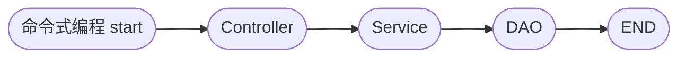
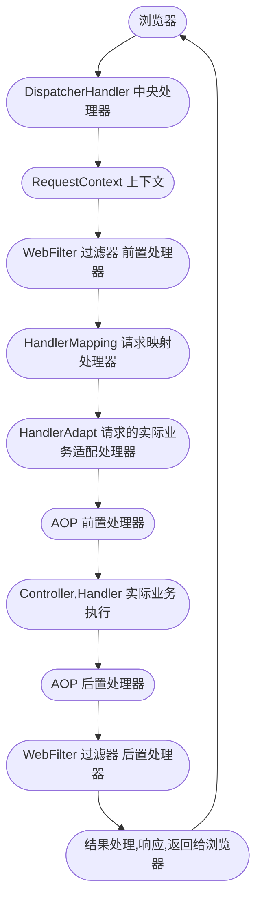

# 第五章: Spring WebFlux 框架

[[toc]]

> 说在前面的话，本文为个人学习[SpringBoot3响应式编程精讲](https://www.bilibili.com/video/BV1gsYEeLEuM?spm_id_from=333.788.videopod.episodes&vd_source=65c7f6924d2d8ba5fa0d4c448818e08a)后进行总结的文章，本文主要用于<b>响应式编程</b>。

## 【1】本章学习图解


## 【2】响应式Web和阻塞式Web对比

> - `Spring webFlux`:  底层完全是基于 `netty` + `reactor` + `springweb`完成的1个全异步非阻塞**响应式Web架构**
> - **底层**: **异步 + 消息队列(内存级别) + 事件回调机制**  =  **整套系统**
> - **优点** :  可以使用少量资源就可以处理大量的请求


> **`Mon`** : **返回0|1数据流**
>
> **`Flux`** : **返回N数据流**

## 【3】Spring WebFlux 的引入和介绍

> 再次强调下,Spring WebFlux的底层容器不是`tomcat`,而是：
>
> - **Netty** 

### 3.1 新建项目


### 3.2 引入依赖

> 在项目的`pom.xml`中加入如下依赖：

```xml
    <dependencyManagement>
        <dependencies>
            <dependency>
                <groupId>org.springframework.boot</groupId>
                <artifactId>spring-boot-starter-parent</artifactId>
                <version>3.5.3</version>
            </dependency>
        </dependencies>
    </dependencyManagement>

 <dependencies>
        <dependency>
            <groupId>org.springframework.boot</groupId>
            <artifactId>spring-boot-starter-webflux</artifactId>
        </dependency>
</dependencies>
```

### 3.3 官网文档

> 所有的学习参考[这里](https://docs.spring.io/spring-framework/reference/6.2-SNAPSHOT/web/webflux.html)

### 3.4 编程方式改变




> 以前：浏览器--> `Controller`-->`Service`--->`Dao`--->数据库  ： 这是以往的**阻塞式编程流程** 
>
> 现在: DAO(查询得到数据源,是发布者) --> `Service` --> `Contorller` --> 浏览器(订阅者)  : 这是**响应式编程**
>
> 在这其中，`service`, `controller` 则是中间处理器的作用.
>
> `Context` 则是承担着上下文的数据传递的作用。

### 3.5 原生API搭建简单服务器

[参照](https://docs.spring.io/spring-framework/reference/6.2-SNAPSHOT/web/webflux/reactive-spring.html)


```java
// 函数式接口
package org.springframework.http.server.reactive;

import reactor.core.publisher.Mono;

public interface HttpHandler {
    Mono<Void> handle(ServerHttpRequest request, ServerHttpResponse response);
}
```

```java
package com.learn.spring.webflux.demo;


import org.springframework.core.io.buffer.DataBuffer;
import org.springframework.core.io.buffer.DataBufferFactory;
import org.springframework.http.server.reactive.HttpHandler;
import org.springframework.http.server.reactive.ReactorHttpHandlerAdapter;
import org.springframework.http.server.reactive.ServerHttpRequest;
import org.springframework.http.server.reactive.ServerHttpResponse;
import reactor.core.publisher.Mono;
import reactor.netty.DisposableServer;
import reactor.netty.http.server.HttpServer;

import java.io.IOException;
import java.nio.charset.StandardCharsets;

/**
 * @author qianpengzhan
 * @since 2025/7/10 9:58
 */
public class SpringWebFluxDemoApplication {
    public static void main(String[] args) throws IOException {
        // 快速编写一个可以处理http请求的服务器

        // 1.创建一个可以处理http请求的处理器
        HttpHandler httpHandler = (ServerHttpRequest request,
                                   ServerHttpResponse response) -> {
            // Mono<Void> handle(ServerHttpRequest request, ServerHttpResponse response);
            System.out.println("请求进来了...." + request.getURI());
            // 这里我们在编写一段内容给浏览器响应
            String respContent = request.getURI().toString() + ", Hello!";
            DataBufferFactory dataBufferFactory = response.bufferFactory();
            DataBuffer dataBuffer = dataBufferFactory.wrap(respContent.getBytes(StandardCharsets.UTF_8));
            // 处理业务逻辑
            return response.writeWith(Mono.just(dataBuffer));
//            return response.setComplete();
        };

        // 2. 创建1个Reactor的Http请求的适配器
        ReactorHttpHandlerAdapter adapter = new ReactorHttpHandlerAdapter(httpHandler);

        // 3. 启动1个Netty服务器 监听8080端口 接收数据 拿到数据提交给 HttpHandler 进行业务处理
        /*
        HttpServer.create()
          .host("0.0.0.0")
          .handle((req, res) -> res.sendString(Flux.just("hello")))
          .bind()
          .block();
         */
        // reactor.netty.transport.ServerTransport$InetDisposableBind@1224144a
        DisposableServer server = HttpServer.create()
                .host("localhost")
                .port(8080)
                .handle(adapter)
                .bindNow();
        System.out.println("服务器启动完成,监听8080端口...");

        // 4. 阻塞住
        System.in.read();
        System.out.println("服务停止..");
    }
}
```

> 请求:
>
> 

## 【4】Spring WebFlux Controller

> `SpringMVC`: `DispathcerServlet`
>
> `SpringWebFlux`: `DispatherHandler`

> `SpringWebFlux` 写`Controller`和`SpringMVC`差不多的。就是返回参数改为`Flux<T>`. `Mono<T>`即可。

> `SpringMVC`写法如下:

```java
package com.learn.spring.webflux.demo.controller;

import org.springframework.web.bind.annotation.GetMapping;
import org.springframework.web.bind.annotation.RestController;

/**
 * @author qianpengzhan
 * @since 2025/7/10 14:39
 */
@RestController
public class MvcDemoController {


    @GetMapping("/hello-world")
    public String HelloWorld() {
        return "Hello World";
    }
}

```

> `SpringWebFlux`的写法如下:

```java
package com.learn.spring.webflux.demo.controller;

import org.springframework.web.bind.annotation.GetMapping;
import org.springframework.web.bind.annotation.RestController;
import reactor.core.publisher.Mono;

/**
 * @author qianpengzhan
 * @since 2025/7/10 14:39
 */
@RestController
public class WebFluxDemoController {


    @GetMapping("/webflux/hello-world")
    public Mono<String> helloWorld() {
        return Mono.just("Hello World");
    }
}
```

> 服务启动：


>  访问如下:


> 故而: 以前`SpringMVC`怎么写`Controller`,`SpringWebFlux`可以无缝衔接的。但是底层需要自行改造为响应式编程。

## 【5】Server Send Event (SSE) 服务端事件推送

### 5.1 简单的例子

> 简单的例子：

```java
package com.learn.spring.webflux.demo.controller;

import org.springframework.web.bind.annotation.GetMapping;
import org.springframework.web.bind.annotation.RestController;
import reactor.core.publisher.Flux;

import java.time.Duration;

/**
 * @author qianpengzhan
 * @since 2025/7/10 15:13
 */
@RestController
public class SseController {


    // 告诉前端数据类型是 事件流  text/event-stream
    @GetMapping(value = "/sse", produces = MediaType.TEXT_EVENT_STREAM_VALUE)
    public Flux<String> sse() {
        return Flux.range(1, 100)
                .map(i -> "Hello-" + i)
                // 每隔500毫秒发送浏览器1个字符串 直到结束
                .delayElements(Duration.ofMillis(500));
    }
}

```

> 启动服务后，访问会出现如下动图的展示：


### 5.2 带有界面的例子

[参照Axios的中文文档，它是专门可以处理SSE的数据接收](http://www.axios-js.com/zh-cn/docs/)

- 在`resource`下创建`static`文件夹并且创建`index.html`文件

  ```html
  <!DOCTYPE html>
  <html lang="en">
  <head>
      <meta charset="UTF-8">
      <title>Title</title>
  </head>
  <body>
  <h1>SSE数据展示</h1>
  </body>
  </html>
  ```

- 然后引入`axios`，编写`axios`的请求代码，最终代码如下

  ```html
  <!DOCTYPE html>
  <html lang="en">
  <head>
      <meta charset="UTF-8">
      <title>Title</title>
  </head>
  <body>
  <h1>SSE数据展示</h1>
  </body>
  
  <div id="sse" style="width: 800px;height: 500px; background-color: beige;">
  
  </div>
  
  
  <script src="https://unpkg.com/axios/dist/axios.min.js"></script>
  <script>
  
      const instance = axios.create({
          baseURL: 'http://localhost:8080',
          timeout: 10000000,
          // `responseType` 表示服务器响应的数据类型，可以是 'arraybuffer', 'blob', 'document', 'json', 'text', 'stream'
          responseType: 'stream', // default
          responseEncoding: 'utf8', // default
          // `onDownloadProgress` 允许为下载处理进度事件
          onDownloadProgress: function (progressEvent) {
              // 对原生进度事件的处理
              console.log("progressEvent=>", progressEvent.event.currentTarget.responseText)
              document.getElementById("sse").innerHTML = progressEvent.event.currentTarget.responseText.replaceAll("data:", "")
          },
      });
  
      // 为给定 ID 的 user 创建请求
      instance.get('/sse')
          .then(function (response) {
              console.log(response);
          })
          .catch(function (error) {
              console.log(error);
          });
  </script>
  </html>
  ```

  > 启动服务：
  >
  > 
  >
  > 结果如下:
  >
  > 
  
  ::: warning 注意事项
  
  > 为了和其他的服务进行区分，在`resources`下创建1个配置文件`application.yaml`,设置端口为9000
  >
  > ```yaml
  > server:
  >   port: 9000
  > ```
  >
  > 然后`index.html`中的前端访问端口地址改为 9000
  >
  > ```html
  > ...
  > const instance = axios.create({
  >         baseURL: 'http://localhost:9000',
  >         timeout: 10000000,
  >         // `responseType` 表示服务器响应的数据类型，可以是 'arraybuffer', 'blob', 'document', 'json', 'text', 'stream'
  >         responseType: 'stream', // default
  >         responseEncoding: 'utf8', // default
  >         // `onDownloadProgress` 允许为下载处理进度事件
  >         onDownloadProgress: function (progressEvent) {
  >             // 对原生进度事件的处理
  >             console.log("progressEvent=>", progressEvent.event.currentTarget.responseText)
  >             document.getElementById("sse").innerHTML = 			progressEvent.event.currentTarget.responseText.replaceAll("data:", "")
  >         },
  >     });
  > ...
  > ```
  >
  > 
  
  :::

### 5.3 SSE的完整API写法

> `ServerSentEvent<String>`的源码如下:

```java
public final class ServerSentEvent<T> {

	@Nullable
	private final String id;

	@Nullable
	private final String event;

	@Nullable
	private final Duration retry;

	@Nullable
	private final String comment;

	@Nullable
	private final T data;
}
```

> 完整代码如下:

```java
    /**
     * sse的完整写法是返回1个{@link Flux<ServerSentEvent<String>>}
     *
     * @return {@link Flux<ServerSentEvent<String>>}
     */
    @GetMapping(value = "/sse2", produces = MediaType.TEXT_EVENT_STREAM_VALUE)
    public Flux<ServerSentEvent<String>> sse2() {
        return Flux.range(1, 100)
                .map(i -> {
                    return ServerSentEvent.<String>builder()
                            .id(i + "")
                            .data("hello-" + i)
                            .comment("comment-" + i)
                            .event("event-" + i)
                            .retry(Duration.ofMillis(200))
                            .build();
                })
                // 每隔500毫秒发送浏览器1个字符串 直到结束
                .delayElements(Duration.ofMillis(500));
    }
```

> 然后 `index.html`改一下如下:

```html
<script>

    const instance = axios.create({
        baseURL: 'http://localhost:9000',
        timeout: 10000000,
        // `responseType` 表示服务器响应的数据类型，可以是 'arraybuffer', 'blob', 'document', 'json', 'text', 'stream'
        responseType: 'stream', // default
        responseEncoding: 'utf8', // default
        // `onDownloadProgress` 允许为下载处理进度事件
        onDownloadProgress: function (progressEvent) {
            // 对原生进度事件的处理
            console.log("progressEvent=>", progressEvent.event.currentTarget.responseText)
            document.getElementById("sse").innerHTML = progressEvent.event.currentTarget.responseText
        },
    });

    // 为给定 ID 的 user 创建请求
    instance.get('/sse2')
        .then(function (response) {
            console.log(response);
        })
        .catch(function (error) {
            console.log(error);
        });
</script>
```

> 启动服务器:


> 进入界面如下:


## 【6】Spring WebFlux 核心源码之 DispatcherHandler

> 这里我们对比进行学习，我们都知道如下：
>
> `SpringMVC`: `DispathcerServlet`
>
> `SpringWebFlux`: `DispatherHandler`

> 以往，`SpringMVC中`，`DispatcherServlet`有1个方法`doDispatch()`方法来处理所有的请求
>
> 对应的，`Spring WebFlux`中, `DispatcherHandler`中有1个方法`handle()`方法来处理所以的请求，我们看下其源码如下:

- 首先看组件源码

```java
	@Nullable
	private List<HandlerMapping> handlerMappings;

	@Nullable
	private List<HandlerAdapter> handlerAdapters;

	@Nullable
	private List<HandlerResultHandler> resultHandlers;
```

> 可以看到，这三个属性我们在`SpringMVC`中都是非常熟悉的,后续我们一个个的介绍. 再看下核心方法`handle()`

```java
	@Override
	public Mono<Void> handle(ServerWebExchange exchange) {
		if (this.handlerMappings == null) {
			return createNotFoundError();
		}
		if (CorsUtils.isPreFlightRequest(exchange.getRequest())) {
			return handlePreFlight(exchange);
		}
		return Flux.fromIterable(this.handlerMappings)
				.concatMap(mapping -> mapping.getHandler(exchange))
				.next()
				.switchIfEmpty(createNotFoundError())
				.onErrorResume(ex -> handleResultMono(exchange, Mono.error(ex)))
				.flatMap(handler -> handleRequestWith(exchange, handler));
	}
```

> 我们对这段代码加以分析后如下:
>
> 1. 请求和响应都封装在`ServerWebExchange`这个对象中，由`handle()`方法进行处理
>
> 2. 如果没有对应的请求映射器`handlerMappings` == null, 则直接返回404; 若存在映射 则继续
>
> 3. 进行跨域请求工具的检查，若发现存在跨域或者是预检的过滤等满足，则进行跨域请求的处理，不满足的返回403 未授权；不是跨域的则继续。
>
> 4. 进行`flux`的流式操作.迭代所有的`HandlerMappings`映射器列表,找到匹配的那个请求映射器，然后通过`concatMap`映射为`handlerAdapt`适配器，
>
>    没找到就返回404，找到就了就进行业务处理，业务处理由错误，通过`.onErrorResume(ex -> handleResultMono(exchange, Mono.error(ex)))`进行处理

```java
// 请求和响应都封装在`ServerWebExchange`这个对象中，由`handle()`方法进行处理	
@Override
public Mono<Void> handle(ServerWebExchange exchange) {
    // 如果没有对应的请求映射器`handlerMappings` == null, 则直接返回404; 若存在映射 则继续
    if (this.handlerMappings == null) {
        return createNotFoundError();
    }
    // 进行跨域请求工具的检查，若发现存在跨域或者是预检的过滤等满足，则进行跨域请求的处理，不满足的返回403 未授权；不是跨域的则继续。
    if (CorsUtils.isPreFlightRequest(exchange.getRequest())) {
        return handlePreFlight(exchange);
    }
    // 进行`flux`的流式操作.迭代所有的`HandlerMappings`映射器列表,找到匹配的那个请求映射器，然后通过`concatMap`映射为`handlerAdapt`适配器，
//没找到就返回404，找到就了就进行业务处理，业务处理由错误，通过`.onErrorResume(ex -> handleResultMono(exchange, Mono.error(ex)))`进行处理
    return Flux.fromIterable(this.handlerMappings) // 遍历所有的映射器列表
            .concatMap(mapping -> mapping.getHandler(exchange)) // 请求映射器转为适配器
            .next()
            .switchIfEmpty(createNotFoundError()) // 找不到映射器 适配器 则返回 404
            .onErrorResume(ex -> handleResultMono(exchange, Mono.error(ex)))   // 业务的报错处理
            .flatMap(handler -> handleRequestWith(exchange, handler));  // 业务处理
}

// 源码的核心之一
private Mono<Void> handleRequestWith(ServerWebExchange exchange, Object handler) {
    if (ObjectUtils.nullSafeEquals(exchange.getResponse().getStatusCode(), HttpStatus.FORBIDDEN)) {
        return Mono.empty();  // CORS rejection
    }
    if (this.handlerAdapters != null) {
        for (HandlerAdapter adapter : this.handlerAdapters) {
            if (adapter.supports(handler)) {
                Mono<HandlerResult> resultMono = adapter.handle(exchange, handler);
                return handleResultMono(exchange, resultMono);
            }
        }
    }
    return Mono.error(new IllegalStateException("No HandlerAdapter: " + handler));
}

// 源码的核心之一
private Mono<Void> handleResultMono(ServerWebExchange exchange, Mono<HandlerResult> resultMono) {
    if (this.handlerAdapters != null) {
        for (HandlerAdapter adapter : this.handlerAdapters) {
            if (adapter instanceof DispatchExceptionHandler exceptionHandler) {
                resultMono = resultMono.onErrorResume(ex2 -> exceptionHandler.handleError(exchange, ex2));
            }
        }
    }
    return resultMono.flatMap(result -> {
        Mono<Void> voidMono = handleResult(exchange, result, "Handler " + result.getHandler());
        if (result.getExceptionHandler() != null) {
            voidMono = voidMono.onErrorResume(ex ->
                    result.getExceptionHandler().handleError(exchange, ex).flatMap(result2 ->
                            handleResult(exchange, result2, "Exception handler " +
                                    result2.getHandler() + ", error=\"" + ex.getMessage() + "\"")));
        }
        return voidMono;
    });
}

// 处理跨域请求
// 返回 未授权  403
@Override
public Mono<Void> handlePreFlight(ServerWebExchange exchange) {
    return Flux.fromIterable(this.handlerMappings != null ? this.handlerMappings : Collections.emptyList())
            .concatMap(mapping -> mapping.getHandler(exchange))
            .switchIfEmpty(Mono.fromRunnable(() -> exchange.getResponse().setStatusCode(HttpStatus.FORBIDDEN)))
            .next()
            .then();
}

// 直接判断请求方法是否是Options 或者请求头中的  ORIGIN 等存在跨域的标签
public static boolean isPreFlightRequest(ServerHttpRequest request) {
    HttpHeaders headers = request.getHeaders();
    return (request.getMethod() == HttpMethod.OPTIONS
            && headers.containsKey(HttpHeaders.ORIGIN)
            && headers.containsKey(HttpHeaders.ACCESS_CONTROL_REQUEST_METHOD));
}

// 统一的返回404的代码
private <R> Mono<R> createNotFoundError() {
    // defer的作用是 做全异步 背压 等到流到这里的时候才进行业务处理 封装响应然后终结流
    return Mono.defer(() -> {
        Exception ex = new ResponseStatusException(HttpStatus.NOT_FOUND);
        return Mono.error(ex);
    });
}
```

## 【7】Spring WebFlux 核心之 全局异常处理

> 以前，我们`SpringMVC`的全局异常处理如下: 我们会使用`@ResponseBoy` `@ControllerAdvice` 2个注解， 合起来就是1个注解`@RestControllerAdvice`,
>
> 那么，`SpringWebFlux`则使用同样的注解即可，然后和以前一样，拦截具体的错误注解，进行返回`Mono` 或者 `Flux`即可。代码如下：

> 项目中创建1个包`com.xxx.xxx.exception`, 然后在这个包下创建1个类`GlobalExceptionHandler`

```java
package com.learn.spring.webflux.demo.exception;

import lombok.extern.slf4j.Slf4j;
import org.springframework.web.bind.annotation.ExceptionHandler;
import org.springframework.web.bind.annotation.RestControllerAdvice;
import org.springframework.web.server.ServerWebExchange;
import reactor.core.publisher.Mono;

import java.net.URI;

/**
 * // 全局异常处理器
 *
 * @author qianpengzhan
 * @since 2025/7/14 9:37
 */
@Slf4j
@RestControllerAdvice
public class GlobalExceptionHandler {


    /**
     * 计算异常处理器
     */
    @ExceptionHandler(ArithmeticException.class)
    public Mono<String> arithmeticException(ArithmeticException e, ServerWebExchange exchange) {
        return Mono.defer(() -> {
            URI uri = exchange.getRequest().getURI();
            log.error("uri: {}, ArithmeticException:{}", uri, e.getMessage());
            return Mono.just("计算异常: " + e.getMessage());
        });
    }
}
```

> 然后在`controller`包下创建1个测试类`ExceptionTestController`,如下:

```java
package com.learn.spring.webflux.demo.controller;

import org.springframework.web.bind.annotation.GetMapping;
import org.springframework.web.bind.annotation.RestController;
import reactor.core.publisher.Mono;

/**
 * @author qianpengzhan
 * @since 2025/7/14 10:18
 */
@RestController
public class ExceptionTestController {


    @GetMapping(value = "/test-arithmetic-exception")
    public Mono<String> testArithmeticException() {
        return Mono.just(0)
                .map(i -> 10 / i)
                .map(String::valueOf);
    }
}
```

>  启动服务：
>
> 
>
> 访问请求地址:
>
> 
>
> 查看日志：
>
> 2025-07-14T10:34:43.595+08:00 ERROR 15336 --- [ctor-http-nio-2] c.l.s.w.d.e.GlobalExceptionHandler       : uri: http://localhost:9000/test-arithmetic-exception, ArithmeticException:/ by zero

> 至此，我们一个简单的全局异常就OK，那么剩下的我们常用的异常按照这个格式，仿照写出来即可。

## 【8】Spring WebFlux 核心之 方法传参

[这里可以参照官网](https://docs.spring.io/spring-framework/reference/web/webflux/controller/ann-methods/arguments.html)

> 以前`SpringMVC`的时候`Controller`的方法中的可以使用的很多参数我们`SrpingWebFlux`可以继续沿用，但是也有很多无法使用了，具体参考如下官网表格。

| Controller method argument                         | Description                                                  |
| -------------------------------------------------- | ------------------------------------------------------------ |
| `ServerWebExchange`                                | 访问完整的ServerWebExchange-HTTP请求和响应、请求和会话属性、checkNotModified方法等的容器。 |
| `ServerHttpRequest`, `ServerHttpResponse`          | 访问HTTP请求或响应。                                         |
| `WebSession`                                       | 访问会话。除非添加属性，否则这不会强制开始新会话。支持反应式类型。 |
| `java.security.Principal`                          | 当前经过身份验证的用户-如果已知，可能是特定的主体实现类。支持反应式类型。 |
| `org.springframework.http.HttpMethod`              | 请求的HTTP方法。                                             |
| `java.util.Locale`                                 | 国际化。<br />当前请求区域设置，由可用的最具体的LocaleResolver确定-实际上，配置的LocaleResolver/LocaleContextResolver。 |
| `java.util.TimeZone` + `java.time.ZoneId`          | 时区<br />与当前请求相关联的时区，由LocaleContextResolver确定。 |
| `@PathVariable`                                    | 路径变量                                                     |
| `@MatrixVariable`                                  | 矩阵变量                                                     |
| `@RequestParam`                                    | 请求参数                                                     |
| `@RequestHeader`                                   | 请求头参数                                                   |
| `@CookieValue`                                     | 获取Cookie参数                                               |
| `@RequestBody`                                     | 获取请求体参数 Body内容 Post 文件上传                        |
| `HttpEntity<B>`                                    | 封装后的请求体对象                                           |
| `@RequestPart`                                     | 文件上传使用的数据`multipart/form-data`                      |
| `java.util.Map` or `org.springframework.ui.Model`  | `Map`, `ModelMap`                                            |
| `@ModelAttribute`                                  | 对象属性                                                     |
| `Errors` or `BindingResult`                        | 数据校验 错误封装                                            |
| `SessionStatus` + class-level `@SessionAttributes` | 用于标记表单处理完成，这会触发清理通过类级`@SessionAttributes`注释声明的会话属性。有关更多详细信息，请参阅`@SessionAttributes`。 |
| `UriComponentsBuilder`                             | 用于准备相对于当前请求的主机、端口、方案和上下文路径的URL。请参阅URI链接。 |
| `@SessionAttribute`                                | 用于访问任何会话属性-与作为类级`@SessionAttribute`声明的结果存储在会话中的模型属性相反。有关更多详细信息，请参阅`@SessionAttribute`。 |
| `@RequestAttribute`                                | 转发请求的请求域数据<br />用于访问请求属性。有关更多详细信息，请参阅`@RequestAttribute`。 |
| Any other argument                                 | 如果方法参数参数与上述任何参数都不匹配，则默认将其解析为@RequestParam（如果它是简单类型，由BeanUtils#isSimpleProperty确定），否则解析为`@ModelAttribute`<br />所有得参数都可以作为参数:<br />1. 基本类型，等于标注`@RequesParam`<br />2.对象类型，等于标注`@ModelAttribute` |

## 【9】Spring WebFlux 核心之 返回值

> 这里的`SSE`和`websocket`的区别
>
> - `SSE`: 属于**单工** , 请求过去后，等待服务端源源不断的数据
> - `Websocket`: 属于**双工** ，双方建立连接，可以任意交互。

[这里可以参照官网](https://docs.spring.io/spring-framework/reference/web/webflux/controller/ann-methods/return-types.html)

| Controller method return value                               | Description                                                  |
| ------------------------------------------------------------ | ------------------------------------------------------------ |
| `@ResponseBody`                                              | 返回值通过`HttpMessageWriter`实例编码并写入响应。请参阅`@ResponseseBody`。<br />其实就是把响应数据写出去，如果是对象，可以自动转为`Json` |
| `HttpEntity<B>`, `ResponseEntity<B>`                         | 返回值指定完整的响应，包括HTTP标头，正文通过`HttpMessageWriter`实例编码并写入响应。请参阅响应实体。 |
| `HttpHeaders`                                                | 用于返回带有标头但没有正文的响应。                           |
| `ErrorResponse`, `ProblemDetail`                             | 快速错误响应                                                 |
| `String`                                                     | 要通过`ViewResolver`实例解析并与隐式模型一起使用的视图名称——通过命令对象和`@ModelAtual`方法确定。处理程序方法还可以通过声明模型参数（如前所述）以编程方式丰富模型。 |
| `View`                                                       | 用于与隐式模型一起呈现的视图实例——通过命令对象和`@Model`属性方法确定。处理程序方法还可以通过声明模型参数（如前所述）以编程方式丰富模型。<br />直接返回视图 |
| `java.util.Map`, `org.springframework.ui.Model`              | 要添加到隐式模型的属性，视图名称根据请求路径隐式确定。       |
| `@ModelAttribute`                                            | 要添加到模型的属性，视图名称根据请求路径隐式确定。           |
| `Rendering`                                                  | 用于模型和视图渲染场景的API。                                |
| `FragmentsRendering`, `Flux<Fragment>`, `Collection<Fragment>` | 用于渲染一个或多个片段，每个片段都有自己的视图和模型。有关详细信息，请参阅超文本标记语言片段。 |
| `void`                                                       | 无返回值                                                     |
| `Flux<ServerSentEvent>`, `Observable<ServerSentEvent>`, or other reactive type | 发送服务器发送的事件。当只需要写入数据时，可以省略ServerSentEvent包装器（但是，必须通过生成属性在映射中请求或声明text/event-stream）。 |
| Other return values                                          | 如果返回值以任何其他方式仍未解析，则将其视为模型属性，除非它是由BeanUtils#isSimpleProperty确定的简单类型，在这种情况下它仍未解析。 |

## 【10】Spring WebFlux 核心之 文件上传

> `Spring WebFlux` 多了数据流文件上传的新写法，同时兼容`SpringMVC`的旧写法

>  旧写法:

```java
class MyForm {

	private String name;

	private FilePart file;

	// ...

}

@Controller
public class FileUploadController {

	@PostMapping("/form")
	public String handleFormUpload(MyForm form, BindingResult errors) {
		// ...
	}

}
```

> 增加的新写法:

```java
@PostMapping("/")
public String handle(@RequestPart("meta-data") Part metadata, 
		@RequestPart("file-data") FilePart file) { 
	// ...
    // 这里的filePart 是异步非阻塞的 并且底层使用了零拷贝技术 性能高
}
```

## 【11】Spring WebFlux 核心之 Flux自定义配置

> 容器中注入`WevFluxConfigurer`这个类型的组件即可，然后重新底层的逻辑。


```java
package com.learn.spring.webflux.demo.config;

import org.springframework.context.annotation.Configuration;
import org.springframework.format.FormatterRegistry;
import org.springframework.http.codec.ServerCodecConfigurer;
import org.springframework.validation.MessageCodesResolver;
import org.springframework.validation.Validator;
import org.springframework.web.reactive.accept.RequestedContentTypeResolverBuilder;
import org.springframework.web.reactive.config.*;
import org.springframework.web.reactive.result.method.annotation.ArgumentResolverConfigurer;
import org.springframework.web.reactive.socket.server.WebSocketService;

/**
 * @author qianpengzhan
 * @since 2025/7/14 16:31
 */
@Configuration
public class MyWebFluxConfig implements WebFluxConfigurer {

    //想要修改哪个就改为自定义的逻辑即可。
    //同时我们这里可以增加自定义的Filter

    @Override
    public void configureHttpMessageCodecs(ServerCodecConfigurer configurer) {
        WebFluxConfigurer.super.configureHttpMessageCodecs(configurer);
    }

    @Override
    public void addFormatters(FormatterRegistry registry) {
        WebFluxConfigurer.super.addFormatters(registry);
    }

    @Override
    public Validator getValidator() {
        return WebFluxConfigurer.super.getValidator();
    }

    @Override
    public MessageCodesResolver getMessageCodesResolver() {
        return WebFluxConfigurer.super.getMessageCodesResolver();
    }

    @Override
    public void addCorsMappings(CorsRegistry registry) {
        WebFluxConfigurer.super.addCorsMappings(registry);
    }

    @Override
    public void configureBlockingExecution(BlockingExecutionConfigurer configurer) {
        WebFluxConfigurer.super.configureBlockingExecution(configurer);
    }

    @Override
    public void configureContentTypeResolver(RequestedContentTypeResolverBuilder builder) {
        WebFluxConfigurer.super.configureContentTypeResolver(builder);
    }

    @Override
    public void configurePathMatching(PathMatchConfigurer configurer) {
        WebFluxConfigurer.super.configurePathMatching(configurer);
    }

    @Override
    public void configureArgumentResolvers(ArgumentResolverConfigurer configurer) {
        WebFluxConfigurer.super.configureArgumentResolvers(configurer);
    }

    @Override
    public void configureViewResolvers(ViewResolverRegistry registry) {
        WebFluxConfigurer.super.configureViewResolvers(registry);
    }

    @Override
    public void addResourceHandlers(ResourceHandlerRegistry registry) {
        WebFluxConfigurer.super.addResourceHandlers(registry);
    }

    @Override
    public WebSocketService getWebSocketService() {
        return WebFluxConfigurer.super.getWebSocketService();
    }
}

```

## 【12】Spring WebFlux 核心之自定义Filter

> 很简单，自定义一个类实现`org.springframework.web.server.WebFilter`，然后编写好自己的过滤逻辑，加上注解`@Component`注册到容器中即可。

```java
package com.learn.spring.webflux.demo.filters;

import org.springframework.stereotype.Component;
import org.springframework.web.server.ServerWebExchange;
import org.springframework.web.server.WebFilter;
import org.springframework.web.server.WebFilterChain;
import reactor.core.publisher.Mono;

/**
 * @author qianpengzhan
 * @since 2025/7/14 16:37
 */
@Component
public class MyFilter implements WebFilter {
    @Override
    public Mono<Void> filter(ServerWebExchange exchange, WebFilterChain chain) {
        // 注意这里的操作都是异步非阻塞的，使用流的API才有效
        return chain.filter(exchange);
    }
}
```

## 【13】Spring WebFlux 单个请求的执行流程

> 根据Spring WebFlux的执行流程，确定流程图的主要节点，这些节点包括：
>
> - ‌**浏览器请求**‌：用户通过浏览器发起HTTP请求。
> - ‌**DispatcherHandler**‌：Spring WebFlux的核心组件，负责接收和分发请求。
> - ‌**上下文处理**‌：使用Reactive上下文传递数据。
> - ‌**过滤器处理**‌：WebFilter对请求和响应进行预处理和后处理。
> - ‌**HandlerMapping**‌：确定请求应该由哪个处理器处理。
> - ‌**HandlerAdapter**‌：调用处理器执行实际业务逻辑。
> - ‌**AOP处理**‌：在处理器执行前后进行切面处理。
> - ‌**处理器（Handler）执行**‌：执行实际的业务逻辑。
> - ‌**结果处理**‌：处理器返回结果，由HandlerResultHandler处理并生成最终响应。
> - ‌**响应返回给浏览器**‌：最终的响应通过HTTP协议返回给浏览器。



## 【14】Spring WebFlux 核心之 RouterFunction

> `Spring WebFlux`包含`WebFlux. fn`，这是一个轻量级泛函编程模型，其中函数用于路由和处理请求，合约旨在实现不变性。它是基于注释的编程模型的替代方案，但在其他方面运行在相同的`Reactive Core`基础上。

> `Spring WebFlux` 的 `RouterFunction` 是函数式编程模型的核心组件，用于定义请求路由规则并关联对应的处理器逻辑。以下是其核心机制与使用方法的系统解析：

### 14.1 核心接口和协作关系

> 在`Spring WebFlux` 的 `RouterFunction` 中，`HTTP`请求由`HandlerFunction`处理：该函数接受`ServerRequest`并返回延迟的`ServerResponse`（即`Mono<ServerResponse>`）。请求和响应对象都有不可变的契约，提供对`HTTP`请求和响应的`JDK 8`友好访问。`HandlerFunction`相当于基于注释的编程模型中的`@RequestMap`方法的主体。

> 传入的请求被路由到带有`RouterFunction`的处理函数：一个接受`ServerRequest`并返回延迟的`HandlerFunction`（即`Mono<HandlerFunction>`）的函数。当路由器函数匹配时，将返回一个处理函数；否则为空的Mono。`RouterFunction`等价于`@RequestMap`注释，但主要区别在于路由器函数不仅提供数据，还提供行为。

#### 14.1.1`RouterFunction`‌
>  通过 `RequestPredicate` 匹配请求路径、方法、头等条件，并返回关联的 `HandlerFunction`（匹配成功）或 `Optional.empty()`（匹配失败）。本质是函数式接口：`ServerRequest → Optional<HandlerFunction>`‌。

#### 14.1.2 `HandlerFunction`
> 处理业务逻辑，接收 `ServerRequest` 并返回 `ServerResponse`（封装为 `Mono<ServerResponse>` 或 `Flux<ServerResponse>`）‌

### 14.2 路由构建方式

#### 14.2.1 链式 API（推荐）
 支持模块化组合路由规则，嵌套路由（`nest()`）和条件组合：

```java
PersonRepository repository = ...
PersonHandler handler = new PersonHandler(repository);

RouterFunction<ServerResponse> route = route() 
	.GET("/person/{id}", accept(APPLICATION_JSON), handler::getPerson)
	.GET("/person", accept(APPLICATION_JSON), handler::listPeople)
	.POST("/person", handler::createPerson)
	.build();


public class PersonHandler {

	// ...

	public Mono<ServerResponse> listPeople(ServerRequest request) {
		// ...
	}

	public Mono<ServerResponse> createPerson(ServerRequest request) {
		// ...
	}

	public Mono<ServerResponse> getPerson(ServerRequest request) {
		// ...
	}
}
```

#### 14.2.2 静态方法

 直接通过 `RouterFunctions.route(RequestPredicate, HandlerFunction)` 创建简单路由‌。

### 14.3 请求谓词（RequestPredicate）

用于扩展路由匹配条件，支持路径、请求头、参数等验证‌26：

```java
RouterFunction<ServerResponse> route = RouterFunctions.route()
    .GET("/user/{id}", 
         RequestPredicates.queryParam("name", value -> true), // 必须包含name参数
         handler::getUserById)
    .build();
```

常用谓词包括：

- `RequestPredicates.path(String path)`：路径匹配
- `RequestPredicates.accept(MediaType)`：内容类型验证
- `RequestPredicates.and()`/`or()`：逻辑组合‌。

### 14.4 执行流程

1. **请求分发**‌
    `DispatcherHandler` 遍历所有 `RouterFunction`，调用其 `route()` 方法匹配请求‌
2. **处理器调用**‌
    匹配成功后，通过 `HandlerAdapter` 执行 `HandlerFunction` 并生成响应‌。
3. **响应式流水线**‌
    全程非阻塞，依赖 Reactor 的 `Mono`/`Flux` 实现背压管理‌。

### 14.5 优于@Controller进行处理

> 若存在`RouterFunction` 和 `@Controller` 的时候，`RouterFunction`的优先级更高。

### 14.6 注册

> 需要放入`WebFluxConfigurer`中进行注册到容器中才能生效。

```java
@Configuration
public class WebConfig implements WebFluxConfigurer {

	@Bean
	public RouterFunction<?> routerFunctionA() {
		// ...
	}

	@Bean
	public RouterFunction<?> routerFunctionB() {
		// ...
	}

	// ...

	@Override
	public void configureHttpMessageCodecs(ServerCodecConfigurer configurer) {
		// configure message conversion...
	}

	@Override
	public void addCorsMappings(CorsRegistry registry) {
		// configure CORS...
	}

	@Override
	public void configureViewResolvers(ViewResolverRegistry registry) {
		// configure view resolution for HTML rendering...
	}
}
```

### 14.7 错误处理

需通过 `WebFilter` 或 `HandlerFilterFunction` 捕获异常，无法直接使用 `@ControllerAdvice`‌69：

```java
@Bean
WebFilter globalExceptionFilter() {
    return (exchange, chain) -> chain.filter(exchange)
        .onErrorResume(MyException.class, e -> {
            exchange.getResponse().setStatusCode(HttpStatus.BAD_REQUEST);
            return exchange.getResponse().setComplete();
        });
}
```

------

通过以上机制，`RouterFunction` 实现了高效灵活的路由分发，是构建响应式 Web 应用的核心支柱之一‌。

## 【15】参考资料

- [SpringBoot3响应式编程精讲](https://www.bilibili.com/video/BV1gsYEeLEuM?spm_id_from=333.788.videopod.episodes&vd_source=65c7f6924d2d8ba5fa0d4c448818e08a)
- [官方SpringBoot3.5.3-SpringWebFlux指导](https://docs.spring.io/spring-boot/reference/web/reactive.html)