# 第六章: Spring Data R2DBC  异步查询数据库

[[toc]]

> 说在前面的话，本文为个人学习[SpringBoot3响应式编程精讲](https://www.bilibili.com/video/BV1gsYEeLEuM?spm_id_from=333.788.videopod.episodes&vd_source=65c7f6924d2d8ba5fa0d4c448818e08a)后进行总结的文章，本文主要用于<b>响应式编程</b>。

## 【1】本章学习图解

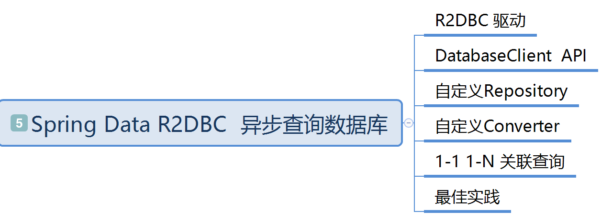

## 【2】体验R2DBC的简单查询

>  [R2DBC官网文档](https://r2dbc.io/)

### 2.1 引入Jar包

> 根据官网指导，我们需要引入连接池包和驱动包

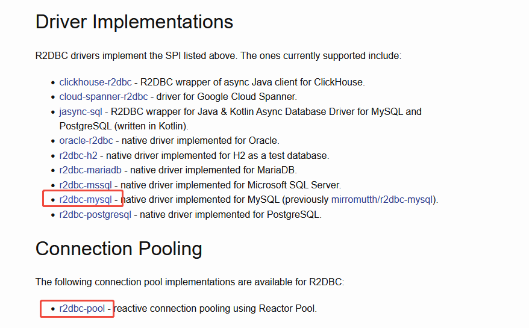

> 然后，我们根据`r2dbc`去 `maven`仓库搜坐标，将其引入到项目中，如下:

```xml
<!--  引入 r2dbc的连接池和驱动  版本跟随SpringBoot的Bom-->
<dependency>
    <groupId>io.asyncer</groupId>
    <artifactId>r2dbc-mysql</artifactId>
</dependency>
```

### 2.2 编写测试类

> 根据官网指导，我们先本地安装好`mysql`，按照你本人的情况新建数据库和表或者使用旧表，我这边有就旧表和数据，就直接使用了。

```sql
CREATE TABLE kaishun.`tb_menu` (
  `id` varchar(32) NOT NULL COMMENT '主键',
  `number` varchar(16) DEFAULT NULL COMMENT '编号',
  `parent_number` varchar(32) DEFAULT NULL COMMENT '上级编号',
  `name` varchar(100) DEFAULT NULL COMMENT '名称',
  `remake` varchar(100) DEFAULT NULL COMMENT '备注',
  `url` varchar(100) DEFAULT NULL COMMENT '路径',
  PRIMARY KEY (`id`)
) ENGINE=InnoDB;

INSERT INTO kaishun.tb_menu
(id, `number`, parent_number, name, remake, url, create_time, update_time, update_user)
VALUES('1', '00100', '0', '用户管理', '用户管理1', '', '2020-04-14 16:31:30', '2020-04-27 10:57:34', 'admin');
INSERT INTO kaishun.tb_menu
(id, `number`, parent_number, name, remake, url, create_time, update_time, update_user)
VALUES('120b0891320144a7a3d5f912b81a9e0d', '00400002', '00400', '菜单4-2', '菜单4-2', '/html/server', '2020-04-17 11:11:17', '2020-11-20 17:03:41', 'admin');
INSERT INTO kaishun.tb_menu
(id, `number`, parent_number, name, remake, url, create_time, update_time, update_user)
VALUES('2', '00100001', '00100', '用户信息', '用户信息', '/html/user', '2020-04-14 16:31:30', '2020-04-26 14:32:56', 'qwer');
INSERT INTO kaishun.tb_menu
(id, `number`, parent_number, name, remake, url, create_time, update_time, update_user)
VALUES('3', '00200', '0', '角色管理', NULL, NULL, '2020-04-14 16:31:30', '2020-04-14 16:31:30', 'admin');
INSERT INTO kaishun.tb_menu
(id, `number`, parent_number, name, remake, url, create_time, update_time, update_user)
VALUES('4', '00200001', '00200', '角色信息', NULL, '/html/role', '2020-04-14 16:31:30', '2020-04-14 16:31:30', 'admin');
INSERT INTO kaishun.tb_menu
(id, `number`, parent_number, name, remake, url, create_time, update_time, update_user)
VALUES('5', '00300', '0', '菜单管理', NULL, NULL, '2020-04-14 16:31:30', '2020-04-14 16:31:30', 'admin');
INSERT INTO kaishun.tb_menu
(id, `number`, parent_number, name, remake, url, create_time, update_time, update_user)
VALUES('6', '00300001', '00300', '菜单信息', NULL, '/html/menu', '2020-04-14 16:31:30', '2020-04-14 16:31:30', 'admin');
INSERT INTO kaishun.tb_menu
(id, `number`, parent_number, name, remake, url, create_time, update_time, update_user)
VALUES('7', '00400', '0', '菜单4', NULL, NULL, '2020-04-14 16:31:30', '2020-04-14 16:31:30', 'admin');
INSERT INTO kaishun.tb_menu
(id, `number`, parent_number, name, remake, url, create_time, update_time, update_user)
VALUES('8', '00400001', '00400', '菜单4-4', NULL, '/html/user', '2020-04-14 16:31:30', '2020-04-14 16:31:30', 'admin');
INSERT INTO kaishun.tb_menu
(id, `number`, parent_number, name, remake, url, create_time, update_time, update_user)
VALUES('9b2388c8455640f6b2046751b4977740', '00500001', '00500', '服务监控', '服务监控', '/html/server', '2020-11-20 15:17:42', '2020-11-20 15:17:42', 'admin');
INSERT INTO kaishun.tb_menu
(id, `number`, parent_number, name, remake, url, create_time, update_time, update_user)
VALUES('e6bfee06bf4b463081320f27af81eab5', '00500', '0', '系统管理', '系统管理', '', '2020-11-20 15:17:06', '2020-11-20 15:17:06', 'admin');
INSERT INTO kaishun.tb_menu
(id, `number`, parent_number, name, remake, url, create_time, update_time, update_user)
VALUES('e95d44eb7a1640e3a63366f7f9d0f554', '00010001', '9', '视频转码进度', '视频转码进度', '/html/transcode-progress', '2023-12-08 17:42:03', '2023-12-08 17:42:03', 'admin');
INSERT INTO kaishun.tb_menu
(id, `number`, parent_number, name, remake, url, create_time, update_time, update_user)
VALUES('fcc98c077d1c4000814b1cfb7767adc9', '00010', '0', '视频转码', '视频转码', '', '2023-12-08 17:41:20', '2023-12-08 17:41:20', 'admin');

```

```java
package com.learn.r2dbc.demo;

import io.asyncer.r2dbc.mysql.MySqlConnectionConfiguration;
import io.asyncer.r2dbc.mysql.MySqlConnectionFactory;
import io.asyncer.r2dbc.mysql.api.MySqlConnection;
import lombok.Data;
import org.junit.Test;
import reactor.core.publisher.Mono;

import java.io.IOException;
import java.io.Serial;
import java.io.Serializable;

/**
 * @author qianpengzhan
 * @since 2025/7/15 9:21
 */
public class R2dbcTest {

    // 1.有了r2dbc 我们的应用在数据库层面天然支持高并发 高吞吐量
    // 2. 并不能提高开发效率，可能还回归了原始的SQL编写和调用
    // 例子:

    /**
     * ConnectionFactory connectionFactory = ConnectionFactories
     * .get("r2dbc:h2:mem:///testdb");
     * <p>
     * Mono.from(connectionFactory.create())
     * .flatMapMany(connection -> connection
     * .createStatement("SELECT firstname FROM PERSON WHERE age > $1")
     * .bind("$1", 42)
     * .execute())
     * .flatMap(result -> result
     * .map((row, metadata) -> row.get("firstname", String.class)))
     * .doOnNext(System.out::println)
     * .subscribe();
     */

    // 参照 https://github.com/asyncer-io/r2dbc-mysql/wiki/getting-started  这个文档

    /**
     * CREATE TABLE `tb_menu` (
     * `id` varchar(32) NOT NULL COMMENT '主键',
     * `number` varchar(16) DEFAULT NULL COMMENT '编号',
     * `parent_number` varchar(32) DEFAULT NULL COMMENT '上级编号',
     * `name` varchar(100) DEFAULT NULL COMMENT '名称',
     * `remake` varchar(100) DEFAULT NULL COMMENT '备注',
     * `url` varchar(100) DEFAULT NULL COMMENT '路径',
     * `create_time` varchar(50) NOT NULL,
     * `update_time` varchar(50) NOT NULL,
     * `update_user` varchar(32) NOT NULL,
     * PRIMARY KEY (`id`)
     * ) ENGINE=InnoDB DEFAULT CHARSET=utf8;
     */
    @Test
    public void testR2dbc() throws IOException, InterruptedException {
        r2dbcSimpleTest();
    }

    private void r2dbcSimpleTest() throws InterruptedException {
        // 1.mysql 连接配置
        MySqlConnectionConfiguration configuration = MySqlConnectionConfiguration.builder()
                .host("127.0.0.1")
                .user("root")
                .port(3306)
                .password("123456")
                .database("kaishun") // TODO  这是我自己的老的库 你们替换成你们自己的
                .build();

        // 2.创建连接工厂
        MySqlConnectionFactory mySqlConnectionFactory = MySqlConnectionFactory.from(configuration);

        // 3.创建连接作为Mono数据流
        Mono<? extends MySqlConnection> connect = Mono.from(mySqlConnectionFactory.create());

        // 4.查询SQL并得出结果
        connect.flatMapMany(connection -> {
                    // 这里就是执行SQL语句
                    return connection.createStatement("select * from tb_menu ").execute();
                })
                .flatMap(result -> {
                    // 这里就是查询结果映射
                    return result.map((row, metadata) -> {
                        Menu menu = new Menu();
                        menu.setId(row.get("id", String.class));
                        menu.setNumber(row.get("number", String.class));
                        menu.setParentNumber(row.get("parent_number", String.class));
                        menu.setName(row.get("name", String.class));
                        menu.setRemake(row.get("remake", String.class));
                        menu.setUrl(row.get("url", String.class));
                        return menu;
                    });
                })
                .doOnNext(System.out::println)
                .subscribe();

        // 5. 阻塞住1秒
        Thread.sleep(1000);
    }

    @Data
    public static class Menu implements Serializable {

        @Serial
        private static final long serialVersionUID = 2508633024244000621L;

        private String id;
        private String number;
        private String parentNumber;
        private String name;
        private String remake;
        private String url;
    }
}
// 执行结果:
Connected to the target VM, address: '127.0.0.1:54560', transport: 'socket'
    
R2dbcTest.Menu(id=1, number=00100, parentNumber=0, name=用户管理, remake=用户管理1, url=)
R2dbcTest.Menu(id=120b0891320144a7a3d5f912b81a9e0d, number=00400002, parentNumber=00400, name=菜单4-2, remake=菜单4-2, url=/html/server)
R2dbcTest.Menu(id=2, number=00100001, parentNumber=00100, name=用户信息, remake=用户信息, url=/html/user)
R2dbcTest.Menu(id=3, number=00200, parentNumber=0, name=角色管理, remake=null, url=null)
R2dbcTest.Menu(id=4, number=00200001, parentNumber=00200, name=角色信息, remake=null, url=/html/role)
R2dbcTest.Menu(id=5, number=00300, parentNumber=0, name=菜单管理, remake=null, url=null)
R2dbcTest.Menu(id=6, number=00300001, parentNumber=00300, name=菜单信息, remake=null, url=/html/menu)
R2dbcTest.Menu(id=7, number=00400, parentNumber=0, name=菜单4, remake=null, url=null)
R2dbcTest.Menu(id=8, number=00400001, parentNumber=00400, name=菜单4-4, remake=null, url=/html/user)
R2dbcTest.Menu(id=9b2388c8455640f6b2046751b4977740, number=00500001, parentNumber=00500, name=服务监控, remake=服务监控, url=/html/server)
R2dbcTest.Menu(id=e6bfee06bf4b463081320f27af81eab5, number=00500, parentNumber=0, name=系统管理, remake=系统管理, url=)
R2dbcTest.Menu(id=e95d44eb7a1640e3a63366f7f9d0f554, number=00010001, parentNumber=9, name=视频转码进度, remake=视频转码进度, url=/html/transcode-progress)
R2dbcTest.Menu(id=fcc98c077d1c4000814b1cfb7767adc9, number=00010, parentNumber=0, name=视频转码, remake=视频转码, url=)
Disconnected from the target VM, address: '127.0.0.1:54560', transport: 'socket'

Process finished with exit code 0
```

## 【3】Spring Data 整合 R2DBC 

### 3.1 引入依赖

> 父`pom.xml` 如下:
>
> ```xml
> <?xml version="1.0" encoding="UTF-8"?>
> <project xmlns:xsi="http://www.w3.org/2001/XMLSchema-instance" xmlns="http://maven.apache.org/POM/4.0.0"
>          xsi:schemaLocation="http://maven.apache.org/POM/4.0.0 http://maven.apache.org/xsd/maven-4.0.0.xsd">
>     <modelVersion>4.0.0</modelVersion>
>     <groupId>com.learn</groupId>
>     <artifactId>reactive-programming</artifactId>
>     <version>1.0.0</version>
>     <packaging>pom</packaging>
>     <name>reactive-programming</name>
>     <modules>
>         <module>01-stream-api</module>
>         <module>02-reactive-stream</module>
>         <module>03-spring-webflux-demo</module>
>         <module>04-r2dbc-demo</module>
>     </modules>
> 
>     <properties>
>         <project.build.sourceEncoding>UTF-8</project.build.sourceEncoding>
>         <maven.compiler.release>17</maven.compiler.release>
>         <reactor-bom.version>2022.0.22</reactor-bom.version>
>         <reactive-streams.version>1.0.4</reactive-streams.version>
>         <reactor.version>3.5.20</reactor.version>
>         <spring-boot-starter.version>3.3.5</spring-boot-starter.version>
>         <junit.version>4.13.2</junit.version>
>         <lombok.version>1.18.38</lombok.version>
>         <springdoc-openapi-starter-webflux-ui.version>2.8.9</springdoc-openapi-starter-webflux-ui.version>
>         <knife4j-openapi3-ui.version>4.5.0</knife4j-openapi3-ui.version>
>     </properties>
> 
>     <dependencyManagement>
>         <dependencies>
>             <dependency>
>                 <groupId>junit</groupId>
>                 <artifactId>junit</artifactId>
>                 <version>${junit.version}</version>
>                 <scope>test</scope>
>             </dependency>
>             <dependency>
>                 <groupId>io.projectreactor</groupId>
>                 <artifactId>reactor-bom</artifactId>
>                 <version>${reactor-bom.version}</version>
>                 <scope>import</scope>
>                 <type>pom</type>
>             </dependency>
>             <dependency>
>                 <groupId>org.springframework.boot</groupId>
>                 <artifactId>spring-boot-starter-parent</artifactId>
>                 <version>${spring-boot-starter.version}</version>
>                 <scope>import</scope>
>                 <type>pom</type>
>             </dependency>
>             <dependency>
>                 <groupId>org.reactivestreams</groupId>
>                 <artifactId>reactive-streams</artifactId>
>                 <version>${reactive-streams.version}</version>
>             </dependency>
>             <dependency>
>                 <groupId>org.reactivestreams</groupId>
>                 <artifactId>reactive-streams-tck</artifactId>
>                 <version>${reactive-streams.version}</version>
>                 <scope>test</scope>
>             </dependency>
>             <dependency>
>                 <groupId>io.projectreactor</groupId>
>                 <artifactId>reactor-core</artifactId>
>                 <version>${reactor.version}</version>
>             </dependency>
>             <dependency>
>                 <groupId>io.projectreactor</groupId>
>                 <artifactId>reactor-test</artifactId>
>                 <version>${reactor.version}</version>
>             </dependency>
>             <dependency>
>                 <groupId>org.projectlombok</groupId>
>                 <artifactId>lombok</artifactId>
>                 <version>${lombok.version}</version>
>             </dependency>
>             <!-- 引入 接口文档API进行调试  -->
>             <dependency>
>                 <groupId>org.springdoc</groupId>
>                 <artifactId>springdoc-openapi-starter-webflux-ui</artifactId>
>                 <version>${springdoc-openapi-starter-webflux-ui.version}</version>
>             </dependency>
>             <dependency>
>                 <groupId>com.github.xiaoymin</groupId>
>                 <artifactId>knife4j-openapi3-ui</artifactId>
>                 <version>${knife4j-openapi3-ui.version}</version>
>             </dependency>
>         </dependencies>
>     </dependencyManagement>
> 
>     <distributionManagement>
>         <repository>
>             <id>central</id>
>             <name>Central Repository</name>
>             <url>https://maven.aliyun.com/repository/central</url>
>         </repository>
>         <snapshotRepository>
>             <id>central-snapshots</id>
>             <name>Central Snapshot Repository</name>
>             <url>https://maven.aliyun.com/repository/public</url>
>         </snapshotRepository>
>     </distributionManagement>
> 
> </project>
> 
> ```

>  当前项目的`pom.xml`如下:

>  ```xml
>  <?xml version="1.0" encoding="UTF-8"?>
>  <project xmlns:xsi="http://www.w3.org/2001/XMLSchema-instance" xmlns="http://maven.apache.org/POM/4.0.0"
>           xsi:schemaLocation="http://maven.apache.org/POM/4.0.0 https://maven.apache.org/xsd/maven-4.0.0.xsd">
>      <modelVersion>4.0.0</modelVersion>
>      <parent>
>          <groupId>com.learn</groupId>
>          <artifactId>reactive-programming</artifactId>
>          <version>1.0.0</version>
>      </parent>
>      <artifactId>04-r2dbc_demo</artifactId>
>  
>      <name>04-r2dbc-demo</name>
>  
>      <dependencies>
>          <!--  响应式web      -->
>          <dependency>
>              <groupId>org.springframework.boot</groupId>
>              <artifactId>spring-boot-starter-webflux</artifactId>
>          </dependency>
>          <!-- 响应式Spring Data r2dbc -->
>          <dependency>
>              <groupId>org.springframework.boot</groupId>
>              <artifactId>spring-boot-starter-data-r2dbc</artifactId>
>          </dependency>
>          <!--  引入 r2dbc-mysql驱动  -->
>          <dependency>
>              <groupId>io.asyncer</groupId>
>              <artifactId>r2dbc-mysql</artifactId>
>          </dependency>
>          <!-- lombok、单元测试的jar  start-->
>          <dependency>
>              <groupId>org.projectlombok</groupId>
>              <artifactId>lombok</artifactId>
>          </dependency>
>          <dependency>
>              <groupId>junit</groupId>
>              <artifactId>junit</artifactId>
>              <scope>test</scope>
>          </dependency>
>          <dependency>
>              <groupId>org.springframework.boot</groupId>
>              <artifactId>spring-boot-starter-test</artifactId>
>          </dependency>
>          <!-- lombok、单元测试的jar  end-->
>      </dependencies>
>  
>      <build>
>          <plugins>
>              <plugin>
>                  <groupId>org.apache.maven.plugins</groupId>
>                  <artifactId>maven-compiler-plugin</artifactId>
>                  <configuration>
>                      <compilerArgs>
>                          <!--在 Maven 或 Gradle 中配置 -parameters 编译选项，确保字节码保留参数名：-->
>                          <arg>-parameters</arg>
>                      </compilerArgs>
>                  </configuration>
>              </plugin>
>          </plugins>
>      </build>
>  
>  </project>
>  
>  ```

### 3.2 application.yaml 配置

```yaml
spring:
  r2dbc:
    username: root
    password: 123456
    url: r2dbc:mysql://127.0.0.1:3306/kaishun
```

### 3.3 SpringBoot对r2dbc的自动配置

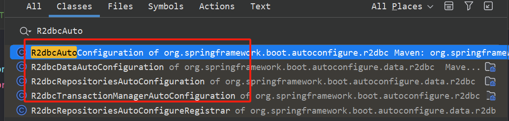

> ```java
> /**
>  * SpringBoot对r2dbc的自动配置
>  * 1. R2dbcAutoConfiguration: 主要配置连接工厂 连接池
>  * 2. R2dbcDataAutoConfiguration: 主要给用户提供了 R2dbcEntityTemplate 可以进行CRUD操作
>  * R2dbcEntityTemplate: 操作数据库的响应式客户端, 提供CRUD API, 类比 RedisTemplate
>  * 里面包含了数据类型映射关系,转换器,自定义R2dbcCustomConversions 转换器组件
>  * 数据类型转换: int Integer varchar String datetime Instant
>  * <p>
>  * 3. R2dbcRepositoriesAutoConfiguration: 开启Spring Data 声明式接口方式的CRUD
>  * mybatis-plus: 提供了baseMapper IService; 自带了CRUD;
>  * Spring Data: 提供了基础的CRUD接口， 不用写任何实现的情况下，可以直接具有CRUD功能
>  * <p>
>  * 4. R2dbcTransactionManagerAutoConfiguration: 事务
>  */
> ```

### 3.4 使用`R2dbcEntityTemplate`编写`CRUD`代码

- Application

  ```java
  package com.learn.r2dbc.demo;
  
  import org.springframework.boot.SpringApplication;
  import org.springframework.boot.autoconfigure.SpringBootApplication;
  
  /**
   * SpringBoot对r2dbc的自动配置
   * 1. R2dbcAutoConfiguration: 主要配置连接工厂 连接池
   * 2. R2dbcDataAutoConfiguration: 主要给用户提供了 R2dbcEntityTemplate 可以进行CRUD操作
   * R2dbcEntityTemplate: 操作数据库的响应式客户端, 提供CRUD API, 类比 RedisTemplate
   * 里面包含了数据类型映射关系,转换器,自定义R2dbcCustomConversions 转换器组件
   * 数据类型转换: int Integer varchar String datetime Instant
   * <p>
   * 3. R2dbcRepositoriesAutoConfiguration: 开启Spring Data 声明式接口方式的CRUD
   * mybatis-plus: 提供了baseMapper IService; 自带了CRUD;
   * Spring Data: 提供了基础的CRUD接口， 不用写任何实现的情况下，可以直接具有CRUD功能
   * <p>
   * 4. R2dbcTransactionManagerAutoConfiguration: 事务
   */
  @SpringBootApplication
  public class R2dbcDemoApplication {
  
      public static void main(String[] args) {
          SpringApplication.run(R2dbcDemoApplication.class, args);
  
      }
  }
  ```

- entity

  - 新建一个包`com.learn.r2dbc.demo.entity`, 然后创建表对应的实体`TbMenu`

  ```java
  package com.learn.r2dbc.demo.entity;
  
  import lombok.AllArgsConstructor;
  import lombok.Builder;
  import lombok.Data;
  import lombok.NoArgsConstructor;
  import org.springframework.data.annotation.Id;
  import org.springframework.data.relational.core.mapping.Column;
  import org.springframework.data.relational.core.mapping.Table;
  
  import java.io.Serial;
  import java.io.Serializable;
  
  /**
   * @author qianpengzhan
   * @since 2025/7/15 13:25
   */
  @Data
  @Builder
  @AllArgsConstructor
  @NoArgsConstructor
  @Table(value = "tb_menu")
  public class TbMenu implements Serializable {
  
      @Serial
      private static final long serialVersionUID = -6576181367840008097L;
      @Id
      @Column(value = "id")
      private String id;
      @Column(value = "number")
      private String number;
      @Column(value = "parent_number")
      private String parentNumber;
      @Column(value = "name")
      private String name;
      @Column(value = "remake")
      private String remake;
      @Column(value = "url")
      private String url;
  }
  
  ```

- Dao

  - 新建一个包`com.learn.r2dbc.demo.dao`,然后创建1个类`TbMenuDao`

  ```java
  package com.learn.r2dbc.demo.dao;
  
  import com.learn.r2dbc.demo.entity.TbMenu;
  import jakarta.annotation.Resource;
  import org.springframework.data.r2dbc.core.R2dbcEntityTemplate;
  import org.springframework.data.relational.core.query.Criteria;
  import org.springframework.data.relational.core.query.Query;
  import org.springframework.stereotype.Repository;
  import reactor.core.publisher.Flux;
  
  /**
   * @author qianpengzhan
   * @since 2025/7/15 15:36
   */
  @Repository
  public class TbMenuDao {
  
      @Resource     // join操作不好查询
      private R2dbcEntityTemplate r2dbcEntityTemplate;  // CRUD API  更多API操作示例: https://docs.spring.io/spring-data/relational/reference/r2dbc/getting-started.html
  
      public Flux<TbMenu> all() {
          // Query By Criteria: QBC
  
          // 1. Criteria 构造查询条件
          Criteria criteria = Criteria.empty()
                  .and("id").is("2");
  
          // 2. 封装Query对象
          Query query = Query.query(criteria);
  
          // 3.查询
          return r2dbcEntityTemplate.select(Query.empty(), TbMenu.class);
      }
  }
  
  ```

- 启动服务，进行测试

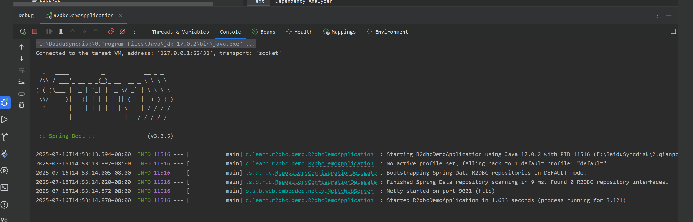

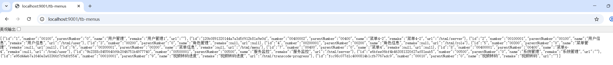

### 3.5 使用`DatabaseClient`编写`CRUD`代码

- `Dao`中增加代码

  ```java
      
  // 我们用这个更多 贴近底层  join操作好做
  @Resource
  private DatabaseClient databaseClient;  // 数据库客户端
  
  public Flux<TbMenu> listById(String id) {
          // 偏向于底层操作
          return databaseClient.sql("select * from tb_menu where id = ?")
                  .bind(0, id)
                  .fetch()
                  .all()
                  .map(map -> TbMenu.builder()
                          .id((String) map.get("id"))
                          .name((String) map.get("name"))
                          .number((String) map.get("number"))
                          .parentNumber((String) map.get("parent_number"))
                          .remake((String) map.get("remake"))
                          .url((String) map.get("url")).build());
  
      }
  ```

- `Controller`中增加代码

  ```java
      @GetMapping(value = "/tb-menus/{id}")
      public Flux<TbMenu> listById(@PathVariable("id") String id) {
          return tbMenuDao.listById(id);
      }
  ```

- 启动服务测试

  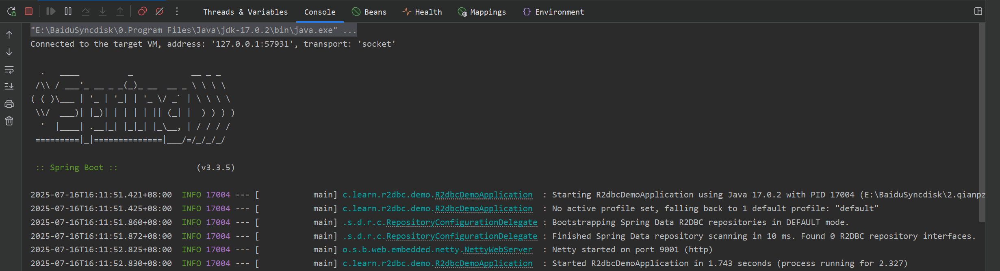

  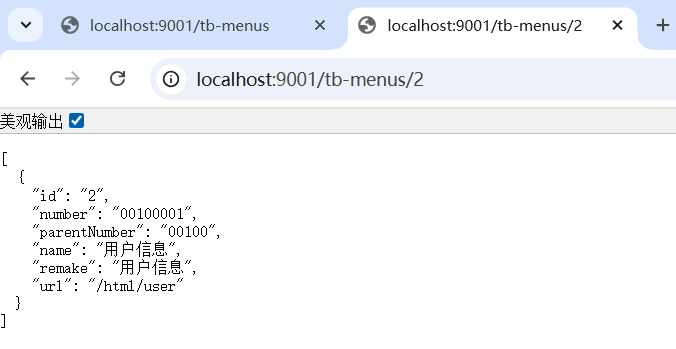

### 3.6 使用R2DBC Repositories`编写`CRUD`代码

- 开启仓库配置

> 在项目中,新增包`config`,在这个包下新建一个类`R2dbcConfig`

```java
package com.learn.r2dbc.demo.config;

import org.springframework.context.annotation.Configuration;
import org.springframework.data.r2dbc.repository.config.EnableR2dbcRepositories;

/**
 * r2dbc的配置功能
 *
 * @author qianpengzhan
 * @since 2025/7/16 16:32
 */
@EnableR2dbcRepositories  // 开启仓库功能 jpa
@Configuration
public class R2dbcConfig {
}

```

- 仓库编写

> 新增一个包`repositories`,然后在这个包下新建一个接口类`TbMenuRepository`，然后这个类继承CRUD的基础仓库 `extends R2dbcRepository<TbMenu, Long>`

```java
package com.learn.r2dbc.demo.repositories;

import com.learn.r2dbc.demo.entity.TbMenu;
import org.springframework.data.r2dbc.repository.R2dbcRepository;
import org.springframework.stereotype.Repository;

/**
 * @author qianpengzhan
 * @since 2025/7/16 16:34
 */
@Repository
public interface TbMenuRepository extends R2dbcRepository<TbMenu, String> {

    // 这里面提供了一堆的增删改查接口

}
```

- 然后在`TbMenuDao`中新增代码

``` java
    @Resource
    private TbMenuRepository tbMenuRepository;

    public Flux<TbMenu> allByRepository() {
        return tbMenuRepository.findAll();
    }
```

- 在`TbMenuController`中的新增代码

```java
    @GetMapping(value = "/tb-menus2")
    public Flux<TbMenu> allByRepository() {
        return tbMenuDao.allByRepository();
    }
```

- 增加日志配置

> 在`application.yaml`中加入如下配置即可

```yaml
# 打开日志
logging:
  level:
    org.springframework.r2dbc: debug
    org.springframework.data.r2dbc: debug
```

- 启动服务，测试

> Executing SQL statement [SELECT tb_menu.* FROM tb_menu]

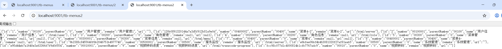

### 3.7 接口自定义起名以及`@Query`注解

> 这个主要实践于`TbMenuRepository`

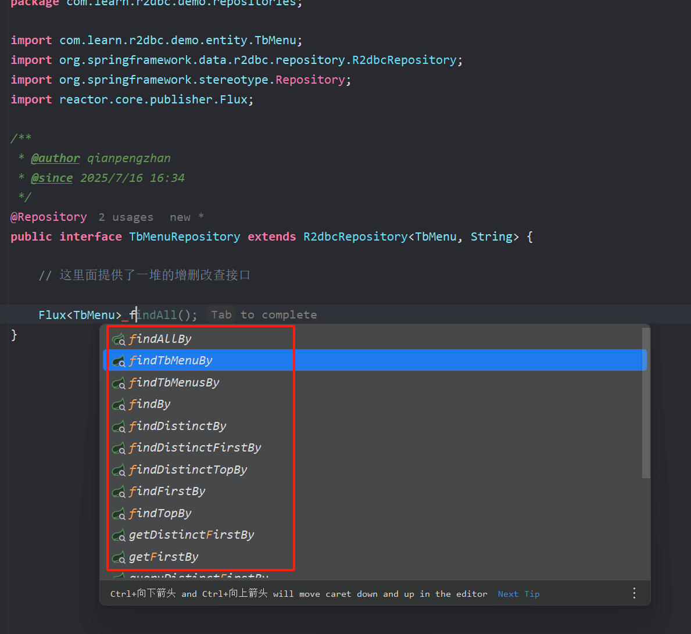

>  可以直接按照条件直接拼接

```java
## controller
@GetMapping(value = "/tb-menus3")
public Flux<TbMenu> customSqlAll() {
    return tbMenuDao.customSqlAll();
}

## dao
public Flux<TbMenu> customSqlAll() {
	return tbMenuRepository.customSqlAll();
}

## TbMenuRepositor
@Query(value = "select * from tb_menu")
Flux<TbMenu> customSqlAll();
```

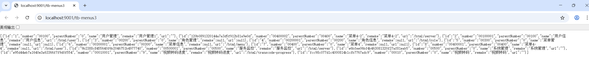

> 更多细节参考官网介绍： https://docs.spring.io/spring-data/relational/reference/r2dbc/query-methods.html

```java
interface ReactivePersonRepository extends ReactiveSortingRepository<Person, Long> {

    Flux<Person> findByFirstname(String firstname);                                   

    Flux<Person> findByFirstname(Publisher<String> firstname);                        

    Flux<Person> findByFirstnameOrderByLastname(String firstname, Pageable pageable); 

    Mono<Person> findByFirstnameAndLastname(String firstname, String lastname);       

    Mono<Person> findFirstByLastname(String lastname);                                

    @Query("SELECT * FROM person WHERE lastname = :lastname")
    Flux<Person> findByLastname(String lastname);                                     

    @Query("SELECT firstname, lastname FROM person WHERE lastname = $1")
    Mono<Person> findFirstByLastname(String lastname);                                
}
```

### 3.8 注意事项

> - 响应式API的日期的映射,使用`Instant` 或者 `LocalTimeXXX`

### 3.9 多表关联查询

> 再增加一张表和关联的数据

```sql

CREATE TABLE `tb_role_menu` (
  `id` varchar(32) NOT NULL COMMENT '主键',
  `role_id` varchar(32) DEFAULT NULL COMMENT '角色id',
  `menu_id` varchar(32) DEFAULT NULL COMMENT '菜单id',
  `create_time` varchar(50) NOT NULL,
  `update_time` varchar(50) NOT NULL,
  `update_user` varchar(32) NOT NULL,
  PRIMARY KEY (`id`)
) ENGINE=InnoDB DEFAULT CHARSET=utf8;

INSERT INTO kaishun.tb_role_menu
(id, role_id, menu_id, create_time, update_time, update_user)
VALUES('19224925ea774eb1b391baf11754b8b6', '10001', 'e95d44eb7a1640e3a63366f7f9d0f554', '2023-12-08 17:58:46', '2023-12-08 17:58:46', 'admin');
INSERT INTO kaishun.tb_role_menu
(id, role_id, menu_id, create_time, update_time, update_user)
VALUES('2bd17450bed049dca84808f892f24076', '10002', '1', '2020-04-15 16:04:36', '2020-04-15 16:04:36', 'admin');
INSERT INTO kaishun.tb_role_menu
(id, role_id, menu_id, create_time, update_time, update_user)
VALUES('35a33c0a717c4a80827cce9802a92e22', '10001', '7', '2023-12-08 17:58:46', '2023-12-08 17:58:46', 'admin');
INSERT INTO kaishun.tb_role_menu
(id, role_id, menu_id, create_time, update_time, update_user)
VALUES('3fd54d4ea5b64467961b27760f18a099', '10001', '120b0891320144a7a3d5f912b81a9e0d', '2023-12-08 17:58:46', '2023-12-08 17:58:46', 'admin');
INSERT INTO kaishun.tb_role_menu
(id, role_id, menu_id, create_time, update_time, update_user)
VALUES('4294ff28da514668945718901ae8e64f', '10001', '9b2388c8455640f6b2046751b4977740', '2023-12-08 17:58:46', '2023-12-08 17:58:46', 'admin');
INSERT INTO kaishun.tb_role_menu
(id, role_id, menu_id, create_time, update_time, update_user)
VALUES('449dc6c048694865bdb09a2f84e901c8', '10001', '5', '2023-12-08 17:58:46', '2023-12-08 17:58:46', 'admin');
INSERT INTO kaishun.tb_role_menu
(id, role_id, menu_id, create_time, update_time, update_user)
VALUES('54dc18f0224d4382b335913b63221a1a', '10001', '4', '2023-12-08 17:58:46', '2023-12-08 17:58:46', 'admin');
INSERT INTO kaishun.tb_role_menu
(id, role_id, menu_id, create_time, update_time, update_user)
VALUES('58dac31c07c8453f9b5ab2a9c536d9a9', '10001', '2', '2023-12-08 17:58:46', '2023-12-08 17:58:46', 'admin');
INSERT INTO kaishun.tb_role_menu
(id, role_id, menu_id, create_time, update_time, update_user)
VALUES('67cbd870dd72428bb89c16864f76a47c', '10001', '1', '2023-12-08 17:58:46', '2023-12-08 17:58:46', 'admin');
INSERT INTO kaishun.tb_role_menu
(id, role_id, menu_id, create_time, update_time, update_user)
VALUES('6d7fbd24772f4051aa89ccd0380cbfb7', '10001', 'fcc98c077d1c4000814b1cfb7767adc9', '2023-12-08 17:58:46', '2023-12-08 17:58:46', 'admin');
INSERT INTO kaishun.tb_role_menu
(id, role_id, menu_id, create_time, update_time, update_user)
VALUES('c0d44cd1e4874c23a1218c2ad347de24', '10001', 'e6bfee06bf4b463081320f27af81eab5', '2023-12-08 17:58:46', '2023-12-08 17:58:46', 'admin');
INSERT INTO kaishun.tb_role_menu
(id, role_id, menu_id, create_time, update_time, update_user)
VALUES('d920a09a54d348389f618147ad23bb8f', '10001', '3', '2023-12-08 17:58:46', '2023-12-08 17:58:46', 'admin');
INSERT INTO kaishun.tb_role_menu
(id, role_id, menu_id, create_time, update_time, update_user)
VALUES('dbe630c9ad4e42339d021d640314eb19', '10002', '2', '2020-04-15 16:04:36', '2020-04-15 16:04:36', 'admin');
INSERT INTO kaishun.tb_role_menu
(id, role_id, menu_id, create_time, update_time, update_user)
VALUES('f428f71b6b4c422791d2cf6bb10a242d', '10001', '6', '2023-12-08 17:58:46', '2023-12-08 17:58:46', 'admin');

```

>  然后我们增加对应的代码如下：

1. `TbRoleMenu`.java

   ```java
   package com.learn.r2dbc.demo.entity;
   
   import lombok.AllArgsConstructor;
   import lombok.Builder;
   import lombok.Data;
   import lombok.NoArgsConstructor;
   import org.springframework.data.annotation.Id;
   import org.springframework.data.relational.core.mapping.Column;
   import org.springframework.data.relational.core.mapping.Table;
   
   import java.io.Serial;
   import java.io.Serializable;
   import java.time.Instant;
   
   /**
    * @author qianpengzhan
    * @since 2025/7/17 9:31
    */
   @Data
   @Builder
   @AllArgsConstructor
   @NoArgsConstructor
   @Table(value = "tb_role_menu")
   public class TbRoleMenu implements Serializable {
       @Serial
       private static final long serialVersionUID = 7274477510099603667L;
   
       @Id
       @Column("id")
       private String id;
   
       @Column("role_id")
       private String roleId;
   
       @Column("menu_id")
       private String menuId;
   
       @Column("createTime")
       private Instant createTime;
   }
   
   ```

2. `TbRoleMenuRepository`.java

   ```java
   package com.learn.r2dbc.demo.repositories;
   
   import com.learn.r2dbc.demo.entity.TbRoleMenu;
   import org.springframework.data.r2dbc.repository.R2dbcRepository;
   import org.springframework.stereotype.Repository;
   
   /**
    * @author qianpengzhan
    * @since 2025/7/17 9:40
    */
   @Repository
   public interface TbRoleMenuRepository extends R2dbcRepository<TbRoleMenu, String> {
   }
   
   ```

3. `TbRoleMenuDao`.java

   ```java
   package com.learn.r2dbc.demo.dao;
   
   import com.learn.r2dbc.demo.entity.TbRoleMenu;
   import com.learn.r2dbc.demo.repositories.TbRoleMenuRepository;
   import jakarta.annotation.Resource;
   import org.springframework.stereotype.Service;
   import reactor.core.publisher.Flux;
   
   /**
    * @author qianpengzhan
    * @since 2025/7/17 9:41
    */
   @Service
   public class TbRoleMenuDao {
   
       @Resource
       private TbRoleMenuRepository tbRoleMenuRepository;
   
       public Flux<TbRoleMenu> all() {
           return tbRoleMenuRepository.findAll();
       }
   }
   ```

4. `TbRoleMenuController`.java

   ```java
   package com.learn.r2dbc.demo.controller;
   
   import com.learn.r2dbc.demo.dao.TbRoleMenuDao;
   import com.learn.r2dbc.demo.entity.TbRoleMenu;
   import jakarta.annotation.Resource;
   import org.springframework.web.bind.annotation.GetMapping;
   import org.springframework.web.bind.annotation.RestController;
   import reactor.core.publisher.Flux;
   
   /**
    * @author qianpengzhan
    * @since 2025/7/17 9:42
    */
   @RestController
   public class TbRoleMenuController {
   
       @Resource
       private TbRoleMenuDao tbRoleMenuDao;
   
       @GetMapping(value = "/tb-role-menus")
       public Flux<TbRoleMenu> all() {
           return tbRoleMenuDao.all();
       }
   }
   ```

   > 启动服务，测试下:

   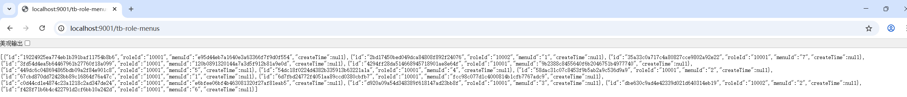

> 下面，则进行多表关联查询测试

> 在实体类中添加 **自定义转换** 代码如下:

```java
package com.learn.r2dbc.demo.converter;

import com.learn.r2dbc.demo.entity.TbMenu;
import com.learn.r2dbc.demo.entity.TbRoleMenu;
import io.r2dbc.spi.Row;
import org.springframework.core.convert.converter.Converter;
import org.springframework.data.convert.ReadingConverter;

import java.time.Instant;

/**
 * @author qianpengzhan
 * @since 2025/7/17 10:19
 */
@ReadingConverter  // 读取数据库数据的时候进行的自定义行数据转换
public class MenuConverter implements Converter<Row, TbRoleMenu> {
    @Override
    public TbRoleMenu convert(Row source) {
        TbRoleMenu roleMenu = new TbRoleMenu();
        roleMenu.setId(source.get("id", String.class));
        roleMenu.setRoleId(source.get("role_id", String.class));
        roleMenu.setMenuId(source.get("menu_id", String.class));
        roleMenu.setCreateTime(source.get("create_time", Instant.class));
		// 为了兼容更多的表结构处理 比如单表查询 不需要查menu的历史情况
        if (source.getMetadata().contains("number") ||
                source.getMetadata().contains("parent_number") ||
                source.getMetadata().contains("remake") ||
                source.getMetadata().contains("url") ||
                source.getMetadata().contains("name")) {
            // 只要存在一个 tb_menu 表的属性 则加入到对象中
            TbMenu menu = new TbMenu();
            menu.setId(roleMenu.getMenuId());
            if (source.getMetadata().contains("number")) {
                menu.setNumber(source.get("number", String.class));
            }
            if (source.getMetadata().contains("parent_number")) {
                menu.setParentNumber(source.get("parent_number", String.class));
            }
            if (source.getMetadata().contains("remake")) {
                menu.setRemake(source.get("remake", String.class));
            }
            if (source.getMetadata().contains("url")) {
                menu.setUrl(source.get("url", String.class));
            }
            if (source.getMetadata().contains("name")) {
                menu.setName(source.get("name", String.class));
            }
            roleMenu.setTbMenu(menu);
        } else {
            roleMenu.setTbMenu(null);
        }
        return roleMenu;
    }

    @Override
    public <U> Converter<Row, U> andThen(Converter<? super TbRoleMenu, ? extends U> after) {
        return Converter.super.andThen(after);
    }
}
```

> 然后将转换器加入配置中

```java
package com.learn.r2dbc.demo.config;

import com.learn.r2dbc.demo.converter.MenuConverter;
import org.springframework.boot.autoconfigure.condition.ConditionalOnMissingBean;
import org.springframework.context.annotation.Bean;
import org.springframework.context.annotation.Configuration;
import org.springframework.data.r2dbc.convert.R2dbcCustomConversions;
import org.springframework.data.r2dbc.dialect.MySqlDialect;
import org.springframework.data.r2dbc.repository.config.EnableR2dbcRepositories;

/**
 * r2dbc的配置功能
 *
 * @author qianpengzhan
 * @since 2025/7/16 16:32
 */
@EnableR2dbcRepositories  // 开启仓库功能 jpa
@Configuration
public class R2dbcConfig {

	// 新增1个转换器
    @Bean
    @ConditionalOnMissingBean
    public R2dbcCustomConversions conversions() {
        // 将自定义的转换器加入到配置中
        return R2dbcCustomConversions.of(MySqlDialect.INSTANCE, new MenuConverter());
    }
}

```

> 查询全部的信息的SQL进行改动：

```java
# TbRoleMenuRepository  新增自定义SQL 
@Repository
public interface TbRoleMenuDao extends R2dbcRepository<TbRoleMenu, String> {

    @Query("select p1.*,p2.* from tb_role_menu p1 left join tb_menu p2 on p1.menu_id = p2.id ")
    Flux<TbRoleMenu> findAllAndAllMenu();
}

#  TbRoleMenuDao.java 改动
public Flux<TbRoleMenu> all() {
    return tbRoleMenuRepository.findAllAndAllMenu();
}
```

> 启动服务 再次进行测试：

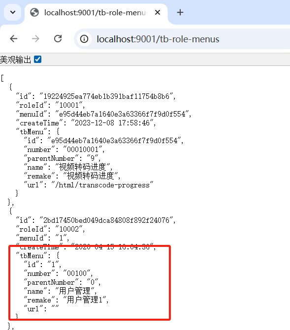


### 3.10 总结

::: warning 总结

> 最佳实践： 提升生产效率
>
> - 纯简单的`CRUD`，就直接使用`XxxRepository`继承`R2dbcRepository<Xxx,Id>`就行了，直接使用API
> - 自定义复杂的SQL(单表)，则使用 `@Query`
> - 多表关联复杂则使用`DatabaseClient`这种偏底层的客户端就好了

:::

## 【4】参考资料

- [SpringBoot3响应式编程精讲](https://www.bilibili.com/video/BV1gsYEeLEuM?spm_id_from=333.788.videopod.episodes&vd_source=65c7f6924d2d8ba5fa0d4c448818e08a)
- [R2DBC官网文档](https://r2dbc.io/)