# 第七章: Spring Reactive Security 认证鉴权

[[toc]]

> 说在前面的话，本文为个人学习[SpringBoot3响应式编程精讲](https://www.bilibili.com/video/BV1gsYEeLEuM?spm_id_from=333.788.videopod.episodes&vd_source=65c7f6924d2d8ba5fa0d4c448818e08a)后进行总结的文章，本文主要用于<b>响应式编程</b>。

## 【1】本章学习图解

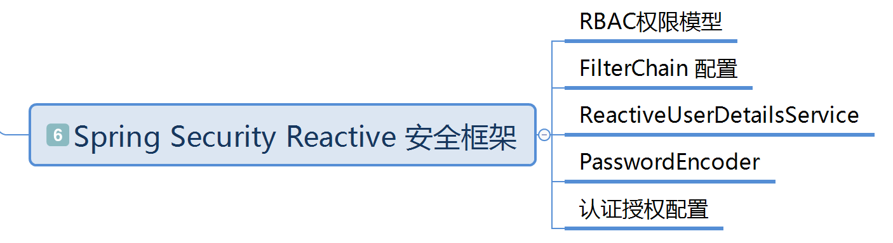

## 【2】创建项目

- 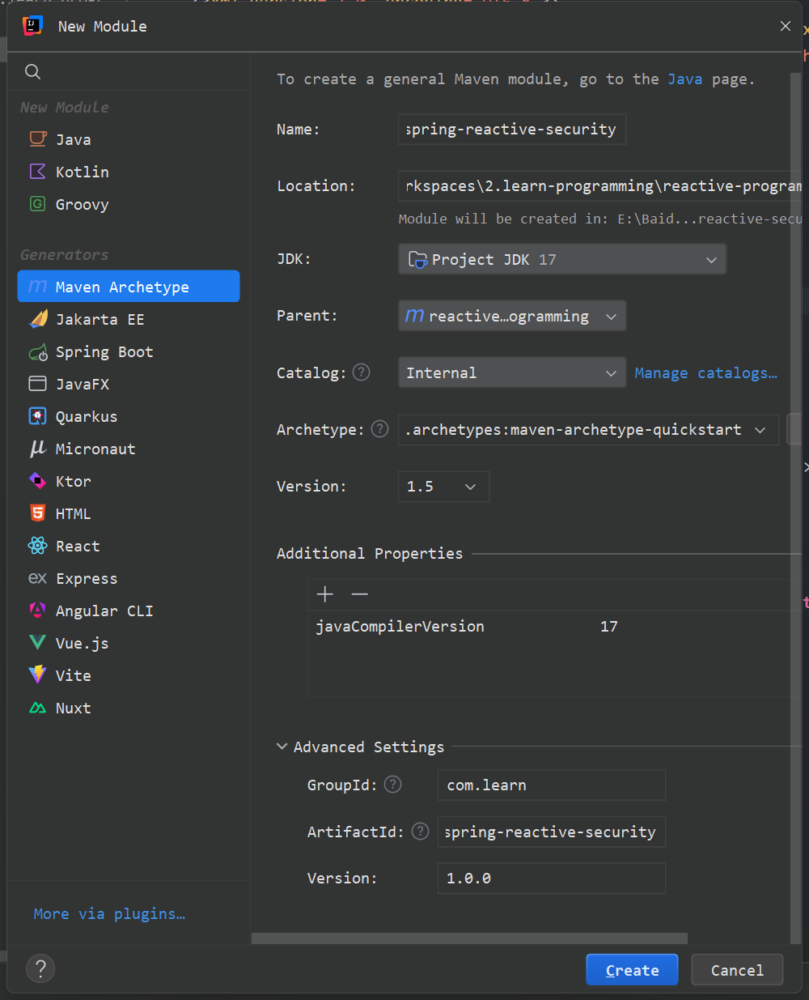

- 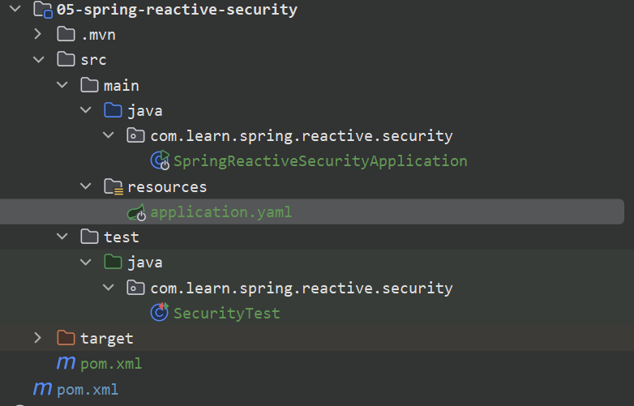

- pom.xml 如下: 

- ```xml
  <?xml version="1.0" encoding="UTF-8"?>
  <project xmlns:xsi="http://www.w3.org/2001/XMLSchema-instance" xmlns="http://maven.apache.org/POM/4.0.0"
           xsi:schemaLocation="http://maven.apache.org/POM/4.0.0 http://maven.apache.org/xsd/maven-4.0.0.xsd">
      <modelVersion>4.0.0</modelVersion>
      <parent>
          <groupId>com.learn</groupId>
          <artifactId>reactive-programming</artifactId>
          <version>1.0.0</version>
      </parent>
  
      <artifactId>05-spring-reactive-security</artifactId>
  
      <name>05-spring-reactive-security</name>
  
      <dependencies>
          <!--  响应式web      -->
          <dependency>
              <groupId>org.springframework.boot</groupId>
              <artifactId>spring-boot-starter-webflux</artifactId>
          </dependency>
          <!-- 响应式Spring Data r2dbc -->
          <dependency>
              <groupId>org.springframework.boot</groupId>
              <artifactId>spring-boot-starter-data-r2dbc</artifactId>
          </dependency>
          <!--  引入 r2dbc-mysql驱动  -->
          <dependency>
              <groupId>io.asyncer</groupId>
              <artifactId>r2dbc-mysql</artifactId>
          </dependency>
          <!-- lombok、单元测试的jar  start-->
          <dependency>
              <groupId>org.projectlombok</groupId>
              <artifactId>lombok</artifactId>
          </dependency>
          <dependency>
              <groupId>junit</groupId>
              <artifactId>junit</artifactId>
              <scope>test</scope>
          </dependency>
          <dependency>
              <groupId>org.springframework.boot</groupId>
              <artifactId>spring-boot-starter-test</artifactId>
          </dependency>
          <!-- lombok、单元测试的jar  end-->
      </dependencies>
  
      <build>
          <plugins>
              <plugin>
                  <groupId>org.apache.maven.plugins</groupId>
                  <artifactId>maven-compiler-plugin</artifactId>
                  <configuration>
                      <compilerArgs>
                          <!--在 Maven 或 Gradle 中配置 -parameters 编译选项，确保字节码保留参数名：-->
                          <arg>-parameters</arg>
                      </compilerArgs>
                  </configuration>
              </plugin>
          </plugins>
      </build>
  </project>
  
  ```

- `application.yaml`如下：

- ```yaml
  server:
    port: 9002
  
  spring:
    r2dbc:
      username: root
      password: 123456
      url: r2dbc:mysql://127.0.0.1:3306/security
  
  # 打开日志
  logging:
    level:
      org.springframework.r2dbc: debug
      org.springframework.data.r2dbc: debug
  ```

- 其他代码:

- 

- ```java
  package com.learn.spring.reactive.security;
  
  import org.springframework.boot.SpringApplication;
  import org.springframework.boot.autoconfigure.SpringBootApplication;
  
  /**
   * @author qianpengzhan
   * @since 2025/7/17 13:25
   */
  @SpringBootApplication
  public class SpringReactiveSecurityApplication {
      public static void main(String[] args) {
          SpringApplication.run(SpringReactiveSecurityApplication.class, args);
      }
  }
  
  package com.learn.spring.reactive.security;
  
  import org.junit.Test;
  import org.springframework.boot.test.context.SpringBootTest;
  
  /**
   * @author qianpengzhan
   * @since 2025/7/17 13:26
   */
  @SpringBootTest
  public class SecurityTest {
  
  
      @Test
      public void contextLoads() {
          assert true;
      }
  }
  
  
  config:
  package com.learn.spring.reactive.security.config;
  
  import org.springframework.context.annotation.Configuration;
  import org.springframework.data.r2dbc.convert.R2dbcCustomConversions;
  import org.springframework.data.r2dbc.repository.config.EnableR2dbcRepositories;
  
  /**
   * r2dbc的配置功能
   *
   * @author qianpengzhan
   * @since 2025/7/16 16:32
   */
  @EnableR2dbcRepositories  // 开启仓库功能 jpa
  @Configuration
  public class R2dbcConfig {
  
  
      // 新增1个转换器
      //@Bean
      //@ConditionalOnMissingBean
      public R2dbcCustomConversions conversions() {
          // 将自定义的转换器加入到配置中
          return null;
      }
  }
  ```

## 【3】响应式鉴权认证引入依赖

```xml
<!-- 引入 响应式鉴权认证框架 -->
<dependency>
    <groupId>org.springframework.boot</groupId>
    <artifactId>spring-boot-starter-security</artifactId>
</dependency>
```

## 【4】数据库SQL导入

```sql
-- `security`.t_user definition

CREATE TABLE `t_user` (
  `user_id` bigint(20) unsigned NOT NULL DEFAULT '0' COMMENT '主键ID',
  `user_name` varchar(16)  NOT NULL DEFAULT '' COMMENT '用户名',
  `user_password` varchar(255)  NOT NULL DEFAULT '' COMMENT '密码',
  `phone` varchar(11)  NOT NULL DEFAULT '' COMMENT '手机号',
  `sex` tinyint(1) unsigned NOT NULL DEFAULT '1' COMMENT '性别',
  `age` int(10) unsigned NOT NULL DEFAULT '0' COMMENT '年龄',
  `create_time` datetime NOT NULL DEFAULT CURRENT_TIMESTAMP COMMENT '创建时间',
  `update_time` datetime NOT NULL DEFAULT CURRENT_TIMESTAMP ON UPDATE CURRENT_TIMESTAMP COMMENT '更新时间',
  PRIMARY KEY (`user_id`) USING BTREE
) ENGINE=InnoDB  COMMENT='用户表';

-- `security`.t_role definition

CREATE TABLE `t_role` (
  `role_id` bigint(20) unsigned NOT NULL DEFAULT '0' COMMENT '主键ID',
  `role_name` varchar(16)  NOT NULL DEFAULT '' COMMENT '角色名称',
  `remark` varchar(255)  NOT NULL DEFAULT '' COMMENT '备注',
  `create_time` datetime NOT NULL DEFAULT CURRENT_TIMESTAMP COMMENT '创建时间',
  `update_time` datetime NOT NULL DEFAULT CURRENT_TIMESTAMP ON UPDATE CURRENT_TIMESTAMP COMMENT '更新时间',
  PRIMARY KEY (`role_id`) USING BTREE
) ENGINE=InnoDB  COMMENT='角色表';

-- `security`.t_permission definition

CREATE TABLE `t_permission` (
  `permission_id` bigint(20) unsigned NOT NULL DEFAULT '0' COMMENT '主键ID',
  `permission_code` varchar(32)  DEFAULT NULL COMMENT '权限code',
  `permission_name` varchar(32)  DEFAULT NULL COMMENT '权限名称',
  `remark` varchar(255)  DEFAULT NULL COMMENT '备注',
  `create_time` datetime NOT NULL DEFAULT CURRENT_TIMESTAMP COMMENT '创建时间',
  `update_time` datetime NOT NULL DEFAULT CURRENT_TIMESTAMP ON UPDATE CURRENT_TIMESTAMP COMMENT '更新时间',
  PRIMARY KEY (`permission_id`) USING BTREE
) ENGINE=InnoDB  COMMENT='权限表';

-- `security`.t_user_role definition

CREATE TABLE `t_user_role` (
  `user_role_id` bigint(20) unsigned NOT NULL DEFAULT '0' COMMENT '主键ID',
  `user_id` bigint(20) unsigned NOT NULL DEFAULT '0' COMMENT '关联的用户ID',
  `role_id` bigint(20) unsigned NOT NULL DEFAULT '0' COMMENT '关联的角色ID',
  `create_time` datetime NOT NULL DEFAULT CURRENT_TIMESTAMP COMMENT '创建时间',
  `update_time` datetime NOT NULL DEFAULT CURRENT_TIMESTAMP ON UPDATE CURRENT_TIMESTAMP COMMENT '更新时间',
  PRIMARY KEY (`user_role_id`) USING BTREE
) ENGINE=InnoDB  COMMENT='用户角色关联表';

-- `security`.t_role_permission definition

CREATE TABLE `t_role_permission` (
  `role_permission_id` bigint(20) unsigned NOT NULL DEFAULT '0' COMMENT '主键ID',
  `role_id` bigint(20) unsigned NOT NULL DEFAULT '0' COMMENT '关联的角色ID',
  `permission_id` bigint(20) unsigned NOT NULL DEFAULT '0' COMMENT '关联的权限ID',
  `create_time` datetime NOT NULL DEFAULT CURRENT_TIMESTAMP COMMENT '创建时间',
  `update_time` datetime NOT NULL DEFAULT CURRENT_TIMESTAMP ON UPDATE CURRENT_TIMESTAMP COMMENT '更新时间',
  PRIMARY KEY (`role_permission_id`) USING BTREE
) ENGINE=InnoDB  COMMENT='角色权限关联表';


INSERT INTO `security`.t_user
(user_id, user_name, user_password, phone, sex, age, create_time, update_time)
VALUES(1, 'admin', '{bcrypt}$2a$10$y07Z//nuEdvJDQVW0uMjSO5tNeBlWMKRtHMcvQQWXpFWQFJ/m7Qze', '', 1, 0, '2025-07-18 11:40:21', '2025-07-22 10:21:24');
INSERT INTO `security`.t_user
(user_id, user_name, user_password, phone, sex, age, create_time, update_time)
VALUES(2, 'temp1', '{bcrypt}$2a$10$y07Z//nuEdvJDQVW0uMjSO5tNeBlWMKRtHMcvQQWXpFWQFJ/m7Qze', '', 1, 0, '2025-07-18 11:40:41', '2025-07-22 10:21:24');

INSERT INTO `security`.t_role
(role_id, role_name, remark, create_time, update_time)
VALUES(1, 'admin', '', '2025-07-18 11:40:56', '2025-07-18 11:40:56');
INSERT INTO `security`.t_role
(role_id, role_name, remark, create_time, update_time)
VALUES(2, 'temp1', '', '2025-07-18 11:41:12', '2025-07-18 11:41:12');

INSERT INTO `security`.t_permission
(permission_id, permission_code, permission_name, remark, create_time, update_time)
VALUES(1, 'login', '登录', '', '2025-07-18 11:41:29', '2025-07-22 10:26:31');
INSERT INTO `security`.t_permission
(permission_id, permission_code, permission_name, remark, create_time, update_time)
VALUES(2, 'logout', '登出', '', '2025-07-18 11:41:51', '2025-07-18 11:41:53');
INSERT INTO `security`.t_permission
(permission_id, permission_code, permission_name, remark, create_time, update_time)
VALUES(3, 'hello', '访问Hello', '访问Hello', '2025-07-22 11:10:20', '2025-07-22 11:11:22');
INSERT INTO `security`.t_permission
(permission_id, permission_code, permission_name, remark, create_time, update_time)
VALUES(4, 'world', '访问world', '访问world', '2025-07-22 11:10:53', '2025-07-22 11:10:53');

INSERT INTO `security`.t_user_role
(user_role_id, user_id, role_id, create_time, update_time)
VALUES(1, 1, 1, '2025-07-18 11:42:06', '2025-07-18 11:42:06');
INSERT INTO `security`.t_user_role
(user_role_id, user_id, role_id, create_time, update_time)
VALUES(2, 2, 2, '2025-07-18 11:42:58', '2025-07-18 11:42:58');

INSERT INTO `security`.t_role_permission
(role_permission_id, role_id, permission_id, create_time, update_time)
VALUES(1, 1, 1, '2025-07-18 11:42:23', '2025-07-18 11:42:23');
INSERT INTO `security`.t_role_permission
(role_permission_id, role_id, permission_id, create_time, update_time)
VALUES(3, 1, 3, '2025-07-22 11:11:52', '2025-07-22 11:11:52');
INSERT INTO `security`.t_role_permission
(role_permission_id, role_id, permission_id, create_time, update_time)
VALUES(4, 1, 4, '2025-07-22 11:12:01', '2025-07-22 11:12:01');
INSERT INTO `security`.t_role_permission
(role_permission_id, role_id, permission_id, create_time, update_time)
VALUES(2, 1, 2, '2025-07-18 11:42:29', '2025-07-18 11:42:29');

```

## 【5】生成实体类

>  利用`idea`的插件`Pojo Generator` 反向生成实体类，然后稍微修改下引入的包即可如下代码

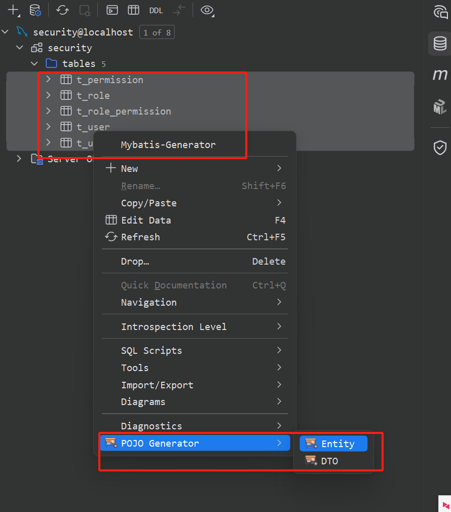

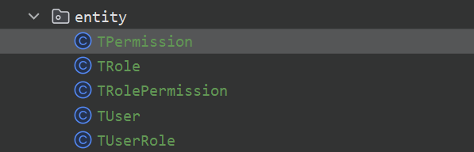

- `TUser`.java

``` java
package com.learn.spring.reactive.security.entity;

import lombok.AllArgsConstructor;
import lombok.Builder;
import lombok.Data;
import lombok.NoArgsConstructor;
import org.springframework.data.annotation.Id;
import org.springframework.data.relational.core.mapping.Column;
import org.springframework.data.relational.core.mapping.Table;

import java.time.Instant;

@Data
@AllArgsConstructor
@NoArgsConstructor
@Builder
@Table(name = "t_user")
public class TUser {
    @Id
    @Column(value = "user_id")
    private Long userId;

    @Column(value = "user_name")
    private String userName;

    @Column(value = "user_password")
    private String userPassword;

    @Column(value = "phone")
    private String phone;

    @Column(value = "sex")
    private Byte sex;

    @Column(value = "age")
    private Integer age;

    @Column(value = "create_time")
    private Instant createTime;

    @Column(value = "update_time")
    private Instant updateTime;

}
```

- `TRole`.java

```java
package com.learn.spring.reactive.security.entity;

import lombok.AllArgsConstructor;
import lombok.Builder;
import lombok.Data;
import lombok.NoArgsConstructor;
import org.springframework.data.annotation.Id;
import org.springframework.data.relational.core.mapping.Column;
import org.springframework.data.relational.core.mapping.Table;

import java.time.Instant;

@Data
@AllArgsConstructor
@NoArgsConstructor
@Builder
@Table(name = "t_role")
public class TRole {
    @Id
    @Column(value = "role_id")
    private Long roleId;

    @Column(value = "role_name")
    private String roleName;

    @Column(value = "remark")
    private String remark;

    @Column(value = "create_time")
    private Instant createTime;

    @Column(value = "update_time")
    private Instant updateTime;
}
```

- `TPermission`.java

```java
package com.learn.spring.reactive.security.entity;

import lombok.AllArgsConstructor;
import lombok.Builder;
import lombok.Data;
import lombok.NoArgsConstructor;
import org.springframework.data.annotation.Id;
import org.springframework.data.relational.core.mapping.Column;
import org.springframework.data.relational.core.mapping.Table;

import java.time.Instant;

@Data
@AllArgsConstructor
@NoArgsConstructor
@Builder
@Table(name = "t_permission")
public class TPermission {
    @Id
    @Column(value = "permission_id")
    private Long permissionId;

    @Column(value = "permission_code")
    private String permissionCode;

    @Column(value = "permission_name")
    private String permissionName;

    @Column(value = "remark")
    private String remark;

    @Column(value = "create_time")
    private Instant createTime;

    @Column(value = "update_time")
    private Instant updateTime;
}
```

- `TUserRole`.java

```java
package com.learn.spring.reactive.security.entity;


import lombok.AllArgsConstructor;
import lombok.Builder;
import lombok.Data;
import lombok.NoArgsConstructor;
import org.springframework.data.annotation.Id;
import org.springframework.data.relational.core.mapping.Column;
import org.springframework.data.relational.core.mapping.Table;

import java.time.Instant;

@Data
@AllArgsConstructor
@NoArgsConstructor
@Builder
@Table(name = "t_user_role")
public class TUserRole {
    @Id
    @Column(value = "user_role_id")
    private Long userRoleId;

    @Column(value = "user_id")
    private Long userId;

    @Column(value = "role_id")
    private Long roleId;

    @Column(value = "create_time")
    private Instant createTime;

    @Column(value = "update_time")
    private Instant updateTime;
}
```

- `TRolePermission`.java

```java
package com.learn.spring.reactive.security.entity;

import lombok.AllArgsConstructor;
import lombok.Builder;
import lombok.Data;
import lombok.NoArgsConstructor;
import org.springframework.data.annotation.Id;
import org.springframework.data.relational.core.mapping.Column;
import org.springframework.data.relational.core.mapping.Table;

import java.time.Instant;

@Data
@AllArgsConstructor
@NoArgsConstructor
@Builder
@Table(name = "t_role_permission")
public class TRolePermission {
    @Id
    @Column(value = "role_permission_id")
    private Long rolePermissionId;

    @Column(value = "role_id")
    private Long roleId;

    @Column(value = "permission_id")
    private Long permissionId;

    @Column(value = "create_time")
    private Instant createTime;

    @Column(value = "update_time")
    private Instant updateTime;
}
```

## 【6】初步测试

> 启动服务，可以看到日志中有一个密码,保存下。然后登录`http://localhost:9002`会自动跳到登陆页面，然后输入用户`user`，密码为日志中的值。输入后说明登录成功了.这样就把会话保存了。可以访问内部的接口了。

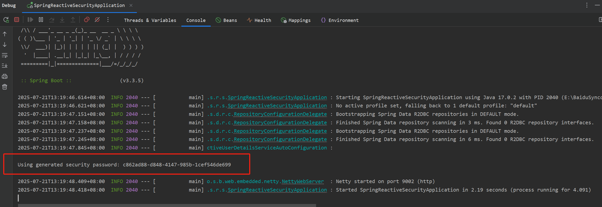

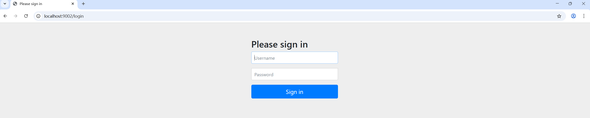

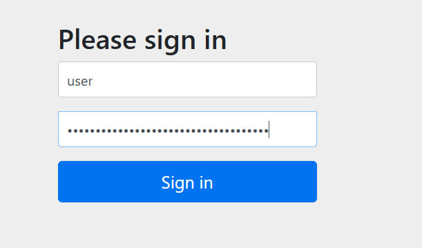

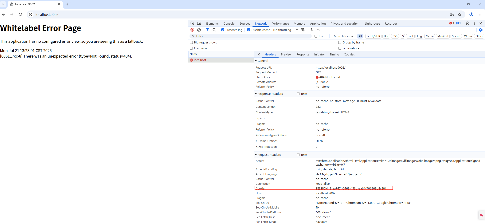

> 这样，最最基础的权限认证框架就集成OK了。

## 【7】引入应用安全

> - 防止攻击
>   - `DDOS`、`CSRF`、`XSS`、`SQL`注入
> - 控制权限
>   - 登录的用户能做什么，不能做什么
>   - 用户登录系统之后要控制住用户的所有行为，防止越权
> - 传输加密
>   - `https`
>   - `X509`
> - 权限认证
>   - `OAuth2.0`
>   - `JWT`

## 【8】RBAC权限模型

### 8.1 定义

> **RBAC权限模型:**  `Role Based Access Control`  基于角色访问控制权限模型

> 它是一种广泛使用的权限管理模型，其核心思想是通过将权限分配给预定义的角色，再将角色绑定到用户，实现权限的间接继承和管理。‌
>
>  这简化了授权过程，因为管理员只需关注角色级别的权限设置，而无需为每个用户单独配置。‌

### 8.2 举例

> 比如一个网站有很多用户，`zhangsan`是其中1个用户
>
> 每个用户拥有很多角色，比如 `zhangsan`拥有2个角色，访问者和操作者
>
> 每个角色关联了很多权限，比如 访问者有很多访问权限，操作者有很多操作权限，那么`zhangsan`就有了访问和操作的权限。
>
> 那么一个用户能做什么，我们只要是先找到这个用户，然后查询这个用户有哪些角色，再看这些角色有哪些权限，这个权限决定了这个用户能做什么。

### 8.3  RBAC的核心组件和工作原理

> RBAC系统通常包含以下关键元素：
>
> - ‌**用户**‌：系统中的个体账号或身份。
> - ‌**角色**‌：代表特定职能或职责的抽象集合（如“管理员”“编辑者”）。
> - ‌**权限**‌：对资源（如文件、菜单）的操作能力（如查看、编辑、删除）。

>  角色作为用户和权限之间的桥梁，权限通过角色间接授予用户。‌
>
> 例如，一个“管理员”角色可能拥有所有操作权限，而“编辑者”只能查看和编辑资源。‌

### 8.4 RBAC的优点

> - ‌**简单直观**‌：用户通过角色理解权限，学习和使用门槛低。‌
> - ‌**易管理**‌：权限集中在角色层级更新，减少维护成本（如批量修改角色即可影响所有绑定用户）。‌
> - ‌**可扩展性强**‌：系统增长时，添加新角色或调整权限规则简便。‌
> - ‌**高性能**‌：决策逻辑简单，执行效率高，适合高并发场景。‌

### 8.5 RBAC的缺点

> - ‌**角色爆炸问题**‌：复杂系统中需创建过多角色以满足细粒度需求，导致管理混乱。‌
> - ‌**灵活性不足**‌：权限基于静态角色分配，无法处理动态条件（如时间段、资源属性）。‌
> - ‌**细粒度控制弱**‌：不支持资源级别的精细权限（如仅允许访问特定数据行）。‌

### 8.6 适用场景

> `RBAC`模型最适合结构化环境，例如：
>
> - 企业后台系统（如`HR`、`ERP`、`CMS`）。‌
> - 内部管理平台需要统一权限控制的场景。‌
> - 相比其他模型如ABAC（基于属性的访问控制），`RBAC`更简单但灵活性较差，后者适合需要动态策略的系统。‌

## 【9】 Spring Security 默认行为

> - `Spring Security` 的默认行为:  未登录之前全都会重定向到 `/login` 登录界面
>
> - 自动配置
>
>   - `SecurityAutoConfiguration`
>
>     - ```java
>       @AutoConfiguration(before = UserDetailsServiceAutoConfiguration.class)
>       @ConditionalOnClass(DefaultAuthenticationEventPublisher.class)
>       @EnableConfigurationProperties(SecurityProperties.class)
>       @Import({ SpringBootWebSecurityConfiguration.class, SecurityDataConfiguration.class })
>       public class SecurityAutoConfiguration {
>       	    
>           // 这里就是默认的认证发布器
>       	@Bean
>       	@ConditionalOnMissingBean(AuthenticationEventPublisher.class)
>       	public DefaultAuthenticationEventPublisher authenticationEventPublisher(ApplicationEventPublisher publisher) {
>       		return new DefaultAuthenticationEventPublisher(publisher);
>       	}
>           
>       }
>       ```
>
>     - > 主要关注这里 `@Import({ SpringBootWebSecurityConfiguration.class, SecurityDataConfiguration.class })`
>
>       > `SpringBootWebSecurityConfiguration.java`，它里面有如下代码： 
>       >
>       > ```java
>       > @Configuration(proxyBeanMethods = false)
>       > 	@ConditionalOnDefaultWebSecurity
>       > 	static class SecurityFilterChainConfiguration {
>       > 
>       > 		@Bean
>       > 		@Order(SecurityProperties.BASIC_AUTH_ORDER)
>       > 		SecurityFilterChain defaultSecurityFilterChain(HttpSecurity http) throws Exception {
>       >             // 这行的意思： 任何请求都要进行认证
>       > 			http.authorizeHttpRequests((requests) -> requests.anyRequest().authenticated());
>       >             // 默认的表单登录
>       > 			http.formLogin(withDefaults());
>       >             // 默认的http请求
>       > 			http.httpBasic(withDefaults());
>       > 			return http.build();
>       > 		}
>       > 
>       > 	}
>       > ```
>       >
>       > 这是命令时编程的配置，我们了解下即可。反正，它拦截了所有的资源。
>
>   - `SecurityFilterAutoConfiguration`
>
>   - `ReactiveSecurityAutoConfiguration`
>
>     - 这个就是响应式编程的默认行为配置
>
>     - ```java
>       @AutoConfiguration
>       @EnableConfigurationProperties(SecurityProperties.class)
>       @ConditionalOnClass({ Flux.class, EnableWebFluxSecurity.class, WebFilterChainProxy.class, WebFluxConfigurer.class })
>       public class ReactiveSecurityAutoConfiguration {
>           
>       	@ConditionalOnWebApplication(type = ConditionalOnWebApplication.Type.REACTIVE)
>       	@Configuration(proxyBeanMethods = false)
>       	class SpringBootWebFluxSecurityConfiguration {
>           
>       		@Bean
>       		@ConditionalOnMissingBean({ ReactiveAuthenticationManager.class, ReactiveUserDetailsService.class,
>       				SecurityWebFilterChain.class })
>       		ReactiveAuthenticationManager denyAllAuthenticationManager() {
>       			return (authentication) -> Mono.error(new UsernameNotFoundException(authentication.getName()));
>       		}
>           
>       		@Configuration(proxyBeanMethods = false)
>       		@ConditionalOnMissingBean(WebFilterChainProxy.class)
>       		@EnableWebFluxSecurity
>       		static class EnableWebFluxSecurityConfiguration {
>           
>       		}
>       	}
>       }
>       ```
>
>     - `SecurityProperties`， 这里定义了默认的用户名和密码。
>
>     - ```
>       public static class User {
>           
>       		/**
>       		 * Default user name.
>       		 */
>       		private String name = "user";
>           
>       		/**
>       		 * Password for the default user name.
>       		 */
>       		private String password = UUID.randomUUID().toString();
>           
>       		/**
>       		 * Granted roles for the default user name.
>       		 */
>       		private List<String> roles = new ArrayList<>();
>           
>       		private boolean passwordGenerated = true;
>       }
>       ```
>
>   - `MethodSecurityAspectJAutoConfiguration`

## 【10】自定义`Security`默认配置

> 那么，我们现在需要部分资源是可以不被拦截，要如何配置呢。此时就需要去自定义配置覆盖默认的配置处理。参考[官网文档](https://docs.spring.io/spring-security/reference/6.3/reactive/authentication/x509.html)，在`config`包下创建 `SecurityConfig` 如下：

```java
package com.learn.spring.reactive.security.config;

import org.springframework.boot.autoconfigure.security.reactive.PathRequest;
import org.springframework.context.annotation.Bean;
import org.springframework.context.annotation.Configuration;
import org.springframework.security.config.web.server.ServerHttpSecurity;
import org.springframework.security.web.server.SecurityWebFilterChain;

/**
 * @author qianpengzhan
 * @since 2025/7/21 16:52
 */
@Configuration
public class SecurityConfig {

    @Bean
    public SecurityWebFilterChain securityWebFilterChain(ServerHttpSecurity http) {
        // 定义哪些请求需要认证 哪些请求不需要认证
        http.authorizeExchange(authorize -> {
            // 允许所有的人都可以访问静态资源
            authorize.matchers(PathRequest.toStaticResources().atCommonLocations()).permitAll();

            // 健康检查不需要认证
            authorize.pathMatchers("/health").permitAll();

            // 剩下的所有的请求都需要认证
            authorize.anyExchange().authenticated();
        });
        
        // 开启认证的表单登录 而不是弹框登录
        http.formLogin(formLogin -> {
        });

        // 安全认证跨域  禁用掉
        http.csrf(ServerHttpSecurity.CsrfSpec::disable);
        return http.build();
    }
}


package com.learn.spring.reactive.security.controller;

import org.springframework.web.bind.annotation.GetMapping;
import org.springframework.web.bind.annotation.RestController;
import reactor.core.publisher.Mono;

/**
 * @author qianpengzhan
 * @since 2025/7/21 17:13
 */
@RestController
public class HealthController {

    /**
     * 健康检查
     *
     * @return
     */
    @GetMapping("/health")
    public Mono<String> health() {
        return Mono.just("OK");
    }
}
package com.learn.spring.reactive.security.controller;

import org.springframework.web.bind.annotation.GetMapping;
import org.springframework.web.bind.annotation.RestController;
import reactor.core.publisher.Mono;

/**
 * @author qianpengzhan
 * @since 2025/7/21 17:28
 */
@RestController
public class HelloController {

    @GetMapping("/hello")
    public Mono<String> hello() {
        return Mono.just("Hello!");
    }
}

```

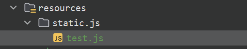

```js
let a = 1;
console.log(a)
```

> 这样，我们就可以访问所有的静态资源和健康检查请求了，如下:

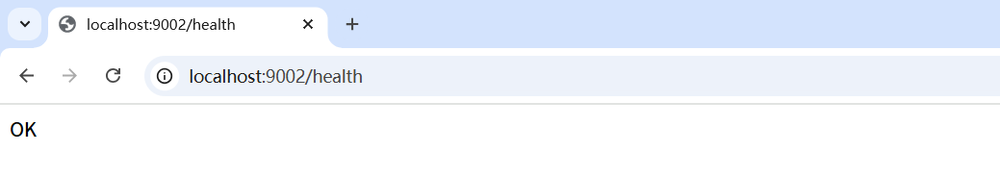

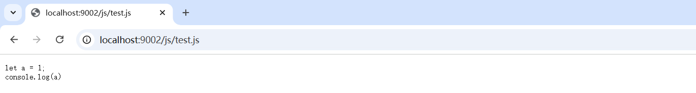

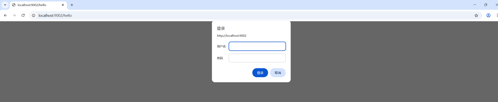

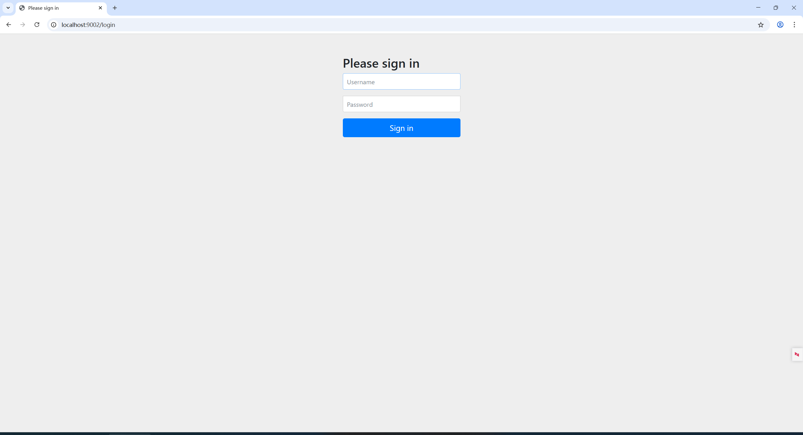

> 登录后：

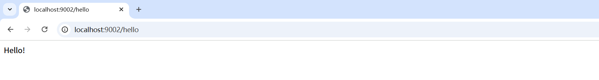

## 【11】使用数据库中的用户名和密码

> 目前看, 登录界面的用户名和密码是系统固定为user，密码系统生成的。那么我希望用户和密码通过数据库查询到的。

```java
// 配置中添加如下代码：
// 自定义使用数据库中的用户名和密码来进行认证登录  用用户自定义的仓库查询来代替认证
http.authenticationManager(new UserDetailsRepositoryReactiveAuthenticationManager(LoginReactiveUserDetailsService));
```

> `LoginReactiveUserDetailsService.java`

```java
package com.learn.spring.reactive.security.component;

import jakarta.annotation.Resource;
import org.springframework.r2dbc.core.DatabaseClient;
import org.springframework.security.core.userdetails.ReactiveUserDetailsService;
import org.springframework.security.core.userdetails.User;
import org.springframework.security.core.userdetails.UserDetails;
import org.springframework.stereotype.Component;
import reactor.core.publisher.Mono;

import java.util.stream.Collectors;

/**
 * @author qianpengzhan
 * @since 2025/7/21 17:42
 */
@Component
public class LoginReactiveUserDetailsService implements ReactiveUserDetailsService {


    @Resource
    private DatabaseClient databaseClient;

    @Override
    public Mono<UserDetails> findByUsername(String username) {
        String sql = """
                select tu.user_id,tu.user_name,tu.user_password,tr.role_id,tr.role_name,tr.remark as rRemark,tp.permission_id ,tp.permission_code ,tp.permission_name ,tp.remark  as pRemark
                 from t_user tu
                 left join t_user_role tur on tu.user_id  = tur.user_id
                 left join t_role tr on tr.role_id  = tur.role_id
                 left join t_role_permission trp on tr.role_id  = trp.role_id
                 left join t_permission tp on tp.permission_id  = trp.permission_id
                 where  tu.user_name = ? order by tu.user_id,tr.role_id,tp.permission_id 
                """;

        Mono<UserDetails> next = databaseClient.sql(sql)
                .bind(0, username)
                .fetch()
                .all()
                .bufferUntilChanged(map -> Long.parseLong(map.get("user_id").toString()))
                .map(list -> {
                    Collection<SimpleGrantedAuthority> authorities = list.stream().map(ele -> ele.get("role_name").toString()).distinct().map(role -> new SimpleGrantedAuthority("ROLE_" + role)).collect(Collectors.toList());
                    authorities.addAll(list.stream().map(ele -> ele.get("permission_code").toString()).distinct().map(SimpleGrantedAuthority::new).toList());
                    System.out.println(authorities);  // [ROLE_admin, login, logout, hello, world]
                    return User.withUsername(username)
                            .password(list.get(0).get("user_password").toString())
                            //.passwordEncoder()  这里不填密码加密的类型 默认就是  PasswordEncoderFactories.createDelegatingPasswordEncoder();
                            .authorities(authorities)
                            .build();
                }).next();
        //next.subscribe(userDetails -> System.out.println("userDetails = " + userDetails));
        return next;
    }
}
```

```java
    @Test
    public void test() {
        // 这个是密码的加密 把数据库中的123456 改为这个新生成的加密的密码
        System.out.println(PasswordEncoderFactories.createDelegatingPasswordEncoder().encode("123456"));
    }

```

> 这样就替代了默认的用户名密码了。
>
> 启动服务，测试：


## 【12】控制角色和权限

> 需要每个接口的权限是那些角色、哪些权限来控制，需要在对应的接口上加注解，如下：

``` java
// 配置添加开启响应式方法权限的开关
@EnableReactiveMethodSecurity
public class SecurityConfig {
```

```java
package com.learn.spring.reactive.security.controller;

import org.springframework.security.access.prepost.PreAuthorize;
import org.springframework.web.bind.annotation.GetMapping;
import org.springframework.web.bind.annotation.RestController;
import reactor.core.publisher.Mono;

/**
 * @author qianpengzhan
 * @since 2025/7/21 17:28
 */
@RestController
public class HelloController {

    @PreAuthorize(value = "hasRole('admin')")
    @GetMapping("/hello")
    public Mono<String> hello() {
        return Mono.just("Hello!");
    }

    @PreAuthorize(value = "hasRole('temp1')")
    @GetMapping("/world")
    public Mono<String> world() {
        return Mono.just("world!");
    }
}
```

> 启动服务，测试下:


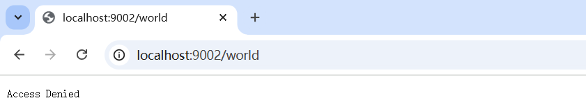

> 至此，简单的集成就完毕了.

## 参考资料

- [SpringBoot3响应式编程精讲](https://www.bilibili.com/video/BV1gsYEeLEuM?spm_id_from=333.788.videopod.episodes&vd_source=65c7f6924d2d8ba5fa0d4c448818e08a)
- [官网](https://docs.spring.io/spring-security/reference/reactive/getting-started.html)

