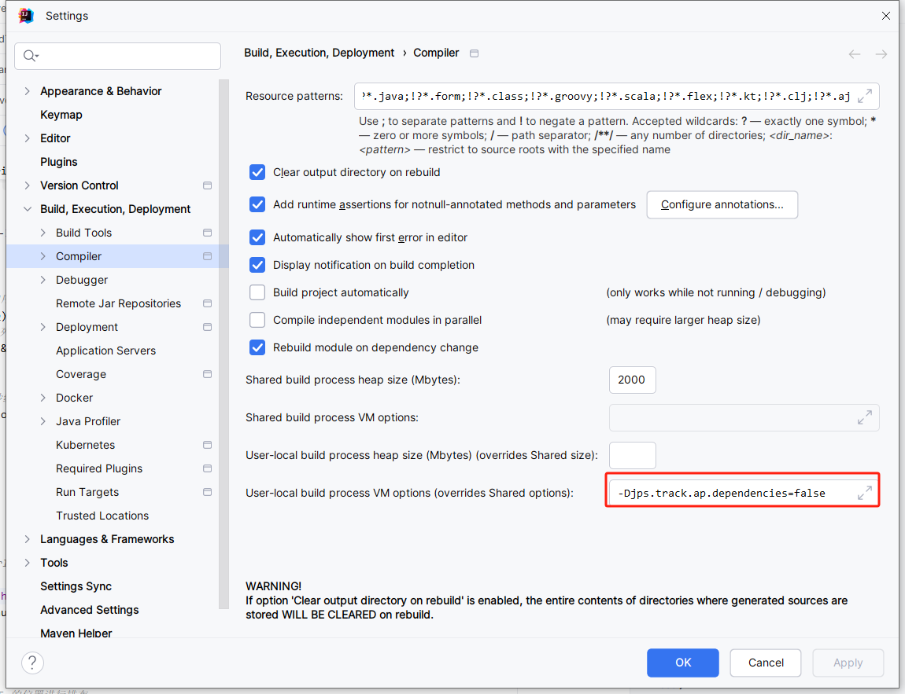

# 【Intellj Idea】idea启动时报错java: Internal error in the mapping processor: java.lang.NullPointerException

[[toc]]

> 说在前面的话，本文为日常开发过程中遇到的一些问题，整理记录成模块，方面后续遇到直接查询解决。

::: info 原因

原因：这个错误是在使用Java的[注解处理器](https://so.csdn.net/so/search?q=注解处理器&spm=1001.2101.3001.7020)（如Jackson的注解处理库或者是DataBinding库）进行数据绑定映射时发生的内部错误。错误信息表明出现了一个`NullPointerException`，即在处理映射时尝试访问或操作了一个为`null`的对象。

:::

::: important 解决方案

本地jvm增加配置：`-Djps.track.ap.dependencies=false`

:::