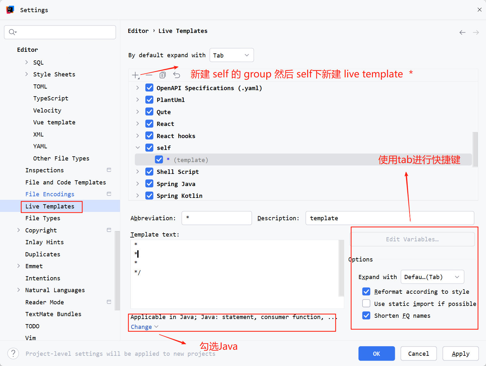

# 【Intellj Idea】 配置Java method Live template



>  具体的`Template Text` 如下：
>
>  ```java
>  *
>  * 
>  *
>  $params$ $return$
>  * @author qianpengzhan
>  */
>  ```
>
>  动态表达式如下:
>
>  - `params`
>
>  ```groovy
>  groovyScript("def result=''; def params=\"${_1}\".replaceAll('[\\\\[|\\\\]|\\\\s]', '').split(',').toList(); if(params.size() == 1 && params[0] == '') return ''; for(i = 0; i < params.size(); i++) {result+='* @param ' + params[i] + ((i < params.size() - 1) ? '\\n ' : '')};return result", methodParameters()) 
>  ```
>
>  - `return`
>
>  ```groovy
>  groovyScript("def rt = \"${_1}\"; return rt == 'void' ? '' : '\\n* @return {@link ' + (rt.contains('<') ? rt.split('<')[0] : rt) + '}'", methodReturnType())
>  ```